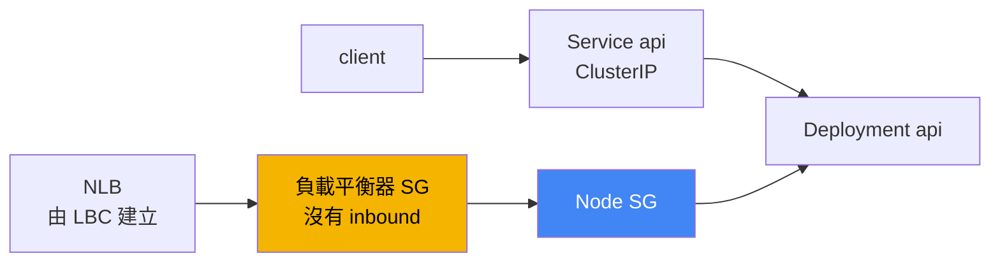
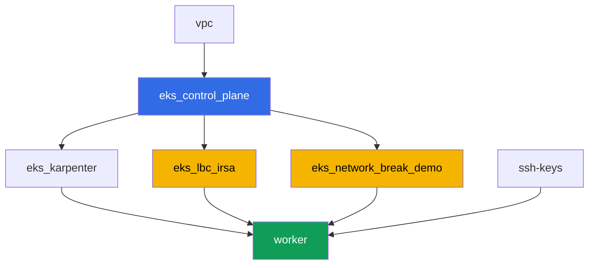

[Русская версия](README_RU.MD) · [Eng version](README.MD) · [Versión en español](README_ES.MD) · [Version française](README_FR.MD) · [Deutsche Version](README_DE.MD) · [ქართული ვერსია](README_GE.MD) · [日本語版](README_JP.MD)

# 實驗 120 - troubleshooting:網路故障與負載平衡器目標不健康

## 說明

叢集已經啟動,node 都是 `Ready`,但網路卻以兩種不同的方式出問題:一邊是
連線中斷,另一邊是負載平衡器的目標變紅。在這個實驗中,你會處理正好一種
故障類型 - security group - 並學會把它和 DNS(在這裡並不是問題所在)區分
開來。這裡有一個確定性的故障:terraform 事先建立了一個沒有任何 inbound
規則的空 security group。你把它掛到 Network Load Balancer 上,作為負載
平衡器自己的 SG,觀察目標變成 `unhealthy`,用 AWS CLI 指令診斷原因,再用
同一個工具修復它 - `aws ec2 authorize-security-group-ingress`。

設計決策。同一份 terraform 設定必須在每次實驗執行時都確定性地重現這個故障,
所以故障的來源正是唯一一個事先建立、沒有任何 inbound 規則的空 security
group。它在這個實驗中的角色是 NLB 自己的 security group(Service 的
annotation `aws-load-balancer-security-groups`)。一旦你在負載平衡器上明確
設定了自己的 SG,AWS Load Balancer Controller 就會停止幫你把缺少的 inbound
規則加到 node SG 上 - 這正好對應第 46.6 章的那句話:「目標的 SG 不允許
來自負載平衡器 SG 的流量通過到 check port」。這個實驗中 pod 之間的連線
(任務 1-2)按設計是正常運作的 - 它是一個對照範例,也是練習第 46.7 章診斷
指令的場地,而唯一真正的故障存在於 NLB 的情境中(任務 4-6)。pod 自己的
SG(security groups for pods)這個情境是另一堂課程實驗的主題。

任務以正式環境(production)的風格撰寫:一段簡短的說明,加上驗收標準。
檢查是自動的,透過 `check_result` 指令進行。

## 目標

鞏固這個課程章節的內容:

- [第 46 章。網路故障:SG、NACL、DNS、目標不健康](../../course/46/ru.md)

## 我們要建立什麼

叢集已經以程式碼(code)的形式部署好(和實驗 101 一樣的基礎),再加上一個
給 AWS Load Balancer Controller 使用的 IRSA role,以及一個沒有 inbound
規則的獨立「損壞的」security group。

| 物件 | 是什麼 | 為什麼在這個實驗裡 |
|--------|---------|-------------------|
| Namespace `eks-120` | 用來承載這個實驗工作負載的叢集區塊 | 讓實驗的資源保持獨立 |
| Deployment `api`(2 個副本) | ping_pong 應用程式,port `8080` | 連線檢查與 NLB 的目標 |
| Service `api`(ClusterIP) | `80 -> 8080` | 叢集內部的基準連線 |
| Deployment `client` | busybox,`sleep` | 對 `api` 發出請求的來源 |
| 元件 `eks_network_break_demo` | 沒有 inbound 規則的空 SG | 故障本身(第 46.3、46.6 章) |
| 元件 `eks_lbc_irsa` | 給 controller 使用的 IRSA role | Helm 安裝時所需 ELBv2 API 的權限 |
| Service `api-lb`(LoadBalancer) | 以「損壞的」SG 作為負載平衡器 SG 的 NLB | 重現目標不健康的情況(第 46.6 章) |

最終的流量圖:



## 基礎架構

這個環境透過 Terragrunt 部署在 AWS(`eu-central-1`)。每個實驗目錄都是一個
元件,擁有自己的 `terragrunt.hcl`,參照 `terraform/modules/` 中共用的模組,
並透過 `dependency` 區塊宣告依賴關係。

### 模組與依賴關係

| 目錄(元件) | 模組(`terraform/modules/`) | 依賴 | 建立了什麼 |
|---------------------|-------------------------------|------------|-------------|
| `vpc` | `vpc_v3` | - | VPC `10.10.0.0/16`,兩個 AZ 中的子網路,NAT |
| `ssh-keys` | `ssh-keys` | - | worker 機器使用的 SSH key pair |
| `eks_control_plane` | `eks_v2_control_plane` | `vpc` | EKS control plane `1.36`、OIDC、node SG |
| `eks_fargate_system` | `eks_v2_fargate` | `vpc`、`eks_control_plane` | 給 `kube-system` 與 `karpenter` 使用的 Fargate profile |
| `eks_addons` | `eks_v2_addons` | `eks_control_plane`、`eks_fargate_system` | coredns、kube-proxy、vpc-cni、pod-identity 等 addon |
| `eks_karpenter` | `eks_v2_karpenter` | `vpc`、`eks_control_plane`、`eks_addons`、`eks_fargate_system` | Karpenter controller、node 的 IAM role |
| `eks_karpenter_default_vng` | `eks_v2_karpenter_vng` | `vpc`、`eks_control_plane`、`eks_karpenter` | 建立在 AL2023 上的預設 NodePool |
| `eks_lbc_irsa` | `eks_v2_lbc_irsa` | `eks_control_plane` | 給 AWS Load Balancer Controller 使用的 IAM IRSA role |
| `eks_network_break_demo` | `eks_v2_network_break_demo` | `vpc`、`eks_control_plane` | 沒有 inbound 規則的空 SG |
| `worker` | `eks_v2_work_pc` | `ssh-keys`、`vpc`、`eks_control_plane`、`eks_karpenter`、`eks_lbc_irsa`、`eks_network_break_demo` | 具備 `check_result` 的 worker 機器 |

模組 `eks_v2_network_break_demo` 剛好建立一個 security group,帶有正確的
描述,但完全沒有任何 inbound 規則(只有 allow-all 的 egress,所以這個 SG
的行為是可預期的,不會干擾對外流量的診斷)。SG 的名稱是由 `prefix` 和
`app_name` 可預測地組合而成的:`eks-task120-network-break-sg`。這個資源
本身並不知道它會被掛到哪裡 - 這要由學員依照任務 4 的指示自行決定。

依賴關係圖(愈早 apply 的元件,在箭頭圖中的位置愈低):



元件 `eks_fargate_system`、`eks_addons`、`eks_karpenter_default_vng` 沒有
顯示在圖上,以便讓節點數保持在 8 個以內 - 它們會依照標準順序,在
`eks_control_plane` 和 `eks_karpenter` 之間套用,和實驗 101 一樣。

### 可預測的資源名稱

`eks_network_break_demo` 和 `eks_lbc_irsa` 會用 `prefix` 和 `app_name` 組合
出它們的名稱,所以 worker 不需要讀取 terraform output 就能找到它們。這些
資訊記錄在 worker 機器上的檔案 `~/lab120_hints.txt` 中:

| 資源 | 如何找到它 |
|--------|-----------|
| 「損壞的」SG | 名稱 `eks-task120-network-break-sg` |
| 給 LBC 使用的 IRSA role | role 名稱 `<cluster-name>-lbc-irsa` |
| Karpenter node SG | 標籤 `karpenter.sh/discovery=<cluster-name>` |

### 各項設定的位置

`env.hcl`(共用的環境參數):

| 參數 | 這個實驗中的值 | 影響什麼 |
|----------|-----------------|---------------|
| `region` | `eu-central-1` | 所有資源的地區 |
| `prefix` | `eks-task120` | 資源名稱的前綴,包括「損壞的」SG |
| `stack_name` | `eks120` | 用於組出 `env_name` - 叢集名稱 |
| `k8_version` | `1.36.0` | worker 機器上的 kubectl 版本 |

每個元件 `terragrunt.hcl` 中的 `inputs`:

| 檔案 | 主要設定 |
|------|--------------------|
| `eks_network_break_demo/terragrunt.hcl` | 叢集的 `vpc_id`,「損壞的」SG 沒有規則的輸入 |
| `eks_lbc_irsa/terragrunt.hcl` | trust policy 所需的 `name`(叢集)與 `oidc_provider_arn` |
| `worker/terragrunt.hcl` | 這個實驗檔案所需的 `test_url`、`task_script_url` |

## 部署

```bash
TASK=120 make run_eks_task
```

部署大約需要 15-20 分鐘。在輸出裡找到連到 worker 機器的 SSH 連線那一行,
連上去。那裡的 kubectl 已經設定好對應正確的叢集,實驗的資源名稱都在
`~/lab120_hints.txt` 中。

worker 機器上的實用指令:

```bash
time_left       # 環境還剩多少時間
check_result    # 檢查解答
cat ~/lab120_hints.txt   # 這個實驗資源的名稱與 ARN
```

> 環境的安全性。`env.hcl` 中啟用了 `ssh_password_enable = true` 與
> `access_cidrs = ["0.0.0.0/0"]` - 這對訓練環境來說很方便,但正式環境中
> 絕對不能這麼做。依照課程標準(第 0.2、2、19 章),對 worker 機器的存取
> 應該透過 AWS SSM Session Manager 開啟,不對外開放公開的 SSH port,
> `access_cidrs` 也應該縮小到特定的位址範圍。這裡保留公開 SSH 只是為了
> 讓設定保持簡單。

## 任務

第一個區塊(任務 1-2)是叢集內部的基準連線,運作正常,是練習第 46.7 章
診斷指令的場地。第二個區塊(任務 3-6)是這個實驗中唯一真正的故障:由
SG 造成的 NLB 目標不健康(第 46.6 章)。第三個區塊(任務 7-8)是 DNS
的健全性檢查與最終檢查清單。

---
|        **1**        | **Namespace 與這個實驗的工作負載**                                |
| :-----------------: | :----------------------------------------------------------- |
| 要做什麼          | 建立一個名為 `eks-120` 的 namespace。在裡面建立 Deployment `api`(映像 `viktoruj/ping_pong:latest`、`2` 個副本、`containerPort: 8080`、標籤 `app: api`)與 Service `api`,類型為 `ClusterIP`(`port: 80`、`targetPort: 8080`、selector `app: api`)。建立 Deployment `client`(映像 `busybox:1.36`、指令 `sleep 3600`、標籤 `app: client`)。等待兩個 Deployment 都變成 ready。 |
| 驗收標準    | - namespace `eks-120` 存在;<br/>- Deployment `api`(`2/2` 副本,映像 `ping_pong`);<br/>- Deployment `client`(`1/1`,映像 `busybox`);<br/>- Service `api` ClusterIP,`targetPort: 8080`。 |
---
|        **2**        | **基準連線與 SG 診斷**                       |
| :-----------------: | :------------------------------------------------------------ |
| 要做什麼          | 從 `client` pod,透過 service 的 DNS 名稱(`wget -qO- --timeout=5 http://api.eks-120.svc.cluster.local` 或等效的 curl 指令)對 `api` 發出請求,並把回應存到 `/var/work/tests/artifacts/2/connectivity.txt` - 裡面應該包含應用程式回應的那一行。接著取得一個 `api` pod 的 IP,找出它的 ENI:`aws ec2 describe-network-interfaces --filters "Name=addresses.private-ip-address,Values=<ip>" --query 'NetworkInterfaces[0].Groups'`,把輸出存到 `/var/work/tests/artifacts/2/api_sg.txt`。要注意 filter:使用 VPC CNI 時,pod 的 IP 是 node ENI 上的次要位址,所以用 `private-ip-address` 搜尋會回傳 `null` - 你需要的是 `addresses.private-ip-address`。這裡的連線運作正常:node SG 允許叢集 pod 之間的流量,而且 SG 是 stateful 的,所以回應流量會自動通過(第 46.3 章)。 |
| 驗收標準    | - `2/connectivity.txt` 不是空的,包含 `Server Name`;<br/>- `2/api_sg.txt` 不是空的,包含 `GroupId` 與叢集 node SG 的 id。 |
---
|        **3**        | **安裝 AWS Load Balancer Controller**                   |
| :-----------------: | :------------------------------------------------------------ |
| 要做什麼          | 找出 terraform 為 controller 建立的 IAM role 的 ARN(role 名稱 `<cluster-name>-lbc-irsa`,可在 `~/lab120_hints.txt` 中找到),在 `kube-system` 中建立 ServiceAccount `aws-load-balancer-controller`,加上指向這個 role 的 annotation `eks.amazonaws.com/role-arn`。透過 Helm(repository `https://aws.github.io/eks-charts`,chart `aws-load-balancer-controller`)安裝 AWS Load Balancer Controller,帶上參數 `--set serviceAccount.create=false --set serviceAccount.name=aws-load-balancer-controller` 與 `--set clusterName=<cluster name>`。注意:這個環境中 `kube-system` 落在 Fargate profile 下,而 Fargate 沒有 IMDS,所以 controller 無法自行判斷 region 和 VPC,會失敗並顯示提到 `ec2imds` 的錯誤。要明確設定:`--set region=eu-central-1` 與 `--set vpcId=<vpc-id>`(id 可以用 `aws eks describe-cluster --name <cluster> --query 'cluster.resourcesVpcConfig.vpcId'` 取得)。等待 Deployment `aws-load-balancer-controller` 變成 ready。 |
| 驗收標準    | - `kube-system` 中的 ServiceAccount `aws-load-balancer-controller`,帶有指向 `lbc-irsa` role 的 annotation;<br/>- Deployment `aws-load-balancer-controller` 至少有一個 ready 的副本。 |
---
|        **4**        | **症狀:NLB 目標不健康**                          |
| :-----------------: | :------------------------------------------------------------ |
| 要做什麼          | 找出「損壞的」SG 的 id(名稱 `eks-task120-network-break-sg`,可在 `~/lab120_hints.txt` 中找到)。建立 Service `api-lb`,類型為 `LoadBalancer`,selector `app: api`,`port` 為 `80`,`targetPort: 8080`,並加上 annotation `service.beta.kubernetes.io/aws-load-balancer-type: external`、`aws-load-balancer-nlb-target-type: ip`、`aws-load-balancer-scheme: internet-facing`、`aws-load-balancer-security-groups: <損壞 SG 的 id>`。這個 annotation 會讓「損壞的」SG 成為負載平衡器自己的 SG - 它沒有任何 inbound 規則,所以 LBC 不會自動加上 health check 所缺少的規則。等待外部位址出現,然後執行 `aws elbv2 describe-target-health --target-group-arn <arn> --query 'TargetHealthDescriptions[].[Target.Id,TargetHealth.State,TargetHealth.Reason]'`,把輸出存到 `/var/work/tests/artifacts/4/unhealthy.txt`。 |
| 驗收標準    | - Service `api-lb` 帶有這三個 annotation,並且有外部位址;<br/>- `4/unhealthy.txt` 不是空的,包含 `unhealthy`。 |
---
|        **5**        | **診斷:是誰的 SG 擋住了 health check**               |
| :-----------------: | :------------------------------------------------------------ |
| 要做什麼          | 執行 `aws ec2 describe-security-groups --group-ids <損壞 SG 的 id>`,確認它完全沒有任何 inbound 規則。找出 Karpenter node SG 的 id(標籤 `karpenter.sh/discovery=<cluster-name>`,指令在 `~/lab120_hints.txt` 中),並在 `/var/work/tests/artifacts/5/diagnosis.txt` 中說明為什麼 NLB 的 health check 到不了 `api` pod:目標的 SG(node SG)不允許來自負載平衡器 SG、在 check port 上的 inbound 流量(第 46.6 章)。文字內容必須包含 `security group` 和 `health check` 這兩個詞。 |
| 驗收標準    | - `5/diagnosis.txt` 不是空的,包含 `security group` 與 `health check`。 |
---
|        **6**        | **修復:authorize-security-group-ingress,目標變健康**    |
| :-----------------: | :------------------------------------------------------------ |
| 要做什麼          | 新增兩條規則:`aws ec2 authorize-security-group-ingress --group-id <node SG> --protocol tcp --port 8080 --source-group <損壞 SG>`(從負載平衡器的 SG 到 node SG,開放 health check 與應用程式流量)以及 `aws ec2 authorize-security-group-ingress --group-id <損壞 SG> --protocol tcp --port 80 --cidr 0.0.0.0/0`(為客戶端開放 NLB 的 listener)。等待 `describe-target-health` 顯示 `healthy`,並用 `curl` 對 NLB 的外部位址成功發出請求。把兩者的輸出都存到 `/var/work/tests/artifacts/6/healthy.txt`。 |
| 驗收標準    | - `6/healthy.txt` 不是空的,包含 `healthy`,且不包含 `FailedHealthChecks`;<br/>- 檔案中有一行是應用程式的回應(`Server Name`)。 |
---
|        **7**        | **DNS 正常運作:對照檢查**                        |
| :-----------------: | :------------------------------------------------------------ |
| 要做什麼          | 執行 `kubectl run dnstest --image=busybox:1.36 --rm -i --restart=Never -- sh -c 'nslookup kubernetes.default.svc.cluster.local; nslookup example.com'`,把輸出存到 `/var/work/tests/artifacts/7/dns.txt`。用完整的 FQDN 查詢內部名稱:從 busybox 查詢簡短的 `kubernetes.default` 會回傳 `NXDOMAIN`,因為它的 `nslookup` 不會自動加上 search domain,而這個回應很容易被誤認為一個實際上不存在的 DNS 故障。在這個實驗中,DNS 不是問題的來源 - 兩個名稱都能正常解析,這一點和任務 4-6 中的 security group 不同(第 46.5、46.7 章)。 |
| 驗收標準    | - `7/dns.txt` 不是空的,包含 `kubernetes.default` 與 `example.com`。 |
---
|        **8**        | **最終檢查清單:症狀 - 可能原因 - 該檢查什麼**       |
| :-----------------: | :------------------------------------------------------------ |
| 要做什麼          | 依照第 46.7 章的檢查清單,為這個實驗的症狀填寫一行,存到檔案 `/var/work/tests/artifacts/8/summary.txt` 中:觀察到什麼症狀(`unhealthy` 目標)、可能的原因是什麼(`security group` 擋住了 `health check`),以及用哪個指令來檢查(`describe-target-health`)。文字內容必須包含 `unhealthy`、`security group` 與 `health check` 這幾個詞。 |
| 驗收標準    | - `8/summary.txt` 不是空的,包含 `unhealthy`、`security group`、`health check`。 |
---

## 檢查結果

在 worker 機器上執行自動檢查:

```bash
check_result
```

這個腳本會執行測試,並顯示已完成任務的百分比。

## 解決方案

參考解答:[worker/files/solutions/1_TW.MD](worker/files/solutions/1_TW.MD)

## 刪除叢集與資源

> **先移除 controller 建立的東西,再執行 terraform。** NLB 是由 AWS Load
> Balancer Controller 根據你的 Service 建立的,terraform 並不知道它的
> 存在。如果你在刪除 Service 之前就把整套 stack 拆掉,controller 會隨著
> 叢集一起消失,NLB 卻會留下來,它的 ENI 會一直佔用著 security group -
> 於是 `destroy` 就會卡在
> `aws_security_group.network_break: Still destroying...` 幾十分鐘。
>
> **controller 不會清理你在任務 6 中新增到 node SG 的那條規則**,這是這個
> 實驗情境直接造成的結果。controller 只會清理它自己擁有的東西:它建立的
> NLB 和 security group。這裡的前端 security group 是透過
> `aws-load-balancer-security-groups` annotation 手動設定的,而在這種模式
> 下,LBC 預設完全不會去動後端 security group(也就是 node SG)的規則 -
> 這正是為什麼 health check 會失敗。你是透過 AWS CLI 手動加上這條規則的,
> 它在叢集中沒有擁有者,所以你也要手動移除它。這一點很重要:另一個
> security group 對它的引用會阻止刪除目標 SG,`destroy` 反而會卡在這裡。
> 如果你當初設定了
> `service.beta.kubernetes.io/aws-load-balancer-manage-backend-security-group-rules: "true"`,
> controller 本身就會在 node SG 中新增和移除規則。

```bash
# 1. 刪除 Service,讓 controller 自己移除 NLB,並等待 ENI 消失
kubectl delete svc api-lb -n eks-120
SG_ID=$(grep '^broken_sg_id' ~/lab120_hints.txt | awk '{print $3}')
NODE_SG=$(grep '^node_sg_id' ~/lab120_hints.txt | awk '{print $3}')
until [ "$(aws ec2 describe-network-interfaces \
  --filters "Name=group-id,Values=${SG_ID}" --query 'length(NetworkInterfaces)' --output text)" = "0" ]; do
  echo "NLB still holds the ENI, waiting..."; sleep 15
done

# 2. 移除 node SG 中引用負載平衡器 SG 的那條規則
aws ec2 revoke-security-group-ingress --group-id "$NODE_SG" \
  --protocol tcp --port 8080 --source-group "$SG_ID"

# 3. 刪除這個實驗的 namespace,現在才拆掉整套 stack
kubectl delete namespace eks-120
```

```bash
TASK=120 make delete_eks_task
```

如果 `destroy` 仍然卡在刪除某個 security group 上,找出是什麼在佔用它,
並移除它:

```bash
# 誰在佔用這個 SG:一個孤立負載平衡器的 ENI
aws ec2 describe-network-interfaces --filters "Name=group-id,Values=<sg-id>" \
  --query 'NetworkInterfaces[].[NetworkInterfaceId,Description]' --output table
# 可以透過標籤 service.k8s.aws/stack 和 elbv2.k8s.aws/cluster 找出孤立的負載平衡器
aws elbv2 delete-load-balancer --load-balancer-arn <arn>
# 哪些 security group 在自己的規則中引用了它
aws ec2 describe-security-groups --filters "Name=ip-permission.group-id,Values=<sg-id>" \
  --query 'SecurityGroups[].[GroupId,GroupName]' --output table
```
