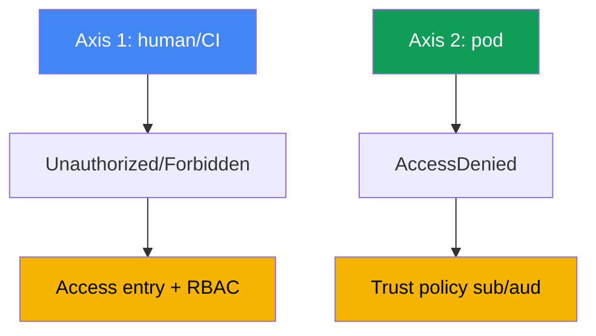
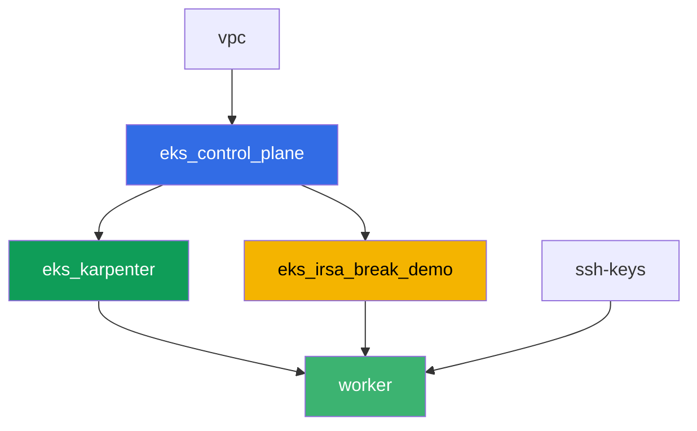

[Русская версия](README_RU.MD) · [Versión en español](README_ES.MD) · [Version française](README_FR.MD) · [Deutsche Version](README_DE.MD) · [ქართული ვერსია](README_GE.MD) · [繁體中文版](README_TW.MD) · [日本語版](README_JP.MD)

# Lab 121 - Troubleshooting: access denied (access entries, IRSA, webhook, kubeconfig)

## Description

EKS access breaks at two independent layers, and it's easy to mix them up. The first one:
a human or CI cannot get into the cluster at all - `kubectl` returns `Unauthorized` or
`Forbidden` before it even reaches a specific resource. The second one: a pod with IRSA
configured gets `AccessDenied` on an AWS call, even though the ServiceAccount annotation
looks correct. In this lab you reproduce both symptoms from scratch, diagnose the cause
with precise commands, and fix each one with the tool designed for it: an access entry for
the first layer, a trust policy for the second.

Tasks are written in a production style: a short statement plus acceptance criteria.
Checking is automatic, via the `check_result` command.

## Goal

Reinforce the material from this course chapter:

- [Chapter 47. Access and IAM: access entries, IRSA, webhook, kubeconfig](../../course/47/en.md)

## What we're creating

Terraform pre-creates an S3 bucket and an IRSA role with a trust policy on a specific
ServiceAccount. You recreate both access-denial situations and both fixes.

| Object | What it is | Why it's in this lab |
|--------|---------|-------------------|
| Namespace `eks-121` | a cluster section for the lab's workload | keeps resources separate from system ones |
| Component `eks_irsa_break_demo` | S3 bucket, IRSA role trusting `demo-reader` | a ready target for the correct and broken annotation |
| Test IAM role (`-test-` in the name) | a principal with no access entry | reproduces `Unauthorized` (the human axis) |
| Access entry + `AmazonEKSViewPolicy` | the `Unauthorized` fix | turns an unmapped identity into a cluster reader |
| ServiceAccount `demo-reader` (eks-121) | correct annotation on the IRSA role | `sub` in the token matches the trust policy - the pod reads S3 |
| ServiceAccount `demo-reader-broken` (default) | the same role, a different namespace | `sub` doesn't match - `AccessDenied` (the pod axis) |

The two access axes and their fixes:



## Infrastructure

The environment is deployed in AWS (`eu-central-1`) via Terragrunt. The base matches lab
101 (control plane, Fargate for system pods, Karpenter for workload), plus a separate
component for the IRSA demo resources.

### Modules and dependencies

| Directory (component) | Module (`terraform/modules/`) | Depends on | What it creates |
|---------------------|-------------------------------|------------|-------------|
| `vpc` | `vpc_v3` | - | VPC `10.10.0.0/16`, subnets in two AZs, NAT |
| `ssh-keys` | `ssh-keys` | - | an SSH key pair for the worker machine and nodes |
| `eks_control_plane` | `eks_v2_control_plane` | `vpc` | EKS control plane `1.36`, OIDC provider |
| `eks_fargate_system` | `eks_v2_fargate` | `vpc`, `eks_control_plane` | Fargate profile for `kube-system` and `karpenter` |
| `eks_addons` | `eks_v2_addons` | `eks_control_plane`, `eks_fargate_system` | coredns, kube-proxy, vpc-cni, eks-pod-identity-agent |
| `eks_karpenter` | `eks_v2_karpenter` | `vpc`, `eks_control_plane`, `eks_addons`, `eks_fargate_system` | Karpenter controller, node IAM role |
| `eks_karpenter_default_vng` | `eks_v2_karpenter_vng` | `vpc`, `eks_control_plane`, `eks_karpenter` | default NodePool `default` on AL2023 |
| `eks_irsa_break_demo` | `eks_v2_irsa_break_demo` | `eks_control_plane` | S3 bucket, IRSA role trusting `eks-121/demo-reader` |
| `worker` | `eks_v2_work_pc` | `ssh-keys`, `vpc`, `eks_control_plane`, `eks_karpenter`, `eks_irsa_break_demo` | worker machine with kubectl, tests, and `check_result` |

The worker's role carries a separate permission to manage, and to `sts:AssumeRole`, roles
with `-test-` in the name - that's what lets you reproduce `Unauthorized` from task 2
without going beyond the lab's own permissions.

Dependency graph (what gets applied earlier is lower down the arrow):



Components `eks_fargate_system`, `eks_addons`, and `eks_karpenter_default_vng` aren't shown
on the graph to keep it under the 8-node limit, but they actually sit between
`eks_control_plane` and `eks_karpenter` (see the table above).

### Predictable resource names

`eks_irsa_break_demo` assembles names from `prefix` and `app_name`, so the worker finds
them without reading terraform output. They live in the `~/lab121_hints.txt` file on the
worker machine:

| Resource | Name |
|--------|-----|
| S3 bucket | `eks-task121-irsa-break-demo-bucket` |
| IRSA role | `eks-task121-irsa-break-demo-irsa-role` |

### Where things are configured

`env.hcl` (shared environment parameters):

| Parameter | Value in the lab | What it affects |
|----------|-----------------|---------------|
| `region` | `eu-central-1` | region for all resources |
| `prefix` | `eks-task121` | resource name prefix, including the bucket and role |
| `stack_name` | `eks121` | used to build `env_name` - the cluster name |
| `k8_version` | `1.36.0` | kubectl version on the worker machine |

`inputs` in each component's `terragrunt.hcl`:

| File | Key settings |
|------|--------------------|
| `eks_irsa_break_demo/terragrunt.hcl` | `irsa.namespace = "eks-121"`, `irsa.service_account_name = "demo-reader"` |
| `worker/terragrunt.hcl` | `test_url` and `task_script_url` for the lab 121 files, dependency on `eks_irsa_break_demo` |

## Deployment

```bash
TASK=121 make run_eks_task
```

Deployment takes roughly 15-20 minutes. In the output, find the line with the SSH connection
to the worker machine and connect to it. kubectl there is already configured for the right
cluster, and the lab's resource names and ARNs are in `~/lab121_hints.txt`.

Useful commands on the worker machine:

```bash
time_left       # how much environment time is left
check_result    # check the solution
cat ~/lab121_hints.txt   # bucket and IRSA role names and ARNs
```

> Environment security. `env.hcl` has `ssh_password_enable = true` and
> `access_cidrs = ["0.0.0.0/0"]` enabled - convenient for a training environment, but this
> is not something to do in production. Per the course standards (chapters 0.2, 2, 19),
> access to worker machines should go through AWS SSM Session Manager without exposing
> public SSH ports, and `access_cidrs` should be narrowed down to specific addresses. Here
> public SSH is left in place only to keep the setup simple.

## Tasks

Block 1 (tasks 1-4) covers the human/CI axis: why `kubectl` can't get into the cluster, and
which part of that chain is 401 versus 403. Block 2 (tasks 5-8) covers the pod axis: why an
application with IRSA gets `AccessDenied` even though the SA annotation is in place.

---
|        **1**        | **Namespace for the lab's workload**                             |
| :-----------------: | :---------------------------------------------------------- |
| What to do          | Create a namespace named `eks-121`. All objects in this lab are created inside it. |
| Acceptance criteria    | - namespace `eks-121` exists. |
---
|        **2**        | **Unauthorized symptom: a role with no access entry**             |
| :-----------------: | :---------------------------------------------------------- |
| What to do          | Create a test IAM role with `-test-` in the name (e.g. `eks-task121-test-noaccess`) that trusts the worker's role, with no access entry in the cluster at all. First, **using the worker's credentials**, build a separate kubeconfig: `aws eks update-kubeconfig --name <cluster> --kubeconfig /tmp/kubeconfig-test`. Order matters: this command calls `eks:DescribeCluster`, and the test role has no IAM policy at all, so under that role it would fail with `AccessDeniedException` and the file wouldn't be created (this is a third failure type - from IAM, never reaching the cluster). Then run `aws sts assume-role` on the test role, export its credentials into environment variables, and run `kubectl --kubeconfig /tmp/kubeconfig-test get pods -A`: the token via `aws eks get-token` will now come from the test role, and the API server will respond with `Unauthorized`. Save the output to `/var/work/tests/artifacts/2/unauthorized.txt`. |
| Acceptance criteria    | - file `2/unauthorized.txt` is not empty and contains `Unauthorized`. |
---
|        **3**        | **Fixing Unauthorized: access entry and AmazonEKSViewPolicy** |
| :-----------------: | :---------------------------------------------------------- |
| What to do          | Create an access entry for the test role (`aws eks create-access-entry ... --type STANDARD`) and associate it with the `AmazonEKSViewPolicy` policy at `cluster` scope. Repeat `kubectl get pods -A` with the same temporary kubeconfig (you may need to re-run assume-role) - it should now return the pod list, without `Unauthorized`. Save the output to `/var/work/tests/artifacts/3/authorized.txt`. |
| Acceptance criteria    | - file `3/authorized.txt` is not empty, contains a pod list header, and does not contain `Unauthorized`. |
---
|        **4**        | **Forbidden symptom: a View role can't write**             |
| :-----------------: | :---------------------------------------------------------- |
| What to do          | With the same temporary kubeconfig (the role only has `AmazonEKSViewPolicy`), run `kubectl create namespace test-forbidden` - it should return `Forbidden`. Save the output to `/var/work/tests/artifacts/4/forbidden.txt` and append an explanation of the difference between `Unauthorized` from task 2 and `Forbidden` from this task - both words must appear in the text. |
| Acceptance criteria    | - file `4/forbidden.txt` is not empty and contains both `Unauthorized` and `Forbidden`. |
---
|        **5**        | **A ServiceAccount with the correct IRSA annotation**              |
| :-----------------: | :---------------------------------------------------------- |
| What to do          | Create ServiceAccount `demo-reader` in `eks-121` with the `eks.amazonaws.com/role-arn` annotation set to the IRSA role ARN (`irsa_role_arn` from `~/lab121_hints.txt`). Create a pod with that SA (image `amazon/aws-cli:2.15.0`, command `sleep 3600`), run `aws sts get-caller-identity` inside it (it should show an `assumed-role` for that role), and read the `hello.txt` object from the bucket. Save both outputs to `/var/work/tests/artifacts/5/irsa_ok.txt`. |
| Acceptance criteria    | - SA `demo-reader` in `eks-121` with the `role-arn` annotation;<br/>- file `5/irsa_ok.txt` is not empty, contains `assumed-role` and `hello from s3`. |
---
|        **6**        | **AccessDenied symptom: a broken annotation in another namespace** |
| :-----------------: | :---------------------------------------------------------- |
| What to do          | Create a second ServiceAccount `demo-reader-broken` in namespace `default` with the SAME annotation on the same `role-arn`. The role's trust policy expects `sub` with namespace `eks-121`, not `default`, so the token exchange should fail. Create a pod with this SA in `default`, run `aws sts get-caller-identity` - it should return `AccessDenied` or a token exchange error (`WebIdentityErr`). Save the output to `/var/work/tests/artifacts/6/broken.txt`. |
| Acceptance criteria    | - SA `demo-reader-broken` in `default` with the annotation on the same `role-arn`;<br/>- file `6/broken.txt` is not empty and contains `AccessDenied`, `not authorized`, or `WebIdentityErr`. |
---
|        **7**        | **Diagnostics: comparing annotations by sub and namespace**      |
| :-----------------: | :---------------------------------------------------------- |
| What to do          | Compare the `eks.amazonaws.com/role-arn` annotation of the SA in both namespaces (`kubectl get sa ... -o jsonpath=...role-arn`) and explain in file `/var/work/tests/artifacts/7/diagnostics.txt` why the role's trust policy `sub` condition doesn't match in the second case. The text must include the words `sub` and `namespace`. |
| Acceptance criteria    | - file `7/diagnostics.txt` is not empty and contains `sub` and `namespace`. |
---
|        **8**        | **Summary: the two access axes**                                  |
| :-----------------: | :---------------------------------------------------------- |
| What to do          | Save to file `/var/work/tests/artifacts/8/summary.txt` a comparison of the two axes (a human's `Unauthorized`/`Forbidden` versus a pod's `AccessDenied`) in 3-5 sentences. Mention `RBAC` and `trust policy` as the different repair mechanisms for the different layers. |
| Acceptance criteria    | - file `8/summary.txt` is not empty and contains `RBAC` and `trust policy`. |
---

## Checking the result

On the worker machine, run the automatic check:

```bash
check_result
```

The script will run the tests and show the percentage of completed tasks.

## Solution

Reference solution: [worker/files/solutions/1.MD](worker/files/solutions/1.MD)

## Deleting the cluster and resources

> **First remove the test IAM role.** You created role `eks-task121-test-noaccess` by hand
> via AWS CLI in task 2, it's not in terraform state, and `destroy` won't touch it. IAM
> roles live outside any region and outside the cluster, so it would otherwise stay in the
> account forever, and re-running the lab would fail `aws iam create-role` with
> `EntityAlreadyExists`. Deleting the access entry separately isn't required (it disappears
> with the cluster), but remove it too if you want to redo the lab on the same cluster.

```bash
CLUSTER_NAME=$(grep '^cluster_name' ~/lab121_hints.txt | awk '{print $3}')
TEST_ROLE_ARN=$(aws iam get-role --role-name eks-task121-test-noaccess \
  --query 'Role.Arn' --output text)

# the test role's access entry (needed if you're redoing the lab)
aws eks delete-access-entry --cluster-name "$CLUSTER_NAME" --principal-arn "$TEST_ROLE_ARN"

# the role itself: it has no policies attached, so it's deleted right away
aws iam delete-role --role-name eks-task121-test-noaccess
```

> **Remove the workload before destroy.** Pods `irsa-app` and `broken-app` made Karpenter
> bring up an EC2 node. The pods and ServiceAccounts themselves don't create AWS resources,
> but the node does, and if you tear down the stack with live workload still running, VPC
> CNI doesn't have time to remove its secondary ENIs. The ENI then stays in `available`
> state, holds onto the node security group, and `destroy` hangs on
> `module.eks.aws_security_group.node[0]: Still destroying...`. Let Karpenter drain the
> node properly: remove the workload and wait for the node to disappear.

```bash
kubectl delete pod irsa-app -n eks-121 --ignore-not-found
kubectl delete pod broken-app -n default --ignore-not-found
kubectl delete namespace eks-121 --ignore-not-found

# wait for Karpenter to remove its EC2 nodes (only fargate-* should remain)
while kubectl get nodes --no-headers 2>/dev/null | grep -qv fargate; do
  echo "Karpenter's EC2 node is still alive, waiting..."; sleep 15
done
```

```bash
TASK=121 make delete_eks_task
```

If the role fails to delete with a `DeleteConflict` error, it still has policies attached -
check and remove them:

```bash
aws iam list-attached-role-policies --role-name eks-task121-test-noaccess
aws iam list-role-policies --role-name eks-task121-test-noaccess
```

If `destroy` still gets stuck on the node security group, find the orphaned ENI and delete
it - terraform will then finish on its own:

```bash
# an ENI in available state tagged eks:eni:owner=amazon-vpc-cni is a leftover from VPC CNI
aws ec2 describe-network-interfaces --filters Name=status,Values=available \
  --query 'NetworkInterfaces[].[NetworkInterfaceId,Description,Groups[0].GroupName]' --output table
aws ec2 delete-network-interface --network-interface-id <eni-id>
```
