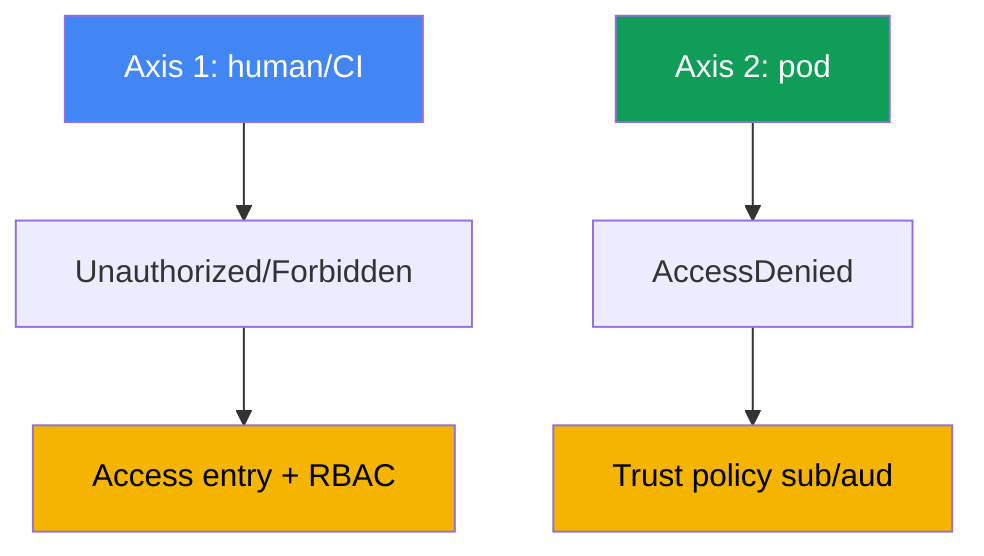
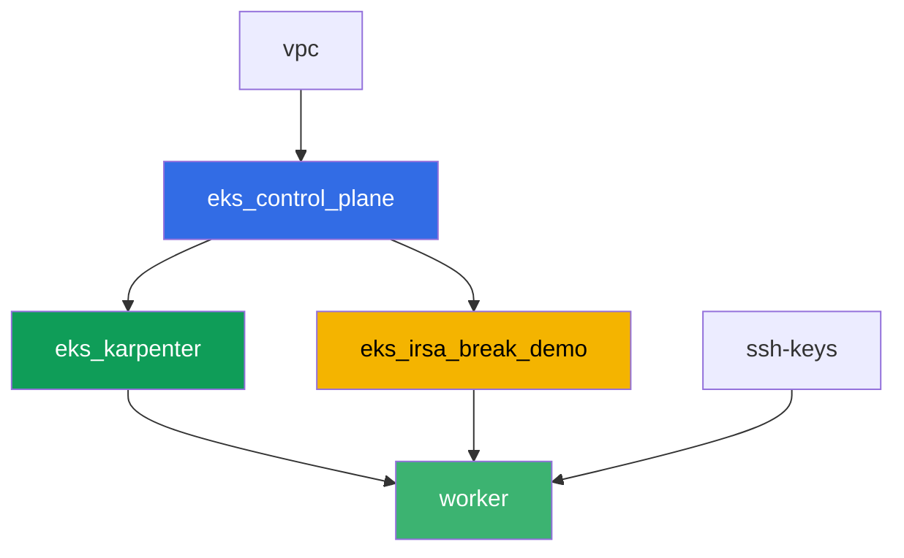

[Русская версия](README_RU.MD) · [Eng version](README.MD) · [Versión en español](README_ES.MD) · [Version française](README_FR.MD) · [ქართული ვერსია](README_GE.MD) · [繁體中文版](README_TW.MD) · [日本語版](README_JP.MD)

# Lab 121 - Fehlersuche: Zugriff verweigert (access entries, IRSA, webhook, kubeconfig)

## Beschreibung

Der EKS-Zugriff bricht an zwei unabhängigen Ebenen zusammen, und es ist leicht, diese zu
verwechseln. Die erste: ein Mensch oder eine CI kommt gar nicht in den Cluster - `kubectl`
liefert `Unauthorized` oder `Forbidden`, noch bevor eine konkrete Ressource erreicht wird.
Die zweite: ein Pod mit konfiguriertem IRSA erhält `AccessDenied` bei einem AWS-Aufruf,
obwohl die ServiceAccount-Annotation korrekt aussieht. In diesem Lab reproduzierst du beide
Symptome von Grund auf, diagnostizierst die Ursache mit präzisen Befehlen und behebst jedes
mit dem dafür vorgesehenen Werkzeug: einem access entry für die erste Ebene, einer trust
policy für die zweite.

Die Aufgaben sind im Produktionsstil geschrieben: eine kurze Aussage plus
Abnahmekriterien. Die Prüfung erfolgt automatisch über den Befehl `check_result`.

## Ziel

Vertiefe den Stoff aus diesem Kurskapitel:

- [Kapitel 47. Zugriff und IAM: access entries, IRSA, webhook, kubeconfig](../../course/47/ru.md)

## Was wir erstellen

Terraform legt im Voraus einen S3-Bucket und eine IRSA-Rolle mit einer trust policy für
einen bestimmten ServiceAccount an. Du reproduzierst beide Zugriffsverweigerungs-Situationen
und beide Korrekturen.

| Objekt | Was es ist | Warum es in diesem Lab vorkommt |
|--------|---------|-------------------|
| Namespace `eks-121` | ein Cluster-Bereich für die Workload dieses Labs | trennt die Ressourcen von Systemressourcen |
| Komponente `eks_irsa_break_demo` | S3-Bucket, IRSA-Rolle, die `demo-reader` vertraut | ein fertiges Ziel für die korrekte und die fehlerhafte Annotation |
| Test-IAM-Rolle (`-test-` im Namen) | ein Principal ohne access entry | reproduziert `Unauthorized` (die Mensch-Achse) |
| Access entry + `AmazonEKSViewPolicy` | die Korrektur für `Unauthorized` | macht aus einer nicht zugeordneten Identität einen Cluster-Leser |
| ServiceAccount `demo-reader` (eks-121) | korrekte Annotation auf der IRSA-Rolle | `sub` im Token passt zur trust policy - der Pod liest aus S3 |
| ServiceAccount `demo-reader-broken` (default) | dieselbe Rolle, ein anderer Namespace | `sub` passt nicht - `AccessDenied` (die Pod-Achse) |

Die zwei Zugriffsachsen und ihre Korrekturen:



## Infrastruktur

Die Umgebung wird in AWS (`eu-central-1`) über Terragrunt bereitgestellt. Die Basis
entspricht Lab 101 (Control Plane, Fargate für Systempods, Karpenter für die Workload),
plus einer separaten Komponente für die IRSA-Demo-Ressourcen.

### Module und Abhängigkeiten

| Verzeichnis (Komponente) | Modul (`terraform/modules/`) | Abhängig von | Was erstellt wird |
|---------------------|-------------------------------|------------|-------------|
| `vpc` | `vpc_v3` | - | VPC `10.10.0.0/16`, Subnetze in zwei AZs, NAT |
| `ssh-keys` | `ssh-keys` | - | ein SSH-Schlüsselpaar für die Worker-Maschine und die Nodes |
| `eks_control_plane` | `eks_v2_control_plane` | `vpc` | EKS Control Plane `1.36`, OIDC-Provider |
| `eks_fargate_system` | `eks_v2_fargate` | `vpc`, `eks_control_plane` | Fargate-Profil für `kube-system` und `karpenter` |
| `eks_addons` | `eks_v2_addons` | `eks_control_plane`, `eks_fargate_system` | coredns, kube-proxy, vpc-cni, eks-pod-identity-agent |
| `eks_karpenter` | `eks_v2_karpenter` | `vpc`, `eks_control_plane`, `eks_addons`, `eks_fargate_system` | Karpenter-Controller, Node-IAM-Rolle |
| `eks_karpenter_default_vng` | `eks_v2_karpenter_vng` | `vpc`, `eks_control_plane`, `eks_karpenter` | Standard-NodePool `default` auf AL2023 |
| `eks_irsa_break_demo` | `eks_v2_irsa_break_demo` | `eks_control_plane` | S3-Bucket, IRSA-Rolle, die `eks-121/demo-reader` vertraut |
| `worker` | `eks_v2_work_pc` | `ssh-keys`, `vpc`, `eks_control_plane`, `eks_karpenter`, `eks_irsa_break_demo` | Worker-Maschine mit kubectl, Tests und `check_result` |

Die Rolle des Workers trägt eine separate Berechtigung, um Rollen mit `-test-` im Namen zu
verwalten und per `sts:AssumeRole` anzunehmen - genau das erlaubt es dir, `Unauthorized`
aus Aufgabe 2 zu reproduzieren, ohne die eigenen Berechtigungen des Labs zu verlassen.

Abhängigkeitsgraph (was früher angewendet wird, steht weiter unten im Pfeil):



Die Komponenten `eks_fargate_system`, `eks_addons` und `eks_karpenter_default_vng` sind im
Graphen nicht dargestellt, um die Grenze von 8 Knoten einzuhalten, sitzen aber tatsächlich
zwischen `eks_control_plane` und `eks_karpenter` (siehe Tabelle oben).

### Vorhersehbare Ressourcennamen

`eks_irsa_break_demo` setzt Namen aus `prefix` und `app_name` zusammen, sodass der Worker
sie findet, ohne die Terraform-Ausgabe zu lesen. Sie stehen in der Datei
`~/lab121_hints.txt` auf der Worker-Maschine:

| Ressource | Name |
|--------|-----|
| S3-Bucket | `eks-task121-irsa-break-demo-bucket` |
| IRSA-Rolle | `eks-task121-irsa-break-demo-irsa-role` |

### Wo die Dinge konfiguriert sind

`env.hcl` (gemeinsame Umgebungsparameter):

| Parameter | Wert im Lab | Was er beeinflusst |
|----------|-----------------|---------------|
| `region` | `eu-central-1` | Region für alle Ressourcen |
| `prefix` | `eks-task121` | Präfix für Ressourcennamen, einschließlich Bucket und Rolle |
| `stack_name` | `eks121` | wird zum Aufbau von `env_name` verwendet - der Cluster-Name |
| `k8_version` | `1.36.0` | kubectl-Version auf der Worker-Maschine |

`inputs` in der `terragrunt.hcl` jeder Komponente:

| Datei | Wichtige Einstellungen |
|------|--------------------|
| `eks_irsa_break_demo/terragrunt.hcl` | `irsa.namespace = "eks-121"`, `irsa.service_account_name = "demo-reader"` |
| `worker/terragrunt.hcl` | `test_url` und `task_script_url` für die Dateien von Lab 121, Abhängigkeit von `eks_irsa_break_demo` |

## Bereitstellung

```bash
TASK=121 make run_eks_task
```

Die Bereitstellung dauert etwa 15-20 Minuten. Suche in der Ausgabe die Zeile mit der
SSH-Verbindung zur Worker-Maschine und verbinde dich damit. kubectl ist dort bereits für
den richtigen Cluster konfiguriert, und die Ressourcennamen und ARNs des Labs stehen in
`~/lab121_hints.txt`.

Nützliche Befehle auf der Worker-Maschine:

```bash
time_left       # wie viel Umgebungszeit noch übrig ist
check_result    # die Lösung prüfen
cat ~/lab121_hints.txt   # Namen und ARNs von Bucket und IRSA-Rolle
```

> Sicherheit der Umgebung. In `env.hcl` sind `ssh_password_enable = true` und
> `access_cidrs = ["0.0.0.0/0"]` aktiviert - praktisch für eine Trainingsumgebung, aber
> nichts, was man in Produktion tun sollte. Gemäß den Kursstandards (Kapitel 0.2, 2, 19)
> sollte der Zugriff auf Worker-Maschinen über AWS SSM Session Manager erfolgen, ohne
> öffentliche SSH-Ports offenzulegen, und `access_cidrs` sollte auf konkrete Adressen
> eingeschränkt werden. Hier bleibt öffentliches SSH nur bestehen, um den Aufbau einfach
> zu halten.

## Aufgaben

Block 1 (Aufgaben 1-4) deckt die Mensch/CI-Achse ab: warum `kubectl` nicht in den Cluster
kommt, und welcher Teil dieser Kette 401 statt 403 ist. Block 2 (Aufgaben 5-8) deckt die
Pod-Achse ab: warum eine Anwendung mit IRSA `AccessDenied` erhält, obwohl die
SA-Annotation vorhanden ist.

---
|        **1**        | **Namespace für die Workload des Labs**                             |
| :-----------------: | :---------------------------------------------------------- |
| Was zu tun ist          | Erstelle einen Namespace mit dem Namen `eks-121`. Alle Objekte dieses Labs werden darin erstellt. |
| Abnahmekriterien    | - Namespace `eks-121` existiert. |
---
|        **2**        | **Unauthorized-Symptom: eine Rolle ohne access entry**             |
| :-----------------: | :---------------------------------------------------------- |
| Was zu tun ist          | Erstelle eine Test-IAM-Rolle mit `-test-` im Namen (z. B. `eks-task121-test-noaccess`), die der Rolle des Workers vertraut, ganz ohne access entry im Cluster. Baue zuerst, **mit den Credentials des Workers**, eine separate kubeconfig auf: `aws eks update-kubeconfig --name <cluster> --kubeconfig /tmp/kubeconfig-test`. Die Reihenfolge ist wichtig: dieser Befehl ruft `eks:DescribeCluster` auf, und die Test-Rolle hat überhaupt keine IAM-Policy, sodass er unter dieser Rolle mit `AccessDeniedException` fehlschlagen würde und die Datei nicht erstellt würde (das ist ein dritter Fehlertyp - von IAM, der den Cluster nie erreicht). Führe dann `aws sts assume-role` auf der Test-Rolle aus, exportiere ihre Credentials in Umgebungsvariablen und führe `kubectl --kubeconfig /tmp/kubeconfig-test get pods -A` aus: das Token über `aws eks get-token` kommt nun von der Test-Rolle, und der API-Server antwortet mit `Unauthorized`. Speichere die Ausgabe in `/var/work/tests/artifacts/2/unauthorized.txt`. |
| Abnahmekriterien    | - Datei `2/unauthorized.txt` ist nicht leer und enthält `Unauthorized`. |
---
|        **3**        | **Unauthorized beheben: access entry und AmazonEKSViewPolicy** |
| :-----------------: | :---------------------------------------------------------- |
| Was zu tun ist          | Erstelle einen access entry für die Test-Rolle (`aws eks create-access-entry ... --type STANDARD`) und verknüpfe ihn mit der Policy `AmazonEKSViewPolicy` im `cluster`-Scope. Wiederhole `kubectl get pods -A` mit derselben temporären kubeconfig (eventuell musst du assume-role erneut ausführen) - es sollte jetzt die Pod-Liste zurückgeben, ohne `Unauthorized`. Speichere die Ausgabe in `/var/work/tests/artifacts/3/authorized.txt`. |
| Abnahmekriterien    | - Datei `3/authorized.txt` ist nicht leer, enthält eine Kopfzeile der Pod-Liste und enthält kein `Unauthorized`. |
---
|        **4**        | **Forbidden-Symptom: eine View-Rolle kann nicht schreiben**             |
| :-----------------: | :---------------------------------------------------------- |
| Was zu tun ist          | Führe mit derselben temporären kubeconfig (die Rolle hat nur `AmazonEKSViewPolicy`) `kubectl create namespace test-forbidden` aus - es sollte `Forbidden` zurückgeben. Speichere die Ausgabe in `/var/work/tests/artifacts/4/forbidden.txt` und ergänze eine Erklärung des Unterschieds zwischen `Unauthorized` aus Aufgabe 2 und `Forbidden` aus dieser Aufgabe - beide Wörter müssen im Text vorkommen. |
| Abnahmekriterien    | - Datei `4/forbidden.txt` ist nicht leer und enthält sowohl `Unauthorized` als auch `Forbidden`. |
---
|        **5**        | **Ein ServiceAccount mit der korrekten IRSA-Annotation**              |
| :-----------------: | :---------------------------------------------------------- |
| Was zu tun ist          | Erstelle den ServiceAccount `demo-reader` in `eks-121` mit der Annotation `eks.amazonaws.com/role-arn`, gesetzt auf die ARN der IRSA-Rolle (`irsa_role_arn` aus `~/lab121_hints.txt`). Erstelle einen Pod mit dieser SA (Image `amazon/aws-cli:2.15.0`, Befehl `sleep 3600`), führe darin `aws sts get-caller-identity` aus (es sollte eine `assumed-role` für diese Rolle zeigen) und lies das Objekt `hello.txt` aus dem Bucket. Speichere beide Ausgaben in `/var/work/tests/artifacts/5/irsa_ok.txt`. |
| Abnahmekriterien    | - SA `demo-reader` in `eks-121` mit der Annotation `role-arn`;<br/>- Datei `5/irsa_ok.txt` ist nicht leer, enthält `assumed-role` und `hello from s3`. |
---
|        **6**        | **AccessDenied-Symptom: eine fehlerhafte Annotation in einem anderen Namespace** |
| :-----------------: | :---------------------------------------------------------- |
| Was zu tun ist          | Erstelle einen zweiten ServiceAccount `demo-reader-broken` im Namespace `default` mit der GLEICHEN Annotation auf derselben `role-arn`. Die trust policy der Rolle erwartet `sub` mit Namespace `eks-121`, nicht `default`, daher sollte der Token-Austausch fehlschlagen. Erstelle einen Pod mit dieser SA in `default`, führe `aws sts get-caller-identity` aus - es sollte `AccessDenied` oder einen Token-Austauschfehler (`WebIdentityErr`) zurückgeben. Speichere die Ausgabe in `/var/work/tests/artifacts/6/broken.txt`. |
| Abnahmekriterien    | - SA `demo-reader-broken` in `default` mit der Annotation auf derselben `role-arn`;<br/>- Datei `6/broken.txt` ist nicht leer und enthält `AccessDenied`, `not authorized` oder `WebIdentityErr`. |
---
|        **7**        | **Diagnose: Annotationen nach sub und namespace vergleichen**      |
| :-----------------: | :---------------------------------------------------------- |
| Was zu tun ist          | Vergleiche die Annotation `eks.amazonaws.com/role-arn` der SA in beiden Namespaces (`kubectl get sa ... -o jsonpath=...role-arn`) und erkläre in der Datei `/var/work/tests/artifacts/7/diagnostics.txt`, warum die `sub`-Bedingung der trust policy der Rolle im zweiten Fall nicht passt. Der Text muss die Wörter `sub` und `namespace` enthalten. |
| Abnahmekriterien    | - Datei `7/diagnostics.txt` ist nicht leer und enthält `sub` und `namespace`. |
---
|        **8**        | **Zusammenfassung: die zwei Zugriffsachsen**                                  |
| :-----------------: | :---------------------------------------------------------- |
| Was zu tun ist          | Speichere in der Datei `/var/work/tests/artifacts/8/summary.txt` einen Vergleich der beiden Achsen (das `Unauthorized`/`Forbidden` eines Menschen gegenüber dem `AccessDenied` eines Pods) in 3-5 Sätzen. Erwähne `RBAC` und `trust policy` als die unterschiedlichen Reparaturmechanismen für die unterschiedlichen Ebenen. |
| Abnahmekriterien    | - Datei `8/summary.txt` ist nicht leer und enthält `RBAC` und `trust policy`. |
---

## Ergebnis prüfen

Führe auf der Worker-Maschine die automatische Prüfung aus:

```bash
check_result
```

Das Skript führt die Tests aus und zeigt den Prozentsatz der abgeschlossenen Aufgaben.

## Lösung

Referenzlösung: [worker/files/solutions/1_DE.MD](worker/files/solutions/1_DE.MD)

## Cluster und Ressourcen löschen

> **Entferne zuerst die Test-IAM-Rolle.** Du hast die Rolle `eks-task121-test-noaccess` in
> Aufgabe 2 manuell über die AWS CLI erstellt, sie befindet sich nicht im Terraform-State,
> und `destroy` rührt sie nicht an. IAM-Rollen existieren außerhalb jeder Region und
> außerhalb des Clusters, sonst würde sie für immer im Account bleiben, und ein erneuter
> Lauf des Labs würde bei `aws iam create-role` mit `EntityAlreadyExists` fehlschlagen. Das
> separate Löschen des access entry ist nicht erforderlich (er verschwindet mit dem
> Cluster), aber entferne ihn ebenfalls, wenn du das Lab auf demselben Cluster wiederholen
> willst.

```bash
CLUSTER_NAME=$(grep '^cluster_name' ~/lab121_hints.txt | awk '{print $3}')
TEST_ROLE_ARN=$(aws iam get-role --role-name eks-task121-test-noaccess \
  --query 'Role.Arn' --output text)

# der access entry der Test-Rolle (nötig, wenn du das Lab wiederholst)
aws eks delete-access-entry --cluster-name "$CLUSTER_NAME" --principal-arn "$TEST_ROLE_ARN"

# die Rolle selbst: sie hat keine angehängten Policies, also wird sie sofort gelöscht
aws iam delete-role --role-name eks-task121-test-noaccess
```

> **Entferne die Workload vor dem destroy.** Die Pods `irsa-app` und `broken-app` haben
> Karpenter dazu gebracht, einen EC2-Node hochzufahren. Die Pods und die ServiceAccounts
> selbst erzeugen keine AWS-Ressourcen, aber der Node tut es, und wenn du den Stack
> abreißt, während noch Workload läuft, hat VPC CNI keine Zeit, seine sekundären ENIs zu
> entfernen. Das ENI bleibt dann im Zustand `available`, hält an der Node-Security-Group
> fest, und `destroy` hängt bei
> `module.eks.aws_security_group.node[0]: Still destroying...`. Lass Karpenter den Node
> ordentlich abräumen: entferne die Workload und warte, bis der Node verschwindet.

```bash
kubectl delete pod irsa-app -n eks-121 --ignore-not-found
kubectl delete pod broken-app -n default --ignore-not-found
kubectl delete namespace eks-121 --ignore-not-found

# warte, bis Karpenter seine EC2-Nodes entfernt (nur fargate-* sollte übrig bleiben)
while kubectl get nodes --no-headers 2>/dev/null | grep -qv fargate; do
  echo "Karpenter's EC2 node is still alive, waiting..."; sleep 15
done
```

```bash
TASK=121 make delete_eks_task
```

Wenn das Löschen der Rolle mit einem `DeleteConflict`-Fehler fehlschlägt, hängen noch
Policies daran - prüfe und entferne sie:

```bash
aws iam list-attached-role-policies --role-name eks-task121-test-noaccess
aws iam list-role-policies --role-name eks-task121-test-noaccess
```

Wenn `destroy` weiterhin an der Node-Security-Group hängen bleibt, finde das verwaiste
ENI und lösche es - terraform beendet sich dann selbstständig:

```bash
# ein ENI im Zustand available mit dem Tag eks:eni:owner=amazon-vpc-cni ist ein Überbleibsel von VPC CNI
aws ec2 describe-network-interfaces --filters Name=status,Values=available \
  --query 'NetworkInterfaces[].[NetworkInterfaceId,Description,Groups[0].GroupName]' --output table
aws ec2 delete-network-interface --network-interface-id <eni-id>
```
