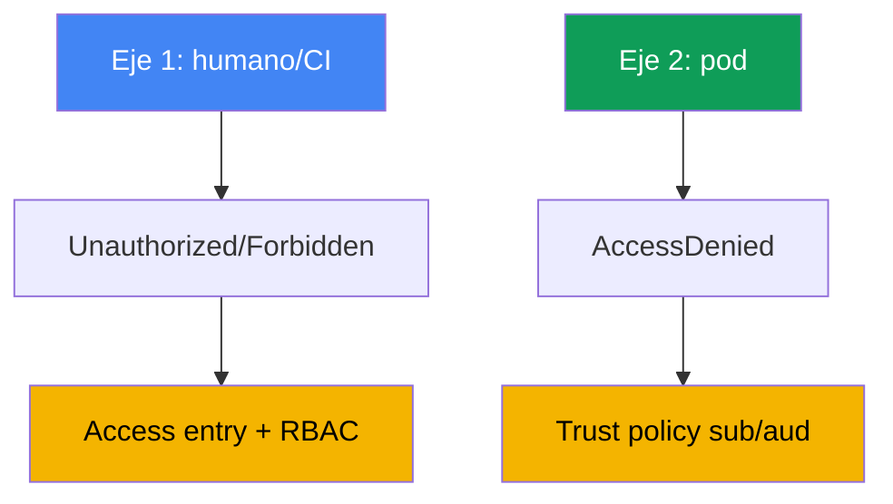
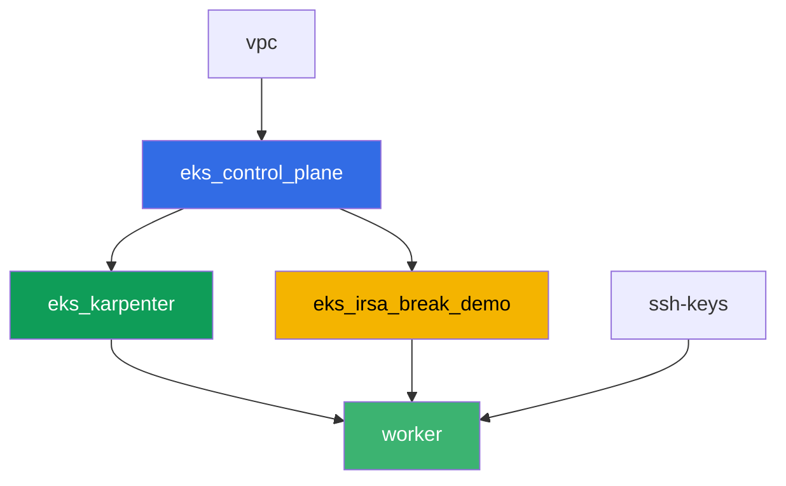

[Русская версия](README_RU.MD) · [Eng version](README.MD) · [Version française](README_FR.MD) · [Deutsche Version](README_DE.MD) · [ქართული ვერსია](README_GE.MD) · [繁體中文版](README_TW.MD) · [日本語版](README_JP.MD)

# Lab 121 - Solución de problemas: acceso denegado (access entries, IRSA, webhook, kubeconfig)

## Descripción

El acceso a EKS puede romperse en dos capas independientes, y es fácil confundirlas. La
primera: un humano o un CI no puede entrar al cluster en absoluto - `kubectl` devuelve
`Unauthorized` o `Forbidden` antes de llegar siquiera a un recurso concreto. La segunda: un
pod con IRSA configurado recibe `AccessDenied` en una llamada a AWS, aunque la anotación del
ServiceAccount parezca correcta. En este lab reproducirás ambos síntomas desde cero,
diagnosticarás la causa con comandos precisos, y arreglarás cada uno con la herramienta
diseñada para ello: un access entry para la primera capa, una trust policy para la segunda.

Las tareas están escritas en estilo de producción: un enunciado breve más criterios de
aceptación. La verificación es automática, mediante el comando `check_result`.

## Objetivo

Reforzar el material de este capítulo del curso:

- [Capítulo 47. Acceso e IAM: access entries, IRSA, webhook, kubeconfig](../../course/47/ru.md)

## Qué vamos a crear

Terraform crea de antemano un bucket de S3 y un rol IRSA con una trust policy sobre un
ServiceAccount específico. Tú recrearás ambas situaciones de denegación de acceso y ambos
arreglos.

| Objeto | Qué es | Por qué está en este lab |
|--------|---------|-------------------|
| Namespace `eks-121` | una sección del cluster para la carga de trabajo del lab | mantiene los recursos separados de los del sistema |
| Componente `eks_irsa_break_demo` | bucket de S3, rol IRSA que confía en `demo-reader` | un objetivo listo para la anotación correcta y la rota |
| Rol IAM de prueba (`-test-` en el nombre) | un principal sin access entry | reproduce `Unauthorized` (el eje humano) |
| Access entry + `AmazonEKSViewPolicy` | el arreglo de `Unauthorized` | convierte una identidad no mapeada en un lector del cluster |
| ServiceAccount `demo-reader` (eks-121) | anotación correcta en el rol IRSA | el `sub` en el token coincide con la trust policy - el pod lee S3 |
| ServiceAccount `demo-reader-broken` (default) | el mismo rol, un namespace distinto | el `sub` no coincide - `AccessDenied` (el eje del pod) |

Los dos ejes de acceso y sus arreglos:



## Infraestructura

El entorno se despliega en AWS (`eu-central-1`) mediante Terragrunt. La base coincide con el
lab 101 (control plane, Fargate para los pods del sistema, Karpenter para la carga de
trabajo), más un componente separado para los recursos de la demo de IRSA.

### Módulos y dependencias

| Directorio (componente) | Módulo (`terraform/modules/`) | Depende de | Qué crea |
|---------------------|-------------------------------|------------|-------------|
| `vpc` | `vpc_v3` | - | VPC `10.10.0.0/16`, subnets en dos AZs, NAT |
| `ssh-keys` | `ssh-keys` | - | un par de claves SSH para la máquina worker y los nodos |
| `eks_control_plane` | `eks_v2_control_plane` | `vpc` | control plane de EKS `1.36`, OIDC provider |
| `eks_fargate_system` | `eks_v2_fargate` | `vpc`, `eks_control_plane` | Fargate profile para `kube-system` y `karpenter` |
| `eks_addons` | `eks_v2_addons` | `eks_control_plane`, `eks_fargate_system` | coredns, kube-proxy, vpc-cni, eks-pod-identity-agent |
| `eks_karpenter` | `eks_v2_karpenter` | `vpc`, `eks_control_plane`, `eks_addons`, `eks_fargate_system` | controlador de Karpenter, rol IAM del nodo |
| `eks_karpenter_default_vng` | `eks_v2_karpenter_vng` | `vpc`, `eks_control_plane`, `eks_karpenter` | NodePool por defecto `default` en AL2023 |
| `eks_irsa_break_demo` | `eks_v2_irsa_break_demo` | `eks_control_plane` | bucket de S3, rol IRSA que confía en `eks-121/demo-reader` |
| `worker` | `eks_v2_work_pc` | `ssh-keys`, `vpc`, `eks_control_plane`, `eks_karpenter`, `eks_irsa_break_demo` | máquina worker con kubectl, tests y `check_result` |

El rol del worker lleva un permiso separado para administrar, y para hacer `sts:AssumeRole`
sobre, roles con `-test-` en el nombre - eso es lo que permite reproducir `Unauthorized` de
la tarea 2 sin salir de los permisos propios del lab.

Grafo de dependencias (lo que se aplica antes está más abajo en la flecha):



Los componentes `eks_fargate_system`, `eks_addons` y `eks_karpenter_default_vng` no se
muestran en el grafo para mantenerlo bajo el límite de 8 nodos, pero en realidad se ubican
entre `eks_control_plane` y `eks_karpenter` (ver la tabla anterior).

### Nombres de recursos predecibles

`eks_irsa_break_demo` construye los nombres a partir de `prefix` y `app_name`, así que el
worker los encuentra sin leer la salida de terraform. Viven en el archivo
`~/lab121_hints.txt` de la máquina worker:

| Recurso | Nombre |
|--------|-----|
| Bucket de S3 | `eks-task121-irsa-break-demo-bucket` |
| Rol IRSA | `eks-task121-irsa-break-demo-irsa-role` |

### Dónde se configura todo

`env.hcl` (parámetros compartidos del entorno):

| Parámetro | Valor en el lab | En qué influye |
|----------|-----------------|---------------|
| `region` | `eu-central-1` | región para todos los recursos |
| `prefix` | `eks-task121` | prefijo de nombre de recursos, incluidos el bucket y el rol |
| `stack_name` | `eks121` | se usa para construir `env_name` - el nombre del cluster |
| `k8_version` | `1.36.0` | versión de kubectl en la máquina worker |

`inputs` en el `terragrunt.hcl` de cada componente:

| Archivo | Ajustes clave |
|------|--------------------|
| `eks_irsa_break_demo/terragrunt.hcl` | `irsa.namespace = "eks-121"`, `irsa.service_account_name = "demo-reader"` |
| `worker/terragrunt.hcl` | `test_url` y `task_script_url` para los archivos del lab 121, dependencia de `eks_irsa_break_demo` |

## Despliegue

```bash
TASK=121 make run_eks_task
```

El despliegue tarda aproximadamente 15-20 minutos. En la salida, busca la línea con la
conexión SSH a la máquina worker y conéctate a ella. Allí kubectl ya está configurado para
el cluster correcto, y los nombres y ARNs de los recursos del lab están en
`~/lab121_hints.txt`.

Comandos útiles en la máquina worker:

```bash
time_left       # cuánto tiempo de entorno queda
check_result    # comprobar la solución
cat ~/lab121_hints.txt   # nombres y ARNs del bucket y del rol IRSA
```

> Seguridad del entorno. `env.hcl` tiene habilitado `ssh_password_enable = true` y
> `access_cidrs = ["0.0.0.0/0"]` - conveniente para un entorno de entrenamiento, pero esto no
> es algo que se deba hacer en producción. Según los estándares del curso (capítulos 0.2, 2,
> 19), el acceso a las máquinas worker debería pasar por AWS SSM Session Manager sin exponer
> puertos SSH públicos, y `access_cidrs` debería reducirse a direcciones específicas. Aquí se
> deja el SSH público solo para mantener la configuración simple.

## Tareas

El bloque 1 (tareas 1-4) cubre el eje humano/CI: por qué `kubectl` no puede entrar al
cluster, y qué parte de esa cadena es 401 frente a 403. El bloque 2 (tareas 5-8) cubre el eje
del pod: por qué una aplicación con IRSA recibe `AccessDenied` aunque la anotación de la SA
esté en su lugar.

---
|        **1**        | **Namespace para la carga de trabajo del lab**                             |
| :-----------------: | :---------------------------------------------------------- |
| Qué hacer          | Crea un namespace llamado `eks-121`. Todos los objetos de este lab se crean dentro de él. |
| Criterios de aceptación    | - el namespace `eks-121` existe. |
---
|        **2**        | **Síntoma Unauthorized: un rol sin access entry**             |
| :-----------------: | :---------------------------------------------------------- |
| Qué hacer          | Crea un rol IAM de prueba con `-test-` en el nombre (por ejemplo `eks-task121-test-noaccess`) que confíe en el rol del worker, sin ningún access entry en el cluster. Primero, **usando las credenciales del worker**, construye un kubeconfig separado: `aws eks update-kubeconfig --name <cluster> --kubeconfig /tmp/kubeconfig-test`. El orden importa: este comando llama a `eks:DescribeCluster`, y el rol de prueba no tiene ninguna política IAM, así que bajo ese rol fallaría con `AccessDeniedException` y el archivo no se crearía (este es un tercer tipo de fallo - desde IAM, sin llegar nunca al cluster). Luego ejecuta `aws sts assume-role` sobre el rol de prueba, exporta sus credenciales a variables de entorno, y ejecuta `kubectl --kubeconfig /tmp/kubeconfig-test get pods -A`: el token vía `aws eks get-token` vendrá ahora del rol de prueba, y el API server responderá con `Unauthorized`. Guarda la salida en `/var/work/tests/artifacts/2/unauthorized.txt`. |
| Criterios de aceptación    | - el archivo `2/unauthorized.txt` no está vacío y contiene `Unauthorized`. |
---
|        **3**        | **Arreglando Unauthorized: access entry y AmazonEKSViewPolicy** |
| :-----------------: | :---------------------------------------------------------- |
| Qué hacer          | Crea un access entry para el rol de prueba (`aws eks create-access-entry ... --type STANDARD`) y asócialo con la política `AmazonEKSViewPolicy` en el ámbito `cluster`. Repite `kubectl get pods -A` con el mismo kubeconfig temporal (puede que necesites volver a ejecutar assume-role) - ahora debería devolver la lista de pods, sin `Unauthorized`. Guarda la salida en `/var/work/tests/artifacts/3/authorized.txt`. |
| Criterios de aceptación    | - el archivo `3/authorized.txt` no está vacío, contiene una cabecera de lista de pods, y no contiene `Unauthorized`. |
---
|        **4**        | **Síntoma Forbidden: un rol de View no puede escribir**             |
| :-----------------: | :---------------------------------------------------------- |
| Qué hacer          | Con el mismo kubeconfig temporal (el rol solo tiene `AmazonEKSViewPolicy`), ejecuta `kubectl create namespace test-forbidden` - debería devolver `Forbidden`. Guarda la salida en `/var/work/tests/artifacts/4/forbidden.txt` y añade una explicación de la diferencia entre `Unauthorized` de la tarea 2 y `Forbidden` de esta tarea - ambas palabras deben aparecer en el texto. |
| Criterios de aceptación    | - el archivo `4/forbidden.txt` no está vacío y contiene tanto `Unauthorized` como `Forbidden`. |
---
|        **5**        | **Un ServiceAccount con la anotación IRSA correcta**              |
| :-----------------: | :---------------------------------------------------------- |
| Qué hacer          | Crea el ServiceAccount `demo-reader` en `eks-121` con la anotación `eks.amazonaws.com/role-arn` apuntando al ARN del rol IRSA (`irsa_role_arn` de `~/lab121_hints.txt`). Crea un pod con esa SA (imagen `amazon/aws-cli:2.15.0`, comando `sleep 3600`), ejecuta `aws sts get-caller-identity` dentro de él (debería mostrar un `assumed-role` para ese rol), y lee el objeto `hello.txt` del bucket. Guarda ambas salidas en `/var/work/tests/artifacts/5/irsa_ok.txt`. |
| Criterios de aceptación    | - la SA `demo-reader` en `eks-121` con la anotación `role-arn`;<br/>- el archivo `5/irsa_ok.txt` no está vacío, contiene `assumed-role` y `hello from s3`. |
---
|        **6**        | **Síntoma AccessDenied: una anotación rota en otro namespace** |
| :-----------------: | :---------------------------------------------------------- |
| Qué hacer          | Crea un segundo ServiceAccount `demo-reader-broken` en el namespace `default` con la MISMA anotación sobre el mismo `role-arn`. La trust policy del rol espera un `sub` con namespace `eks-121`, no `default`, así que el intercambio de token debería fallar. Crea un pod con esta SA en `default`, ejecuta `aws sts get-caller-identity` - debería devolver `AccessDenied` o un error de intercambio de token (`WebIdentityErr`). Guarda la salida en `/var/work/tests/artifacts/6/broken.txt`. |
| Criterios de aceptación    | - la SA `demo-reader-broken` en `default` con la anotación sobre el mismo `role-arn`;<br/>- el archivo `6/broken.txt` no está vacío y contiene `AccessDenied`, `not authorized` o `WebIdentityErr`. |
---
|        **7**        | **Diagnóstico: comparando anotaciones por sub y namespace**      |
| :-----------------: | :---------------------------------------------------------- |
| Qué hacer          | Compara la anotación `eks.amazonaws.com/role-arn` de la SA en ambos namespaces (`kubectl get sa ... -o jsonpath=...role-arn`) y explica en el archivo `/var/work/tests/artifacts/7/diagnostics.txt` por qué la condición `sub` de la trust policy del rol no coincide en el segundo caso. El texto debe incluir las palabras `sub` y `namespace`. |
| Criterios de aceptación    | - el archivo `7/diagnostics.txt` no está vacío y contiene `sub` y `namespace`. |
---
|        **8**        | **Resumen: los dos ejes de acceso**                                  |
| :-----------------: | :---------------------------------------------------------- |
| Qué hacer          | Guarda en el archivo `/var/work/tests/artifacts/8/summary.txt` una comparación de los dos ejes (`Unauthorized`/`Forbidden` de un humano frente a `AccessDenied` de un pod) en 3-5 frases. Menciona `RBAC` y `trust policy` como los diferentes mecanismos de arreglo para las diferentes capas. |
| Criterios de aceptación    | - el archivo `8/summary.txt` no está vacío y contiene `RBAC` y `trust policy`. |
---

## Verificación del resultado

En la máquina worker, ejecuta la verificación automática:

```bash
check_result
```

El script ejecutará los tests y mostrará el porcentaje de tareas completadas.

## Solución

Solución de referencia: [worker/files/solutions/1_ES.MD](worker/files/solutions/1_ES.MD)

## Eliminando el cluster y los recursos

> **Primero elimina el rol IAM de prueba.** Creaste el rol `eks-task121-test-noaccess` a
> mano mediante AWS CLI en la tarea 2, no está en el estado de terraform, y `destroy` no lo
> tocará. Los roles IAM viven fuera de cualquier región y fuera del cluster, así que de otro
> modo se quedaría en la cuenta para siempre, y volver a ejecutar el lab fallaría en
> `aws iam create-role` con `EntityAlreadyExists`. No es necesario eliminar el access entry
> por separado (desaparece junto con el cluster), pero elimínalo también si quieres repetir
> el lab en el mismo cluster.

```bash
CLUSTER_NAME=$(grep '^cluster_name' ~/lab121_hints.txt | awk '{print $3}')
TEST_ROLE_ARN=$(aws iam get-role --role-name eks-task121-test-noaccess \
  --query 'Role.Arn' --output text)

# el access entry del rol de prueba (necesario si repites el lab)
aws eks delete-access-entry --cluster-name "$CLUSTER_NAME" --principal-arn "$TEST_ROLE_ARN"

# el rol en sí: no tiene políticas adjuntas, así que se elimina de inmediato
aws iam delete-role --role-name eks-task121-test-noaccess
```

> **Elimina la carga de trabajo antes de destroy.** Los pods `irsa-app` y `broken-app`
> hicieron que Karpenter levantara un nodo EC2. Los pods y los ServiceAccounts en sí no crean
> recursos de AWS, pero el nodo sí, y si destruyes el stack con carga de trabajo todavía
> viva, VPC CNI no tiene tiempo de eliminar sus ENIs secundarias. La ENI entonces se queda en
> estado `available`, retiene el security group del nodo, y `destroy` se queda colgado en
> `module.eks.aws_security_group.node[0]: Still destroying...`. Deja que Karpenter drene el
> nodo correctamente: elimina la carga de trabajo y espera a que el nodo desaparezca.

```bash
kubectl delete pod irsa-app -n eks-121 --ignore-not-found
kubectl delete pod broken-app -n default --ignore-not-found
kubectl delete namespace eks-121 --ignore-not-found

# espera a que Karpenter elimine sus nodos EC2 (solo deben quedar fargate-*)
while kubectl get nodes --no-headers 2>/dev/null | grep -qv fargate; do
  echo "El nodo EC2 de Karpenter sigue vivo, esperando..."; sleep 15
done
```

```bash
TASK=121 make delete_eks_task
```

Si el rol falla al eliminarse con un error `DeleteConflict`, todavía tiene políticas
adjuntas - revísalas y elimínalas:

```bash
aws iam list-attached-role-policies --role-name eks-task121-test-noaccess
aws iam list-role-policies --role-name eks-task121-test-noaccess
```

Si `destroy` sigue atascado en el security group del nodo, busca la ENI huérfana y
elimínala - terraform terminará entonces por sí solo:

```bash
# una ENI en estado available con el tag eks:eni:owner=amazon-vpc-cni es un residuo de VPC CNI
aws ec2 describe-network-interfaces --filters Name=status,Values=available \
  --query 'NetworkInterfaces[].[NetworkInterfaceId,Description,Groups[0].GroupName]' --output table
aws ec2 delete-network-interface --network-interface-id <eni-id>
```
