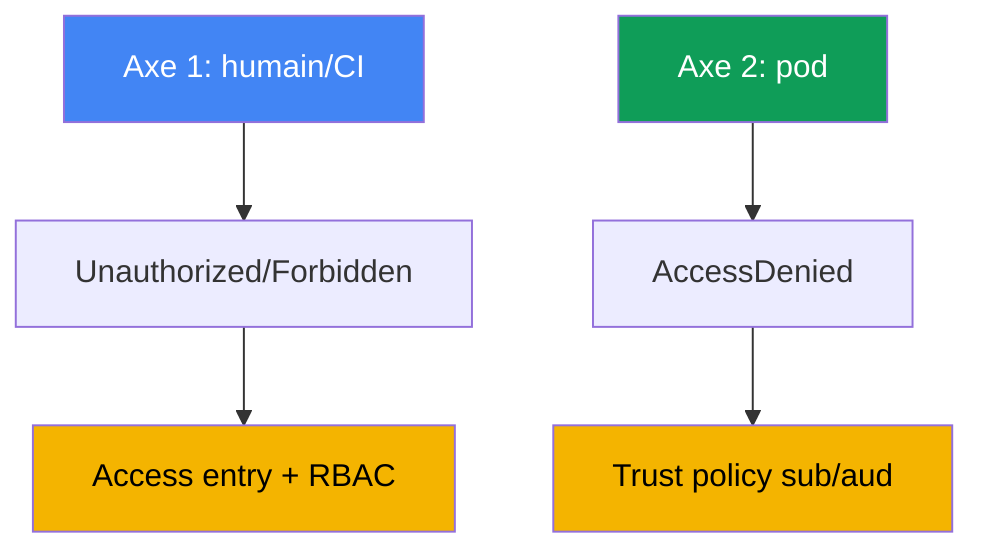
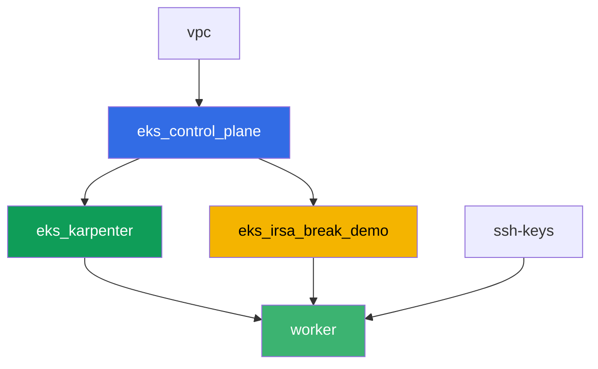

[Русская версия](README_RU.MD) · [Eng version](README.MD) · [Versión en español](README_ES.MD) · [Deutsche Version](README_DE.MD) · [ქართული ვერსია](README_GE.MD) · [繁體中文版](README_TW.MD) · [日本語版](README_JP.MD)

# Lab 121 - Diagnostic des accès refusés (access entries, IRSA, webhook, kubeconfig)

## Description

Les accès EKS peuvent se casser à deux niveaux indépendants, et il est facile de les
confondre. Le premier : un humain ou une CI ne peut pas du tout entrer dans le cluster -
`kubectl` renvoie `Unauthorized` ou `Forbidden` avant même d'atteindre une ressource
précise. Le second : un pod configuré avec IRSA obtient `AccessDenied` sur un appel AWS,
même si l'annotation du ServiceAccount semble correcte. Dans ce lab, vous reproduisez les
deux symptômes depuis zéro, vous diagnostiquez la cause avec des commandes précises, et
vous corrigez chacun avec l'outil prévu pour cela : un access entry pour le premier niveau,
une trust policy pour le second.

Les tâches sont rédigées dans un style production : un énoncé court plus des critères
d'acceptation. La vérification est automatique, via la commande `check_result`.

## Objectif

Consolider les notions de ce chapitre du cours :

- [Chapitre 47. Accès et IAM : access entries, IRSA, webhook, kubeconfig](../../course/47/ru.md)

## Ce que nous créons

Terraform crée à l'avance un bucket S3 et un rôle IRSA avec une trust policy sur un
ServiceAccount précis. Vous reconstituez les deux situations de refus d'accès et les deux
corrections.

| Objet | Ce que c'est | Pourquoi c'est dans ce lab |
|--------|---------|-------------------|
| Namespace `eks-121` | une section du cluster pour la charge de travail du lab | garde les ressources séparées de celles du système |
| Composant `eks_irsa_break_demo` | bucket S3, rôle IRSA qui fait confiance à `demo-reader` | une cible prête pour l'annotation correcte et l'annotation cassée |
| Rôle IAM de test (`-test-` dans le nom) | un principal sans access entry | reproduit `Unauthorized` (l'axe humain) |
| Access entry + `AmazonEKSViewPolicy` | la correction d'`Unauthorized` | transforme une identité non mappée en lecteur du cluster |
| ServiceAccount `demo-reader` (eks-121) | annotation correcte sur le rôle IRSA | `sub` dans le token correspond à la trust policy - le pod lit S3 |
| ServiceAccount `demo-reader-broken` (default) | le même rôle, un namespace différent | `sub` ne correspond pas - `AccessDenied` (l'axe pod) |

Les deux axes d'accès et leurs corrections :



## Infrastructure

L'environnement est déployé sur AWS (`eu-central-1`) via Terragrunt. La base correspond au
lab 101 (control plane, Fargate pour les pods système, Karpenter pour la charge de travail),
plus un composant séparé pour les ressources de la démo IRSA.

### Modules et dépendances

| Répertoire (composant) | Module (`terraform/modules/`) | Dépend de | Ce qu'il crée |
|---------------------|-------------------------------|------------|-------------|
| `vpc` | `vpc_v3` | - | VPC `10.10.0.0/16`, sous-réseaux dans deux AZ, NAT |
| `ssh-keys` | `ssh-keys` | - | une paire de clés SSH pour la machine worker et les nœuds |
| `eks_control_plane` | `eks_v2_control_plane` | `vpc` | control plane EKS `1.36`, fournisseur OIDC |
| `eks_fargate_system` | `eks_v2_fargate` | `vpc`, `eks_control_plane` | profil Fargate pour `kube-system` et `karpenter` |
| `eks_addons` | `eks_v2_addons` | `eks_control_plane`, `eks_fargate_system` | coredns, kube-proxy, vpc-cni, eks-pod-identity-agent |
| `eks_karpenter` | `eks_v2_karpenter` | `vpc`, `eks_control_plane`, `eks_addons`, `eks_fargate_system` | contrôleur Karpenter, rôle IAM du nœud |
| `eks_karpenter_default_vng` | `eks_v2_karpenter_vng` | `vpc`, `eks_control_plane`, `eks_karpenter` | NodePool par défaut `default` sur AL2023 |
| `eks_irsa_break_demo` | `eks_v2_irsa_break_demo` | `eks_control_plane` | bucket S3, rôle IRSA qui fait confiance à `eks-121/demo-reader` |
| `worker` | `eks_v2_work_pc` | `ssh-keys`, `vpc`, `eks_control_plane`, `eks_karpenter`, `eks_irsa_break_demo` | machine worker avec kubectl, les tests et `check_result` |

Le rôle du worker porte une permission séparée pour gérer, et pour faire `sts:AssumeRole`
sur, les rôles contenant `-test-` dans le nom - c'est ce qui permet de reproduire
`Unauthorized` de la tâche 2 sans sortir des permissions propres au lab.

Graphe de dépendances (ce qui est appliqué en premier est plus bas dans la flèche) :



Les composants `eks_fargate_system`, `eks_addons` et `eks_karpenter_default_vng` ne sont
pas montrés sur le graphe pour rester sous la limite de 8 nœuds, mais ils se placent en
réalité entre `eks_control_plane` et `eks_karpenter` (voir le tableau ci-dessus).

### Noms de ressources prévisibles

`eks_irsa_break_demo` construit les noms à partir de `prefix` et `app_name`, de sorte que
le worker les retrouve sans lire la sortie de terraform. Ils se trouvent dans le fichier
`~/lab121_hints.txt` sur la machine worker :

| Ressource | Nom |
|--------|-----|
| Bucket S3 | `eks-task121-irsa-break-demo-bucket` |
| Rôle IRSA | `eks-task121-irsa-break-demo-irsa-role` |

### Où c'est configuré

`env.hcl` (paramètres d'environnement partagés) :

| Paramètre | Valeur dans le lab | Ce que ça affecte |
|----------|-----------------|---------------|
| `region` | `eu-central-1` | région pour toutes les ressources |
| `prefix` | `eks-task121` | préfixe des noms de ressources, y compris le bucket et le rôle |
| `stack_name` | `eks121` | utilisé pour construire `env_name` - le nom du cluster |
| `k8_version` | `1.36.0` | version de kubectl sur la machine worker |

`inputs` dans le `terragrunt.hcl` de chaque composant :

| Fichier | Réglages clés |
|------|--------------------|
| `eks_irsa_break_demo/terragrunt.hcl` | `irsa.namespace = "eks-121"`, `irsa.service_account_name = "demo-reader"` |
| `worker/terragrunt.hcl` | `test_url` et `task_script_url` pour les fichiers du lab 121, dépendance sur `eks_irsa_break_demo` |

## Déploiement

```bash
TASK=121 make run_eks_task
```

Le déploiement prend environ 15-20 minutes. Dans la sortie, trouvez la ligne avec la
connexion SSH vers la machine worker et connectez-vous. kubectl y est déjà configuré pour
le bon cluster, et les noms de ressources et ARN du lab sont dans `~/lab121_hints.txt`.

Commandes utiles sur la machine worker :

```bash
time_left       # combien de temps il reste à l'environnement
check_result    # vérifier la solution
cat ~/lab121_hints.txt   # noms et ARN du bucket et du rôle IRSA
```

> Sécurité de l'environnement. `env.hcl` active `ssh_password_enable = true` et
> `access_cidrs = ["0.0.0.0/0"]` - pratique pour un environnement d'entraînement, mais ce
> n'est pas à faire en production. Selon les standards du cours (chapitres 0.2, 2, 19),
> l'accès aux machines worker devrait passer par AWS SSM Session Manager sans exposer de
> port SSH public, et `access_cidrs` devrait être restreint à des adresses précises. Ici,
> le SSH public est laissé en place uniquement pour garder la mise en place simple.

## Tâches

Le bloc 1 (tâches 1-4) couvre l'axe humain/CI : pourquoi `kubectl` ne peut pas entrer dans
le cluster, et quelle partie de cette chaîne est un 401 plutôt qu'un 403. Le bloc 2 (tâches
5-8) couvre l'axe pod : pourquoi une application avec IRSA obtient `AccessDenied` même si
l'annotation de la SA est en place.

---
|        **1**        | **Namespace pour la charge de travail du lab**                             |
| :-----------------: | :---------------------------------------------------------- |
| Ce qu'il faut faire          | Créez un namespace nommé `eks-121`. Tous les objets de ce lab y sont créés. |
| Critères d'acceptation    | - le namespace `eks-121` existe. |
---
|        **2**        | **Symptôme Unauthorized : un rôle sans access entry**             |
| :-----------------: | :---------------------------------------------------------- |
| Ce qu'il faut faire          | Créez un rôle IAM de test avec `-test-` dans le nom (par ex. `eks-task121-test-noaccess`) qui fait confiance au rôle du worker, sans aucun access entry dans le cluster. D'abord, **avec les identifiants du worker**, construisez un kubeconfig séparé : `aws eks update-kubeconfig --name <cluster> --kubeconfig /tmp/kubeconfig-test`. L'ordre compte : cette commande appelle `eks:DescribeCluster`, et le rôle de test n'a aucune policy IAM du tout, donc sous ce rôle elle échouerait avec `AccessDeniedException` et le fichier ne serait pas créé (c'est un troisième type d'échec - venant d'IAM, sans même atteindre le cluster). Ensuite, exécutez `aws sts assume-role` sur le rôle de test, exportez ses identifiants dans des variables d'environnement, et lancez `kubectl --kubeconfig /tmp/kubeconfig-test get pods -A` : le token via `aws eks get-token` viendra désormais du rôle de test, et l'API server répondra avec `Unauthorized`. Enregistrez la sortie dans `/var/work/tests/artifacts/2/unauthorized.txt`. |
| Critères d'acceptation    | - le fichier `2/unauthorized.txt` n'est pas vide et contient `Unauthorized`. |
---
|        **3**        | **Correction d'Unauthorized : access entry et AmazonEKSViewPolicy** |
| :-----------------: | :---------------------------------------------------------- |
| Ce qu'il faut faire          | Créez un access entry pour le rôle de test (`aws eks create-access-entry ... --type STANDARD`) et associez-le à la policy `AmazonEKSViewPolicy` au niveau `cluster`. Répétez `kubectl get pods -A` avec le même kubeconfig temporaire (il faudra peut-être refaire assume-role) - la commande doit désormais renvoyer la liste des pods, sans `Unauthorized`. Enregistrez la sortie dans `/var/work/tests/artifacts/3/authorized.txt`. |
| Critères d'acceptation    | - le fichier `3/authorized.txt` n'est pas vide, contient un en-tête de liste de pods, et ne contient pas `Unauthorized`. |
---
|        **4**        | **Symptôme Forbidden : un rôle View ne peut pas écrire**             |
| :-----------------: | :---------------------------------------------------------- |
| Ce qu'il faut faire          | Avec le même kubeconfig temporaire (le rôle n'a que `AmazonEKSViewPolicy`), lancez `kubectl create namespace test-forbidden` - la commande doit renvoyer `Forbidden`. Enregistrez la sortie dans `/var/work/tests/artifacts/4/forbidden.txt` et ajoutez une explication de la différence entre `Unauthorized` de la tâche 2 et `Forbidden` de cette tâche - les deux mots doivent apparaître dans le texte. |
| Critères d'acceptation    | - le fichier `4/forbidden.txt` n'est pas vide et contient à la fois `Unauthorized` et `Forbidden`. |
---
|        **5**        | **Un ServiceAccount avec l'annotation IRSA correcte**              |
| :-----------------: | :---------------------------------------------------------- |
| Ce qu'il faut faire          | Créez le ServiceAccount `demo-reader` dans `eks-121` avec l'annotation `eks.amazonaws.com/role-arn` réglée sur l'ARN du rôle IRSA (`irsa_role_arn` dans `~/lab121_hints.txt`). Créez un pod avec cette SA (image `amazon/aws-cli:2.15.0`, commande `sleep 3600`), exécutez `aws sts get-caller-identity` à l'intérieur (elle doit montrer un `assumed-role` pour ce rôle), et lisez l'objet `hello.txt` du bucket. Enregistrez les deux sorties dans `/var/work/tests/artifacts/5/irsa_ok.txt`. |
| Critères d'acceptation    | - la SA `demo-reader` dans `eks-121` avec l'annotation `role-arn` ;<br/>- le fichier `5/irsa_ok.txt` n'est pas vide, contient `assumed-role` et `hello from s3`. |
---
|        **6**        | **Symptôme AccessDenied : une annotation cassée dans un autre namespace** |
| :-----------------: | :---------------------------------------------------------- |
| Ce qu'il faut faire          | Créez un second ServiceAccount `demo-reader-broken` dans le namespace `default` avec LA MÊME annotation sur le même `role-arn`. La trust policy du rôle attend un `sub` avec le namespace `eks-121`, pas `default`, donc l'échange de token doit échouer. Créez un pod avec cette SA dans `default`, exécutez `aws sts get-caller-identity` - la commande doit renvoyer `AccessDenied` ou une erreur d'échange de token (`WebIdentityErr`). Enregistrez la sortie dans `/var/work/tests/artifacts/6/broken.txt`. |
| Critères d'acceptation    | - la SA `demo-reader-broken` dans `default` avec l'annotation sur le même `role-arn` ;<br/>- le fichier `6/broken.txt` n'est pas vide et contient `AccessDenied`, `not authorized`, ou `WebIdentityErr`. |
---
|        **7**        | **Diagnostic : comparer les annotations par sub et namespace**      |
| :-----------------: | :---------------------------------------------------------- |
| Ce qu'il faut faire          | Comparez l'annotation `eks.amazonaws.com/role-arn` de la SA dans les deux namespaces (`kubectl get sa ... -o jsonpath=...role-arn`) et expliquez dans le fichier `/var/work/tests/artifacts/7/diagnostics.txt` pourquoi la condition `sub` de la trust policy du rôle ne correspond pas dans le second cas. Le texte doit inclure les mots `sub` et `namespace`. |
| Critères d'acceptation    | - le fichier `7/diagnostics.txt` n'est pas vide et contient `sub` et `namespace`. |
---
|        **8**        | **Synthèse : les deux axes d'accès**                                  |
| :-----------------: | :---------------------------------------------------------- |
| Ce qu'il faut faire          | Enregistrez dans le fichier `/var/work/tests/artifacts/8/summary.txt` une comparaison des deux axes (`Unauthorized`/`Forbidden` pour un humain, contre `AccessDenied` pour un pod) en 3-5 phrases. Mentionnez `RBAC` et `trust policy` comme les mécanismes de réparation différents pour les différents niveaux. |
| Critères d'acceptation    | - le fichier `8/summary.txt` n'est pas vide et contient `RBAC` et `trust policy`. |
---

## Vérification du résultat

Sur la machine worker, lancez la vérification automatique :

```bash
check_result
```

Le script exécute les tests et affiche le pourcentage de tâches accomplies.

## Solution

Solution de référence : [worker/files/solutions/1_FR.MD](worker/files/solutions/1_FR.MD)

## Suppression du cluster et des ressources

> **Supprimez d'abord le rôle IAM de test.** Vous avez créé le rôle
> `eks-task121-test-noaccess` à la main via AWS CLI dans la tâche 2, il n'est pas dans
> l'état terraform, et `destroy` ne le touchera pas. Les rôles IAM vivent en dehors de
> toute région et en dehors du cluster, donc il resterait sinon dans le compte pour
> toujours, et relancer le lab échouerait sur `aws iam create-role` avec
> `EntityAlreadyExists`. Supprimer l'access entry séparément n'est pas obligatoire (il
> disparaît avec le cluster), mais retirez-le aussi si vous voulez refaire le lab sur le
> même cluster.

```bash
CLUSTER_NAME=$(grep '^cluster_name' ~/lab121_hints.txt | awk '{print $3}')
TEST_ROLE_ARN=$(aws iam get-role --role-name eks-task121-test-noaccess \
  --query 'Role.Arn' --output text)

# l'access entry du rôle de test (nécessaire si vous refaites le lab)
aws eks delete-access-entry --cluster-name "$CLUSTER_NAME" --principal-arn "$TEST_ROLE_ARN"

# le rôle lui-même : il n'a aucune policy attachée, il est donc supprimé immédiatement
aws iam delete-role --role-name eks-task121-test-noaccess
```

> **Retirez la charge de travail avant destroy.** Les pods `irsa-app` et `broken-app` ont
> fait monter un nœud EC2 par Karpenter. Les pods et les ServiceAccounts eux-mêmes ne
> créent pas de ressources AWS, mais le nœud, oui, et si vous détruisez la stack avec une
> charge de travail encore active, VPC CNI n'a pas le temps de retirer ses ENI
> secondaires. L'ENI reste alors à l'état `available`, garde le security group du nœud, et
> `destroy` se bloque sur `module.eks.aws_security_group.node[0]: Still destroying...`.
> Laissez Karpenter drainer le nœud correctement : retirez la charge de travail et
> attendez que le nœud disparaisse.

```bash
kubectl delete pod irsa-app -n eks-121 --ignore-not-found
kubectl delete pod broken-app -n default --ignore-not-found
kubectl delete namespace eks-121 --ignore-not-found

# attendre que Karpenter retire ses nœuds EC2 (seuls les fargate-* doivent rester)
while kubectl get nodes --no-headers 2>/dev/null | grep -qv fargate; do
  echo "Le nœud EC2 de Karpenter est toujours actif, en attente..."; sleep 15
done
```

```bash
TASK=121 make delete_eks_task
```

Si la suppression du rôle échoue avec une erreur `DeleteConflict`, il a encore des policies
attachées - vérifiez-les et retirez-les :

```bash
aws iam list-attached-role-policies --role-name eks-task121-test-noaccess
aws iam list-role-policies --role-name eks-task121-test-noaccess
```

Si `destroy` reste bloqué sur le security group du nœud, trouvez l'ENI orpheline et
supprimez-la - terraform terminera alors tout seul :

```bash
# une ENI à l'état available taguée eks:eni:owner=amazon-vpc-cni est un résidu de VPC CNI
aws ec2 describe-network-interfaces --filters Name=status,Values=available \
  --query 'NetworkInterfaces[].[NetworkInterfaceId,Description,Groups[0].GroupName]' --output table
aws ec2 delete-network-interface --network-interface-id <eni-id>
```
