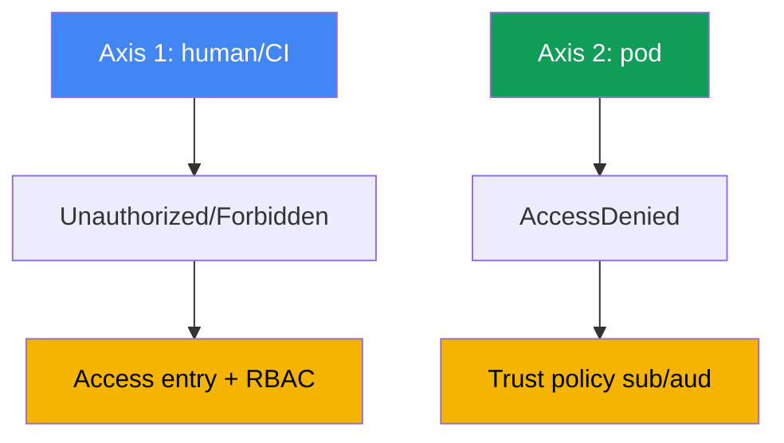
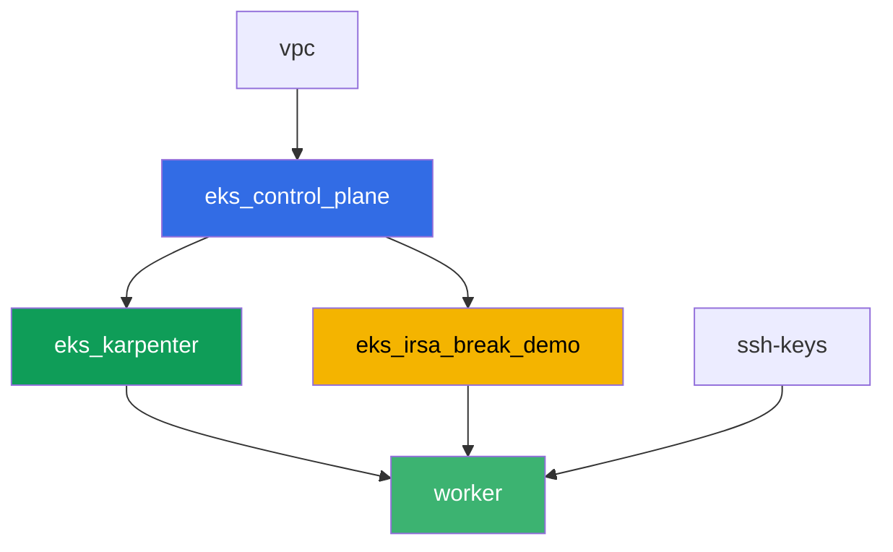

[Русская версия](README_RU.MD) · [Eng version](README.MD) · [Versión en español](README_ES.MD) · [Version française](README_FR.MD) · [Deutsche Version](README_DE.MD) · [繁體中文版](README_TW.MD) · [日本語版](README_JP.MD)

# Lab 121 - წვდომის შეცდომების დიაგნოსტიკა (access entries, IRSA, webhook, kubeconfig)

## აღწერა

EKS-ში წვდომა ორ დამოუკიდებელ დონეზე ირღვევა, და მათი აღრევა ადვილია. პირველი: ადამიანი
ან CI საერთოდ არ ხერხდება კლასტერში შესვლა - `kubectl` აბრუნებს `Unauthorized`-ს ან
`Forbidden`-ს კონკრეტულ რესურსთან მისვლამდეც. მეორე: pod-ს, რომელზეც IRSA
კონფიგურირებულია, AWS-ის გამოძახებაზე უჩენდება `AccessDenied`, მიუხედავად იმისა, რომ
ServiceAccount-ის ანოტაცია სწორად გამოიყურება. ამ ლაბორატორიაში ორივე სიმპტომს ნულიდან
აღადგენთ, დიაგნოსტიკას ატარებთ ზუსტი ბრძანებებით და თითოეულს გამოასწორებთ იმ ინსტრუმენტით,
რომელიც ამისთვისაა შექმნილი: access entry - პირველი დონისთვის, trust policy - მეორესთვის.

დავალებები დაწერილია production-სტილში: მოკლე დებულება პლუს acceptance criteria. შემოწმება
ავტომატურია, `check_result` ბრძანების საშუალებით.

## მიზანი

გავიმეოროთ კურსის ამ თავის მასალა:

- [თავი 47. წვდომა და IAM: access entries, IRSA, webhook, kubeconfig](../../course/47/ru.md)

## რას ვქმნით

Terraform წინასწარ ქმნის S3 bucket-ს და IRSA role-ს, კონკრეტულ ServiceAccount-ზე trust
policy-ით. თქვენ ხელახლა ტესტავთ წვდომის უარყოფის ორივე სიტუაციას და ორივე გამოსწორებას.

| ობიექტი | რას წარმოადგენს | რატომაა ამ ლაბორატორიაში |
|--------|---------|-------------------|
| Namespace `eks-121` | ლაბორატორიის workload-ის კლასტერული სექცია | რესურსებს სისტემურებისგან განცალკევებულს ტოვებს |
| Component `eks_irsa_break_demo` | S3 bucket, IRSA role, რომელიც `demo-reader`-ს ენდობა | მზა სამიზნეა სწორი და გატეხილი ანოტაციისთვის |
| ტესტური IAM role (სახელში `-test-`) | principal, რომელსაც access entry საერთოდ არ აქვს | ხელახლა ტესტავს `Unauthorized`-ს (ადამიანური ღერძი) |
| Access entry + `AmazonEKSViewPolicy` | `Unauthorized`-ის გამოსწორება | დაუმაპებელ identity-ს კლასტერის მკითხველად აქცევს |
| ServiceAccount `demo-reader` (eks-121) | სწორი ანოტაცია IRSA role-ზე | ტოკენში `sub` ემთხვევა trust policy-ს - pod-ი კითხულობს S3-ს |
| ServiceAccount `demo-reader-broken` (default) | ის თავადი role, სხვა namespace | `sub` არ ემთხვევა - `AccessDenied` (pod-ის ღერძი) |

წვდომის ორი ღერძი და მათი გამოსწორება:



## ინფრასტრუქტურა

გარემო დეპლოირებულია AWS-ში (`eu-central-1`) Terragrunt-ის საშუალებით. ბაზა ემთხვევა lab
101-ს (control plane, Fargate სისტემური pod-ებისთვის, Karpenter workload-ისთვის), პლუს
ცალკე component IRSA-დემოს რესურსებისთვის.

### მოდულები და დამოკიდებულებები

| დირექტორია (component) | Module (`terraform/modules/`) | დამოკიდებულია | რას ქმნის |
|---------------------|-------------------------------|------------|-------------|
| `vpc` | `vpc_v3` | - | VPC `10.10.0.0/16`, subnet-ები ორ AZ-ში, NAT |
| `ssh-keys` | `ssh-keys` | - | SSH key pair worker-მანქანისა და node-ებისთვის |
| `eks_control_plane` | `eks_v2_control_plane` | `vpc` | EKS control plane `1.36`, OIDC provider |
| `eks_fargate_system` | `eks_v2_fargate` | `vpc`, `eks_control_plane` | Fargate profile `kube-system`-ისთვის და `karpenter`-ისთვის |
| `eks_addons` | `eks_v2_addons` | `eks_control_plane`, `eks_fargate_system` | coredns, kube-proxy, vpc-cni, eks-pod-identity-agent |
| `eks_karpenter` | `eks_v2_karpenter` | `vpc`, `eks_control_plane`, `eks_addons`, `eks_fargate_system` | Karpenter controller, node-ის IAM role |
| `eks_karpenter_default_vng` | `eks_v2_karpenter_vng` | `vpc`, `eks_control_plane`, `eks_karpenter` | default NodePool `default` AL2023-ზე |
| `eks_irsa_break_demo` | `eks_v2_irsa_break_demo` | `eks_control_plane` | S3 bucket, IRSA role, რომელიც `eks-121/demo-reader`-ს ენდობა |
| `worker` | `eks_v2_work_pc` | `ssh-keys`, `vpc`, `eks_control_plane`, `eks_karpenter`, `eks_irsa_break_demo` | worker-მანქანა kubectl-ით, ტესტებით და `check_result`-ით |

worker-ის role-ს ცალკე უფლება აქვს მართოს და `sts:AssumeRole` გააკეთოს იმ role-ებზე,
რომელთა სახელშიც `-test-` გვხვდება - ეს არის ის, რაც საშუალებას გაძლევთ ხელახლა ტესტოთ
`Unauthorized` დავალება 2-იდან, ლაბორატორიის საკუთარი უფლებების გარეთ გასვლის გარეშე.

დამოკიდებულების გრაფი (რაც ადრე გამოიყენება, ის ისარზე ქვევით არის):



Component-ები `eks_fargate_system`, `eks_addons` და `eks_karpenter_default_vng` გრაფზე
ნაჩვენები არაა, რათა 8-node ლიმიტს არ გავცდეთ, მაგრამ ისინი ფაქტობრივად `eks_control_plane`-სა
და `eks_karpenter`-ს შორის დგანან (იხილეთ ცხრილი ზემოთ).

### წინასწარ განსაზღვრული რესურსების სახელები

`eks_irsa_break_demo` სახელებს `prefix`-სა და `app_name`-ისგან აწყობს, ისე რომ worker-ი მათ
terraform output-ის წაკითხვის გარეშე პოულობს. ისინი `~/lab121_hints.txt` ფაილში ცხოვრობენ
worker-მანქანაზე:

| რესურსი | სახელი |
|--------|-----|
| S3 bucket | `eks-task121-irsa-break-demo-bucket` |
| IRSA role | `eks-task121-irsa-break-demo-irsa-role` |

### სად რას აკონფიგურირებენ

`env.hcl` (გარემოს საერთო პარამეტრები):

| პარამეტრი | მნიშვნელობა ლაბორატორიაში | რაზე მოქმედებს |
|----------|-----------------|---------------|
| `region` | `eu-central-1` | region ყველა რესურსისთვის |
| `prefix` | `eks-task121` | რესურსების სახელების პრეფიქსი, bucket-ისა და role-ის ჩათვლით |
| `stack_name` | `eks121` | გამოიყენება `env_name`-ის შესაქმნელად - კლასტერის სახელი |
| `k8_version` | `1.36.0` | kubectl-ის ვერსია worker-მანქანაზე |

`inputs` თითოეული component-ის `terragrunt.hcl`-ში:

| ფაილი | ძირითადი პარამეტრები |
|------|--------------------|
| `eks_irsa_break_demo/terragrunt.hcl` | `irsa.namespace = "eks-121"`, `irsa.service_account_name = "demo-reader"` |
| `worker/terragrunt.hcl` | `test_url` და `task_script_url` lab 121-ის ფაილებისთვის, დამოკიდებულება `eks_irsa_break_demo`-ზე |

## დეპლოი

```bash
TASK=121 make run_eks_task
```

დეპლოი დაახლოებით 15-20 წუთს გრძელდება. output-ში მოძებნეთ ხაზი SSH-კავშირით
worker-მანქანასთან და დაერთეთ მას. კუბექტლ იქ უკვე კონფიგურირებულია საჭირო კლასტერისთვის,
ხოლო ლაბორატორიის რესურსების სახელები და ARN-ები `~/lab121_hints.txt`-შია.

სასარგებლო ბრძანებები worker-მანქანაზე:

```bash
time_left       # რამდენი დროა დარჩენილი გარემოს
check_result    # შემოწმება ამოხსნის
cat ~/lab121_hints.txt   # bucket-ისა და IRSA role-ის სახელები და ARN-ები
```

> გარემოს უსაფრთხოება. `env.hcl`-ში ჩართულია `ssh_password_enable = true` და
> `access_cidrs = ["0.0.0.0/0"]` - მოსახერხებელია სასწავლო გარემოსთვის, მაგრამ production-ში
> ასე არ ღირს. კურსის სტანდარტების მიხედვით (თავები 0.2, 2, 19), worker-მანქანებზე წვდომა
> უნდა გადიოდეს AWS SSM Session Manager-ის საშუალებით, საჯარო SSH პორტების გახსნის გარეშე,
> ხოლო `access_cidrs` კონკრეტულ მისამართებზე უნდა შეიზღუდოს. აქ საჯარო SSH მხოლოდ
> სიმარტივის შესანარჩუნებლადაა დარჩენილი.

## დავალებები

ბლოკი 1 (დავალებები 1-4) ეხება ადამიანურ/CI ღერძს: რატომ არ ხერხდება `kubectl`-ის შესვლა
კლასტერში, და რომელი ნაწილი ამ ჯაჭვში 401-ია, და რომელი - 403. ბლოკი 2 (დავალებები 5-8)
ეხება pod-ის ღერძს: რატომ უჩენდება IRSA-ს მქონე აპლიკაციას `AccessDenied`, მიუხედავად იმისა,
რომ SA-ის ანოტაცია ადგილზეა.

---
|        **1**        | **Namespace ლაბორატორიის workload-ისთვის**                             |
| :-----------------: | :---------------------------------------------------------- |
| რა უნდა გავაკეთოთ          | შექმენით namespace სახელით `eks-121`. ამ ლაბორატორიის ყველა ობიექტი მასში იქმნება. |
| Acceptance criteria    | - namespace `eks-121` არსებობს. |
---
|        **2**        | **Unauthorized სიმპტომი: role access entry-ის გარეშე**             |
| :-----------------: | :---------------------------------------------------------- |
| რა უნდა გავაკეთოთ          | შექმენით ტესტური IAM role სახელში `-test-`-ით (მაგ. `eks-task121-test-noaccess`), რომელიც ენდობა worker-ის role-ს, კლასტერში access entry-ის საერთოდ არარსებობის შემთხვევაში. პირველ ეტაპზე, **worker-ის credentials-ით**, ააგეთ ცალკე kubeconfig: `aws eks update-kubeconfig --name <cluster> --kubeconfig /tmp/kubeconfig-test`. თანმიმდევრობა მნიშვნელოვანია: ეს ბრძანება იძახებს `eks:DescribeCluster`-ს, ხოლო ტესტურ role-ს IAM policy საერთოდ არ აქვს, ამიტომ იმ role-ის ქვეშ ის ჩავარდებოდა `AccessDeniedException`-ით და ფაილი არ შეიქმნებოდა (ეს არის მესამე ტიპის შეცდომა - IAM-იდან, კლასტერამდე მისვლის გარეშეც). შემდეგ გაუშვით `aws sts assume-role` ტესტურ role-ზე, ექსპორტირება გაუკეთეთ მისი credentials-ს environment ცვლადებში და გაუშვით `kubectl --kubeconfig /tmp/kubeconfig-test get pods -A`: ტოკენი `aws eks get-token`-ის საშუალებით ახლა ტესტური role-იდან მოვა, და API server-ი `Unauthorized`-ით უპასუხებს. Output შეინახეთ `/var/work/tests/artifacts/2/unauthorized.txt`-ში. |
| Acceptance criteria    | - ფაილი `2/unauthorized.txt` არ არის ცარიელი და შეიცავს `Unauthorized`-ს. |
---
|        **3**        | **Unauthorized-ის გამოსწორება: access entry და AmazonEKSViewPolicy** |
| :-----------------: | :---------------------------------------------------------- |
| რა უნდა გავაკეთოთ          | შექმენით access entry ტესტური role-ისთვის (`aws eks create-access-entry ... --type STANDARD`) და დააკავშირეთ `AmazonEKSViewPolicy` policy-ს `cluster` scope-ზე. გაიმეორეთ `kubectl get pods -A` იმავე დროებითი kubeconfig-ით (შესაძლოა საჭირო გახდეს assume-role-ის ხელახლა გაშვება) - ის ახლა უკვე pod-ების სიას უნდა აბრუნებდეს, `Unauthorized`-ის გარეშე. Output შეინახეთ `/var/work/tests/artifacts/3/authorized.txt`-ში. |
| Acceptance criteria    | - ფაილი `3/authorized.txt` არ არის ცარიელი, შეიცავს pod-ების სიის header-ს და არ შეიცავს `Unauthorized`-ს. |
---
|        **4**        | **Forbidden სიმპტომი: View role-ს ჩაწერა არ შეუძლია**             |
| :-----------------: | :---------------------------------------------------------- |
| რა უნდა გავაკეთოთ          | იმავე დროებითი kubeconfig-ით (role-ს მხოლოდ `AmazonEKSViewPolicy` აქვს), გაუშვით `kubectl create namespace test-forbidden` - მან `Forbidden` უნდა დააბრუნოს. Output შეინახეთ `/var/work/tests/artifacts/4/forbidden.txt`-ში და დაამატეთ განმარტება იმის შესახებ, რაშია განსხვავება დავალება 2-ის `Unauthorized`-სა და ამ დავალების `Forbidden`-ს შორის - ორივე სიტყვა ტექსტში უნდა გამოჩნდეს. |
| Acceptance criteria    | - ფაილი `4/forbidden.txt` არ არის ცარიელი და შეიცავს ორივეს, `Unauthorized`-ს და `Forbidden`-ს. |
---
|        **5**        | **ServiceAccount სწორი IRSA ანოტაციით**              |
| :-----------------: | :---------------------------------------------------------- |
| რა უნდა გავაკეთოთ          | შექმენით ServiceAccount `demo-reader` `eks-121`-ში, ანოტაციით `eks.amazonaws.com/role-arn`, დაყენებული IRSA role-ის ARN-ზე (`irsa_role_arn` `~/lab121_hints.txt`-იდან). შექმენით pod ამ SA-ით (image `amazon/aws-cli:2.15.0`, command `sleep 3600`), მის შიგნით გაუშვით `aws sts get-caller-identity` (მან უნდა გამოაჩინოს `assumed-role` ამ role-ისთვის) და წაიკითხეთ `hello.txt` ობიექტი bucket-იდან. ორივე output შეინახეთ `/var/work/tests/artifacts/5/irsa_ok.txt`-ში. |
| Acceptance criteria    | - SA `demo-reader` `eks-121`-ში, `role-arn` ანოტაციით;<br/>- ფაილი `5/irsa_ok.txt` არ არის ცარიელი, შეიცავს `assumed-role`-ს და `hello from s3`-ს. |
---
|        **6**        | **AccessDenied სიმპტომი: გატეხილი ანოტაცია სხვა namespace-ში** |
| :-----------------: | :---------------------------------------------------------- |
| რა უნდა გავაკეთოთ          | შექმენით მეორე ServiceAccount `demo-reader-broken` namespace `default`-ში, ზუსტად იმავე ანოტაციით იმავე `role-arn`-ზე. role-ის trust policy ელოდება `sub`-ს namespace `eks-121`-ით, არა `default`-ით, ამიტომ ტოკენის გაცვლა ჩავარდნილი უნდა იყოს. შექმენით pod ამ SA-ით `default`-ში, გაუშვით `aws sts get-caller-identity` - მან `AccessDenied` ან ტოკენის გაცვლის შეცდომა (`WebIdentityErr`) უნდა დააბრუნოს. Output შეინახეთ `/var/work/tests/artifacts/6/broken.txt`-ში. |
| Acceptance criteria    | - SA `demo-reader-broken` `default`-ში, ანოტაციით იმავე `role-arn`-ზე;<br/>- ფაილი `6/broken.txt` არ არის ცარიელი და შეიცავს `AccessDenied`-ს, `not authorized`-ს ან `WebIdentityErr`-ს. |
---
|        **7**        | **დიაგნოსტიკა: ანოტაციების შედარება sub-ისა და namespace-ის მიხედვით**      |
| :-----------------: | :---------------------------------------------------------- |
| რა უნდა გავაკეთოთ          | შეადარეთ SA-ის `eks.amazonaws.com/role-arn` ანოტაცია ორივე namespace-ში (`kubectl get sa ... -o jsonpath=...role-arn`) და ფაილში `/var/work/tests/artifacts/7/diagnostics.txt` განმარტეთ, რატომ არ ემთხვევა role-ის trust policy-ის `sub` პირობა მეორე შემთხვევაში. ტექსტში აუცილებლად უნდა იყოს სიტყვები `sub` და `namespace`. |
| Acceptance criteria    | - ფაილი `7/diagnostics.txt` არ არის ცარიელი და შეიცავს `sub`-ს და `namespace`-ს. |
---
|        **8**        | **შეჯამება: წვდომის ორი ღერძი**                                  |
| :-----------------: | :---------------------------------------------------------- |
| რა უნდა გავაკეთოთ          | ფაილში `/var/work/tests/artifacts/8/summary.txt` შეინახეთ ორი ღერძის შედარება (ადამიანის `Unauthorized`/`Forbidden` პოდის `AccessDenied`-ის წინააღმდეგ) 3-5 წინადადებაში. მოიხსენიეთ `RBAC` და `trust policy`, როგორც სხვადასხვა დონისთვის სხვადასხვა გამოსწორების მექანიზმები. |
| Acceptance criteria    | - ფაილი `8/summary.txt` არ არის ცარიელი და შეიცავს `RBAC`-ს და `trust policy`-ს. |
---

## შედეგის შემოწმება

worker-მანქანაზე გაუშვით ავტომატური შემოწმება:

```bash
check_result
```

სკრიპტი ჩაატარებს ტესტებს და გამოაჩენს დასრულებული დავალებების პროცენტს.

## ამოხსნა

Reference solution: [worker/files/solutions/1_GE.MD](worker/files/solutions/1_GE.MD)

## კლასტერისა და რესურსების წაშლა

> **პირველ ეტაპზე წაშალეთ ტესტური IAM role.** თქვენ role `eks-task121-test-noaccess`
> ხელით შექმენით AWS CLI-ის საშუალებით დავალება 2-ში, ის terraform state-ში არ არსებობს, და
> `destroy` მას არ შეეხება. IAM role-ები region-ისა და კლასტერის გარეთ ცხოვრობენ, ამიტომ
> სხვაგვარად ის ანგარიშში სამუდამოდ დარჩებოდა, ხოლო ლაბორატორიის ხელახალი გაშვება
> ჩავარდებოდა `aws iam create-role`-ზე `EntityAlreadyExists`-ით. access entry-ის ცალკე
> წაშლა სავალდებულო არაა (ის კლასტერთან ერთად ქრება), მაგრამ წაშალეთ ისიც, თუ ლაბორატორიის
> ხელახლა გაშვება იმავე კლასტერზე გინდათ.

```bash
CLUSTER_NAME=$(grep '^cluster_name' ~/lab121_hints.txt | awk '{print $3}')
TEST_ROLE_ARN=$(aws iam get-role --role-name eks-task121-test-noaccess \
  --query 'Role.Arn' --output text)

# ტესტური role-ის access entry (საჭიროა, თუ ლაბორატორიას ხელახლა გაშვებთ)
aws eks delete-access-entry --cluster-name "$CLUSTER_NAME" --principal-arn "$TEST_ROLE_ARN"

# role თავადვე: მას პოლისები დაკავშირებული არა აქვს, ამიტომ ის მაშინვე იშლება
aws iam delete-role --role-name eks-task121-test-noaccess
```

> **workload-ი წაშალეთ destroy-მდე.** Pod-ებმა `irsa-app`-მა და `broken-app`-მა Karpenter-ს
> EC2 node-ის აწევა დააჩენინეს. Pod-ები და ServiceAccount-ები თავადვე AWS რესურსებს არ
> ქმნიან, მაგრამ node-ი ქმნის, და თუ stack-ს ცოცხალი workload-ით ჩაშლით, VPC CNI-ს დრო არ
> ჰყოფნის, საკუთარი secondary ENI-ები მოაცილოს. ENI შემდეგ `available` სტატუსში რჩება,
> node-ის security group-ს ეჭირება, და `destroy` ჩამორჩება
> `module.eks.aws_security_group.node[0]: Still destroying...`-ზე. მიეცით Karpenter-ს
> საშუალება, node სწორად დაადრეინოს: წაშალეთ workload-ი და დაუცადეთ node-ის გაქრობას.

```bash
kubectl delete pod irsa-app -n eks-121 --ignore-not-found
kubectl delete pod broken-app -n default --ignore-not-found
kubectl delete namespace eks-121 --ignore-not-found

# დაუცადეთ, სანამ Karpenter თავის EC2 node-ებს არ მოაცილებს (მხოლოდ fargate-* უნდა დარჩეს)
while kubectl get nodes --no-headers 2>/dev/null | grep -qv fargate; do
  echo "Karpenter's EC2 node is still alive, waiting..."; sleep 15
done
```

```bash
TASK=121 make delete_eks_task
```

თუ role-ის წაშლა `DeleteConflict` შეცდომით ჩავარდება, მას ჯერ კიდევ დაკავშირებული აქვს
პოლისები - შეამოწმეთ და მოაცილეთ ისინი:

```bash
aws iam list-attached-role-policies --role-name eks-task121-test-noaccess
aws iam list-role-policies --role-name eks-task121-test-noaccess
```

თუ `destroy` მაინც ჩამორჩება node-ის security group-ზე, მოძებნეთ ჩამორთმეული ENI და
წაშალეთ ის - terraform შემდეგ თავადვე დაასრულებს:

```bash
# ENI, რომელიც available სტატუსშია და ტეგი eks:eni:owner=amazon-vpc-cni აქვს, VPC CNI-ის ნაშთია
aws ec2 describe-network-interfaces --filters Name=status,Values=available \
  --query 'NetworkInterfaces[].[NetworkInterfaceId,Description,Groups[0].GroupName]' --output table
aws ec2 delete-network-interface --network-interface-id <eni-id>
```
