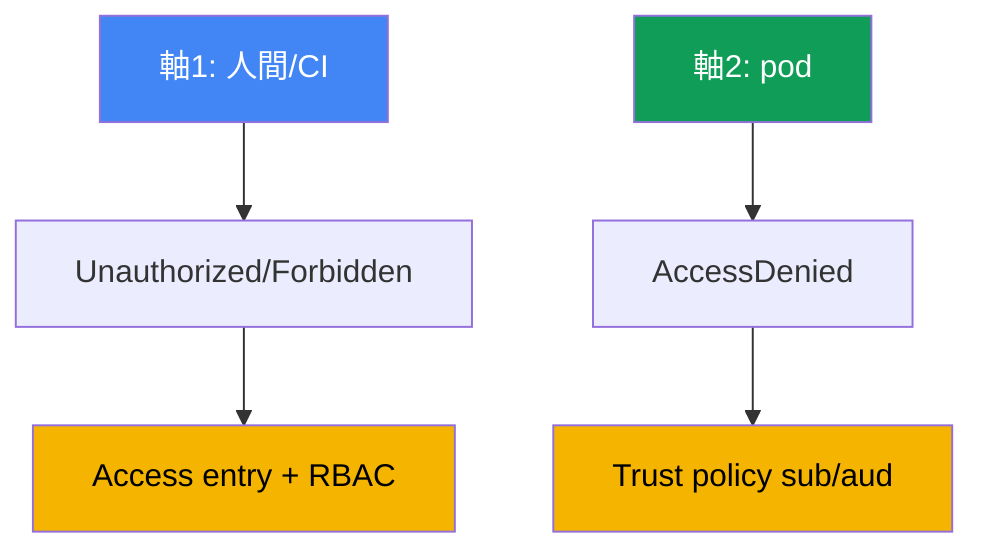
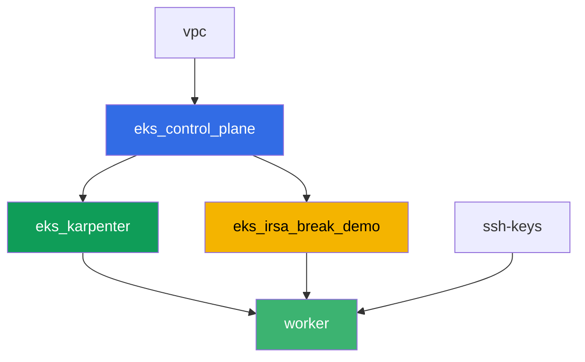

[Русская версия](README_RU.MD) · [Eng version](README.MD) · [Versión en español](README_ES.MD) · [Version française](README_FR.MD) · [Deutsche Version](README_DE.MD) · [ქართული ვერსია](README_GE.MD) · [繁體中文版](README_TW.MD)

# Lab 121 - トラブルシューティング: アクセス拒否 (access entries, IRSA, webhook, kubeconfig)

## 説明

EKSのアクセスは2つの独立したレイヤーで壊れることがあり、混同しやすいです。1つ目は、人間やCIがそもそもクラスターに入れないケースです - `kubectl`は特定のリソースに到達する前に`Unauthorized`または`Forbidden`を返します。2つ目は、IRSAが設定されたpodがAWS呼び出しで`AccessDenied`になるケースで、ServiceAccountのアノテーションが正しく見えても発生します。このラボでは両方の症状をゼロから再現し、正確なコマンドで原因を診断し、それぞれに専用のツールで修正します: 1つ目のレイヤーにはaccess entry、2つ目にはtrust policyです。

タスクはプロダクションスタイルで書かれています: 短い課題文と受け入れ基準です。チェックは`check_result`コマンドで自動的に行われます。

## 目標

このコースの章の内容を強化します:

- [第47章. アクセスとIAM: access entries, IRSA, webhook, kubeconfig](../../course/47/jp.md)

## 作成するもの

Terraformが事前にS3バケットと、特定のServiceAccountに対するtrust policyを持つIRSAロールを作成します。あなたは両方のアクセス拒否状況と両方の修正を再現します。

| オブジェクト | それは何か | このラボにある理由 |
|--------|---------|-------------------|
| Namespace `eks-121` | ラボのワークロード用のクラスターセクション | システムのリソースと分離しておく |
| コンポーネント `eks_irsa_break_demo` | S3バケット、`demo-reader`を信頼するIRSAロール | 正しいアノテーションと壊れたアノテーションの用意されたターゲット |
| テスト用IAMロール (名前に`-test-`を含む) | access entryを持たないプリンシパル | `Unauthorized`を再現する (人間の軸) |
| Access entry + `AmazonEKSViewPolicy` | `Unauthorized`の修正 | マッピングされていないアイデンティティをクラスターの読み取り者にする |
| ServiceAccount `demo-reader` (eks-121) | IRSAロールへの正しいアノテーション | トークン内の`sub`がtrust policyと一致する - podはS3を読み取れる |
| ServiceAccount `demo-reader-broken` (default) | 同じロール、異なるnamespace | `sub`が一致しない - `AccessDenied` (podの軸) |

2つのアクセス軸とその修正方法:



## インフラストラクチャ

環境はTerragruntを使ってAWS (`eu-central-1`) にデプロイされます。ベースはlab 101と同じ構成です (control plane、システムpod用のFargate、ワークロード用のKarpenter) に加えて、IRSAデモ用リソースの独立したコンポーネントがあります。

### モジュールと依存関係

| ディレクトリ (コンポーネント) | モジュール (`terraform/modules/`) | 依存先 | 作成されるもの |
|---------------------|-------------------------------|------------|-------------|
| `vpc` | `vpc_v3` | - | VPC `10.10.0.0/16`、2つのAZのサブネット、NAT |
| `ssh-keys` | `ssh-keys` | - | ワーカーマシンとノード用のSSHキーペア |
| `eks_control_plane` | `eks_v2_control_plane` | `vpc` | EKS control plane `1.36`、OIDCプロバイダー |
| `eks_fargate_system` | `eks_v2_fargate` | `vpc`, `eks_control_plane` | `kube-system`と`karpenter`用のFargateプロファイル |
| `eks_addons` | `eks_v2_addons` | `eks_control_plane`, `eks_fargate_system` | coredns, kube-proxy, vpc-cni, eks-pod-identity-agent |
| `eks_karpenter` | `eks_v2_karpenter` | `vpc`, `eks_control_plane`, `eks_addons`, `eks_fargate_system` | Karpenterコントローラー、ノードIAMロール |
| `eks_karpenter_default_vng` | `eks_v2_karpenter_vng` | `vpc`, `eks_control_plane`, `eks_karpenter` | AL2023上のデフォルトNodePool `default` |
| `eks_irsa_break_demo` | `eks_v2_irsa_break_demo` | `eks_control_plane` | S3バケット、`eks-121/demo-reader`を信頼するIRSAロール |
| `worker` | `eks_v2_work_pc` | `ssh-keys`, `vpc`, `eks_control_plane`, `eks_karpenter`, `eks_irsa_break_demo` | kubectl、テスト、`check_result`を備えたワーカーマシン |

ワーカーのロールには、名前に`-test-`を含むロールを管理し、`sts:AssumeRole`するための別の権限が付いています - これがラボ自体の権限を超えずにタスク2の`Unauthorized`を再現できる理由です。

依存関係グラフ (先に適用されるものが矢印の下側にあります):



コンポーネント`eks_fargate_system`、`eks_addons`、`eks_karpenter_default_vng`は、グラフを8ノードの上限内に収めるために表示していませんが、実際には`eks_control_plane`と`eks_karpenter`の間に位置します (上の表を参照)。

### 予測可能なリソース名

`eks_irsa_break_demo`は`prefix`と`app_name`から名前を組み立てるので、ワーカーはterraform outputを読まずにそれらを見つけられます。それらはワーカーマシン上の`~/lab121_hints.txt`ファイルにあります:

| リソース | 名前 |
|--------|-----|
| S3バケット | `eks-task121-irsa-break-demo-bucket` |
| IRSAロール | `eks-task121-irsa-break-demo-irsa-role` |

### 設定場所

`env.hcl` (共有環境パラメータ):

| パラメータ | ラボでの値 | 影響する範囲 |
|----------|-----------------|---------------|
| `region` | `eu-central-1` | すべてのリソースのリージョン |
| `prefix` | `eks-task121` | バケットとロールを含むリソース名のプレフィックス |
| `stack_name` | `eks121` | `env_name`の構築に使われる - クラスター名 |
| `k8_version` | `1.36.0` | ワーカーマシン上のkubectlバージョン |

各コンポーネントの`terragrunt.hcl`内の`inputs`:

| ファイル | 主な設定 |
|------|--------------------|
| `eks_irsa_break_demo/terragrunt.hcl` | `irsa.namespace = "eks-121"`, `irsa.service_account_name = "demo-reader"` |
| `worker/terragrunt.hcl` | lab 121のファイル用の`test_url`と`task_script_url`、`eks_irsa_break_demo`への依存 |

## デプロイ

```bash
TASK=121 make run_eks_task
```

デプロイにはおおよそ15-20分かかります。出力の中でワーカーマシンへのSSH接続の行を見つけて接続してください。そこのkubectlは既に正しいクラスター用に設定されており、ラボのリソース名とARNは`~/lab121_hints.txt`にあります。

ワーカーマシン上で使える便利なコマンド:

```bash
time_left       # 環境の残り時間
check_result    # 解答をチェック
cat ~/lab121_hints.txt   # バケットとIRSAロールの名前とARN
```

> 環境のセキュリティ。`env.hcl`では`ssh_password_enable = true`と`access_cidrs = ["0.0.0.0/0"]`が有効になっています - トレーニング環境としては便利ですが、これはプロダクションで行うべきことではありません。コースの標準 (第0.2章、第2章、第19章) に従えば、ワーカーマシンへのアクセスは公開SSHポートを晒すことなくAWS SSM Session Managerを経由すべきであり、`access_cidrs`は特定のアドレスに絞り込むべきです。ここでは設定を簡単にするためだけに公開SSHをそのままにしています。

## タスク

ブロック1 (タスク1-4) は人間/CIの軸をカバーします: なぜ`kubectl`がクラスターに入れないのか、そしてそのチェーンのどの部分が401なのか403なのか。ブロック2 (タスク5-8) はpodの軸をカバーします: SAアノテーションが設定されているにもかかわらず、なぜIRSAを使うアプリケーションが`AccessDenied`になるのか。

---
|        **1**        | **ラボのワークロード用のNamespace**                             |
| :-----------------: | :---------------------------------------------------------- |
| やること          | `eks-121`という名前のnamespaceを作成します。このラボのすべてのオブジェクトはその中に作成されます。 |
| 受け入れ基準    | - namespace `eks-121`が存在する。 |
---
|        **2**        | **Unauthorizedの症状: access entryを持たないロール**             |
| :-----------------: | :---------------------------------------------------------- |
| やること          | 名前に`-test-`を含み (例: `eks-task121-test-noaccess`)、ワーカーのロールを信頼する、クラスターにaccess entryが全くないテスト用IAMロールを作成します。まず、**ワーカーの認証情報を使って**、別のkubeconfigを構築します: `aws eks update-kubeconfig --name <cluster> --kubeconfig /tmp/kubeconfig-test`。順序が重要です: このコマンドは`eks:DescribeCluster`を呼び出しますが、テストロールにはIAMポリシーが全くないため、そのロールの下では`AccessDeniedException`で失敗し、ファイルが作成されません (これは3番目の失敗タイプです - IAMからのもので、クラスターにすら到達しません)。次に、テストロールに対して`aws sts assume-role`を実行し、その認証情報を環境変数にエクスポートし、`kubectl --kubeconfig /tmp/kubeconfig-test get pods -A`を実行します: `aws eks get-token`経由のトークンは今度はテストロールから発行され、APIサーバーは`Unauthorized`で応答します。出力を`/var/work/tests/artifacts/2/unauthorized.txt`に保存します。 |
| 受け入れ基準    | - ファイル`2/unauthorized.txt`が空でなく、`Unauthorized`を含む。 |
---
|        **3**        | **Unauthorizedの修正: access entryとAmazonEKSViewPolicy** |
| :-----------------: | :---------------------------------------------------------- |
| やること          | テストロール用のaccess entryを作成し (`aws eks create-access-entry ... --type STANDARD`)、`cluster`スコープで`AmazonEKSViewPolicy`ポリシーを関連付けます。同じ一時的なkubeconfigで`kubectl get pods -A`を繰り返します (assume-roleの再実行が必要な場合があります) - 今度は`Unauthorized`なしでpodリストが返るはずです。出力を`/var/work/tests/artifacts/3/authorized.txt`に保存します。 |
| 受け入れ基準    | - ファイル`3/authorized.txt`が空でなく、podリストのヘッダーを含み、`Unauthorized`を含まない。 |
---
|        **4**        | **Forbiddenの症状: Viewロールは書き込みできない**             |
| :-----------------: | :---------------------------------------------------------- |
| やること          | 同じ一時的なkubeconfigで (このロールは`AmazonEKSViewPolicy`しか持っていません)、`kubectl create namespace test-forbidden`を実行します - `Forbidden`が返るはずです。出力を`/var/work/tests/artifacts/4/forbidden.txt`に保存し、タスク2の`Unauthorized`と本タスクの`Forbidden`の違いの説明を追記します - 両方の単語がテキストに含まれている必要があります。 |
| 受け入れ基準    | - ファイル`4/forbidden.txt`が空でなく、`Unauthorized`と`Forbidden`の両方を含む。 |
---
|        **5**        | **正しいIRSAアノテーションを持つServiceAccount**              |
| :-----------------: | :---------------------------------------------------------- |
| やること          | `eks-121`にServiceAccount `demo-reader`を作成し、`eks.amazonaws.com/role-arn`アノテーションをIRSAロールのARN (`~/lab121_hints.txt`の`irsa_role_arn`) に設定します。そのSAを使うpodを作成し (イメージ`amazon/aws-cli:2.15.0`、コマンド`sleep 3600`)、その中で`aws sts get-caller-identity`を実行します (そのロールの`assumed-role`が表示されるはずです)、そしてバケットから`hello.txt`オブジェクトを読み取ります。両方の出力を`/var/work/tests/artifacts/5/irsa_ok.txt`に保存します。 |
| 受け入れ基準    | - `eks-121`にある`role-arn`アノテーション付きのSA `demo-reader`;<br/>- ファイル`5/irsa_ok.txt`が空でなく、`assumed-role`と`hello from s3`を含む。 |
---
|        **6**        | **AccessDeniedの症状: 別のnamespaceでの壊れたアノテーション** |
| :-----------------: | :---------------------------------------------------------- |
| やること          | namespace `default`に、同じ`role-arn`への同一のアノテーションを持つ2つ目のServiceAccount `demo-reader-broken`を作成します。ロールのtrust policyは`eks-121`というnamespaceの`sub`を期待しており、`default`ではないため、トークン交換は失敗するはずです。`default`にこのSAを使うpodを作成し、`aws sts get-caller-identity`を実行します - `AccessDenied`またはトークン交換エラー (`WebIdentityErr`) が返るはずです。出力を`/var/work/tests/artifacts/6/broken.txt`に保存します。 |
| 受け入れ基準    | - `default`にある同じ`role-arn`へのアノテーション付きのSA `demo-reader-broken`;<br/>- ファイル`6/broken.txt`が空でなく、`AccessDenied`、`not authorized`、または`WebIdentityErr`を含む。 |
---
|        **7**        | **診断: subとnamespaceによるアノテーションの比較**      |
| :-----------------: | :---------------------------------------------------------- |
| やること          | 両方のnamespaceにあるSAの`eks.amazonaws.com/role-arn`アノテーションを比較し (`kubectl get sa ... -o jsonpath=...role-arn`)、ファイル`/var/work/tests/artifacts/7/diagnostics.txt`に、2番目のケースでロールのtrust policyの`sub`条件が一致しない理由を説明します。テキストには`sub`と`namespace`という単語を含める必要があります。 |
| 受け入れ基準    | - ファイル`7/diagnostics.txt`が空でなく、`sub`と`namespace`を含む。 |
---
|        **8**        | **まとめ: 2つのアクセス軸**                                  |
| :-----------------: | :---------------------------------------------------------- |
| やること          | ファイル`/var/work/tests/artifacts/8/summary.txt`に、2つの軸 (人間の`Unauthorized`/`Forbidden`とpodの`AccessDenied`) の比較を3-5文で保存します。異なるレイヤーに対する異なる修正メカニズムとして`RBAC`と`trust policy`に言及してください。 |
| 受け入れ基準    | - ファイル`8/summary.txt`が空でなく、`RBAC`と`trust policy`を含む。 |
---

## 結果の確認

ワーカーマシン上で、自動チェックを実行します:

```bash
check_result
```

スクリプトはテストを実行し、完了したタスクの割合を表示します。

## 解答

参考解答: [worker/files/solutions/1_JP.MD](worker/files/solutions/1_JP.MD)

## クラスターとリソースの削除

> **まずテスト用IAMロールを削除してください。** タスク2でAWS CLIを使って手動でロール`eks-task121-test-noaccess`を作成しました。これはterraform stateにはなく、`destroy`はそれに触れません。IAMロールはリージョンやクラスターの外に存在するため、そうしないとアカウント内に永久に残り、ラボを再実行すると`aws iam create-role`が`EntityAlreadyExists`で失敗します。access entryを別途削除する必要はありません (クラスターと一緒に消えます) が、同じクラスターでラボをやり直したい場合はこれも削除してください。

```bash
CLUSTER_NAME=$(grep '^cluster_name' ~/lab121_hints.txt | awk '{print $3}')
TEST_ROLE_ARN=$(aws iam get-role --role-name eks-task121-test-noaccess \
  --query 'Role.Arn' --output text)

# テストロールのaccess entry (ラボをやり直す場合に必要)
aws eks delete-access-entry --cluster-name "$CLUSTER_NAME" --principal-arn "$TEST_ROLE_ARN"

# ロール自体: ポリシーが何も付いていないため、すぐに削除される
aws iam delete-role --role-name eks-task121-test-noaccess
```

> **destroyの前にワークロードを削除してください。** Pod `irsa-app`と`broken-app`はKarpenterにEC2ノードを立ち上げさせました。podとServiceAccount自体はAWSリソースを作成しませんが、ノードは作成します。ワークロードが動いたままスタックを解体すると、VPC CNIがセカンダリENIを削除する時間がありません。すると、ENIは`available`状態のまま残り、ノードのセキュリティグループを保持し続け、`destroy`が`module.eks.aws_security_group.node[0]: Still destroying...`でハングします。Karpenterに正しくノードをdrainさせてください: ワークロードを削除し、ノードが消えるのを待ちます。

```bash
kubectl delete pod irsa-app -n eks-121 --ignore-not-found
kubectl delete pod broken-app -n default --ignore-not-found
kubectl delete namespace eks-121 --ignore-not-found

# Karpenterがそのnode EC2ノードを削除するのを待つ (残るのはfargate-*だけのはず)
while kubectl get nodes --no-headers 2>/dev/null | grep -qv fargate; do
  echo "KarpenterのEC2ノードはまだ生きています、待機中..."; sleep 15
done
```

```bash
TASK=121 make delete_eks_task
```

ロールが`DeleteConflict`エラーで削除できない場合、まだポリシーが付いています - 確認して削除してください:

```bash
aws iam list-attached-role-policies --role-name eks-task121-test-noaccess
aws iam list-role-policies --role-name eks-task121-test-noaccess
```

`destroy`がノードのセキュリティグループでまだ止まる場合は、孤立したENIを見つけて削除してください - するとterraformが自動的に完了します:

```bash
# available状態でeks:eni:owner=amazon-vpc-cniタグの付いたENIはVPC CNIの残留物
aws ec2 describe-network-interfaces --filters Name=status,Values=available \
  --query 'NetworkInterfaces[].[NetworkInterfaceId,Description,Groups[0].GroupName]' --output table
aws ec2 delete-network-interface --network-interface-id <eni-id>
```
