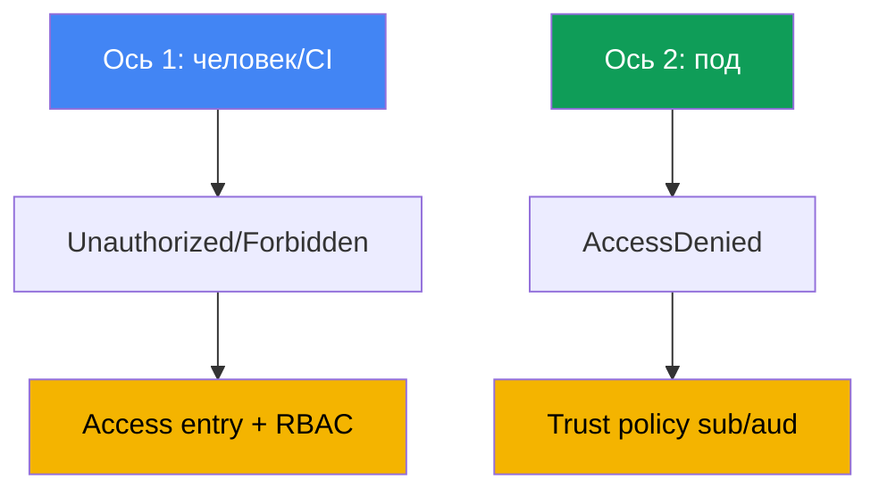
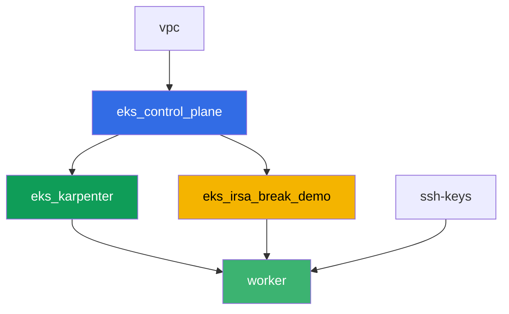

[Eng version](README.MD) · [Versión en español](README_ES.MD) · [Version française](README_FR.MD) · [Deutsche Version](README_DE.MD) · [ქართული ვერსია](README_GE.MD) · [繁體中文版](README_TW.MD) · [日本語版](README_JP.MD)

# Лаба 121 - Troubleshooting: access denied (access entries, IRSA, webhook, kubeconfig)

## Описание

Доступ к EKS ломается на двух независимых слоях, и их легко перепутать. Первый - человек
или CI не может войти в кластер: `kubectl` отвечает `Unauthorized` или `Forbidden` ещё до
того, как дело дойдёт до конкретного ресурса. Второй - под с настроенным IRSA получает
`AccessDenied` на вызове AWS, хотя аннотация ServiceAccount выглядит правильно. В этой
лабе вы воспроизводите оба симптома с нуля, диагностируете причину точными командами и
чините её тем инструментом, который для этого предназначен: access entry для первого
слоя, trust policy для второго.

Задания в продакшн-стиле: короткая постановка плюс критерии приёмки. Проверка -
автоматическая, командой `check_result`.

## Цель

Закрепить материал главы курса:

- [Глава 47. Доступ и IAM: access entries, IRSA, webhook, kubeconfig](../../course/47/ru.md)

## Что мы создаём

Terraform заранее создаёт бакет S3 и IRSA-роль с trust policy на конкретный
ServiceAccount. Вы воссоздаёте обе ситуации отказа доступа и обе их починки.

| Объект | Что это | Зачем в этой лабе |
|--------|---------|-------------------|
| Namespace `eks-121` | раздел кластера под нагрузку лабы | держим ресурсы отдельно от системных |
| Компонент `eks_irsa_break_demo` | S3 bucket, роль IRSA с trust на `demo-reader` | готовая цель для правильной и испорченной аннотации |
| Тестовая IAM-роль (`-test-` в имени) | принципал без access entry | воспроизводим `Unauthorized` (ось человека) |
| Access entry + `AmazonEKSViewPolicy` | починка `Unauthorized` | превращаем незамапленную identity в читателя кластера |
| ServiceAccount `demo-reader` (eks-121) | верная аннотация на IRSA-роль | `sub` в токене совпадает с trust policy - под читает S3 |
| ServiceAccount `demo-reader-broken` (default) | та же роль, другой namespace | `sub` не совпадает - `AccessDenied` (ось пода) |

Две оси доступа и их починка:



## Инфраструктура

Окружение разворачивается в AWS (`eu-central-1`) через Terragrunt. База совпадает с лабой
101 (control plane, Fargate под системные поды, Karpenter под нагрузку), плюс отдельный
компонент под демо-ресурсы IRSA.

### Модули и зависимости

| Каталог (компонент) | Модуль (`terraform/modules/`) | Зависит от | Что создаёт |
|---------------------|-------------------------------|------------|-------------|
| `vpc` | `vpc_v3` | - | VPC `10.10.0.0/16`, подсети в двух AZ, NAT |
| `ssh-keys` | `ssh-keys` | - | пара SSH-ключей для рабочей машины и нод |
| `eks_control_plane` | `eks_v2_control_plane` | `vpc` | control plane EKS `1.36`, OIDC-провайдер |
| `eks_fargate_system` | `eks_v2_fargate` | `vpc`, `eks_control_plane` | Fargate-профиль для `kube-system` и `karpenter` |
| `eks_addons` | `eks_v2_addons` | `eks_control_plane`, `eks_fargate_system` | coredns, kube-proxy, vpc-cni, eks-pod-identity-agent |
| `eks_karpenter` | `eks_v2_karpenter` | `vpc`, `eks_control_plane`, `eks_addons`, `eks_fargate_system` | контроллер Karpenter, IAM-роль нод |
| `eks_karpenter_default_vng` | `eks_v2_karpenter_vng` | `vpc`, `eks_control_plane`, `eks_karpenter` | дефолтный NodePool `default` на AL2023 |
| `eks_irsa_break_demo` | `eks_v2_irsa_break_demo` | `eks_control_plane` | S3 bucket, роль IRSA с trust на `eks-121/demo-reader` |
| `worker` | `eks_v2_work_pc` | `ssh-keys`, `vpc`, `eks_control_plane`, `eks_karpenter`, `eks_irsa_break_demo` | рабочая машина с kubectl, тестами и `check_result` |

Роль worker-а несёт отдельное право на управление и `sts:AssumeRole` для ролей с `-test-`
в имени - это то, что позволяет воспроизвести `Unauthorized` из задания 2 без выхода за
пределы прав самой лабы.

Граф зависимостей (что применяется раньше, то ниже по стрелке):



Компоненты `eks_fargate_system`, `eks_addons` и `eks_karpenter_default_vng` на графе не
показаны ради лимита в 8 узлов, но по факту стоят между `eks_control_plane` и
`eks_karpenter` (см. таблицу выше).

### Предсказуемые имена ресурсов

`eks_irsa_break_demo` собирает имена из `prefix` и `app_name`, поэтому worker находит их
без чтения terraform output. Они лежат в файле `~/lab121_hints.txt` на рабочей машине:

| Ресурс | Имя |
|--------|-----|
| S3 bucket | `eks-task121-irsa-break-demo-bucket` |
| Роль IRSA | `eks-task121-irsa-break-demo-irsa-role` |

### Где что настраивается

`env.hcl` (общие параметры окружения):

| Параметр | Значение в лабе | На что влияет |
|----------|-----------------|---------------|
| `region` | `eu-central-1` | регион всех ресурсов |
| `prefix` | `eks-task121` | префикс имён ресурсов, включая бакет и роль |
| `stack_name` | `eks121` | из него собирается `env_name` - имя кластера |
| `k8_version` | `1.36.0` | версия kubectl на рабочей машине |

`inputs` в `terragrunt.hcl` каждого компонента:

| Файл | Ключевые настройки |
|------|--------------------|
| `eks_irsa_break_demo/terragrunt.hcl` | `irsa.namespace = "eks-121"`, `irsa.service_account_name = "demo-reader"` |
| `worker/terragrunt.hcl` | `test_url` и `task_script_url` на файлы лабы 121, зависимость от `eks_irsa_break_demo` |

## Развёртывание

```bash
TASK=121 make run_eks_task
```

Развёртывание занимает примерно 15-20 минут. В выводе найдите строку с SSH-подключением к
рабочей машине и подключитесь к ней. kubectl там уже настроен на нужный кластер, а имена и
ARN ресурсов лабы - в файле `~/lab121_hints.txt`.

Полезные команды на рабочей машине:

```bash
time_left       # сколько осталось времени окружения
check_result    # проверить решение
cat ~/lab121_hints.txt   # имена и ARN бакета и IRSA-роли
```

> Безопасность стенда. В `env.hcl` включены `ssh_password_enable = true` и
> `access_cidrs = ["0.0.0.0/0"]` - это удобно для учебного окружения, но так делать в
> продакшене нельзя. По стандартам курса (главы 0.2, 2, 19) доступ к рабочим машинам
> открывают через AWS SSM Session Manager без публичных SSH-портов наружу, а `access_cidrs`
> сужают до конкретных адресов. Здесь публичный SSH оставлен только ради простоты запуска.

## Задания

Блок 1 (задания 1-4) разбирает ось человека или CI: почему `kubectl` не входит в кластер
и что в этой цепочке 401, а что 403. Блок 2 (задания 5-8) разбирает ось пода: почему
приложение с IRSA получает `AccessDenied`, хотя аннотация SA на месте.

---
|        **1**        | **Namespace для нагрузки лабы**                             |
| :-----------------: | :---------------------------------------------------------- |
| Что делаем          | Создайте namespace с именем `eks-121`. Все объекты лабы создаются внутри него. |
| Критерии приёмки    | - namespace `eks-121` существует. |
---
|        **2**        | **Симптом Unauthorized: роль без access entry**             |
| :-----------------: | :---------------------------------------------------------- |
| Что делаем          | Создайте тестовую IAM-роль с `-test-` в имени (например `eks-task121-test-noaccess`), доверяющую роли worker-а, без единой access entry в кластере. Сначала, **кредами worker-а**, постройте отдельный kubeconfig: `aws eks update-kubeconfig --name <cluster> --kubeconfig /tmp/kubeconfig-test`. Порядок важен: эта команда вызывает `eks:DescribeCluster`, а у тестовой роли нет ни одной IAM-политики, поэтому под ней она упадёт с `AccessDeniedException` и файл не создастся (это третий тип отказа - от IAM, до кластера дело не доходит). Затем выполните `aws sts assume-role` на тестовую роль, экспортируйте её креды в переменные окружения и выполните `kubectl --kubeconfig /tmp/kubeconfig-test get pods -A`: токен через `aws eks get-token` уйдёт уже от тестовой роли, и API-сервер ответит `Unauthorized`. Сохраните вывод в `/var/work/tests/artifacts/2/unauthorized.txt`. |
| Критерии приёмки    | - файл `2/unauthorized.txt` не пуст и содержит `Unauthorized`. |
---
|        **3**        | **Починка Unauthorized: access entry и AmazonEKSViewPolicy** |
| :-----------------: | :---------------------------------------------------------- |
| Что делаем          | Создайте access entry для тестовой роли (`aws eks create-access-entry ... --type STANDARD`) и ассоциируйте с ней политику `AmazonEKSViewPolicy` со scope `cluster`. Повторите `kubectl get pods -A` с тем же временным kubeconfig (креденшелы assume-role могут понадобиться заново) - теперь должен вернуться список подов, без `Unauthorized`. Сохраните вывод в `/var/work/tests/artifacts/3/authorized.txt`. |
| Критерии приёмки    | - файл `3/authorized.txt` не пуст, содержит заголовок списка подов и не содержит `Unauthorized`. |
---
|        **4**        | **Симптом Forbidden: View-роль не может писать**             |
| :-----------------: | :---------------------------------------------------------- |
| Что делаем          | С тем же временным kubeconfig (роль имеет только `AmazonEKSViewPolicy`) выполните `kubectl create namespace test-forbidden` - должен вернуться `Forbidden`. Сохраните вывод в `/var/work/tests/artifacts/4/forbidden.txt` и допишите туда объяснение разницы между `Unauthorized` из задания 2 и `Forbidden` из этого задания - в тексте должны быть оба слова. |
| Критерии приёмки    | - файл `4/forbidden.txt` не пуст и содержит и `Unauthorized`, и `Forbidden`. |
---
|        **5**        | **ServiceAccount с правильной аннотацией IRSA**              |
| :-----------------: | :---------------------------------------------------------- |
| Что делаем          | Создайте ServiceAccount `demo-reader` в `eks-121` с аннотацией `eks.amazonaws.com/role-arn`, равной ARN роли IRSA (`irsa_role_arn` из `~/lab121_hints.txt`). Создайте под с этим SA (образ `amazon/aws-cli:2.15.0`, команда `sleep 3600`), выполните внутри `aws sts get-caller-identity` (должен показать `assumed-role` этой роли) и прочитайте объект `hello.txt` из бакета. Сохраните оба вывода в `/var/work/tests/artifacts/5/irsa_ok.txt`. |
| Критерии приёмки    | - SA `demo-reader` в `eks-121` с аннотацией `role-arn`;<br/>- файл `5/irsa_ok.txt` не пуст, содержит `assumed-role` и `hello from s3`. |
---
|        **6**        | **Симптом AccessDenied: испорченная аннотация в другом namespace** |
| :-----------------: | :---------------------------------------------------------- |
| Что делаем          | Создайте второй ServiceAccount `demo-reader-broken` в namespace `default` с ТОЙ ЖЕ аннотацией на тот же `role-arn`. Trust policy роли ждёт `sub` с namespace `eks-121`, а не `default`, поэтому обмен токена должен провалиться. Создайте под с этим SA в `default`, выполните `aws sts get-caller-identity` - должен вернуться `AccessDenied` или ошибка обмена токена (`WebIdentityErr`). Сохраните вывод в `/var/work/tests/artifacts/6/broken.txt`. |
| Критерии приёмки    | - SA `demo-reader-broken` в `default` с аннотацией на тот же `role-arn`;<br/>- файл `6/broken.txt` не пуст и содержит `AccessDenied`, `not authorized` или `WebIdentityErr`. |
---
|        **7**        | **Диагностика: сравнение аннотаций по sub и namespace**      |
| :-----------------: | :---------------------------------------------------------- |
| Что делаем          | Сравните аннотацию `eks.amazonaws.com/role-arn` SA в обоих namespace (`kubectl get sa ... -o jsonpath=...role-arn`) и объясните в файле `/var/work/tests/artifacts/7/diagnostics.txt`, почему trust policy роли по условию `sub` не совпадает для второго случая. В тексте должны быть слова `sub` и `namespace`. |
| Критерии приёмки    | - файл `7/diagnostics.txt` не пуст и содержит `sub` и `namespace`. |
---
|        **8**        | **Резюме: две оси доступа**                                  |
| :-----------------: | :---------------------------------------------------------- |
| Что делаем          | Сохраните в файл `/var/work/tests/artifacts/8/summary.txt` сравнение двух осей (`Unauthorized`/`Forbidden` человека против `AccessDenied` пода) в 3-5 предложениях. Упомяните `RBAC` и `trust policy` как разные механизмы ремонта разных слоёв. |
| Критерии приёмки    | - файл `8/summary.txt` не пуст и содержит `RBAC` и `trust policy`. |
---

## Проверка результата

На рабочей машине запустите автоматическую проверку:

```bash
check_result
```

Скрипт прогонит тесты и покажет процент выполненных заданий.

## Решение

Эталонное решение: [worker/files/solutions/1_RU.MD](worker/files/solutions/1_RU.MD)

## Удаление кластера и ресурсов

> **Сначала уберите тестовую IAM-роль.** Роль `eks-task121-test-noaccess` вы создали вручную
> через AWS CLI в задании 2, в state terraform её нет, и `destroy` её не тронет. IAM-роли
> живут вне региона и вне кластера, поэтому она останется в аккаунте навсегда, а при повторном
> запуске лабы `aws iam create-role` упадёт с `EntityAlreadyExists`. Access entry удалять
> отдельно не обязательно (она исчезнет вместе с кластером), но если вы хотите пройти лабу
> заново на том же кластере, снимите и её.

```bash
CLUSTER_NAME=$(grep '^cluster_name' ~/lab121_hints.txt | awk '{print $3}')
TEST_ROLE_ARN=$(aws iam get-role --role-name eks-task121-test-noaccess \
  --query 'Role.Arn' --output text)

# access entry тестовой роли (нужно, если проходите лабу повторно)
aws eks delete-access-entry --cluster-name "$CLUSTER_NAME" --principal-arn "$TEST_ROLE_ARN"

# сама роль: политик на ней нет, поэтому удаляется сразу
aws iam delete-role --role-name eks-task121-test-noaccess
```

> **Снимите нагрузку до destroy.** Поды `irsa-app` и `broken-app` заставили Karpenter поднять
> EC2-ноду. Сами по себе поды и ServiceAccount AWS-ресурсов не создают, но нода - создаёт, и
> если удалять стенд вместе с живой нагрузкой, VPC CNI не успевает убрать свои вторичные ENI.
> Тогда ENI остаётся в состоянии `available`, держит security group нод, и `destroy` зависает
> на `module.eks.aws_security_group.node[0]: Still destroying...`. Дайте Karpenter корректно
> вывести ноду: удалите нагрузку и дождитесь, пока нода исчезнет.

```bash
kubectl delete pod irsa-app -n eks-121 --ignore-not-found
kubectl delete pod broken-app -n default --ignore-not-found
kubectl delete namespace eks-121 --ignore-not-found

# ждём, пока Karpenter уберёт свои EC2-ноды (останутся только fargate-*)
while kubectl get nodes --no-headers 2>/dev/null | grep -qv fargate; do
  echo "EC2-нода Karpenter ещё жива, ждём..."; sleep 15
done
```

```bash
TASK=121 make delete_eks_task
```

Если роль не удаляется с ошибкой `DeleteConflict`, значит на ней остались политики -
посмотрите их и снимите:

```bash
aws iam list-attached-role-policies --role-name eks-task121-test-noaccess
aws iam list-role-policies --role-name eks-task121-test-noaccess
```

Если `destroy` всё же встал на security group нод, найдите осиротевший ENI и удалите его -
после этого terraform дойдёт до конца сам:

```bash
# ENI в состоянии available с тегом eks:eni:owner=amazon-vpc-cni - это остаток VPC CNI
aws ec2 describe-network-interfaces --filters Name=status,Values=available \
  --query 'NetworkInterfaces[].[NetworkInterfaceId,Description,Groups[0].GroupName]' --output table
aws ec2 delete-network-interface --network-interface-id <eni-id>
```
