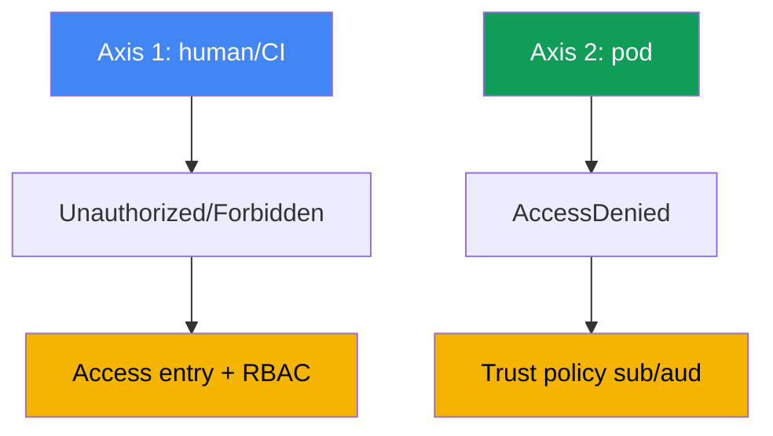
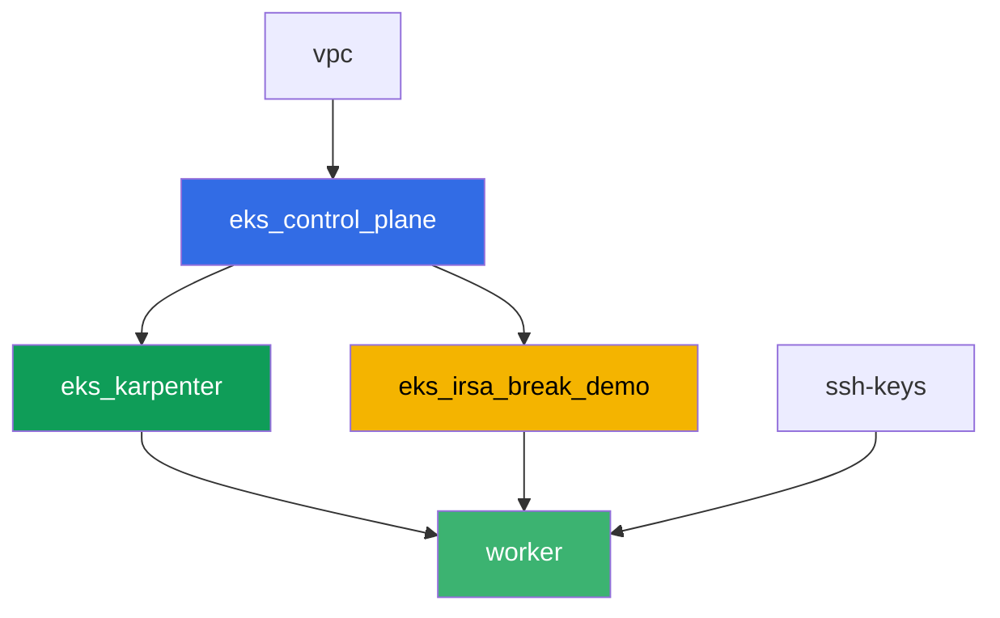

[Русская версия](README_RU.MD) · [Eng version](README.MD) · [Versión en español](README_ES.MD) · [Version française](README_FR.MD) · [Deutsche Version](README_DE.MD) · [ქართული ვერსია](README_GE.MD) · [日本語版](README_JP.MD)

# 實驗 121 - 疑難排解:access denied(access entries、IRSA、webhook、kubeconfig)

## 說明

EKS 的存取權會在兩個彼此獨立的層級上出問題,而這兩者很容易被混淆。第一個層級:一個
人類使用者或 CI 完全無法進入集群 - `kubectl` 在還沒碰到具體資源之前就返回
`Unauthorized` 或 `Forbidden`。第二個層級:一個已經配置好 IRSA 的 Pod 在呼叫 AWS API
時得到 `AccessDenied`,即使 ServiceAccount 的註解看起來是正確的。在這個實驗中,你會
從零重現這兩種症狀,用精確的命令診斷原因,並用專門為之設計的工具修復每一個問題:第
一層用 access entry,第二層用 trust policy。

任務以生產風格編寫:簡短的任務描述加驗收標準。驗證是自動的,透過 `check_result` 命令
完成。

## 目標

鞏固以下課程章節的內容:

- [第 47 章。存取與 IAM:access entries、IRSA、webhook、kubeconfig](../../course/47/ru.md)

## 我們要創建什麼

Terraform 預先創建了一個 S3 bucket 和一個信任特定 ServiceAccount 的 IRSA 角色。你要
重現這兩種拒絕存取的情境,並完成兩種修復。

| 對象 | 這是什麼 | 在這個實驗中的作用 |
|--------|---------|-------------------|
| Namespace `eks-121` | 供實驗負載使用的集群區塊 | 讓資源與系統資源保持分離 |
| 組件 `eks_irsa_break_demo` | S3 bucket、信任 `demo-reader` 的 IRSA 角色 | 為正確與錯誤的註解提供現成的目標 |
| 測試用 IAM 角色(名稱含 `-test-`) | 一個沒有 access entry 的主體 | 重現 `Unauthorized`(人類軸) |
| Access entry + `AmazonEKSViewPolicy` | `Unauthorized` 的修復方式 | 把一個未映射的身份變成集群的讀取者 |
| ServiceAccount `demo-reader`(eks-121) | IRSA 角色上正確的註解 | token 中的 `sub` 與 trust policy 相符 - Pod 能讀取 S3 |
| ServiceAccount `demo-reader-broken`(default) | 同一個角色,不同的 namespace | `sub` 不相符 - `AccessDenied`(Pod 軸) |

兩條存取軸線及其修復方式:



## 基礎設施

環境透過 Terragrunt 部署在 AWS(`eu-central-1`)。基礎部分與實驗 101 相同(control
plane、供系統 Pod 使用的 Fargate、供負載使用的 Karpenter),再加上一個專門用於 IRSA
示範資源的獨立組件。

### 模組與依賴關係

| 目錄(組件) | 模組(`terraform/modules/`) | 依賴於 | 創建了什麼 |
|---------------------|-------------------------------|------------|-------------|
| `vpc` | `vpc_v3` | - | VPC `10.10.0.0/16`,兩個 AZ 中的子網,NAT |
| `ssh-keys` | `ssh-keys` | - | 供工作機與節點使用的一對 SSH 金鑰 |
| `eks_control_plane` | `eks_v2_control_plane` | `vpc` | EKS control plane `1.36`、OIDC provider |
| `eks_fargate_system` | `eks_v2_fargate` | `vpc`、`eks_control_plane` | `kube-system` 與 `karpenter` 的 Fargate 配置檔 |
| `eks_addons` | `eks_v2_addons` | `eks_control_plane`、`eks_fargate_system` | coredns、kube-proxy、vpc-cni、eks-pod-identity-agent |
| `eks_karpenter` | `eks_v2_karpenter` | `vpc`、`eks_control_plane`、`eks_addons`、`eks_fargate_system` | Karpenter 控制器、節點 IAM 角色 |
| `eks_karpenter_default_vng` | `eks_v2_karpenter_vng` | `vpc`、`eks_control_plane`、`eks_karpenter` | 基於 AL2023 的預設 NodePool `default` |
| `eks_irsa_break_demo` | `eks_v2_irsa_break_demo` | `eks_control_plane` | S3 bucket、信任 `eks-121/demo-reader` 的 IRSA 角色 |
| `worker` | `eks_v2_work_pc` | `ssh-keys`、`vpc`、`eks_control_plane`、`eks_karpenter`、`eks_irsa_break_demo` | 帶有 kubectl、測試腳本和 `check_result` 的工作機 |

worker 的角色還帶有一項獨立的權限,可以管理名稱中含有 `-test-` 的角色,並對它們執行
`sts:AssumeRole` - 這正是任務 2 中重現 `Unauthorized` 所需要的,而且不會超出實驗本身
的權限範圍。

依賴關係圖(較早套用的組件位於箭頭下方):



組件 `eks_fargate_system`、`eks_addons` 和 `eks_karpenter_default_vng` 沒有顯示在圖中,
是為了讓節點數保持在 8 個以內,但它們實際上位於 `eks_control_plane` 和
`eks_karpenter` 之間(參見上面的表格)。

### 可預測的資源名稱

`eks_irsa_break_demo` 用 `prefix` 和 `app_name` 拼出資源名稱,因此 worker 不需要讀取
terraform 的輸出就能找到它們。這些名稱位於工作機上的 `~/lab121_hints.txt` 檔案中:

| 資源 | 名稱 |
|--------|-----|
| S3 bucket | `eks-task121-irsa-break-demo-bucket` |
| IRSA 角色 | `eks-task121-irsa-break-demo-irsa-role` |

### 配置位置

`env.hcl`(共用環境參數):

| 參數 | 實驗中的值 | 影響什麼 |
|----------|-----------------|---------------|
| `region` | `eu-central-1` | 所有資源所在的區域 |
| `prefix` | `eks-task121` | 資源名稱前綴,包括 bucket 和角色 |
| `stack_name` | `eks121` | 用於組成 `env_name` - 集群名稱 |
| `k8_version` | `1.36.0` | 工作機上的 kubectl 版本 |

各組件 `terragrunt.hcl` 中的 `inputs`:

| 檔案 | 關鍵設定 |
|------|--------------------|
| `eks_irsa_break_demo/terragrunt.hcl` | `irsa.namespace = "eks-121"`、`irsa.service_account_name = "demo-reader"` |
| `worker/terragrunt.hcl` | 實驗 121 檔案的 `test_url` 和 `task_script_url`,依賴於 `eks_irsa_break_demo` |

## 部署

```bash
TASK=121 make run_eks_task
```

部署大約需要 15-20 分鐘。在輸出中找到連接工作機的 SSH 那一行並連接上去。kubectl 在那
裡已經配置好指向正確的集群,實驗的資源名稱和 ARN 都在 `~/lab121_hints.txt` 中。

工作機上的常用命令:

```bash
time_left       # 環境剩餘的時間
check_result    # 檢查解答
cat ~/lab121_hints.txt   # bucket 和 IRSA 角色的名稱與 ARN
```

> 環境安全性。`env.hcl` 中啟用了 `ssh_password_enable = true` 和
> `access_cidrs = ["0.0.0.0/0"]` - 這對於學習環境很方便,但在生產環境中不應該這樣做。
> 依照課程標準(第 0.2、2、19 章),對工作機的存取應透過 AWS SSM Session Manager 進行,
> 不對外暴露公開的 SSH 端口,並將 `access_cidrs` 限制到具體的位址。這裡保留公開 SSH
> 只是為了簡化設置流程。

## 任務

第一部分(任務 1-4)涵蓋人類/CI 這條軸線:為什麼 `kubectl` 無法進入集群,以及這條鏈
路中哪一部分是 401、哪一部分是 403。第二部分(任務 5-8)涵蓋 Pod 這條軸線:為什麼一個
已經配置了 IRSA 的應用程式,即使 SA 註解已經到位,仍然會得到 `AccessDenied`。

---
|        **1**        | **實驗負載的 Namespace**                             |
| :-----------------: | :---------------------------------------------------------- |
| 我們要做什麼          | 創建一個名為 `eks-121` 的 namespace。這個實驗中的所有對象都會創建在裡面。 |
| 驗收標準    | - namespace `eks-121` 存在。 |
---
|        **2**        | **Unauthorized 症狀:一個沒有 access entry 的角色**             |
| :-----------------: | :---------------------------------------------------------- |
| 我們要做什麼          | 創建一個名稱中含 `-test-` 的測試用 IAM 角色(例如 `eks-task121-test-noaccess`),trust policy 只信任 worker 的角色,並且完全不為它創建任何 access entry。首先,**使用 worker 的憑證**,建立一個獨立的 kubeconfig:`aws eks update-kubeconfig --name <cluster> --kubeconfig /tmp/kubeconfig-test`。順序很重要:這個命令會呼叫 `eks:DescribeCluster`,而測試角色完全沒有任何 IAM policy,因此在該角色下執行會以 `AccessDeniedException` 失敗,檔案也不會被創建(這是第三種失敗類型 - 來自 IAM,根本沒有觸及集群)。接著對測試角色執行 `aws sts assume-role`,把它的憑證匯出到環境變數中,再執行 `kubectl --kubeconfig /tmp/kubeconfig-test get pods -A`:透過 `aws eks get-token` 取得的 token 現在會來自這個測試角色,API server 會回應 `Unauthorized`。將輸出保存到 `/var/work/tests/artifacts/2/unauthorized.txt`。 |
| 驗收標準    | - 檔案 `2/unauthorized.txt` 不為空,並且包含 `Unauthorized`。 |
---
|        **3**        | **修復 Unauthorized:access entry 與 AmazonEKSViewPolicy** |
| :-----------------: | :---------------------------------------------------------- |
| 我們要做什麼          | 為測試角色創建一個 access entry(`aws eks create-access-entry ... --type STANDARD`),並在 `cluster` scope 上將它與 `AmazonEKSViewPolicy` policy 關聯。用同一個臨時 kubeconfig 重新執行 `kubectl get pods -A`(可能需要重新 assume-role) - 現在應該返回 Pod 清單,不再出現 `Unauthorized`。將輸出保存到 `/var/work/tests/artifacts/3/authorized.txt`。 |
| 驗收標準    | - 檔案 `3/authorized.txt` 不為空,包含 Pod 清單的表頭,且不包含 `Unauthorized`。 |
---
|        **4**        | **Forbidden 症狀:一個 View 角色無法寫入**             |
| :-----------------: | :---------------------------------------------------------- |
| 我們要做什麼          | 用同一個臨時 kubeconfig(該角色只有 `AmazonEKSViewPolicy`),執行 `kubectl create namespace test-forbidden` - 應該返回 `Forbidden`。將輸出保存到 `/var/work/tests/artifacts/4/forbidden.txt`,並在後面附加一段說明,解釋任務 2 中的 `Unauthorized` 與這個任務中的 `Forbidden` 之間的差異 - 文字中必須出現這兩個詞。 |
| 驗收標準    | - 檔案 `4/forbidden.txt` 不為空,同時包含 `Unauthorized` 和 `Forbidden`。 |
---
|        **5**        | **帶有正確 IRSA 註解的 ServiceAccount**              |
| :-----------------: | :---------------------------------------------------------- |
| 我們要做什麼          | 在 `eks-121` 中創建 ServiceAccount `demo-reader`,把 `eks.amazonaws.com/role-arn` 註解設為 IRSA 角色的 ARN(`~/lab121_hints.txt` 中的 `irsa_role_arn`)。用這個 SA 創建一個 Pod(映像 `amazon/aws-cli:2.15.0`,命令 `sleep 3600`),在裡面執行 `aws sts get-caller-identity`(應該顯示該角色的 `assumed-role`),再讀取 bucket 中的 `hello.txt` 物件。把兩個輸出都保存到 `/var/work/tests/artifacts/5/irsa_ok.txt`。 |
| 驗收標準    | - `eks-121` 中的 SA `demo-reader` 帶有 `role-arn` 註解;<br/>- 檔案 `5/irsa_ok.txt` 不為空,包含 `assumed-role` 和 `hello from s3`。 |
---
|        **6**        | **AccessDenied 症狀:另一個 namespace 中的錯誤註解** |
| :-----------------: | :---------------------------------------------------------- |
| 我們要做什麼          | 在 namespace `default` 中創建第二個 ServiceAccount `demo-reader-broken`,帶有指向同一個 `role-arn` 的相同註解。這個角色的 trust policy 期望的 `sub` 中的 namespace 是 `eks-121`,不是 `default`,因此 token 交換應該會失敗。在 `default` 中用這個 SA 創建一個 Pod,執行 `aws sts get-caller-identity` - 應該返回 `AccessDenied` 或 token 交換錯誤(`WebIdentityErr`)。將輸出保存到 `/var/work/tests/artifacts/6/broken.txt`。 |
| 驗收標準    | - `default` 中的 SA `demo-reader-broken` 帶有指向同一個 `role-arn` 的註解;<br/>- 檔案 `6/broken.txt` 不為空,並包含 `AccessDenied`、`not authorized` 或 `WebIdentityErr`。 |
---
|        **7**        | **診斷:按 sub 和 namespace 對比註解**      |
| :-----------------: | :---------------------------------------------------------- |
| 我們要做什麼          | 對比兩個 namespace 中 SA 的 `eks.amazonaws.com/role-arn` 註解(`kubectl get sa ... -o jsonpath=...role-arn`),並在檔案 `/var/work/tests/artifacts/7/diagnostics.txt` 中解釋為什麼角色 trust policy 的 `sub` 條件在第二種情況下不相符。文字中必須包含 `sub` 和 `namespace` 這兩個詞。 |
| 驗收標準    | - 檔案 `7/diagnostics.txt` 不為空,且包含 `sub` 和 `namespace`。 |
---
|        **8**        | **總結:兩條存取軸線**                                  |
| :-----------------: | :---------------------------------------------------------- |
| 我們要做什麼          | 用 3-5 句話,把兩條軸線(人類的 `Unauthorized`/`Forbidden` 對比 Pod 的 `AccessDenied`)的對比保存到檔案 `/var/work/tests/artifacts/8/summary.txt`。要提到 `RBAC` 和 `trust policy` 這兩種針對不同層級的不同修復機制。 |
| 驗收標準    | - 檔案 `8/summary.txt` 不為空,且包含 `RBAC` 和 `trust policy`。 |
---

## 檢查結果

在工作機上執行自動檢查:

```bash
check_result
```

腳本會執行測試並顯示已完成任務的百分比。

## 解答

參考解答:[worker/files/solutions/1_TW.MD](worker/files/solutions/1_TW.MD)

## 刪除集群與資源

> **先移除測試用 IAM 角色。** 你在任務 2 中透過 AWS CLI 手動創建了角色
> `eks-task121-test-noaccess`,它不在 terraform 的 state 中,`destroy` 不會動到它。IAM
> 角色存在於任何區域和集群之外,因此它會永遠留在帳戶中,再次運行這個實驗時
> `aws iam create-role` 會因為 `EntityAlreadyExists` 而失敗。單獨刪除 access entry 不是
> 必須的(它會隨集群一起消失),但如果你想在同一個集群上重做這個實驗,也把它一起清掉。

```bash
CLUSTER_NAME=$(grep '^cluster_name' ~/lab121_hints.txt | awk '{print $3}')
TEST_ROLE_ARN=$(aws iam get-role --role-name eks-task121-test-noaccess \
  --query 'Role.Arn' --output text)

# 測試角色的 access entry(如果你要重做這個實驗會需要它)
aws eks delete-access-entry --cluster-name "$CLUSTER_NAME" --principal-arn "$TEST_ROLE_ARN"

# 角色本身:它沒有附加任何 policy,所以會立即被刪除
aws iam delete-role --role-name eks-task121-test-noaccess
```

> **在 destroy 之前移除負載。** Pod `irsa-app` 和 `broken-app` 讓 Karpenter 啟動了一個
> EC2 節點。Pod 和 ServiceAccount 本身不會創建 AWS 資源,但節點會,而如果你在負載仍然
> 運行時拆除堆疊,VPC CNI 就來不及移除它的次要 ENI。這個 ENI 會停留在 `available` 狀
> 態,持續佔用節點的 security group,`destroy` 就會卡在
> `module.eks.aws_security_group.node[0]: Still destroying...` 上。讓 Karpenter 正常
> 排空節點:先移除負載,再等待節點消失。

```bash
kubectl delete pod irsa-app -n eks-121 --ignore-not-found
kubectl delete pod broken-app -n default --ignore-not-found
kubectl delete namespace eks-121 --ignore-not-found

# 等待 Karpenter 移除它的 EC2 節點(應該只剩下 fargate-*)
while kubectl get nodes --no-headers 2>/dev/null | grep -qv fargate; do
  echo "Karpenter's EC2 node is still alive, waiting..."; sleep 15
done
```

```bash
TASK=121 make delete_eks_task
```

如果角色刪除失敗並返回 `DeleteConflict` 錯誤,說明它還附加著 policy - 檢查並移除它們:

```bash
aws iam list-attached-role-policies --role-name eks-task121-test-noaccess
aws iam list-role-policies --role-name eks-task121-test-noaccess
```

如果 `destroy` 仍然卡在節點的 security group 上,找到孤立的 ENI 並刪除它 - terraform
之後就會自行完成:

```bash
# 狀態為 available 且帶有 eks:eni:owner=amazon-vpc-cni 標籤的 ENI 是 VPC CNI 留下的殘留
aws ec2 describe-network-interfaces --filters Name=status,Values=available \
  --query 'NetworkInterfaces[].[NetworkInterfaceId,Description,Groups[0].GroupName]' --output table
aws ec2 delete-network-interface --network-interface-id <eni-id>
```
