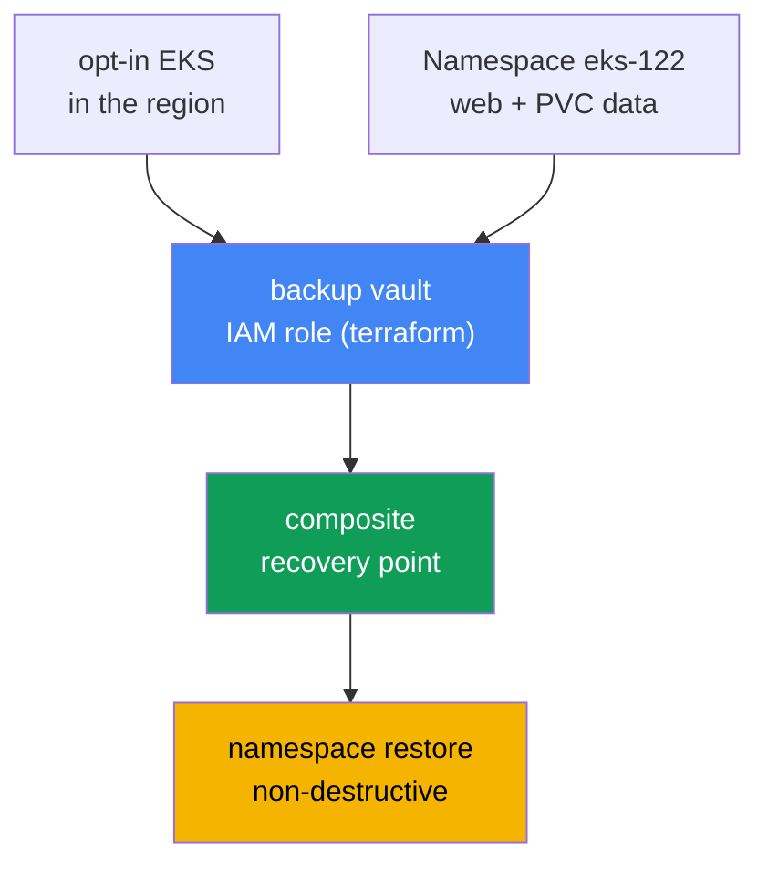
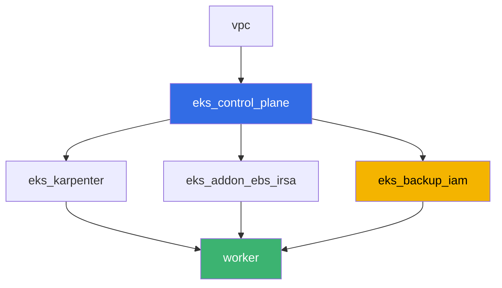

[Русская версия](README_RU.MD) · [Versión en español](README_ES.MD) · [Version française](README_FR.MD) · [Deutsche Version](README_DE.MD) · [ქართული ვერსია](README_GE.MD) · [繁體中文版](README_TW.MD) · [日本語版](README_JP.MD)

# Lab 122 - AWS Backup for EKS: composite recovery point, namespace restore

## Description

A lab about backing up and restoring cluster state and persistent volume data through
AWS Backup. You will opt in Amazon EKS for AWS Backup in the region, run an on-demand
backup of the cluster with a workload on an EBS volume, inspect a composite recovery
point (cluster state plus the volume as one consistent point), and restore a namespace
without destroying what already exists in the live cluster. At the end you will explain
why rolling back the cluster version cannot bring back a deleted namespace - the
motivating example from chapter 41.

Tasks are written in a production style: a short statement plus acceptance criteria.
Checking is automatic, via the `check_result` command.

## Goal

Reinforce the material from these course chapters:

- [Chapter 41. Cluster backup via AWS Backup](../../course/41/en.md) - composite
  recovery point, backup plan, vault, IAM role
- [Chapter 42. Restore and DR](../../course/42/en.md) - namespace restore,
  non-destructive restore
- [Chapter 23. EBS CSI](../../course/23/en.md) - StorageClass gp3, the volume behind
  the PVC that ends up in the backup
- [Chapter 5. Cluster access](../../course/05/en.md) - the `API_AND_CONFIG_MAP`
  authentication mode and access entries, without which AWS Backup cannot read the
  cluster

## What we create

| Object | What it is | Why it's in this lab |
|--------|---------|-------------------|
| Namespace `eks-122` | a cluster section for the lab workload | keeps resources isolated (chapter 4) |
| PVC `data` on StorageClass `gp3` | the volume behind the workload | the EBS volume AWS Backup captures as a child recovery point (chapter 41) |
| Deployment `web` + ConfigMap `marker` | workload and marker | the marker proves that the restored object came from the backup (chapter 42) |
| IAM role `<cluster>-backup` (terraform) | role for AWS Backup | `AWSBackupServiceRolePolicyForBackup`/`ForRestores` (chapter 41) |
| backup vault `<cluster>-vault` (terraform) | storage for recovery points | KMS encryption (chapter 41) |
| composite recovery point | result of the on-demand backup job | cluster state plus the `data` volume as one point (chapter 41) |
| namespace restore | restoring `eks-122` into the same cluster | non-destructive restore (chapter 42) |



## Infrastructure

The environment is deployed in AWS (`eu-central-1`) via Terragrunt. Each lab directory
is a single component with its own `terragrunt.hcl`, which references a shared module
in `terraform/modules/` and declares dependencies through `dependency` blocks. The base
is the same as in lab 101 (control plane, Fargate for system pods, Karpenter for the
workload), plus EBS CSI (for the volume behind the PVC) and a new component for the AWS
Backup IAM role and vault.

### Modules and dependencies

| Directory (component) | Module (`terraform/modules/`) | Depends on | What it creates |
|---------------------|-------------------------------|------------|-------------|
| `vpc` | `vpc_v3` | - | VPC `10.10.0.0/16`, subnets in two AZs, NAT |
| `ssh-keys` | `ssh-keys` | - | an SSH key pair for the worker machine and nodes |
| `eks_control_plane` | `eks_v2_control_plane` | `vpc` | EKS `1.36` control plane with an explicit `authentication_mode = "API_AND_CONFIG_MAP"` |
| `eks_fargate_system` | `eks_v2_fargate` | `vpc`, `eks_control_plane` | Fargate profile for `kube-system` and `karpenter` |
| `eks_addons` | `eks_v2_addons` | `eks_control_plane`, `eks_fargate_system` | coredns, kube-proxy, vpc-cni, pod-identity |
| `eks_karpenter` | `eks_v2_karpenter` | `vpc`, `eks_control_plane`, `eks_addons`, `eks_fargate_system` | Karpenter controller, node IAM role |
| `eks_karpenter_default_vng` | `eks_v2_karpenter_vng` | `vpc`, `eks_control_plane`, `eks_karpenter` | default `default` NodePool on AL2023 |
| `eks_addon_ebs_irsa` | `eks_v2_ebs_irsa` | `eks_fargate_system`, `eks_control_plane` | managed addon `aws-ebs-csi-driver` via IRSA |
| `eks_backup_iam` | `eks_v2_backup_iam` | `eks_control_plane` | AWS Backup IAM role and backup vault |
| `worker` | `eks_v2_work_pc` | `ssh-keys`, `vpc`, `eks_control_plane`, `eks_karpenter`, `eks_addon_ebs_irsa`, `eks_backup_iam` | worker machine with kubectl, tests and `check_result` |

Dependency graph (what is applied earlier is lower along the arrow):



### Why the control plane has an explicit `authentication_mode`

AWS Backup for EKS creates its own access entry and reads cluster objects through the
Kubernetes API - this requires the `API` or `API_AND_CONFIG_MAP` authentication mode
(chapter 41, section 41.3). The `terraform-aws-modules/eks/aws` module version 21
already sets `API_AND_CONFIG_MAP` by default, but in `eks_v2_control_plane/eks.tf` this
parameter is now set explicitly rather than left to the module's default - the lab's
precondition should not depend on a third-party module's version.

### Where things are configured

`env.hcl` (shared environment parameters, read by every component):

| Parameter | Value in the lab | What it affects |
|----------|-----------------|---------------|
| `region` | `eu-central-1` | region of all resources, including the AWS Backup opt-in |
| `prefix` | `eks-task122` | prefix for resource and tag names |
| `stack_name` | `eks122` | used to build `env_name` - the cluster name |
| `k8_version` | `1.36.0` | kubectl version on the worker machine |

`inputs` in each component's `terragrunt.hcl` (specific module parameters):

| File | Key settings |
|------|--------------------|
| `eks_addon_ebs_irsa/terragrunt.hcl` | managed addon `aws-ebs-csi-driver`, role via IRSA |
| `eks_backup_iam/terragrunt.hcl` | `name` - cluster name, role `<cluster>-backup`, vault `<cluster>-vault` |
| `worker/terragrunt.hcl` | `test_url` and `task_script_url` pointing to lab 122 files |

## Deployment

```bash
TASK=122 make run_eks_task
```

Deployment takes about 15-20 minutes. In the output, find the line with the SSH
connection to the worker machine and connect to it. kubectl is already configured for
the target cluster, the EBS CSI driver is already installed, and the AWS Backup role
name and vault are in the `~/lab122_hints.txt` file.

Useful commands on the worker machine:

```bash
time_left               # how much time is left in the environment
check_result             # check the solution
cat ~/lab122_hints.txt   # cluster name, AWS Backup role ARN, vault name
```

> Lab security. In `env.hcl`, `ssh_password_enable = true` and
> `access_cidrs = ["0.0.0.0/0"]` are enabled - convenient for a training environment,
> but not something to do in production. Per the course standards (chapters 0.2, 2, 19),
> access to worker machines is opened through AWS SSM Session Manager without public SSH
> ports facing outward, and `access_cidrs` is narrowed down to specific addresses. Here
> public SSH is left on purely for ease of launching the lab.

## Tasks

---
|        **1**        | **Namespace, EBS volume and marker for the future backup**          |
| :-----------------: | :---------------------------------------------------------- |
| What to do          | Create namespace `eks-122`. Create StorageClass `gp3` (`provisioner: ebs.csi.aws.com`, `volumeBindingMode: WaitForFirstConsumer`) and PVC `data` (`5Gi`) on that class. Create Deployment `web` (image `viktoruj/ping_pong:latest`, `1` replica) mounting PVC `data`. Create ConfigMap `marker` with any arbitrary value for the `marker` key and save the same value to the file `/var/work/tests/artifacts/1/marker.txt`. |
| Acceptance criteria    | - PVC `data` on class `gp3`, `Bound`;<br/>- Deployment `web` in `eks-122`, image `viktoruj/ping_pong`, at least one ready replica;<br/>- file `1/marker.txt` is not empty and matches the value of ConfigMap `marker`. |
---
|        **2**        | **Opt-in for Amazon EKS in AWS Backup for the region**                |
| :-----------------: | :---------------------------------------------------------- |
| What to do          | Check `aws backup describe-region-settings`, save the `before` state to the file `/var/work/tests/artifacts/2/optin.txt` as a `before=...` line. If Amazon EKS is not enabled, run `aws backup update-region-settings --resource-type-opt-in-preference '{"EKS":true}'`. Add an `after=...` line with the final value to the same file. |
| Acceptance criteria    | - `describe-region-settings` shows `ResourceTypeOptInPreference.EKS = true`;<br/>- file `2/optin.txt` contains lines `before=` and `after=true`. |
---
|        **3**        | **On-demand backup of the cluster**                                 |
| :-----------------: | :---------------------------------------------------------- |
| What to do          | Take the cluster ARN and the AWS Backup role ARN from `~/lab122_hints.txt`. Run `aws backup start-backup-job --resource-arn <cluster-arn> --iam-role-arn <role-arn> --backup-vault-name <vault>`. Wait for a terminal job status (`COMPLETED` or `PARTIAL` - the EBS snapshot of the `data` volume may take longer than the cluster state). Save `backup_job_id`, the final `status` and `recovery_point_arn` to the file `/var/work/tests/artifacts/3/backup_status.txt`. |
| Acceptance criteria    | - file `3/backup_status.txt` contains `backup_job_id=`, `status=`, `recovery_point_arn=`;<br/>- final status is `COMPLETED` or `PARTIAL`. |
---
|        **4**        | **Diagnosing the composite recovery point**                      |
| :-----------------: | :---------------------------------------------------------- |
| What to do          | Run `aws backup list-recovery-points-by-backup-vault --backup-vault-name <vault>` and find the composite point from task 3, as well as its nested (child) points via `--by-parent-recovery-point-arn`. In the file `/var/work/tests/artifacts/4/composite.txt` write an explanation, using terms from chapter 41, of what a composite recovery point is, how a child point of cluster state differs from a child point of a volume, and what the `ParentRecoveryPointArn` field means. The text must contain the words `composite`, `child` and `ParentRecoveryPointArn` (or `nested`). |
| Acceptance criteria    | - file `4/composite.txt` is not empty and contains `composite`, `child`, `ParentRecoveryPointArn`/`nested`. |
---
|        **5**        | **Namespace restore: non-destructive**                        |
| :-----------------: | :---------------------------------------------------------- |
| What to do          | Run `aws backup start-restore-job` on the composite recovery point from task 3 with EKS metadata: `clusterName` (the same cluster), `newCluster=false`, `namespaceLevelRestore=true`, `namespaces=["eks-122"]`. This set is **not enough**: the composite point also contains an EBS snapshot, and restoring it requires AWS Backup to be given an Availability Zone. Without it the child volume restore job fails with `Restore Job failed as no restore metadata was provided`, and the parent one fails with `All PV restore jobs failed to restore`. Add the `nestedRestoreJobs` parameter - a map of `nested point ARN -> {"AvailabilityZone":"<zone>"}`, taking the zone of an existing EC2 node (`topology.kubernetes.io/zone`), otherwise the volume will be created where nothing can mount it. Note the nested encoding: the `nestedRestoreJobs` value is a JSON string containing a map, whose element value is itself a JSON string; an extra level of quoting produces `Invalid JSON format in NestedRestoreMetadata`. Wait for status `COMPLETED` (usually 7-8 minutes). Make sure Deployment `web` and ConfigMap `marker` were not duplicated and the marker value matches the file from task 1. Save `restore_job_id`, `status` and an explanation of the non-destructive behavior (with the word `non-destructive`) to `/var/work/tests/artifacts/5/restore_status.txt`. |
| Acceptance criteria    | - file `5/restore_status.txt` contains `restore_job_id=` and mentions `non-destructive`;<br/>- restore job status is `COMPLETED`;<br/>- Deployment `web` has at least one ready replica after the restore. |
---
|        **6**        | **Why rolling back the cluster version does not save you from `kubectl delete namespace`** |
| :-----------------: | :---------------------------------------------------------- |
| What to do          | Explain in the file `/var/work/tests/artifacts/6/whynonrollback.txt` why rolling back the cluster version (chapter 39) cannot bring back a namespace deleted with `kubectl delete namespace` (the motivating example from section 41.1 of chapter 41). The text must contain the words `etcd`, `rollback` and `namespace`. |
| Acceptance criteria    | - file `6/whynonrollback.txt` is not empty and contains `etcd`, `rollback`, `namespace`. |
---

## Checking the result

On the worker machine, run the automatic check:

```bash
check_result
```

The script will run the tests and show the percentage of completed tasks. Tasks 3 and 5
wait for a terminal backup/restore job status for up to 10 minutes - that's normal for
an EBS snapshot.

## Solution

Reference solution: [worker/files/solutions/1.MD](worker/files/solutions/1.MD)

## Deleting the cluster and resources

> **Here, `destroy` will not pass without preparation.** The backup vault was created by
> terraform, but the recovery points inside it were not - you created them with
> `start-backup-job`. Terraform cannot delete a non-empty vault, so the recovery points
> must be deleted first. Order matters: nested (child) first, then composite - AWS won't
> let you delete the parent point while it has children
> (`Parent recovery point cannot be deleted because it has child recovery points`).
> Separately: the restore created a **new EBS volume** outside terraform (without
> Kubernetes tags), and it will stay around and keep being billed. And as in other labs
> with a PVC - delete the namespace before tearing down the cluster, otherwise EBS CSI
> won't have time to delete the volume behind the PVC.

```bash
VAULT=$(grep '^vault_name' ~/lab122_hints.txt | awk '{print $3}')

# 1. Remove the workload: EBS CSI deletes the volume behind the PVC, Karpenter removes the node
kubectl delete namespace eks-122 --ignore-not-found
while kubectl get nodes --no-headers 2>/dev/null | grep -qv fargate; do
  echo "Karpenter EC2 node is still alive, waiting..."; sleep 15
done

# 2. Delete nested points first, then the composite one
for ARN in $(aws backup list-recovery-points-by-backup-vault --backup-vault-name "$VAULT" \
    --query 'RecoveryPoints[?IsParent==`false`].RecoveryPointArn' --output text); do
  aws backup delete-recovery-point --backup-vault-name "$VAULT" --recovery-point-arn "$ARN"
done
sleep 30
for ARN in $(aws backup list-recovery-points-by-backup-vault --backup-vault-name "$VAULT" \
    --query 'RecoveryPoints[?IsParent==`true`].RecoveryPointArn' --output text); do
  aws backup delete-recovery-point --backup-vault-name "$VAULT" --recovery-point-arn "$ARN"
done

# the vault should become empty, otherwise terraform will not be able to delete it
aws backup list-recovery-points-by-backup-vault --backup-vault-name "$VAULT" \
  --query 'length(RecoveryPoints)' --output text
```

Next remove the volume created by the restore. It's easy to spot: it's `available` and
**has no tags at all** (volumes behind a PVC are tagged
`kubernetes.io/created-for/pvc/name` by the driver, which also removes them itself, but
this volume was created by AWS Backup and has no owner):

```bash
# untagged volumes are the result of the restore
aws ec2 describe-volumes --filters Name=status,Values=available \
  --query 'Volumes[?Tags==null].[VolumeId,Size,CreateTime]' --output table
aws ec2 delete-volume --volume-id <vol-id>
```

```bash
TASK=122 make delete_eks_task
```
