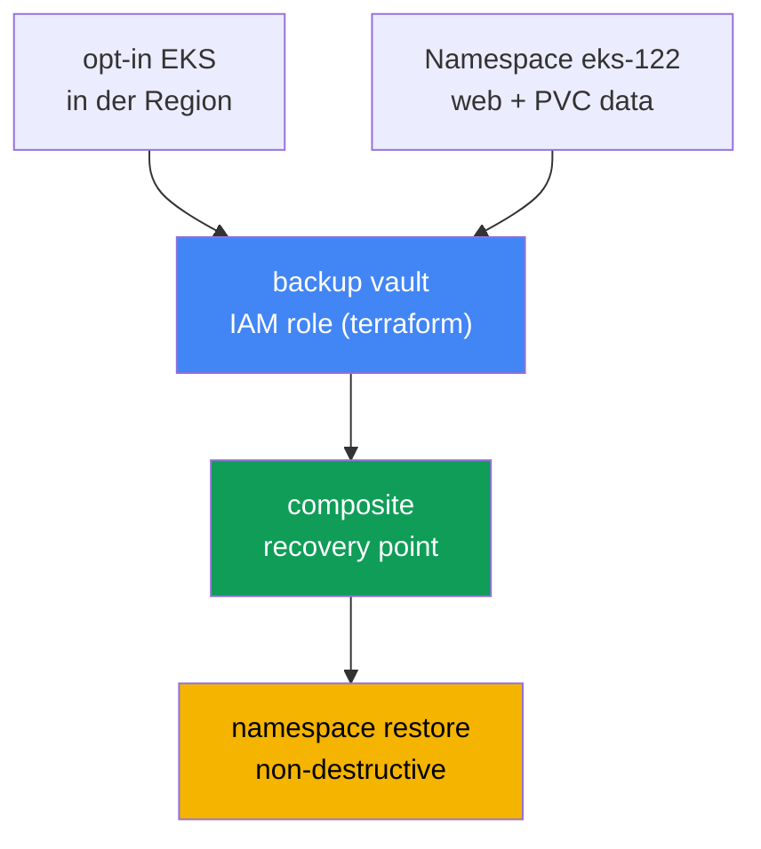
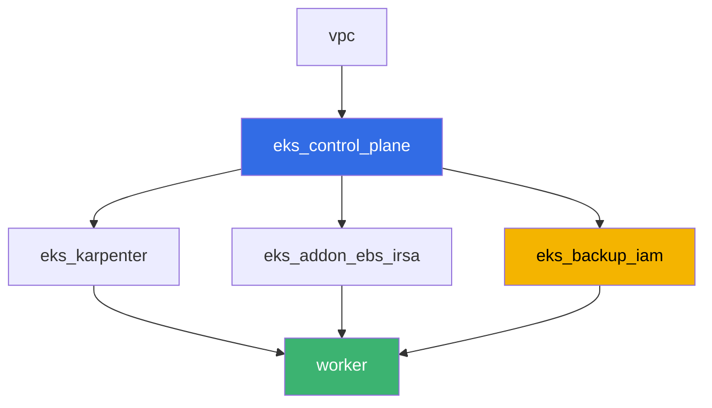

[Русская версия](README_RU.MD) · [Eng version](README.MD) · [Versión en español](README_ES.MD) · [Version française](README_FR.MD) · [ქართული ვერსია](README_GE.MD) · [繁體中文版](README_TW.MD) · [日本語版](README_JP.MD)

# Lab 122 - AWS Backup für EKS: composite recovery point, Wiederherstellung eines namespace

## Beschreibung

Ein Lab über das Sichern und Wiederherstellen des Clusterzustands und der Daten
persistenter Volumes mit AWS Backup. Sie aktivieren den opt-in für Amazon EKS in AWS
Backup für die Region, starten ein on-demand Backup des Clusters mit einer Last auf einem
EBS-Volume, analysieren einen composite recovery point (Clusterzustand plus Volume als ein
konsistenter Punkt) und stellen einen namespace wieder her, ohne das zu zerstören, was im
laufenden Cluster bereits existiert. Am Ende erklären Sie, warum ein rollback der
Clusterversion einen gelöschten namespace nicht zurückbringen kann - das motivierende
Beispiel aus Kapitel 41.

Die Aufgaben sind im Produktionsstil formuliert: eine kurze Aufgabenstellung plus
Abnahmekriterien. Die Prüfung erfolgt automatisch über den Befehl `check_result`.

## Ziel

Den Stoff der folgenden Kurskapitel festigen:

- [Kapitel 41. Cluster-Backup mit AWS Backup](../../course/41/de.md) - composite
  recovery point, backup plan, vault, IAM role
- [Kapitel 42. Wiederherstellung und DR](../../course/42/de.md) - namespace restore,
  non-destructive restore
- [Kapitel 23. EBS CSI](../../course/23/de.md) - StorageClass gp3, das Volume hinter dem
  PVC, das im Backup landet
- [Kapitel 5. Zugriff auf den Cluster](../../course/05/de.md) - der
  Authentifizierungsmodus `API_AND_CONFIG_MAP` und access entries, ohne die AWS Backup den
  Cluster nicht lesen kann

## Was wir erstellen

| Objekt | Was es ist | Wozu es in diesem Lab dient |
|--------|---------|-------------------|
| Namespace `eks-122` | ein Clusterbereich für die Last des Labs | hält die Ressourcen isoliert (Kapitel 4) |
| PVC `data` auf StorageClass `gp3` | das Volume hinter der Last | das EBS-Volume, das AWS Backup als child recovery point erfasst (Kapitel 41) |
| Deployment `web` + ConfigMap `marker` | Last und Marker | der Marker beweist, dass das wiederhergestellte Objekt aus dem Backup kam (Kapitel 42) |
| IAM role `<cluster>-backup` (terraform) | Rolle für AWS Backup | `AWSBackupServiceRolePolicyForBackup`/`ForRestores` (Kapitel 41) |
| backup vault `<cluster>-vault` (terraform) | Speicher für recovery points | KMS-Verschlüsselung (Kapitel 41) |
| composite recovery point | Ergebnis des on-demand backup job | Clusterzustand plus Volume `data` als ein Punkt (Kapitel 41) |
| namespace restore | Wiederherstellung von `eks-122` in denselben Cluster | non-destructive restore (Kapitel 42) |



## Infrastruktur

Die Umgebung wird in AWS (`eu-central-1`) über Terragrunt bereitgestellt. Jedes
Lab-Verzeichnis ist eine einzelne Komponente mit eigener `terragrunt.hcl`, die auf ein
gemeinsames Modul in `terraform/modules/` verweist und Abhängigkeiten über
`dependency`-Blöcke deklariert. Die Basis ist dieselbe wie in Lab 101 (control plane,
Fargate für System-Pods, Karpenter für die Last), plus EBS CSI (für das Volume hinter dem
PVC) und eine neue Komponente für die IAM role und den vault von AWS Backup.

### Module und Abhängigkeiten

| Verzeichnis (Komponente) | Modul (`terraform/modules/`) | Hängt ab von | Was es erstellt |
|---------------------|-------------------------------|------------|-------------|
| `vpc` | `vpc_v3` | - | VPC `10.10.0.0/16`, Subnetze in zwei AZ, NAT |
| `ssh-keys` | `ssh-keys` | - | ein SSH-Schlüsselpaar für die Worker-Maschine und die Nodes |
| `eks_control_plane` | `eks_v2_control_plane` | `vpc` | EKS `1.36` control plane mit explizitem `authentication_mode = "API_AND_CONFIG_MAP"` |
| `eks_fargate_system` | `eks_v2_fargate` | `vpc`, `eks_control_plane` | Fargate-Profil für `kube-system` und `karpenter` |
| `eks_addons` | `eks_v2_addons` | `eks_control_plane`, `eks_fargate_system` | coredns, kube-proxy, vpc-cni, pod-identity |
| `eks_karpenter` | `eks_v2_karpenter` | `vpc`, `eks_control_plane`, `eks_addons`, `eks_fargate_system` | Karpenter-Controller, IAM role der Nodes |
| `eks_karpenter_default_vng` | `eks_v2_karpenter_vng` | `vpc`, `eks_control_plane`, `eks_karpenter` | Standard-NodePool `default` auf AL2023 |
| `eks_addon_ebs_irsa` | `eks_v2_ebs_irsa` | `eks_fargate_system`, `eks_control_plane` | managed addon `aws-ebs-csi-driver` über IRSA |
| `eks_backup_iam` | `eks_v2_backup_iam` | `eks_control_plane` | IAM role von AWS Backup und backup vault |
| `worker` | `eks_v2_work_pc` | `ssh-keys`, `vpc`, `eks_control_plane`, `eks_karpenter`, `eks_addon_ebs_irsa`, `eks_backup_iam` | Worker-Maschine mit kubectl, tests und `check_result` |

Abhängigkeitsgraph (was früher angewendet wird, steht weiter unten entlang des Pfeils):



### Warum das control plane einen expliziten `authentication_mode` hat

AWS Backup für EKS erstellt sich eine eigene access entry und liest Clusterobjekte über
die Kubernetes-API - dafür ist der Authentifizierungsmodus `API` oder
`API_AND_CONFIG_MAP` erforderlich (Kapitel 41, Abschnitt 41.3). Das Modul
`terraform-aws-modules/eks/aws` in Version 21 setzt `API_AND_CONFIG_MAP` bereits
standardmäßig, aber in `eks_v2_control_plane/eks.tf` wird dieser Parameter nun explizit
gesetzt statt auf dem Modul-Standard belassen - die Vorbedingung des Labs darf nicht von
der Version eines Fremdmoduls abhängen.

### Wo was konfiguriert wird

`env.hcl` (gemeinsame Umgebungsparameter, von allen Komponenten gelesen):

| Parameter | Wert im Lab | Worauf es sich auswirkt |
|----------|-----------------|---------------|
| `region` | `eu-central-1` | Region aller Ressourcen, einschließlich des opt-in für AWS Backup |
| `prefix` | `eks-task122` | Präfix für Ressourcennamen und Tags |
| `stack_name` | `eks122` | daraus wird `env_name` gebildet - der Clustername |
| `k8_version` | `1.36.0` | kubectl-Version auf der Worker-Maschine |

`inputs` in der `terragrunt.hcl` jeder Komponente (Parameter des konkreten Moduls):

| Datei | Wichtige Einstellungen |
|------|--------------------|
| `eks_addon_ebs_irsa/terragrunt.hcl` | managed addon `aws-ebs-csi-driver`, Rolle über IRSA |
| `eks_backup_iam/terragrunt.hcl` | `name` - Clustername, Rolle `<cluster>-backup`, vault `<cluster>-vault` |
| `worker/terragrunt.hcl` | `test_url` und `task_script_url` zeigen auf die Dateien von Lab 122 |

## Bereitstellung

```bash
TASK=122 make run_eks_task
```

Die Bereitstellung dauert etwa 15-20 Minuten. Suchen Sie in der Ausgabe die Zeile mit der
SSH-Verbindung zur Worker-Maschine und verbinden Sie sich. kubectl ist dort schon auf den
gewünschten Cluster konfiguriert, der EBS CSI Treiber ist bereits installiert, und der
Name der Rolle und des vault von AWS Backup stehen in der Datei `~/lab122_hints.txt`.

Nützliche Befehle auf der Worker-Maschine:

```bash
time_left               # wie viel Zeit der Umgebung noch bleibt
check_result             # die Lösung prüfen
cat ~/lab122_hints.txt   # Clustername, ARN der AWS Backup Rolle, Name des vault
```

> Sicherheit der Übungsumgebung. In `env.hcl` sind `ssh_password_enable = true` und
> `access_cidrs = ["0.0.0.0/0"]` aktiviert - praktisch für eine Lernumgebung, aber in
> Produktion darf man das nicht tun. Nach den Kursstandards (Kapitel 0.2, 2, 19) wird der
> Zugriff auf Worker-Maschinen über AWS SSM Session Manager geöffnet, ohne öffentliche
> SSH-Ports nach außen, und `access_cidrs` wird auf konkrete Adressen eingeschränkt. Hier
> bleibt öffentliches SSH nur zur Einfachheit des Starts aktiv.

## Aufgaben

---
|        **1**        | **Namespace, EBS-Volume und Marker für das künftige Backup**          |
| :-----------------: | :---------------------------------------------------------- |
| Was zu tun ist          | Erstellen Sie den namespace `eks-122`. Erstellen Sie die StorageClass `gp3` (`provisioner: ebs.csi.aws.com`, `volumeBindingMode: WaitForFirstConsumer`) und das PVC `data` (`5Gi`) auf dieser Klasse. Erstellen Sie das Deployment `web` (Image `viktoruj/ping_pong:latest`, `1` Replica), das das PVC `data` einbindet. Erstellen Sie die ConfigMap `marker` mit einem beliebigen Wert für den Schlüssel `marker` und speichern Sie denselben Wert in die Datei `/var/work/tests/artifacts/1/marker.txt`. |
| Abnahmekriterien    | - PVC `data` auf der Klasse `gp3`, `Bound`;<br/>- Deployment `web` in `eks-122`, Image `viktoruj/ping_pong`, mindestens eine bereite Replica;<br/>- die Datei `1/marker.txt` ist nicht leer und stimmt mit dem Wert der ConfigMap `marker` überein. |
---
|        **2**        | **Opt-in für Amazon EKS in AWS Backup für die Region**                |
| :-----------------: | :---------------------------------------------------------- |
| Was zu tun ist          | Prüfen Sie `aws backup describe-region-settings` und speichern Sie den Zustand `vorher` als Zeile `before=...` in die Datei `/var/work/tests/artifacts/2/optin.txt`. Wenn Amazon EKS nicht aktiviert ist, führen Sie `aws backup update-region-settings --resource-type-opt-in-preference '{"EKS":true}'` aus. Fügen Sie derselben Datei eine Zeile `after=...` mit dem Endwert hinzu. |
| Abnahmekriterien    | - `describe-region-settings` zeigt `ResourceTypeOptInPreference.EKS = true`;<br/>- die Datei `2/optin.txt` enthält die Zeilen `before=` und `after=true`. |
---
|        **3**        | **On-demand Backup des Clusters**                                 |
| :-----------------: | :---------------------------------------------------------- |
| Was zu tun ist          | Nehmen Sie den ARN des Clusters und den ARN der AWS Backup Rolle aus `~/lab122_hints.txt`. Führen Sie `aws backup start-backup-job --resource-arn <cluster-arn> --iam-role-arn <role-arn> --backup-vault-name <vault>` aus. Warten Sie auf einen Endstatus des Jobs (`COMPLETED` oder `PARTIAL` - der EBS-Snapshot des Volumes `data` kann länger dauern als der Clusterzustand). Speichern Sie `backup_job_id`, den endgültigen `status` und `recovery_point_arn` in die Datei `/var/work/tests/artifacts/3/backup_status.txt`. |
| Abnahmekriterien    | - die Datei `3/backup_status.txt` enthält `backup_job_id=`, `status=`, `recovery_point_arn=`;<br/>- der Endstatus ist `COMPLETED` oder `PARTIAL`. |
---
|        **4**        | **Diagnose des composite recovery point**                      |
| :-----------------: | :---------------------------------------------------------- |
| Was zu tun ist          | Führen Sie `aws backup list-recovery-points-by-backup-vault --backup-vault-name <vault>` aus und finden Sie den composite Punkt aus Aufgabe 3 sowie seine verschachtelten (child) Punkte über `--by-parent-recovery-point-arn`. Schreiben Sie in die Datei `/var/work/tests/artifacts/4/composite.txt` eine Erklärung mit den Begriffen aus Kapitel 41: was ein composite recovery point ist, wie sich der child Punkt des Clusterzustands vom child Punkt des Volumes unterscheidet und was das Feld `ParentRecoveryPointArn` bedeutet. Der Text muss die Wörter `composite`, `child` und `ParentRecoveryPointArn` (oder `nested`) enthalten. |
| Abnahmekriterien    | - die Datei `4/composite.txt` ist nicht leer und enthält `composite`, `child`, `ParentRecoveryPointArn`/`nested`. |
---
|        **5**        | **Namespace restore: non-destructive**                        |
| :-----------------: | :---------------------------------------------------------- |
| Was zu tun ist          | Starten Sie `aws backup start-restore-job` auf dem composite recovery point aus Aufgabe 3 mit EKS-Metadaten: `clusterName` (derselbe Cluster), `newCluster=false`, `namespaceLevelRestore=true`, `namespaces=["eks-122"]`. Dieser Satz **genügt nicht**: im composite Punkt steckt zusätzlich ein EBS-Snapshot, und für dessen Wiederherstellung verlangt AWS Backup zwingend eine Availability Zone. Ohne sie scheitert der child restore job des Volumes mit `Restore Job failed as no restore metadata was provided`, und der übergeordnete mit `All PV restore jobs failed to restore`. Fügen Sie den Parameter `nestedRestoreJobs` hinzu - eine Map `ARN des verschachtelten Punktes -> {"AvailabilityZone":"<Zone>"}`, wobei Sie die Zone eines vorhandenen EC2-Nodes nehmen (`topology.kubernetes.io/zone`), sonst entsteht das Volume dort, wo es nichts einbinden kann. Achten Sie auf die verschachtelte Kodierung: der Wert von `nestedRestoreJobs` ist ein JSON-String mit einer Map, deren Elementwert selbst wieder ein JSON-String ist; eine zusätzliche Ebene Anführungszeichen führt zu `Invalid JSON format in NestedRestoreMetadata`. Warten Sie auf den Status `COMPLETED` (üblicherweise 7-8 Minuten). Stellen Sie sicher, dass das Deployment `web` und die ConfigMap `marker` nicht dupliziert wurden und der Wert des Markers mit der Datei aus Aufgabe 1 übereinstimmt. Speichern Sie `restore_job_id`, `status` und eine Erklärung des non-destructive Verhaltens (mit dem Wort `non-destructive`) in `/var/work/tests/artifacts/5/restore_status.txt`. |
| Abnahmekriterien    | - die Datei `5/restore_status.txt` enthält `restore_job_id=` und erwähnt `non-destructive`;<br/>- der Status des restore job ist `COMPLETED`;<br/>- das Deployment `web` hat nach dem restore mindestens eine bereite Replica. |
---
|        **6**        | **Warum ein rollback der Clusterversion nicht vor `kubectl delete namespace` schützt** |
| :-----------------: | :---------------------------------------------------------- |
| Was zu tun ist          | Erklären Sie in der Datei `/var/work/tests/artifacts/6/whynonrollback.txt`, warum ein rollback der Clusterversion (Kapitel 39) einen mit `kubectl delete namespace` gelöschten namespace nicht zurückbringen kann (das motivierende Beispiel aus Abschnitt 41.1 von Kapitel 41). Der Text muss die Wörter `etcd`, `rollback` und `namespace` enthalten. |
| Abnahmekriterien    | - die Datei `6/whynonrollback.txt` ist nicht leer und enthält `etcd`, `rollback`, `namespace`. |
---

## Prüfung des Ergebnisses

Starten Sie auf der Worker-Maschine die automatische Prüfung:

```bash
check_result
```

Das Skript führt die Tests aus und zeigt den Prozentsatz der erledigten Aufgaben. Die
Aufgaben 3 und 5 warten bis zu 10 Minuten auf einen Endstatus des backup/restore job - das
ist für einen EBS-Snapshot normal.

## Lösung

Referenzlösung: [worker/files/solutions/1_DE.MD](worker/files/solutions/1_DE.MD)

## Löschen des Clusters und der Ressourcen

> **Hier läuft `destroy` ohne Vorbereitung nicht durch.** Der backup vault wurde von
> terraform erstellt, die recovery points darin aber nicht - die haben Sie mit
> `start-backup-job` angelegt. Terraform kann einen nicht leeren vault nicht löschen, also
> müssen zuerst die recovery points weg. Die Reihenfolge ist wichtig: zuerst die
> verschachtelten (child), dann der composite - den übergeordneten Punkt lässt AWS nicht
> löschen, solange er Kinder hat
> (`Parent recovery point cannot be deleted because it has child recovery points`).
> Zusätzlich: der restore hat ein **neues EBS-Volume** außerhalb von terraform erzeugt (ohne
> Kubernetes-Tags), und es bleibt bestehen und wird weiter berechnet. Und wie in anderen
> Labs mit PVC - löschen Sie den namespace, bevor Sie den Cluster abreißen, sonst schafft
> EBS CSI es nicht, das Volume hinter dem PVC zu löschen.

```bash
VAULT=$(grep '^vault_name' ~/lab122_hints.txt | awk '{print $3}')

# 1. Last entfernen: EBS CSI löscht das Volume hinter dem PVC, Karpenter entfernt den Node
kubectl delete namespace eks-122 --ignore-not-found
while kubectl get nodes --no-headers 2>/dev/null | grep -qv fargate; do
  echo "Der EC2-Node von Karpenter lebt noch, warten..."; sleep 15
done

# 2. Zuerst die verschachtelten Punkte löschen, dann den composite
for ARN in $(aws backup list-recovery-points-by-backup-vault --backup-vault-name "$VAULT" \
    --query 'RecoveryPoints[?IsParent==`false`].RecoveryPointArn' --output text); do
  aws backup delete-recovery-point --backup-vault-name "$VAULT" --recovery-point-arn "$ARN"
done
sleep 30
for ARN in $(aws backup list-recovery-points-by-backup-vault --backup-vault-name "$VAULT" \
    --query 'RecoveryPoints[?IsParent==`true`].RecoveryPointArn' --output text); do
  aws backup delete-recovery-point --backup-vault-name "$VAULT" --recovery-point-arn "$ARN"
done

# der vault muss leer werden, sonst löscht terraform ihn nicht
aws backup list-recovery-points-by-backup-vault --backup-vault-name "$VAULT" \
  --query 'length(RecoveryPoints)' --output text
```

Entfernen Sie danach das Volume, das der restore erzeugt hat. Es ist leicht zu erkennen: es
ist `available` und **hat überhaupt keine Tags** (Volumes hinter einem PVC markiert der
Treiber mit `kubernetes.io/created-for/pvc/name` und entfernt sie selbst, dieses Volume
aber hat AWS Backup erstellt, und es hat keinen Besitzer):

```bash
# Volumes ohne Tags sind genau das Ergebnis des restore
aws ec2 describe-volumes --filters Name=status,Values=available \
  --query 'Volumes[?Tags==null].[VolumeId,Size,CreateTime]' --output table
aws ec2 delete-volume --volume-id <vol-id>
```

```bash
TASK=122 make delete_eks_task
```
