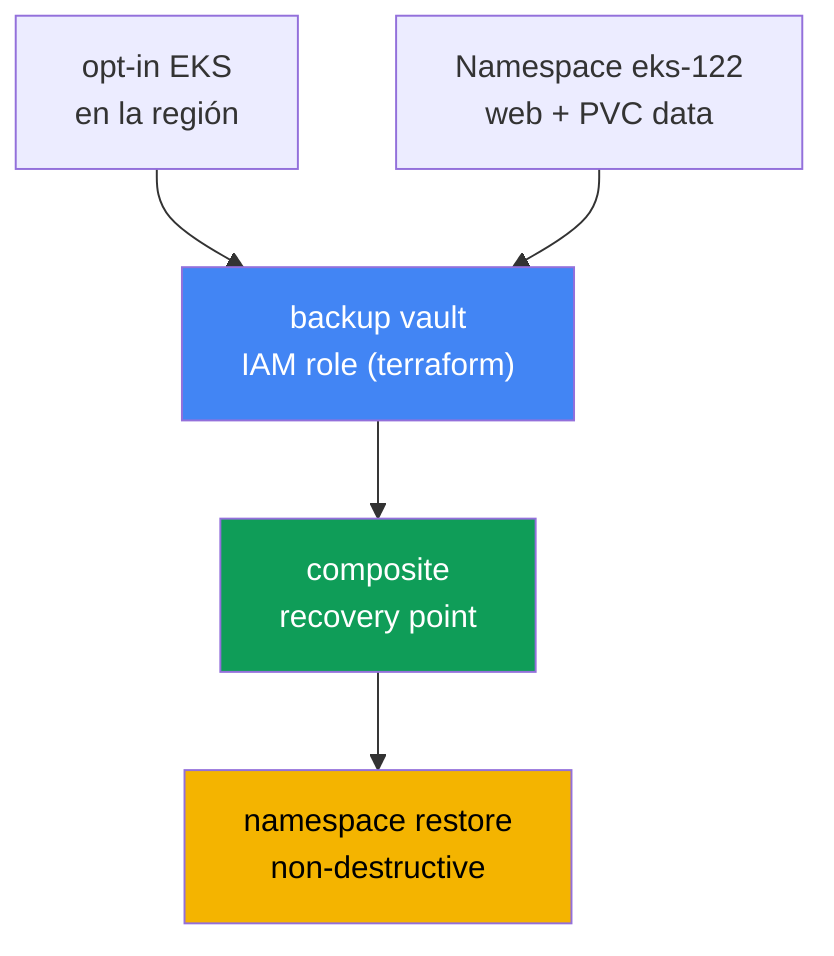
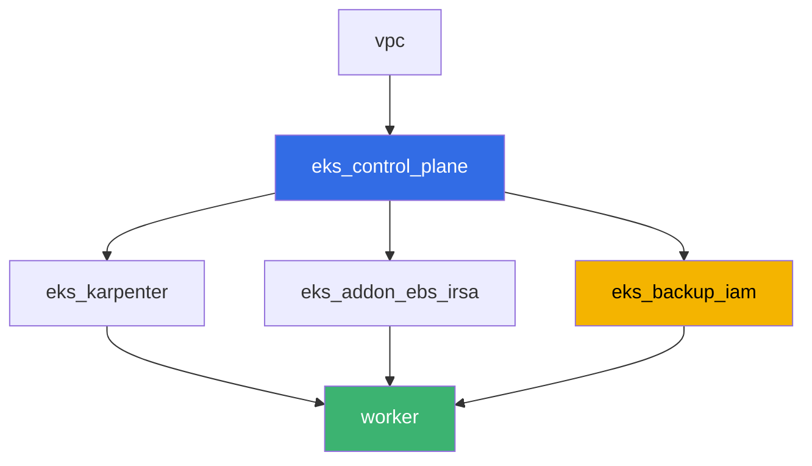

[Русская версия](README_RU.MD) · [Eng version](README.MD) · [Version française](README_FR.MD) · [Deutsche Version](README_DE.MD) · [ქართული ვერსია](README_GE.MD) · [繁體中文版](README_TW.MD) · [日本語版](README_JP.MD)

# Lab 122 - AWS Backup para EKS: composite recovery point, restauración de namespace

## Descripción

Un lab sobre backup y restauración del estado del cluster y de los datos de los
volúmenes persistentes mediante AWS Backup. Activará el opt-in de Amazon EKS en AWS
Backup para la región, ejecutará un backup on-demand del cluster con una carga de
trabajo sobre un volumen EBS, analizará un composite recovery point (el estado del
cluster más el volumen como un único punto consistente) y restaurará un namespace sin
destruir lo que ya existe en el cluster en producción. Al final explicará por qué un
rollback de la versión del cluster no puede recuperar un namespace eliminado - el
ejemplo motivador del capítulo 41.

Las tareas están escritas en estilo de producción: un enunciado breve más criterios de
aceptación. La verificación es automática, mediante el comando `check_result`.

## Objetivo

Reforzar el material de estos capítulos del curso:

- [Capítulo 41. Backup del cluster con AWS Backup](../../course/41/es.md) - composite
  recovery point, backup plan, vault, IAM role
- [Capítulo 42. Restauración y DR](../../course/42/es.md) - namespace restore,
  non-destructive restore
- [Capítulo 23. EBS CSI](../../course/23/es.md) - StorageClass gp3, el volumen detrás
  del PVC que termina en el backup
- [Capítulo 5. Acceso al cluster](../../course/05/es.md) - el modo de autenticación
  `API_AND_CONFIG_MAP` y las access entries, sin las cuales AWS Backup no puede leer el
  cluster

## Qué creamos

| Objeto | Qué es | Para qué sirve en este lab |
|--------|---------|-------------------|
| Namespace `eks-122` | una sección del cluster para la carga del lab | mantiene los recursos aislados (capítulo 4) |
| PVC `data` en StorageClass `gp3` | el volumen detrás de la carga | el volumen EBS que AWS Backup captura como child recovery point (capítulo 41) |
| Deployment `web` + ConfigMap `marker` | carga de trabajo y marcador | el marcador demuestra que el objeto restaurado vino del backup (capítulo 42) |
| IAM role `<cluster>-backup` (terraform) | rol para AWS Backup | `AWSBackupServiceRolePolicyForBackup`/`ForRestores` (capítulo 41) |
| backup vault `<cluster>-vault` (terraform) | almacenamiento de recovery points | cifrado con KMS (capítulo 41) |
| composite recovery point | resultado del backup job on-demand | estado del cluster más el volumen `data` como un solo punto (capítulo 41) |
| namespace restore | restauración de `eks-122` en el mismo cluster | non-destructive restore (capítulo 42) |



## Infraestructura

El entorno se despliega en AWS (`eu-central-1`) mediante Terragrunt. Cada directorio del
lab es un componente con su propio `terragrunt.hcl`, que referencia un módulo común en
`terraform/modules/` y declara dependencias mediante bloques `dependency`. La base es la
misma que en el lab 101 (control plane, Fargate para los pods de sistema, Karpenter para
la carga), más EBS CSI (para el volumen detrás del PVC) y un nuevo componente para el
IAM role y el vault de AWS Backup.

### Módulos y dependencias

| Directorio (componente) | Módulo (`terraform/modules/`) | Depende de | Qué crea |
|---------------------|-------------------------------|------------|-------------|
| `vpc` | `vpc_v3` | - | VPC `10.10.0.0/16`, subredes en dos AZ, NAT |
| `ssh-keys` | `ssh-keys` | - | un par de claves SSH para la máquina worker y los nodos |
| `eks_control_plane` | `eks_v2_control_plane` | `vpc` | control plane de EKS `1.36` con `authentication_mode = "API_AND_CONFIG_MAP"` explícito |
| `eks_fargate_system` | `eks_v2_fargate` | `vpc`, `eks_control_plane` | perfil Fargate para `kube-system` y `karpenter` |
| `eks_addons` | `eks_v2_addons` | `eks_control_plane`, `eks_fargate_system` | coredns, kube-proxy, vpc-cni, pod-identity |
| `eks_karpenter` | `eks_v2_karpenter` | `vpc`, `eks_control_plane`, `eks_addons`, `eks_fargate_system` | controlador Karpenter, IAM role de los nodos |
| `eks_karpenter_default_vng` | `eks_v2_karpenter_vng` | `vpc`, `eks_control_plane`, `eks_karpenter` | NodePool por defecto `default` en AL2023 |
| `eks_addon_ebs_irsa` | `eks_v2_ebs_irsa` | `eks_fargate_system`, `eks_control_plane` | managed addon `aws-ebs-csi-driver` vía IRSA |
| `eks_backup_iam` | `eks_v2_backup_iam` | `eks_control_plane` | IAM role de AWS Backup y backup vault |
| `worker` | `eks_v2_work_pc` | `ssh-keys`, `vpc`, `eks_control_plane`, `eks_karpenter`, `eks_addon_ebs_irsa`, `eks_backup_iam` | máquina worker con kubectl, tests y `check_result` |

Grafo de dependencias (lo que se aplica antes está más abajo en la flecha):



### Por qué el control plane tiene un `authentication_mode` explícito

AWS Backup para EKS crea su propia access entry y lee los objetos del cluster a través
de la API de Kubernetes - para eso necesita el modo de autenticación `API` o
`API_AND_CONFIG_MAP` (capítulo 41, sección 41.3). El módulo
`terraform-aws-modules/eks/aws` versión 21 ya pone `API_AND_CONFIG_MAP` por defecto, pero
en `eks_v2_control_plane/eks.tf` este parámetro ahora se define explícitamente en lugar
de dejarlo en el valor por defecto del módulo - la precondición del lab no debe depender
de la versión de un módulo de terceros.

### Dónde se configura cada cosa

`env.hcl` (parámetros compartidos del entorno, leídos por todos los componentes):

| Parámetro | Valor en el lab | Qué afecta |
|----------|-----------------|---------------|
| `region` | `eu-central-1` | región de todos los recursos, incluido el opt-in de AWS Backup |
| `prefix` | `eks-task122` | prefijo de nombres de recursos y tags |
| `stack_name` | `eks122` | a partir de él se construye `env_name` - el nombre del cluster |
| `k8_version` | `1.36.0` | versión de kubectl en la máquina worker |

`inputs` en el `terragrunt.hcl` de cada componente (parámetros específicos del módulo):

| Archivo | Ajustes clave |
|------|--------------------|
| `eks_addon_ebs_irsa/terragrunt.hcl` | managed addon `aws-ebs-csi-driver`, rol vía IRSA |
| `eks_backup_iam/terragrunt.hcl` | `name` - nombre del cluster, rol `<cluster>-backup`, vault `<cluster>-vault` |
| `worker/terragrunt.hcl` | `test_url` y `task_script_url` apuntando a los archivos del lab 122 |

## Despliegue

```bash
TASK=122 make run_eks_task
```

El despliegue tarda unos 15-20 minutos. En la salida, busque la línea con la conexión
SSH a la máquina worker y conéctese. kubectl ya está configurado para el cluster
correspondiente, el driver EBS CSI ya está instalado, y el nombre del rol y del vault de
AWS Backup están en el archivo `~/lab122_hints.txt`.

Comandos útiles en la máquina worker:

```bash
time_left               # cuánto tiempo queda del entorno
check_result             # verificar la solución
cat ~/lab122_hints.txt   # nombre del cluster, ARN del rol de AWS Backup, nombre del vault
```

> Seguridad del entorno. En `env.hcl` están habilitados `ssh_password_enable = true` y
> `access_cidrs = ["0.0.0.0/0"]` - cómodo para un entorno de formación, pero no algo que
> se deba hacer en producción. Según los estándares del curso (capítulos 0.2, 2, 19), el
> acceso a las máquinas worker se abre a través de AWS SSM Session Manager sin puertos
> SSH públicos expuestos, y `access_cidrs` se restringe a direcciones concretas. Aquí el
> SSH público se deja solo por simplicidad al lanzar el lab.

## Tareas

---
|        **1**        | **Namespace, volumen EBS y marcador para el futuro backup**          |
| :-----------------: | :---------------------------------------------------------- |
| Qué hacer          | Cree el namespace `eks-122`. Cree el StorageClass `gp3` (`provisioner: ebs.csi.aws.com`, `volumeBindingMode: WaitForFirstConsumer`) y el PVC `data` (`5Gi`) en esa clase. Cree el Deployment `web` (imagen `viktoruj/ping_pong:latest`, `1` réplica) que monte el PVC `data`. Cree el ConfigMap `marker` con cualquier valor arbitrario para la clave `marker` y guarde el mismo valor en el archivo `/var/work/tests/artifacts/1/marker.txt`. |
| Criterios de aceptación    | - PVC `data` en la clase `gp3`, `Bound`;<br/>- Deployment `web` en `eks-122`, imagen `viktoruj/ping_pong`, al menos una réplica lista;<br/>- el archivo `1/marker.txt` no está vacío y coincide con el valor del ConfigMap `marker`. |
---
|        **2**        | **Opt-in de Amazon EKS en AWS Backup para la región**                |
| :-----------------: | :---------------------------------------------------------- |
| Qué hacer          | Compruebe `aws backup describe-region-settings`, guarde el estado `antes` en el archivo `/var/work/tests/artifacts/2/optin.txt` como una línea `before=...`. Si Amazon EKS no está habilitado, ejecute `aws backup update-region-settings --resource-type-opt-in-preference '{"EKS":true}'`. Añada al mismo archivo una línea `after=...` con el valor final. |
| Criterios de aceptación    | - `describe-region-settings` muestra `ResourceTypeOptInPreference.EKS = true`;<br/>- el archivo `2/optin.txt` contiene las líneas `before=` y `after=true`. |
---
|        **3**        | **Backup on-demand del cluster**                                 |
| :-----------------: | :---------------------------------------------------------- |
| Qué hacer          | Tome el ARN del cluster y el ARN del rol de AWS Backup desde `~/lab122_hints.txt`. Ejecute `aws backup start-backup-job --resource-arn <cluster-arn> --iam-role-arn <role-arn> --backup-vault-name <vault>`. Espere un estado terminal del job (`COMPLETED` o `PARTIAL` - el snapshot EBS del volumen `data` puede tardar más que el estado del cluster). Guarde `backup_job_id`, el `status` final y `recovery_point_arn` en el archivo `/var/work/tests/artifacts/3/backup_status.txt`. |
| Criterios de aceptación    | - el archivo `3/backup_status.txt` contiene `backup_job_id=`, `status=`, `recovery_point_arn=`;<br/>- el estado final es `COMPLETED` o `PARTIAL`. |
---
|        **4**        | **Diagnóstico del composite recovery point**                      |
| :-----------------: | :---------------------------------------------------------- |
| Qué hacer          | Ejecute `aws backup list-recovery-points-by-backup-vault --backup-vault-name <vault>` y encuentre el punto composite de la tarea 3, así como sus puntos anidados (child) mediante `--by-parent-recovery-point-arn`. En el archivo `/var/work/tests/artifacts/4/composite.txt` escriba una explicación, con los términos del capítulo 41, de qué es un composite recovery point, en qué se diferencia el child point del estado del cluster del child point del volumen, y qué significa el campo `ParentRecoveryPointArn`. El texto debe contener las palabras `composite`, `child` y `ParentRecoveryPointArn` (o `nested`). |
| Criterios de aceptación    | - el archivo `4/composite.txt` no está vacío y contiene `composite`, `child`, `ParentRecoveryPointArn`/`nested`. |
---
|        **5**        | **Namespace restore: non-destructive**                        |
| :-----------------: | :---------------------------------------------------------- |
| Qué hacer          | Ejecute `aws backup start-restore-job` sobre el composite recovery point de la tarea 3 con metadatos de EKS: `clusterName` (el mismo cluster), `newCluster=false`, `namespaceLevelRestore=true`, `namespaces=["eks-122"]`. Este conjunto **no es suficiente**: el punto composite también contiene un snapshot EBS, y para restaurarlo AWS Backup exige obligatoriamente una Availability Zone. Sin ella, el restore job child del volumen falla con `Restore Job failed as no restore metadata was provided`, y el padre falla con `All PV restore jobs failed to restore`. Añada el parámetro `nestedRestoreJobs` - un mapa de `ARN del punto anidado -> {"AvailabilityZone":"<zona>"}`, tomando la zona de un nodo EC2 existente (`topology.kubernetes.io/zone`), de lo contrario el volumen se crearía donde nadie puede montarlo. Tenga en cuenta el anidamiento de la codificación: el valor de `nestedRestoreJobs` es una cadena JSON que contiene un mapa, cuyo valor de elemento es a su vez una cadena JSON; un nivel extra de comillas produce `Invalid JSON format in NestedRestoreMetadata`. Espere el estado `COMPLETED` (normalmente 7-8 minutos). Asegúrese de que el Deployment `web` y el ConfigMap `marker` no se duplicaron y que el valor del marcador coincide con el archivo de la tarea 1. Guarde `restore_job_id`, `status` y una explicación del comportamiento non-destructive (con la palabra `non-destructive`) en `/var/work/tests/artifacts/5/restore_status.txt`. |
| Criterios de aceptación    | - el archivo `5/restore_status.txt` contiene `restore_job_id=` y menciona `non-destructive`;<br/>- el estado del restore job es `COMPLETED`;<br/>- el Deployment `web` tiene al menos una réplica lista después del restore. |
---
|        **6**        | **Por qué un rollback de la versión del cluster no salva de `kubectl delete namespace`** |
| :-----------------: | :---------------------------------------------------------- |
| Qué hacer          | Explique en el archivo `/var/work/tests/artifacts/6/whynonrollback.txt` por qué un rollback de la versión del cluster (capítulo 39) no puede recuperar un namespace eliminado con `kubectl delete namespace` (el ejemplo motivador de la sección 41.1 del capítulo 41). El texto debe contener las palabras `etcd`, `rollback` y `namespace`. |
| Criterios de aceptación    | - el archivo `6/whynonrollback.txt` no está vacío y contiene `etcd`, `rollback`, `namespace`. |
---

## Verificación del resultado

En la máquina worker, ejecute la verificación automática:

```bash
check_result
```

El script ejecutará los tests y mostrará el porcentaje de tareas completadas. Las tareas
3 y 5 esperan un estado terminal del backup/restore job hasta 10 minutos - eso es normal
para un snapshot EBS.

## Solución

Solución de referencia: [worker/files/solutions/1_ES.MD](worker/files/solutions/1_ES.MD)

## Eliminación del cluster y los recursos

> **Aquí `destroy` no pasará sin preparación previa.** El backup vault lo creó
> terraform, pero los recovery points dentro de él no - los creó usted con
> `start-backup-job`. Terraform no puede eliminar un vault que no está vacío, así que
> primero hay que eliminar los recovery points. El orden importa: primero los anidados
> (child), luego el composite - AWS no permite eliminar el punto padre mientras tenga
> hijos (`Parent recovery point cannot be deleted because it has child recovery points`).
> Por separado: el restore creó un **nuevo volumen EBS** fuera de terraform (sin tags de
> Kubernetes), y quedará ahí facturándose. Y como en otros labs con PVC - elimine el
> namespace antes de destruir el cluster, de lo contrario EBS CSI no tendrá tiempo de
> eliminar el volumen detrás del PVC.

```bash
VAULT=$(grep '^vault_name' ~/lab122_hints.txt | awk '{print $3}')

# 1. Retirar la carga: EBS CSI elimina el volumen detrás del PVC, Karpenter retira el nodo
kubectl delete namespace eks-122 --ignore-not-found
while kubectl get nodes --no-headers 2>/dev/null | grep -qv fargate; do
  echo "El nodo EC2 de Karpenter sigue vivo, esperando..."; sleep 15
done

# 2. Eliminar primero los puntos anidados, luego el composite
for ARN in $(aws backup list-recovery-points-by-backup-vault --backup-vault-name "$VAULT" \
    --query 'RecoveryPoints[?IsParent==`false`].RecoveryPointArn' --output text); do
  aws backup delete-recovery-point --backup-vault-name "$VAULT" --recovery-point-arn "$ARN"
done
sleep 30
for ARN in $(aws backup list-recovery-points-by-backup-vault --backup-vault-name "$VAULT" \
    --query 'RecoveryPoints[?IsParent==`true`].RecoveryPointArn' --output text); do
  aws backup delete-recovery-point --backup-vault-name "$VAULT" --recovery-point-arn "$ARN"
done

# el vault debe quedar vacío, de lo contrario terraform no podrá eliminarlo
aws backup list-recovery-points-by-backup-vault --backup-vault-name "$VAULT" \
  --query 'length(RecoveryPoints)' --output text
```

A continuación, elimine el volumen creado por el restore. Es fácil de identificar: está
`available` y **no tiene ninguna tag** (los volúmenes detrás de un PVC el driver los
etiqueta con `kubernetes.io/created-for/pvc/name` y los elimina él mismo, pero este
volumen lo creó AWS Backup y no tiene dueño):

```bash
# los volúmenes sin tags son el resultado del restore
aws ec2 describe-volumes --filters Name=status,Values=available \
  --query 'Volumes[?Tags==null].[VolumeId,Size,CreateTime]' --output table
aws ec2 delete-volume --volume-id <vol-id>
```

```bash
TASK=122 make delete_eks_task
```
