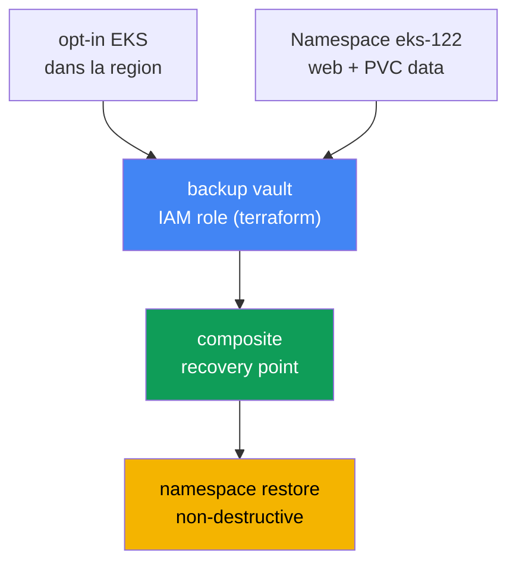
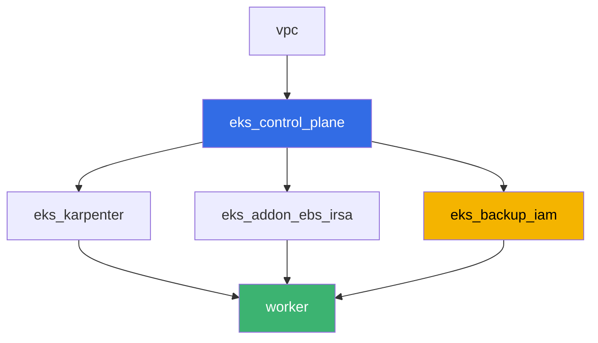

[Русская версия](README_RU.MD) · [Eng version](README.MD) · [Versión en español](README_ES.MD) · [Deutsche Version](README_DE.MD) · [ქართული ვერსია](README_GE.MD) · [繁體中文版](README_TW.MD) · [日本語版](README_JP.MD)

# Lab 122 - AWS Backup pour EKS : composite recovery point, restauration de namespace

## Description

Un lab sur la sauvegarde et la restauration de l'état du cluster et des données des
volumes persistants via AWS Backup. Vous activerez l'opt-in Amazon EKS dans AWS Backup
pour la région, lancerez un backup on-demand du cluster avec une charge de travail sur un
volume EBS, analyserez un composite recovery point (l'état du cluster plus le volume
comme un seul point cohérent) et restaurerez un namespace sans détruire ce qui existe
déjà dans le cluster en production. À la fin, vous expliquerez pourquoi un rollback de la
version du cluster ne peut pas ramener un namespace supprimé - l'exemple motivant du
chapitre 41.

Les tâches sont rédigées dans un style production : un énoncé court plus des critères
d'acceptation. La vérification est automatique, via la commande `check_result`.

## Objectif

Consolider la matière des chapitres suivants du cours :

- [Chapitre 41. Sauvegarde du cluster via AWS Backup](../../course/41/ru.md) - composite
  recovery point, backup plan, vault, IAM role
- [Chapitre 42. Restauration et DR](../../course/42/ru.md) - namespace restore,
  non-destructive restore
- [Chapitre 23. EBS CSI](../../course/23/ru.md) - StorageClass gp3, le volume derrière le
  PVC qui se retrouve dans le backup
- [Chapitre 5. Accès au cluster](../../course/05/ru.md) - le mode d'authentification
  `API_AND_CONFIG_MAP` et les access entries, sans lesquels AWS Backup ne peut pas lire le
  cluster

## Ce que nous créons

| Objet | Ce que c'est | À quoi cela sert dans ce lab |
|--------|---------|-------------------|
| Namespace `eks-122` | une section du cluster pour la charge du lab | garde les ressources isolées (chapitre 4) |
| PVC `data` sur StorageClass `gp3` | le volume derrière la charge | le volume EBS qu'AWS Backup capture comme child recovery point (chapitre 41) |
| Deployment `web` + ConfigMap `marker` | charge de travail et marqueur | le marqueur prouve que l'objet restauré vient du backup (chapitre 42) |
| IAM role `<cluster>-backup` (terraform) | rôle pour AWS Backup | `AWSBackupServiceRolePolicyForBackup`/`ForRestores` (chapitre 41) |
| backup vault `<cluster>-vault` (terraform) | stockage des recovery points | chiffrement KMS (chapitre 41) |
| composite recovery point | résultat du backup job on-demand | état du cluster plus le volume `data` comme un seul point (chapitre 41) |
| namespace restore | restauration de `eks-122` dans le même cluster | non-destructive restore (chapitre 42) |



## Infrastructure

L'environnement est déployé dans AWS (`eu-central-1`) via Terragrunt. Chaque répertoire du
lab est un composant unique avec son propre `terragrunt.hcl`, qui référence un module
commun dans `terraform/modules/` et déclare ses dépendances via des blocs `dependency`. La
base est la même que dans le lab 101 (control plane, Fargate pour les pods système,
Karpenter pour la charge), plus EBS CSI (pour le volume derrière le PVC) et un nouveau
composant pour l'IAM role et le vault d'AWS Backup.

### Modules et dépendances

| Répertoire (composant) | Module (`terraform/modules/`) | Dépend de | Ce qu'il crée |
|---------------------|-------------------------------|------------|-------------|
| `vpc` | `vpc_v3` | - | VPC `10.10.0.0/16`, sous-réseaux dans deux AZ, NAT |
| `ssh-keys` | `ssh-keys` | - | une paire de clés SSH pour la machine worker et les nœuds |
| `eks_control_plane` | `eks_v2_control_plane` | `vpc` | control plane EKS `1.36` avec un `authentication_mode = "API_AND_CONFIG_MAP"` explicite |
| `eks_fargate_system` | `eks_v2_fargate` | `vpc`, `eks_control_plane` | profil Fargate pour `kube-system` et `karpenter` |
| `eks_addons` | `eks_v2_addons` | `eks_control_plane`, `eks_fargate_system` | coredns, kube-proxy, vpc-cni, pod-identity |
| `eks_karpenter` | `eks_v2_karpenter` | `vpc`, `eks_control_plane`, `eks_addons`, `eks_fargate_system` | contrôleur Karpenter, IAM role des nœuds |
| `eks_karpenter_default_vng` | `eks_v2_karpenter_vng` | `vpc`, `eks_control_plane`, `eks_karpenter` | NodePool par défaut `default` sur AL2023 |
| `eks_addon_ebs_irsa` | `eks_v2_ebs_irsa` | `eks_fargate_system`, `eks_control_plane` | managed addon `aws-ebs-csi-driver` via IRSA |
| `eks_backup_iam` | `eks_v2_backup_iam` | `eks_control_plane` | IAM role d'AWS Backup et backup vault |
| `worker` | `eks_v2_work_pc` | `ssh-keys`, `vpc`, `eks_control_plane`, `eks_karpenter`, `eks_addon_ebs_irsa`, `eks_backup_iam` | machine worker avec kubectl, tests et `check_result` |

Graphe des dépendances (ce qui est appliqué en premier est plus bas le long de la flèche) :



### Pourquoi le control plane a un `authentication_mode` explicite

AWS Backup pour EKS crée sa propre access entry et lit les objets du cluster via l'API
Kubernetes - cela nécessite le mode d'authentification `API` ou `API_AND_CONFIG_MAP`
(chapitre 41, section 41.3). Le module `terraform-aws-modules/eks/aws` version 21 met
déjà `API_AND_CONFIG_MAP` par défaut, mais dans `eks_v2_control_plane/eks.tf` ce
paramètre est désormais défini explicitement au lieu d'être laissé à la valeur par défaut
du module - la précondition du lab ne doit pas dépendre de la version d'un module tiers.

### Où chaque chose se configure

`env.hcl` (paramètres partagés de l'environnement, lus par tous les composants) :

| Paramètre | Valeur dans le lab | Ce qu'il influence |
|----------|-----------------|---------------|
| `region` | `eu-central-1` | région de toutes les ressources, y compris l'opt-in AWS Backup |
| `prefix` | `eks-task122` | préfixe des noms de ressources et des tags |
| `stack_name` | `eks122` | sert à construire `env_name` - le nom du cluster |
| `k8_version` | `1.36.0` | version de kubectl sur la machine worker |

`inputs` dans le `terragrunt.hcl` de chaque composant (paramètres du module concerné) :

| Fichier | Réglages clés |
|------|--------------------|
| `eks_addon_ebs_irsa/terragrunt.hcl` | managed addon `aws-ebs-csi-driver`, rôle via IRSA |
| `eks_backup_iam/terragrunt.hcl` | `name` - nom du cluster, rôle `<cluster>-backup`, vault `<cluster>-vault` |
| `worker/terragrunt.hcl` | `test_url` et `task_script_url` pointant vers les fichiers du lab 122 |

## Déploiement

```bash
TASK=122 make run_eks_task
```

Le déploiement prend environ 15-20 minutes. Dans la sortie, trouvez la ligne avec la
connexion SSH vers la machine worker et connectez-vous. kubectl y est déjà configuré pour
le cluster concerné, le driver EBS CSI est déjà installé, et le nom du rôle et du vault
d'AWS Backup sont dans le fichier `~/lab122_hints.txt`.

Commandes utiles sur la machine worker :

```bash
time_left               # combien de temps il reste à l'environnement
check_result             # vérifier la solution
cat ~/lab122_hints.txt   # nom du cluster, ARN du rôle AWS Backup, nom du vault
```

> Sécurité de l'environnement. Dans `env.hcl`, `ssh_password_enable = true` et
> `access_cidrs = ["0.0.0.0/0"]` sont activés - pratique pour un environnement de
> formation, mais à ne pas faire en production. Selon les standards du cours (chapitres
> 0.2, 2, 19), l'accès aux machines worker s'ouvre via AWS SSM Session Manager sans ports
> SSH publics exposés, et `access_cidrs` est restreint à des adresses précises. Ici le SSH
> public est laissé uniquement pour simplifier le lancement du lab.

## Tâches

---
|        **1**        | **Namespace, volume EBS et marqueur pour le futur backup**          |
| :-----------------: | :---------------------------------------------------------- |
| Ce qu'il faut faire          | Créez le namespace `eks-122`. Créez le StorageClass `gp3` (`provisioner: ebs.csi.aws.com`, `volumeBindingMode: WaitForFirstConsumer`) et le PVC `data` (`5Gi`) sur cette classe. Créez le Deployment `web` (image `viktoruj/ping_pong:latest`, `1` réplica) qui monte le PVC `data`. Créez le ConfigMap `marker` avec une valeur arbitraire quelconque pour la clé `marker` et enregistrez la même valeur dans le fichier `/var/work/tests/artifacts/1/marker.txt`. |
| Critères d'acceptation    | - PVC `data` sur la classe `gp3`, `Bound` ;<br/>- Deployment `web` dans `eks-122`, image `viktoruj/ping_pong`, au moins un réplica prêt ;<br/>- le fichier `1/marker.txt` n'est pas vide et correspond à la valeur du ConfigMap `marker`. |
---
|        **2**        | **Opt-in Amazon EKS dans AWS Backup pour la région**                |
| :-----------------: | :---------------------------------------------------------- |
| Ce qu'il faut faire          | Vérifiez `aws backup describe-region-settings`, enregistrez l'état `avant` dans le fichier `/var/work/tests/artifacts/2/optin.txt` sous la forme d'une ligne `before=...`. Si Amazon EKS n'est pas activé, exécutez `aws backup update-region-settings --resource-type-opt-in-preference '{"EKS":true}'`. Ajoutez dans le même fichier une ligne `after=...` avec la valeur finale. |
| Critères d'acceptation    | - `describe-region-settings` montre `ResourceTypeOptInPreference.EKS = true` ;<br/>- le fichier `2/optin.txt` contient les lignes `before=` et `after=true`. |
---
|        **3**        | **Backup on-demand du cluster**                                 |
| :-----------------: | :---------------------------------------------------------- |
| Ce qu'il faut faire          | Récupérez l'ARN du cluster et l'ARN du rôle AWS Backup depuis `~/lab122_hints.txt`. Exécutez `aws backup start-backup-job --resource-arn <cluster-arn> --iam-role-arn <role-arn> --backup-vault-name <vault>`. Attendez un statut terminal du job (`COMPLETED` ou `PARTIAL` - le snapshot EBS du volume `data` peut prendre plus de temps que l'état du cluster). Enregistrez `backup_job_id`, le `status` final et `recovery_point_arn` dans le fichier `/var/work/tests/artifacts/3/backup_status.txt`. |
| Critères d'acceptation    | - le fichier `3/backup_status.txt` contient `backup_job_id=`, `status=`, `recovery_point_arn=` ;<br/>- le statut final est `COMPLETED` ou `PARTIAL`. |
---
|        **4**        | **Diagnostic du composite recovery point**                      |
| :-----------------: | :---------------------------------------------------------- |
| Ce qu'il faut faire          | Exécutez `aws backup list-recovery-points-by-backup-vault --backup-vault-name <vault>` et trouvez le point composite de la tâche 3, ainsi que ses points imbriqués (child) via `--by-parent-recovery-point-arn`. Dans le fichier `/var/work/tests/artifacts/4/composite.txt`, écrivez une explication avec les termes du chapitre 41 : ce qu'est un composite recovery point, en quoi le child point de l'état du cluster diffère du child point du volume, et ce que signifie le champ `ParentRecoveryPointArn`. Le texte doit contenir les mots `composite`, `child` et `ParentRecoveryPointArn` (ou `nested`). |
| Critères d'acceptation    | - le fichier `4/composite.txt` n'est pas vide et contient `composite`, `child`, `ParentRecoveryPointArn`/`nested`. |
---
|        **5**        | **Namespace restore : non-destructive**                        |
| :-----------------: | :---------------------------------------------------------- |
| Ce qu'il faut faire          | Lancez `aws backup start-restore-job` sur le composite recovery point de la tâche 3 avec les métadonnées EKS : `clusterName` (le même cluster), `newCluster=false`, `namespaceLevelRestore=true`, `namespaces=["eks-122"]`. Cet ensemble **ne suffit pas** : le point composite contient aussi un snapshot EBS, et pour le restaurer AWS Backup exige obligatoirement une Availability Zone. Sans elle, le restore job child du volume échoue avec `Restore Job failed as no restore metadata was provided`, et le parent échoue avec `All PV restore jobs failed to restore`. Ajoutez le paramètre `nestedRestoreJobs` - une carte `ARN du point imbriqué -> {"AvailabilityZone":"<zone>"}`, en prenant la zone d'un nœud EC2 existant (`topology.kubernetes.io/zone`), sinon le volume sera créé là où rien ne peut le monter. Attention à l'imbrication de l'encodage : la valeur de `nestedRestoreJobs` est une chaîne JSON contenant une carte, dont la valeur d'élément est elle-même une chaîne JSON ; un niveau de guillemets en trop produit `Invalid JSON format in NestedRestoreMetadata`. Attendez le statut `COMPLETED` (généralement 7-8 minutes). Assurez-vous que le Deployment `web` et le ConfigMap `marker` n'ont pas été dupliqués et que la valeur du marqueur correspond au fichier de la tâche 1. Enregistrez `restore_job_id`, `status` et une explication du comportement non-destructive (avec le mot `non-destructive`) dans `/var/work/tests/artifacts/5/restore_status.txt`. |
| Critères d'acceptation    | - le fichier `5/restore_status.txt` contient `restore_job_id=` et mentionne `non-destructive` ;<br/>- le statut du restore job est `COMPLETED` ;<br/>- le Deployment `web` a au moins un réplica prêt après le restore. |
---
|        **6**        | **Pourquoi un rollback de la version du cluster ne sauve pas de `kubectl delete namespace`** |
| :-----------------: | :---------------------------------------------------------- |
| Ce qu'il faut faire          | Expliquez dans le fichier `/var/work/tests/artifacts/6/whynonrollback.txt` pourquoi un rollback de la version du cluster (chapitre 39) ne peut pas ramener un namespace supprimé par la commande `kubectl delete namespace` (l'exemple motivant de la section 41.1 du chapitre 41). Le texte doit contenir les mots `etcd`, `rollback` et `namespace`. |
| Critères d'acceptation    | - le fichier `6/whynonrollback.txt` n'est pas vide et contient `etcd`, `rollback`, `namespace`. |
---

## Vérification du résultat

Sur la machine worker, lancez la vérification automatique :

```bash
check_result
```

Le script exécutera les tests et affichera le pourcentage de tâches accomplies. Les tâches
3 et 5 attendent un statut terminal du backup/restore job jusqu'à 10 minutes - c'est
normal pour un snapshot EBS.

## Solution

Solution de référence : [worker/files/solutions/1_FR.MD](worker/files/solutions/1_FR.MD)

## Suppression du cluster et des ressources

> **Ici, `destroy` ne passera pas sans préparation.** Le backup vault a été créé par
> terraform, mais pas les recovery points qu'il contient - c'est vous qui les avez créés
> avec `start-backup-job`. Terraform ne peut pas supprimer un vault non vide, il faut donc
> d'abord supprimer les points de restauration. L'ordre importe : d'abord les points
> imbriqués (child), ensuite le composite - AWS ne laisse pas supprimer le point parent
> tant qu'il a des enfants
> (`Parent recovery point cannot be deleted because it has child recovery points`).
> Par ailleurs : le restore a créé un **nouveau volume EBS** en dehors de terraform (sans
> tags Kubernetes), et il restera là et continuera d'être facturé. Et comme dans les autres
> labs avec un PVC - supprimez le namespace avant de détruire le cluster, sinon EBS CSI
> n'aura pas le temps de supprimer le volume derrière le PVC.

```bash
VAULT=$(grep '^vault_name' ~/lab122_hints.txt | awk '{print $3}')

# 1. Retirer la charge : EBS CSI supprime le volume derrière le PVC, Karpenter retire le nœud
kubectl delete namespace eks-122 --ignore-not-found
while kubectl get nodes --no-headers 2>/dev/null | grep -qv fargate; do
  echo "Le noeud EC2 de Karpenter est toujours vivant, attente..."; sleep 15
done

# 2. Supprimer d'abord les points imbriqués, puis le composite
for ARN in $(aws backup list-recovery-points-by-backup-vault --backup-vault-name "$VAULT" \
    --query 'RecoveryPoints[?IsParent==`false`].RecoveryPointArn' --output text); do
  aws backup delete-recovery-point --backup-vault-name "$VAULT" --recovery-point-arn "$ARN"
done
sleep 30
for ARN in $(aws backup list-recovery-points-by-backup-vault --backup-vault-name "$VAULT" \
    --query 'RecoveryPoints[?IsParent==`true`].RecoveryPointArn' --output text); do
  aws backup delete-recovery-point --backup-vault-name "$VAULT" --recovery-point-arn "$ARN"
done

# le vault doit devenir vide, sinon terraform ne pourra pas le supprimer
aws backup list-recovery-points-by-backup-vault --backup-vault-name "$VAULT" \
  --query 'length(RecoveryPoints)' --output text
```

Ensuite, supprimez le volume créé par le restore. Il est facile à repérer : il est
`available` et **n'a aucun tag** (les volumes derrière un PVC sont taggés
`kubernetes.io/created-for/pvc/name` par le driver, qui les supprime lui-même, alors que ce
volume a été créé par AWS Backup et n'a pas de propriétaire) :

```bash
# les volumes sans tags sont le résultat du restore
aws ec2 describe-volumes --filters Name=status,Values=available \
  --query 'Volumes[?Tags==null].[VolumeId,Size,CreateTime]' --output table
aws ec2 delete-volume --volume-id <vol-id>
```

```bash
TASK=122 make delete_eks_task
```
