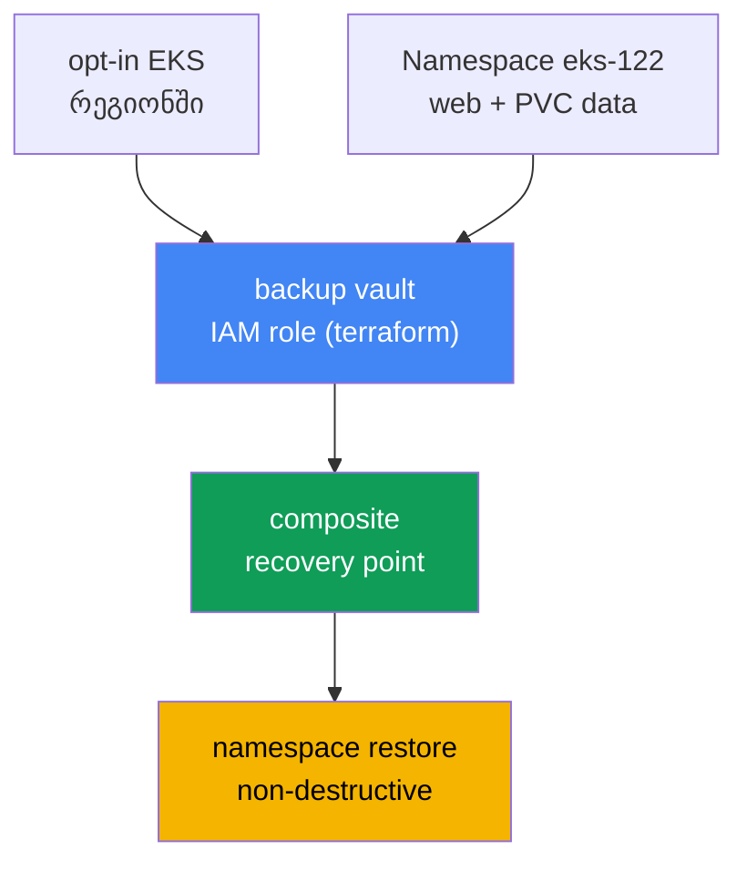
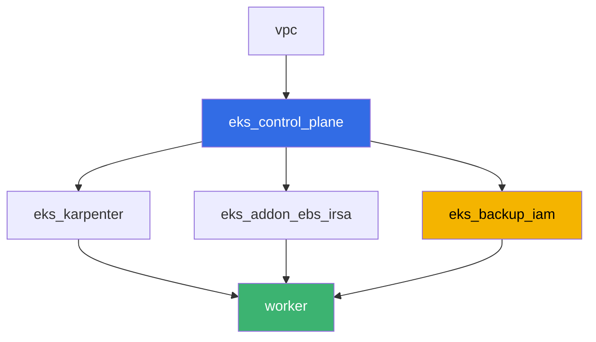

[Русская версия](README_RU.MD) · [Eng version](README.MD) · [Versión en español](README_ES.MD) · [Version française](README_FR.MD) · [Deutsche Version](README_DE.MD) · [繁體中文版](README_TW.MD) · [日本語版](README_JP.MD)

# ლაბი 122 - AWS Backup EKS-ისთვის: composite recovery point, namespace-ის აღდგენა

## აღწერა

ლაბი კლასტერის მდგომარეობისა და მუდმივი ტომების მონაცემების backup-სა და აღდგენაზე
AWS Backup-ის საშუალებით. თქვენ რეგიონისთვის ჩართავთ Amazon EKS-ის opt-in-ს AWS
Backup-ში, გაუშვებთ კლასტერის on-demand backup-ს EBS-ტომზე მდგარი დატვირთვით,
გაარჩევთ composite recovery point-ს (კლასტერის მდგომარეობა პლუს ტომი როგორც ერთი
თანმიმდევრული წერტილი) და აღადგენთ namespace-ს ისე, რომ არ დაანგრიოთ ის, რაც უკვე
არსებობს ცოცხალ კლასტერში. ბოლოს ახსნით, რატომ ვერ დააბრუნებს კლასტერის ვერსიის
rollback წაშლილ namespace-ს - მოტივირებადი მაგალითი 41-ე თავიდან.

დავალებები პროდაქშენის სტილშია: მოკლე დასმა პლუს მიღების კრიტერიუმები. შემოწმება
ავტომატურია, ბრძანებით `check_result`.

## მიზანი

განამტკიცოთ კურსის თავების მასალა:

- [თავი 41. კლასტერის backup AWS Backup-ით](../../course/41/ge.md) - composite
  recovery point, backup plan, vault, IAM role
- [თავი 42. აღდგენა და DR](../../course/42/ge.md) - namespace restore,
  non-destructive restore
- [თავი 23. EBS CSI](../../course/23/ge.md) - StorageClass gp3, PVC-ს უკან მდგარი ტომი,
  რომელიც backup-ში ხვდება
- [თავი 5. კლასტერზე წვდომა](../../course/05/ge.md) - ავტორიზაციის რეჟიმი
  `API_AND_CONFIG_MAP` და access entries, რომელთა გარეშე AWS Backup ვერ კითხულობს
  კლასტერს

## რას ვქმნით

| ობიექტი | რა არის ეს | რისთვის არის ამ ლაბში |
|--------|---------|-------------------|
| Namespace `eks-122` | კლასტერის სექცია ლაბის დატვირთვისთვის | რესურსებს ცალკე ვინახავთ (თავი 4) |
| PVC `data` StorageClass `gp3`-ზე | დატვირთვის უკან მდგარი ტომი | EBS-ტომი, რომელსაც AWS Backup child recovery point-ად იღებს (თავი 41) |
| Deployment `web` + ConfigMap `marker` | დატვირთვა და მარკერი | მარკერი დაამტკიცებს, რომ აღდგენილი ობიექტი backup-იდან მოვიდა (თავი 42) |
| IAM-როლი `<cluster>-backup` (terraform) | როლი AWS Backup-ისთვის | `AWSBackupServiceRolePolicyForBackup`/`ForRestores` (თავი 41) |
| backup vault `<cluster>-vault` (terraform) | recovery points-ის საცავი | KMS-შიფრაცია (თავი 41) |
| composite recovery point | on-demand backup job-ის შედეგი | კლასტერის მდგომარეობა პლუს ტომი `data` ერთ წერტილად (თავი 41) |
| namespace restore | `eks-122`-ის აღდგენა იმავე კლასტერში | non-destructive restore (თავი 42) |



## ინფრასტრუქტურა

გარემო იშლება AWS-ში (`eu-central-1`) Terragrunt-ის საშუალებით. ლაბის ყოველი კატალოგი -
ეს ერთი კომპონენტია საკუთარი `terragrunt.hcl`-ით, რომელიც მიუთითებს საერთო მოდულზე
`terraform/modules/`-ში და დამოკიდებულებებს აღწერს `dependency` ბლოკებით. ბაზა იგივეა,
რაც ლაბ 101-ში (control plane, Fargate სისტემური pod-ებისთვის, Karpenter დატვირთვისთვის),
პლუს EBS CSI (PVC-ს უკან მდგარი ტომისთვის) და ახალი კომპონენტი AWS Backup-ის IAM-როლისა
და vault-ისთვის.

### მოდულები და დამოკიდებულებები

| კატალოგი (კომპონენტი) | მოდული (`terraform/modules/`) | დამოკიდებულია | რას ქმნის |
|---------------------|-------------------------------|------------|-------------|
| `vpc` | `vpc_v3` | - | VPC `10.10.0.0/16`, ქვექსელები ორ AZ-ში, NAT |
| `ssh-keys` | `ssh-keys` | - | SSH-გასაღებების წყვილი სამუშაო მანქანისა და ნოუდებისთვის |
| `eks_control_plane` | `eks_v2_control_plane` | `vpc` | EKS `1.36` control plane ცხადი `authentication_mode = "API_AND_CONFIG_MAP"`-ით |
| `eks_fargate_system` | `eks_v2_fargate` | `vpc`, `eks_control_plane` | Fargate-პროფილი `kube-system`-სა და `karpenter`-ისთვის |
| `eks_addons` | `eks_v2_addons` | `eks_control_plane`, `eks_fargate_system` | coredns, kube-proxy, vpc-cni, pod-identity |
| `eks_karpenter` | `eks_v2_karpenter` | `vpc`, `eks_control_plane`, `eks_addons`, `eks_fargate_system` | Karpenter-ის კონტროლერი, ნოუდების IAM-როლი |
| `eks_karpenter_default_vng` | `eks_v2_karpenter_vng` | `vpc`, `eks_control_plane`, `eks_karpenter` | ნაგულისხმევი NodePool `default` AL2023-ზე |
| `eks_addon_ebs_irsa` | `eks_v2_ebs_irsa` | `eks_fargate_system`, `eks_control_plane` | managed addon `aws-ebs-csi-driver` IRSA-ს გავლით |
| `eks_backup_iam` | `eks_v2_backup_iam` | `eks_control_plane` | AWS Backup-ის IAM-როლი და backup vault |
| `worker` | `eks_v2_work_pc` | `ssh-keys`, `vpc`, `eks_control_plane`, `eks_karpenter`, `eks_addon_ebs_irsa`, `eks_backup_iam` | სამუშაო მანქანა kubectl-ით, tests-ითა და `check_result`-ით |

დამოკიდებულებების გრაფი (რაც უფრო ადრე გამოიყენება, ის უფრო ქვემოთაა ისრის მიმართულებით):



### რატომ აქვს control plane-ს ცხადი `authentication_mode`

AWS Backup EKS-ისთვის თავად იქმნის access entry-ს და კლასტერის ობიექტებს Kubernetes API-ს
გავლით კითხულობს - ამისთვის საჭიროა ავტორიზაციის რეჟიმი `API` ან `API_AND_CONFIG_MAP`
(თავი 41, სექცია 41.3). მოდული `terraform-aws-modules/eks/aws` 21-ე ვერსიაში ნაგულისხმევად
უკვე აყენებს `API_AND_CONFIG_MAP`-ს, მაგრამ `eks_v2_control_plane/eks.tf`-ში ეს პარამეტრი
ახლა ცხადად არის მითითებული და არა მიტოვებული მოდულის ნაგულისხმევზე - ლაბის წინაპირობა არ
უნდა იყოს დამოკიდებული მესამე მხარის მოდულის ვერსიაზე.

### სად რა კონფიგურირდება

`env.hcl` (გარემოს საერთო პარამეტრები, რომლებსაც ყველა კომპონენტი კითხულობს):

| პარამეტრი | მნიშვნელობა ლაბში | რაზე მოქმედებს |
|----------|-----------------|---------------|
| `region` | `eu-central-1` | ყველა რესურსის რეგიონი, მათ შორის AWS Backup-ის opt-in |
| `prefix` | `eks-task122` | რესურსების სახელებისა და ტეგების პრეფიქსი |
| `stack_name` | `eks122` | მისგან იკრიბება `env_name` - კლასტერის სახელი |
| `k8_version` | `1.36.0` | kubectl-ის ვერსია სამუშაო მანქანაზე |

`inputs` ყოველი კომპონენტის `terragrunt.hcl`-ში (კონკრეტული მოდულის პარამეტრები):

| ფაილი | ძირითადი პარამეტრები |
|------|--------------------|
| `eks_addon_ebs_irsa/terragrunt.hcl` | managed addon `aws-ebs-csi-driver`, როლი IRSA-ს გავლით |
| `eks_backup_iam/terragrunt.hcl` | `name` - კლასტერის სახელი, როლი `<cluster>-backup`, vault `<cluster>-vault` |
| `worker/terragrunt.hcl` | `test_url` და `task_script_url` ლაბ 122-ის ფაილებზე |

## განთავსება

```bash
TASK=122 make run_eks_task
```

განთავსებას სჭირდება დაახლოებით 15-20 წუთი. გამონატანში იპოვეთ სტრიქონი სამუშაო მანქანასთან
SSH-შეერთებით და დაუკავშირდით მას. kubectl იქ უკვე გამართულია საჭირო კლასტერზე, EBS CSI
დრაივერი უკვე დაყენებულია, ხოლო AWS Backup-ის როლისა და vault-ის სახელი - ფაილში
`~/lab122_hints.txt`.

სასარგებლო ბრძანებები სამუშაო მანქანაზე:

```bash
time_left               # რამდენი დრო დარჩა გარემოს
check_result             # გადაწყვეტის შემოწმება
cat ~/lab122_hints.txt   # კლასტერის სახელი, AWS Backup-ის როლის ARN, vault-ის სახელი
```

> სტენდის უსაფრთხოება. `env.hcl`-ში ჩართულია `ssh_password_enable = true` და
> `access_cidrs = ["0.0.0.0/0"]` - ეს მოსახერხებელია სასწავლო გარემოსთვის, მაგრამ ასე
> პროდაქშენში არ შეიძლება. კურსის სტანდარტების მიხედვით (თავები 0.2, 2, 19) სამუშაო
> მანქანებზე წვდომას ხსნიან AWS SSM Session Manager-ის გავლით, გარეთ გახსნილი საჯარო
> SSH-პორტების გარეშე, ხოლო `access_cidrs`-ს ავიწროებენ კონკრეტულ მისამართებამდე. აქ
> საჯარო SSH დარჩენილია მხოლოდ გაშვების სიმარტივისთვის.

## დავალებები

---
|        **1**        | **Namespace, EBS-ტომი და მარკერი მომავალი backup-ისთვის**          |
| :-----------------: | :---------------------------------------------------------- |
| რას ვაკეთებთ          | შექმენით namespace `eks-122`. შექმენით StorageClass `gp3` (`provisioner: ebs.csi.aws.com`, `volumeBindingMode: WaitForFirstConsumer`) და PVC `data` (`5Gi`) ამ კლასზე. შექმენით Deployment `web` (იმიჯი `viktoruj/ping_pong:latest`, `1` რეპლიკა), რომელიც ამაუნთებს PVC `data`-ს. შექმენით ConfigMap `marker` გასაღების `marker` ნებისმიერი თვითნებური მნიშვნელობით და შეინახეთ იგივე მნიშვნელობა ფაილში `/var/work/tests/artifacts/1/marker.txt`. |
| მიღების კრიტერიუმები    | - PVC `data` კლასზე `gp3`, `Bound`;<br/>- Deployment `web` `eks-122`-ში, იმიჯი `viktoruj/ping_pong`, სულ ცოტა ერთი მზა რეპლიკა;<br/>- ფაილი `1/marker.txt` არ არის ცარიელი და ემთხვევა ConfigMap `marker`-ის მნიშვნელობას. |
---
|        **2**        | **Amazon EKS-ის opt-in AWS Backup-ში რეგიონისთვის**                |
| :-----------------: | :---------------------------------------------------------- |
| რას ვაკეთებთ          | შეამოწმეთ `aws backup describe-region-settings`, შეინახეთ საწყისი მდგომარეობა ფაილში `/var/work/tests/artifacts/2/optin.txt` სტრიქონით `before=...`. თუ Amazon EKS ჩართული არ არის, შეასრულეთ `aws backup update-region-settings --resource-type-opt-in-preference '{"EKS":true}'`. დაამატეთ იმავე ფაილში სტრიქონი `after=...` საბოლოო მნიშვნელობით. |
| მიღების კრიტერიუმები    | - `describe-region-settings` აჩვენებს `ResourceTypeOptInPreference.EKS = true`;<br/>- ფაილი `2/optin.txt` შეიცავს სტრიქონებს `before=` და `after=true`. |
---
|        **3**        | **კლასტერის on-demand backup**                                 |
| :-----------------: | :---------------------------------------------------------- |
| რას ვაკეთებთ          | აიღეთ კლასტერის ARN და AWS Backup-ის როლის ARN ფაილიდან `~/lab122_hints.txt`. გაუშვით `aws backup start-backup-job --resource-arn <cluster-arn> --iam-role-arn <role-arn> --backup-vault-name <vault>`. დაელოდეთ job-ის ტერმინალურ სტატუსს (`COMPLETED` ან `PARTIAL` - ტომის `data` EBS-სნეპშოტს შეიძლება მეტი დრო დასჭირდეს, ვიდრე კლასტერის მდგომარეობას). შეინახეთ `backup_job_id`, საბოლოო `status` და `recovery_point_arn` ფაილში `/var/work/tests/artifacts/3/backup_status.txt`. |
| მიღების კრიტერიუმები    | - ფაილი `3/backup_status.txt` შეიცავს `backup_job_id=`, `status=`, `recovery_point_arn=`;<br/>- საბოლოო სტატუსი `COMPLETED` ან `PARTIAL`. |
---
|        **4**        | **composite recovery point-ის დიაგნოსტიკა**                      |
| :-----------------: | :---------------------------------------------------------- |
| რას ვაკეთებთ          | შეასრულეთ `aws backup list-recovery-points-by-backup-vault --backup-vault-name <vault>` და იპოვეთ composite წერტილი 3-ე დავალებიდან, ასევე მისი ჩადგმული (child) წერტილები `--by-parent-recovery-point-arn`-ის საშუალებით. ფაილში `/var/work/tests/artifacts/4/composite.txt` ჩაწერეთ განმარტება 41-ე თავის სიტყვებით: რა არის composite recovery point, რით განსხვავდება კლასტერის მდგომარეობის child-წერტილი ტომის child-წერტილისგან და რას ნიშნავს ველი `ParentRecoveryPointArn`. ტექსტში უნდა იყოს სიტყვები `composite`, `child` და `ParentRecoveryPointArn` (ან `nested`). |
| მიღების კრიტერიუმები    | - ფაილი `4/composite.txt` არ არის ცარიელი და შეიცავს `composite`, `child`, `ParentRecoveryPointArn`/`nested`. |
---
|        **5**        | **Namespace restore: non-destructive**                        |
| :-----------------: | :---------------------------------------------------------- |
| რას ვაკეთებთ          | გაუშვით `aws backup start-restore-job` 3-ე დავალების composite recovery point-ზე EKS-ის მეტამონაცემებით: `clusterName` (იგივე კლასტერი), `newCluster=false`, `namespaceLevelRestore=true`, `namespaces=["eks-122"]`. ეს ნაკრები **არასაკმარისია**: composite წერტილში არის ასევე EBS-სნეპშოტი, ხოლო მისი აღდგენისთვის AWS Backup აუცილებლად მოითხოვს Availability Zone-ს. მისი გარეშე ტომის child restore job ვარდება შეტყობინებით `Restore Job failed as no restore metadata was provided`, ხოლო მშობელი - `All PV restore jobs failed to restore`. დაამატეთ პარამეტრი `nestedRestoreJobs` - რუკა `ჩადგმული წერტილის ARN -> {"AvailabilityZone":"<ზონა>"}`, აიღეთ არსებული EC2-ნოუდის ზონა (`topology.kubernetes.io/zone`), თორემ ტომი შეიქმნება იმ ადგილას, სადაც მისი მიმაუნთება ვერ მოხდება. გაითვალისწინეთ კოდირების ჩადგმულობა: `nestedRestoreJobs`-ის მნიშვნელობა - JSON-სტრიქონია რუკით, სადაც ელემენტის მნიშვნელობაც JSON-სტრიქონია; ბრჭყალების ზედმეტი დონე იძლევა `Invalid JSON format in NestedRestoreMetadata`-ს. დაელოდეთ სტატუსს `COMPLETED` (ჩვეულებრივ 7-8 წუთი). დარწმუნდით, რომ Deployment `web` და ConfigMap `marker` არ დუბლირდა და მარკერის მნიშვნელობა ემთხვევა 1-ლი დავალების ფაილს. შეინახეთ `restore_job_id`, `status` და non-destructive ქცევის განმარტება (სიტყვით `non-destructive`) ფაილში `/var/work/tests/artifacts/5/restore_status.txt`. |
| მიღების კრიტერიუმები    | - ფაილი `5/restore_status.txt` შეიცავს `restore_job_id=`-ს და ახსენებს `non-destructive`-ს;<br/>- restore job-ის სტატუსი `COMPLETED`;<br/>- Deployment `web`-ს restore-ის შემდეგ აქვს სულ ცოტა ერთი მზა რეპლიკა. |
---
|        **6**        | **რატომ არ შველის კლასტერის ვერსიის rollback `kubectl delete namespace`-ს** |
| :-----------------: | :---------------------------------------------------------- |
| რას ვაკეთებთ          | ახსენით ფაილში `/var/work/tests/artifacts/6/whynonrollback.txt`, რატომ ვერ დააბრუნებს კლასტერის ვერსიის rollback (თავი 39) namespace-ს, რომელიც წაშლილია ბრძანებით `kubectl delete namespace` (41-ე თავის 41.1 სექციის მოტივირებადი მაგალითი). ტექსტში უნდა იყოს სიტყვები `etcd`, `rollback` და `namespace`. |
| მიღების კრიტერიუმები    | - ფაილი `6/whynonrollback.txt` არ არის ცარიელი და შეიცავს `etcd`, `rollback`, `namespace`. |
---

## შედეგის შემოწმება

სამუშაო მანქანაზე გაუშვით ავტომატური შემოწმება:

```bash
check_result
```

სკრიპტი გაატარებს ტესტებს და აჩვენებს შესრულებული დავალებების პროცენტს. 3-ე და 5-ე
დავალებები backup/restore job-ის ტერმინალურ სტატუსს 10 წუთამდე ელოდებიან - ეს ნორმალურია
EBS-სნეპშოტისთვის.

## გადაწყვეტა

ეტალონური გადაწყვეტა: [worker/files/solutions/1_GE.MD](worker/files/solutions/1_GE.MD)

## კლასტერისა და რესურსების წაშლა

> **აქ მოსამზადებელი ნაბიჯების გარეშე `destroy` ვერ გაივლის.** backup vault შექმნილია
> terraform-ით, ხოლო recovery points მასში - არა: ისინი თქვენ გააკეთეთ ბრძანებით
> `start-backup-job`. Terraform ვერ წაშლის არაცარიელ vault-ს, ამიტომ პირველად უნდა
> წაიშალოს აღდგენის წერტილები. თანმიმდევრობა მნიშვნელოვანია: პირველად ჩადგმული (child),
> შემდეგ composite - მშობელ წერტილს AWS არ აძლევს წაშლის უფლებას, სანამ მას შვილები აქვს
> (`Parent recovery point cannot be deleted because it has child recovery points`).
> ცალკე: restore-მ შექმნა **ახალი EBS-ტომი** terraform-ის გარეთ (Kubernetes-ის ტეგების
> გარეშე) და ის დარჩება დაკიდებული და გატარიფებული. და როგორც სხვა ლაბებში PVC-სთან -
> წაშალეთ namespace კლასტერის მოშლამდე, თორემ EBS CSI ვერ მოასწრებს PVC-ს უკან მდგარი
> ტომის წაშლას.

```bash
VAULT=$(grep '^vault_name' ~/lab122_hints.txt | awk '{print $3}')

# 1. დატვირთვის მოხსნა: EBS CSI წაშლის PVC-ს უკან მდგარ ტომს, Karpenter მოაშორებს ნოუდს
kubectl delete namespace eks-122 --ignore-not-found
while kubectl get nodes --no-headers 2>/dev/null | grep -qv fargate; do
  echo "Karpenter-ის EC2-ნოუდი ჯერ ცოცხალია, ველოდებით..."; sleep 15
done

# 2. პირველად ჩადგმული წერტილების წაშლა, შემდეგ composite-ის
for ARN in $(aws backup list-recovery-points-by-backup-vault --backup-vault-name "$VAULT" \
    --query 'RecoveryPoints[?IsParent==`false`].RecoveryPointArn' --output text); do
  aws backup delete-recovery-point --backup-vault-name "$VAULT" --recovery-point-arn "$ARN"
done
sleep 30
for ARN in $(aws backup list-recovery-points-by-backup-vault --backup-vault-name "$VAULT" \
    --query 'RecoveryPoints[?IsParent==`true`].RecoveryPointArn' --output text); do
  aws backup delete-recovery-point --backup-vault-name "$VAULT" --recovery-point-arn "$ARN"
done

# vault უნდა გახდეს ცარიელი, თორემ terraform ვერ წაშლის მას
aws backup list-recovery-points-by-backup-vault --backup-vault-name "$VAULT" \
  --query 'length(RecoveryPoints)' --output text
```

შემდეგ მოაშორეთ ტომი, რომელიც restore-მ შექმნა. მისი ცნობა მარტივია: ის `available`-ია და
**საერთოდ ტეგების გარეშეა** (PVC-ს უკან მდგარ ტომებს დრაივერი აღნიშნავს
`kubernetes.io/created-for/pvc/name`-ით და თავად შლის, ეს ტომი კი AWS Backup-მა შექმნა და
მფლობელი არ აქვს):

```bash
# ტეგების გარეშე ტომები - სწორედ ეს არის restore-ის შედეგი
aws ec2 describe-volumes --filters Name=status,Values=available \
  --query 'Volumes[?Tags==null].[VolumeId,Size,CreateTime]' --output table
aws ec2 delete-volume --volume-id <vol-id>
```

```bash
TASK=122 make delete_eks_task
```
