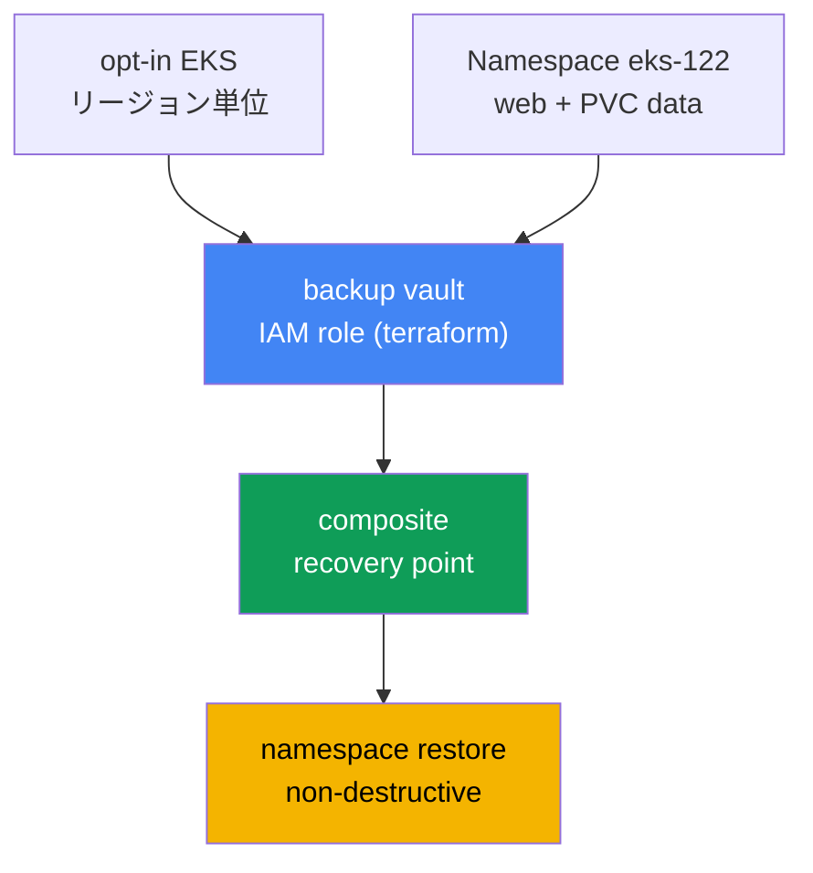
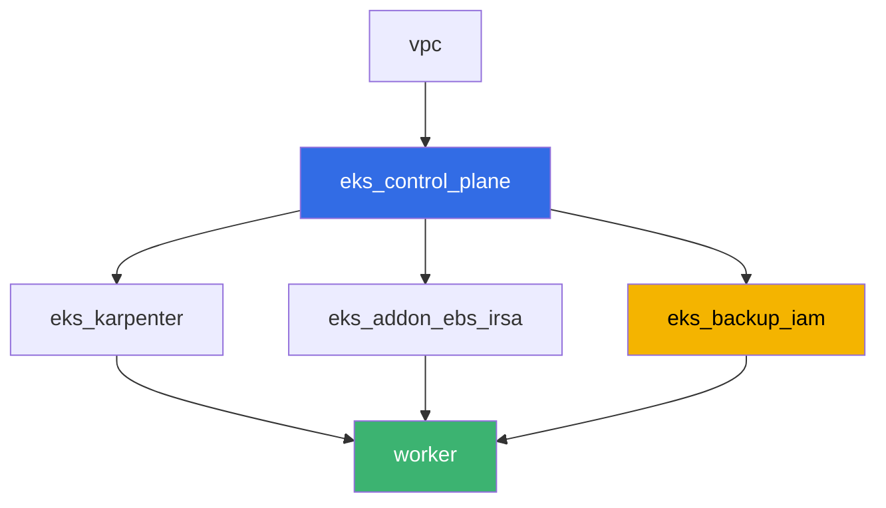

[Русская версия](README_RU.MD) · [Eng version](README.MD) · [Versión en español](README_ES.MD) · [Version française](README_FR.MD) · [Deutsche Version](README_DE.MD) · [ქართული ვერსია](README_GE.MD) · [繁體中文版](README_TW.MD)

# Lab 122 - EKS 向け AWS Backup: composite recovery point、namespace のリストア

## 概要

AWS Backup を使ってクラスターの状態と永続ボリュームのデータをバックアップ・リストアする
ラボです。リージョンに対して AWS Backup の Amazon EKS の opt-in を有効化し、EBS ボリューム
上のワークロードを持つクラスターの on-demand バックアップを実行し、composite recovery
point（クラスターの状態とボリュームを 1 つの整合した復旧ポイントとしてまとめたもの）を読み
解き、稼働中のクラスターに既にあるものを壊さずに namespace をリストアします。最後に、クラス
ターのバージョンをロールバックしても削除された namespace は戻せない理由を説明します - 第 41
章の動機付けの例です。

タスクはプロダクション寄りのスタイルです。短い設題と受け入れ基準の組み合わせで、チェックは
`check_result` コマンドによる自動判定です。

## 目的

コースの以下の章の内容を定着させます:

- [第 41 章。AWS Backup によるクラスターのバックアップ](../../course/41/ru.md) - composite
  recovery point、backup plan、vault、IAM role
- [第 42 章。リストアと DR](../../course/42/ru.md) - namespace restore、
  non-destructive restore
- [第 23 章。EBS CSI](../../course/23/ru.md) - StorageClass gp3、バックアップに入る PVC の
  背後のボリューム
- [第 5 章。クラスターへのアクセス](../../course/05/ru.md) - 認可モード
  `API_AND_CONFIG_MAP` と access entries。これらがないと AWS Backup はクラスターを読み取れ
  ません

## 作成するもの

| オブジェクト | 何か | このラボでの役割 |
|--------|---------|-------------------|
| Namespace `eks-122` | ラボのワークロード用のクラスター区画 | リソースを分離して置く（第 4 章） |
| StorageClass `gp3` 上の PVC `data` | ワークロードの背後のボリューム | AWS Backup が child recovery point として取得する EBS ボリューム（第 41 章） |
| Deployment `web` + ConfigMap `marker` | ワークロードとマーカー | マーカーはリストアされたオブジェクトがバックアップ由来であることを示す（第 42 章） |
| IAM ロール `<cluster>-backup`（terraform） | AWS Backup 用のロール | `AWSBackupServiceRolePolicyForBackup`/`ForRestores`（第 41 章） |
| backup vault `<cluster>-vault`（terraform） | recovery points の保管先 | KMS による暗号化（第 41 章） |
| composite recovery point | on-demand backup job の結果 | クラスターの状態と `data` ボリュームを 1 つの復旧ポイントに（第 41 章） |
| namespace restore | `eks-122` を同じクラスターへリストア | non-destructive restore（第 42 章） |



## インフラ

環境は Terragrunt によって AWS（`eu-central-1`）にデプロイされます。ラボの各ディレクトリが
1 つのコンポーネントで、それぞれ独自の `terragrunt.hcl` を持ち、`terraform/modules/` の共通
モジュールを参照して `dependency` ブロックで依存関係を宣言します。ベースは lab 101 と同じ
（control plane、システム pod 用の Fargate、ワークロード用の Karpenter）で、そこに EBS CSI
（PVC の背後のボリューム用）と、AWS Backup の IAM ロールと vault を作る新しいコンポーネント
が加わります。

### モジュールと依存関係

| ディレクトリ（コンポーネント） | モジュール（`terraform/modules/`） | 依存先 | 作成するもの |
|---------------------|-------------------------------|------------|-------------|
| `vpc` | `vpc_v3` | - | VPC `10.10.0.0/16`、2 つの AZ のサブネット、NAT |
| `ssh-keys` | `ssh-keys` | - | 作業マシンとノード用の SSH 鍵ペア |
| `eks_control_plane` | `eks_v2_control_plane` | `vpc` | `authentication_mode = "API_AND_CONFIG_MAP"` を明示した EKS `1.36` の control plane |
| `eks_fargate_system` | `eks_v2_fargate` | `vpc`, `eks_control_plane` | `kube-system` と `karpenter` 用の Fargate プロファイル |
| `eks_addons` | `eks_v2_addons` | `eks_control_plane`, `eks_fargate_system` | coredns、kube-proxy、vpc-cni、pod-identity |
| `eks_karpenter` | `eks_v2_karpenter` | `vpc`, `eks_control_plane`, `eks_addons`, `eks_fargate_system` | Karpenter コントローラー、ノードの IAM ロール |
| `eks_karpenter_default_vng` | `eks_v2_karpenter_vng` | `vpc`, `eks_control_plane`, `eks_karpenter` | AL2023 上のデフォルト NodePool `default` |
| `eks_addon_ebs_irsa` | `eks_v2_ebs_irsa` | `eks_fargate_system`, `eks_control_plane` | IRSA 経由の managed addon `aws-ebs-csi-driver` |
| `eks_backup_iam` | `eks_v2_backup_iam` | `eks_control_plane` | AWS Backup の IAM ロールと backup vault |
| `worker` | `eks_v2_work_pc` | `ssh-keys`, `vpc`, `eks_control_plane`, `eks_karpenter`, `eks_addon_ebs_irsa`, `eks_backup_iam` | kubectl、tests、`check_result` が入った作業マシン |

依存関係グラフ（先に適用されるものが矢印の下側）:



### control plane に `authentication_mode` を明示している理由

EKS 向けの AWS Backup は自分用の access entry を作成し、Kubernetes API 経由でクラスターの
オブジェクトを読み取ります。そのため認可モードが `API` または `API_AND_CONFIG_MAP` である
必要があります（第 41 章、41.3 節）。モジュール `terraform-aws-modules/eks/aws` のバージョン
21 はデフォルトで既に `API_AND_CONFIG_MAP` を設定しますが、`eks_v2_control_plane/eks.tf`
ではこのパラメーターをモジュールのデフォルトに任せず明示しています - ラボの前提条件がサード
パーティーモジュールのバージョンに左右されてはいけないからです。

### どこで何を設定するか

`env.hcl`（すべてのコンポーネントが読む環境共通のパラメーター）:

| パラメーター | ラボでの値 | 影響するもの |
|----------|-----------------|---------------|
| `region` | `eu-central-1` | AWS Backup の opt-in を含む全リソースのリージョン |
| `prefix` | `eks-task122` | リソース名とタグのプレフィックス |
| `stack_name` | `eks122` | ここから `env_name` - クラスター名が組み立てられる |
| `k8_version` | `1.36.0` | 作業マシン上の kubectl のバージョン |

各コンポーネントの `terragrunt.hcl` の `inputs`（そのモジュール固有のパラメーター）:

| ファイル | 主な設定 |
|------|--------------------|
| `eks_addon_ebs_irsa/terragrunt.hcl` | managed addon `aws-ebs-csi-driver`、ロールは IRSA 経由 |
| `eks_backup_iam/terragrunt.hcl` | `name` - クラスター名、ロール `<cluster>-backup`、vault `<cluster>-vault` |
| `worker/terragrunt.hcl` | lab 122 のファイルを指す `test_url` と `task_script_url` |

## デプロイ

```bash
TASK=122 make run_eks_task
```

デプロイには約 15-20 分かかります。出力から作業マシンへの SSH 接続の行を見つけて接続して
ください。kubectl は対象クラスター向けに設定済みで、EBS CSI ドライバーもインストール済み、
AWS Backup のロール名と vault 名は `~/lab122_hints.txt` ファイルにあります。

作業マシンで使える便利なコマンド:

```bash
time_left               # 環境の残り時間
check_result             # 解答をチェックする
cat ~/lab122_hints.txt   # クラスター名、AWS Backup ロールの ARN、vault 名
```

> 演習環境のセキュリティについて。`env.hcl` では `ssh_password_enable = true` と
> `access_cidrs = ["0.0.0.0/0"]` が有効です - 学習環境では便利ですが、プロダクションでこう
> してはいけません。コースの基準（第 0.2、2、19 章）では、作業マシンへのアクセスは公開 SSH
> ポートを外に出さず AWS SSM Session Manager 経由で開き、`access_cidrs` は具体的なアドレス
> まで絞ります。ここでは起動の手軽さのためだけに公開 SSH を残しています。

## タスク

---
|        **1**        | **Namespace、EBS ボリューム、そして今後のバックアップ用のマーカー**          |
| :-----------------: | :---------------------------------------------------------- |
| やること          | namespace `eks-122` を作成してください。StorageClass `gp3`（`provisioner: ebs.csi.aws.com`、`volumeBindingMode: WaitForFirstConsumer`）と、そのクラス上の PVC `data`（`5Gi`）を作成してください。PVC `data` をマウントする Deployment `web`（イメージ `viktoruj/ping_pong:latest`、レプリカ `1`）を作成してください。キー `marker` に任意の値を入れた ConfigMap `marker` を作成し、同じ値をファイル `/var/work/tests/artifacts/1/marker.txt` に保存してください。 |
| 受け入れ基準    | - PVC `data` がクラス `gp3` で `Bound`;<br/>- Deployment `web` が `eks-122` にあり、イメージ `viktoruj/ping_pong`、少なくとも 1 つの ready なレプリカ;<br/>- ファイル `1/marker.txt` が空でなく、ConfigMap `marker` の値と一致する。 |
---
|        **2**        | **リージョンに対する AWS Backup の Amazon EKS opt-in**                |
| :-----------------: | :---------------------------------------------------------- |
| やること          | `aws backup describe-region-settings` を確認し、変更前の状態を `before=...` の行としてファイル `/var/work/tests/artifacts/2/optin.txt` に保存してください。Amazon EKS が有効でなければ `aws backup update-region-settings --resource-type-opt-in-preference '{"EKS":true}'` を実行してください。同じファイルに最終値を含む `after=...` の行を追加してください。 |
| 受け入れ基準    | - `describe-region-settings` が `ResourceTypeOptInPreference.EKS = true` を示す;<br/>- ファイル `2/optin.txt` に `before=` と `after=true` の行がある。 |
---
|        **3**        | **クラスターの on-demand バックアップ**                                 |
| :-----------------: | :---------------------------------------------------------- |
| やること          | `~/lab122_hints.txt` からクラスターの ARN と AWS Backup ロールの ARN を取得してください。`aws backup start-backup-job --resource-arn <cluster-arn> --iam-role-arn <role-arn> --backup-vault-name <vault>` を実行してください。job が終端ステータス（`COMPLETED` または `PARTIAL` - `data` ボリュームの EBS スナップショットはクラスターの状態より時間がかかることがあります）になるまで待ってください。`backup_job_id`、最終的な `status`、`recovery_point_arn` をファイル `/var/work/tests/artifacts/3/backup_status.txt` に保存してください。 |
| 受け入れ基準    | - ファイル `3/backup_status.txt` に `backup_job_id=`、`status=`、`recovery_point_arn=` が含まれる;<br/>- 最終ステータスが `COMPLETED` または `PARTIAL`。 |
---
|        **4**        | **composite recovery point の調査**                      |
| :-----------------: | :---------------------------------------------------------- |
| やること          | `aws backup list-recovery-points-by-backup-vault --backup-vault-name <vault>` を実行してタスク 3 の composite ポイントを見つけ、さらに `--by-parent-recovery-point-arn` でその入れ子（child）ポイントも見つけてください。ファイル `/var/work/tests/artifacts/4/composite.txt` に第 41 章の言葉で説明を書いてください: composite recovery point とは何か、クラスターの状態の child ポイントとボリュームの child ポイントはどう違うか、`ParentRecoveryPointArn` フィールドは何を意味するか。文中には `composite`、`child`、`ParentRecoveryPointArn`（または `nested`）という語が必要です。 |
| 受け入れ基準    | - ファイル `4/composite.txt` が空でなく、`composite`、`child`、`ParentRecoveryPointArn`/`nested` を含む。 |
---
|        **5**        | **Namespace restore: non-destructive**                        |
| :-----------------: | :---------------------------------------------------------- |
| やること          | タスク 3 の composite recovery point に対して、EKS のメタデータ付きで `aws backup start-restore-job` を実行してください: `clusterName`（同じクラスター）、`newCluster=false`、`namespaceLevelRestore=true`、`namespaces=["eks-122"]`。このセットだけでは**足りません**: composite ポイントには EBS スナップショットも含まれており、その復元には AWS Backup が必ず Availability Zone を要求します。指定しないと、ボリュームの child restore job は `Restore Job failed as no restore metadata was provided` で失敗し、親は `All PV restore jobs failed to restore` で失敗します。`nestedRestoreJobs` パラメーター - `入れ子ポイントの ARN -> {"AvailabilityZone":"<ゾーン>"}` のマップを追加し、既存の EC2 ノードのゾーン（`topology.kubernetes.io/zone`）を使ってください。そうしないとボリュームはマウントする相手のいない場所に作られます。エンコードの入れ子構造に注意してください: `nestedRestoreJobs` の値はマップを含む JSON 文字列で、その要素の値もまた JSON 文字列です。クォートが 1 段多いと `Invalid JSON format in NestedRestoreMetadata` になります。ステータス `COMPLETED` を待ってください（通常 7-8 分）。Deployment `web` と ConfigMap `marker` が重複していないこと、マーカーの値がタスク 1 のファイルと一致することを確認してください。`restore_job_id`、`status`、そして non-destructive な挙動の説明（`non-destructive` という語を含めて）を `/var/work/tests/artifacts/5/restore_status.txt` に保存してください。 |
| 受け入れ基準    | - ファイル `5/restore_status.txt` に `restore_job_id=` が含まれ、`non-destructive` に言及している;<br/>- restore job のステータスが `COMPLETED`;<br/>- restore 後に Deployment `web` が少なくとも 1 つの ready なレプリカを持つ。 |
---
|        **6**        | **クラスターのバージョンのロールバックが `kubectl delete namespace` を救わない理由** |
| :-----------------: | :---------------------------------------------------------- |
| やること          | ファイル `/var/work/tests/artifacts/6/whynonrollback.txt` に、クラスターのバージョンのロールバック（第 39 章）では `kubectl delete namespace` で削除された namespace を戻せない理由を説明してください（第 41 章 41.1 節の動機付けの例）。文中には `etcd`、`rollback`、`namespace` という語が必要です。 |
| 受け入れ基準    | - ファイル `6/whynonrollback.txt` が空でなく、`etcd`、`rollback`、`namespace` を含む。 |
---

## 結果のチェック

作業マシンで自動チェックを実行します:

```bash
check_result
```

スクリプトがテストを実行し、完了したタスクの割合を表示します。タスク 3 と 5 は
backup/restore job の終端ステータスを最大 10 分待ちます - EBS スナップショットでは普通の
ことです。

## 解答

リファレンス解答: [worker/files/solutions/1_JP.MD](worker/files/solutions/1_JP.MD)

## クラスターとリソースの削除

> **ここでは準備なしに `destroy` は通りません。** backup vault は terraform が作りましたが、
> その中の recovery points は違います。あなたが `start-backup-job` で作ったものです。
> Terraform は空でない vault を削除できないので、まず復旧ポイントを削除する必要があります。
> 順序が重要です: 先に入れ子（child）、次に composite - 親ポイントは子を持っている間は AWS
> が削除させません（`Parent recovery point cannot be deleted because it has child recovery points`）。
> 別件として、restore は terraform の外に**新しい EBS ボリューム**を（Kubernetes のタグなし
> で）作っており、それは残り続けて課金されます。そして PVC を使う他のラボと同様 - クラスター
> を壊す前に namespace を削除してください。そうしないと EBS CSI が PVC の背後のボリュームを
> 削除しきれません。

```bash
VAULT=$(grep '^vault_name' ~/lab122_hints.txt | awk '{print $3}')

# 1. ワークロードを外す: EBS CSI が PVC の背後のボリュームを削除し、Karpenter がノードを片付ける
kubectl delete namespace eks-122 --ignore-not-found
while kubectl get nodes --no-headers 2>/dev/null | grep -qv fargate; do
  echo "Karpenter の EC2 ノードがまだ生きています。待機中..."; sleep 15
done

# 2. まず入れ子のポイント、そのあと composite を削除
for ARN in $(aws backup list-recovery-points-by-backup-vault --backup-vault-name "$VAULT" \
    --query 'RecoveryPoints[?IsParent==`false`].RecoveryPointArn' --output text); do
  aws backup delete-recovery-point --backup-vault-name "$VAULT" --recovery-point-arn "$ARN"
done
sleep 30
for ARN in $(aws backup list-recovery-points-by-backup-vault --backup-vault-name "$VAULT" \
    --query 'RecoveryPoints[?IsParent==`true`].RecoveryPointArn' --output text); do
  aws backup delete-recovery-point --backup-vault-name "$VAULT" --recovery-point-arn "$ARN"
done

# vault は空になる必要があります。そうでないと terraform は削除できません
aws backup list-recovery-points-by-backup-vault --backup-vault-name "$VAULT" \
  --query 'length(RecoveryPoints)' --output text
```

次に restore が作ったボリュームを片付けます。見分けるのは簡単で、`available` かつ**タグが
まったくありません**（PVC の背後のボリュームはドライバーが
`kubernetes.io/created-for/pvc/name` を付けて自分で削除しますが、このボリュームは AWS Backup
が作ったもので所有者がいません）:

```bash
# タグのないボリュームこそ restore の産物です
aws ec2 describe-volumes --filters Name=status,Values=available \
  --query 'Volumes[?Tags==null].[VolumeId,Size,CreateTime]' --output table
aws ec2 delete-volume --volume-id <vol-id>
```

```bash
TASK=122 make delete_eks_task
```
