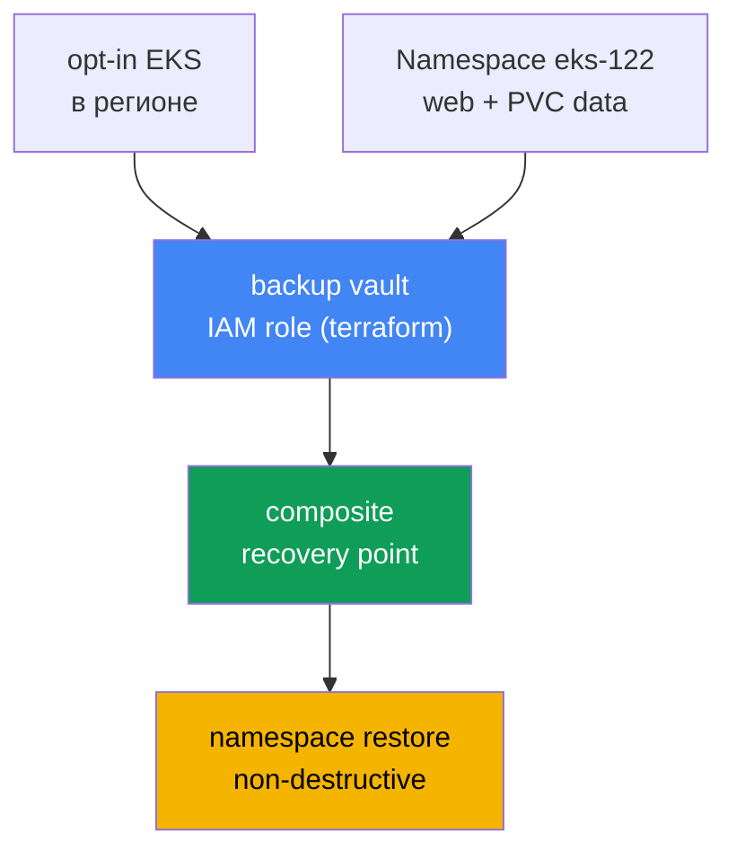
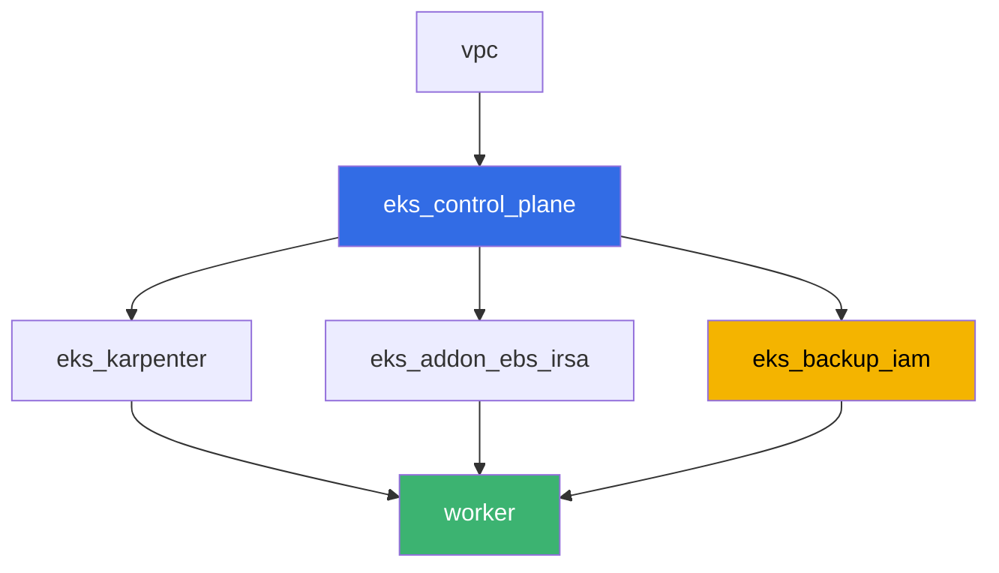

# Лаба 122 - AWS Backup для EKS: composite recovery point, восстановление namespace

## Описание

Лаба про бэкап и восстановление состояния кластера и данных постоянных томов через
AWS Backup. Вы включите opt-in Amazon EKS в AWS Backup для региона, запустите
on-demand бэкап кластера с нагрузкой на EBS-томе, разберёте composite recovery point
(состояние кластера плюс том как одна согласованная точка) и восстановите namespace
не разрушая то, что уже есть в живом кластере. В конце объясните, почему откат версии
кластера не может вернуть удалённый namespace - мотивирующий пример из главы 41.

Задания в продакшн-стиле: короткая постановка плюс критерии приёмки. Проверка -
автоматическая, командой `check_result`.

## Цель

Закрепить материал глав курса:

- [Глава 41. Бэкап кластера через AWS Backup](../../course/41/ru.md) - composite
  recovery point, backup plan, vault, IAM role
- [Глава 42. Восстановление и DR](../../course/42/ru.md) - namespace restore,
  non-destructive restore
- [Глава 23. EBS CSI](../../course/23/ru.md) - StorageClass gp3, том за PVC, который
  и попадает в бэкап
- [Глава 5. Доступ к кластеру](../../course/05/ru.md) - режим авторизации
  `API_AND_CONFIG_MAP` и access entries, без которых AWS Backup не читает кластер

## Что мы создаём

| Объект | Что это | Зачем в этой лабе |
|--------|---------|-------------------|
| Namespace `eks-122` | раздел кластера под нагрузку лабы | держим ресурсы отдельно (глава 4) |
| PVC `data` на StorageClass `gp3` | том за нагрузкой | том EBS, который AWS Backup снимет как child recovery point (глава 41) |
| Deployment `web` + ConfigMap `marker` | нагрузка и маркер | маркер докажет, что восстановленный объект пришёл из бэкапа (глава 42) |
| IAM-роль `<cluster>-backup` (terraform) | роль для AWS Backup | `AWSBackupServiceRolePolicyForBackup`/`ForRestores` (глава 41) |
| backup vault `<cluster>-vault` (terraform) | хранилище recovery points | шифрование KMS (глава 41) |
| composite recovery point | результат on-demand backup job | состояние кластера плюс том `data` как одна точка (глава 41) |
| namespace restore | восстановление `eks-122` в тот же кластер | non-destructive restore (глава 42) |



## Инфраструктура

Окружение разворачивается в AWS (`eu-central-1`) через Terragrunt. Каждый каталог лабы -
это один компонент со своим `terragrunt.hcl`, который ссылается на общий модуль в
`terraform/modules/` и объявляет зависимости через блоки `dependency`. База - та же, что
в лабе 101 (control plane, Fargate под системные поды, Karpenter под нагрузку), плюс
EBS CSI (для тома под PVC) и новый компонент под IAM-роль и vault AWS Backup.

### Модули и зависимости

| Каталог (компонент) | Модуль (`terraform/modules/`) | Зависит от | Что создаёт |
|---------------------|-------------------------------|------------|-------------|
| `vpc` | `vpc_v3` | - | VPC `10.10.0.0/16`, подсети в двух AZ, NAT |
| `ssh-keys` | `ssh-keys` | - | пара SSH-ключей для рабочей машины и нод |
| `eks_control_plane` | `eks_v2_control_plane` | `vpc` | control plane EKS `1.36` с явным `authentication_mode = "API_AND_CONFIG_MAP"` |
| `eks_fargate_system` | `eks_v2_fargate` | `vpc`, `eks_control_plane` | Fargate-профиль для `kube-system` и `karpenter` |
| `eks_addons` | `eks_v2_addons` | `eks_control_plane`, `eks_fargate_system` | coredns, kube-proxy, vpc-cni, pod-identity |
| `eks_karpenter` | `eks_v2_karpenter` | `vpc`, `eks_control_plane`, `eks_addons`, `eks_fargate_system` | контроллер Karpenter, IAM-роль нод |
| `eks_karpenter_default_vng` | `eks_v2_karpenter_vng` | `vpc`, `eks_control_plane`, `eks_karpenter` | дефолтный NodePool `default` на AL2023 |
| `eks_addon_ebs_irsa` | `eks_v2_ebs_irsa` | `eks_fargate_system`, `eks_control_plane` | managed addon `aws-ebs-csi-driver` через IRSA |
| `eks_backup_iam` | `eks_v2_backup_iam` | `eks_control_plane` | IAM-роль AWS Backup и backup vault |
| `worker` | `eks_v2_work_pc` | `ssh-keys`, `vpc`, `eks_control_plane`, `eks_karpenter`, `eks_addon_ebs_irsa`, `eks_backup_iam` | рабочая машина с kubectl, tests и `check_result` |

Граф зависимостей (что применяется раньше, то ниже по стрелке):



### Почему у control plane явный `authentication_mode`

AWS Backup для EKS создаёт себе access entry и читает объекты кластера через
Kubernetes API - для этого нужен режим авторизации `API` или `API_AND_CONFIG_MAP`
(глава 41, раздел 41.3). Модуль `terraform-aws-modules/eks/aws` версии 21 по умолчанию
уже ставит `API_AND_CONFIG_MAP`, но в `eks_v2_control_plane/eks.tf` этот параметр
теперь задан явно, а не оставлен на дефолт модуля - предусловие лабы не должно зависеть
от версии стороннего модуля.

### Где что настраивается

`env.hcl` (общие параметры окружения, читаются всеми компонентами):

| Параметр | Значение в лабе | На что влияет |
|----------|-----------------|---------------|
| `region` | `eu-central-1` | регион всех ресурсов, включая opt-in AWS Backup |
| `prefix` | `eks-task122` | префикс имён ресурсов и тегов |
| `stack_name` | `eks122` | из него собирается `env_name` - имя кластера |
| `k8_version` | `1.36.0` | версия kubectl на рабочей машине |

`inputs` в `terragrunt.hcl` каждого компонента (параметры конкретного модуля):

| Файл | Ключевые настройки |
|------|--------------------|
| `eks_addon_ebs_irsa/terragrunt.hcl` | managed addon `aws-ebs-csi-driver`, роль через IRSA |
| `eks_backup_iam/terragrunt.hcl` | `name` - имя кластера, роль `<cluster>-backup`, vault `<cluster>-vault` |
| `worker/terragrunt.hcl` | `test_url` и `task_script_url` на файлы лабы 122 |

## Развёртывание

```bash
TASK=122 make run_eks_task
```

Развёртывание занимает примерно 15-20 минут. В выводе найдите строку с SSH-подключением к
рабочей машине и подключитесь к ней. kubectl там уже настроен на нужный кластер, драйвер
EBS CSI уже установлен, а имя роли и vault AWS Backup - в файле `~/lab122_hints.txt`.

Полезные команды на рабочей машине:

```bash
time_left               # сколько осталось времени окружения
check_result             # проверить решение
cat ~/lab122_hints.txt   # имя кластера, ARN роли AWS Backup, имя vault
```

> Безопасность стенда. В `env.hcl` включены `ssh_password_enable = true` и
> `access_cidrs = ["0.0.0.0/0"]` - это удобно для учебного окружения, но так делать в
> продакшене нельзя. По стандартам курса (главы 0.2, 2, 19) доступ к рабочим машинам
> открывают через AWS SSM Session Manager без публичных SSH-портов наружу, а `access_cidrs`
> сужают до конкретных адресов. Здесь публичный SSH оставлен только ради простоты запуска.

## Задания

---
|        **1**        | **Namespace, EBS-том и маркер для будущего бэкапа**          |
| :-----------------: | :---------------------------------------------------------- |
| Что делаем          | Создайте namespace `eks-122`. Создайте StorageClass `gp3` (`provisioner: ebs.csi.aws.com`, `volumeBindingMode: WaitForFirstConsumer`) и PVC `data` (`5Gi`) на этом классе. Создайте Deployment `web` (образ `viktoruj/ping_pong:latest`, `1` реплика), монтирующий PVC `data`. Создайте ConfigMap `marker` с любым произвольным значением ключа `marker` и сохраните то же значение в файл `/var/work/tests/artifacts/1/marker.txt`. |
| Критерии приёмки    | - PVC `data` на классе `gp3`, `Bound`;<br/>- Deployment `web` в `eks-122`, образ `viktoruj/ping_pong`, хотя бы одна готовая реплика;<br/>- файл `1/marker.txt` не пуст и совпадает со значением ConfigMap `marker`. |
---
|        **2**        | **Opt-in Amazon EKS в AWS Backup для региона**                |
| :-----------------: | :---------------------------------------------------------- |
| Что делаем          | Проверьте `aws backup describe-region-settings`, сохраните состояние `до` в файл `/var/work/tests/artifacts/2/optin.txt` строкой `before=...`. Если Amazon EKS не включён, выполните `aws backup update-region-settings --resource-type-opt-in-preference '{"EKS":true}'`. Добавьте в тот же файл строку `after=...` с итоговым значением. |
| Критерии приёмки    | - `describe-region-settings` показывает `ResourceTypeOptInPreference.EKS = true`;<br/>- файл `2/optin.txt` содержит строки `before=` и `after=true`. |
---
|        **3**        | **On-demand backup кластера**                                 |
| :-----------------: | :---------------------------------------------------------- |
| Что делаем          | Возьмите ARN кластера и ARN роли AWS Backup из `~/lab122_hints.txt`. Запустите `aws backup start-backup-job --resource-arn <cluster-arn> --iam-role-arn <role-arn> --backup-vault-name <vault>`. Дождитесь терминального статуса job (`COMPLETED` или `PARTIAL` - EBS-снапшот тома `data` может занять больше времени, чем состояние кластера). Сохраните `backup_job_id`, итоговый `status` и `recovery_point_arn` в файл `/var/work/tests/artifacts/3/backup_status.txt`. |
| Критерии приёмки    | - файл `3/backup_status.txt` содержит `backup_job_id=`, `status=`, `recovery_point_arn=`;<br/>- итоговый статус `COMPLETED` или `PARTIAL`. |
---
|        **4**        | **Диагностика composite recovery point**                      |
| :-----------------: | :---------------------------------------------------------- |
| Что делаем          | Выполните `aws backup list-recovery-points-by-backup-vault --backup-vault-name <vault>` и найдите composite точку из задания 3, а также её вложенные (child) точки через `--by-parent-recovery-point-arn`. В файл `/var/work/tests/artifacts/4/composite.txt` запишите объяснение словами из главы 41: что такое composite recovery point, чем child-точка состояния кластера отличается от child-точки тома, и что означает поле `ParentRecoveryPointArn`. В тексте должны быть слова `composite`, `child` и `ParentRecoveryPointArn` (или `nested`). |
| Критерии приёмки    | - файл `4/composite.txt` не пуст и содержит `composite`, `child`, `ParentRecoveryPointArn`/`nested`. |
---
|        **5**        | **Namespace restore: non-destructive**                        |
| :-----------------: | :---------------------------------------------------------- |
| Что делаем          | Запустите `aws backup start-restore-job` по composite recovery point из задания 3 с метаданными EKS: `clusterName` (тот же кластер), `newCluster=false`, `namespaceLevelRestore=true`, `namespaces=["eks-122"]`. Дождитесь статуса `COMPLETED`. Убедитесь, что Deployment `web` и ConfigMap `marker` не задублировались и значение маркера совпадает с файлом из задания 1. Сохраните `restore_job_id`, `status` и объяснение non-destructive поведения (со словом `non-destructive` или `неразрушающий`) в `/var/work/tests/artifacts/5/restore_status.txt`. |
| Критерии приёмки    | - файл `5/restore_status.txt` содержит `restore_job_id=` и упоминает `non-destructive`/`неразрушающий`;<br/>- статус restore job `COMPLETED`;<br/>- Deployment `web` имеет хотя бы одну готовую реплику после restore. |
---
|        **6**        | **Почему откат версии кластера не спасает от `kubectl delete namespace`** |
| :-----------------: | :---------------------------------------------------------- |
| Что делаем          | Объясните в файл `/var/work/tests/artifacts/6/whynonrollback.txt`, почему откат версии кластера (глава 39) не может вернуть namespace, удалённый командой `kubectl delete namespace` (мотивирующий пример раздела 41.1 главы 41). В тексте должны быть слова `etcd`, `откат`/`rollback` и `namespace`. |
| Критерии приёмки    | - файл `6/whynonrollback.txt` не пуст и содержит `etcd`, `откат`/`rollback`, `namespace`. |
---

## Проверка результата

На рабочей машине запустите автоматическую проверку:

```bash
check_result
```

Скрипт прогонит тесты и покажет процент выполненных заданий. Задания 3 и 5 ждут
терминального статуса backup/restore job до 10 минут - это нормально для EBS-снапшота.

## Решение

Эталонное решение: [worker/files/solutions/1.MD](worker/files/solutions/1.MD)

## Удаление кластера и ресурсов

```bash
TASK=122 make delete_eks_task
```
