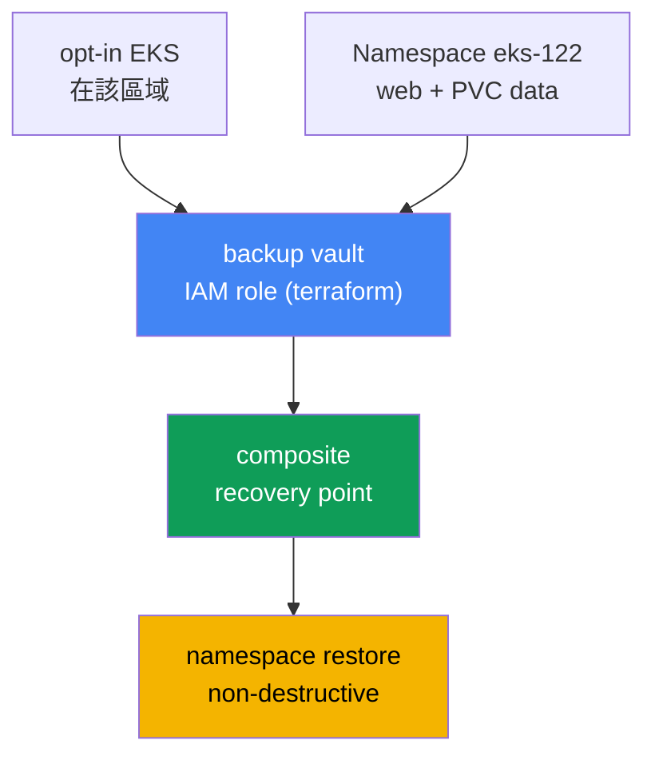
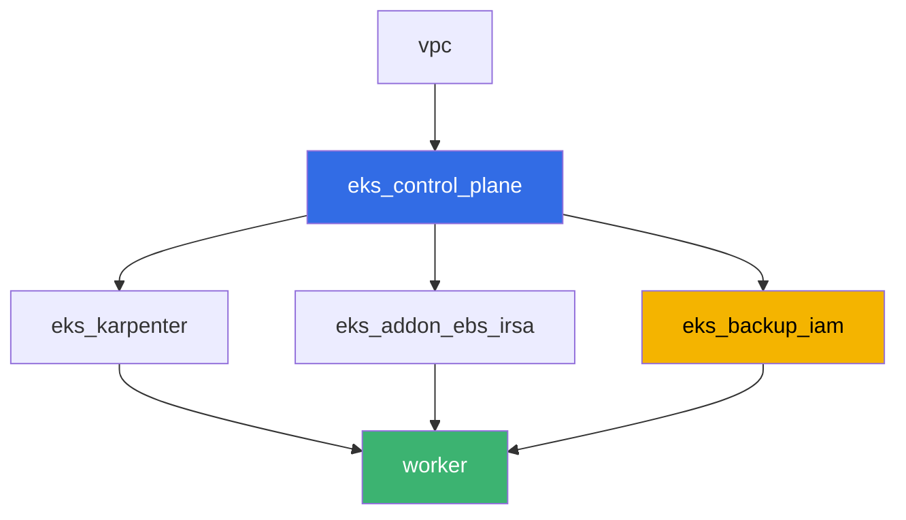

[Русская версия](README_RU.MD) · [Eng version](README.MD) · [Versión en español](README_ES.MD) · [Version française](README_FR.MD) · [Deutsche Version](README_DE.MD) · [ქართული ვერსია](README_GE.MD) · [日本語版](README_JP.MD)

# 實驗 122 - EKS 的 AWS Backup：composite recovery point、namespace 還原

## 說明

這個實驗講的是透過 AWS Backup 備份與還原叢集狀態以及持久卷的資料。您將為該區域在 AWS
Backup 中啟用 Amazon EKS 的 opt-in，對帶有 EBS 卷工作負載的叢集執行一次 on-demand
備份，剖析 composite recovery point（叢集狀態加上該卷合成同一個一致的還原點），並在不
破壞正在運行的叢集中既有內容的前提下還原一個 namespace。最後您要解釋，為什麼回退叢集版
本無法找回已刪除的 namespace - 這是第 41 章的引導範例。

任務以生產風格撰寫：簡短的題目加上驗收標準。檢查是自動的，使用 `check_result` 指令。

## 目標

鞏固以下課程章節的內容：

- [第 41 章。透過 AWS Backup 備份叢集](../../course/41/tw.md) - composite
  recovery point、backup plan、vault、IAM role
- [第 42 章。還原與 DR](../../course/42/tw.md) - namespace restore、
  non-destructive restore
- [第 23 章。EBS CSI](../../course/23/tw.md) - StorageClass gp3，PVC 背後那個會進入備份
  的卷
- [第 5 章。叢集存取](../../course/05/tw.md) - 授權模式 `API_AND_CONFIG_MAP` 與 access
  entries，少了它們 AWS Backup 就讀不到叢集

## 我們要建立什麼

| 物件 | 這是什麼 | 在本實驗中的用途 |
|--------|---------|-------------------|
| Namespace `eks-122` | 放實驗工作負載的叢集區隔 | 讓資源彼此隔離（第 4 章） |
| StorageClass `gp3` 上的 PVC `data` | 工作負載背後的卷 | AWS Backup 會把它當成 child recovery point 取下的 EBS 卷（第 41 章） |
| Deployment `web` + ConfigMap `marker` | 工作負載與標記 | 標記可證明還原出來的物件來自備份（第 42 章） |
| IAM 角色 `<cluster>-backup`（terraform） | 給 AWS Backup 用的角色 | `AWSBackupServiceRolePolicyForBackup`/`ForRestores`（第 41 章） |
| backup vault `<cluster>-vault`（terraform） | 存放 recovery points 的地方 | KMS 加密（第 41 章） |
| composite recovery point | on-demand backup job 的結果 | 叢集狀態加上 `data` 卷合成同一個還原點（第 41 章） |
| namespace restore | 把 `eks-122` 還原回同一個叢集 | non-destructive restore（第 42 章） |



## 基礎架構

環境透過 Terragrunt 部署在 AWS（`eu-central-1`）。實驗的每個目錄都是一個元件，帶有自己的
`terragrunt.hcl`，它引用 `terraform/modules/` 中的共用模組，並透過 `dependency` 區塊宣告
依賴。基礎與實驗 101 相同（control plane、承載系統 pod 的 Fargate、承載工作負載的
Karpenter），再加上 EBS CSI（給 PVC 背後的卷用）以及一個新的元件，負責 AWS Backup 的
IAM 角色與 vault。

### 模組與依賴

| 目錄（元件） | 模組（`terraform/modules/`） | 依賴於 | 建立什麼 |
|---------------------|-------------------------------|------------|-------------|
| `vpc` | `vpc_v3` | - | VPC `10.10.0.0/16`，兩個 AZ 中的子網，NAT |
| `ssh-keys` | `ssh-keys` | - | 給工作機與節點用的一對 SSH 金鑰 |
| `eks_control_plane` | `eks_v2_control_plane` | `vpc` | EKS `1.36` control plane，明確設定 `authentication_mode = "API_AND_CONFIG_MAP"` |
| `eks_fargate_system` | `eks_v2_fargate` | `vpc`, `eks_control_plane` | 給 `kube-system` 與 `karpenter` 的 Fargate 設定檔 |
| `eks_addons` | `eks_v2_addons` | `eks_control_plane`, `eks_fargate_system` | coredns、kube-proxy、vpc-cni、pod-identity |
| `eks_karpenter` | `eks_v2_karpenter` | `vpc`, `eks_control_plane`, `eks_addons`, `eks_fargate_system` | Karpenter 控制器、節點 IAM 角色 |
| `eks_karpenter_default_vng` | `eks_v2_karpenter_vng` | `vpc`, `eks_control_plane`, `eks_karpenter` | AL2023 上的預設 NodePool `default` |
| `eks_addon_ebs_irsa` | `eks_v2_ebs_irsa` | `eks_fargate_system`, `eks_control_plane` | 透過 IRSA 的 managed addon `aws-ebs-csi-driver` |
| `eks_backup_iam` | `eks_v2_backup_iam` | `eks_control_plane` | AWS Backup 的 IAM 角色與 backup vault |
| `worker` | `eks_v2_work_pc` | `ssh-keys`, `vpc`, `eks_control_plane`, `eks_karpenter`, `eks_addon_ebs_irsa`, `eks_backup_iam` | 帶有 kubectl、tests 與 `check_result` 的工作機 |

依賴關係圖（越早套用的越在箭頭的下游）：



### 為什麼 control plane 要明確指定 `authentication_mode`

EKS 的 AWS Backup 會為自己建立 access entry，並透過 Kubernetes API 讀取叢集物件 - 這需要
授權模式為 `API` 或 `API_AND_CONFIG_MAP`（第 41 章，41.3 節）。模組
`terraform-aws-modules/eks/aws` 第 21 版預設就已經設成 `API_AND_CONFIG_MAP`，但在
`eks_v2_control_plane/eks.tf` 中這個參數現在是明確寫出來的，而不是交給模組的預設值 -
實驗的前置條件不應該取決於第三方模組的版本。

### 各項設定在哪裡

`env.hcl`（環境的共用參數，所有元件都會讀取）：

| 參數 | 實驗中的值 | 影響什麼 |
|----------|-----------------|---------------|
| `region` | `eu-central-1` | 所有資源的區域，包含 AWS Backup 的 opt-in |
| `prefix` | `eks-task122` | 資源名稱與標籤的前綴 |
| `stack_name` | `eks122` | 用它組出 `env_name` - 也就是叢集名稱 |
| `k8_version` | `1.36.0` | 工作機上的 kubectl 版本 |

每個元件 `terragrunt.hcl` 中的 `inputs`（該模組的具體參數）：

| 檔案 | 主要設定 |
|------|--------------------|
| `eks_addon_ebs_irsa/terragrunt.hcl` | managed addon `aws-ebs-csi-driver`，角色透過 IRSA |
| `eks_backup_iam/terragrunt.hcl` | `name` - 叢集名稱，角色 `<cluster>-backup`，vault `<cluster>-vault` |
| `worker/terragrunt.hcl` | `test_url` 與 `task_script_url` 指向實驗 122 的檔案 |

## 部署

```bash
TASK=122 make run_eks_task
```

部署大約需要 15-20 分鐘。在輸出中找到連往工作機的 SSH 連線那一行並連上去。那裡的 kubectl
已經指向對應的叢集，EBS CSI 驅動也已安裝，而 AWS Backup 的角色名稱與 vault 名稱在
`~/lab122_hints.txt` 檔案裡。

工作機上好用的指令：

```bash
time_left               # 環境還剩多少時間
check_result             # 檢查解答
cat ~/lab122_hints.txt   # 叢集名稱、AWS Backup 角色 ARN、vault 名稱
```

> 實驗環境的安全性。`env.hcl` 中啟用了 `ssh_password_enable = true` 與
> `access_cidrs = ["0.0.0.0/0"]` - 對教學環境來說很方便，但在生產環境不能這樣做。依照課程
> 標準（第 0.2、2、19 章），對工作機的存取要透過 AWS SSM Session Manager 開放，不對外暴露
> 公開的 SSH 連接埠，而 `access_cidrs` 要收斂到具體的位址。這裡保留公開 SSH 只是為了啟動
> 方便。

## 任務

---
|        **1**        | **Namespace、EBS 卷與給未來備份用的標記**          |
| :-----------------: | :---------------------------------------------------------- |
| 要做什麼          | 建立 namespace `eks-122`。建立 StorageClass `gp3`（`provisioner: ebs.csi.aws.com`、`volumeBindingMode: WaitForFirstConsumer`）以及該 class 上的 PVC `data`（`5Gi`）。建立 Deployment `web`（映像 `viktoruj/ping_pong:latest`、`1` 個副本），並掛載 PVC `data`。建立 ConfigMap `marker`，`marker` 鍵可用任意值，並把同一個值存到檔案 `/var/work/tests/artifacts/1/marker.txt`。 |
| 驗收標準    | - PVC `data` 在 class `gp3` 上，狀態 `Bound`；<br/>- Deployment `web` 在 `eks-122` 中，映像 `viktoruj/ping_pong`，至少有一個就緒副本；<br/>- 檔案 `1/marker.txt` 不為空，且與 ConfigMap `marker` 的值一致。 |
---
|        **2**        | **為該區域在 AWS Backup 中啟用 Amazon EKS 的 opt-in**                |
| :-----------------: | :---------------------------------------------------------- |
| 要做什麼          | 檢查 `aws backup describe-region-settings`，把變更前的狀態以 `before=...` 一行存到檔案 `/var/work/tests/artifacts/2/optin.txt`。如果 Amazon EKS 尚未啟用，執行 `aws backup update-region-settings --resource-type-opt-in-preference '{"EKS":true}'`。在同一個檔案中加上帶有最終值的 `after=...` 一行。 |
| 驗收標準    | - `describe-region-settings` 顯示 `ResourceTypeOptInPreference.EKS = true`；<br/>- 檔案 `2/optin.txt` 包含 `before=` 與 `after=true` 兩行。 |
---
|        **3**        | **叢集的 on-demand backup**                                 |
| :-----------------: | :---------------------------------------------------------- |
| 要做什麼          | 從 `~/lab122_hints.txt` 取得叢集 ARN 與 AWS Backup 角色 ARN。執行 `aws backup start-backup-job --resource-arn <cluster-arn> --iam-role-arn <role-arn> --backup-vault-name <vault>`。等待 job 進入終態（`COMPLETED` 或 `PARTIAL` - `data` 卷的 EBS 快照可能比叢集狀態花更久）。把 `backup_job_id`、最終的 `status` 與 `recovery_point_arn` 存到檔案 `/var/work/tests/artifacts/3/backup_status.txt`。 |
| 驗收標準    | - 檔案 `3/backup_status.txt` 包含 `backup_job_id=`、`status=`、`recovery_point_arn=`；<br/>- 最終狀態為 `COMPLETED` 或 `PARTIAL`。 |
---
|        **4**        | **診斷 composite recovery point**                      |
| :-----------------: | :---------------------------------------------------------- |
| 要做什麼          | 執行 `aws backup list-recovery-points-by-backup-vault --backup-vault-name <vault>`，找出任務 3 的 composite 還原點，並透過 `--by-parent-recovery-point-arn` 找出它的巢狀（child）還原點。在檔案 `/var/work/tests/artifacts/4/composite.txt` 中用第 41 章的說法寫下解釋：什麼是 composite recovery point、叢集狀態的 child 還原點與卷的 child 還原點差在哪裡，以及 `ParentRecoveryPointArn` 欄位代表什麼。文字中必須出現 `composite`、`child` 與 `ParentRecoveryPointArn`（或 `nested`）這些詞。 |
| 驗收標準    | - 檔案 `4/composite.txt` 不為空，且包含 `composite`、`child`、`ParentRecoveryPointArn`/`nested`。 |
---
|        **5**        | **Namespace restore：non-destructive**                        |
| :-----------------: | :---------------------------------------------------------- |
| 要做什麼          | 針對任務 3 的 composite recovery point 執行 `aws backup start-restore-job`，帶上 EKS 的中介資料：`clusterName`（同一個叢集）、`newCluster=false`、`namespaceLevelRestore=true`、`namespaces=["eks-122"]`。這組參數**還不夠**：composite 還原點裡還有一個 EBS 快照，而要還原它，AWS Backup 一定會要求提供 Availability Zone。少了它，卷的 child restore job 會以 `Restore Job failed as no restore metadata was provided` 失敗，而父 job 則以 `All PV restore jobs failed to restore` 失敗。請加上 `nestedRestoreJobs` 參數 - 一個 `巢狀還原點 ARN -> {"AvailabilityZone":"<可用區>"}` 的對應表，取現有 EC2 節點所在的可用區（`topology.kubernetes.io/zone`），否則卷會被建立在沒人能掛載它的地方。注意編碼的巢狀層次：`nestedRestoreJobs` 的值是一個內含對應表的 JSON 字串，而其中元素的值本身又是一個 JSON 字串；多一層引號就會得到 `Invalid JSON format in NestedRestoreMetadata`。等待狀態變成 `COMPLETED`（通常 7-8 分鐘）。確認 Deployment `web` 與 ConfigMap `marker` 沒有被重複建立，且標記值與任務 1 的檔案一致。把 `restore_job_id`、`status` 以及對 non-destructive 行為的解釋（要含 `non-destructive` 這個詞）存到 `/var/work/tests/artifacts/5/restore_status.txt`。 |
| 驗收標準    | - 檔案 `5/restore_status.txt` 包含 `restore_job_id=` 並提到 `non-destructive`；<br/>- restore job 的狀態為 `COMPLETED`；<br/>- restore 之後 Deployment `web` 至少有一個就緒副本。 |
---
|        **6**        | **為什麼回退叢集版本救不了 `kubectl delete namespace`** |
| :-----------------: | :---------------------------------------------------------- |
| 要做什麼          | 在檔案 `/var/work/tests/artifacts/6/whynonrollback.txt` 中解釋，為什麼回退叢集版本（第 39 章）無法找回被 `kubectl delete namespace` 刪除的 namespace（第 41 章 41.1 節的引導範例）。文字中必須出現 `etcd`、`rollback` 與 `namespace` 這些詞。 |
| 驗收標準    | - 檔案 `6/whynonrollback.txt` 不為空，且包含 `etcd`、`rollback`、`namespace`。 |
---

## 檢查結果

在工作機上執行自動檢查：

```bash
check_result
```

腳本會跑完測試並顯示已完成任務的百分比。任務 3 與 5 會等待 backup/restore job 進入終態，
最多 10 分鐘 - 對 EBS 快照來說這是正常的。

## 解答

參考解答：[worker/files/solutions/1_TW.MD](worker/files/solutions/1_TW.MD)

## 刪除叢集與資源

> **這裡不先做準備，`destroy` 是過不去的。** backup vault 是 terraform 建立的，但裡面的
> recovery points 不是：那些是您用 `start-backup-job` 做出來的。Terraform 無法刪除非空的
> vault，所以要先刪掉還原點。順序很重要：先刪巢狀的（child），再刪 composite - 只要父還原
> 點還有子還原點，AWS 就不讓您刪它
> （`Parent recovery point cannot be deleted because it has child recovery points`）。
> 另外：restore 在 terraform 之外建立了一個**新的 EBS 卷**（沒有 Kubernetes 標籤），它會
> 一直留著並持續計費。還有就跟其他帶 PVC 的實驗一樣 - 在拆掉叢集之前先刪 namespace，否則
> EBS CSI 來不及刪掉 PVC 背後的那個卷。

```bash
VAULT=$(grep '^vault_name' ~/lab122_hints.txt | awk '{print $3}')

# 1. 移除工作負載：EBS CSI 會刪掉 PVC 背後的卷，Karpenter 會收掉節點
kubectl delete namespace eks-122 --ignore-not-found
while kubectl get nodes --no-headers 2>/dev/null | grep -qv fargate; do
  echo "Karpenter 的 EC2 節點還活著，等待中..."; sleep 15
done

# 2. 先刪巢狀還原點，再刪 composite
for ARN in $(aws backup list-recovery-points-by-backup-vault --backup-vault-name "$VAULT" \
    --query 'RecoveryPoints[?IsParent==`false`].RecoveryPointArn' --output text); do
  aws backup delete-recovery-point --backup-vault-name "$VAULT" --recovery-point-arn "$ARN"
done
sleep 30
for ARN in $(aws backup list-recovery-points-by-backup-vault --backup-vault-name "$VAULT" \
    --query 'RecoveryPoints[?IsParent==`true`].RecoveryPointArn' --output text); do
  aws backup delete-recovery-point --backup-vault-name "$VAULT" --recovery-point-arn "$ARN"
done

# vault 必須變成空的，否則 terraform 刪不掉它
aws backup list-recovery-points-by-backup-vault --backup-vault-name "$VAULT" \
  --query 'length(RecoveryPoints)' --output text
```

接著移除 restore 建立的那個卷。它很容易辨認：狀態是 `available` 而且**完全沒有標籤**
（PVC 背後的卷會被驅動打上 `kubernetes.io/created-for/pvc/name` 標籤並由它自己刪除，而這
個卷是 AWS Backup 建立的，沒有主人）：

```bash
# 沒有標籤的卷就是 restore 的產物
aws ec2 describe-volumes --filters Name=status,Values=available \
  --query 'Volumes[?Tags==null].[VolumeId,Size,CreateTime]' --output table
aws ec2 delete-volume --volume-id <vol-id>
```

```bash
TASK=122 make delete_eks_task
```
