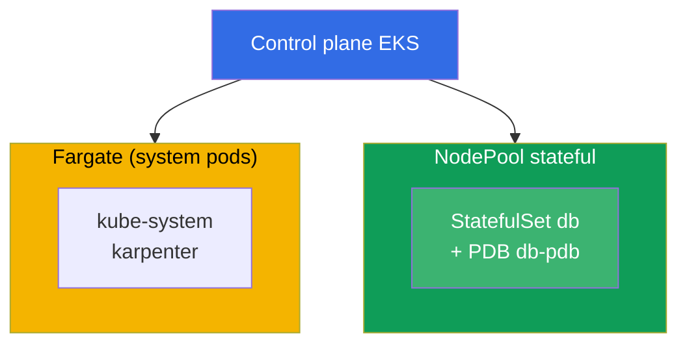
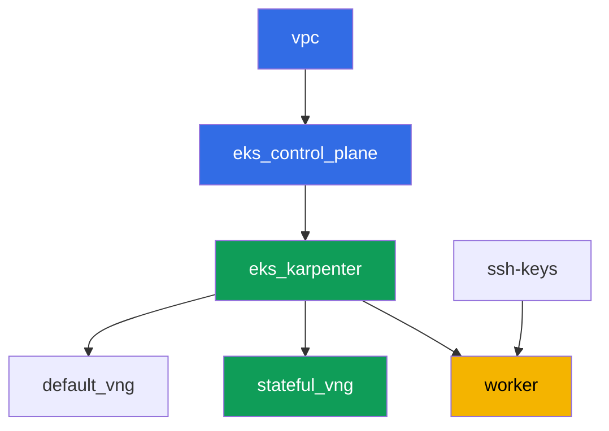

[Русская версия](README_RU.MD) · [Versión en español](README_ES.MD) · [Version française](README_FR.MD) · [Deutsche Version](README_DE.MD) · [ქართული ვერსია](README_GE.MD) · [繁體中文版](README_TW.MD) · [日本語版](README_JP.MD)

# Lab 123 - Karpenter: NodePool, consolidation, drift and safe StatefulSet eviction

## Description

We work through operating Karpenter at a hands-on level: how to read `NodePool` and
`EC2NodeClass`, what actually blocks voluntary eviction during consolidation, and why a
StatefulSet without proper protection risks its quorum. The key point of this lab is to
see the symptom with your own eyes: we force consolidation of several nodes at once,
observe the blocked eviction in Karpenter's logs and in `kubectl describe node`, and then
build the correct protection out of three parts - a PDB, a disruption budget, and a
targeted `do-not-disrupt`.

Tasks are written in a production style: a short statement plus acceptance criteria.
Checking is automatic, via the `check_result` command.

## Goal

Reinforce the material from this course chapter:

- [Chapter 12. Karpenter: NodePool, EC2NodeClass, disruption, consolidation, drift](../../course/12/ru.md) -
  how to safely evict a StatefulSet during consolidation

## What we're creating

The cluster is already deployed as code (the same base as in lab 101), and on top of it a
second NodePool `stateful` has been added, on-demand only, with a taint. You deploy a
StatefulSet onto this pool, protect it with a PDB, observe the eviction getting blocked,
and fix the configuration in a targeted way.

| Object | What it is | Why it's in this lab |
|--------|---------|-------------------|
| NodePool `stateful` | a second Karpenter NodePool, `on-demand` only, taint `dedicated=stateful` | a stable pool for the StatefulSet, with no spot interruptions |
| Namespace `eks-123` | a cluster section for the lab's workload | keeps resources separate from system ones |
| Artifact `inventory.txt` | a snapshot of `nodepools`, `ec2nodeclasses`, `nodeclaims` | inventory: both `default` and `stateful` are visible (chapter 12.11) |
| StatefulSet `db` (3 replicas) | the ping_pong application with a toleration for the `stateful` pool | the workload that consolidation can affect |
| PodDisruptionBudget `db-pdb` | `maxUnavailable: 1` on StatefulSet `db` | the main brake on eviction (chapter 12.6) |
| Artifact `consolidation.txt` | the blocking symptom in node events | we observe `DisruptionBlocked` and `Pdb prevents pod evictions` |
| Annotation `do-not-disrupt` on `db-0` + `fix.txt` | targeted protection for a single replica | the correct combination of PDB plus a budget plus a targeted `do-not-disrupt` (chapters 12.7-12.8) |

The resulting cluster picture:



## Infrastructure

The environment is deployed in AWS (`eu-central-1`) via Terragrunt. Each lab directory is
one component with its own `terragrunt.hcl`, which references a shared module in
`terraform/modules/` and declares dependencies through `dependency` blocks. Terragrunt
builds a dependency graph and applies the components in the right order.

### Modules and dependencies

| Directory (component) | Module (`terraform/modules/`) | Depends on | What it creates |
|---------------------|-------------------------------|------------|-------------|
| `vpc` | `vpc_v3` | - | VPC `10.10.0.0/16`, public and private subnets in two AZs, NAT |
| `ssh-keys` | `ssh-keys` | - | an SSH key pair for the worker machine and nodes |
| `eks_control_plane` | `eks_v2_control_plane` | `vpc` | EKS control plane `1.36`, OIDC, security groups |
| `eks_fargate_system` | `eks_v2_fargate` | `vpc`, `eks_control_plane` | Fargate profile for `kube-system` and `karpenter` |
| `eks_addons` | `eks_v2_addons` | `eks_control_plane`, `eks_fargate_system` | coredns, kube-proxy, vpc-cni, pod-identity add-ons |
| `eks_karpenter` | `eks_v2_karpenter` | `vpc`, `eks_control_plane`, `eks_addons`, `eks_fargate_system` | Karpenter controller, node IAM role |
| `eks_karpenter_default_vng` | `eks_v2_karpenter_vng` | `vpc`, `eks_control_plane`, `eks_karpenter` | default NodePool `default` (spot and on-demand) |
| `eks_karpenter_stateful_vng` | `eks_v2_karpenter_vng` | `vpc`, `eks_control_plane`, `eks_karpenter` | NodePool `stateful`: on-demand only, taint |
| `worker` | `eks_v2_work_pc` | `ssh-keys`, `vpc`, `eks_control_plane`, `eks_karpenter` | worker machine with kubectl, tests, and `check_result` |

Dependency graph (what gets applied earlier is lower down the arrow):



The components `eks_fargate_system` and `eks_addons` are not shown on the graph to keep it
under 8 nodes, but they actually sit between `eks_control_plane` and `eks_karpenter` (see
the table above).

### NodePool `stateful` settings

Key `requirements` in `eks_karpenter_stateful_vng/terragrunt.hcl`:

| Requirement | Value | Why |
|-------------|----------|-------|
| `karpenter.sh/capacity-type` | `In ["on-demand"]` | on-demand only - stability matters more than cost savings for a StatefulSet with its own volume |
| `karpenter.k8s.aws/instance-category` | `In ["m", "r"]` | instances suited for the database's memory |
| `karpenter.k8s.aws/instance-generation` | `Gt ["2"]` | don't pick outdated generations |
| `karpenter.k8s.aws/instance-size` | `In ["medium", "large", "xlarge"]` | a reasonable size range |
| taint | `dedicated=stateful:NoSchedule` | only pods with a toleration land on the pool |
| `disruption.consolidationPolicy` | `WhenEmptyOrUnderutilized`, `consolidateAfter: 30s` | a short timer for a quick demonstration in the lab |
| `budgets` | `nodes: 50%` | a high percentage, so it's easy to trigger an attempt to consolidate several nodes at once |

The other parameters (region, network, versions, prefixes) are read from `env.hcl`, as in
lab 101; there's no need to change that logic.

## Deployment

```bash
TASK=123 make run_eks_task
```

Deployment takes roughly 15-20 minutes. In the output, find the line with the SSH connection
to the worker machine and connect to it. kubectl there is already configured for the right
cluster.

Useful commands on the worker machine:

```bash
time_left       # how much environment time is left
check_result    # check the solution
```

> Environment security. `env.hcl` has `ssh_password_enable = true` and
> `access_cidrs = ["0.0.0.0/0"]` enabled - convenient for a training environment, but this
> is not something to do in production. Per the course standards (chapters 0.2, 2, 19),
> access to worker machines should go through AWS SSM Session Manager without exposing
> public SSH ports, and `access_cidrs` should be narrowed down to specific addresses. Here
> public SSH is left in place only to keep the setup simple.

## Tasks

---
|        **1**        | **Namespace for the lab's workload**                             |
| :-----------------: | :---------------------------------------------------------- |
| What to do          | Create a namespace named `eks-123`. All objects in this lab are created inside it. |
| Acceptance criteria    | - namespace `eks-123` exists. |
---
|        **2**        | **Inventory of NodePool, EC2NodeClass, NodeClaim**         |
| :-----------------: | :---------------------------------------------------------- |
| What to do          | Save the output of `kubectl get nodepools -o wide`, `kubectl get ec2nodeclasses` and `kubectl get nodeclaims` to the file `/var/work/tests/artifacts/2/inventory.txt`. Make sure the file shows both the default NodePool `default` and the new pool `stateful`. |
| Acceptance criteria    | - the file `inventory.txt` is not empty;<br/>- it contains the lines `default` and `stateful`. |
---
|        **3**        | **StatefulSet `db` on the `stateful` pool**                      |
| :-----------------: | :---------------------------------------------------------- |
| What to do          | In the `eks-123` namespace, create StatefulSet `db`, image `viktoruj/ping_pong:latest`, `3` replicas. NodePool `stateful` is closed off by the taint `dedicated=stateful:NoSchedule`, so add a matching toleration to the pod. Wait until all `3` replicas are `Running` and sit on nodes of the `stateful` pool (`kubectl get po -n eks-123 -l app=db -o wide`, node label `work_type=stateful`). |
| Acceptance criteria    | - StatefulSet `db` in `eks-123`, image `viktoruj/ping_pong`, `3` ready replicas;<br/>- a toleration for `dedicated=stateful:NoSchedule`;<br/>- all `db` pods on nodes with `work_type=stateful`. |
---
|        **4**        | **PodDisruptionBudget on StatefulSet `db`**                 |
| :-----------------: | :---------------------------------------------------------- |
| What to do          | Create a `PodDisruptionBudget` named `db-pdb` in the `eks-123` namespace: `maxUnavailable: 1`, selector on label `app: db`. This is the main brake on voluntary eviction (chapter 12.6). |
| Acceptance criteria    | - object `db-pdb` exists in `eks-123`;<br/>- `spec.maxUnavailable` equals `1`;<br/>- the selector points to `app: db`. |
---
|        **5**        | **Symptom: a PDB with no eviction rights blocks consolidation** |
| :-----------------: | :---------------------------------------------------------- |
| What to do          | The nodes of the `stateful` pool are underutilized (`3` replicas at `250m` each on two nodes), so Karpenter keeps trying to consolidate them. Tighten the protection to a full lockdown: switch `db-pdb` to `minAvailable: 3` with `3` replicas, so that in `kubectl get pdb db-pdb -n eks-123` the `ALLOWED DISRUPTIONS` column becomes `0`. After 1-2 minutes, find the blocking event on the pool's nodes: `kubectl describe node <node> \| grep -A2 DisruptionBlocked` - Karpenter writes `Pdb prevents pod evictions (PodDisruptionBudget=[eks-123/db-pdb])`. Look at the controller's logs in the `karpenter` namespace: `kubectl logs -n karpenter -l app.kubernetes.io/name=karpenter --tail=500`. Save the observation (the `get pdb` output plus the event) to the file `/var/work/tests/artifacts/5/consolidation.txt`. After that, return `db-pdb` to `maxUnavailable: 1` - `ALLOWED DISRUPTIONS` becomes `1` again, and consolidation is unblocked. That's the lesson: as long as the PDB allows zero evictions, voluntary disruptions are stalled forever, while `maxUnavailable: 1` lets a node be drained one replica at a time. |
| Acceptance criteria    | - the file `/var/work/tests/artifacts/5/consolidation.txt` is not empty;<br/>- it contains the word `pdb` and the text `prevents pod evict` (or `Unconsolidatable`);<br/>- after the task, `db-pdb` is back to `maxUnavailable: 1` (otherwise task 4 won't pass). |
---
|        **6**        | **Fix: a targeted `do-not-disrupt` instead of a full lockdown** |
| :-----------------: | :---------------------------------------------------------- |
| What to do          | Put the annotation `karpenter.sh/do-not-disrupt=true` on only one StatefulSet pod, for example `kubectl annotate pod db-0 -n eks-123 karpenter.sh/do-not-disrupt=true`. Do NOT put it on `db-1` and `db-2`. Save an explanation to `/var/work/tests/artifacts/6/fix.txt`: why the correct protection for a StatefulSet during consolidation is the combination of a PDB (task 4) plus the `stateful` pool's disruption budget (`nodes: 50%`) plus a targeted `do-not-disrupt`, rather than a blanket protection with no distinction - otherwise it blocks not only consolidation but also drift (chapter 12.8). The text must contain the words `pdb`, `do-not-disrupt` and `budget`. |
| Acceptance criteria    | - the annotation `karpenter.sh/do-not-disrupt=true` is present only on pod `db-0`, `db-1` and `db-2` don't have it;<br/>- the file `/var/work/tests/artifacts/6/fix.txt` is not empty and contains `pdb`, `do-not-disrupt`, `budget`. |
---

## Checking the result

On the worker machine, run the automatic check:

```bash
check_result
```

The script will run the tests and show the percentage of completed tasks.

## Solution

Reference solution: [worker/files/solutions/1.MD](worker/files/solutions/1.MD)

## Deleting the cluster and resources

> **First remove the protection and the workload, then tear down the stand.** This is the
> exact same trap that the lab studies, just from the other side: the annotation
> `karpenter.sh/do-not-disrupt` on `db-0` forbids Karpenter from evicting that pod, so when
> deleting the NodeClaim the termination controller waits forever, the node doesn't go
> away, and its `EC2NodeClass` is held by a finalizer. In the `destroy` log it looks like
> this: `kubernetes_manifest.ec2nodeclass: Still destroying...
> [09m30s elapsed]` (caught live). The second brake is the PDB: as soon as one replica goes
> into `Pending` (its node is already gone, and the pool is already being deleted),
> `ALLOWED DISRUPTIONS` becomes `0`, and draining the remaining nodes also stalls. This lab
> doesn't create any AWS resources by hand, everything else is Kubernetes objects.

```bash
# 1. Remove the PDB - it blocks draining if even one replica isn't Ready
kubectl delete pdb db-pdb -n eks-123 --ignore-not-found

# 2. Remove the workload along with the do-not-disrupt annotation (it lives on the pod)
kubectl delete namespace eks-123 --ignore-not-found

# 3. Wait until Karpenter removes the NodeClaim and the EC2 nodes (only fargate-* should remain)
while kubectl get nodeclaims --no-headers 2>/dev/null | grep -q .; do
  echo "NodeClaim still alive, waiting..."; sleep 15
done
kubectl get nodes | grep -v fargate
```

```bash
TASK=123 make delete_eks_task
```

If `destroy` is already running and stuck on `kubernetes_manifest.ec2nodeclass`, there's no
need to interrupt it - you can unblock it from another terminal. By this point the worker
machine has most likely already been deleted, so the kubeconfig has to be rebuilt from the
admin machine:

```bash
aws eks update-kubeconfig --region eu-central-1 --name <cluster-name> --kubeconfig /tmp/kc
export KUBECONFIG=/tmp/kc

# what's actually holding up the deletion: the pod with do-not-disrupt and a PDB with no eviction rights
kubectl get po -A -o json | jq -r '.items[]
  | select(.metadata.annotations["karpenter.sh/do-not-disrupt"]=="true")
  | "\(.metadata.namespace)/\(.metadata.name)"'
kubectl get pdb -A

kubectl delete pdb db-pdb -n eks-123 --ignore-not-found
kubectl delete namespace eks-123 --ignore-not-found
```

As soon as the NodeClaim disappears, the finalizer on the `EC2NodeClass` is released and
`terragrunt` finishes on its own. Verified on a live stand: after removing the PDB and the
namespace, both nodes of the pool went away in roughly a minute.

If the nodes died along with the cluster instead of leaving cleanly through Karpenter, a
secondary ENI from VPC CNI will be left behind: it holds the node security group, and
`destroy` will get stuck on that instead
(`module.eks.aws_security_group.node[0]: Still destroying...`). Verified on this lab - one
such ENI was left after an emergency drain. Find and delete it:

```bash
aws ec2 describe-network-interfaces --filters Name=status,Values=available \
  --query 'NetworkInterfaces[?Tags[?Key==`eks:eni:owner`]].[NetworkInterfaceId,Description,Groups[0].GroupName]' \
  --output table
aws ec2 delete-network-interface --network-interface-id <eni-id>
```
