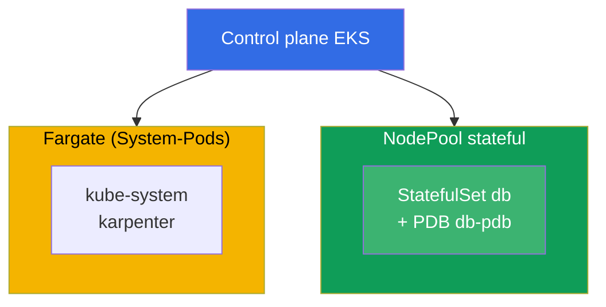
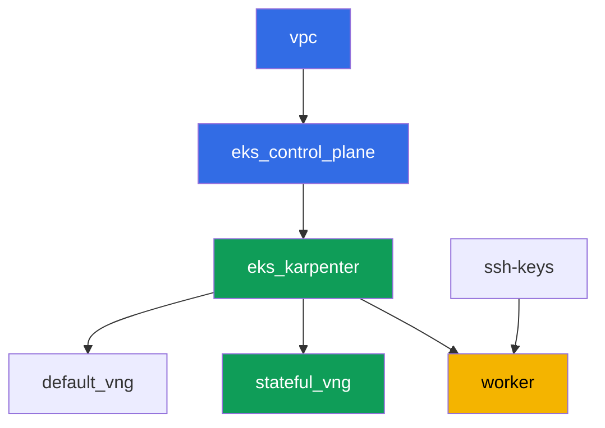

[Русская версия](README_RU.MD) · [Eng version](README.MD) · [Versión en español](README_ES.MD) · [Version française](README_FR.MD) · [ქართული ვერსია](README_GE.MD) · [繁體中文版](README_TW.MD) · [日本語版](README_JP.MD)

# Lab 123 - Karpenter: NodePool, consolidation, drift und sichere StatefulSet-Eviction

## Beschreibung

Wir arbeiten den Betrieb von Karpenter auf konkreter Ebene durch: wie man `NodePool` und
`EC2NodeClass` liest, was die freiwillige Eviction bei der Consolidation wirklich bremst,
und warum ein StatefulSet ohne den richtigen Schutz sein Quorum riskiert. Der zentrale
Punkt dieser Lab ist es, das Symptom mit eigenen Augen zu sehen: Wir erzwingen die
Consolidation mehrerer Nodes gleichzeitig, beobachten in den Logs von Karpenter und in
`kubectl describe node` die blockierte Eviction, und bauen dann den richtigen Schutz aus
drei Teilen - einem PDB, einem disruption budget und einem gezielten `do-not-disrupt`.

Die Aufgaben sind im Produktionsstil geschrieben: eine kurze Aufgabenstellung plus
Abnahmekriterien. Die Prüfung ist automatisch, über den Befehl `check_result`.

## Ziel

Das Kapitel des Kurses vertiefen:

- [Kapitel 12. Karpenter: NodePool, EC2NodeClass, disruption, consolidation, drift](../../course/12/ru.md) -
  wie man ein StatefulSet bei der Consolidation sicher evictet

## Was wir erstellen

Der Cluster ist bereits als Code deployt (dieselbe Basis wie in Lab 101), und darauf
aufbauend wurde ein zweiter NodePool `stateful` hinzugefügt, nur `on-demand`, mit einem
Taint. Sie deployen ein StatefulSet auf diesem Pool, schützen es mit einem PDB, beobachten
die blockierte Eviction und reparieren die Konfiguration gezielt.

| Objekt | Was es ist | Warum es in dieser Lab ist |
|--------|---------|-------------------|
| NodePool `stateful` | ein zweiter Karpenter-NodePool, nur `on-demand`, Taint `dedicated=stateful` | ein stabiler Pool für das StatefulSet, ohne Spot-Unterbrechungen |
| Namespace `eks-123` | ein Cluster-Bereich für die Workload der Lab | hält die Objekte der Lab von den System-Objekten getrennt |
| Artefakt `inventory.txt` | ein Snapshot von `nodepools`, `ec2nodeclasses`, `nodeclaims` | Inventar: sowohl `default` als auch `stateful` sind sichtbar (Kapitel 12.11) |
| StatefulSet `db` (3 Replicas) | die ping_pong-Anwendung mit einer Toleration für den Pool `stateful` | die Workload, die die Consolidation betreffen kann |
| PodDisruptionBudget `db-pdb` | `maxUnavailable: 1` auf StatefulSet `db` | die wichtigste Bremse für die Eviction (Kapitel 12.6) |
| Artefakt `consolidation.txt` | das Blockierungssymptom in den Node-Events | wir beobachten `DisruptionBlocked` und `Pdb prevents pod evictions` |
| Annotation `do-not-disrupt` auf `db-0` + `fix.txt` | gezielter Schutz einer einzelnen Replica | die richtige Kombination aus PDB plus Budget plus gezieltem `do-not-disrupt` (Kapitel 12.7-12.8) |

Das resultierende Cluster-Bild:



## Infrastruktur

Die Umgebung wird in AWS (`eu-central-1`) über Terragrunt deployt. Jedes Lab-Verzeichnis
ist eine Komponente mit eigener `terragrunt.hcl`, die auf ein gemeinsames Modul in
`terraform/modules/` verweist und Abhängigkeiten über `dependency`-Blöcke deklariert.
Terragrunt baut einen Abhängigkeitsgraphen und wendet die Komponenten in der richtigen
Reihenfolge an.

### Module und Abhängigkeiten

| Verzeichnis (Komponente) | Modul (`terraform/modules/`) | Abhängig von | Was es erstellt |
|---------------------|-------------------------------|------------|-------------|
| `vpc` | `vpc_v3` | - | VPC `10.10.0.0/16`, öffentliche und private Subnets in zwei AZs, NAT |
| `ssh-keys` | `ssh-keys` | - | ein SSH-Schlüsselpaar für die Worker-Maschine und die Nodes |
| `eks_control_plane` | `eks_v2_control_plane` | `vpc` | EKS control plane `1.36`, OIDC, security groups |
| `eks_fargate_system` | `eks_v2_fargate` | `vpc`, `eks_control_plane` | Fargate-Profil für `kube-system` und `karpenter` |
| `eks_addons` | `eks_v2_addons` | `eks_control_plane`, `eks_fargate_system` | Addons coredns, kube-proxy, vpc-cni, pod-identity |
| `eks_karpenter` | `eks_v2_karpenter` | `vpc`, `eks_control_plane`, `eks_addons`, `eks_fargate_system` | Karpenter-Controller, IAM-Rolle der Nodes |
| `eks_karpenter_default_vng` | `eks_v2_karpenter_vng` | `vpc`, `eks_control_plane`, `eks_karpenter` | Standard-NodePool `default` (spot und on-demand) |
| `eks_karpenter_stateful_vng` | `eks_v2_karpenter_vng` | `vpc`, `eks_control_plane`, `eks_karpenter` | NodePool `stateful`: nur on-demand, Taint |
| `worker` | `eks_v2_work_pc` | `ssh-keys`, `vpc`, `eks_control_plane`, `eks_karpenter` | Worker-Maschine mit kubectl, Tests und `check_result` |

Abhängigkeitsgraph (früher angewendet bedeutet weiter unten im Pfeil):



Die Komponenten `eks_fargate_system` und `eks_addons` werden im Graphen nicht dargestellt,
um ihn unter 8 Knoten zu halten, aber sie stehen tatsächlich zwischen `eks_control_plane`
und `eks_karpenter` (siehe Tabelle oben).

### Einstellungen des NodePool `stateful`

Wichtige `requirements` in `eks_karpenter_stateful_vng/terragrunt.hcl`:

| Requirement | Wert | Warum |
|-------------|----------|-------|
| `karpenter.sh/capacity-type` | `In ["on-demand"]` | nur on-demand - Stabilität ist wichtiger als Einsparung für ein StatefulSet mit eigenem Volume |
| `karpenter.k8s.aws/instance-category` | `In ["m", "r"]` | Instanzen passend für den Speicherbedarf der Datenbank |
| `karpenter.k8s.aws/instance-generation` | `Gt ["2"]` | keine veralteten Generationen wählen |
| `karpenter.k8s.aws/instance-size` | `In ["medium", "large", "xlarge"]` | ein sinnvoller Größenbereich |
| Taint | `dedicated=stateful:NoSchedule` | nur Pods mit Toleration landen auf dem Pool |
| `disruption.consolidationPolicy` | `WhenEmptyOrUnderutilized`, `consolidateAfter: 30s` | ein kurzer Timer für eine schnelle Demonstration in der Lab |
| `budgets` | `nodes: 50%` | ein hoher Prozentsatz, um leicht einen Versuch auszulösen, mehrere Nodes gleichzeitig zu konsolidieren |

Die übrigen Parameter (Region, Netzwerk, Versionen, Präfixe) werden aus `env.hcl`
gelesen, wie in Lab 101; diese Logik muss nicht geändert werden.

## Deployment

```bash
TASK=123 make run_eks_task
```

Das Deployment dauert etwa 15-20 Minuten. Finden Sie in der Ausgabe die Zeile mit der
SSH-Verbindung zur Worker-Maschine und verbinden Sie sich damit. kubectl ist dort bereits
für den richtigen Cluster konfiguriert.

Nützliche Befehle auf der Worker-Maschine:

```bash
time_left       # wie viel Zeit in der Umgebung übrig ist
check_result    # die Lösung prüfen
```

> Sicherheit der Umgebung. In `env.hcl` sind `ssh_password_enable = true` und
> `access_cidrs = ["0.0.0.0/0"]` aktiviert - praktisch für eine Lernumgebung, aber so
> etwas gehört nicht in die Produktion. Nach den Standards des Kurses (Kapitel 0.2, 2, 19)
> sollte der Zugriff auf Worker-Maschinen über AWS SSM Session Manager erfolgen, ohne
> öffentliche SSH-Ports offenzulegen, und `access_cidrs` sollte auf bestimmte Adressen
> eingeschränkt werden. Hier bleibt öffentliches SSH nur bestehen, um das Setup einfach
> zu halten.

## Aufgaben

---
|        **1**        | **Namespace für die Workload der Lab**                             |
| :-----------------: | :---------------------------------------------------------- |
| Was zu tun ist          | Erstellen Sie einen Namespace mit dem Namen `eks-123`. Alle Objekte dieser Lab werden darin erstellt. |
| Abnahmekriterien    | - Namespace `eks-123` existiert. |
---
|        **2**        | **Inventar von NodePool, EC2NodeClass, NodeClaim**         |
| :-----------------: | :---------------------------------------------------------- |
| Was zu tun ist          | Speichern Sie die Ausgabe von `kubectl get nodepools -o wide`, `kubectl get ec2nodeclasses` und `kubectl get nodeclaims` in der Datei `/var/work/tests/artifacts/2/inventory.txt`. Stellen Sie sicher, dass die Datei sowohl den Standard-NodePool `default` als auch den neuen Pool `stateful` zeigt. |
| Abnahmekriterien    | - die Datei `inventory.txt` ist nicht leer;<br/>- sie enthält die Zeilen `default` und `stateful`. |
---
|        **3**        | **StatefulSet `db` auf dem Pool `stateful`**                      |
| :-----------------: | :---------------------------------------------------------- |
| Was zu tun ist          | Erstellen Sie im Namespace `eks-123` StatefulSet `db`, Image `viktoruj/ping_pong:latest`, `3` Replicas. NodePool `stateful` ist durch den Taint `dedicated=stateful:NoSchedule` verschlossen, fügen Sie also eine passende Toleration zum Pod hinzu. Warten Sie, bis alle `3` Replicas `Running` sind und sich auf Nodes des Pools `stateful` befinden (`kubectl get po -n eks-123 -l app=db -o wide`, Node-Label `work_type=stateful`). |
| Abnahmekriterien    | - StatefulSet `db` in `eks-123`, Image `viktoruj/ping_pong`, `3` ready Replicas;<br/>- eine Toleration für `dedicated=stateful:NoSchedule`;<br/>- alle `db`-Pods auf Nodes mit `work_type=stateful`. |
---
|        **4**        | **PodDisruptionBudget auf StatefulSet `db`**                 |
| :-----------------: | :---------------------------------------------------------- |
| Was zu tun ist          | Erstellen Sie ein `PodDisruptionBudget` mit dem Namen `db-pdb` im Namespace `eks-123`: `maxUnavailable: 1`, Selector auf Label `app: db`. Das ist die wichtigste Bremse für die freiwillige Eviction (Kapitel 12.6). |
| Abnahmekriterien    | - Objekt `db-pdb` existiert in `eks-123`;<br/>- `spec.maxUnavailable` ist gleich `1`;<br/>- der Selector zeigt auf `app: db`. |
---
|        **5**        | **Symptom: ein PDB ohne Eviction-Recht blockiert die Consolidation** |
| :-----------------: | :---------------------------------------------------------- |
| Was zu tun ist          | Die Nodes des Pools `stateful` sind unterausgelastet (`3` Replicas mit je `250m` auf zwei Nodes), deshalb versucht Karpenter ständig, sie zu konsolidieren. Verschärfen Sie den Schutz zu einer vollständigen Sperre: Setzen Sie `db-pdb` auf `minAvailable: 3` bei `3` Replicas, sodass in `kubectl get pdb db-pdb -n eks-123` die Spalte `ALLOWED DISRUPTIONS` zu `0` wird. Finden Sie nach 1-2 Minuten auf den Nodes des Pools das Blockierungs-Event: `kubectl describe node <node> \| grep -A2 DisruptionBlocked` - Karpenter schreibt `Pdb prevents pod evictions (PodDisruptionBudget=[eks-123/db-pdb])`. Sehen Sie sich die Logs des Controllers im Namespace `karpenter` an: `kubectl logs -n karpenter -l app.kubernetes.io/name=karpenter --tail=500`. Speichern Sie die Beobachtung (die `get pdb`-Ausgabe plus das Event) in der Datei `/var/work/tests/artifacts/5/consolidation.txt`. Setzen Sie danach `db-pdb` zurück auf `maxUnavailable: 1` - `ALLOWED DISRUPTIONS` wird wieder `1`, und die Consolidation wird entblockt. Das ist die Lektion: solange das PDB keine einzige Eviction erlaubt, bleiben freiwillige Disruptions für immer blockiert, während `maxUnavailable: 1` es erlaubt, einen Node Replica für Replica zu drainen. |
| Abnahmekriterien    | - die Datei `/var/work/tests/artifacts/5/consolidation.txt` ist nicht leer;<br/>- sie enthält das Wort `pdb` und den Text `prevents pod evict` (oder `Unconsolidatable`);<br/>- nach der Aufgabe ist `db-pdb` wieder auf `maxUnavailable: 1` (sonst wird Aufgabe 4 nicht bestehen). |
---
|        **6**        | **Fix: ein gezieltes `do-not-disrupt` statt einer vollständigen Sperre** |
| :-----------------: | :---------------------------------------------------------- |
| Was zu tun ist          | Setzen Sie die Annotation `karpenter.sh/do-not-disrupt=true` nur auf einen Pod des StatefulSets, zum Beispiel `kubectl annotate pod db-0 -n eks-123 karpenter.sh/do-not-disrupt=true`. Setzen Sie sie NICHT auf `db-1` und `db-2`. Speichern Sie in `/var/work/tests/artifacts/6/fix.txt` eine Erklärung: warum der richtige Schutz eines StatefulSets bei der Consolidation die Kombination aus einem PDB (Aufgabe 4) plus dem disruption budget des Pools `stateful` (`nodes: 50%`) plus einem gezielten `do-not-disrupt` ist, statt eines pauschalen Schutzes ohne Unterscheidung - sonst wird nicht nur die Consolidation blockiert, sondern auch der Drift (Kapitel 12.8). Der Text muss die Wörter `pdb`, `do-not-disrupt` und `budget` enthalten. |
| Abnahmekriterien    | - die Annotation `karpenter.sh/do-not-disrupt=true` ist nur auf Pod `db-0` vorhanden, `db-1` und `db-2` haben sie nicht;<br/>- die Datei `/var/work/tests/artifacts/6/fix.txt` ist nicht leer und enthält `pdb`, `do-not-disrupt`, `budget`. |
---

## Prüfung des Ergebnisses

Führen Sie auf der Worker-Maschine die automatische Prüfung aus:

```bash
check_result
```

Das Skript führt die Tests aus und zeigt den Prozentsatz der erledigten Aufgaben.

## Lösung

Referenzlösung: [worker/files/solutions/1_DE.MD](worker/files/solutions/1_DE.MD)

## Löschen des Clusters und der Ressourcen

> **Entfernen Sie zuerst den Schutz und die Workload, dann bauen Sie den Stand ab.** Das
> ist genau die gleiche Falle, die diese Lab untersucht, nur von der anderen Seite: die
> Annotation `karpenter.sh/do-not-disrupt` auf `db-0` verbietet Karpenter, diesen Pod zu
> evicten, deshalb wartet der Terminations-Controller beim Löschen des NodeClaim für immer,
> der Node geht nicht weg, und sein `EC2NodeClass` wird durch einen Finalizer festgehalten.
> Im `destroy`-Log sieht das so aus:
> `kubernetes_manifest.ec2nodeclass: Still destroying... [09m30s elapsed]` (live erfasst).
> Die zweite Bremse ist das PDB: sobald eine Replica in den Zustand `Pending` geht (ihr
> Node ist schon gelöscht, und der Pool wird schon gelöscht), wird `ALLOWED DISRUPTIONS`
> zu `0`, und das Draining der übrigen Nodes bleibt ebenfalls stehen. Diese Lab erstellt
> keine AWS-Ressourcen von Hand, alles andere sind Kubernetes-Objekte.

```bash
# 1. PDB entfernen - es blockiert das Draining, wenn auch nur eine Replica nicht Ready ist
kubectl delete pdb db-pdb -n eks-123 --ignore-not-found

# 2. Die Workload zusammen mit der do-not-disrupt-Annotation entfernen (sie lebt auf dem Pod)
kubectl delete namespace eks-123 --ignore-not-found

# 3. Warten, bis Karpenter das NodeClaim und die EC2-Nodes entfernt (nur fargate-* sollten übrig bleiben)
while kubectl get nodeclaims --no-headers 2>/dev/null | grep -q .; do
  echo "NodeClaim still alive, waiting..."; sleep 15
done
kubectl get nodes | grep -v fargate
```

```bash
TASK=123 make delete_eks_task
```

Wenn `destroy` bereits läuft und bei `kubernetes_manifest.ec2nodeclass` hängen bleibt,
müssen Sie es nicht unterbrechen - Sie können es von einem anderen Terminal aus entblocken.
Die Worker-Maschine ist zu diesem Zeitpunkt höchstwahrscheinlich schon gelöscht, deshalb
muss der kubeconfig von der Admin-Maschine neu zusammengebaut werden:

```bash
aws eks update-kubeconfig --region eu-central-1 --name <cluster-name> --kubeconfig /tmp/kc
export KUBECONFIG=/tmp/kc

# was die Löschung wirklich festhält: der Pod mit do-not-disrupt und ein PDB ohne Eviction-Recht
kubectl get po -A -o json | jq -r '.items[]
  | select(.metadata.annotations["karpenter.sh/do-not-disrupt"]=="true")
  | "\(.metadata.namespace)/\(.metadata.name)"'
kubectl get pdb -A

kubectl delete pdb db-pdb -n eks-123 --ignore-not-found
kubectl delete namespace eks-123 --ignore-not-found
```

Sobald das NodeClaim verschwindet, wird der Finalizer des `EC2NodeClass` gelöst und
`terragrunt` läuft von selbst zu Ende. Auf einem echten Stand verifiziert: nach dem
Entfernen des PDB und des Namespace waren beide Nodes des Pools nach etwa einer Minute weg.

Wenn die Nodes zusammen mit dem Cluster gestorben sind, statt korrekt über Karpenter zu
gehen, bleibt ein sekundäres ENI von VPC CNI zurück: es hält die Node-Security-Group fest,
und `destroy` bleibt statt dessen daran hängen
(`module.eks.aws_security_group.node[0]: Still destroying...`). Auf dieser Lab verifiziert
- nach einem Notfall-Drain blieb ein solches ENI zurück. Finden und löschen Sie es:

```bash
aws ec2 describe-network-interfaces --filters Name=status,Values=available \
  --query 'NetworkInterfaces[?Tags[?Key==`eks:eni:owner`]].[NetworkInterfaceId,Description,Groups[0].GroupName]' \
  --output table
aws ec2 delete-network-interface --network-interface-id <eni-id>
```
