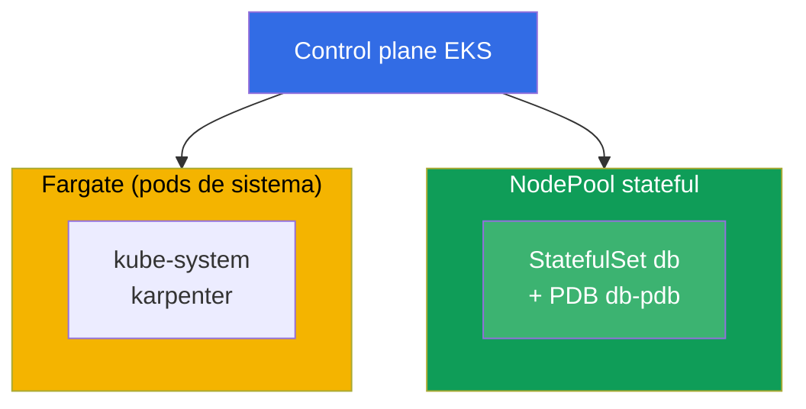
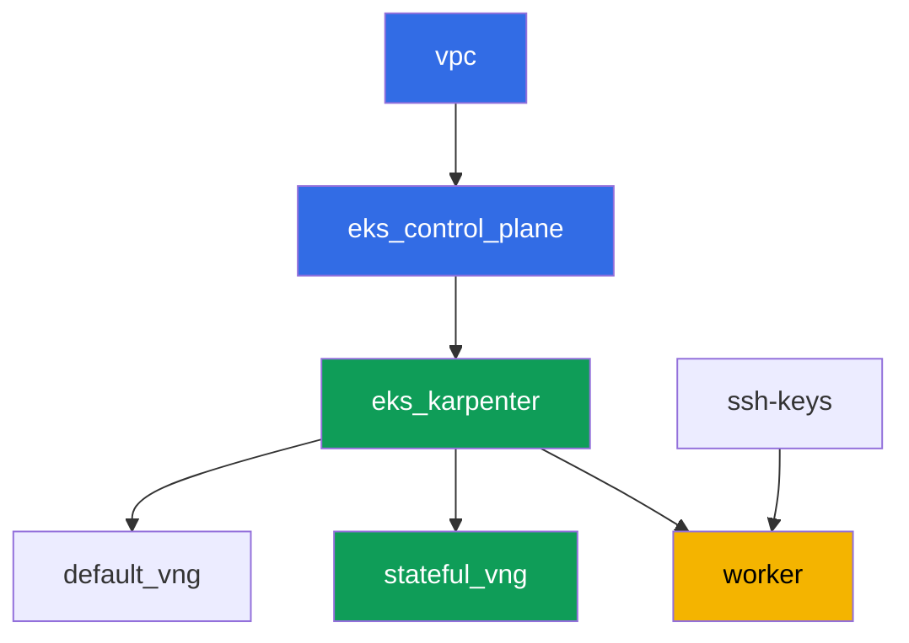

[Русская версия](README_RU.MD) · [Eng version](README.MD) · [Version française](README_FR.MD) · [Deutsche Version](README_DE.MD) · [ქართული ვერსია](README_GE.MD) · [繁體中文版](README_TW.MD) · [日本語版](README_JP.MD)

# Lab 123 - Karpenter: NodePool, consolidation, drift y desalojo seguro de StatefulSet

## Descripción

Trabajamos la operación de Karpenter a nivel práctico: cómo leer `NodePool` y
`EC2NodeClass`, qué es lo que realmente frena el desalojo voluntario durante la
consolidación, y por qué un StatefulSet sin la protección adecuada arriesga su quorum. El
punto clave de esta lab es ver el síntoma con tus propios ojos: forzamos la consolidación
de varios nodes a la vez, observamos en los logs de Karpenter y en `kubectl describe node`
el desalojo bloqueado, y luego construimos la protección correcta a partir de tres partes -
un PDB, un disruption budget y un `do-not-disrupt` puntual.

Las tareas están escritas en estilo de producción: un enunciado breve más criterios de
aceptación. La verificación es automática, mediante el comando `check_result`.

## Objetivo

Reforzar el material de este capítulo del curso:

- [Capítulo 12. Karpenter: NodePool, EC2NodeClass, disruption, consolidation, drift](../../course/12/ru.md) -
  cómo desalojar de forma segura un StatefulSet durante la consolidación

## Qué creamos

El cluster ya está desplegado como código (la misma base que en la lab 101), y sobre él se
ha añadido un segundo NodePool `stateful`, solo `on-demand`, con un taint. Despliegas un
StatefulSet en este pool, lo proteges con un PDB, observas cómo se bloquea el desalojo y
arreglas la configuración de forma puntual.

| Objeto | Qué es | Por qué está en esta lab |
|--------|---------|-------------------|
| NodePool `stateful` | un segundo NodePool de Karpenter, solo `on-demand`, taint `dedicated=stateful` | un pool estable para el StatefulSet, sin interrupciones spot |
| Namespace `eks-123` | una sección del cluster para la carga de trabajo de la lab | mantiene los recursos separados de los del sistema |
| Artefacto `inventory.txt` | una instantánea de `nodepools`, `ec2nodeclasses`, `nodeclaims` | inventario: se ven tanto `default` como `stateful` (capítulo 12.11) |
| StatefulSet `db` (3 réplicas) | la aplicación ping_pong con una toleration para el pool `stateful` | la carga de trabajo que la consolidación puede afectar |
| PodDisruptionBudget `db-pdb` | `maxUnavailable: 1` en el StatefulSet `db` | el principal freno al desalojo (capítulo 12.6) |
| Artefacto `consolidation.txt` | el síntoma del bloqueo en los eventos del node | observamos `DisruptionBlocked` y `Pdb prevents pod evictions` |
| Anotación `do-not-disrupt` en `db-0` + `fix.txt` | protección puntual de una sola réplica | la combinación correcta de PDB más budget más `do-not-disrupt` puntual (capítulos 12.7-12.8) |

El diagrama resultante del cluster:



## Infraestructura

El entorno se despliega en AWS (`eu-central-1`) mediante Terragrunt. Cada directorio de la
lab es un componente con su propio `terragrunt.hcl`, que referencia un módulo compartido en
`terraform/modules/` y declara dependencias mediante bloques `dependency`. Terragrunt
construye un grafo de dependencias y aplica los componentes en el orden correcto.

### Módulos y dependencias

| Directorio (componente) | Módulo (`terraform/modules/`) | Depende de | Qué crea |
|---------------------|-------------------------------|------------|-------------|
| `vpc` | `vpc_v3` | - | VPC `10.10.0.0/16`, subredes públicas y privadas en dos AZ, NAT |
| `ssh-keys` | `ssh-keys` | - | un par de claves SSH para la máquina worker y los nodes |
| `eks_control_plane` | `eks_v2_control_plane` | `vpc` | control plane de EKS `1.36`, OIDC, security groups |
| `eks_fargate_system` | `eks_v2_fargate` | `vpc`, `eks_control_plane` | perfil Fargate para `kube-system` y `karpenter` |
| `eks_addons` | `eks_v2_addons` | `eks_control_plane`, `eks_fargate_system` | addons coredns, kube-proxy, vpc-cni, pod-identity |
| `eks_karpenter` | `eks_v2_karpenter` | `vpc`, `eks_control_plane`, `eks_addons`, `eks_fargate_system` | controller de Karpenter, rol IAM de los nodes |
| `eks_karpenter_default_vng` | `eks_v2_karpenter_vng` | `vpc`, `eks_control_plane`, `eks_karpenter` | NodePool por defecto `default` (spot y on-demand) |
| `eks_karpenter_stateful_vng` | `eks_v2_karpenter_vng` | `vpc`, `eks_control_plane`, `eks_karpenter` | NodePool `stateful`: solo on-demand, taint |
| `worker` | `eks_v2_work_pc` | `ssh-keys`, `vpc`, `eks_control_plane`, `eks_karpenter` | máquina worker con kubectl, tests y `check_result` |

Grafo de dependencias (lo que se aplica antes queda más abajo en la flecha):



Los componentes `eks_fargate_system` y `eks_addons` no se muestran en el grafo para
mantenerlo por debajo de 8 nodos, pero de hecho están entre `eks_control_plane` y
`eks_karpenter` (ver la tabla anterior).

### Configuración del NodePool `stateful`

`requirements` clave en `eks_karpenter_stateful_vng/terragrunt.hcl`:

| Requirement | Valor | Por qué |
|-------------|----------|-------|
| `karpenter.sh/capacity-type` | `In ["on-demand"]` | solo on-demand - la estabilidad importa más que el ahorro para un StatefulSet con su propio volumen |
| `karpenter.k8s.aws/instance-category` | `In ["m", "r"]` | instancias adecuadas para la memoria de la base de datos |
| `karpenter.k8s.aws/instance-generation` | `Gt ["2"]` | no elegir generaciones obsoletas |
| `karpenter.k8s.aws/instance-size` | `In ["medium", "large", "xlarge"]` | un rango de tamaños razonable |
| taint | `dedicated=stateful:NoSchedule` | solo los pods con toleration caen en el pool |
| `disruption.consolidationPolicy` | `WhenEmptyOrUnderutilized`, `consolidateAfter: 30s` | un timer corto para una demostración rápida en la lab |
| `budgets` | `nodes: 50%` | un porcentaje alto, para provocar fácilmente un intento de consolidar varios nodes a la vez |

Los demás parámetros (región, red, versiones, prefijos) se leen de `env.hcl`, igual que en
la lab 101; no es necesario cambiar esa lógica.

## Despliegue

```bash
TASK=123 make run_eks_task
```

El despliegue tarda aproximadamente 15-20 minutos. En la salida, busca la línea con la
conexión SSH a la máquina worker y conéctate a ella. kubectl ahí ya está configurado para
el cluster correcto.

Comandos útiles en la máquina worker:

```bash
time_left       # cuánto tiempo queda en el entorno
check_result    # verificar la solución
```

> Seguridad del entorno. `env.hcl` tiene habilitados `ssh_password_enable = true` y
> `access_cidrs = ["0.0.0.0/0"]` - conveniente para un entorno de entrenamiento, pero esto
> no debe hacerse en producción. Según los estándares del curso (capítulos 0.2, 2, 19), el
> acceso a las máquinas worker debe hacerse mediante AWS SSM Session Manager sin exponer
> puertos SSH públicos, y `access_cidrs` debe restringirse a direcciones específicas. Aquí
> el SSH público se deja solo por simplicidad de la configuración.

## Tareas

---
|        **1**        | **Namespace para la carga de trabajo de la lab**                             |
| :-----------------: | :---------------------------------------------------------- |
| Qué hacer          | Crea un namespace llamado `eks-123`. Todos los objetos de esta lab se crean dentro de él. |
| Criterios de aceptación    | - el namespace `eks-123` existe. |
---
|        **2**        | **Inventario de NodePool, EC2NodeClass, NodeClaim**         |
| :-----------------: | :---------------------------------------------------------- |
| Qué hacer          | Guarda la salida de `kubectl get nodepools -o wide`, `kubectl get ec2nodeclasses` y `kubectl get nodeclaims` en el archivo `/var/work/tests/artifacts/2/inventory.txt`. Asegúrate de que el archivo muestre tanto el NodePool por defecto `default` como el nuevo pool `stateful`. |
| Criterios de aceptación    | - el archivo `inventory.txt` no está vacío;<br/>- contiene las líneas `default` y `stateful`. |
---
|        **3**        | **StatefulSet `db` en el pool `stateful`**                      |
| :-----------------: | :---------------------------------------------------------- |
| Qué hacer          | En el namespace `eks-123`, crea el StatefulSet `db`, imagen `viktoruj/ping_pong:latest`, `3` réplicas. El NodePool `stateful` está cerrado con el taint `dedicated=stateful:NoSchedule`, así que añade una toleration correspondiente al pod. Espera hasta que las `3` réplicas estén `Running` y se encuentren en nodes del pool `stateful` (`kubectl get po -n eks-123 -l app=db -o wide`, label del node `work_type=stateful`). |
| Criterios de aceptación    | - StatefulSet `db` en `eks-123`, imagen `viktoruj/ping_pong`, `3` réplicas listas;<br/>- una toleration para `dedicated=stateful:NoSchedule`;<br/>- todos los pods `db` en nodes con `work_type=stateful`. |
---
|        **4**        | **PodDisruptionBudget en el StatefulSet `db`**                 |
| :-----------------: | :---------------------------------------------------------- |
| Qué hacer          | Crea un `PodDisruptionBudget` llamado `db-pdb` en el namespace `eks-123`: `maxUnavailable: 1`, selector por el label `app: db`. Este es el principal freno al desalojo voluntario (capítulo 12.6). |
| Criterios de aceptación    | - el objeto `db-pdb` existe en `eks-123`;<br/>- `spec.maxUnavailable` es igual a `1`;<br/>- el selector apunta a `app: db`. |
---
|        **5**        | **Síntoma: un PDB sin derecho a desalojo bloquea la consolidación** |
| :-----------------: | :---------------------------------------------------------- |
| Qué hacer          | Los nodes del pool `stateful` están infrautilizados (`3` réplicas de `250m` cada una en dos nodes), así que Karpenter intenta constantemente consolidarlos. Endurece la protección hasta un bloqueo total: cambia `db-pdb` a `minAvailable: 3` con `3` réplicas, de modo que en `kubectl get pdb db-pdb -n eks-123` la columna `ALLOWED DISRUPTIONS` se vuelva `0`. Después de 1-2 minutos, busca en los nodes del pool el evento de bloqueo: `kubectl describe node <node> \| grep -A2 DisruptionBlocked` - Karpenter escribe `Pdb prevents pod evictions (PodDisruptionBudget=[eks-123/db-pdb])`. Consulta los logs del controller en el namespace `karpenter`: `kubectl logs -n karpenter -l app.kubernetes.io/name=karpenter --tail=500`. Guarda la observación (la salida de `get pdb` más el evento) en el archivo `/var/work/tests/artifacts/5/consolidation.txt`. Después, devuelve `db-pdb` a `maxUnavailable: 1` - `ALLOWED DISRUPTIONS` vuelve a ser `1`, y la consolidación se desbloquea. Esa es la lección: mientras el PDB no permita ni un solo desalojo, las interrupciones voluntarias quedan detenidas para siempre, mientras que `maxUnavailable: 1` permite drenar el node una réplica a la vez. |
| Criterios de aceptación    | - el archivo `/var/work/tests/artifacts/5/consolidation.txt` no está vacío;<br/>- contiene la palabra `pdb` y el texto `prevents pod evict` (o `Unconsolidatable`);<br/>- después de la tarea, `db-pdb` vuelve a `maxUnavailable: 1` (si no, no pasará la tarea 4). |
---
|        **6**        | **Arreglo: un `do-not-disrupt` puntual en lugar de un bloqueo total** |
| :-----------------: | :---------------------------------------------------------- |
| Qué hacer          | Pon la anotación `karpenter.sh/do-not-disrupt=true` solo en un pod del StatefulSet, por ejemplo `kubectl annotate pod db-0 -n eks-123 karpenter.sh/do-not-disrupt=true`. NO la pongas en `db-1` ni en `db-2`. Guarda en `/var/work/tests/artifacts/6/fix.txt` una explicación de por qué la protección correcta de un StatefulSet durante la consolidación es la combinación de un PDB (tarea 4) más el disruption budget del pool `stateful` (`nodes: 50%`) más un `do-not-disrupt` puntual, en lugar de una protección total sin distinción - de otro modo se bloquea no solo la consolidation, sino también el drift (capítulo 12.8). El texto debe contener las palabras `pdb`, `do-not-disrupt` y `budget` (o `бюджет`). |
| Criterios de aceptación    | - la anotación `karpenter.sh/do-not-disrupt=true` está presente solo en el pod `db-0`, `db-1` y `db-2` no la tienen;<br/>- el archivo `/var/work/tests/artifacts/6/fix.txt` no está vacío y contiene `pdb`, `do-not-disrupt`, `budget`/`бюджет`. |
---

## Verificación del resultado

En la máquina worker, ejecuta la verificación automática:

```bash
check_result
```

El script ejecuta los tests y muestra el porcentaje de tareas completadas.

## Solución

Solución de referencia: [worker/files/solutions/1_ES.MD](worker/files/solutions/1_ES.MD)

## Eliminación del cluster y los recursos

> **Primero elimina la protección y la carga de trabajo, luego destruye el stand.** Esta es
> exactamente la misma trampa que estudia la lab, solo que desde el otro lado: la anotación
> `karpenter.sh/do-not-disrupt` en `db-0` le prohíbe a Karpenter desalojar ese pod, así que
> al eliminar el NodeClaim el controller de terminación espera para siempre, el node no se
> va, y su `EC2NodeClass` queda retenido por un finalizer. En el log de `destroy` se ve
> así: `kubernetes_manifest.ec2nodeclass: Still destroying...
> [09m30s elapsed]` (capturado en vivo). El segundo freno es el PDB: en cuanto una réplica
> pasa a `Pending` (su node ya fue eliminado, y el pool ya se está eliminando),
> `ALLOWED DISRUPTIONS` se vuelve `0`, y el drenaje del resto de los nodes también se
> detiene. Esta lab no crea ningún recurso de AWS a mano, todo lo demás son objetos de
> Kubernetes.

```bash
# 1. Elimina el PDB - bloquea el drenaje si al menos una réplica no está Ready
kubectl delete pdb db-pdb -n eks-123 --ignore-not-found

# 2. Elimina la carga de trabajo junto con la anotación do-not-disrupt (vive en el pod)
kubectl delete namespace eks-123 --ignore-not-found

# 3. Espera a que Karpenter elimine el NodeClaim y los nodes EC2 (solo deberían quedar fargate-*)
while kubectl get nodeclaims --no-headers 2>/dev/null | grep -q .; do
  echo "NodeClaim still alive, waiting..."; sleep 15
done
kubectl get nodes | grep -v fargate
```

```bash
TASK=123 make delete_eks_task
```

Si `destroy` ya está en marcha y atascado en `kubernetes_manifest.ec2nodeclass`, no es
necesario interrumpirlo - se puede desbloquear desde otra terminal. En este punto la
máquina worker probablemente ya fue eliminada, así que el kubeconfig hay que reconstruirlo
desde la máquina de administración:

```bash
aws eks update-kubeconfig --region eu-central-1 --name <cluster-name> --kubeconfig /tmp/kc
export KUBECONFIG=/tmp/kc

# qué es exactamente lo que retiene la eliminación: el pod con do-not-disrupt y un PDB sin derecho a desalojo
kubectl get po -A -o json | jq -r '.items[]
  | select(.metadata.annotations["karpenter.sh/do-not-disrupt"]=="true")
  | "\(.metadata.namespace)/\(.metadata.name)"'
kubectl get pdb -A

kubectl delete pdb db-pdb -n eks-123 --ignore-not-found
kubectl delete namespace eks-123 --ignore-not-found
```

En cuanto desaparece el NodeClaim, el finalizer del `EC2NodeClass` se libera y `terragrunt`
termina por sí solo. Verificado en un stand real: tras eliminar el PDB y el namespace,
ambos nodes del pool desaparecieron en aproximadamente un minuto.

Si los nodes murieron junto con el cluster en lugar de salir correctamente a través de
Karpenter, quedará un ENI secundario de VPC CNI: este retiene el security group de los
nodes, y `destroy` se atascará ahí en su lugar
(`module.eks.aws_security_group.node[0]: Still destroying...`). Verificado en esta lab -
tras un drenaje de emergencia quedó un ENI de este tipo. Encuéntralo y elimínalo:

```bash
aws ec2 describe-network-interfaces --filters Name=status,Values=available \
  --query 'NetworkInterfaces[?Tags[?Key==`eks:eni:owner`]].[NetworkInterfaceId,Description,Groups[0].GroupName]' \
  --output table
aws ec2 delete-network-interface --network-interface-id <eni-id>
```
