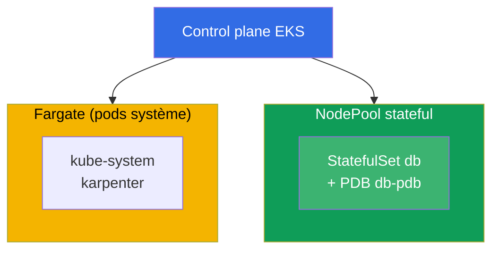
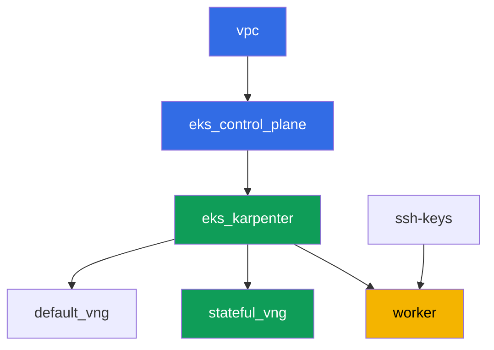

[Русская версия](README_RU.MD) · [Eng version](README.MD) · [Versión en español](README_ES.MD) · [Deutsche Version](README_DE.MD) · [ქართული ვერსია](README_GE.MD) · [繁體中文版](README_TW.MD) · [日本語版](README_JP.MD)

# Lab 123 - Karpenter : NodePool, consolidation, drift et éviction sécurisée d'un StatefulSet

## Description

Nous travaillons l'exploitation de Karpenter à un niveau concret : comment lire un
`NodePool` et un `EC2NodeClass`, ce qui freine réellement l'éviction volontaire pendant la
consolidation, et pourquoi un StatefulSet sans la bonne protection risque son quorum. Le
point clé de cette lab est de voir le symptôme de vos propres yeux : nous forçons la
consolidation de plusieurs nodes à la fois, nous observons dans les logs de Karpenter et
dans `kubectl describe node` l'éviction bloquée, puis nous construisons la protection
correcte en trois parties - un PDB, un disruption budget et un `do-not-disrupt` ciblé.

Les tâches sont écrites dans un style production : un énoncé court plus des critères
d'acceptation. La vérification est automatique, via la commande `check_result`.

## Objectif

Renforcer le chapitre du cours :

- [Chapitre 12. Karpenter : NodePool, EC2NodeClass, disruption, consolidation, drift](../../course/12/ru.md) -
  comment évincer un StatefulSet en toute sécurité pendant la consolidation

## Ce que nous créons

Le cluster est déjà déployé en code (la même base que dans la lab 101), et un second
NodePool `stateful` y a été ajouté, uniquement `on-demand`, avec un taint. Vous déployez un
StatefulSet sur ce pool, vous le protégez avec un PDB, vous observez l'éviction se
bloquer, et vous corrigez la configuration de façon ciblée.

| Objet | Ce que c'est | Pourquoi c'est dans cette lab |
|--------|---------|-------------------|
| NodePool `stateful` | un second NodePool Karpenter, `on-demand` uniquement, taint `dedicated=stateful` | un pool stable pour le StatefulSet, sans interruptions spot |
| Namespace `eks-123` | une section du cluster pour la charge de travail de la lab | garde les ressources séparées de celles du système |
| Artefact `inventory.txt` | un instantané de `nodepools`, `ec2nodeclasses`, `nodeclaims` | inventaire : on voit à la fois `default` et `stateful` (chapitre 12.11) |
| StatefulSet `db` (3 replicas) | l'application ping_pong avec une toleration pour le pool `stateful` | la charge de travail que la consolidation peut affecter |
| PodDisruptionBudget `db-pdb` | `maxUnavailable: 1` sur le StatefulSet `db` | le principal frein à l'éviction (chapitre 12.6) |
| Artefact `consolidation.txt` | le symptôme du blocage dans les événements du node | on observe `DisruptionBlocked` et `Pdb prevents pod evictions` |
| Annotation `do-not-disrupt` sur `db-0` + `fix.txt` | protection ciblée d'une seule replica | la combinaison correcte de PDB plus budget plus `do-not-disrupt` ciblé (chapitres 12.7-12.8) |

Le schéma résultant du cluster :



## Infrastructure

L'environnement est déployé dans AWS (`eu-central-1`) via Terragrunt. Chaque répertoire de
lab est un composant avec son propre `terragrunt.hcl`, qui référence un module partagé dans
`terraform/modules/` et déclare des dépendances via des blocs `dependency`. Terragrunt
construit un graphe de dépendances et applique les composants dans le bon ordre.

### Modules et dépendances

| Répertoire (composant) | Module (`terraform/modules/`) | Dépend de | Ce qu'il crée |
|---------------------|-------------------------------|------------|-------------|
| `vpc` | `vpc_v3` | - | VPC `10.10.0.0/16`, subnets publics et privés dans deux AZ, NAT |
| `ssh-keys` | `ssh-keys` | - | une paire de clés SSH pour la machine worker et les nodes |
| `eks_control_plane` | `eks_v2_control_plane` | `vpc` | control plane EKS `1.36`, OIDC, security groups |
| `eks_fargate_system` | `eks_v2_fargate` | `vpc`, `eks_control_plane` | profil Fargate pour `kube-system` et `karpenter` |
| `eks_addons` | `eks_v2_addons` | `eks_control_plane`, `eks_fargate_system` | addons coredns, kube-proxy, vpc-cni, pod-identity |
| `eks_karpenter` | `eks_v2_karpenter` | `vpc`, `eks_control_plane`, `eks_addons`, `eks_fargate_system` | contrôleur Karpenter, rôle IAM des nodes |
| `eks_karpenter_default_vng` | `eks_v2_karpenter_vng` | `vpc`, `eks_control_plane`, `eks_karpenter` | NodePool par défaut `default` (spot et on-demand) |
| `eks_karpenter_stateful_vng` | `eks_v2_karpenter_vng` | `vpc`, `eks_control_plane`, `eks_karpenter` | NodePool `stateful` : on-demand uniquement, taint |
| `worker` | `eks_v2_work_pc` | `ssh-keys`, `vpc`, `eks_control_plane`, `eks_karpenter` | machine worker avec kubectl, les tests et `check_result` |

Graphe de dépendances (ce qui est appliqué plus tôt est plus bas sur la flèche) :



Les composants `eks_fargate_system` et `eks_addons` ne sont pas montrés sur le graphe pour
le garder sous 8 nodes, mais ils se trouvent en fait entre `eks_control_plane` et
`eks_karpenter` (voir le tableau ci-dessus).

### Configuration du NodePool `stateful`

Les `requirements` clés dans `eks_karpenter_stateful_vng/terragrunt.hcl` :

| Requirement | Valeur | Pourquoi |
|-------------|----------|-------|
| `karpenter.sh/capacity-type` | `In ["on-demand"]` | on-demand uniquement - la stabilité importe plus que l'économie pour un StatefulSet avec son propre volume |
| `karpenter.k8s.aws/instance-category` | `In ["m", "r"]` | des instances adaptées à la mémoire de la base de données |
| `karpenter.k8s.aws/instance-generation` | `Gt ["2"]` | ne pas prendre de générations obsolètes |
| `karpenter.k8s.aws/instance-size` | `In ["medium", "large", "xlarge"]` | une plage de tailles raisonnable |
| taint | `dedicated=stateful:NoSchedule` | seuls les pods avec une toleration atterrissent sur le pool |
| `disruption.consolidationPolicy` | `WhenEmptyOrUnderutilized`, `consolidateAfter: 30s` | un timer court pour une démonstration rapide dans la lab |
| `budgets` | `nodes: 50%` | un pourcentage élevé, pour déclencher facilement une tentative de consolider plusieurs nodes à la fois |

Les autres paramètres (région, réseau, versions, préfixes) sont lus depuis `env.hcl`,
comme dans la lab 101 ; il n'est pas nécessaire de changer cette logique.

## Déploiement

```bash
TASK=123 make run_eks_task
```

Le déploiement prend environ 15-20 minutes. Dans la sortie, trouvez la ligne avec la
connexion SSH à la machine worker et connectez-vous. kubectl y est déjà configuré pour le
bon cluster.

Commandes utiles sur la machine worker :

```bash
time_left       # combien de temps il reste dans l'environnement
check_result    # vérifier la solution
```

> Sécurité de l'environnement. `env.hcl` a `ssh_password_enable = true` et
> `access_cidrs = ["0.0.0.0/0"]` activés - pratique pour un environnement de formation,
> mais ce n'est pas quelque chose à faire en production. Selon les standards du cours
> (chapitres 0.2, 2, 19), l'accès aux machines worker doit passer par AWS SSM Session
> Manager sans exposer de ports SSH publics, et `access_cidrs` doit être restreint à des
> adresses spécifiques. Ici le SSH public est laissé en place uniquement pour garder la
> configuration simple.

## Tâches

---
|        **1**        | **Namespace pour la charge de travail de la lab**                             |
| :-----------------: | :---------------------------------------------------------- |
| Que faire          | Créez un namespace nommé `eks-123`. Tous les objets de cette lab sont créés à l'intérieur. |
| Critères d'acceptation    | - le namespace `eks-123` existe. |
---
|        **2**        | **Inventaire de NodePool, EC2NodeClass, NodeClaim**         |
| :-----------------: | :---------------------------------------------------------- |
| Que faire          | Enregistrez la sortie de `kubectl get nodepools -o wide`, `kubectl get ec2nodeclasses` et `kubectl get nodeclaims` dans le fichier `/var/work/tests/artifacts/2/inventory.txt`. Assurez-vous que le fichier montre à la fois le NodePool par défaut `default` et le nouveau pool `stateful`. |
| Critères d'acceptation    | - le fichier `inventory.txt` n'est pas vide;<br/>- il contient les lignes `default` et `stateful`. |
---
|        **3**        | **StatefulSet `db` sur le pool `stateful`**                      |
| :-----------------: | :---------------------------------------------------------- |
| Que faire          | Dans le namespace `eks-123`, créez le StatefulSet `db`, image `viktoruj/ping_pong:latest`, `3` replicas. Le NodePool `stateful` est fermé par le taint `dedicated=stateful:NoSchedule`, ajoutez donc une toleration correspondante au pod. Attendez que les `3` replicas soient `Running` et se trouvent sur des nodes du pool `stateful` (`kubectl get po -n eks-123 -l app=db -o wide`, label de node `work_type=stateful`). |
| Critères d'acceptation    | - StatefulSet `db` dans `eks-123`, image `viktoruj/ping_pong`, `3` replicas prêtes;<br/>- une toleration pour `dedicated=stateful:NoSchedule`;<br/>- tous les pods `db` sur des nodes avec `work_type=stateful`. |
---
|        **4**        | **PodDisruptionBudget sur le StatefulSet `db`**                 |
| :-----------------: | :---------------------------------------------------------- |
| Que faire          | Créez un `PodDisruptionBudget` nommé `db-pdb` dans le namespace `eks-123` : `maxUnavailable: 1`, selector sur le label `app: db`. C'est le principal frein à l'éviction volontaire (chapitre 12.6). |
| Critères d'acceptation    | - l'objet `db-pdb` existe dans `eks-123`;<br/>- `spec.maxUnavailable` vaut `1`;<br/>- le selector cible `app: db`. |
---
|        **5**        | **Symptôme : un PDB sans droit d'éviction bloque la consolidation** |
| :-----------------: | :---------------------------------------------------------- |
| Que faire          | Les nodes du pool `stateful` sont sous-utilisés (`3` replicas de `250m` chacune sur deux nodes), donc Karpenter essaie constamment de les consolider. Renforcez la protection jusqu'à un verrouillage complet : passez `db-pdb` à `minAvailable: 3` avec `3` replicas, pour que dans `kubectl get pdb db-pdb -n eks-123` la colonne `ALLOWED DISRUPTIONS` devienne `0`. Après 1-2 minutes, trouvez sur les nodes du pool l'événement de blocage : `kubectl describe node <node> \| grep -A2 DisruptionBlocked` - Karpenter écrit `Pdb prevents pod evictions (PodDisruptionBudget=[eks-123/db-pdb])`. Consultez les logs du contrôleur dans le namespace `karpenter` : `kubectl logs -n karpenter -l app.kubernetes.io/name=karpenter --tail=500`. Enregistrez l'observation (la sortie de `get pdb` plus l'événement) dans le fichier `/var/work/tests/artifacts/5/consolidation.txt`. Ensuite, remettez `db-pdb` à `maxUnavailable: 1` - `ALLOWED DISRUPTIONS` redevient `1`, et la consolidation se débloque. C'est la leçon : tant que le PDB n'autorise aucune éviction, les disruptions volontaires restent bloquées pour toujours, tandis que `maxUnavailable: 1` permet de drainer un node une replica à la fois. |
| Critères d'acceptation    | - le fichier `/var/work/tests/artifacts/5/consolidation.txt` n'est pas vide;<br/>- il contient le mot `pdb` et le texte `prevents pod evict` (ou `Unconsolidatable`);<br/>- après la tâche, `db-pdb` est revenu à `maxUnavailable: 1` (sinon la tâche 4 ne passera pas). |
---
|        **6**        | **Correction : un `do-not-disrupt` ciblé au lieu d'un verrouillage complet** |
| :-----------------: | :---------------------------------------------------------- |
| Que faire          | Mettez l'annotation `karpenter.sh/do-not-disrupt=true` sur un seul pod du StatefulSet, par exemple `kubectl annotate pod db-0 -n eks-123 karpenter.sh/do-not-disrupt=true`. NE la mettez PAS sur `db-1` et `db-2`. Enregistrez dans `/var/work/tests/artifacts/6/fix.txt` une explication : pourquoi la bonne protection d'un StatefulSet pendant la consolidation est la combinaison d'un PDB (tâche 4) plus le disruption budget du pool `stateful` (`nodes: 50%`) plus un `do-not-disrupt` ciblé, plutôt qu'une protection totale sans distinction - sinon cela bloque non seulement la consolidation, mais aussi le drift (chapitre 12.8). Le texte doit contenir les mots `pdb`, `do-not-disrupt` et `budget` (ou `бюджет`). |
| Critères d'acceptation    | - l'annotation `karpenter.sh/do-not-disrupt=true` est présente uniquement sur le pod `db-0`, `db-1` et `db-2` ne l'ont pas;<br/>- le fichier `/var/work/tests/artifacts/6/fix.txt` n'est pas vide et contient `pdb`, `do-not-disrupt`, `budget`/`бюджет`. |
---

## Vérification du résultat

Sur la machine worker, lancez la vérification automatique :

```bash
check_result
```

Le script exécute les tests et affiche le pourcentage de tâches terminées.

## Solution

Solution de référence : [worker/files/solutions/1_FR.MD](worker/files/solutions/1_FR.MD)

## Suppression du cluster et des ressources

> **Supprimez d'abord la protection et la charge de travail, puis détruisez le stand.**
> C'est exactement le même piège que celui étudié par la lab, juste vu de l'autre côté :
> l'annotation `karpenter.sh/do-not-disrupt` sur `db-0` interdit à Karpenter d'évincer ce
> pod, donc lors de la suppression du NodeClaim le contrôleur de terminaison attend pour
> toujours, le node ne part pas, et son `EC2NodeClass` est retenu par un finalizer. Dans le
> log de `destroy` cela ressemble à :
> `kubernetes_manifest.ec2nodeclass: Still destroying... [09m30s elapsed]` (capturé en
> direct). Le second frein est le PDB : dès qu'une replica passe en `Pending` (son node est
> déjà parti, et le pool est déjà en cours de suppression), `ALLOWED DISRUPTIONS` devient
> `0`, et le drainage des autres nodes se bloque aussi. Cette lab ne crée aucune ressource
> AWS à la main, tout le reste sont des objets Kubernetes.

```bash
# 1. Supprimer le PDB - il bloque le drainage si une seule replica n'est pas Ready
kubectl delete pdb db-pdb -n eks-123 --ignore-not-found

# 2. Supprimer la charge de travail avec l'annotation do-not-disrupt (elle vit sur le pod)
kubectl delete namespace eks-123 --ignore-not-found

# 3. Attendre que Karpenter retire le NodeClaim et les nodes EC2 (seuls fargate-* devraient rester)
while kubectl get nodeclaims --no-headers 2>/dev/null | grep -q .; do
  echo "NodeClaim still alive, waiting..."; sleep 15
done
kubectl get nodes | grep -v fargate
```

```bash
TASK=123 make delete_eks_task
```

Si `destroy` est déjà en cours et bloqué sur `kubernetes_manifest.ec2nodeclass`, pas besoin
de l'interrompre - vous pouvez le débloquer depuis un autre terminal. À ce stade, la
machine worker a probablement déjà été supprimée, donc le kubeconfig doit être reconstruit
depuis la machine d'administration :

```bash
aws eks update-kubeconfig --region eu-central-1 --name <cluster-name> --kubeconfig /tmp/kc
export KUBECONFIG=/tmp/kc

# ce qui retient exactement la suppression : le pod avec do-not-disrupt et un PDB sans droit d'éviction
kubectl get po -A -o json | jq -r '.items[]
  | select(.metadata.annotations["karpenter.sh/do-not-disrupt"]=="true")
  | "\(.metadata.namespace)/\(.metadata.name)"'
kubectl get pdb -A

kubectl delete pdb db-pdb -n eks-123 --ignore-not-found
kubectl delete namespace eks-123 --ignore-not-found
```

Dès que le NodeClaim disparaît, le finalizer de l'`EC2NodeClass` est libéré et
`terragrunt` termine tout seul. Vérifié sur un stand réel : après la suppression du PDB et
du namespace, les deux nodes du pool sont partis en environ une minute.

Si les nodes sont morts avec le cluster au lieu de partir correctement via Karpenter, un
ENI secondaire de VPC CNI restera : il retient le security group des nodes, et `destroy`
se bloquera là à la place
(`module.eks.aws_security_group.node[0]: Still destroying...`). Vérifié sur cette lab - un
tel ENI est resté après un drainage d'urgence. Trouvez-le et supprimez-le :

```bash
aws ec2 describe-network-interfaces --filters Name=status,Values=available \
  --query 'NetworkInterfaces[?Tags[?Key==`eks:eni:owner`]].[NetworkInterfaceId,Description,Groups[0].GroupName]' \
  --output table
aws ec2 delete-network-interface --network-interface-id <eni-id>
```
