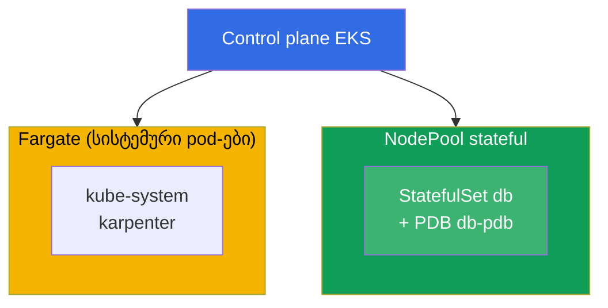
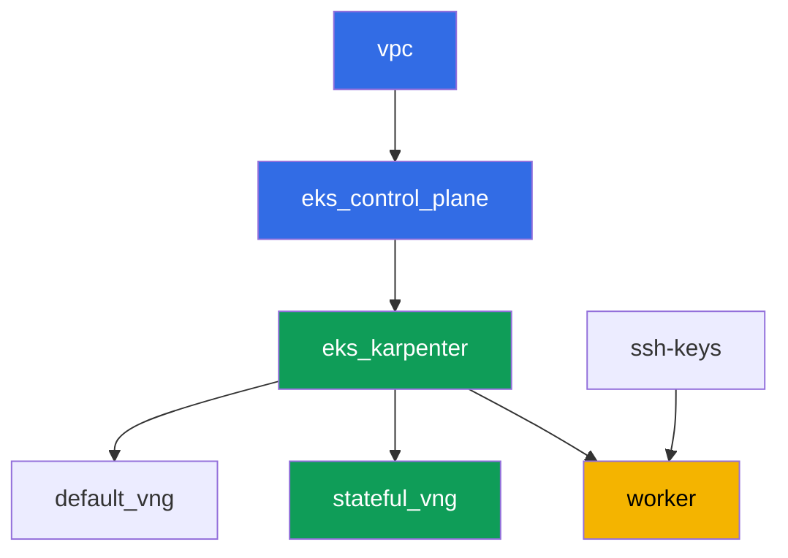

[Русская версия](README_RU.MD) · [Eng version](README.MD) · [Versión en español](README_ES.MD) · [Version française](README_FR.MD) · [Deutsche Version](README_DE.MD) · [繁體中文版](README_TW.MD) · [日本語版](README_JP.MD)

# ლაბა 123 - Karpenter: NodePool, consolidation, drift და StatefulSet-ის უსაფრთხო გამოძევება

## აღწერა

Karpenter-ის ექსპლუატაციას ვამუშავებთ პრაქტიკულ დონეზე: როგორ წავიკითხოთ `NodePool` და
`EC2NodeClass`, რა რეალურად აჭერს ჩამორთმევას consolidation-ის დროს, და რატომ რისკავს
StatefulSet სწორი დაცვის გარეშე თავის quorum-ს. ამ ლაბის საკვანძო მომენტია სიმპტომის
საკუთარი თვალით დანახვა - ვძალდობით რამდენიმე node-ის consolidation-ს ერთდროულად,
ვხედავთ Karpenter-ის ლოგებში და `kubectl describe node`-ში დაბლოკილ გამოძევებას, და
შემდეგ ვაწესრიგებთ სწორ დაცვას სამი ნაწილისგან - PDB, disruption budget და წერტილოვანი
`do-not-disrupt`.

დავალებები დაწერილია production-სტილში: მოკლე დებულება პლუს მიღების კრიტერიუმები.
შემოწმება ავტომატურია, ბრძანებით `check_result`.

## მიზანი

გავიმყაროთ კურსის თავის მასალა:

- [თავი 12. Karpenter: NodePool, EC2NodeClass, disruption, consolidation, drift](../../course/12/ge.md) -
  როგორ ვგამოძევოთ StatefulSet უსაფრთხოდ consolidation-ის დროს

## რას ვქმნით

კლასტერი უკვე გაშლილია კოდის სახით (იგივე ბაზა, რაც ლაბა 101-ში), მასზე დამატებით
დაემატა მეორე NodePool `stateful`, მხოლოდ `on-demand`-ზე, taint-ით. თქვენ ავრცელებთ
StatefulSet-ს ამ pool-ზე, დაცავთ მას PDB-ით, ხედავთ, როგორ ბლოკირდება გამოძევება, და
წერტილოვნად აწესრიგებთ კონფიგურაციას.

| ობიექტი | რას წარმოადგენს | რატომ არის ამ ლაბაში |
|--------|---------|-------------------|
| NodePool `stateful` | მეორე Karpenter NodePool, მხოლოდ `on-demand`, taint `dedicated=stateful` | მდგრადი pool StatefulSet-ისთვის, spot-შეწყვეტების გარეშე |
| Namespace `eks-123` | კლასტერის ნაწილი ლაბის დატვირთვისთვის | ლაბის რესურსებს ცალკე ვაწესებთ სისტემურისგან |
| Artifact `inventory.txt` | `nodepools`, `ec2nodeclasses`, `nodeclaims`-ის ჭრილი | ინვენტარიზაცია: ჩანს ორივე - `default`-იც და `stateful`-იც (თავი 12.11) |
| StatefulSet `db` (3 replica) | ping_pong აპლიკაცია toleration-ით `stateful` pool-ზე | დატვირთვა, რომელსაც consolidation-მა შეიძლება მოხვდეს |
| PodDisruptionBudget `db-pdb` | `maxUnavailable: 1` StatefulSet `db`-ზე | გამოძევების ძირითადი ტორმოზი (თავი 12.6) |
| Artifact `consolidation.txt` | ბლოკირების სიმპტომი node-ის event-ებში | ვხედავთ `DisruptionBlocked`-სა და `Pdb prevents pod evictions`-ს |
| ანოტაცია `do-not-disrupt` `db-0`-ზე + `fix.txt` | ერთი replica-ს წერტილოვანი დაცვა | სწორი კომბინაცია PDB პლუს budget პლუს წერტილოვანი `do-not-disrupt` (თავები 12.7-12.8) |

კლასტერის შედეგადი სურათი:



## ინფრასტრუქტურა

გარემო იშლება AWS-ში (`eu-central-1`) Terragrunt-ის მეშვეობით. ლაბის ყოველი
დირექტორია - ეს ერთი კომპონენტია საკუთარი `terragrunt.hcl`-ით, რომელიც მიუთითებს
საერთო მოდულზე `terraform/modules/`-ში და აცხადებს დამოკიდებულებებს `dependency`
ბლოკებით. Terragrunt აგებს დამოკიდებულებების გრაფს და აწესებს კომპონენტებს სწორი
თანმიმდევრობით.

### მოდულები და დამოკიდებულებები

| დირექტორია (კომპონენტი) | მოდული (`terraform/modules/`) | დამოკიდებულია | რას ქმნის |
|---------------------|-------------------------------|------------|-------------|
| `vpc` | `vpc_v3` | - | VPC `10.10.0.0/16`, საჯარო და პირადი subnets ორ AZ-ში, NAT |
| `ssh-keys` | `ssh-keys` | - | SSH-გასაღებების წყვილი worker მანქანისთვის და node-ებისთვის |
| `eks_control_plane` | `eks_v2_control_plane` | `vpc` | EKS control plane `1.36`, OIDC, security groups |
| `eks_fargate_system` | `eks_v2_fargate` | `vpc`, `eks_control_plane` | Fargate profile `kube-system`-ისთვის და `karpenter`-ისთვის |
| `eks_addons` | `eks_v2_addons` | `eks_control_plane`, `eks_fargate_system` | add-on-ები coredns, kube-proxy, vpc-cni, pod-identity |
| `eks_karpenter` | `eks_v2_karpenter` | `vpc`, `eks_control_plane`, `eks_addons`, `eks_fargate_system` | Karpenter კონტროლერი, node-ის IAM role |
| `eks_karpenter_default_vng` | `eks_v2_karpenter_vng` | `vpc`, `eks_control_plane`, `eks_karpenter` | ნაგულისხმევი NodePool `default` (spot და on-demand) |
| `eks_karpenter_stateful_vng` | `eks_v2_karpenter_vng` | `vpc`, `eks_control_plane`, `eks_karpenter` | NodePool `stateful`: მხოლოდ on-demand, taint |
| `worker` | `eks_v2_work_pc` | `ssh-keys`, `vpc`, `eks_control_plane`, `eks_karpenter` | worker მანქანა kubectl-ით, ტესტებით და `check_result`-ით |

დამოკიდებულების გრაფი (რაც უფრო ადრე გამოიყენება, ისე უფრო დაბლაა ისარზე):



კომპონენტები `eks_fargate_system` და `eks_addons` გრაფზე ნაჩვენები არ არის 8 node-ის
ლიმიტის შესანარჩუნებლად, მაგრამ ფაქტობრივად დგანან `eks_control_plane`-სა და
`eks_karpenter`-ს შორის (იხილეთ ცხრილი ზემოთ).

### NodePool `stateful`-ის პარამეტრები

ძირითადი `requirements` `eks_karpenter_stateful_vng/terragrunt.hcl`-ში:

| Requirement | მნიშვნელობა | რატომ |
|-------------|----------|-------|
| `karpenter.sh/capacity-type` | `In ["on-demand"]` | მხოლოდ on-demand - მდგრადობა უფრო მნიშვნელოვანია დაზოგვაზე StatefulSet-ისთვის საკუთარი volume-ით |
| `karpenter.k8s.aws/instance-category` | `In ["m", "r"]` | ბაზის მეხსიერების ინსტანსები |
| `karpenter.k8s.aws/instance-generation` | `Gt ["2"]` | არ ავიღოთ მოძველებული თაობები |
| `karpenter.k8s.aws/instance-size` | `In ["medium", "large", "xlarge"]` | ზომების გონივრული დიაპაზონი |
| taint | `dedicated=stateful:NoSchedule` | pool-ზე მოხვდება მხოლოდ toleration-ის მქონე pod-ები |
| `disruption.consolidationPolicy` | `WhenEmptyOrUnderutilized`, `consolidateAfter: 30s` | მოკლე ტაიმერი ლაბაში სწრაფი დემონსტრაციისთვის |
| `budgets` | `nodes: 50%` | მაღალი პროცენტი, რომ ადვილად გამოვწვიოთ რამდენიმე node-ის ერთდროული consolidation-ის მცდელობა |

დანარჩენი პარამეტრები (რეგიონი, ქსელი, ვერსიები, პრეფიქსები) იკითხება `env.hcl`-იდან,
როგორც ლაბა 101-ში; ამ ლოგიკის შეცვლა საჭირო არ არის.

## გაშლა

```bash
TASK=123 make run_eks_task
```

გაშლას სჭირდება დაახლოებით 15-20 წუთი. გამონატანში იპოვეთ სტრიქონი worker მანქანასთან
SSH-კავშირით და დაუკავშირდით მას. kubectl იქ უკვე კონფიგურირებულია სწორ კლასტერზე.

სასარგებლო ბრძანებები worker მანქანაზე:

```bash
time_left       # რამდენი დროა დარჩენილი გარემოს
check_result    # გადაწყვეტის შემოწმება
```

> სავარჯიშო სტენდის უსაფრთხოება. `env.hcl`-ში ჩართულია `ssh_password_enable = true` და
> `access_cidrs = ["0.0.0.0/0"]` - მოხერხებულია სასწავლო გარემოსთვის, მაგრამ ასე არ
> ღირს production-ში. კურსის სტანდარტების მიხედვით (თავები 0.2, 2, 19), წვდომა worker
> მანქანებზე იხსნება AWS SSM Session Manager-ის მეშვეობით საჯარო SSH პორტების გარეშე,
> ხოლო `access_cidrs` ვიწროვდება კონკრეტულ მისამართებზე. აქ საჯარო SSH დატანილია
> მხოლოდ გაშვების სიმარტივისთვის.

## დავალებები

---
|        **1**        | **Namespace ლაბის დატვირთვისთვის**                             |
| :-----------------: | :---------------------------------------------------------- |
| რას ვაკეთებთ          | შექმენით namespace სახელით `eks-123`. ლაბის ყველა ობიექტი მის შიგნით იქმნება. |
| მიღების კრიტერიუმები    | - namespace `eks-123` არსებობს. |
---
|        **2**        | **NodePool, EC2NodeClass, NodeClaim-ის ინვენტარიზაცია**         |
| :-----------------: | :---------------------------------------------------------- |
| რას ვაკეთებთ          | შეინახეთ `kubectl get nodepools -o wide`, `kubectl get ec2nodeclasses` და `kubectl get nodeclaims`-ის გამონატანი ფაილში `/var/work/tests/artifacts/2/inventory.txt`. დარწმუნდით, რომ ფაილში ჩანს ორივე - ნაგულისხმევი NodePool `default`-იც და ახალი pool `stateful`-იც. |
| მიღების კრიტერიუმები    | - ფაილი `inventory.txt` არ არის ცარიელი;<br/>- შეიცავს სტრიქონებს `default` და `stateful`. |
---
|        **3**        | **StatefulSet `db` `stateful` pool-ზე**                      |
| :-----------------: | :---------------------------------------------------------- |
| რას ვაკეთებთ          | Namespace `eks-123`-ში შექმენით StatefulSet `db`, image `viktoruj/ping_pong:latest`, `3` replica. NodePool `stateful` დახურულია taint-ით `dedicated=stateful:NoSchedule`, ამიტომ pod-ს დაუმატეთ შესატყვისი toleration. დაელოდეთ, სანამ ყველა `3` replica გახდება `Running` და მოხვდება `stateful` pool-ის node-ებზე (`kubectl get po -n eks-123 -l app=db -o wide`, node-ის label `work_type=stateful`). |
| მიღების კრიტერიუმები    | - StatefulSet `db` `eks-123`-ში, image `viktoruj/ping_pong`, `3` მზა replica;<br/>- toleration `dedicated=stateful:NoSchedule`-ისთვის;<br/>- ყველა `db` pod node-ებზე `work_type=stateful`-ით. |
---
|        **4**        | **PodDisruptionBudget StatefulSet `db`-ზე**                 |
| :-----------------: | :---------------------------------------------------------- |
| რას ვაკეთებთ          | შექმენით `PodDisruptionBudget` სახელით `db-pdb` namespace `eks-123`-ში: `maxUnavailable: 1`, selector label-ზე `app: db`. ეს არის ნებაყოფლობითი გამოძევების ძირითადი ტორმოზი (თავი 12.6). |
| მიღების კრიტერიუმები    | - ობიექტი `db-pdb` არსებობს `eks-123`-ში;<br/>- `spec.maxUnavailable` ტოლია `1`;<br/>- selector მიუთითებს `app: db`-ზე. |
---
|        **5**        | **სიმპტომი: გამოძევების უფლების არმქონე PDB ბლოკავს consolidation-ს** |
| :-----------------: | :---------------------------------------------------------- |
| რას ვაკეთებთ          | `stateful` pool-ის node-ები დაუტვირთავია (`3` replica თითო `250m`-ით ორ node-ზე), ამიტომ Karpenter მუდმივად ცდილობს მათ consolidation-ს. გამკაცრეთ დაცვა სავსე ბლოკირებამდე: გადაერთეთ `db-pdb`-ს `minAvailable: 3`-ზე `3` replica-ს დროს, რომ `kubectl get pdb db-pdb -n eks-123`-ში სვეტი `ALLOWED DISRUPTIONS` გახდეს `0`. 1-2 წუთის შემდეგ იპოვეთ pool-ის node-ებზე ბლოკირების event: `kubectl describe node <node> \| grep -A2 DisruptionBlocked` - Karpenter წერს `Pdb prevents pod evictions (PodDisruptionBudget=[eks-123/db-pdb])`. კონტროლერის ლოგები დაათვალიერეთ namespace `karpenter`-ში: `kubectl logs -n karpenter -l app.kubernetes.io/name=karpenter --tail=500`. შეინახეთ დაკვირვება (`get pdb`-ის გამონატანი პლუს event) ფაილში `/var/work/tests/artifacts/5/consolidation.txt`. ამის შემდეგ დააბრუნეთ `db-pdb` `maxUnavailable: 1`-ზე - `ALLOWED DISRUPTIONS` კვლავ გახდება `1`, და consolidation განიბლოკება. ეს არის გაკვეთილი: სანამ PDB არც ერთ გამოძევებას არ ანებებს, ნებაყოფლობითი შეწყვეტები საბოლოოდ ჩერდება, ხოლო `maxUnavailable: 1` საშუალებას აძლევს node-ს დაიდრეინდეს replica-ს დამატებით. |
| მიღების კრიტერიუმები    | - ფაილი `/var/work/tests/artifacts/5/consolidation.txt` არ არის ცარიელი;<br/>- შეიცავს სიტყვას `pdb` და ტექსტს `prevents pod evict` (ან `Unconsolidatable`);<br/>- დავალების შემდეგ `db-pdb` კვლავ `maxUnavailable: 1`-ით არის (თუ არა, დავალება 4 არ გავლენ). |
---
|        **6**        | **ჩასწორება: წერტილოვანი `do-not-disrupt` სავსე დაცვის ნაცვლად** |
| :-----------------: | :---------------------------------------------------------- |
| რას ვაკეთებთ          | დაატანეთ ანოტაცია `karpenter.sh/do-not-disrupt=true` მხოლოდ StatefulSet-ის ერთ pod-ს, მაგალითად `kubectl annotate pod db-0 -n eks-123 karpenter.sh/do-not-disrupt=true`. არ დაატანოთ `db-1`-ს და `db-2`-ს. შეინახეთ `/var/work/tests/artifacts/6/fix.txt`-ში განმარტება: რატომ არის StatefulSet-ის სწორი დაცვა consolidation-ის დროს PDB-ის (დავალება 4) პლუს `stateful` pool-ის disruption budget-ის (`nodes: 50%`) პლუს წერტილოვანი `do-not-disrupt`-ის კომბინაცია, და არა სავსე დაცვა განსხვავების გარეშე - წინააღმდეგ შემთხვევაში ბლოკირდება არა მხოლოდ consolidation, არამედ drift-იც (თავი 12.8). ტექსტში უნდა იყოს სიტყვები `pdb`, `do-not-disrupt` და `budget`. |
| მიღების კრიტერიუმები    | - ანოტაცია `karpenter.sh/do-not-disrupt=true` არსებობს მხოლოდ pod `db-0`-ზე, `db-1`-სა და `db-2`-ს ის არ აქვთ;<br/>- ფაილი `/var/work/tests/artifacts/6/fix.txt` არ არის ცარიელი და შეიცავს `pdb`, `do-not-disrupt`, `budget`. |
---

## შედეგის შემოწმება

worker მანქანაზე გაუშვით ავტომატური შემოწმება:

```bash
check_result
```

სკრიპტი გაუშვებს ტესტებს და აჩვენებს დასრულებული დავალებების პროცენტს.

## გადაწყვეტა

ეტალონური გადაწყვეტა: [worker/files/solutions/1_GE.MD](worker/files/solutions/1_GE.MD)

## კლასტერისა და რესურსების წაშლა

> **პირველად წაშალეთ დაცვა და დატვირთვა, შემდეგ გაუშვით სტენდის დანგრევა.** ეს ზუსტად
> იგივე ხაფანგია, რომელსაც ლაბა შეისწავლის, მხოლოდ სხვა მხრიდან: ანოტაცია
> `karpenter.sh/do-not-disrupt` `db-0`-ზე Karpenter-ს არ ანებებს ამ pod-ის გამოძევებას,
> ამიტომ NodeClaim-ის წაშლისას terminate-კონტროლერი დაუსაზღვრებლად ელოდება, node არ
> ქრება, ხოლო მისი `EC2NodeClass` ჩაკიდებულია finalizer-ით. `destroy`-ის ლოგში ეს ასე
> ჩანს: `kubernetes_manifest.ec2nodeclass: Still destroying... [09m30s elapsed]` (ცოცხლად
> დაფიქსირებული). მეორე ტორმოზია PDB: როგორც კი ერთი replica `Pending`-ში ჩავარდება
> (მისი node უკვე წაშლილია, ხოლო pool უკვე იშლება), `ALLOWED DISRUPTIONS` გახდება `0`,
> და დანარჩენი node-ების დრეინაჟიც ჩერდება. ეს ლაბა AWS-რესურსებს ხელით არ ქმნის, ყველა
> სხვა - Kubernetes-ის ობიექტებია.

```bash
# 1. მოვაშოროთ PDB - ის ბლოკავს დრეინაჟს, თუ ერთი replica მაინც არ არის Ready
kubectl delete pdb db-pdb -n eks-123 --ignore-not-found

# 2. მოვაშოროთ დატვირთვა do-not-disrupt ანოტაციასთან ერთად (ის pod-ზე ცხოვრობს)
kubectl delete namespace eks-123 --ignore-not-found

# 3. დავიცადოთ, სანამ Karpenter მოაშორებს NodeClaim-სა და EC2-node-ებს (დარჩება მხოლოდ fargate-*)
while kubectl get nodeclaims --no-headers 2>/dev/null | grep -q .; do
  echo "NodeClaim ჯერ კიდევ ცოცხალია, ველოდებით..."; sleep 15
done
kubectl get nodes | grep -v fargate
```

```bash
TASK=123 make delete_eks_task
```

თუ `destroy` უკვე გაშვებულია და ჩამოკიდებულია `kubernetes_manifest.ec2nodeclass`-ზე,
შეწყვეტა არ არის საჭირო - მისი განბლოკვა შესაძლებელია სხვა ტერმინალიდან. ამ მომენტისთვის
worker მანქანა, სავარაუდოდ, უკვე წაშლილია, ამიტომ kubeconfig ხელახლა უნდა შედგინდეს
ადმინის მანქანიდან:

```bash
aws eks update-kubeconfig --region eu-central-1 --name <cluster-name> --kubeconfig /tmp/kc
export KUBECONFIG=/tmp/kc

# რა ჰკიდია რეალურად წაშლას: pod do-not-disrupt-ით და PDB გამოძევების უფლების გარეშე
kubectl get po -A -o json | jq -r '.items[]
  | select(.metadata.annotations["karpenter.sh/do-not-disrupt"]=="true")
  | "\(.metadata.namespace)/\(.metadata.name)"'
kubectl get pdb -A

kubectl delete pdb db-pdb -n eks-123 --ignore-not-found
kubectl delete namespace eks-123 --ignore-not-found
```

როგორც კი NodeClaim ქრება, `EC2NodeClass`-ის finalizer იხსნება და `terragrunt`
თავადვე მთავრდება. ცოცხალ სტენდზე შემოწმებული: PDB-ისა და namespace-ის მოშორების შემდეგ
pool-ის ორივე node დაახლოებით წუთში წავიდა.

თუ node-ები დაიხოცნენ კლასტერთან ერთად, Karpenter-ის მეშვეობით სწორად წასვლის
ნაცვლად, დარჩება მეორადი ENI VPC CNI-დან: ის ჰკიდია node-ის security group-ს, და
`destroy` ჩამოეკიდება მასზე ამის ნაცვლად
(`module.eks.aws_security_group.node[0]: Still destroying...`). ამ ლაბაზე
შემოწმებული - საგანგებო დრეინაჟის შემდეგ დარჩა ერთი ასეთი ENI. იპოვეთ და წაშალეთ:

```bash
aws ec2 describe-network-interfaces --filters Name=status,Values=available \
  --query 'NetworkInterfaces[?Tags[?Key==`eks:eni:owner`]].[NetworkInterfaceId,Description,Groups[0].GroupName]' \
  --output table
aws ec2 delete-network-interface --network-interface-id <eni-id>
```
