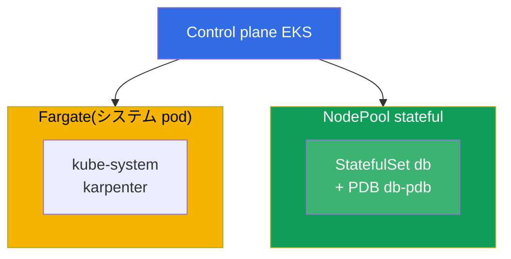
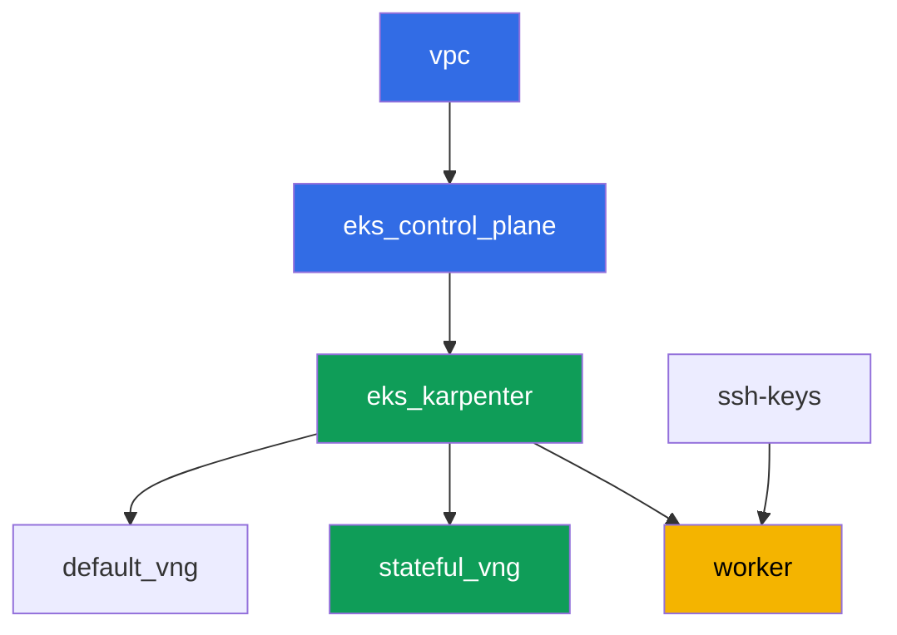

[Русская версия](README_RU.MD) · [Eng version](README.MD) · [Versión en español](README_ES.MD) · [Version française](README_FR.MD) · [Deutsche Version](README_DE.MD) · [ქართული ვერსია](README_GE.MD) · [繁體中文版](README_TW.MD)

# ラボ 123 - Karpenter:NodePool、consolidation、drift と StatefulSet の安全な排除

## 説明

Karpenter の運用を実践的なレベルで扱います:`NodePool` と `EC2NodeClass` の
読み方、consolidation 中に自発的な排除を実際に妨げているもの、そして正しい
保護のない StatefulSet がなぜクォーラムを危険にさらすのか。このラボの重要な
ポイントは、自分の目で症状を見ることです:複数のノードの consolidation を
同時に強制し、Karpenter のログと `kubectl describe node` の中でブロックされた
排除を観察し、その後、PDB、disruption budget、そして狙いを定めた
`do-not-disrupt` という 3 つの部分から正しい保護を組み立てます。

タスクは production スタイルで書かれています:短い課題文とアクセプタンス
基準。検証は `check_result` コマンドによって自動的に行われます。

## 目的

コースの以下の章の内容を定着させます:

- [第 12 章。Karpenter:NodePool、EC2NodeClass、disruption、consolidation、drift](../../course/12/ru.md) -
  consolidation の際に StatefulSet を安全に排除する方法

## 作成するもの

クラスタはすでにコードとしてデプロイされており(ラボ 101 と同様の基盤)、
その上に第二の NodePool `stateful` が追加されています。これは `on-demand`
のみで、taint が付いています。あなたはこの pool に StatefulSet をデプロイし、
PDB で保護し、排除がブロックされる様子を観察し、設定を的確に修正します。

| オブジェクト | 何か | このラボでの目的 |
|--------|---------|-------------------|
| NodePool `stateful` | 第二の Karpenter NodePool、`on-demand` のみ、taint `dedicated=stateful` | StatefulSet 用の安定したプール、spot の中断がない |
| Namespace `eks-123` | ラボのワークロード用のクラスタ内の区分 | ラボのリソースをシステムのものから分離して保つ |
| Artifact `inventory.txt` | `nodepools`、`ec2nodeclasses`、`nodeclaims` のスナップショット | インベントリ:`default` と `stateful` の両方が見える(第 12.11 章) |
| StatefulSet `db`(3 レプリカ) | `stateful` プール向けの toleration を持つ ping_pong アプリケーション | consolidation が影響しうるワークロード |
| PodDisruptionBudget `db-pdb` | StatefulSet `db` に対する `maxUnavailable: 1` | 排除を止める主なブレーキ(第 12.6 章) |
| Artifact `consolidation.txt` | ノードのイベントに現れるブロックの症状 | `DisruptionBlocked` と `Pdb prevents pod evictions` を観察する |
| `db-0` の `do-not-disrupt` アノテーション + `fix.txt` | 単一レプリカへの狙いを定めた保護 | PDB とバジェットと狙いを定めた `do-not-disrupt` の正しい組み合わせ(第 12.7-12.8 章) |

結果として得られるクラスタの図:



## インフラストラクチャ

環境は Terragrunt によって AWS(`eu-central-1`)にデプロイされています。各
ラボのディレクトリは、独自の `terragrunt.hcl` を持つ 1 つのコンポーネント
であり、`terraform/modules/` にある共有モジュールを参照し、`dependency`
ブロックを通じて依存関係を宣言します。Terragrunt は依存関係グラフを構築し、
コンポーネントを正しい順序で適用します。

### モジュールと依存関係

| ディレクトリ(コンポーネント) | モジュール(`terraform/modules/`) | 依存先 | 作成されるもの |
|---------------------|-------------------------------|------------|-------------|
| `vpc` | `vpc_v3` | - | VPC `10.10.0.0/16`、2 つの AZ にあるパブリックとプライベートの subnet、NAT |
| `ssh-keys` | `ssh-keys` | - | ワーカーマシンとノード用の SSH キーペア |
| `eks_control_plane` | `eks_v2_control_plane` | `vpc` | EKS control plane `1.36`、OIDC、security group |
| `eks_fargate_system` | `eks_v2_fargate` | `vpc`、`eks_control_plane` | `kube-system` と `karpenter` 用の Fargate profile |
| `eks_addons` | `eks_v2_addons` | `eks_control_plane`、`eks_fargate_system` | coredns、kube-proxy、vpc-cni、pod-identity アドオン |
| `eks_karpenter` | `eks_v2_karpenter` | `vpc`、`eks_control_plane`、`eks_addons`、`eks_fargate_system` | Karpenter コントローラ、ノードの IAM ロール |
| `eks_karpenter_default_vng` | `eks_v2_karpenter_vng` | `vpc`、`eks_control_plane`、`eks_karpenter` | デフォルトの NodePool `default`(spot と on-demand) |
| `eks_karpenter_stateful_vng` | `eks_v2_karpenter_vng` | `vpc`、`eks_control_plane`、`eks_karpenter` | NodePool `stateful`:on-demand のみ、taint |
| `worker` | `eks_v2_work_pc` | `ssh-keys`、`vpc`、`eks_control_plane`、`eks_karpenter` | kubectl、テスト、`check_result` を備えたワーカーマシン |

依存関係グラフ(先に適用されるものほど矢印の下側にある):



`eks_fargate_system` と `eks_addons` のコンポーネントは、グラフを 8 ノード
以内に収めるため図には表示されていませんが、実際には `eks_control_plane` と
`eks_karpenter` の間に位置しています(上の表を参照)。

### NodePool `stateful` の設定

`eks_karpenter_stateful_vng/terragrunt.hcl` の主な `requirements`:

| Requirement | 値 | 理由 |
|-------------|----------|-------|
| `karpenter.sh/capacity-type` | `In ["on-demand"]` | on-demand のみ - 自前のボリュームを持つ StatefulSet にとっては、コスト削減より安定性が重要 |
| `karpenter.k8s.aws/instance-category` | `In ["m", "r"]` | データベースのメモリに適したインスタンス |
| `karpenter.k8s.aws/instance-generation` | `Gt ["2"]` | 古い世代を選ばない |
| `karpenter.k8s.aws/instance-size` | `In ["medium", "large", "xlarge"]` | 妥当なサイズの範囲 |
| taint | `dedicated=stateful:NoSchedule` | toleration を持つ pod だけがこのプールに乗る |
| `disruption.consolidationPolicy` | `WhenEmptyOrUnderutilized`、`consolidateAfter: 30s` | ラボで素早くデモするための短いタイマー |
| `budgets` | `nodes: 50%` | 高い割合にすることで、複数ノードを同時に consolidation しようとする試みを簡単に引き起こせる |

その他のパラメータ(リージョン、ネットワーク、バージョン、プレフィックス)は
ラボ 101 と同様に `env.hcl` から読み込まれます。このロジックを変更する必要は
ありません。

## デプロイ

```bash
TASK=123 make run_eks_task
```

デプロイには約 15-20 分かかります。出力の中からワーカーマシンへの SSH 接続の
行を見つけて接続してください。そこでは kubectl はすでに正しいクラスタ用に
設定されています。

ワーカーマシン上で使える便利なコマンド:

```bash
time_left       # 環境の残り時間
check_result    # 解答の確認
```

> 検証環境のセキュリティについて。`env.hcl` では `ssh_password_enable = true`
> と `access_cidrs = ["0.0.0.0/0"]` が有効になっています - 学習用環境としては
> 便利ですが、本番環境ではこのようにしてはいけません。コースの標準(第 0.2、
> 2、19 章)によれば、ワーカーマシンへのアクセスは公開 SSH ポートを外に出さず
> に AWS SSM Session Manager を経由して開き、`access_cidrs` は具体的な
> アドレスに絞り込みます。ここでは、セットアップを簡単にするためだけに公開
> SSH を残しています。

## タスク

---
|        **1**        | **ラボのワークロード用の namespace**                             |
| :-----------------: | :---------------------------------------------------------- |
| やること          | `eks-123` という名前の namespace を作成してください。このラボのすべてのオブジェクトはその中に作成されます。 |
| アクセプタンス基準    | - namespace `eks-123` が存在する。 |
---
|        **2**        | **NodePool、EC2NodeClass、NodeClaim のインベントリ**         |
| :-----------------: | :---------------------------------------------------------- |
| やること          | `kubectl get nodepools -o wide`、`kubectl get ec2nodeclasses`、`kubectl get nodeclaims` の出力をファイル `/var/work/tests/artifacts/2/inventory.txt` に保存してください。ファイルにデフォルトの NodePool `default` と新しいプール `stateful` の両方が表示されていることを確認してください。 |
| アクセプタンス基準    | - ファイル `inventory.txt` が空でない;<br/>- `default` と `stateful` という行を含む。 |
---
|        **3**        | **`stateful` プール上の StatefulSet `db`**                      |
| :-----------------: | :---------------------------------------------------------- |
| やること          | `eks-123` namespace に StatefulSet `db`(イメージ `viktoruj/ping_pong:latest`、`3` レプリカ)を作成してください。NodePool `stateful` は taint `dedicated=stateful:NoSchedule` で閉じられているため、対応する toleration を pod に追加してください。`3` つのレプリカすべてが `Running` になり、`stateful` プールのノード上にあることを確認してください(`kubectl get po -n eks-123 -l app=db -o wide`、ノードラベル `work_type=stateful`)。 |
| アクセプタンス基準    | - `eks-123` の StatefulSet `db`、イメージ `viktoruj/ping_pong`、`3` 個の ready なレプリカ;<br/>- `dedicated=stateful:NoSchedule` に対する toleration;<br/>- すべての `db` pod が `work_type=stateful` を持つノード上にある。 |
---
|        **4**        | **StatefulSet `db` に対する PodDisruptionBudget**                 |
| :-----------------: | :---------------------------------------------------------- |
| やること          | `eks-123` namespace に `db-pdb` という名前の `PodDisruptionBudget` を作成してください:`maxUnavailable: 1`、ラベル `app: db` に対する selector。これが自発的な排除を止める主なブレーキです(第 12.6 章)。 |
| アクセプタンス基準    | - `eks-123` にオブジェクト `db-pdb` が存在する;<br/>- `spec.maxUnavailable` が `1` に等しい;<br/>- selector が `app: db` を指している。 |
---
|        **5**        | **症状:排除の権利がない PDB が consolidation をブロックする** |
| :-----------------: | :---------------------------------------------------------- |
| やること          | `stateful` プールのノードはすでにリソース利用率が低い状態です(`250m` ずつの `3` レプリカが 2 つのノードに分散)。そのため Karpenter は常にそれらを consolidation しようとします。保護を完全なロックダウンまで強化してください:`db-pdb` を `3` レプリカに対して `minAvailable: 3` に変更し、`kubectl get pdb db-pdb -n eks-123` の `ALLOWED DISRUPTIONS` 列が `0` になるようにしてください。1-2 分後、プールのノードでブロックのイベントを見つけてください:`kubectl describe node <node> \| grep -A2 DisruptionBlocked` - Karpenter は `Pdb prevents pod evictions (PodDisruptionBudget=[eks-123/db-pdb])` と記録します。`karpenter` namespace でコントローラのログを確認してください:`kubectl logs -n karpenter -l app.kubernetes.io/name=karpenter --tail=500`。観察結果(`get pdb` の出力とイベント)を `/var/work/tests/artifacts/5/consolidation.txt` に保存してください。その後、`db-pdb` を `maxUnavailable: 1` に戻してください - `ALLOWED DISRUPTIONS` は再び `1` になり、consolidation のブロックが解除されます。これが教訓です:PDB が排除を一つも許可しない限り、自発的な中断は永久に止まったままですが、`maxUnavailable: 1` であればノードを 1 レプリカずつドレインできます。 |
| アクセプタンス基準    | - ファイル `/var/work/tests/artifacts/5/consolidation.txt` が空でない;<br/>- 単語 `pdb` とテキスト `prevents pod evict`(または `Unconsolidatable`)を含む;<br/>- タスク完了後、`db-pdb` が `maxUnavailable: 1` に戻っている(そうでなければタスク 4 は通らない)。 |
---
|        **6**        | **修正:完全なロックダウンの代わりに狙いを定めた `do-not-disrupt`** |
| :-----------------: | :---------------------------------------------------------- |
| やること          | StatefulSet のうち 1 つの pod だけにアノテーション `karpenter.sh/do-not-disrupt=true` を設定してください。例:`kubectl annotate pod db-0 -n eks-123 karpenter.sh/do-not-disrupt=true`。`db-1` と `db-2` には設定しないでください。`/var/work/tests/artifacts/6/fix.txt` に説明を保存してください:consolidation の際に StatefulSet を正しく保護する方法が、PDB(タスク 4)と `stateful` プールの disruption budget(`nodes: 50%`)と狙いを定めた `do-not-disrupt` の組み合わせであり、無差別な全面的保護ではない理由 - そうしないと consolidation だけでなく drift もブロックされてしまいます(第 12.8 章)。テキストには `pdb`、`do-not-disrupt`、`budget`(または `бюджет`)という語を含める必要があります。 |
| アクセプタンス基準    | - アノテーション `karpenter.sh/do-not-disrupt=true` が pod `db-0` だけに存在し、`db-1` と `db-2` にはない;<br/>- ファイル `/var/work/tests/artifacts/6/fix.txt` が空でなく、`pdb`、`do-not-disrupt`、`budget`/`бюджет` を含む。 |
---

## 結果の確認

ワーカーマシン上で自動チェックを実行してください:

```bash
check_result
```

スクリプトはテストを実行し、完了したタスクの割合を表示します。

## 解決策

参考解答:[worker/files/solutions/1_JP.MD](worker/files/solutions/1_JP.MD)

## クラスタとリソースの削除

> **まず保護とワークロードを削除し、その後でスタンドを解体してください。** これは
> このラボが調べているのと同じ罠を、別の側から見たものです:`db-0` の
> `karpenter.sh/do-not-disrupt` アノテーションは Karpenter がこの pod を排除
> することを禁止するため、NodeClaim を削除する際に終了コントローラは永遠に
> 待ち続け、ノードは消えず、その `EC2NodeClass` は finalizer によって保持され
> ます。`destroy` のログではこう見えます:
> `kubernetes_manifest.ec2nodeclass: Still destroying... [09m30s elapsed]`
> (実際にキャプチャされたもの)。第二のブレーキは PDB です:1 つのレプリカが
> `Pending` になった途端(そのノードはすでに削除されており、プールもすでに
> 削除中である)、`ALLOWED DISRUPTIONS` は `0` になり、残りのノードの
> ドレインも止まってしまいます。このラボは AWS リソースを手動で作成すること
> はなく、他のすべては Kubernetes のオブジェクトです。

```bash
# 1. PDB を削除する - 1 つでも Ready でないレプリカがあるとドレインをブロックする
kubectl delete pdb db-pdb -n eks-123 --ignore-not-found

# 2. do-not-disrupt アノテーションとともにワークロードを削除する(pod 上に存在する)
kubectl delete namespace eks-123 --ignore-not-found

# 3. Karpenter が NodeClaim と EC2 ノードを取り除くまで待つ(fargate-* のみが残るはず)
while kubectl get nodeclaims --no-headers 2>/dev/null | grep -q .; do
  echo "NodeClaim still alive, waiting..."; sleep 15
done
kubectl get nodes | grep -v fargate
```

```bash
TASK=123 make delete_eks_task
```

`destroy` がすでに実行中で `kubernetes_manifest.ec2nodeclass` で詰まっている
場合、それを中断する必要はありません - 別のターミナルからブロックを解除でき
ます。この時点でワーカーマシンはおそらくすでに削除されているため、
kubeconfig は管理用マシンから再構築する必要があります:

```bash
aws eks update-kubeconfig --region eu-central-1 --name <cluster-name> --kubeconfig /tmp/kc
export KUBECONFIG=/tmp/kc

# 削除を実際に妨げているもの:do-not-disrupt を持つ pod と排除の権利がない PDB
kubectl get po -A -o json | jq -r '.items[]
  | select(.metadata.annotations["karpenter.sh/do-not-disrupt"]=="true")
  | "\(.metadata.namespace)/\(.metadata.name)"'
kubectl get pdb -A

kubectl delete pdb db-pdb -n eks-123 --ignore-not-found
kubectl delete namespace eks-123 --ignore-not-found
```

NodeClaim が消えた瞬間、`EC2NodeClass` の finalizer が解放され、
`terragrunt` は自力で完了します。実際のスタンドで検証済み:PDB と namespace
を削除した後、プールの両方のノードは約 1 分でなくなりました。

ノードが Karpenter を通じて正しく離脱するのではなく、クラスタとともに死んで
しまった場合、VPC CNI からのセカンダリ ENI が残ります。それがノードの
security group を掴んでいるため、`destroy` はそちらで詰まります
(`module.eks.aws_security_group.node[0]: Still destroying...`)。このラボで
検証済み - 緊急のドレインの後にこのような ENI が 1 つ残りました。それを見つけ
て削除してください:

```bash
aws ec2 describe-network-interfaces --filters Name=status,Values=available \
  --query 'NetworkInterfaces[?Tags[?Key==`eks:eni:owner`]].[NetworkInterfaceId,Description,Groups[0].GroupName]' \
  --output table
aws ec2 delete-network-interface --network-interface-id <eni-id>
```
