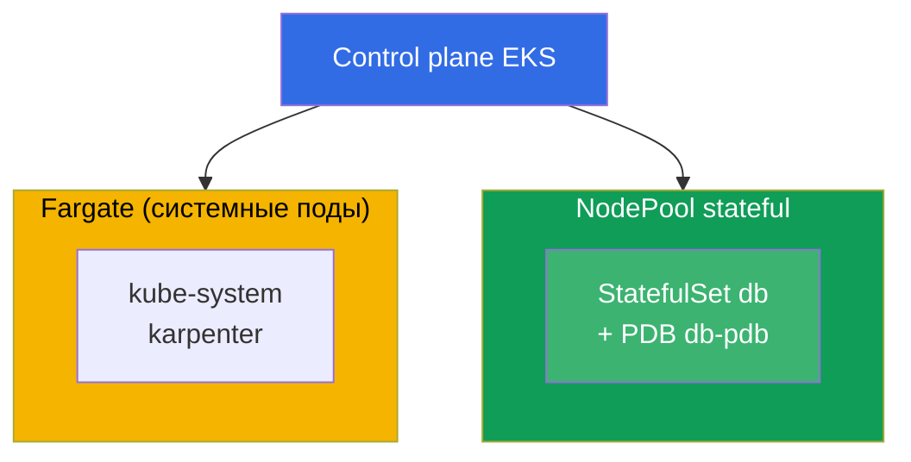
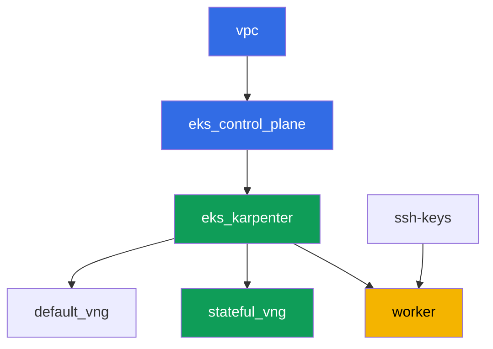

# Лаба 123 - Karpenter: NodePool, consolidation, drift и безопасное выселение StatefulSet

## Описание

Отрабатываем эксплуатацию Karpenter на предметном уровне: как читать `NodePool` и
`EC2NodeClass`, что реально тормозит добровольное выселение при консолидации, и почему
StatefulSet без правильной защиты рискует кворумом. Ключевой момент лабы - увидеть симптом
своими глазами: форсируем консолидацию нескольких нод сразу, наблюдаем в логах Karpenter и
в `kubectl describe node` заблокированное выселение, а затем строим правильную защиту из
трёх частей - PDB, disruption budget и точечный `do-not-disrupt`.

Задания в продакшн-стиле: короткая постановка плюс критерии приёмки. Проверка -
автоматическая, командой `check_result`.

## Цель

Закрепить материал главы курса:

- [Глава 12. Karpenter: NodePool, EC2NodeClass, disruption, consolidation, drift](../../course/12/ru.md) -
  как безопасно выселять StatefulSet при консолидации

## Что мы создаём

Кластер уже развёрнут как код (база - как в лабе 101), поверх него добавлен второй
NodePool `stateful` только на `on-demand` с taint. Вы разворачиваете StatefulSet на этом
пуле, защищаете его PDB, наблюдаете блокировку выселения и чините конфигурацию точечно.

| Объект | Что это | Зачем в этой лабе |
|--------|---------|-------------------|
| NodePool `stateful` | второй Karpenter NodePool, только `on-demand`, taint `dedicated=stateful` | устойчивый пул под StatefulSet, без spot-прерываний |
| Namespace `eks-123` | раздел кластера под нагрузку лабы | держим ресурсы отдельно от системных |
| Артефакт `inventory.txt` | срез `nodepools`, `ec2nodeclasses`, `nodeclaims` | инвентаризация: виден и `default`, и `stateful` (глава 12.11) |
| StatefulSet `db` (3 реплики) | приложение ping_pong с toleration на пул `stateful` | нагрузка, которую консолидация может задеть |
| PodDisruptionBudget `db-pdb` | `maxUnavailable: 1` на StatefulSet `db` | основной тормоз выселения (глава 12.6) |
| Артефакт `consolidation.txt` | симптом блокировки в логах и `describe node` | наблюдаем `Unconsolidatable` и `pdb ... prevents pod evictions` |
| Аннотация `do-not-disrupt` на `db-0` + `fix.txt` | точечная защита одной реплики | правильная связка PDB плюс budget плюс точечный `do-not-disrupt` (глава 12.7-12.8) |

Итоговая картина кластера:



## Инфраструктура

Окружение разворачивается в AWS (`eu-central-1`) через Terragrunt. Каждый каталог лабы -
это один компонент со своим `terragrunt.hcl`, который ссылается на общий модуль в
`terraform/modules/` и объявляет зависимости через блоки `dependency`. Terragrunt строит
граф зависимостей и применяет компоненты в правильном порядке.

### Модули и зависимости

| Каталог (компонент) | Модуль (`terraform/modules/`) | Зависит от | Что создаёт |
|---------------------|-------------------------------|------------|-------------|
| `vpc` | `vpc_v3` | - | VPC `10.10.0.0/16`, публичные и приватные подсети в двух AZ, NAT |
| `ssh-keys` | `ssh-keys` | - | пара SSH-ключей для рабочей машины и нод |
| `eks_control_plane` | `eks_v2_control_plane` | `vpc` | control plane EKS `1.36`, OIDC, security groups |
| `eks_fargate_system` | `eks_v2_fargate` | `vpc`, `eks_control_plane` | Fargate-профиль для `kube-system` и `karpenter` |
| `eks_addons` | `eks_v2_addons` | `eks_control_plane`, `eks_fargate_system` | аддоны coredns, kube-proxy, vpc-cni, pod-identity |
| `eks_karpenter` | `eks_v2_karpenter` | `vpc`, `eks_control_plane`, `eks_addons`, `eks_fargate_system` | контроллер Karpenter, IAM-роль нод |
| `eks_karpenter_default_vng` | `eks_v2_karpenter_vng` | `vpc`, `eks_control_plane`, `eks_karpenter` | дефолтный NodePool `default` (spot и on-demand) |
| `eks_karpenter_stateful_vng` | `eks_v2_karpenter_vng` | `vpc`, `eks_control_plane`, `eks_karpenter` | NodePool `stateful`: только on-demand, taint |
| `worker` | `eks_v2_work_pc` | `ssh-keys`, `vpc`, `eks_control_plane`, `eks_karpenter` | рабочая машина с kubectl, тестами и `check_result` |

Граф зависимостей (что применяется раньше, то ниже по стрелке):



Компоненты `eks_fargate_system` и `eks_addons` на графе не показаны ради лимита в 8
узлов, но по факту стоят между `eks_control_plane` и `eks_karpenter` (см. таблицу выше).

### Настройки NodePool `stateful`

Ключевые `requirements` в `eks_karpenter_stateful_vng/terragrunt.hcl`:

| Requirement | Значение | Зачем |
|-------------|----------|-------|
| `karpenter.sh/capacity-type` | `In ["on-demand"]` | только on-demand - устойчивость важнее экономии для StatefulSet со своим томом |
| `karpenter.k8s.aws/instance-category` | `In ["m", "r"]` | инстансы под память базы |
| `karpenter.k8s.aws/instance-generation` | `Gt ["2"]` | не брать устаревшие поколения |
| `karpenter.k8s.aws/instance-size` | `In ["medium", "large", "xlarge"]` | разумный диапазон размеров |
| taint | `dedicated=stateful:NoSchedule` | на пул попадают только поды с toleration |
| `disruption.consolidationPolicy` | `WhenEmptyOrUnderutilized`, `consolidateAfter: 30s` | короткий таймер для быстрой демонстрации в лабе |
| `budgets` | `nodes: 50%` | высокий процент, чтобы легко спровоцировать попытку консолидации нескольких нод разом |

Остальные параметры (регион, сеть, версии, префиксы) читаются из `env.hcl`, как в
лабе 101; менять их логику не нужно.

## Развёртывание

```bash
TASK=123 make run_eks_task
```

Развёртывание занимает примерно 15-20 минут. В выводе найдите строку с SSH-подключением к
рабочей машине и подключитесь к ней. kubectl там уже настроен на нужный кластер.

Полезные команды на рабочей машине:

```bash
time_left       # сколько осталось времени окружения
check_result    # проверить решение
```

> Безопасность стенда. В `env.hcl` включены `ssh_password_enable = true` и
> `access_cidrs = ["0.0.0.0/0"]` - это удобно для учебного окружения, но так делать в
> продакшене нельзя. По стандартам курса (главы 0.2, 2, 19) доступ к рабочим машинам
> открывают через AWS SSM Session Manager без публичных SSH-портов наружу, а `access_cidrs`
> сужают до конкретных адресов. Здесь публичный SSH оставлен только ради простоты запуска.

## Задания

---
|        **1**        | **Namespace для нагрузки лабы**                             |
| :-----------------: | :---------------------------------------------------------- |
| Что делаем          | Создайте namespace с именем `eks-123`. Все объекты лабы создаются внутри него. |
| Критерии приёмки    | - namespace `eks-123` существует. |
---
|        **2**        | **Инвентаризация NodePool, EC2NodeClass, NodeClaim**         |
| :-----------------: | :---------------------------------------------------------- |
| Что делаем          | Сохраните вывод `kubectl get nodepools -o wide`, `kubectl get ec2nodeclasses` и `kubectl get nodeclaims` в файл `/var/work/tests/artifacts/2/inventory.txt`. Убедитесь, что в файле виден и дефолтный NodePool `default`, и новый пул `stateful`. |
| Критерии приёмки    | - файл `inventory.txt` не пуст;<br/>- содержит строки `default` и `stateful`. |
---
|        **3**        | **StatefulSet `db` на пуле `stateful`**                      |
| :-----------------: | :---------------------------------------------------------- |
| Что делаем          | В namespace `eks-123` создайте StatefulSet `db`, образ `viktoruj/ping_pong:latest`, `3` реплики. NodePool `stateful` закрыт taint'ом `dedicated=stateful:NoSchedule`, поэтому добавьте под соответствующий toleration. Дождитесь, что все `3` реплики `Running` и находятся на нодах пула `stateful` (`kubectl get po -n eks-123 -l app=db -o wide`, метка ноды `work_type=stateful`). |
| Критерии приёмки    | - StatefulSet `db` в `eks-123`, образ `viktoruj/ping_pong`, `3` готовые реплики;<br/>- toleration на `dedicated=stateful:NoSchedule`;<br/>- все поды `db` на нодах с `work_type=stateful`. |
---
|        **4**        | **PodDisruptionBudget на StatefulSet `db`**                 |
| :-----------------: | :---------------------------------------------------------- |
| Что делаем          | Создайте `PodDisruptionBudget` с именем `db-pdb` в namespace `eks-123`: `maxUnavailable: 1`, селектор по label `app: db`. Это основной тормоз добровольного выселения (глава 12.6). |
| Критерии приёмки    | - объект `db-pdb` существует в `eks-123`;<br/>- `spec.maxUnavailable` равен `1`;<br/>- селектор указывает на `app: db`. |
---
|        **5**        | **Симптом: форсированная консолидация и блокировка PDB**    |
| :-----------------: | :---------------------------------------------------------- |
| Что делаем          | Форсируйте консолидацию: временно снизьте нагрузку так, чтобы освободить ноды пула `stateful` (например масштабируйте StatefulSet `db` вниз до `1` реплики примерно на `1-2` минуты, дождитесь таймера `consolidateAfter: 30s`, затем верните `3` реплики). Наблюдайте попытку Karpenter уплотнить сразу несколько нод пула `stateful` и заблокированное выселение: `kubectl logs -n kube-system -l app.kubernetes.io/name=karpenter -f \| grep -i pdb` и `kubectl describe node <node> \| grep -A2 Unconsolidatable`. Сохраните наблюдение (лог или событие с `Unconsolidatable` и `pdb ... prevents pod evictions`) в файл `/var/work/tests/artifacts/5/consolidation.txt`. Блокировка не обязана держаться навечно: Karpenter может успеть вытеснить реплики по одной благодаря PDB - важно зафиксировать сам факт наблюдения. |
| Критерии приёмки    | - файл `/var/work/tests/artifacts/5/consolidation.txt` не пуст;<br/>- содержит слово `pdb` и `Unconsolidatable` (или `prevents pod evict`). |
---
|        **6**        | **Починка: точечный `do-not-disrupt` вместо сплошной защиты** |
| :-----------------: | :---------------------------------------------------------- |
| Что делаем          | Повесьте аннотацию `karpenter.sh/do-not-disrupt=true` только на один под StatefulSet, например `kubectl annotate pod db-0 -n eks-123 karpenter.sh/do-not-disrupt=true`. НЕ ставьте её на `db-1` и `db-2`. Сохраните в `/var/work/tests/artifacts/6/fix.txt` объяснение: почему правильная защита StatefulSet при консолидации - это связка PDB (задание 4) плюс disruption budget пула `stateful` (`nodes: 50%`) плюс точечный `do-not-disrupt`, а не сплошная защита без разбора - иначе блокируется не только consolidation, но и drift (глава 12.8). В тексте должны быть слова `pdb`, `do-not-disrupt` и `budget` (или `бюджет`). |
| Критерии приёмки    | - аннотация `karpenter.sh/do-not-disrupt=true` есть только на поде `db-0`, у `db-1` и `db-2` её нет;<br/>- файл `/var/work/tests/artifacts/6/fix.txt` не пуст и содержит `pdb`, `do-not-disrupt`, `budget`/`бюджет`. |
---

## Проверка результата

На рабочей машине запустите автоматическую проверку:

```bash
check_result
```

Скрипт прогонит тесты и покажет процент выполненных заданий.

## Решение

Эталонное решение: [worker/files/solutions/1.MD](worker/files/solutions/1.MD)

## Удаление кластера и ресурсов

```bash
TASK=123 make delete_eks_task
```
