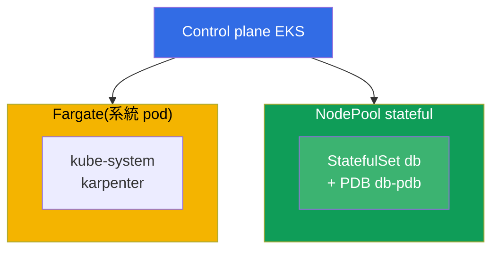
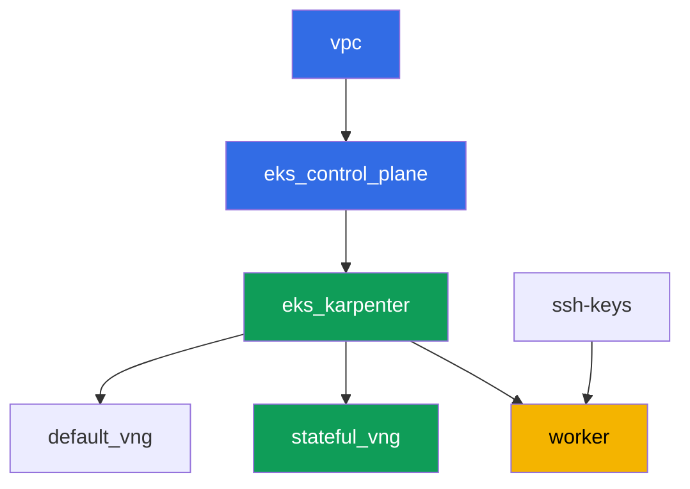

[Русская версия](README_RU.MD) · [Eng version](README.MD) · [Versión en español](README_ES.MD) · [Version française](README_FR.MD) · [Deutsche Version](README_DE.MD) · [ქართული ვერსია](README_GE.MD) · [日本語版](README_JP.MD)

# 實驗 123 - Karpenter:NodePool、consolidation、drift 與 StatefulSet 的安全驅逐

## 說明

我們在實作層面處理 Karpenter 的運維:如何讀懂 `NodePool` 和 `EC2NodeClass`,
在 consolidation 期間究竟是什麼阻止了自願驅逐,以及為什麼沒有正確保護的
StatefulSet 會冒著失去 quorum 的風險。這個實驗的關鍵之處在於親眼看到這個
症狀:我們強制同時對多個 node 進行 consolidation,在 Karpenter 的 log 以及
`kubectl describe node` 中觀察被阻擋的驅逐,然後從三個部分建立正確的保護 -
一個 PDB、一個 disruption budget,以及一個針對性的 `do-not-disrupt`。

任務以正式環境(production)的風格撰寫:一段簡短的說明,加上驗收標準。
檢查是自動的,透過 `check_result` 指令進行。

## 目標

鞏固這個課程章節的內容:

- [第 12 章。Karpenter:NodePool、EC2NodeClass、disruption、consolidation、drift](../../course/12/tw.md) -
  如何在 consolidation 期間安全地驅逐 StatefulSet

## 我們要建立什麼

叢集已經以程式碼(code)的形式部署好(和實驗 101 一樣的基礎),在此之上
又新增了第二個 NodePool `stateful`,只使用 `on-demand`,帶有 taint。你會在
這個 pool 上部署一個 StatefulSet,用 PDB 來保護它,觀察驅逐被阻擋,然後
針對性地修正設定。

| 物件 | 是什麼 | 為什麼在這個實驗裡 |
|--------|---------|-------------------|
| NodePool `stateful` | 第二個 Karpenter NodePool,只用 `on-demand`,taint `dedicated=stateful` | 給 StatefulSet 用的穩定 pool,沒有 spot 中斷 |
| Namespace `eks-123` | 用來承載這個實驗工作負載的叢集區塊 | 讓實驗的資源和系統資源保持分離 |
| Artifact `inventory.txt` | `nodepools`、`ec2nodeclasses`、`nodeclaims` 的快照 | 盤點:可以看到 `default` 和 `stateful` 兩者(第 12.11 章) |
| StatefulSet `db`(3 個副本) | 帶有 `stateful` pool toleration 的 ping_pong 應用程式 | consolidation 可能影響到的工作負載 |
| PodDisruptionBudget `db-pdb` | StatefulSet `db` 上的 `maxUnavailable: 1` | 阻止驅逐的主要機制(第 12.6 章) |
| Artifact `consolidation.txt` | node 事件中的阻擋症狀 | 我們觀察到 `DisruptionBlocked` 與 `Pdb prevents pod evictions` |
| `db-0` 上的 `do-not-disrupt` annotation + `fix.txt` | 對單一副本的針對性保護 | PDB 加 budget 加針對性 `do-not-disrupt` 的正確組合(第 12.7-12.8 章) |

最終的叢集圖:



## 基礎架構

這個環境透過 Terragrunt 部署在 AWS(`eu-central-1`)。每個實驗目錄都是一個
元件,擁有自己的 `terragrunt.hcl`,參照 `terraform/modules/` 中共用的模組,
並透過 `dependency` 區塊宣告依賴關係。Terragrunt 會建立依賴關係圖,並依照
正確順序套用元件。

### 模組與依賴關係

| 目錄(元件) | 模組(`terraform/modules/`) | 依賴 | 建立了什麼 |
|---------------------|-------------------------------|------------|-------------|
| `vpc` | `vpc_v3` | - | VPC `10.10.0.0/16`,兩個 AZ 中的公有與私有子網路,NAT |
| `ssh-keys` | `ssh-keys` | - | worker 機器與 node 使用的 SSH key pair |
| `eks_control_plane` | `eks_v2_control_plane` | `vpc` | EKS control plane `1.36`、OIDC、security group |
| `eks_fargate_system` | `eks_v2_fargate` | `vpc`、`eks_control_plane` | 給 `kube-system` 與 `karpenter` 使用的 Fargate profile |
| `eks_addons` | `eks_v2_addons` | `eks_control_plane`、`eks_fargate_system` | coredns、kube-proxy、vpc-cni、pod-identity 等 addon |
| `eks_karpenter` | `eks_v2_karpenter` | `vpc`、`eks_control_plane`、`eks_addons`、`eks_fargate_system` | Karpenter controller、node 的 IAM role |
| `eks_karpenter_default_vng` | `eks_v2_karpenter_vng` | `vpc`、`eks_control_plane`、`eks_karpenter` | 預設 NodePool `default`(spot 與 on-demand) |
| `eks_karpenter_stateful_vng` | `eks_v2_karpenter_vng` | `vpc`、`eks_control_plane`、`eks_karpenter` | NodePool `stateful`:只有 on-demand,帶 taint |
| `worker` | `eks_v2_work_pc` | `ssh-keys`、`vpc`、`eks_control_plane`、`eks_karpenter` | 具備 kubectl、測試以及 `check_result` 的 worker 機器 |

依賴關係圖(愈早 apply 的元件,在箭頭圖中的位置愈低):



元件 `eks_fargate_system` 與 `eks_addons` 沒有顯示在圖上,以便讓節點數保持
在 8 個以內,但實際上它們位於 `eks_control_plane` 和 `eks_karpenter` 之間
(參見上表)。

### NodePool `stateful` 的設定

`eks_karpenter_stateful_vng/terragrunt.hcl` 中主要的 `requirements`:

| Requirement | 值 | 為什麼 |
|-------------|----------|-------|
| `karpenter.sh/capacity-type` | `In ["on-demand"]` | 只用 on-demand - 對於擁有自己 volume 的 StatefulSet 來說,穩定性比節省成本更重要 |
| `karpenter.k8s.aws/instance-category` | `In ["m", "r"]` | 適合資料庫記憶體需求的執行個體 |
| `karpenter.k8s.aws/instance-generation` | `Gt ["2"]` | 不選擇過時的世代 |
| `karpenter.k8s.aws/instance-size` | `In ["medium", "large", "xlarge"]` | 合理的尺寸範圍 |
| taint | `dedicated=stateful:NoSchedule` | 只有帶 toleration 的 pod 會落到這個 pool 上 |
| `disruption.consolidationPolicy` | `WhenEmptyOrUnderutilized`、`consolidateAfter: 30s` | 較短的計時器,方便在實驗中快速示範 |
| `budgets` | `nodes: 50%` | 較高的百分比,容易觸發同時 consolidation 多個 node 的嘗試 |

其他參數(地區、網路、版本、前綴)是從 `env.hcl` 讀取的,和實驗 101 一樣;
不需要修改這個邏輯。

## 部署

```bash
TASK=123 make run_eks_task
```

部署大約需要 15-20 分鐘。在輸出裡找到連到 worker 機器的 SSH 連線那一行,
連上去。那裡的 kubectl 已經設定好對應正確的叢集。

worker 機器上的實用指令:

```bash
time_left       # 環境還剩多少時間
check_result    # 檢查解答
```

> 環境的安全性。`env.hcl` 中啟用了 `ssh_password_enable = true` 與
> `access_cidrs = ["0.0.0.0/0"]` - 這對訓練環境來說很方便,但正式環境中
> 絕對不能這麼做。依照課程標準(第 0.2、2、19 章),對 worker 機器的存取
> 應該透過 AWS SSM Session Manager 開啟,不對外開放公開的 SSH port,
> `access_cidrs` 也應該縮小到特定的位址範圍。這裡保留公開 SSH 只是為了
> 讓設定保持簡單。

## 任務

---
|        **1**        | **這個實驗工作負載用的 Namespace**                             |
| :-----------------: | :---------------------------------------------------------- |
| 要做什麼          | 建立一個名為 `eks-123` 的 namespace。這個實驗的所有物件都在裡面建立。 |
| 驗收標準    | - namespace `eks-123` 存在。 |
---
|        **2**        | **NodePool、EC2NodeClass、NodeClaim 的盤點**         |
| :-----------------: | :---------------------------------------------------------- |
| 要做什麼          | 把 `kubectl get nodepools -o wide`、`kubectl get ec2nodeclasses` 和 `kubectl get nodeclaims` 的輸出存到檔案 `/var/work/tests/artifacts/2/inventory.txt` 中。確認檔案中同時看得到預設的 NodePool `default` 和新的 pool `stateful`。 |
| 驗收標準    | - 檔案 `inventory.txt` 不是空的;<br/>- 包含 `default` 與 `stateful` 這兩行。 |
---
|        **3**        | **`stateful` pool 上的 StatefulSet `db`**                      |
| :-----------------: | :---------------------------------------------------------- |
| 要做什麼          | 在 `eks-123` namespace 中建立 StatefulSet `db`,映像 `viktoruj/ping_pong:latest`,`3` 個副本。NodePool `stateful` 被 taint `dedicated=stateful:NoSchedule` 封鎖,所以要在 pod 上加上對應的 toleration。等待所有 `3` 個副本變成 `Running`,並且都在 `stateful` pool 的 node 上(`kubectl get po -n eks-123 -l app=db -o wide`,node 標籤 `work_type=stateful`)。 |
| 驗收標準    | - `eks-123` 中的 StatefulSet `db`,映像 `viktoruj/ping_pong`,`3` 個 ready 的副本;<br/>- 有針對 `dedicated=stateful:NoSchedule` 的 toleration;<br/>- 所有 `db` pod 都在帶有 `work_type=stateful` 的 node 上。 |
---
|        **4**        | **StatefulSet `db` 上的 PodDisruptionBudget**                 |
| :-----------------: | :---------------------------------------------------------- |
| 要做什麼          | 在 `eks-123` namespace 中建立一個名為 `db-pdb` 的 `PodDisruptionBudget`:`maxUnavailable: 1`,selector 針對標籤 `app: db`。這是阻止自願驅逐的主要機制(第 12.6 章)。 |
| 驗收標準    | - `eks-123` 中存在物件 `db-pdb`;<br/>- `spec.maxUnavailable` 等於 `1`;<br/>- selector 指向 `app: db`。 |
---
|        **5**        | **症狀:沒有驅逐權限的 PDB 阻擋了 consolidation**                        |
| :-----------------: | :---------------------------------------------------------- |
| 要做什麼          | `stateful` pool 的 node 資源利用率不足(`3` 個副本各用 `250m`,分布在兩個 node 上),所以 Karpenter 一直嘗試對它們進行 consolidation。把保護收緊到完全鎖定:把 `db-pdb` 改成 `minAvailable: 3`(在 `3` 個副本的情況下),讓 `kubectl get pdb db-pdb -n eks-123` 中的 `ALLOWED DISRUPTIONS` 欄位變成 `0`。等 1-2 分鐘後,在 pool 的 node 上找到阻擋事件:`kubectl describe node <node> \| grep -A2 DisruptionBlocked` - Karpenter 會寫下 `Pdb prevents pod evictions (PodDisruptionBudget=[eks-123/db-pdb])`。到 `karpenter` namespace 查看 controller 的 log:`kubectl logs -n karpenter -l app.kubernetes.io/name=karpenter --tail=500`。把觀察結果(`get pdb` 的輸出加上事件)存到檔案 `/var/work/tests/artifacts/5/consolidation.txt` 中。之後,把 `db-pdb` 改回 `maxUnavailable: 1` - `ALLOWED DISRUPTIONS` 會再變回 `1`,consolidation 也會解除阻擋。這正是這裡要學到的:只要 PDB 一個驅逐都不允許,自願的中斷就會永遠卡住,而 `maxUnavailable: 1` 則能讓 node 一次一個副本地被排空。 |
| 驗收標準    | - 檔案 `/var/work/tests/artifacts/5/consolidation.txt` 不是空的;<br/>- 包含單字 `pdb` 與文字 `prevents pod evict`(或 `Unconsolidatable`);<br/>- 任務完成後 `db-pdb` 恢復到 `maxUnavailable: 1`(否則任務 4 不會通過)。 |
---
|        **6**        | **修復:用針對性的 `do-not-disrupt` 取代全面鎖定**                    |
| :-----------------: | :---------------------------------------------------------- |
| 要做什麼          | 只在 StatefulSet 的其中一個 pod 上加上 annotation `karpenter.sh/do-not-disrupt=true`,例如 `kubectl annotate pod db-0 -n eks-123 karpenter.sh/do-not-disrupt=true`。不要把它加在 `db-1` 與 `db-2` 上。把說明存到 `/var/work/tests/artifacts/6/fix.txt` 中:為什麼在 consolidation 期間保護 StatefulSet 的正確做法,是 PDB(任務 4)加上 `stateful` pool 的 disruption budget(`nodes: 50%`)再加上針對性的 `do-not-disrupt` 的組合,而不是不加區別的全面保護 - 否則不僅會阻擋 consolidation,還會阻擋 drift(第 12.8 章)。文字內容必須包含 `pdb`、`do-not-disrupt` 與 `budget` 這幾個詞。 |
| 驗收標準    | - annotation `karpenter.sh/do-not-disrupt=true` 只存在於 pod `db-0` 上,`db-1` 和 `db-2` 都沒有;<br/>- 檔案 `/var/work/tests/artifacts/6/fix.txt` 不是空的,且包含 `pdb`、`do-not-disrupt`、`budget`。 |
---

## 檢查結果

在 worker 機器上執行自動檢查:

```bash
check_result
```

這個腳本會執行測試,並顯示已完成任務的百分比。

## 解決方案

參考解答:[worker/files/solutions/1_TW.MD](worker/files/solutions/1_TW.MD)

## 刪除叢集與資源

> **先移除保護和工作負載,再拆掉整套 stand。** 這正是這個實驗研究的同一個陷阱,
> 只是從另一個角度來看:`db-0` 上的 `karpenter.sh/do-not-disrupt` annotation
> 禁止 Karpenter 驅逐這個 pod,所以在刪除 NodeClaim 時,終止 controller 會永遠
> 等待,node 不會消失,它的 `EC2NodeClass` 也會被 finalizer 卡住。在 `destroy`
> 的 log 中看起來會是這樣:`kubernetes_manifest.ec2nodeclass: Still
> destroying... [09m30s elapsed]`(實際捕捉到的畫面)。第二個阻礙是 PDB:一旦
> 有一個副本進入 `Pending`(它的 node 已經被刪除,而 pool 也正在被刪除),
> `ALLOWED DISRUPTIONS` 會變成 `0`,其餘 node 的排空也會停下來。這個實驗不會
> 手動建立任何 AWS 資源,其他所有東西都是 Kubernetes 物件。

```bash
# 1. 移除 PDB - 只要有一個副本不是 Ready,它就會阻擋排空
kubectl delete pdb db-pdb -n eks-123 --ignore-not-found

# 2. 連同 do-not-disrupt annotation 一起移除工作負載(它存在於 pod 上)
kubectl delete namespace eks-123 --ignore-not-found

# 3. 等待 Karpenter 移除 NodeClaim 和 EC2 node(應該只剩下 fargate-*)
while kubectl get nodeclaims --no-headers 2>/dev/null | grep -q .; do
  echo "NodeClaim 仍存活,等待中..."; sleep 15
done
kubectl get nodes | grep -v fargate
```

```bash
TASK=123 make delete_eks_task
```

如果 `destroy` 已經在執行,並且卡在 `kubernetes_manifest.ec2nodeclass` 上,
不需要中斷它 - 可以從另一個終端解除它的阻擋。這個時候 worker 機器很可能已經
被刪除了,所以 kubeconfig 需要從管理機器重新建立:

```bash
aws eks update-kubeconfig --region eu-central-1 --name <cluster-name> --kubeconfig /tmp/kc
export KUBECONFIG=/tmp/kc

# 究竟是什麼卡住了刪除:帶有 do-not-disrupt 的 pod,以及沒有驅逐權限的 PDB
kubectl get po -A -o json | jq -r '.items[]
  | select(.metadata.annotations["karpenter.sh/do-not-disrupt"]=="true")
  | "\(.metadata.namespace)/\(.metadata.name)"'
kubectl get pdb -A

kubectl delete pdb db-pdb -n eks-123 --ignore-not-found
kubectl delete namespace eks-123 --ignore-not-found
```

一旦 NodeClaim 消失,`EC2NodeClass` 上的 finalizer 就會被釋放,`terragrunt`
也會自己完成。已在實際的 stand 上驗證過:移除 PDB 和 namespace 後,pool 的
兩個 node 大約在一分鐘內就消失了。

如果 node 是跟著叢集一起消失,而不是透過 Karpenter 正確地離開,就會留下一個
來自 VPC CNI 的次要 ENI:它會卡住 node 的 security group,`destroy` 就會卡
在那裡(`module.eks.aws_security_group.node[0]: Still destroying...`)。已在
這個實驗中驗證過 - 一次緊急排空之後留下了這樣一個 ENI。找出它並刪除:

```bash
aws ec2 describe-network-interfaces --filters Name=status,Values=available \
  --query 'NetworkInterfaces[?Tags[?Key==`eks:eni:owner`]].[NetworkInterfaceId,Description,Groups[0].GroupName]' \
  --output table
aws ec2 delete-network-interface --network-interface-id <eni-id>
```
