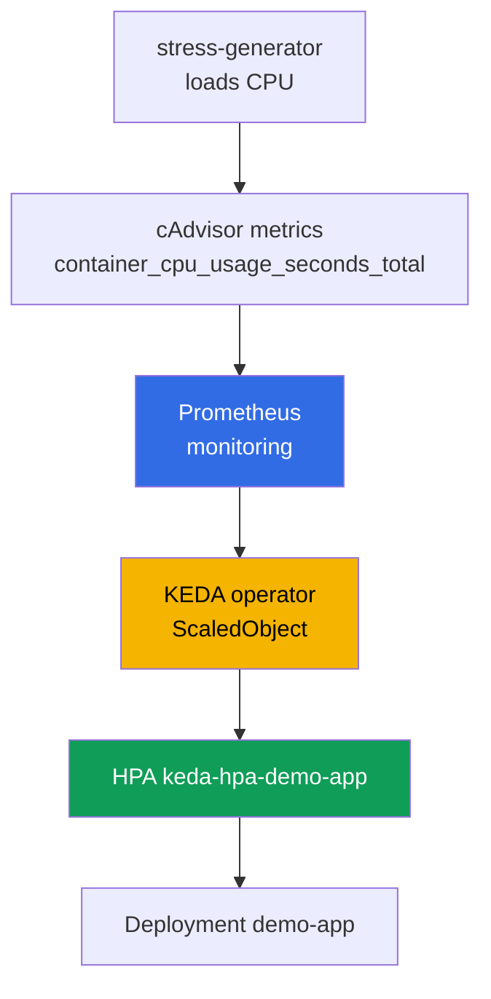
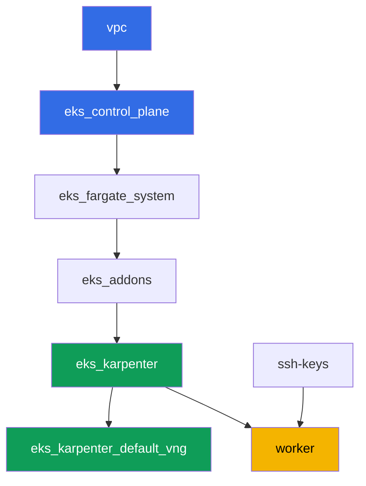

[Русская версия](README_RU.MD) · [Versión en español](README_ES.MD) · [Version française](README_FR.MD) · [Deutsche Version](README_DE.MD) · [ქართული ვერსია](README_GE.MD) · [繁體中文版](README_TW.MD) · [日本語版](README_JP.MD)

# Lab 124 - Application autoscaling: HPA, KEDA, Prometheus

## Description

The cluster is already deployed as code. In this lab you put a monitoring stack and
event-driven autoscaling on top of it: you deploy kube-prometheus-stack, install KEDA,
create a target Deployment and configure a `ScaledObject` with the `prometheus` scaler.
Under the hood KEDA does not replace HPA, it creates and manages a regular HPA - you will
see this with your own eyes via `kubectl get hpa`. Next you load the CPU of the target
pods, watch the number of replicas grow, remove the load and confirm the return to the
minimum.

Tasks are written in a production style: a short statement plus acceptance criteria.
Checking is automatic, via the `check_result` command.

## Goal

Reinforce the material from the course chapter:

- [Chapter 35. Application autoscaling: HPA, external metrics, KEDA](../../course/35/ru.md)

## What we're creating

The cluster from lab 101 is already deployed. In this lab you add a monitoring stack and
an autoscaling chain on top of it.

| Object | What it is | Why it's in this lab |
|--------|---------|-------------------|
| Namespace `eks-124` | a cluster section for the lab's workload | keeps resources separate from system ones |
| kube-prometheus-stack (`monitoring`) | Prometheus server | metric source for the KEDA scaler |
| KEDA (`keda`) | operator and metrics adapter | creates and manages an HPA driven by an external metric |
| Deployment `demo-app` | scaling target | referenced by the `ScaledObject` |
| `ScaledObject` `demo-app` | KEDA CRD with the `prometheus` scaler | describes the scaling trigger |
| HPA `keda-hpa-demo-app` | a regular HPA created by KEDA | visible proof that "KEDA does not replace HPA" |
| Deployment `stress-generator` | CPU load | makes the metric grow so you can see the scaling |

The resulting scaling chain:



## Infrastructure

The environment is deployed in AWS (`eu-central-1`) via Terragrunt, same as in lab 101.
Each lab directory is one component with its own `terragrunt.hcl`, which references a
shared module in `terraform/modules/` and declares dependencies through `dependency`
blocks. Terragrunt builds a dependency graph and applies the components in the right
order. There are no terraform components specific to this lab: KEDA, kube-prometheus-stack
and the load are installed via Helm/kubectl directly from the worker machine as part of the
tasks.

### Modules and dependencies

| Directory (component) | Module (`terraform/modules/`) | Depends on | What it creates |
|---------------------|-------------------------------|------------|-------------|
| `vpc` | `vpc_v3` | - | VPC `10.10.0.0/16`, public and private subnets in two AZs, NAT |
| `ssh-keys` | `ssh-keys` | - | an SSH key pair for the worker machine and nodes |
| `eks_control_plane` | `eks_v2_control_plane` | `vpc` | EKS control plane `1.36`, OIDC, security groups |
| `eks_fargate_system` | `eks_v2_fargate` | `vpc`, `eks_control_plane` | Fargate profile for `kube-system` and `karpenter` |
| `eks_addons` | `eks_v2_addons` | `eks_control_plane`, `eks_fargate_system` | coredns, kube-proxy, vpc-cni, pod-identity add-ons |
| `eks_karpenter` | `eks_v2_karpenter` | `vpc`, `eks_control_plane`, `eks_addons`, `eks_fargate_system` | Karpenter controller, node IAM role |
| `eks_karpenter_default_vng` | `eks_v2_karpenter_vng` | `vpc`, `eks_control_plane`, `eks_karpenter` | default NodePool `default` and EC2NodeClass on AL2023 |
| `worker` | `eks_v2_work_pc` | `ssh-keys`, `vpc`, `eks_control_plane`, `eks_karpenter` | worker machine with kubectl, helm, tests and `check_result` |

Dependency graph (what gets applied earlier is lower down the arrow):



System pods run on Fargate, worker nodes are brought up by Karpenter. The default NodePool
is limited to `limits.cpu = 100`, which is enough for kube-prometheus-stack, KEDA,
`demo-app` and a couple of `stress-generator` replicas at the same time.

This lab's NodePool differs from lab 101 in two settings, and both are intentional:
instances are taken from the `m`, `r`, `c` categories sized `large` and up (small burstable
nodes cannot handle the monitoring stack plus a sustained CPU load), and
`consolidationPolicy` is set to `WhenEmpty` so consolidation does not relocate Prometheus
during scale-down. A detailed explanation follows the tasks block.

### Where things are configured

`env.hcl` (shared environment parameters, read by all components):

| Parameter | Value in the lab | What it affects |
|----------|-----------------|---------------|
| `region` | `eu-central-1` | region for all resources |
| `vpc_default_cidr`, `subnets` | `10.10.0.0/16`, subnets per AZ | VPC address plan and subnet tags |
| `prefix` | `eks-task124` | prefix for resource names and tags |
| `stack_name` | `eks124` | used to build `env_name` - the cluster name |
| `k8_version` | `1.36.0` | kubectl version on the worker machine |
| `instance_type_worker` | `t3.medium` | worker machine instance type |
| `ssh_password_enable`, `access_cidrs` | `true`, `0.0.0.0/0` | SSH access to the worker machine |
| `root_volume` | `gp3`, `10` | worker machine root disk |

`inputs` in each component's `terragrunt.hcl` (settings specific to that module) match
lab 101: control plane and add-on versions for `1.36`, Karpenter controller `1.8.1`, the
default NodePool with unchanged limits. Only `test_url` and `task_script_url` in
`worker/terragrunt.hcl` differ - they point to this lab's files (`labs/124/...`).

## Deployment

```bash
TASK=124 make run_eks_task
```

Deployment takes roughly 15-20 minutes. In the output, find the line with the SSH
connection to the worker machine and connect to it. kubectl and helm there are already
configured.

Useful commands on the worker machine:

```bash
time_left       # how much environment time is left
check_result    # check the solution
```

> Time for Helm installs. Installing kube-prometheus-stack is heavier than a regular
> Deployment: Prometheus, kube-state-metrics, node-exporter and the operator all come up,
> which takes roughly 2-3 minutes until all pods are ready (the lab turns off Grafana and
> Alertmanager, see task 2). KEDA installs noticeably faster. Measurements from the test
> bench: replicas grow 60-90 seconds after the load starts, and return to the minimum 5
> minutes after it's removed - this is the HPA stabilization window, you will need to wait.

> Environment security. `env.hcl` has `ssh_password_enable = true` and
> `access_cidrs = ["0.0.0.0/0"]` enabled - convenient for a training environment, but this
> is not something to do in production. Per the course standards (chapters 0.2, 2, 19),
> access to worker machines should go through AWS SSM Session Manager without exposing
> public SSH ports, and `access_cidrs` should be narrowed down to specific addresses. Here
> public SSH is left in place only to keep the setup simple.

## Tasks

---
|        **1**        | **Namespace for the lab's workload**                             |
| :-----------------: | :---------------------------------------------------------- |
| What to do          | Create a namespace named `eks-124`. All objects in this lab are created inside it. |
| Acceptance criteria    | - namespace `eks-124` exists. |
---
|        **2**        | **Prometheus server for KEDA metrics**                       |
| :-----------------: | :---------------------------------------------------------- |
| What to do          | Install `kube-prometheus-stack` via Helm into namespace `monitoring` (repository `prometheus-community`). The lab only needs the Prometheus server, so turn off Grafana and Alertmanager, and give the Prometheus pod explicit `requests` (`cpu: 200m`, `memory: 512Mi`) - why this is needed is explained below the tasks table. Wait for the pods to become ready: `kubectl get pods -n monitoring`. |
| Acceptance criteria    | - Service `kube-prometheus-stack-prometheus` exists in `monitoring`;<br/>- the Prometheus pods are `Running` and `Ready`;<br/>- the Prometheus pod has `requests` set, i.e. `qosClass` is not `BestEffort`. |
---
|        **3**        | **Installing KEDA**                                          |
| :-----------------: | :---------------------------------------------------------- |
| What to do          | Install KEDA via Helm into namespace `keda` (repository `kedacore`). Confirm that `keda-operator` and `keda-operator-metrics-apiserver` are `Running`. |
| Acceptance criteria    | - pods with labels `app=keda-operator` and `app=keda-operator-metrics-apiserver` in `keda` are `Running`. |
---
|        **4**        | **Scaling target Deployment**                  |
| :-----------------: | :---------------------------------------------------------- |
| What to do          | In namespace `eks-124`, create Deployment `demo-app`, image `viktoruj/ping_pong:latest`, `1` replica, container with `resources.requests.cpu: "200m"` set. This is the object that KEDA will manage. |
| Acceptance criteria    | - Deployment `demo-app` in `eks-124`, image `viktoruj/ping_pong`;<br/>- `requests.cpu` is set;<br/>- `1` ready replica. |
---
|        **5**        | **ScaledObject with the prometheus scaler**                       |
| :-----------------: | :---------------------------------------------------------- |
| What to do          | In `eks-124`, create `ScaledObject` `demo-app` with `scaleTargetRef.name: demo-app`, `minReplicaCount: 1`, `maxReplicaCount: 5`. Trigger type `prometheus`, `serverAddress` pointing at the Prometheus Service in `monitoring` (port `9090`), `query` computing the total CPU usage of the load generator pods from task 6 via the cAdvisor metric `container_cpu_usage_seconds_total` (`sum(rate(container_cpu_usage_seconds_total{namespace="eks-124",pod=~"stress-generator.*"}[1m]))`), pick a reasonable `threshold` (e.g. `"0.1"`). Note: `demo-app` scales based on the load of SOMEONE ELSE'S pods - a regular CPU-based HPA cannot do that, which is the whole point of external metrics. Confirm that KEDA created HPA `keda-hpa-demo-app`: `kubectl get hpa -A \| grep keda-hpa`. |
| Acceptance criteria    | - `ScaledObject` `demo-app` in `eks-124` with a `prometheus` trigger;<br/>- HPA `keda-hpa-demo-app` exists. |
---
|        **6**        | **Load test: scaling up**                 |
| :-----------------: | :---------------------------------------------------------- |
| What to do          | Save `kubectl get hpa keda-hpa-demo-app -n eks-124` to the file `/var/work/tests/artifacts/6/hpa_before.txt`. Create Deployment `stress-generator` in `eks-124`: image `polinux/stress`, command `stress --cpu 2`, `2` replicas, its own label `app=stress-generator`, `requests.cpu: 200m` and, critically, `limits.cpu: 500m`, plus a `nodeSelector` on `kubernetes.io/arch: amd64`. Why the limit and the selector are needed is explained below the tasks table. Wait 1-2 minutes for the metric to grow and KEDA to increase the number of `demo-app` replicas, then save `kubectl get hpa keda-hpa-demo-app -n eks-124` to the file `/var/work/tests/artifacts/6/hpa_after.txt` so that the replica count in it is greater than `1`. |
| Acceptance criteria    | - Deployment `stress-generator` in `eks-124`, `2` replicas, `limits.cpu` set;<br/>- file `6/hpa_before.txt` is not empty;<br/>- file `6/hpa_after.txt` is not empty and shows `REPLICAS` greater than `1`. |
---
|        **7**        | **Removing the load: scaling down**                   |
| :-----------------: | :---------------------------------------------------------- |
| What to do          | Delete Deployment `stress-generator`. The metric drops to zero almost immediately (the generator's pod series is gone from Prometheus, KEDA returns `0`), but the replica count holds: `stabilizationWindowSeconds` for scaleDown defaults to `300` seconds. On the test bench, `TARGETS` went to zero after 30 seconds, and replicas returned to `1` after 5 minutes - that is normal behavior, not a stuck state. Wait for `REPLICAS` to equal `1` and save `kubectl get hpa keda-hpa-demo-app -n eks-124` to the file `/var/work/tests/artifacts/7/hpa_after_cooldown.txt`. |
| Acceptance criteria    | - Deployment `stress-generator` is deleted;<br/>- file `7/hpa_after_cooldown.txt` is not empty and shows `REPLICAS` equal to `1`. |
---
|        **8**        | **A regular HPA versus an HPA created by KEDA**                 |
| :-----------------: | :---------------------------------------------------------- |
| What to do          | Run `kubectl get hpa -A` and compare the output with what you saw in tasks 5-7. Save to the file `/var/work/tests/artifacts/8/hpa_compare.txt` 2-3 sentences: what makes a regular HPA different from HPA `keda-hpa-demo-app` in this output, and an explanation that KEDA does not replace HPA - it controls the HPA (mention the words `HPA`, `KEDA`, `keda-hpa` and `control`). |
| Acceptance criteria    | - file `8/hpa_compare.txt` is not empty;<br/>- it contains the words `HPA`, `KEDA`, `keda-hpa` and `control`. |
---

### Why requests, a limit and a nodeSelector showed up in the tasks

The three requirements above look like small details, but without them the lab falls
apart, and all three are typical production pitfalls, not quirks of the test bench.

**Requests on Prometheus and turning off Grafana and Alertmanager.** By default the
`kube-prometheus-stack` pods have no `requests` or `limits`, so their `qosClass` is
`BestEffort`. This has two consequences. Karpenter sizes the node based on the sum of
`requests` (chapter 12), so it knows nothing about the monitoring stack's needs and packs
it onto the cheapest instance. Next comes kubelet: under memory pressure it evicts
`BestEffort` pods first (chapter 14). On the test bench this looked like this - actual
usage was roughly 325 MiB for Grafana, roughly 264 MiB for Prometheus, roughly 750 MiB for
the whole stack, and a node event:

```
Evicted  prometheus-kube-prometheus-stack-prometheus-0
The node was low on resource: memory. Threshold quantity: 45347Ki, available: 44068Ki
```

Prometheus is evicted, its metric history in `emptyDir` is lost along with it, and the
HPA's `TARGETS` shows `<unknown>/100m`. The fix is exactly two things: don't drag into the
lab what it doesn't need (Grafana is the heaviest component of the chart, and no one opens
its dashboards here), and declare Prometheus's needs explicitly so both the scheduler and
Karpenter see them.

**CPU limit on the load generator.** `stress --cpu 2` across two replicas is four CPU
workers that will take everything they can get. Without `limits.cpu` they starve kubelet of
CPU, the node goes `NotReady`, Karpenter replaces it as unhealthy, pods get rescheduled, and
the experiment falls apart. `limits.cpu: 500m` keeps the load predictable: the cgroup
throttles the container, the generator overall produces roughly one core, the metric stays
comfortably above the threshold, and the node stays alive.

**nodeSelector on amd64.** This lab's NodePool allows both `amd64` and `arm64`, and the
`polinux/stress` image is only built for `amd64` (in the registry it has a single manifest,
no platform list). If Karpenter brings up a Graviton node, the pod fails with
`exec format error`. The `viktoruj/ping_pong` image is multi-arch, so `demo-app` does not
need a selector. This is a general rule: in a fleet with mixed architectures, a
single-arch image must carry a selector (chapters 12 and 13).

While you're at it, take a look at `disruption` in this lab's NodePool: `consolidationPolicy`
here is `WhenEmpty`, not `WhenEmptyOrUnderutilized`. The reason is the same - during
scale-down, aggressive consolidation starts relocating Prometheus along with its history.
Consolidation itself as a topic is covered in lab 123.

## Checking the result

On the worker machine, run the automatic check:

```bash
check_result
```

Tests 6 and 7 wait for the scaling result in time-limited loops (up to a few minutes), so
don't be surprised if `check_result` runs longer than usual.

## Solution

Reference solution: [worker/files/solutions/1.MD](worker/files/solutions/1.MD)

## Deleting the cluster and resources

> **First remove the load and wait for the EC2 nodes to go, then tear down the stack.**
> This lab doesn't create any AWS resources by hand, everything else is Kubernetes objects,
> so there's only one danger here: if you delete the cluster while the workload is still
> running, Karpenter's EC2 node goes away with it, but the secondary ENI from VPC CNI stays
> in `available` state and holds onto the node security group. Then `destroy` hangs on
> `module.eks.aws_security_group.node[0]: Still destroying...` for tens of minutes.

```bash
# 1. Remove the load and the scaling chain (the ScaledObject goes away with the namespace,
#    KEDA will delete HPA keda-hpa-demo-app itself)
kubectl delete namespace eks-124 --ignore-not-found

# 2. Remove the monitoring stack and KEDA. Helm releases don't leave AWS resources behind:
#    the chart doesn't create a PVC by default (Prometheus keeps data in emptyDir), you can
#    check like this
kubectl get pvc -A
helm uninstall kube-prometheus-stack -n monitoring
helm uninstall keda -n keda
kubectl delete namespace monitoring keda --ignore-not-found

# 3. Wait for Karpenter to remove the NodeClaim and EC2 nodes (only fargate-* should remain)
while kubectl get nodeclaims --no-headers 2>/dev/null | grep -q .; do
  echo "NodeClaim still alive, waiting..."; sleep 15
done
kubectl get nodes | grep -v fargate
```

Only after that, tear down the stack:

```bash
TASK=124 make delete_eks_task
```

If `destroy` still gets stuck on the node security group, an orphaned ENI is left behind.
Find and delete it:

```bash
aws ec2 describe-network-interfaces --filters Name=status,Values=available \
  --query 'NetworkInterfaces[?Tags[?Key==`eks:eni:owner`]].[NetworkInterfaceId,Description]' \
  --output table
aws ec2 delete-network-interface --network-interface-id <eni-id>
```

The CRDs left behind by `kube-prometheus-stack` and KEDA (`prometheuses`,
`servicemonitors`, `scaledobjects` and others) do not need separate removal - the cluster
goes away entirely. It's worth remembering them in a different scenario: if the chart is
reinstalled into a live cluster, `helm uninstall` does not remove these CRDs.
