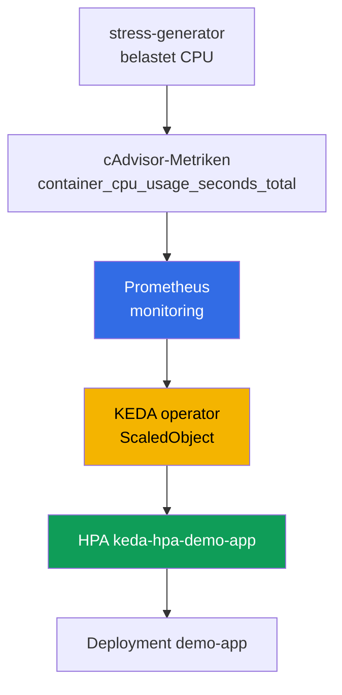
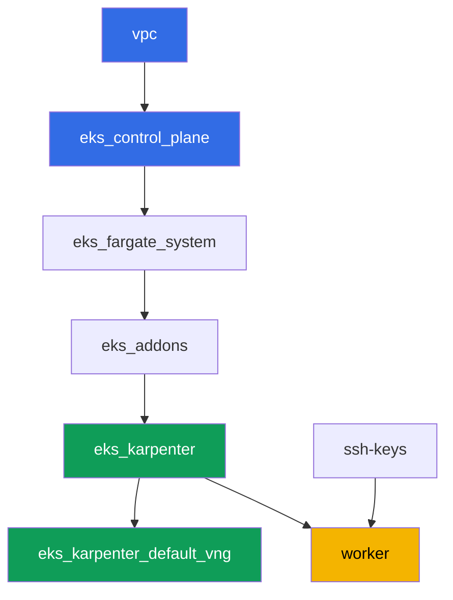

[Русская версия](README_RU.MD) · [Eng version](README.MD) · [Versión en español](README_ES.MD) · [Version française](README_FR.MD) · [ქართული ვერსია](README_GE.MD) · [繁體中文版](README_TW.MD) · [日本語版](README_JP.MD)

# Lab 124 - Autoskalierung von Anwendungen: HPA, KEDA, Prometheus

## Beschreibung

Der Cluster ist bereits als Code bereitgestellt. In dieser Lab setzen Sie einen
Monitoring-Stack und ereignisgesteuerte Autoskalierung darauf: Sie installieren
kube-prometheus-stack, installieren KEDA, erstellen ein Ziel-Deployment und konfigurieren
ein `ScaledObject` mit dem `prometheus`-Scaler. Unter der Haube ersetzt KEDA HPA nicht,
sondern erstellt und verwaltet ein normales HPA - Sie sehen das mit eigenen Augen über
`kubectl get hpa`. Danach erzeugen Sie CPU-Last auf den Ziel-Pods, beobachten das Wachsen
der Replikatanzahl, entfernen die Last wieder und bestätigen die Rückkehr zum Minimum.

Die Aufgaben sind im Produktionsstil geschrieben: eine kurze Beschreibung plus
Abnahmekriterien. Die Kontrolle erfolgt automatisch über den Befehl `check_result`.

## Ziel

Den Stoff aus dem Kurskapitel vertiefen:

- [Kapitel 35. Autoskalierung von Anwendungen: HPA, externe Metriken, KEDA](../../course/35/ru.md)

## Was wir erstellen

Der Cluster aus Lab 101 ist bereits bereitgestellt. In dieser Lab fügen Sie einen
Monitoring-Stack und eine Autoskalierungskette darauf hinzu.

| Objekt | Was es ist | Wozu es in dieser Lab dient |
|--------|---------|-------------------|
| Namespace `eks-124` | ein Clusterbereich für die Last dieser Lab | hält Ressourcen getrennt von den Systemressourcen |
| kube-prometheus-stack (`monitoring`) | Prometheus-Server | Metrikquelle für den KEDA-Scaler |
| KEDA (`keda`) | Operator und Metrics-Adapter | erstellt und verwaltet ein HPA anhand einer externen Metrik |
| Deployment `demo-app` | Skalierungsziel | wird vom `ScaledObject` referenziert |
| `ScaledObject` `demo-app` | KEDA-CRD mit dem `prometheus`-Scaler | beschreibt den Skalierungs-Trigger |
| HPA `keda-hpa-demo-app` | ein normales, von KEDA erstelltes HPA | sichtbarer Beweis, dass "KEDA HPA nicht ersetzt" |
| Deployment `stress-generator` | CPU-Last | lässt die Metrik wachsen, damit die Skalierung sichtbar wird |

Die entstehende Skalierungskette:



## Infrastruktur

Die Umgebung wird in AWS (`eu-central-1`) über Terragrunt bereitgestellt, genau wie in
Lab 101. Jedes Lab-Verzeichnis ist eine Komponente mit eigenem `terragrunt.hcl`, das auf
ein gemeinsames Modul in `terraform/modules/` verweist und Abhängigkeiten über
`dependency`-Blöcke deklariert. Terragrunt baut einen Abhängigkeitsgraphen und wendet die
Komponenten in der richtigen Reihenfolge an. Für diese Lab gibt es keine spezifischen
Terraform-Komponenten: KEDA, kube-prometheus-stack und die Last werden per Helm/kubectl
direkt von der Worker-Maschine im Rahmen der Aufgaben installiert.

### Module und Abhängigkeiten

| Verzeichnis (Komponente) | Modul (`terraform/modules/`) | Abhängig von | Was erstellt wird |
|---------------------|-------------------------------|------------|-------------|
| `vpc` | `vpc_v3` | - | VPC `10.10.0.0/16`, öffentliche und private Subnetze in zwei AZs, NAT |
| `ssh-keys` | `ssh-keys` | - | ein SSH-Schlüsselpaar für die Worker-Maschine und die Knoten |
| `eks_control_plane` | `eks_v2_control_plane` | `vpc` | EKS-Control-Plane `1.36`, OIDC, Security Groups |
| `eks_fargate_system` | `eks_v2_fargate` | `vpc`, `eks_control_plane` | Fargate-Profil für `kube-system` und `karpenter` |
| `eks_addons` | `eks_v2_addons` | `eks_control_plane`, `eks_fargate_system` | Add-ons coredns, kube-proxy, vpc-cni, pod-identity |
| `eks_karpenter` | `eks_v2_karpenter` | `vpc`, `eks_control_plane`, `eks_addons`, `eks_fargate_system` | Karpenter-Controller, IAM-Rolle der Knoten |
| `eks_karpenter_default_vng` | `eks_v2_karpenter_vng` | `vpc`, `eks_control_plane`, `eks_karpenter` | Standard-NodePool `default` und EC2NodeClass auf AL2023 |
| `worker` | `eks_v2_work_pc` | `ssh-keys`, `vpc`, `eks_control_plane`, `eks_karpenter` | Worker-Maschine mit kubectl, helm, Tests und `check_result` |

Abhängigkeitsgraph (was früher angewendet wird, steht weiter unten in der Pfeilrichtung):



Die Systempods laufen auf Fargate, die Worker-Knoten bringt Karpenter hoch. Der
Standard-NodePool ist auf `limits.cpu = 100` begrenzt, das reicht für
kube-prometheus-stack, KEDA, `demo-app` und einige Replikate von `stress-generator`
gleichzeitig.

Der NodePool dieser Lab unterscheidet sich von Lab 101 in zwei Einstellungen, und beide
sind beabsichtigt: Die Instanzen stammen aus den Kategorien `m`, `r`, `c` ab Größe
`large` (kleine Burstable-Knoten halten den Monitoring-Stack plus dauerhafte CPU-Last
nicht aus), und `consolidationPolicy` ist auf `WhenEmpty` gesetzt, damit die
Konsolidierung Prometheus während des Scale-down nicht umsiedelt. Eine ausführliche
Erklärung folgt nach dem Aufgabenblock.

### Wo was konfiguriert wird

`env.hcl` (gemeinsame Umgebungsparameter, von allen Komponenten gelesen):

| Parameter | Wert in der Lab | Was er beeinflusst |
|----------|-----------------|---------------|
| `region` | `eu-central-1` | Region aller Ressourcen |
| `vpc_default_cidr`, `subnets` | `10.10.0.0/16`, Subnetze pro AZ | Adressplan der VPC und Subnetz-Tags |
| `prefix` | `eks-task124` | Präfix für Ressourcennamen und Tags |
| `stack_name` | `eks124` | daraus wird `env_name` gebildet - der Clustername |
| `k8_version` | `1.36.0` | kubectl-Version auf der Worker-Maschine |
| `instance_type_worker` | `t3.medium` | Instanztyp der Worker-Maschine |
| `ssh_password_enable`, `access_cidrs` | `true`, `0.0.0.0/0` | SSH-Zugriff auf die Worker-Maschine |
| `root_volume` | `gp3`, `10` | Root-Datenträger der Worker-Maschine |

Die `inputs` im `terragrunt.hcl` jeder Komponente (Parameter des jeweiligen Moduls)
stimmen mit Lab 101 überein: Versionen von Control Plane und Add-ons für `1.36`,
Karpenter-Controller `1.8.1`, der Standard-NodePool mit unveränderten Limits. Nur
`test_url` und `task_script_url` in `worker/terragrunt.hcl` unterscheiden sich - sie
verweisen auf die Dateien dieser Lab (`labs/124/...`).

## Bereitstellung

```bash
TASK=124 make run_eks_task
```

Die Bereitstellung dauert etwa 15-20 Minuten. Suchen Sie in der Ausgabe die Zeile mit der
SSH-Verbindung zur Worker-Maschine und verbinden Sie sich damit. kubectl und helm sind dort
bereits konfiguriert.

Nützliche Befehle auf der Worker-Maschine:

```bash
time_left       # wie viel Umgebungszeit noch übrig ist
check_result    # die Lösung kontrollieren
```

> Zeit für Helm-Installationen. Die Installation von kube-prometheus-stack ist aufwendiger
> als ein gewöhnliches Deployment: Prometheus, kube-state-metrics, node-exporter und der
> Operator kommen alle hoch, was etwa 2-3 Minuten dauert, bis alle Pods bereit sind (die
> Lab schaltet Grafana und Alertmanager aus, siehe Aufgabe 2). KEDA installiert sich
> merklich schneller. Messungen vom Testaufbau: Die Replikate wachsen 60-90 Sekunden nach
> Laststart und kehren 5 Minuten nach dem Entfernen der Last zum Minimum zurück - das ist
> das Stabilisierungsfenster von HPA, Sie müssen warten.

> Sicherheit der Testumgebung. In `env.hcl` sind `ssh_password_enable = true` und
> `access_cidrs = ["0.0.0.0/0"]` aktiviert - praktisch für eine Lernumgebung, aber so
> sollte man es in der Produktion nicht machen. Nach den Kursstandards (Kapitel 0.2, 2, 19)
> wird der Zugriff auf Worker-Maschinen über AWS SSM Session Manager ohne öffentliche
> SSH-Ports geöffnet, und `access_cidrs` werden auf konkrete Adressen eingeschränkt. Hier
> bleibt öffentliches SSH nur zur Vereinfachung des Starts erhalten.

## Aufgaben

---
|        **1**        | **Namespace für die Last dieser Lab**                             |
| :-----------------: | :---------------------------------------------------------- |
| Was zu tun ist          | Erstellen Sie einen Namespace mit dem Namen `eks-124`. Alle Objekte der Lab werden darin erstellt. |
| Abnahmekriterien    | - Namespace `eks-124` existiert. |
---
|        **2**        | **Prometheus-Server für KEDA-Metriken**                       |
| :-----------------: | :---------------------------------------------------------- |
| Was zu tun ist          | Installieren Sie `kube-prometheus-stack` per Helm im Namespace `monitoring` (Repository `prometheus-community`). Die Lab braucht nur den Prometheus-Server, deaktivieren Sie also Grafana und Alertmanager, und geben Sie dem Prometheus-Pod explizite `requests` (`cpu: 200m`, `memory: 512Mi`) - warum das nötig ist, wird unter der Aufgabentabelle erklärt. Warten Sie, bis die Pods bereit sind: `kubectl get pods -n monitoring`. |
| Abnahmekriterien    | - Service `kube-prometheus-stack-prometheus` existiert in `monitoring`;<br/>- die Prometheus-Pods sind `Running` und `Ready`;<br/>- der Prometheus-Pod hat `requests` gesetzt, d.h. `qosClass` ist nicht `BestEffort`. |
---
|        **3**        | **Installation von KEDA**                                          |
| :-----------------: | :---------------------------------------------------------- |
| Was zu tun ist          | Installieren Sie KEDA per Helm im Namespace `keda` (Repository `kedacore`). Bestätigen Sie, dass `keda-operator` und `keda-operator-metrics-apiserver` `Running` sind. |
| Abnahmekriterien    | - Pods mit den Labels `app=keda-operator` und `app=keda-operator-metrics-apiserver` in `keda` sind `Running`. |
---
|        **4**        | **Skalierungsziel-Deployment**                  |
| :-----------------: | :---------------------------------------------------------- |
| Was zu tun ist          | Erstellen Sie im Namespace `eks-124` das Deployment `demo-app`, Image `viktoruj/ping_pong:latest`, `1` Replikat, mit gesetztem `resources.requests.cpu: "200m"` am Container. Dies ist das Objekt, das KEDA verwalten wird. |
| Abnahmekriterien    | - Deployment `demo-app` in `eks-124`, Image `viktoruj/ping_pong`;<br/>- `requests.cpu` ist gesetzt;<br/>- `1` bereites Replikat. |
---
|        **5**        | **ScaledObject mit dem prometheus-Scaler**                       |
| :-----------------: | :---------------------------------------------------------- |
| Was zu tun ist          | Erstellen Sie in `eks-124` ein `ScaledObject` `demo-app` mit `scaleTargetRef.name: demo-app`, `minReplicaCount: 1`, `maxReplicaCount: 5`. Trigger-Typ `prometheus`, `serverAddress` zeigt auf den Prometheus-Service in `monitoring` (Port `9090`), `query` berechnet die Gesamt-CPU-Nutzung der Last-Generator-Pods aus Aufgabe 6 über die cAdvisor-Metrik `container_cpu_usage_seconds_total` (`sum(rate(container_cpu_usage_seconds_total{namespace="eks-124",pod=~"stress-generator.*"}[1m]))`), wählen Sie einen sinnvollen `threshold` (z.B. `"0.1"`). Beachten Sie: `demo-app` skaliert anhand der Last FREMDER Pods - ein gewöhnliches CPU-basiertes HPA kann das nicht, genau darum geht es bei externen Metriken. Bestätigen Sie, dass KEDA das HPA `keda-hpa-demo-app` erstellt hat: `kubectl get hpa -A \| grep keda-hpa`. |
| Abnahmekriterien    | - `ScaledObject` `demo-app` in `eks-124` mit einem `prometheus`-Trigger;<br/>- HPA `keda-hpa-demo-app` existiert. |
---
|        **6**        | **Lasttest: Hochskalieren**                 |
| :-----------------: | :---------------------------------------------------------- |
| Was zu tun ist          | Speichern Sie `kubectl get hpa keda-hpa-demo-app -n eks-124` in die Datei `/var/work/tests/artifacts/6/hpa_before.txt`. Erstellen Sie das Deployment `stress-generator` in `eks-124`: Image `polinux/stress`, Befehl `stress --cpu 2`, `2` Replikate, eigenes Label `app=stress-generator`, `requests.cpu: 200m` und unbedingt `limits.cpu: 500m`, plus einen `nodeSelector` auf `kubernetes.io/arch: amd64`. Warum das Limit und der Selektor nötig sind, wird unter der Aufgabentabelle erklärt. Warten Sie 1-2 Minuten, bis die Metrik wächst und KEDA die Anzahl der `demo-app`-Replikate erhöht, speichern Sie dann `kubectl get hpa keda-hpa-demo-app -n eks-124` in die Datei `/var/work/tests/artifacts/6/hpa_after.txt`, sodass die Replikatanzahl darin größer als `1` ist. |
| Abnahmekriterien    | - Deployment `stress-generator` in `eks-124`, `2` Replikate, `limits.cpu` gesetzt;<br/>- Datei `6/hpa_before.txt` ist nicht leer;<br/>- Datei `6/hpa_after.txt` ist nicht leer und zeigt `REPLICAS` größer als `1`. |
---
|        **7**        | **Entfernen der Last: Herunterskalieren**                   |
| :-----------------: | :---------------------------------------------------------- |
| Was zu tun ist          | Löschen Sie das Deployment `stress-generator`. Die Metrik fällt fast sofort auf null (die Pod-Serien des Generators sind aus Prometheus verschwunden, KEDA meldet `0`), aber die Replikatanzahl bleibt bestehen: `stabilizationWindowSeconds` für scaleDown ist standardmäßig `300` Sekunden. Auf dem Testaufbau ging `TARGETS` nach 30 Sekunden auf null, und die Replikate kehrten nach 5 Minuten zu `1` zurück - das ist normales Verhalten, kein Hängenbleiben. Warten Sie, bis `REPLICAS` gleich `1` ist, und speichern Sie `kubectl get hpa keda-hpa-demo-app -n eks-124` in die Datei `/var/work/tests/artifacts/7/hpa_after_cooldown.txt`. |
| Abnahmekriterien    | - Deployment `stress-generator` ist gelöscht;<br/>- Datei `7/hpa_after_cooldown.txt` ist nicht leer und zeigt `REPLICAS` gleich `1`. |
---
|        **8**        | **Ein normales HPA im Vergleich zu einem von KEDA erstellten HPA**                 |
| :-----------------: | :---------------------------------------------------------- |
| Was zu tun ist          | Führen Sie `kubectl get hpa -A` aus und vergleichen Sie die Ausgabe mit dem, was Sie in den Aufgaben 5-7 gesehen haben. Speichern Sie in die Datei `/var/work/tests/artifacts/8/hpa_compare.txt` 2-3 Sätze: worin sich in dieser Ausgabe ein normales HPA von HPA `keda-hpa-demo-app` unterscheidet, und eine Erklärung, dass KEDA HPA nicht ersetzt, sondern es steuert, das heißt es `управляет` (verwaltet) es (erwähnen Sie die Wörter `HPA`, `KEDA`, `keda-hpa` und die Wurzel `управля`). |
| Abnahmekriterien    | - Datei `8/hpa_compare.txt` ist nicht leer;<br/>- enthält die Wörter `HPA`, `KEDA`, `keda-hpa` und die Wurzel "управля". |
---

### Warum requests, ein Limit und ein nodeSelector in den Aufgaben auftauchten

Die drei oben genannten Anforderungen wirken wie Kleinigkeiten, aber ohne sie fällt die
Lab auseinander, und alle drei sind typische Produktionsfallen, keine Eigenheiten des
Testaufbaus.

**Requests bei Prometheus und das Deaktivieren von Grafana und Alertmanager.**
Standardmäßig haben die Pods von `kube-prometheus-stack` weder `requests` noch `limits`,
ihre `qosClass` ist also `BestEffort`. Das hat zwei Folgen. Karpenter bemisst die
Knotengröße anhand der Summe der `requests` (Kapitel 12), weiß also nichts über den
Bedarf des Monitoring-Stacks und packt ihn auf die günstigste Instanz. Als Nächstes
kommt kubelet ins Spiel: Bei Speicherknappheit vertreibt es `BestEffort`-Pods zuerst
(Kapitel 14). Auf dem Testaufbau sah das so aus - der tatsächliche Verbrauch lag bei etwa
325 MiB für Grafana, etwa 264 MiB für Prometheus, etwa 750 MiB für den gesamten Stack,
und ein Knotenereignis:

```
Evicted  prometheus-kube-prometheus-stack-prometheus-0
The node was low on resource: memory. Threshold quantity: 45347Ki, available: 44068Ki
```

Prometheus wird vertrieben, seine Metrikhistorie im `emptyDir` geht damit verloren, und
`TARGETS` beim HPA zeigt `<unknown>/100m`. Die Lösung besteht aus genau zwei Dingen:
nicht das in die Lab schleppen, was sie nicht braucht (Grafana ist die schwerste
Komponente des Charts, und niemand öffnet hier seine Dashboards), und den Bedarf von
Prometheus explizit angeben, damit sowohl der Scheduler als auch Karpenter ihn sehen.

**CPU-Limit am Last-Generator.** `stress --cpu 2` über zwei Replikate sind vier
CPU-Worker, die sich alles nehmen, was sie bekommen können. Ohne `limits.cpu` entziehen
sie kubelet die CPU, der Knoten wird `NotReady`, Karpenter ersetzt ihn als ungesund, Pods
werden neu geplant, und das Experiment fällt auseinander. `limits.cpu: 500m` hält die
Last vorhersagbar: die cgroup drosselt den Container, der Generator liefert insgesamt
etwa einen Kern, die Metrik bleibt deutlich über dem Schwellenwert, und der Knoten bleibt
gesund.

**nodeSelector auf amd64.** Der NodePool dieser Lab erlaubt sowohl `amd64` als auch
`arm64`, und das Image `polinux/stress` ist nur für `amd64` gebaut (im Registry hat es
ein einzelnes Manifest, keine Plattformliste). Wenn Karpenter einen Graviton-Knoten
hochfährt, schlägt der Pod mit `exec format error` fehl. Das Image `viktoruj/ping_pong`
ist multi-arch, daher braucht `demo-app` keinen Selektor. Das ist eine allgemeine Regel:
In einer Flotte mit gemischter Architektur muss ein Single-Arch-Image einen Selektor
tragen (Kapitel 12 und 13).

Werfen Sie dabei auch einen Blick auf `disruption` im NodePool dieser Lab:
`consolidationPolicy` steht hier auf `WhenEmpty`, nicht auf
`WhenEmptyOrUnderutilized`. Der Grund ist derselbe - beim Scale-down würde aggressive
Konsolidierung Prometheus samt seiner Historie umsiedeln. Konsolidierung als Thema selbst
wird in Lab 123 behandelt.

## Kontrolle des Ergebnisses

Führen Sie auf der Worker-Maschine die automatische Kontrolle aus:

```bash
check_result
```

Die Tests 6 und 7 warten in zeitlich begrenzten Schleifen (bis zu einigen Minuten) auf
das Skalierungsergebnis, wundern Sie sich also nicht, wenn `check_result` länger als
gewöhnlich läuft.

## Lösung

Referenzlösung: [worker/files/solutions/1_DE.MD](worker/files/solutions/1_DE.MD)

## Löschen des Clusters und der Ressourcen

> **Entfernen Sie zuerst die Last und warten Sie, bis die EC2-Knoten verschwinden, erst
> dann reißen Sie die Umgebung ab.** Diese Lab erstellt keine AWS-Ressourcen von Hand,
> alles andere sind Kubernetes-Objekte, daher gibt es nur eine Gefahr: Wenn Sie den
> Cluster löschen, während die Last noch läuft, verschwindet der EC2-Knoten von Karpenter
> mit ihm, aber das sekundäre ENI von VPC CNI bleibt im Zustand `available` und hält die
> Security Group der Knoten fest. Dann hängt `destroy` bei
> `module.eks.aws_security_group.node[0]: Still destroying...` für Zig-Minuten fest.

```bash
# 1. Last und Skalierungskette entfernen (das ScaledObject verschwindet mit dem Namespace,
#    das HPA keda-hpa-demo-app löscht KEDA selbst)
kubectl delete namespace eks-124 --ignore-not-found

# 2. Monitoring-Stack und KEDA entfernen. Helm-Releases lassen keine AWS-Ressourcen
#    zurück: das Chart erstellt standardmäßig kein PVC (Prometheus hält Daten in
#    emptyDir), man kann das so kontrollieren
kubectl get pvc -A
helm uninstall kube-prometheus-stack -n monitoring
helm uninstall keda -n keda
kubectl delete namespace monitoring keda --ignore-not-found

# 3. Warten, bis Karpenter den NodeClaim und die EC2-Knoten entfernt (nur fargate-* sollten bleiben)
while kubectl get nodeclaims --no-headers 2>/dev/null | grep -q .; do
  echo "NodeClaim ist noch aktiv, warte..."; sleep 15
done
kubectl get nodes | grep -v fargate
```

Erst danach reißen Sie die Umgebung ab:

```bash
TASK=124 make delete_eks_task
```

Wenn `destroy` trotzdem an der Security Group der Knoten hängen bleibt, ist ein
verwaistes ENI übrig geblieben. Suchen und löschen Sie es:

```bash
aws ec2 describe-network-interfaces --filters Name=status,Values=available \
  --query 'NetworkInterfaces[?Tags[?Key==`eks:eni:owner`]].[NetworkInterfaceId,Description]' \
  --output table
aws ec2 delete-network-interface --network-interface-id <eni-id>
```

Die CRDs, die `kube-prometheus-stack` und KEDA zurücklassen (`prometheuses`,
`servicemonitors`, `scaledobjects` und weitere), müssen nicht separat entfernt werden -
der Cluster verschwindet vollständig. Wichtig ist das in einem anderen Szenario: Wird das
Chart in einem laufenden Cluster neu installiert, entfernt `helm uninstall` diese CRDs
nicht.
