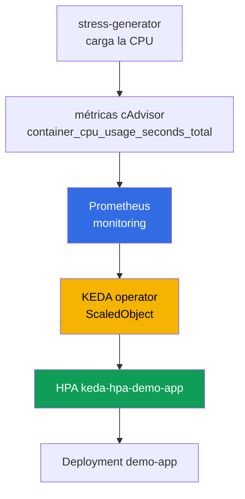
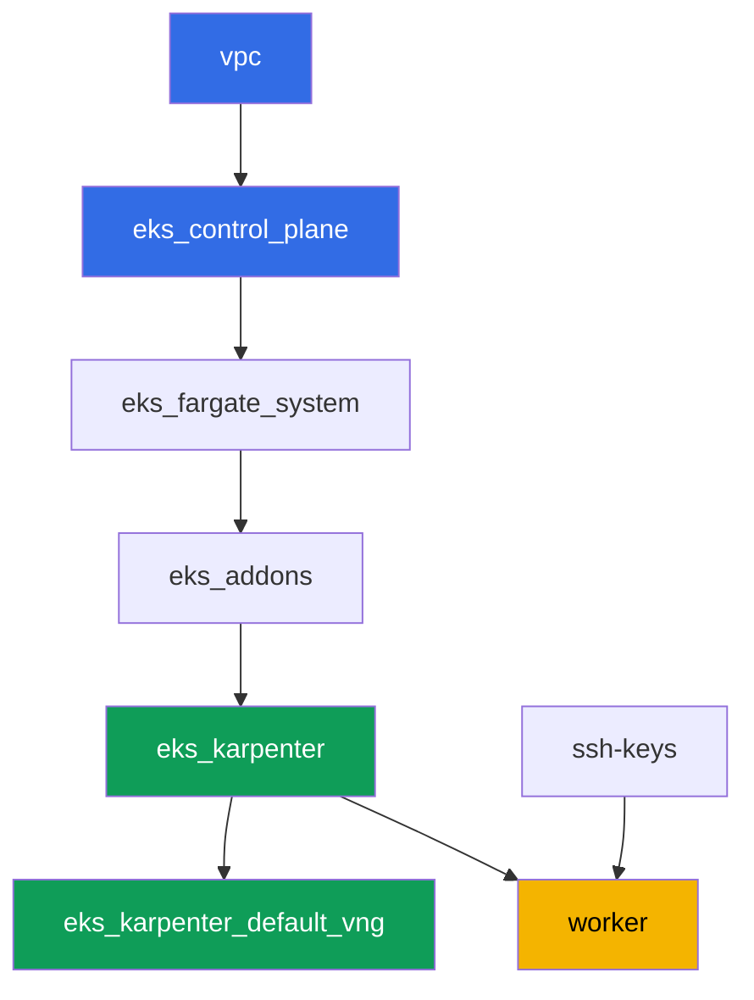

[Русская версия](README_RU.MD) · [Eng version](README.MD) · [Version française](README_FR.MD) · [Deutsche Version](README_DE.MD) · [ქართული ვერსია](README_GE.MD) · [繁體中文版](README_TW.MD) · [日本語版](README_JP.MD)

# Lab 124 - Autoescalado de aplicaciones: HPA, KEDA, Prometheus

## Descripción

El clúster ya está desplegado como código. En este laboratorio pones encima un stack de
monitorización y autoescalado dirigido por eventos: despliegas kube-prometheus-stack,
instalas KEDA, creas un Deployment objetivo y configuras un `ScaledObject` con el scaler
`prometheus`. Por debajo, KEDA no sustituye a HPA, sino que crea y gestiona un HPA normal -
lo verás con tus propios ojos mediante `kubectl get hpa`. A continuación cargas la CPU de
los pods objetivo, observas crecer el número de réplicas, retiras la carga y confirmas el
regreso al mínimo.

Las tareas están escritas en estilo de producción: un enunciado breve más criterios de
aceptación. La verificación es automática, mediante el comando `check_result`.

## Objetivo

Reforzar el material del capítulo del curso:

- [Capítulo 35. Autoescalado de aplicaciones: HPA, métricas externas,
  KEDA](../../course/35/ru.md)

## Qué vamos a crear

El clúster del laboratorio 101 ya está desplegado. En este laboratorio añades un stack de
monitorización y una cadena de autoescalado encima de él.

| Objeto | Qué es | Por qué está en este laboratorio |
|--------|---------|-------------------|
| Namespace `eks-124` | una sección del clúster para la carga del laboratorio | mantiene los recursos separados de los del sistema |
| kube-prometheus-stack (`monitoring`) | servidor Prometheus | fuente de métricas para el scaler de KEDA |
| KEDA (`keda`) | operator y metrics adapter | crea y gestiona un HPA a partir de una métrica externa |
| Deployment `demo-app` | objetivo de escalado | referenciado por el `ScaledObject` |
| `ScaledObject` `demo-app` | CRD de KEDA con el scaler `prometheus` | describe el disparador de escalado |
| HPA `keda-hpa-demo-app` | un HPA normal creado por KEDA | prueba visible de que "KEDA no sustituye a HPA" |
| Deployment `stress-generator` | carga de CPU | hace crecer la métrica para poder ver el escalado |

La cadena de escalado resultante:



## Infraestructura

El entorno se despliega en AWS (`eu-central-1`) mediante Terragrunt, igual que en el
laboratorio 101. Cada carpeta del laboratorio es un componente con su propio
`terragrunt.hcl`, que hace referencia a un módulo compartido en `terraform/modules/` y
declara sus dependencias mediante bloques `dependency`. Terragrunt construye un grafo de
dependencias y aplica los componentes en el orden correcto. No hay componentes de terraform
específicos de este laboratorio: KEDA, kube-prometheus-stack y la carga se instalan
mediante Helm/kubectl directamente desde la máquina de trabajo como parte de las tareas.

### Módulos y dependencias

| Carpeta (componente) | Módulo (`terraform/modules/`) | Depende de | Qué crea |
|---------------------|-------------------------------|------------|-------------|
| `vpc` | `vpc_v3` | - | VPC `10.10.0.0/16`, subredes públicas y privadas en dos AZ, NAT |
| `ssh-keys` | `ssh-keys` | - | un par de claves SSH para la máquina de trabajo y los nodos |
| `eks_control_plane` | `eks_v2_control_plane` | `vpc` | control plane de EKS `1.36`, OIDC, security groups |
| `eks_fargate_system` | `eks_v2_fargate` | `vpc`, `eks_control_plane` | perfil de Fargate para `kube-system` y `karpenter` |
| `eks_addons` | `eks_v2_addons` | `eks_control_plane`, `eks_fargate_system` | add-ons de coredns, kube-proxy, vpc-cni, pod-identity |
| `eks_karpenter` | `eks_v2_karpenter` | `vpc`, `eks_control_plane`, `eks_addons`, `eks_fargate_system` | controlador de Karpenter, rol IAM de los nodos |
| `eks_karpenter_default_vng` | `eks_v2_karpenter_vng` | `vpc`, `eks_control_plane`, `eks_karpenter` | NodePool por defecto `default` y EC2NodeClass sobre AL2023 |
| `worker` | `eks_v2_work_pc` | `ssh-keys`, `vpc`, `eks_control_plane`, `eks_karpenter` | máquina de trabajo con kubectl, helm, tests y `check_result` |

Grafo de dependencias (lo que se aplica antes está más abajo en la flecha):



Los pods de sistema van a Fargate, los nodos de trabajo los levanta Karpenter. El NodePool
por defecto está limitado a `limits.cpu = 100`, lo cual es suficiente para
kube-prometheus-stack, KEDA, `demo-app` y un par de réplicas de `stress-generator` al mismo
tiempo.

El NodePool de este laboratorio se diferencia del laboratorio 101 en dos ajustes, y ambos
son intencionados: las instancias se toman de las categorías `m`, `r`, `c` de tamaño
`large` en adelante (los nodos burstable pequeños no soportan el stack de monitorización
más una carga de CPU sostenida), y `consolidationPolicy` está fijada en `WhenEmpty` para
que la consolidación no reubique Prometheus durante el scale-down. Una explicación
detallada sigue al bloque de tareas.

### Dónde se configura cada cosa

`env.hcl` (parámetros compartidos del entorno, leídos por todos los componentes):

| Parámetro | Valor en el laboratorio | Qué afecta |
|----------|-----------------|---------------|
| `region` | `eu-central-1` | región de todos los recursos |
| `vpc_default_cidr`, `subnets` | `10.10.0.0/16`, subredes por AZ | plan de direcciones de la VPC y etiquetas de subredes |
| `prefix` | `eks-task124` | prefijo de nombres de recursos y etiquetas |
| `stack_name` | `eks124` | con él se construye `env_name`, el nombre del clúster |
| `k8_version` | `1.36.0` | versión de kubectl en la máquina de trabajo |
| `instance_type_worker` | `t3.medium` | tipo de instancia de la máquina de trabajo |
| `ssh_password_enable`, `access_cidrs` | `true`, `0.0.0.0/0` | acceso SSH a la máquina de trabajo |
| `root_volume` | `gp3`, `10` | disco raíz de la máquina de trabajo |

Los `inputs` en el `terragrunt.hcl` de cada componente (ajustes propios de ese módulo)
coinciden con el laboratorio 101: versiones de control plane y add-ons para `1.36`,
controlador de Karpenter `1.8.1`, NodePool por defecto sin cambios en los límites. Solo
`test_url` y `task_script_url` en `worker/terragrunt.hcl` son distintos - apuntan a los
archivos de este laboratorio (`labs/124/...`).

## Despliegue

```bash
TASK=124 make run_eks_task
```

El despliegue tarda aproximadamente 15-20 minutos. En la salida, busca la línea con la
conexión SSH a la máquina de trabajo y conéctate a ella. kubectl y helm ya están
configurados allí.

Comandos útiles en la máquina de trabajo:

```bash
time_left       # cuánto tiempo queda del entorno
check_result    # verificar la solución
```

> Tiempo para las instalaciones de Helm. Instalar kube-prometheus-stack es más pesado que
> un Deployment normal: se levantan Prometheus, kube-state-metrics, node-exporter y el
> operator, lo cual tarda aproximadamente 2-3 minutos hasta que todos los pods están listos
> (el laboratorio desactiva Grafana y Alertmanager, ver tarea 2). KEDA se instala
> notablemente más rápido. Mediciones del banco de pruebas: las réplicas crecen entre 60 y
> 90 segundos después de iniciar la carga, y vuelven al mínimo 5 minutos después de
> retirarla - esa es la ventana de estabilización de HPA, tendrás que esperar.

> Seguridad del entorno. En `env.hcl` están activados `ssh_password_enable = true` y
> `access_cidrs = ["0.0.0.0/0"]` - cómodo para un entorno de formación, pero no es algo que
> se deba hacer en producción. Según los estándares del curso (capítulos 0.2, 2, 19), el
> acceso a las máquinas de trabajo se abre mediante AWS SSM Session Manager sin puertos SSH
> públicos hacia el exterior, y `access_cidrs` se restringe a direcciones concretas. Aquí se
> deja SSH público solo para simplificar la puesta en marcha.

## Tareas

---
|        **1**        | **Namespace para la carga del laboratorio**                             |
| :-----------------: | :---------------------------------------------------------- |
| Qué hacemos          | Crea un namespace llamado `eks-124`. Todos los objetos de este laboratorio se crean dentro de él. |
| Criterios de aceptación    | - el namespace `eks-124` existe. |
---
|        **2**        | **Servidor Prometheus para las métricas de KEDA**                       |
| :-----------------: | :---------------------------------------------------------- |
| Qué hacemos          | Instala `kube-prometheus-stack` mediante Helm en el namespace `monitoring` (repositorio `prometheus-community`). El laboratorio solo necesita el servidor Prometheus, así que desactiva Grafana y Alertmanager, y asigna al pod de Prometheus `requests` explícitos (`cpu: 200m`, `memory: 512Mi`) - por qué es necesario se explica debajo de la tabla de tareas. Espera a que los pods estén listos: `kubectl get pods -n monitoring`. |
| Criterios de aceptación    | - el Service `kube-prometheus-stack-prometheus` existe en `monitoring`;<br/>- los pods de Prometheus están `Running` y `Ready`;<br/>- el pod de Prometheus tiene `requests` definidos, es decir, `qosClass` no es `BestEffort`. |
---
|        **3**        | **Instalación de KEDA**                                          |
| :-----------------: | :---------------------------------------------------------- |
| Qué hacemos          | Instala KEDA mediante Helm en el namespace `keda` (repositorio `kedacore`). Confirma que `keda-operator` y `keda-operator-metrics-apiserver` están `Running`. |
| Criterios de aceptación    | - los pods con las labels `app=keda-operator` y `app=keda-operator-metrics-apiserver` en `keda` están `Running`. |
---
|        **4**        | **Deployment objetivo de escalado**                  |
| :-----------------: | :---------------------------------------------------------- |
| Qué hacemos          | En el namespace `eks-124`, crea el Deployment `demo-app`, imagen `viktoruj/ping_pong:latest`, `1` réplica, con `resources.requests.cpu: "200m"` definido en el contenedor. Este es el objeto que gestionará KEDA. |
| Criterios de aceptación    | - Deployment `demo-app` en `eks-124`, imagen `viktoruj/ping_pong`;<br/>- `requests.cpu` definido;<br/>- `1` réplica lista. |
---
|        **5**        | **ScaledObject con el scaler prometheus**                       |
| :-----------------: | :---------------------------------------------------------- |
| Qué hacemos          | En `eks-124`, crea el `ScaledObject` `demo-app` con `scaleTargetRef.name: demo-app`, `minReplicaCount: 1`, `maxReplicaCount: 5`. Tipo de disparador `prometheus`, `serverAddress` apuntando al Service de Prometheus en `monitoring` (puerto `9090`), `query` que calcula el uso total de CPU de los pods del generador de carga de la tarea 6 mediante la métrica de cAdvisor `container_cpu_usage_seconds_total` (`sum(rate(container_cpu_usage_seconds_total{namespace="eks-124",pod=~"stress-generator.*"}[1m]))`), elige un `threshold` razonable (por ejemplo `"0.1"`). Nota: `demo-app` escala según la carga de pods AJENOS - un HPA normal basado en CPU no puede hacer esto, y ese es precisamente el sentido de las métricas externas. Confirma que KEDA creó el HPA `keda-hpa-demo-app`: `kubectl get hpa -A \| grep keda-hpa`. |
| Criterios de aceptación    | - `ScaledObject` `demo-app` en `eks-124` con un disparador `prometheus`;<br/>- existe el HPA `keda-hpa-demo-app`. |
---
|        **6**        | **Prueba de carga: escalado hacia arriba**                 |
| :-----------------: | :---------------------------------------------------------- |
| Qué hacemos          | Guarda `kubectl get hpa keda-hpa-demo-app -n eks-124` en el archivo `/var/work/tests/artifacts/6/hpa_before.txt`. Crea el Deployment `stress-generator` en `eks-124`: imagen `polinux/stress`, comando `stress --cpu 2`, `2` réplicas, con su propia label `app=stress-generator`, `requests.cpu: 200m` y, de forma crítica, `limits.cpu: 500m`, más un `nodeSelector` en `kubernetes.io/arch: amd64`. Por qué son necesarios el límite y el selector se explica debajo de la tabla de tareas. Espera 1-2 minutos a que la métrica crezca y KEDA aumente el número de réplicas de `demo-app`, luego guarda `kubectl get hpa keda-hpa-demo-app -n eks-124` en el archivo `/var/work/tests/artifacts/6/hpa_after.txt` de forma que el número de réplicas en él sea mayor que `1`. |
| Criterios de aceptación    | - Deployment `stress-generator` en `eks-124`, `2` réplicas, con `limits.cpu` definido;<br/>- el archivo `6/hpa_before.txt` no está vacío;<br/>- el archivo `6/hpa_after.txt` no está vacío y muestra `REPLICAS` mayor que `1`. |
---
|        **7**        | **Retirada de la carga: escalado hacia abajo**                   |
| :-----------------: | :---------------------------------------------------------- |
| Qué hacemos          | Elimina el Deployment `stress-generator`. La métrica cae a cero casi de inmediato (las series de los pods del generador desaparecen de Prometheus, KEDA reporta `0`), pero el número de réplicas se mantiene: `stabilizationWindowSeconds` para scaleDown es `300` segundos por defecto. En el banco de pruebas, `TARGETS` llegó a cero a los 30 segundos, y las réplicas volvieron a `1` a los 5 minutos - ese es un comportamiento normal, no un bloqueo. Espera a que `REPLICAS` sea igual a `1` y guarda `kubectl get hpa keda-hpa-demo-app -n eks-124` en el archivo `/var/work/tests/artifacts/7/hpa_after_cooldown.txt`. |
| Criterios de aceptación    | - el Deployment `stress-generator` está eliminado;<br/>- el archivo `7/hpa_after_cooldown.txt` no está vacío y muestra `REPLICAS` igual a `1`. |
---
|        **8**        | **HPA normal frente a HPA creado por KEDA**                 |
| :-----------------: | :---------------------------------------------------------- |
| Qué hacemos          | Ejecuta `kubectl get hpa -A` y compara la salida con lo que viste en las tareas 5-7. Guarda en el archivo `/var/work/tests/artifacts/8/hpa_compare.txt` 2-3 frases: en qué se diferencia un HPA normal del HPA `keda-hpa-demo-app` en esta salida, y una explicación de que KEDA no sustituye a HPA, sino que lo controla (`control`) (menciona las palabras `HPA`, `KEDA`, `keda-hpa` y `control`). |
| Criterios de aceptación    | - el archivo `8/hpa_compare.txt` no está vacío;<br/>- contiene las palabras `HPA`, `KEDA`, `keda-hpa` y `control`. |
---

### Por qué aparecieron requests, un límite y un nodeSelector en las tareas

Los tres requisitos anteriores parecen detalles menores, pero sin ellos el laboratorio se
desmorona, y los tres son trampas típicas de producción, no peculiaridades del banco de
pruebas.

**Requests en Prometheus y Grafana/Alertmanager desactivados.** Por defecto, los pods de
`kube-prometheus-stack` no tienen ni `requests` ni `limits`, así que su `qosClass` es
`BestEffort`. Esto tiene dos consecuencias. Karpenter dimensiona el nodo según la suma de
`requests` (capítulo 12), así que no sabe nada de las necesidades del stack de
monitorización y lo empaqueta en la instancia más barata. Después entra kubelet: bajo
presión de memoria, expulsa primero los pods `BestEffort` (capítulo 14). En el banco de
pruebas esto se veía así - el uso real fue de aproximadamente 325 MiB para Grafana,
aproximadamente 264 MiB para Prometheus, aproximadamente 750 MiB para todo el stack, y un
evento del nodo:

```
Evicted  prometheus-kube-prometheus-stack-prometheus-0
The node was low on resource: memory. Threshold quantity: 45347Ki, available: 44068Ki
```

Prometheus es expulsado, junto con él se pierde el historial de la métrica en `emptyDir`, y
`TARGETS` del HPA muestra `<unknown>/100m`. La solución consta exactamente de dos cosas: no
arrastrar al laboratorio lo que no necesita (Grafana es el componente más pesado del chart,
y aquí nadie abre sus dashboards), y declarar explícitamente las necesidades de Prometheus
para que las vea tanto el scheduler como Karpenter.

**Límite de CPU en el generador de carga.** `stress --cpu 2` en dos réplicas son cuatro
workers de CPU que tomarán todo lo que puedan. Sin `limits.cpu` le quitan CPU a kubelet, el
nodo pasa a `NotReady`, Karpenter lo reemplaza por no estar saludable, los pods se
reprograman, y el experimento se desmorona. `limits.cpu: 500m` mantiene la carga
predecible: el cgroup frena el contenedor, el generador produce en total aproximadamente un
núcleo, la métrica se mantiene cómodamente por encima del umbral, y el nodo permanece con
vida.

**nodeSelector en amd64.** El NodePool de este laboratorio permite tanto `amd64` como
`arm64`, y la imagen `polinux/stress` solo está construida para `amd64` (en el registro
tiene un único manifiesto, sin lista de plataformas). Si Karpenter levanta un nodo Graviton,
el pod falla con `exec format error`. La imagen `viktoruj/ping_pong` es
multi-arquitectura, por lo que `demo-app` no necesita selector. Esta es una regla general:
en una flota con arquitecturas mixtas, una imagen de una sola arquitectura debe llevar un
selector (capítulos 12 y 13).

Aprovecha para mirar `disruption` en el NodePool de este laboratorio: `consolidationPolicy`
aquí es `WhenEmpty`, no `WhenEmptyOrUnderutilized`. La razón es la misma - durante el
scale-down, la consolidación agresiva empieza a reubicar Prometheus junto con su historial.
La consolidación en sí como tema se trata en el laboratorio 123.

## Comprobación del resultado

En la máquina de trabajo, ejecuta la verificación automática:

```bash
check_result
```

Las pruebas 6 y 7 esperan el resultado del escalado en bucles con límite de tiempo (hasta
unos minutos), así que no te sorprendas si `check_result` tarda más de lo habitual.

## Solución

Solución de referencia: [worker/files/solutions/1_ES.MD](worker/files/solutions/1_ES.MD)

## Eliminación del clúster y los recursos

> **Primero retira la carga y espera a que se vayan los nodos EC2, luego destruye el
> entorno.** Este laboratorio no crea recursos de AWS a mano, todo lo demás son objetos de
> Kubernetes, así que hay un solo peligro: si eliminas el clúster con la carga aún en
> marcha, el nodo EC2 de Karpenter se va con él, pero el ENI secundario de VPC CNI queda en
> estado `available` y retiene el security group de los nodos. Entonces `destroy` se queda
> colgado en `module.eks.aws_security_group.node[0]: Still destroying...` durante decenas de
> minutos.

```bash
# 1. Retirar la carga y la cadena de escalado (el ScaledObject se va junto con el
#    namespace, KEDA eliminará el HPA keda-hpa-demo-app por sí sola)
kubectl delete namespace eks-124 --ignore-not-found

# 2. Retirar el stack de monitorización y KEDA. Los releases de Helm no dejan recursos de
#    AWS: el chart no crea un PVC por defecto (Prometheus guarda los datos en emptyDir),
#    puedes comprobarlo así
kubectl get pvc -A
helm uninstall kube-prometheus-stack -n monitoring
helm uninstall keda -n keda
kubectl delete namespace monitoring keda --ignore-not-found

# 3. Esperar a que Karpenter elimine el NodeClaim y los nodos EC2 (solo deben quedar
#    fargate-*)
while kubectl get nodeclaims --no-headers 2>/dev/null | grep -q .; do
  echo "El NodeClaim sigue vivo, esperando..."; sleep 15
done
kubectl get nodes | grep -v fargate
```

Solo después de esto, destruye el entorno:

```bash
TASK=124 make delete_eks_task
```

Si `destroy` sigue atascándose en el security group de los nodos, significa que queda un
ENI huérfano. Búscalo y elimínalo:

```bash
aws ec2 describe-network-interfaces --filters Name=status,Values=available \
  --query 'NetworkInterfaces[?Tags[?Key==`eks:eni:owner`]].[NetworkInterfaceId,Description]' \
  --output table
aws ec2 delete-network-interface --network-interface-id <eni-id>
```

Los CRD que dejan atrás `kube-prometheus-stack` y KEDA (`prometheuses`, `servicemonitors`,
`scaledobjects` y otros) no necesitan eliminarse por separado - el clúster desaparece por
completo. Vale la pena recordarlos en otro escenario: si el chart se reinstala en un clúster
en marcha, `helm uninstall` no elimina estos CRD.
