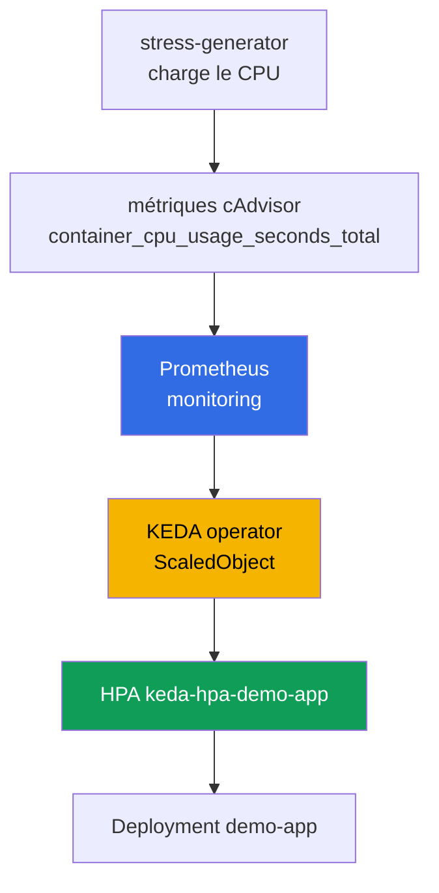
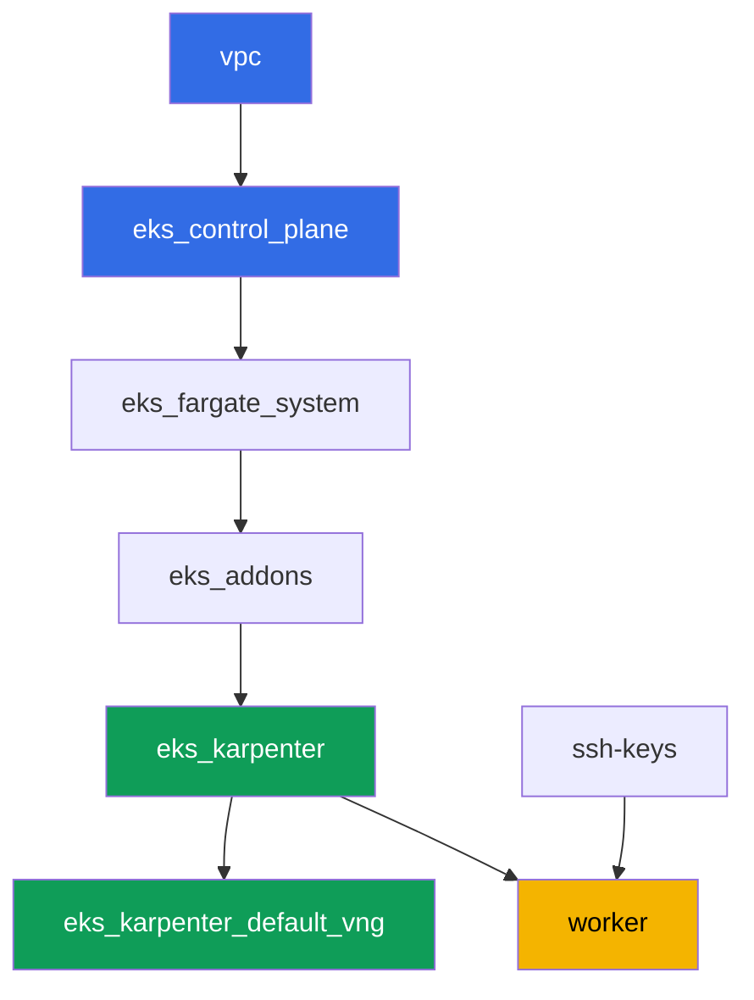

[Русская версия](README_RU.MD) · [Eng version](README.MD) · [Versión en español](README_ES.MD) · [Deutsche Version](README_DE.MD) · [ქართული ვერსია](README_GE.MD) · [繁體中文版](README_TW.MD) · [日本語版](README_JP.MD)

# Lab 124 - Autoscaling des applications : HPA, KEDA, Prometheus

## Description

Le cluster est déjà déployé sous forme de code. Dans cette lab, vous installez par-dessus
une stack de monitoring et l'autoscaling piloté par événements : vous déployez
kube-prometheus-stack, installez KEDA, créez un Deployment cible et configurez un
`ScaledObject` avec le scaler `prometheus`. Sous le capot, KEDA ne remplace pas HPA, il crée
et gère un HPA classique - vous le constaterez vous-même via `kubectl get hpa`. Ensuite,
vous chargez le CPU des pods cibles, observez la croissance du nombre de réplicas, retirez
la charge et confirmez le retour au minimum.

Les tâches sont rédigées dans un style production : un énoncé court plus des critères
d'acceptation. La vérification est automatique, via la commande `check_result`.

## Objectif

Consolider la matière du chapitre du cours :

- [Chapitre 35. Autoscaling des applications : HPA, métriques externes, KEDA](../../course/35/fr.md)

## Ce que nous créons

Le cluster de la lab 101 est déjà déployé. Dans cette lab, vous ajoutez par-dessus une
stack de monitoring et une chaîne d'autoscaling.

| Objet | Ce que c'est | Pourquoi dans cette lab |
|--------|---------|-------------------|
| Namespace `eks-124` | une section du cluster pour la charge de la lab | garde les ressources séparées des ressources système |
| kube-prometheus-stack (`monitoring`) | serveur Prometheus | source de métrique pour le scaler KEDA |
| KEDA (`keda`) | operator et metrics adapter | crée et gère un HPA piloté par une métrique externe |
| Deployment `demo-app` | cible du scaling | référencé par le `ScaledObject` |
| `ScaledObject` `demo-app` | CRD KEDA avec le scaler `prometheus` | décrit le déclencheur de scaling |
| HPA `keda-hpa-demo-app` | un HPA classique créé par KEDA | preuve visible que « KEDA ne remplace pas HPA » |
| Deployment `stress-generator` | charge CPU | fait croître la métrique pour observer le scaling |

La chaîne de scaling qui en résulte :



## Infrastructure

L'environnement est déployé sur AWS (`eu-central-1`) via Terragrunt, comme dans la lab 101.
Chaque répertoire de lab est un composant avec son propre `terragrunt.hcl`, qui référence un
module partagé dans `terraform/modules/` et déclare ses dépendances via des blocs
`dependency`. Terragrunt construit un graphe de dépendances et applique les composants dans
le bon ordre. Cette lab ne contient aucun composant terraform spécifique : KEDA,
kube-prometheus-stack et la charge sont installés via Helm/kubectl directement depuis la
machine worker dans le cadre des tâches.

### Modules et dépendances

| Répertoire (composant) | Module (`terraform/modules/`) | Dépend de | Ce qu'il crée |
|---------------------|-------------------------------|------------|-------------|
| `vpc` | `vpc_v3` | - | VPC `10.10.0.0/16`, sous-réseaux publics et privés dans deux AZ, NAT |
| `ssh-keys` | `ssh-keys` | - | une paire de clés SSH pour la machine worker et les nœuds |
| `eks_control_plane` | `eks_v2_control_plane` | `vpc` | control plane EKS `1.36`, OIDC, security groups |
| `eks_fargate_system` | `eks_v2_fargate` | `vpc`, `eks_control_plane` | profil Fargate pour `kube-system` et `karpenter` |
| `eks_addons` | `eks_v2_addons` | `eks_control_plane`, `eks_fargate_system` | add-ons coredns, kube-proxy, vpc-cni, pod-identity |
| `eks_karpenter` | `eks_v2_karpenter` | `vpc`, `eks_control_plane`, `eks_addons`, `eks_fargate_system` | contrôleur Karpenter, rôle IAM des nœuds |
| `eks_karpenter_default_vng` | `eks_v2_karpenter_vng` | `vpc`, `eks_control_plane`, `eks_karpenter` | NodePool par défaut `default` et EC2NodeClass sur AL2023 |
| `worker` | `eks_v2_work_pc` | `ssh-keys`, `vpc`, `eks_control_plane`, `eks_karpenter` | machine worker avec kubectl, helm, tests et `check_result` |

Graphe de dépendances (ce qui est appliqué en premier se trouve plus bas dans la flèche) :



Les pods système tournent sur Fargate, les nœuds worker sont créés par Karpenter. Le
NodePool par défaut est limité à `limits.cpu = 100`, ce qui suffit pour
kube-prometheus-stack, KEDA, `demo-app` et quelques réplicas de `stress-generator` en même
temps.

Le NodePool de cette lab diffère de celui de la lab 101 sur deux réglages, et les deux sont
intentionnels : les instances sont prises dans les catégories `m`, `r`, `c` de taille
`large` et plus (les petits nœuds burstable ne supportent pas la stack de monitoring plus
une charge CPU soutenue), et `consolidationPolicy` est réglée sur `WhenEmpty` pour que la
consolidation ne déplace pas Prometheus pendant le scale-down. Une explication détaillée
suit le bloc des tâches.

### Où les choses sont configurées

`env.hcl` (paramètres d'environnement partagés, lus par tous les composants) :

| Paramètre | Valeur dans la lab | Ce qu'il affecte |
|----------|-----------------|---------------|
| `region` | `eu-central-1` | région de toutes les ressources |
| `vpc_default_cidr`, `subnets` | `10.10.0.0/16`, sous-réseaux par AZ | plan d'adressage de la VPC et tags des sous-réseaux |
| `prefix` | `eks-task124` | préfixe des noms de ressources et des tags |
| `stack_name` | `eks124` | utilisé pour construire `env_name` - le nom du cluster |
| `k8_version` | `1.36.0` | version de kubectl sur la machine worker |
| `instance_type_worker` | `t3.medium` | type d'instance de la machine worker |
| `ssh_password_enable`, `access_cidrs` | `true`, `0.0.0.0/0` | accès SSH à la machine worker |
| `root_volume` | `gp3`, `10` | disque racine de la machine worker |

Les `inputs` dans le `terragrunt.hcl` de chaque composant (paramètres propres à ce module)
correspondent à la lab 101 : versions du control plane et des add-ons pour `1.36`,
contrôleur Karpenter `1.8.1`, NodePool par défaut sans changement des limites. Seuls
`test_url` et `task_script_url` dans `worker/terragrunt.hcl` diffèrent - ils pointent vers
les fichiers de cette lab (`labs/124/...`).

## Déploiement

```bash
TASK=124 make run_eks_task
```

Le déploiement prend environ 15-20 minutes. Dans la sortie, trouvez la ligne avec la
connexion SSH à la machine worker et connectez-vous. kubectl et helm y sont déjà configurés.

Commandes utiles sur la machine worker :

```bash
time_left       # temps restant de l'environnement
check_result    # vérifier la solution
```

> Temps pour les installations Helm. L'installation de kube-prometheus-stack est plus
> lourde qu'un Deployment classique : Prometheus, kube-state-metrics, node-exporter et
> l'operator démarrent tous, ce qui prend environ 2-3 minutes avant que tous les pods soient
> prêts (la lab désactive Grafana et Alertmanager, voir tâche 2). KEDA s'installe nettement
> plus vite. Mesures sur le banc de test : les réplicas croissent 60-90 secondes après le
> début de la charge, et reviennent au minimum 5 minutes après son retrait - c'est la
> fenêtre de stabilisation du HPA, il faudra patienter.

> Sécurité de l'environnement. `env.hcl` active `ssh_password_enable = true` et
> `access_cidrs = ["0.0.0.0/0"]` - pratique pour un environnement de formation, mais à
> proscrire en production. Selon les standards du cours (chapitres 0.2, 2, 19), l'accès aux
> machines worker doit passer par AWS SSM Session Manager sans exposer de ports SSH publics,
> et `access_cidrs` doit être restreint à des adresses précises. Ici, le SSH public est
> laissé uniquement pour simplifier le démarrage.

## Tâches

---
|        **1**        | **Namespace pour la charge de la lab**                             |
| :-----------------: | :---------------------------------------------------------- |
| Ce qu'on fait          | Créez un namespace nommé `eks-124`. Tous les objets de cette lab sont créés à l'intérieur. |
| Critères d'acceptation    | - le namespace `eks-124` existe. |
---
|        **2**        | **Serveur Prometheus pour les métriques de KEDA**                       |
| :-----------------: | :---------------------------------------------------------- |
| Ce qu'on fait          | Installez `kube-prometheus-stack` via Helm dans le namespace `monitoring` (dépôt `prometheus-community`). La lab n'a besoin que du serveur Prometheus, donc désactivez Grafana et Alertmanager, et donnez au pod Prometheus des `requests` explicites (`cpu: 200m`, `memory: 512Mi`) - la raison est expliquée sous le tableau des tâches. Attendez que les pods soient prêts : `kubectl get pods -n monitoring`. |
| Critères d'acceptation    | - le Service `kube-prometheus-stack-prometheus` existe dans `monitoring`;<br/>- les pods Prometheus sont `Running` et `Ready`;<br/>- le pod Prometheus a des `requests` définies, c'est-à-dire que `qosClass` n'est pas `BestEffort`. |
---
|        **3**        | **Installation de KEDA**                                          |
| :-----------------: | :---------------------------------------------------------- |
| Ce qu'on fait          | Installez KEDA via Helm dans le namespace `keda` (dépôt `kedacore`). Confirmez que `keda-operator` et `keda-operator-metrics-apiserver` sont `Running`. |
| Critères d'acceptation    | - les pods avec les labels `app=keda-operator` et `app=keda-operator-metrics-apiserver` dans `keda` sont `Running`. |
---
|        **4**        | **Deployment cible du scaling**                  |
| :-----------------: | :---------------------------------------------------------- |
| Ce qu'on fait          | Dans le namespace `eks-124`, créez le Deployment `demo-app`, image `viktoruj/ping_pong:latest`, `1` réplica, conteneur avec `resources.requests.cpu: "200m"` défini. C'est l'objet que KEDA va gérer. |
| Critères d'acceptation    | - Deployment `demo-app` dans `eks-124`, image `viktoruj/ping_pong`;<br/>- `requests.cpu` défini;<br/>- `1` réplica prête. |
---
|        **5**        | **ScaledObject avec le scaler prometheus**                       |
| :-----------------: | :---------------------------------------------------------- |
| Ce qu'on fait          | Dans `eks-124`, créez le `ScaledObject` `demo-app` avec `scaleTargetRef.name: demo-app`, `minReplicaCount: 1`, `maxReplicaCount: 5`. Trigger de type `prometheus`, `serverAddress` pointant vers le Service Prometheus dans `monitoring` (port `9090`), `query` calculant l'usage CPU total des pods du générateur de charge de la tâche 6 via la métrique cAdvisor `container_cpu_usage_seconds_total` (`sum(rate(container_cpu_usage_seconds_total{namespace="eks-124",pod=~"stress-generator.*"}[1m]))`), choisissez un `threshold` raisonnable (par ex. `"0.1"`). Notez que `demo-app` scale en fonction de la charge des pods de QUELQU'UN D'AUTRE - un HPA classique basé sur le CPU ne peut pas faire ça, c'est tout l'intérêt des métriques externes. Confirmez que KEDA a créé le HPA `keda-hpa-demo-app` : `kubectl get hpa -A \| grep keda-hpa`. |
| Critères d'acceptation    | - `ScaledObject` `demo-app` dans `eks-124` avec un trigger `prometheus`;<br/>- le HPA `keda-hpa-demo-app` existe. |
---
|        **6**        | **Test de charge : montée en échelle**                 |
| :-----------------: | :---------------------------------------------------------- |
| Ce qu'on fait          | Sauvegardez `kubectl get hpa keda-hpa-demo-app -n eks-124` dans le fichier `/var/work/tests/artifacts/6/hpa_before.txt`. Créez le Deployment `stress-generator` dans `eks-124` : image `polinux/stress`, commande `stress --cpu 2`, `2` réplicas, son propre label `app=stress-generator`, `requests.cpu: 200m` et, impérativement, `limits.cpu: 500m`, plus un `nodeSelector` sur `kubernetes.io/arch: amd64`. La raison du limit et du selector est expliquée sous le tableau des tâches. Attendez 1-2 minutes que la métrique augmente et que KEDA augmente le nombre de réplicas de `demo-app`, puis sauvegardez `kubectl get hpa keda-hpa-demo-app -n eks-124` dans le fichier `/var/work/tests/artifacts/6/hpa_after.txt` de façon que le nombre de réplicas y soit supérieur à `1`. |
| Critères d'acceptation    | - Deployment `stress-generator` dans `eks-124`, `2` réplicas, `limits.cpu` défini;<br/>- le fichier `6/hpa_before.txt` n'est pas vide;<br/>- le fichier `6/hpa_after.txt` n'est pas vide et montre `REPLICAS` supérieur à `1`. |
---
|        **7**        | **Retrait de la charge : descente en échelle**                   |
| :-----------------: | :---------------------------------------------------------- |
| Ce qu'on fait          | Supprimez le Deployment `stress-generator`. La métrique retombe à zéro presque immédiatement (les séries des pods du générateur disparaissent de Prometheus, KEDA renvoie `0`), mais le nombre de réplicas se maintient : `stabilizationWindowSeconds` pour le scaleDown vaut `300` secondes par défaut. Sur le banc de test, `TARGETS` est passé à zéro après 30 secondes, et les réplicas sont revenus à `1` après 5 minutes - c'est un comportement normal, pas un blocage. Attendez que `REPLICAS` égale `1` et sauvegardez `kubectl get hpa keda-hpa-demo-app -n eks-124` dans le fichier `/var/work/tests/artifacts/7/hpa_after_cooldown.txt`. |
| Critères d'acceptation    | - le Deployment `stress-generator` est supprimé;<br/>- le fichier `7/hpa_after_cooldown.txt` n'est pas vide et montre `REPLICAS` égal à `1`. |
---
|        **8**        | **Un HPA classique face à un HPA créé par KEDA**                 |
| :-----------------: | :---------------------------------------------------------- |
| Ce qu'on fait          | Exécutez `kubectl get hpa -A` et comparez la sortie avec ce que vous avez vu dans les tâches 5-7. Enregistrez dans le fichier `/var/work/tests/artifacts/8/hpa_compare.txt` 2-3 phrases : ce qui distingue, dans cette sortie, un HPA classique du HPA `keda-hpa-demo-app`, et une explication indiquant que KEDA ne remplace pas HPA - il le contrôle (`control`) (mentionnez les mots `HPA`, `KEDA`, `keda-hpa` et `control`). |
| Critères d'acceptation    | - le fichier `8/hpa_compare.txt` n'est pas vide;<br/>- il contient les mots `HPA`, `KEDA`, `keda-hpa` et `control`. |
---

### Pourquoi requests, une limite et un nodeSelector sont apparus dans les tâches

Les trois exigences ci-dessus semblent être des détails mineurs, mais sans elles la lab ne
fonctionne pas, et toutes les trois sont des pièges de production classiques, pas des
particularités du banc de test.

**Requests sur Prometheus et désactivation de Grafana et Alertmanager.** Par défaut, les
pods de `kube-prometheus-stack` n'ont ni `requests` ni `limits`, donc leur `qosClass` est
`BestEffort`. Cela a deux conséquences. Karpenter dimensionne le nœud en fonction de la
somme des `requests` (chapitre 12), donc il ne sait rien des besoins de la stack de
monitoring et la place sur l'instance la moins chère. Ensuite intervient kubelet : sous
pression mémoire, il évince en premier les pods `BestEffort` (chapitre 14). Sur le banc de
test, cela ressemblait à ceci - la consommation réelle était d'environ 325 MiB pour
Grafana, environ 264 MiB pour Prometheus, environ 750 MiB pour toute la stack, et un
événement de nœud :

```
Evicted  prometheus-kube-prometheus-stack-prometheus-0
The node was low on resource: memory. Threshold quantity: 45347Ki, available: 44068Ki
```

Prometheus est évincé, son historique de métriques dans `emptyDir` est perdu avec lui, et
`TARGETS` du HPA affiche `<unknown>/100m`. La correction tient en deux points exactement :
ne pas embarquer dans la lab ce dont elle n'a pas besoin (Grafana est le composant le plus
lourd du chart, et personne n'y ouvre les dashboards ici), et déclarer explicitement les
besoins de Prometheus pour que le scheduler et Karpenter les voient tous les deux.

**Limite CPU sur le générateur de charge.** `stress --cpu 2` sur deux réplicas, ce sont
quatre workers CPU qui prendront tout ce qu'ils peuvent obtenir. Sans `limits.cpu`, ils
privent kubelet de CPU, le nœud passe en `NotReady`, Karpenter le remplace comme non sain,
les pods sont replanifiés, et l'expérience s'effondre. `limits.cpu: 500m` garde la charge
prévisible : le cgroup limite le conteneur, le générateur produit au total environ un cœur,
la métrique reste confortablement au-dessus du seuil, et le nœud reste vivant.

**nodeSelector sur amd64.** Le NodePool de cette lab autorise à la fois `amd64` et `arm64`,
et l'image `polinux/stress` n'est construite que pour `amd64` (dans le registre, elle n'a
qu'un seul manifest, sans liste de plateformes). Si Karpenter démarre un nœud Graviton, le
pod échoue avec `exec format error`. L'image `viktoruj/ping_pong` est multi-architecture,
donc `demo-app` n'a pas besoin de selector. C'est une règle générale : dans un parc à
architectures mixtes, une image mono-architecture doit porter un selector (chapitres 12 et
13).

Profitez-en pour regarder `disruption` dans le NodePool de cette lab : `consolidationPolicy`
y est réglée sur `WhenEmpty`, pas sur `WhenEmptyOrUnderutilized`. La raison est la même -
pendant le scale-down, une consolidation agressive commence à déplacer Prometheus avec son
historique. La consolidation elle-même en tant que sujet est traitée dans la lab 123.

## Vérification du résultat

Sur la machine worker, lancez la vérification automatique :

```bash
check_result
```

Les tests 6 et 7 attendent le résultat du scaling dans des boucles limitées dans le temps
(jusqu'à quelques minutes), donc ne soyez pas surpris si `check_result` prend plus de temps
que d'habitude.

## Solution

Solution de référence : [worker/files/solutions/1_FR.MD](worker/files/solutions/1_FR.MD)

## Suppression du cluster et des ressources

> **Retirez d'abord la charge et attendez que les nœuds EC2 disparaissent, puis détruisez
> l'environnement.** Cette lab ne crée aucune ressource AWS à la main, tout le reste sont
> des objets Kubernetes, donc il n'y a qu'un seul danger ici : si vous supprimez le cluster
> alors que la charge tourne encore, le nœud EC2 de Karpenter disparaît avec lui, mais l'ENI
> secondaire de VPC CNI reste en état `available` et retient le security group des nœuds.
> `destroy` se bloque alors sur
> `module.eks.aws_security_group.node[0]: Still destroying...` pendant des dizaines de
> minutes.

```bash
# 1. Retirer la charge et la chaîne de scaling (le ScaledObject disparaît avec le namespace,
#    KEDA supprimera lui-même le HPA keda-hpa-demo-app)
kubectl delete namespace eks-124 --ignore-not-found

# 2. Retirer la stack de monitoring et KEDA. Les releases Helm ne laissent pas de ressources
#    AWS : le chart ne crée pas de PVC par défaut (Prometheus garde ses données dans
#    emptyDir), on peut le vérifier ainsi
kubectl get pvc -A
helm uninstall kube-prometheus-stack -n monitoring
helm uninstall keda -n keda
kubectl delete namespace monitoring keda --ignore-not-found

# 3. Attendre que Karpenter retire le NodeClaim et les nœuds EC2 (seuls les fargate-*
#    doivent rester)
while kubectl get nodeclaims --no-headers 2>/dev/null | grep -q .; do
  echo "NodeClaim encore vivant, attente..."; sleep 15
done
kubectl get nodes | grep -v fargate
```

Ce n'est qu'après cela que vous détruisez l'environnement :

```bash
TASK=124 make delete_eks_task
```

Si `destroy` reste bloqué sur le security group des nœuds, c'est qu'un ENI orphelin
subsiste. Trouvez-le et supprimez-le :

```bash
aws ec2 describe-network-interfaces --filters Name=status,Values=available \
  --query 'NetworkInterfaces[?Tags[?Key==`eks:eni:owner`]].[NetworkInterfaceId,Description]' \
  --output table
aws ec2 delete-network-interface --network-interface-id <eni-id>
```

Les CRD laissées par `kube-prometheus-stack` et KEDA (`prometheuses`, `servicemonitors`,
`scaledobjects` et autres) n'ont pas besoin d'être supprimées séparément - le cluster
disparaît entièrement. Il faut s'en souvenir dans un autre scénario : si le chart est
réinstallé dans un cluster vivant, `helm uninstall` ne supprime pas ces CRD.
