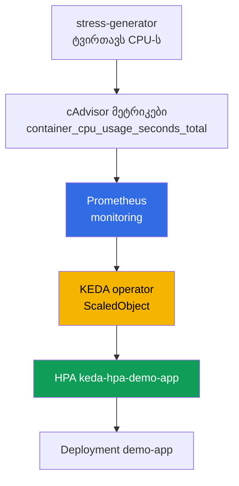
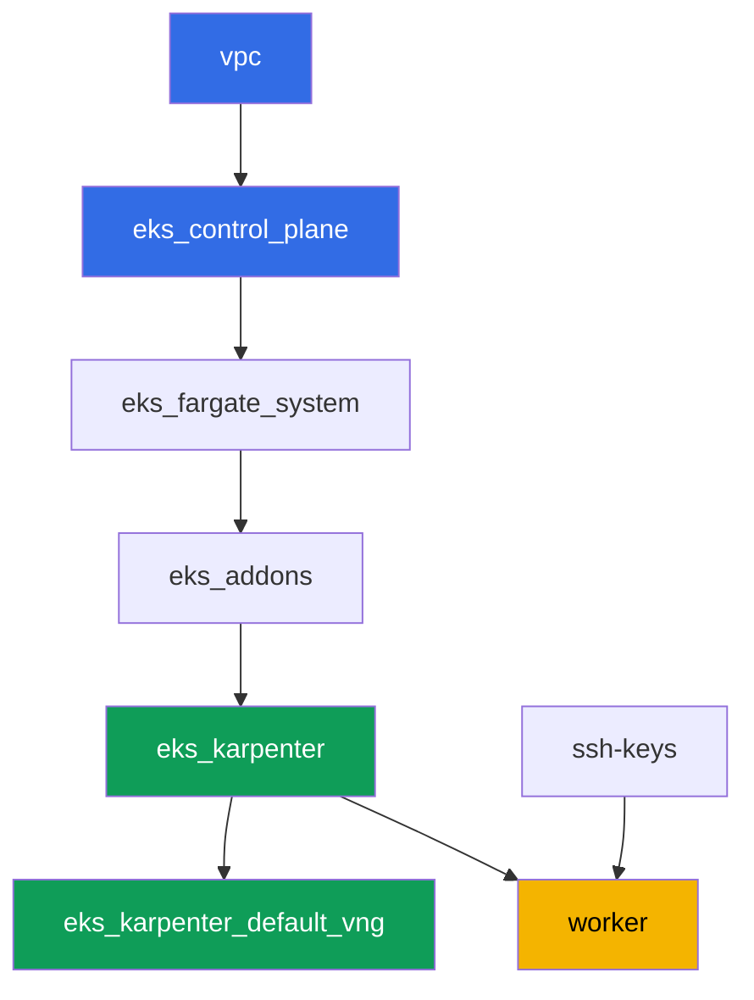

[Русская версия](README_RU.MD) · [Eng version](README.MD) · [Versión en español](README_ES.MD) · [Version française](README_FR.MD) · [Deutsche Version](README_DE.MD) · [繁體中文版](README_TW.MD) · [日本語版](README_JP.MD)

# ლაბა 124 - აპლიკაციების ავტომასშტაბირება: HPA, KEDA, Prometheus

## აღწერა

კლასტერი უკვე დეპლოირებულია როგორც კოდი. ამ ლაბაში თქვენ ზემოთ ადგამთ მონიტორინგის
სტეკს და მოვლენებზე დაფუძნებულ ავტომასშტაბირებას: დეპლოირებთ kube-prometheus-stack-ს,
აინსტალირებთ KEDA-ს, ქმნით სამიზნე Deployment-ს და აკონფიგურირებთ `ScaledObject`-ს
`prometheus` scaler-ით. კაპოტის ქვეშ KEDA არ ცვლის HPA-ს, ის ქმნის და ვარაუდობს
ჩვეულებრივ HPA-ს - ამას საკუთარი თვალით დაინახავთ `kubectl get hpa`-ს მეშვეობით.
შემდეგ ტვირთავთ სამიზნე პოდების CPU-ს, აკვირდებით რეპლიკების რაოდენობის ზრდას, ხსნით
დატვირთვას და ადასტურებთ დაბრუნებას მინიმუმზე.

დავალებები დაწერილია production-სტილში: მოკლე დავალება პლუს მიღების კრიტერიუმები.
შემოწმება ავტომატურია, ბრძანებით `check_result`.

## მიზანი

გავამყაროთ კურსის ამ თავის მასალა:

- [თავი 35. აპლიკაციების ავტომასშტაბირება: HPA, გარეშე მეტრიკები, KEDA](../../course/35/ru.md)

## რას ვქმნით

ლაბა 101-იდან კლასტერი უკვე დეპლოირებულია. ამ ლაბაში თქვენ ზემოთ ამატებთ მონიტორინგის
სტეკს და ავტომასშტაბირების ჯაჭვს.

| ობიექტი | რა არის ეს | რისთვის ამ ლაბაში |
|--------|---------|-------------------|
| Namespace `eks-124` | კლასტერის სექცია ლაბის დატვირთვისთვის | ინახავს რესურსებს სისტემურებისგან განცალკევებულად |
| kube-prometheus-stack (`monitoring`) | Prometheus-ის სერვერი | მეტრიკის წყარო KEDA-ს scaler-ისთვის |
| KEDA (`keda`) | operator და metrics adapter | ქმნის და ვარაუდობს HPA-ს გარეშე მეტრიკის მიხედვით |
| Deployment `demo-app` | მასშტაბირების სამიზნე ობიექტი | მასზე მიუთითებს `ScaledObject` |
| `ScaledObject` `demo-app` | KEDA-ს CRD `prometheus` scaler-ით | აღწერს მასშტაბირების ტრიგერს |
| HPA `keda-hpa-demo-app` | ჩვეულებრივი HPA, KEDA-ს მიერ შექმნილი | ხილული დამტკიცება იმისა, რომ "KEDA არ ცვლის HPA-ს" |
| Deployment `stress-generator` | CPU-ის დატვირთვა | ზრდის მეტრიკას, რომ ჩანდეს მასშტაბირება |

მასშტაბირების საბოლოო ჯაჭვი:



## ინფრასტრუქტურა

გარემო დეპლოირდება AWS-ში (`eu-central-1`) Terragrunt-ის მეშვეობით, ისევე როგორც
ლაბა 101-ში. ლაბის ყოველი დირექტორია ერთი კომპონენტია საკუთარი `terragrunt.hcl`-ით,
რომელიც მიმართავს საერთო მოდულს `terraform/modules/`-ში და აცხადებს
დამოკიდებულებებს `dependency` ბლოკებით. Terragrunt აწყობს დამოკიდებულებების გრაფს
და აპლიკებს კომპონენტებს სწორი თანმიმდევრობით. ამ ლაბისთვის სპეციფიკური
terraform-კომპონენტები არ არსებობს: KEDA, kube-prometheus-stack და დატვირთვა
ინსტალირდება Helm/kubectl-ით პირდაპირ სამუშაო მანქანიდან დავალებების ფარგლებში.

### მოდულები და დამოკიდებულებები

| დირექტორია (კომპონენტი) | მოდული (`terraform/modules/`) | დამოკიდებულია | რას ქმნის |
|---------------------|-------------------------------|------------|-------------|
| `vpc` | `vpc_v3` | - | VPC `10.10.0.0/16`, საჯარო და პრივატული ქვექსელები ორ AZ-ში, NAT |
| `ssh-keys` | `ssh-keys` | - | SSH-გასაღებების წყვილი სამუშაო მანქანისა და ნოუდებისთვის |
| `eks_control_plane` | `eks_v2_control_plane` | `vpc` | EKS control plane `1.36`, OIDC, security groups |
| `eks_fargate_system` | `eks_v2_fargate` | `vpc`, `eks_control_plane` | Fargate-პროფილი `kube-system`-ისთვის და `karpenter`-ისთვის |
| `eks_addons` | `eks_v2_addons` | `eks_control_plane`, `eks_fargate_system` | დამატებები coredns, kube-proxy, vpc-cni, pod-identity |
| `eks_karpenter` | `eks_v2_karpenter` | `vpc`, `eks_control_plane`, `eks_addons`, `eks_fargate_system` | Karpenter-ის კონტროლერი, ნოუდების IAM-როლი |
| `eks_karpenter_default_vng` | `eks_v2_karpenter_vng` | `vpc`, `eks_control_plane`, `eks_karpenter` | ნაგულისხმევი NodePool `default` და EC2NodeClass AL2023-ზე |
| `worker` | `eks_v2_work_pc` | `ssh-keys`, `vpc`, `eks_control_plane`, `eks_karpenter` | სამუშაო მანქანა kubectl-ით, helm-ით, ტესტებით და `check_result`-ით |

დამოკიდებულებების გრაფი (რაც უფრო ადრე აპლიცირდება, ის ხრიხისკენ ქვემოთაა):



სისტემური პოდები ხვდებიან Fargate-ზე, სამუშაო ნოუდებს ამართავს Karpenter. ნაგულისხმევი
NodePool შეზღუდულია `limits.cpu = 100`-ით, ეს საკმარისია kube-prometheus-stack-ისთვის,
KEDA-სთვის, `demo-app`-ისთვის და `stress-generator`-ის რამდენიმე რეპლიკისთვის
ერთდროულად.

ამ ლაბის NodePool ორი პარამეტრით განსხვავდება ლაბა 101-ისგან, და ორივე გაკეთებულია
განზრახ: instance-ები აღებულია `m`, `r`, `c` კატეგორიებიდან, ზომით `large` და მეტი
(პატარა burstable ნოუდები არ იტანენ მონიტორინგის სტეკს პლუს მუდმივ CPU-დატვირთვას), ხოლო
`consolidationPolicy` დაყენებულია `WhenEmpty`-ზე, რომ კონსოლიდაცია არ გადაასახლოს
Prometheus scale-down-ის მომენტში. დაწვრილებითი განმარტება მოცემულია დავალებების
ბლოკის შემდეგ.

### სად რა კონფიგურირდება

`env.hcl` (გარემოს საერთო პარამეტრები, წაკითხული ყველა კომპონენტის მიერ):

| პარამეტრი | მნიშვნელობა ლაბაში | რაზე ახდენს გავლენას |
|----------|-----------------|---------------|
| `region` | `eu-central-1` | ყველა რესურსის რეგიონი |
| `vpc_default_cidr`, `subnets` | `10.10.0.0/16`, ქვექსელები AZ-ების მიხედვით | VPC-ის მისამართების გეგმა და ქვექსელების ტეგები |
| `prefix` | `eks-task124` | რესურსების სახელებისა და ტეგების პრეფიქსი |
| `stack_name` | `eks124` | მისგან იწყობა `env_name` - კლასტერის სახელი |
| `k8_version` | `1.36.0` | kubectl-ის ვერსია სამუშაო მანქანაზე |
| `instance_type_worker` | `t3.medium` | სამუშაო მანქანის instance-ის ტიპი |
| `ssh_password_enable`, `access_cidrs` | `true`, `0.0.0.0/0` | SSH-წვდომა სამუშაო მანქანაზე |
| `root_volume` | `gp3`, `10` | სამუშაო მანქანის root-დისკი |

`inputs`-ი თითოეული კომპონენტის `terragrunt.hcl`-ში (კონკრეტული მოდულის
პარამეტრები) ემთხვევა ლაბა 101-ს: control plane-ისა და add-on-ების ვერსიები
`1.36`-ისთვის, Karpenter-ის კონტროლერი `1.8.1`, ნაგულისხმევი NodePool უცვლელი
ლიმიტებით. განსხვავდება მხოლოდ `test_url` და `task_script_url`
`worker/terragrunt.hcl`-ში - ისინი მიუთითებენ ამ ლაბის ფაილებზე (`labs/124/...`).

## განლაგება

```bash
TASK=124 make run_eks_task
```

განლაგება გრძელდება დაახლოებით 15-20 წუთი. output-ში მოძებნეთ ხაზი
SSH-შეერთებით სამუშაო მანქანასთან და დაუკავშირდით მას. kubectl და helm იქ უკვე
კონფიგურირებულია.

სასარგებლო ბრძანებები სამუშაო მანქანაზე:

```bash
time_left       # რამდენი დრო დარჩა გარემოს
check_result    # გადამოწმება
```

> დრო Helm-ინსტალაციებისთვის. kube-prometheus-stack-ის ინსტალაცია უფრო მძიმეა,
> ვიდრე ჩვეულებრივი Deployment: მაღლა დგება Prometheus, kube-state-metrics,
> node-exporter და operator, ეს დაახლოებით 2-3 წუთს მოითხოვს ყველა პოდის
> მზაობამდე (Grafana-სა და Alertmanager-ს ლაბა გამორთავს, იხილეთ დავალება 2).
> KEDA ინსტალირდება საგრძნობლად უფრო სწრაფად. სტენდის გაზომვები: რეპლიკები
> იზრდება დატვირთვის დაწყებიდან 60-90 წამში, ხოლო დაბრუნდება მინიმუმზე მისი
> მოხსნიდან 5 წუთში - ეს არის HPA-ს სტაბილიზაციის ფანჯარა, დაგელოდებათ.

> სტენდის უსაფრთხოება. `env.hcl`-ში ჩართულია `ssh_password_enable = true` და
> `access_cidrs = ["0.0.0.0/0"]` - ეს მოსახერხებელია სასწავლო გარემოსთვის, მაგრამ
> ასე არ უნდა გავხადოთ production-ში. კურსის სტანდარტების მიხედვით (თავები 0.2, 2,
> 19) სამუშაო მანქანებზე წვდომა იხსნება AWS SSM Session Manager-ის მეშვეობით,
> საჯარო SSH-პორტების გარეთ გამოტანის გარეშე, ხოლო `access_cidrs` ვიწროვდება
> კონკრეტულ მისამართებზე. აქ საჯარო SSH დარჩენილია მხოლოდ გაშვების
> გასამარტივებლად.

## დავალებები

---
|        **1**        | **Namespace ლაბის დატვირთვისთვის**                             |
| :-----------------: | :---------------------------------------------------------- |
| რას ვაკეთებთ          | შექმენით namespace სახელით `eks-124`. ამ ლაბის ყველა ობიექტი შექმნილია მის შიგნით. |
| მიღების კრიტერიუმები    | - namespace `eks-124` არსებობს. |
---
|        **2**        | **Prometheus-ის სერვერი KEDA-ს მეტრიკებისთვის**                       |
| :-----------------: | :---------------------------------------------------------- |
| რას ვაკეთებთ          | დაინსტალირეთ `kube-prometheus-stack` Helm-ის მეშვეობით namespace `monitoring`-ში (რეპოზიტორია `prometheus-community`). ამ ლაბას სჭირდება მხოლოდ Prometheus-ის სერვერი, ამიტომ გამორთეთ Grafana და Alertmanager, ხოლო Prometheus-ის პოდს დაუყენეთ ცალსახა `requests` (`cpu: 200m`, `memory: 512Mi`) - რისთვის ეს საჭიროა, განმარტებულია დავალებების ცხრილის ქვემოთ. დაელოდეთ პოდების მზაობას: `kubectl get pods -n monitoring`. |
| მიღების კრიტერიუმები    | - Service `kube-prometheus-stack-prometheus` არსებობს `monitoring`-ში;<br/>- Prometheus-ის პოდები არიან `Running` და `Ready`;<br/>- Prometheus-ის პოდს დაყენებული აქვს `requests`, ანუ `qosClass` არ არის `BestEffort`. |
---
|        **3**        | **KEDA-ს ინსტალაცია**                                          |
| :-----------------: | :---------------------------------------------------------- |
| რას ვაკეთებთ          | დაინსტალირეთ KEDA Helm-ის მეშვეობით namespace `keda`-ში (რეპოზიტორია `kedacore`). დაადასტურეთ, რომ `keda-operator` და `keda-operator-metrics-apiserver` არიან `Running`. |
| მიღების კრიტერიუმები    | - პოდები label-ებით `app=keda-operator` და `app=keda-operator-metrics-apiserver` `keda`-ში არიან `Running`. |
---
|        **4**        | **მასშტაბირების სამიზნე Deployment**                  |
| :-----------------: | :---------------------------------------------------------- |
| რას ვაკეთებთ          | Namespace `eks-124`-ში შექმენით Deployment `demo-app`, image `viktoruj/ping_pong:latest`, `1` რეპლიკა, კონტეინერზე დაყენებული `resources.requests.cpu: "200m"`. ეს არის ის ობიექტი, რომელსაც მართავს KEDA. |
| მიღების კრიტერიუმები    | - Deployment `demo-app` `eks-124`-ში, image `viktoruj/ping_pong`;<br/>- დაყენებული `requests.cpu`;<br/>- `1` მზა რეპლიკა. |
---
|        **5**        | **ScaledObject prometheus scaler-ით**                       |
| :-----------------: | :---------------------------------------------------------- |
| რას ვაკეთებთ          | `eks-124`-ში შექმენით `ScaledObject` `demo-app` `scaleTargetRef.name: demo-app`-ით, `minReplicaCount: 1`, `maxReplicaCount: 5`. ტრიგერის ტიპი `prometheus`, `serverAddress` მიუთითებს Prometheus-ის Service-ზე `monitoring`-ში (პორტი `9090`), `query` ითვლის დავალება 6-ის დატვირთვის გენერატორის პოდების ჯამურ CPU-ხარჯვას cAdvisor-ის მეტრიკის `container_cpu_usage_seconds_total` მეშვეობით (`sum(rate(container_cpu_usage_seconds_total{namespace="eks-124",pod=~"stress-generator.*"}[1m]))`), აირჩიეთ გონივრული `threshold` (მაგალითად `"0.1"`). გაითვალისწინეთ: `demo-app` მასშტაბირდება ᲳᲣᲟᲘ პოდების დატვირთვის მიხედვით - ჩვეულებრივ HPA-ს CPU-ის მიხედვით ეს არ შეუძლია, და ეს არის გარეშე მეტრიკების მთელი აზრი. დაადასტურეთ, რომ KEDA-მ შექმნა HPA `keda-hpa-demo-app`: `kubectl get hpa -A \| grep keda-hpa`. |
| მიღების კრიტერიუმები    | - `ScaledObject` `demo-app` `eks-124`-ში `prometheus` ტრიგერით;<br/>- არსებობს HPA `keda-hpa-demo-app`. |
---
|        **6**        | **დატვირთვის ტესტი: მასშტაბირება ზევით**                 |
| :-----------------: | :---------------------------------------------------------- |
| რას ვაკეთებთ          | შეინახეთ `kubectl get hpa keda-hpa-demo-app -n eks-124` ფაილში `/var/work/tests/artifacts/6/hpa_before.txt`. შექმენით Deployment `stress-generator` `eks-124`-ში: image `polinux/stress`, ბრძანება `stress --cpu 2`, `2` რეპლიკა, საკუთარი label `app=stress-generator`, `requests.cpu: 200m` და, კრიტიკულად მნიშვნელოვანი, `limits.cpu: 500m`, პლუს `nodeSelector` `kubernetes.io/arch: amd64`-ზე. რატომ არის საჭირო ლიმიტი და სელექტორი, განმარტებულია დავალებების ცხრილის ქვემოთ. დაელოდეთ 1-2 წუთი, სანამ მეტრიკა გაიზრდება და KEDA გაზრდის `demo-app`-ის რეპლიკების რაოდენობას, შემდეგ შეინახეთ `kubectl get hpa keda-hpa-demo-app -n eks-124` ფაილში `/var/work/tests/artifacts/6/hpa_after.txt` ისე, რომ მასში რეპლიკების რაოდენობა იყოს `1`-ზე მეტი. |
| მიღების კრიტერიუმები    | - Deployment `stress-generator` `eks-124`-ში, `2` რეპლიკა, დაყენებული `limits.cpu`;<br/>- ფაილი `6/hpa_before.txt` არ არის ცარიელი;<br/>- ფაილი `6/hpa_after.txt` არ არის ცარიელი და აჩვენებს `REPLICAS`-ს `1`-ზე მეტს. |
---
|        **7**        | **დატვირთვის მოხსნა: მასშტაბირება ქვევით**                   |
| :-----------------: | :---------------------------------------------------------- |
| რას ვაკეთებთ          | წაშალეთ Deployment `stress-generator`. მეტრიკა ეცემა ნულამდე თითქმის მაშინვე (გენერატორის პოდების სერიები Prometheus-იდან ქრება, KEDA აბრუნებს `0`-ს), მაგრამ რეპლიკების რაოდენობა ჩერდება: `stabilizationWindowSeconds` scaleDown-ისთვის ნაგულისხმევად არის `300` წამი. სტენდზე `TARGETS` გახდა ნული 30 წამის შემდეგ, ხოლო რეპლიკები დაბრუნდნენ `1`-ზე 5 წუთის შემდეგ - ეს ჩვეულებრივი მოქმედებაა და არ არის გაჭედვა. დაელოდეთ, სანამ `REPLICAS` გახდება `1`-ის ტოლი, და შეინახეთ `kubectl get hpa keda-hpa-demo-app -n eks-124` ფაილში `/var/work/tests/artifacts/7/hpa_after_cooldown.txt`. |
| მიღების კრიტერიუმები    | - Deployment `stress-generator` წაშლილია;<br/>- ფაილი `7/hpa_after_cooldown.txt` არ არის ცარიელი და აჩვენებს `REPLICAS`-ს `1`-ის ტოლს. |
---
|        **8**        | **ჩვეულებრივი HPA KEDA-ს მიერ შექმნილი HPA-ს წინააღმდეგ**                 |
| :-----------------: | :---------------------------------------------------------- |
| რას ვაკეთებთ          | გაუშვით `kubectl get hpa -A` და შეადარეთ output დავალება 5-7-ში დანახულს. შეინახეთ ფაილში `/var/work/tests/artifacts/8/hpa_compare.txt` 2-3 წინადადება: რითი განსხვავდება ამ output-ში ჩვეულებრივი HPA HPA `keda-hpa-demo-app`-ისგან, და განმარტება იმისა, რომ KEDA არ ცვლის HPA-ს - ის მას მართავს (`control`) (ახსენეთ სიტყვები `HPA`, `KEDA`, `keda-hpa` და `control`). |
| მიღების კრიტერიუმები    | - ფაილი `8/hpa_compare.txt` არ არის ცარიელი;<br/>- შეიცავს სიტყვებს `HPA`, `KEDA`, `keda-hpa` და `control`. |
---

### რატომ გაჩნდა დავალებებში requests, ლიმიტი და nodeSelector

ზემოთ ჩამოთვლილი სამი მოთხოვნა წვრილმანებს ჰგავს, მაგრამ მათ გარეშე ლაბა
ეშლება, და სამივე - წარმოების ტიპური ხაფანგია, არა სტენდის თავისებურება.

**Requests Prometheus-ზე და გამორთული Grafana და Alertmanager.**
`kube-prometheus-stack`-ის პოდებს ნაგულისხმევად არ აქვთ არც `requests`, არც
`limits`, ანუ მათი `qosClass` არის `BestEffort`. აქედან ორი შედეგი. Karpenter
ირჩევს ნოუდის ზომას `requests`-ის ჯამის მიხედვით (თავი 12), ანუ მონიტორინგის
სტეკის საჭიროებების შესახებ მას არაფერი აქვს ცნობილი და ის შეიფუთავს ყველაზე
ეკონომიურ instance-ზე. შემდეგ ჩართოვდება kubelet: მეხსიერების ნაკლებობისას ის
პირველად ითვისტირებს `BestEffort` პოდებს (თავი 14). სტენდზე ეს ასე გამოიყურებოდა
- ფაქტობრივი მოხმარება იყო დაახლოებით 325 MiB Grafana-სთვის, დაახლოებით 264 MiB
Prometheus-სთვის, დაახლოებით 750 MiB მთელი სტეკისთვის, და ნოუდის ივენთი:

```
Evicted  prometheus-kube-prometheus-stack-prometheus-0
The node was low on resource: memory. Threshold quantity: 45347Ki, available: 44068Ki
```

Prometheus ითვისტირდება, მასთან ერთად იკარგება მეტრიკის ისტორია `emptyDir`-ში,
ხოლო HPA-ს `TARGETS` აჩვენებს `<unknown>/100m`-ს. მკურნალობა ზუსტად ორი
რამით ხდება: ლაბაში არ ვთეთრებთ, რაც მას არ სჭირდება (Grafana ჩარტის ყველაზე
მძიმე კომპონენტია, და მის დაშბორდებს აქ არავინ ხსნის), და Prometheus-ის
საჭიროებას ცალსახად ვცხადებთ, რომ ის დაინახონ როგორც scheduler-მა, ისევე
Karpenter-მაც.

**CPU-ლიმიტი დატვირთვის გენერატორზე.** `stress --cpu 2` ორ რეპლიკაში - ეს
ოთხი CPU-ვორკერია, რომლებიც აიღებენ ყველაფერს, რასაც შეძლებენ. `limits.cpu`-ს
გარეშე ისინი აცილებენ პროცესორს kubelet-ს, ნოუდი გადადის `NotReady`-ში,
Karpenter მას როგორც უჯანმრთელოს ცვლის, პოდები გადადიან, და ექსპერიმენტი
ეშლება. `limits.cpu: 500m` დატვირთვას პროგნოზირებადს ხდის: cgroup ამუხრუჭებს
კონტეინერს, გენერატორი ჯამურად აწარმოებს დაახლოებით ერთ ბირთვს, მეტრიკა
თავდაჯერებულად რჩება ზღვარზე მაღლა, ხოლო ნოუდი ცოცხალი რჩება.

**nodeSelector amd64-ზე.** ამ ლაბის NodePool ორივეს - `amd64`-ს და `arm64`-ს -
უშვებს, ხოლო `polinux/stress` image აწყობილია მხოლოდ `amd64`-ისთვის (რეესტრში
მას ერთი მანიფესტი აქვს, პლატფორმების სიის გარეშე). თუ Karpenter Graviton-ნოუდს
ამართავს, პოდი ჩავარდება `exec format error`-ით. `viktoruj/ping_pong` image
მრავალარქიტექტურულია, ამიტომ `demo-app`-ს სელექტორი არ სჭირდება. ეს არის
ზოგადი წესი: შერეული არქიტექტურის ფლოტში ერთარქიტექტურულ image-ს სელექტორი
უნდა ატყოს (თავები 12 და 13).

ამასთანავე, დახედეთ `disruption`-ს ამ ლაბის NodePool-ში: `consolidationPolicy`
აქ არის `WhenEmpty`, არა `WhenEmptyOrUnderutilized`. მიზეზი იგივეა - scale-down-ის
დროს აგრესიული კონსოლიდაცია იწყებს Prometheus-ის გადასახლებას მისი ისტორიის
ერთად. კონსოლიდაცია, როგორც თემა, განხილულია ლაბა 123-ში.

## შედეგის შემოწმება

სამუშაო მანქანაზე გაუშვით ავტომატური შემოწმება:

```bash
check_result
```

ტესტები 6 და 7 მასშტაბირების შედეგს ელოდებიან დროში შეზღუდულ ციკლებში (რამდენიმე
წუთამდე), ამიტომ არ გაგიკვირდეთ, თუ `check_result` ჩვეულებრივზე დიდხანს
გაგრძელდება.

## გადაწყვეტა

ეტალონური გადაწყვეტა: [worker/files/solutions/1_GE.MD](worker/files/solutions/1_GE.MD)

## კლასტერისა და რესურსების წაშლა

> **ჯერ მოხსენით დატვირთვა და დაელოდეთ, სანამ EC2-ნოუდები არ გაქრება, მხოლოდ
> მერე დაანგრიეთ სტენდი.** ეს ლაბა AWS-რესურსებს ხელით არ ქმნის, ყველა დანარჩენი -
> Kubernetes-ის ობიექტებია, ამიტომ საფრთხე მხოლოდ ერთია: თუ კლასტერს წაშლით
> მაშინ, როცა დატვირთვა ჯერ კიდევ მუშაობს, Karpenter-ის EC2-ნოუდი მასთან ერთად
> წავა, მაგრამ VPC CNI-ის მეორადი ENI `available` მდგომარეობაში დარჩება და
> ნოუდების security group-ს შეაკავებს. ასეთ შემთხვევაში `destroy` ჩერდება
> `module.eks.aws_security_group.node[0]: Still destroying...`-ზე ათეულ წუთს.

```bash
# 1. მოხსენით დატვირთვა და მასშტაბირების ჯაჭვი (ScaledObject ქრება namespace-სთან
#    ერთად, HPA keda-hpa-demo-app-ს KEDA თავად წაშლის)
kubectl delete namespace eks-124 --ignore-not-found

# 2. მოხსენით მონიტორინგის სტეკი და KEDA. Helm-გამოშვებები AWS-რესურსებს არ
#    ტოვებენ: ჩარტი ნაგულისხმევად PVC-ს არ ქმნის (Prometheus მონაცემებს
#    emptyDir-ში ინახავს), ამის შემოწმება შესაძლებელია ასე
kubectl get pvc -A
helm uninstall kube-prometheus-stack -n monitoring
helm uninstall keda -n keda
kubectl delete namespace monitoring keda --ignore-not-found

# 3. დაელოდეთ, სანამ Karpenter მოხსნის NodeClaim-ს და EC2-ნოუდებს (დარჩება
#    მხოლოდ fargate-*)
while kubectl get nodeclaims --no-headers 2>/dev/null | grep -q .; do
  echo "NodeClaim still alive, waiting..."; sleep 15
done
kubectl get nodes | grep -v fargate
```

მხოლოდ ამის შემდეგ დაანგრიეთ სტენდი:

```bash
TASK=124 make delete_eks_task
```

თუ `destroy` მაინც შედგა ნოუდების security group-ზე, ესე იგი დარჩა
დაუპატრონებელი ENI. მოძებნეთ და წაშალეთ ის:

```bash
aws ec2 describe-network-interfaces --filters Name=status,Values=available \
  --query 'NetworkInterfaces[?Tags[?Key==`eks:eni:owner`]].[NetworkInterfaceId,Description]' \
  --output table
aws ec2 delete-network-interface --network-interface-id <eni-id>
```

CRD-ები, რომლებსაც `kube-prometheus-stack` და KEDA (`prometheuses`,
`servicemonitors`, `scaledobjects` და სხვები) თავის შემდეგ ტოვებენ, ცალკე
წაშლა არ სჭირდება - კლასტერი მთლიანად ქრება. მათი გახსენება სხვა სცენარში
ღირს: თუ ჩარტი ხელახლა ინსტალირდება ცოცხალ კლასტერში, `helm uninstall` ამ
CRD-ებს არ ხსნის.
