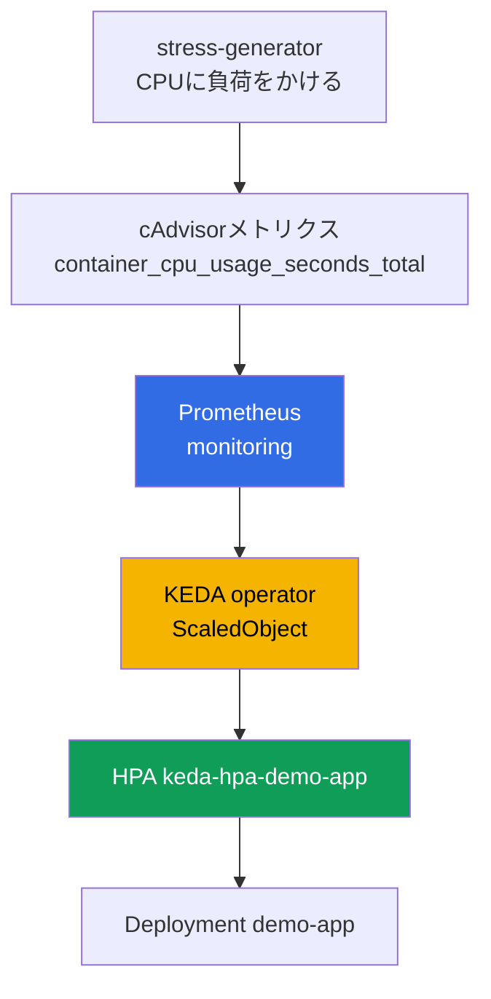
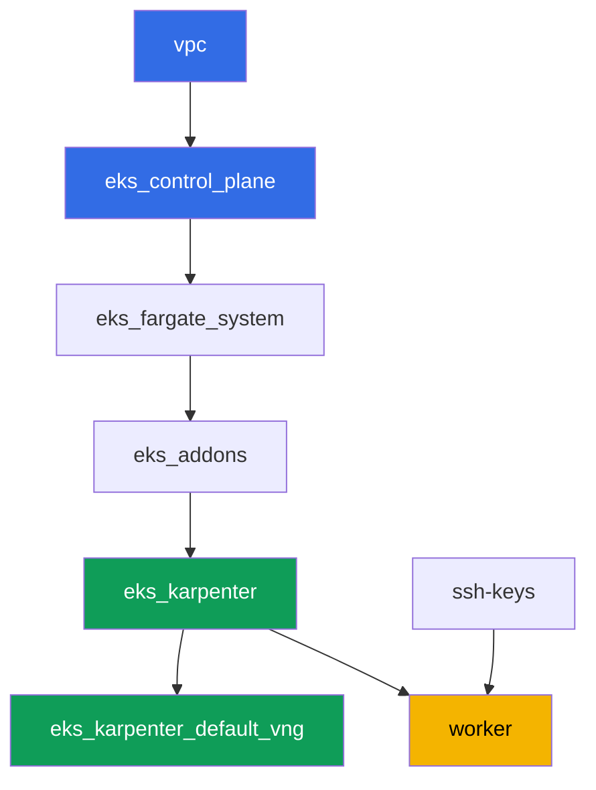

[Русская версия](README_RU.MD) · [Eng version](README.MD) · [Versión en español](README_ES.MD) · [Version française](README_FR.MD) · [Deutsche Version](README_DE.MD) · [ქართული ვერსია](README_GE.MD) · [繁體中文版](README_TW.MD)

# ラボ124 - アプリケーションの自動スケーリング: HPA、KEDA、Prometheus

## 説明

クラスタはすでにコードとしてデプロイされています。このラボでは、その上に監視スタックとイベント駆動型の自動スケーリングを構築します。kube-prometheus-stackをデプロイし、KEDAをインストールし、対象のDeploymentを作成して、`prometheus`スケーラーを使う`ScaledObject`を設定します。KEDAは内部的にHPAを置き換えるわけではなく、通常のHPAを作成して管理します - これは`kubectl get hpa`で自分の目で確認できます。次に対象podのCPUに負荷をかけ、レプリカ数が増えていく様子を観察し、負荷を取り除いて最小値に戻ることを確認します。

タスクはプロダクションスタイルで記述されています: 短い課題文と受け入れ基準です。チェックは`check_result`コマンドによって自動的に行われます。

## ゴール

コースの章の内容を定着させます:

- [第35章 アプリケーションの自動スケーリング: HPA、外部メトリクス、KEDA](../../course/35/ru.md)

## 作成するもの

ラボ101のクラスタはすでにデプロイされています。このラボでは、その上に監視スタックと自動スケーリングのチェーンを追加します。

| オブジェクト | それが何か | このラボにある理由 |
|--------|---------|-------------------|
| Namespace `eks-124` | ラボのワークロード用のクラスタ区画 | リソースをシステムのものと分離しておく |
| kube-prometheus-stack (`monitoring`) | Prometheusサーバー | KEDAスケーラーのメトリクスソース |
| KEDA (`keda`) | operatorとmetrics adapter | 外部メトリクスに基づいてHPAを作成・管理する |
| Deployment `demo-app` | スケーリング対象 | `ScaledObject`から参照される |
| `ScaledObject` `demo-app` | `prometheus`スケーラーを持つKEDAのCRD | スケーリングのトリガーを記述する |
| HPA `keda-hpa-demo-app` | KEDAによって作成された通常のHPA | 「KEDAはHPAを置き換えない」ことの目に見える証拠 |
| Deployment `stress-generator` | CPU負荷 | メトリクスを増加させ、スケーリングを可視化する |

最終的なスケーリングチェーン:



## インフラストラクチャ

環境はラボ101と同様に、Terragrunt経由でAWS(`eu-central-1`)にデプロイされています。ラボの各ディレクトリは1つのコンポーネントであり、それぞれ独自の`terragrunt.hcl`を持ち、`terraform/modules/`内の共有モジュールを参照し、`dependency`ブロックで依存関係を宣言します。Terragruntは依存関係グラフを構築し、正しい順序でコンポーネントを適用します。このラボに固有のterraformコンポーネントはありません: KEDA、kube-prometheus-stack、および負荷はタスクの一部として、ワーカーマシンから直接Helm/kubectl経由でインストールされます。

### モジュールと依存関係

| ディレクトリ（コンポーネント） | モジュール（`terraform/modules/`） | 依存先 | 作成するもの |
|---------------------|-------------------------------|------------|-------------|
| `vpc` | `vpc_v3` | - | VPC `10.10.0.0/16`、2つのAZにパブリックおよびプライベートサブネット、NAT |
| `ssh-keys` | `ssh-keys` | - | ワーカーマシンとノード用のSSHキーペア |
| `eks_control_plane` | `eks_v2_control_plane` | `vpc` | EKS control plane `1.36`、OIDC、security groups |
| `eks_fargate_system` | `eks_v2_fargate` | `vpc`、`eks_control_plane` | `kube-system`と`karpenter`用のFargateプロファイル |
| `eks_addons` | `eks_v2_addons` | `eks_control_plane`、`eks_fargate_system` | coredns、kube-proxy、vpc-cni、pod-identityアドオン |
| `eks_karpenter` | `eks_v2_karpenter` | `vpc`、`eks_control_plane`、`eks_addons`、`eks_fargate_system` | Karpenterコントローラー、ノードIAMロール |
| `eks_karpenter_default_vng` | `eks_v2_karpenter_vng` | `vpc`、`eks_control_plane`、`eks_karpenter` | デフォルトのNodePool `default`とAL2023上のEC2NodeClass |
| `worker` | `eks_v2_work_pc` | `ssh-keys`、`vpc`、`eks_control_plane`、`eks_karpenter` | kubectl、helm、テスト、`check_result`を備えたワーカーマシン |

依存関係グラフ（矢印の下にあるほど先に適用される）:



システムpodはFargate上で実行され、ワーカーノードはKarpenterが起動します。デフォルトのNodePoolは`limits.cpu = 100`に制限されていますが、これはkube-prometheus-stack、KEDA、`demo-app`、そして`stress-generator`のレプリカ数個を同時に実行するのに十分です。

このラボのNodePoolはラボ101とは2つの設定で異なり、いずれも意図的なものです: インスタンスは`m`、`r`、`c`カテゴリの`large`以上のサイズから選ばれます（小さいburstableノードでは監視スタックと持続的なCPU負荷を同時に処理できません）、そして`consolidationPolicy`は`WhenEmpty`に設定されており、スケールダウン時にconsolidationがPrometheusを移動させないようにしています。詳しい説明はタスクブロックの後に続きます。

### 設定箇所

`env.hcl`（すべてのコンポーネントが読み込む共通の環境パラメータ）:

| パラメータ | ラボでの値 | 影響範囲 |
|----------|-----------------|---------------|
| `region` | `eu-central-1` | すべてのリソースのリージョン |
| `vpc_default_cidr`、`subnets` | `10.10.0.0/16`、AZごとのサブネット | VPCのアドレス計画とサブネットのタグ |
| `prefix` | `eks-task124` | リソース名とタグのプレフィックス |
| `stack_name` | `eks124` | `env_name`（クラスタ名）の組み立てに使用 |
| `k8_version` | `1.36.0` | ワーカーマシン上のkubectlバージョン |
| `instance_type_worker` | `t3.medium` | ワーカーマシンのインスタンスタイプ |
| `ssh_password_enable`、`access_cidrs` | `true`、`0.0.0.0/0` | ワーカーマシンへのSSHアクセス |
| `root_volume` | `gp3`、`10` | ワーカーマシンのルートディスク |

各コンポーネントの`terragrunt.hcl`内の`inputs`（そのモジュール固有の設定）はラボ101と一致します: `1.36`向けのcontrol planeとアドオンのバージョン、Karpenterコントローラー`1.8.1`、limitsを変更していないデフォルトのNodePool。異なるのは`worker/terragrunt.hcl`内の`test_url`と`task_script_url`のみで、これらはこのラボのファイル（`labs/124/...`）を指しています。

## デプロイ

```bash
TASK=124 make run_eks_task
```

デプロイには約15〜20分かかります。出力の中からワーカーマシンへのSSH接続の行を見つけて接続してください。そこではkubectlとhelmがすでに設定されています。

ワーカーマシン上で役立つコマンド:

```bash
time_left       # 環境の残り時間
check_result    # 解答を確認する
```

> Helmインストールにかかる時間について。kube-prometheus-stackのインストールは通常のDeploymentより重く、Prometheus、kube-state-metrics、node-exporter、およびoperatorがすべて起動するため、すべてのpodが準備完了になるまで約2〜3分かかります（このラボではGrafanaとAlertmanagerを無効にします、タスク2を参照）。KEDAのインストールは明らかに速いです。テストベンチでの計測: 負荷開始から60〜90秒後にレプリカが増え、負荷を取り除いてから5分後に最小値に戻ります - これはHPAの安定化ウィンドウであり、待つ必要があります。

> 環境のセキュリティについて。`env.hcl`では`ssh_password_enable = true`と`access_cidrs = ["0.0.0.0/0"]`が有効になっています - トレーニング環境としては便利ですが、プロダクションでは行うべきではありません。コースの基準（第0.2章、第2章、第19章）に従うと、ワーカーマシンへのアクセスは公開SSHポートを晒さずにAWS SSM Session Manager経由で行い、`access_cidrs`は特定のアドレスに絞り込むべきです。ここでは、セットアップを簡単にするためだけに公開SSHが残されています。

## タスク

---
|        **1**        | **ラボのワークロード用のNamespace**                             |
| :-----------------: | :---------------------------------------------------------- |
| 何をするか          | `eks-124`という名前のnamespaceを作成してください。このラボのすべてのオブジェクトはその中に作成されます。 |
| 受け入れ基準    | - namespace `eks-124`が存在する。 |
---
|        **2**        | **KEDAのメトリクス用Prometheusサーバー**                       |
| :-----------------: | :---------------------------------------------------------- |
| 何をするか          | Helm経由で`kube-prometheus-stack`をnamespace `monitoring`にインストールしてください（リポジトリ`prometheus-community`）。このラボではPrometheusサーバーのみが必要なので、GrafanaとAlertmanagerを無効にし、Prometheus podに明示的な`requests`（`cpu: 200m`、`memory: 512Mi`）を設定してください - なぜこれが必要かはタスクテーブルの下で説明します。podが準備完了になるまで待ちます: `kubectl get pods -n monitoring`。 |
| 受け入れ基準    | - Service `kube-prometheus-stack-prometheus`が`monitoring`に存在する;<br/>- Prometheusのpodが`Running`かつ`Ready`である;<br/>- Prometheus podに`requests`が設定されている、つまり`qosClass`が`BestEffort`ではない。 |
---
|        **3**        | **KEDAのインストール**                                          |
| :-----------------: | :---------------------------------------------------------- |
| 何をするか          | Helm経由でKEDAをnamespace `keda`にインストールしてください（リポジトリ`kedacore`）。`keda-operator`と`keda-operator-metrics-apiserver`が`Running`であることを確認してください。 |
| 受け入れ基準    | - `keda`内でlabel `app=keda-operator`と`app=keda-operator-metrics-apiserver`を持つpodが`Running`である。 |
---
|        **4**        | **スケーリング対象のDeployment**                  |
| :-----------------: | :---------------------------------------------------------- |
| 何をするか          | namespace `eks-124`に、Deployment `demo-app`（image `viktoruj/ping_pong:latest`、レプリカ数`1`）を作成し、コンテナに`resources.requests.cpu: "200m"`を設定してください。これがKEDAが管理するオブジェクトです。 |
| 受け入れ基準    | - Deployment `demo-app`が`eks-124`に存在し、image `viktoruj/ping_pong`;<br/>- `requests.cpu`が設定されている;<br/>- `1`個のReadyなレプリカ。 |
---
|        **5**        | **prometheusスケーラーを使うScaledObject**                       |
| :-----------------: | :---------------------------------------------------------- |
| 何をするか          | `eks-124`に、`scaleTargetRef.name: demo-app`、`minReplicaCount: 1`、`maxReplicaCount: 5`を持つ`ScaledObject` `demo-app`を作成してください。トリガータイプは`prometheus`、`serverAddress`は`monitoring`内のPrometheus Service（ポート`9090`）を指し、`query`はcAdvisorメトリクス`container_cpu_usage_seconds_total`経由でタスク6の負荷ジェネレータのpodの合計CPU使用量を計算します（`sum(rate(container_cpu_usage_seconds_total{namespace="eks-124",pod=~"stress-generator.*"}[1m]))`）、`threshold`は適切な値を選んでください（例: `"0.1"`）。注意: `demo-app`は他人のpodの負荷に基づいてスケールします - 通常のCPUベースのHPAはこれができません、これこそが外部メトリクスの意義です。KEDAがHPA `keda-hpa-demo-app`を作成したことを確認してください: `kubectl get hpa -A \| grep keda-hpa`。 |
| 受け入れ基準    | - `ScaledObject` `demo-app`が`eks-124`に存在し、`prometheus`トリガーを持つ;<br/>- HPA `keda-hpa-demo-app`が存在する。 |
---
|        **6**        | **負荷テスト: スケールアップ**                 |
| :-----------------: | :---------------------------------------------------------- |
| 何をするか          | `kubectl get hpa keda-hpa-demo-app -n eks-124`の出力をファイル`/var/work/tests/artifacts/6/hpa_before.txt`に保存してください。`eks-124`にDeployment `stress-generator`を作成してください: image `polinux/stress`、コマンド`stress --cpu 2`、レプリカ数`2`、独自のlabel `app=stress-generator`、`requests.cpu: 200m`、そして重要な点として`limits.cpu: 500m`、さらに`kubernetes.io/arch: amd64`への`nodeSelector`。なぜこのlimitとselectorが必要かはタスクテーブルの下で説明します。メトリクスが増加し、KEDAが`demo-app`のレプリカ数を増やすまで1〜2分待ち、その後`kubectl get hpa keda-hpa-demo-app -n eks-124`の出力をファイル`/var/work/tests/artifacts/6/hpa_after.txt`に保存し、その中のレプリカ数が`1`より大きくなるようにしてください。 |
| 受け入れ基準    | - Deployment `stress-generator`が`eks-124`に存在し、レプリカ数`2`、`limits.cpu`が設定されている;<br/>- ファイル`6/hpa_before.txt`が空でない;<br/>- ファイル`6/hpa_after.txt`が空でなく、`REPLICAS`が`1`より大きいことを示している。 |
---
|        **7**        | **負荷の削除: スケールダウン**                   |
| :-----------------: | :---------------------------------------------------------- |
| 何をするか          | Deployment `stress-generator`を削除してください。メトリクスはほぼ即座にゼロに落ちます（ジェネレータのpodのシリーズがPrometheusから消え、KEDAは`0`を返します）が、レプリカ数はそのまま維持されます: scaleDownの`stabilizationWindowSeconds`はデフォルトで`300`秒です。テストベンチでは、`TARGETS`は30秒後にゼロになり、レプリカは5分後に`1`に戻りました - これは正常な動作であり、固まっているわけではありません。`REPLICAS`が`1`になるまで待ち、`kubectl get hpa keda-hpa-demo-app -n eks-124`の出力をファイル`/var/work/tests/artifacts/7/hpa_after_cooldown.txt`に保存してください。 |
| 受け入れ基準    | - Deployment `stress-generator`が削除されている;<br/>- ファイル`7/hpa_after_cooldown.txt`が空でなく、`REPLICAS`が`1`であることを示している。 |
---
|        **8**        | **通常のHPAとKEDAが作成したHPAの比較**                 |
| :-----------------: | :---------------------------------------------------------- |
| 何をするか          | `kubectl get hpa -A`を実行し、その出力をタスク5〜7で見たものと比較してください。ファイル`/var/work/tests/artifacts/8/hpa_compare.txt`に2〜3文を保存してください: この出力で通常のHPAとHPA `keda-hpa-demo-app`が何が違うか、そしてKEDAはHPAを置き換えるのではなく、それを制御する（`control`）という説明（単語`HPA`、`KEDA`、`keda-hpa`、および`control`に言及してください）。 |
| 受け入れ基準    | - ファイル`8/hpa_compare.txt`が空でない;<br/>- 単語`HPA`、`KEDA`、`keda-hpa`および`control`を含んでいる。 |
---

### なぜタスクにrequests、limit、nodeSelectorが登場したのか

上記の3つの要件は小さな詳細に見えますが、これらがなければラボは崩壊してしまいます。そして3つとも典型的なプロダクションの落とし穴であり、テストベンチ特有の癖ではありません。

**PrometheusのrequestsとGrafana・Alertmanagerの無効化。** デフォルトでは`kube-prometheus-stack`のpodには`requests`も`limits`もないため、その`qosClass`は`BestEffort`になります。これには2つの結果があります。Karpenterは`requests`の合計に基づいてノードのサイズを決定するため（第12章）、監視スタックのニーズについて何も知らず、最も安いインスタンスに詰め込みます。次にkubeletが登場します: メモリ不足時には`BestEffort`のpodを最初に退避させます（第14章）。テストベンチでは実際にこうなりました - 実際の使用量はGrafanaで約325 MiB、Prometheusで約264 MiB、スタック全体で約750 MiB、そしてノードのイベント:

```
Evicted  prometheus-kube-prometheus-stack-prometheus-0
The node was low on resource: memory. Threshold quantity: 45347Ki, available: 44068Ki
```

Prometheusは退避させられ、`emptyDir`内のメトリクス履歴もそれと一緒に失われ、HPAの`TARGETS`は`<unknown>/100m`と表示されます。修正すべきことはちょうど2つです: ラボに不要なものを持ち込まないこと（Grafanaはチャートの中で最も重いコンポーネントであり、ここではそのダッシュボードを誰も開きません）、そしてPrometheusのニーズを明示的に宣言し、schedulerとKarpenterの両方がそれを認識できるようにすることです。

**負荷ジェネレータのCPU limit。** 2つのレプリカにわたる`stress --cpu 2`は、手に入るものすべてを取ろうとする4つのCPUワーカーになります。`limits.cpu`がなければ、これらはkubeletからCPUを奪い、ノードは`NotReady`になり、Karpenterは不健全と判断してノードを置き換え、podは再スケジュールされ、実験は崩壊します。`limits.cpu: 500m`は負荷を予測可能に保ちます: cgroupがコンテナをスロットリングし、ジェネレータ全体でおおよそ1コア分を生み出し、メトリクスはしきい値を余裕を持って上回り続け、ノードは生き続けます。

**amd64向けのnodeSelector。** このラボのNodePoolは`amd64`と`arm64`の両方を許可していますが、`polinux/stress`イメージは`amd64`用にしかビルドされていません（レジストリ内では単一のマニフェストしかなく、プラットフォームリストがありません）。Karpenterがgravitonノードを起動すると、podは`exec format error`で失敗します。`viktoruj/ping_pong`イメージはマルチアーキテクチャなので、`demo-app`にはselectorは不要です。これは一般的な規則です: 混在アーキテクチャのフリートでは、単一アーキテクチャのイメージには必ずselectorを付けなければなりません（第12章、第13章）。

ついでに、このラボのNodePool内の`disruption`も見てみてください: ここでの`consolidationPolicy`は`WhenEmptyOrUnderutilized`ではなく`WhenEmpty`です。理由は同じです - スケールダウン中、積極的なconsolidationがPrometheusをその履歴とともに移動させ始めてしまうからです。consolidationそのものというトピックはラボ123で扱われています。

## 結果の確認

ワーカーマシン上で自動チェックを実行してください:

```bash
check_result
```

タスク6と7は、時間制限付きのループ（数分程度）でスケーリング結果を待つため、`check_result`が通常より長く実行されても驚かないでください。

## ソリューション

参考解答: [worker/files/solutions/1_JP.MD](worker/files/solutions/1_JP.MD)

## クラスタとリソースの削除

> **まず負荷を取り除き、EC2ノードがなくなるのを待ってから、スタックを解体してください。** このラボは手動でAWSリソースを作成しません、残りはすべてKubernetesオブジェクトです。そのため、危険は1つだけです: ワークロードがまだ動いている状態でクラスタを削除すると、KarpenterのEC2ノードはそれと一緒に消えますが、VPC CNIのセカンダリENIは`available`状態のまま残り、ノードのsecurity groupを保持し続けます。すると`destroy`が`module.eks.aws_security_group.node[0]: Still destroying...`で数十分間停止します。

```bash
# 1. 負荷とスケーリングチェーンを取り除く(ScaledObjectはnamespaceと一緒に消え、
#    HPA keda-hpa-demo-appはKEDAが自ら削除する)
kubectl delete namespace eks-124 --ignore-not-found

# 2. 監視スタックとKEDAを取り除く。HelmリリースはAWSリソースを残さない:
#    このチャートはデフォルトではPVCを作成しない(Prometheusはデータを
#    emptyDirに保持する)、次のように確認できる
kubectl get pvc -A
helm uninstall kube-prometheus-stack -n monitoring
helm uninstall keda -n keda
kubectl delete namespace monitoring keda --ignore-not-found

# 3. KarpenterがNodeClaimとEC2ノードを取り除くのを待つ(fargate-*だけが残るはず)
while kubectl get nodeclaims --no-headers 2>/dev/null | grep -q .; do
  echo "NodeClaimはまだ残っています、待機中..."; sleep 15
done
kubectl get nodes | grep -v fargate
```

それが終わってから初めて、スタックを解体してください:

```bash
TASK=124 make delete_eks_task
```

それでも`destroy`がノードのsecurity groupで止まる場合は、孤立したENIが残っています。それを見つけて削除してください:

```bash
aws ec2 describe-network-interfaces --filters Name=status,Values=available \
  --query 'NetworkInterfaces[?Tags[?Key==`eks:eni:owner`]].[NetworkInterfaceId,Description]' \
  --output table
aws ec2 delete-network-interface --network-interface-id <eni-id>
```

`kube-prometheus-stack`とKEDAが残すCRD（`prometheuses`、`servicemonitors`、`scaledobjects`など）は個別に削除する必要はありません - クラスタ全体がなくなるからです。これを覚えておく価値があるのは別のシナリオです: チャートが稼働中のクラスタに再インストールされる場合、`helm uninstall`はこれらのCRDを削除しません。
