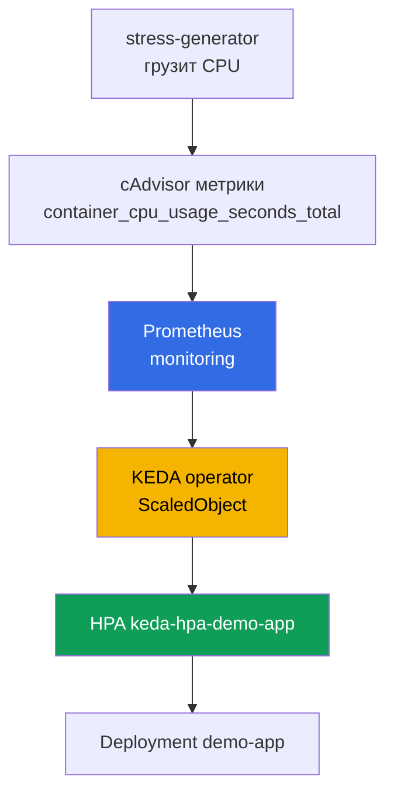
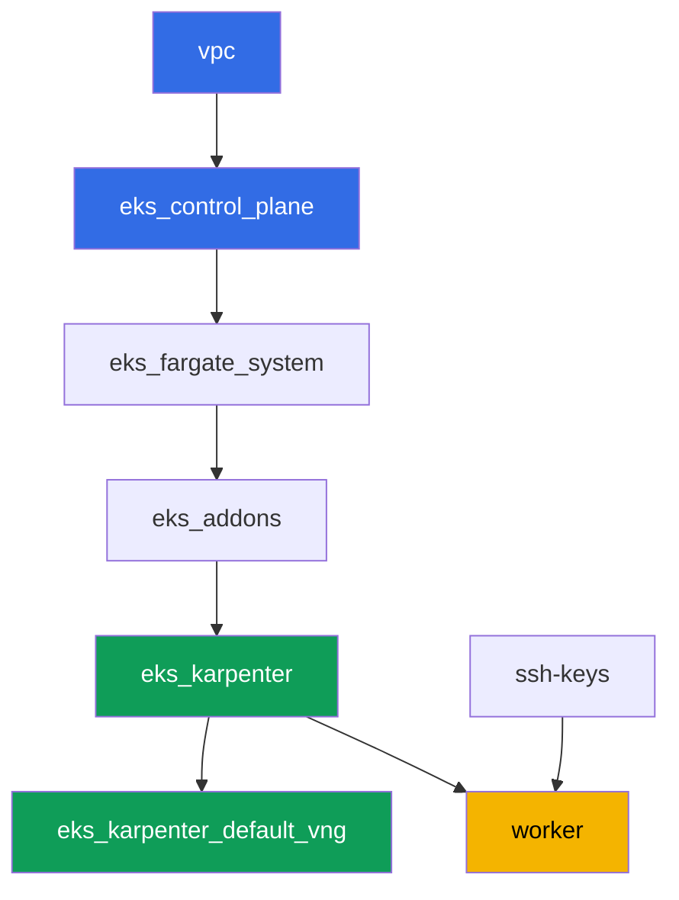

# Лаба 124 - Автомасштабирование приложений: HPA, KEDA, Prometheus

## Описание

Кластер уже развёрнут как код. В этой лабе вы ставите поверх него стек мониторинга и
событийное автомасштабирование: разворачиваете kube-prometheus-stack, устанавливаете KEDA,
создаёте целевой Deployment и настраиваете `ScaledObject` со scaler `prometheus`. Под
капотом KEDA не заменяет HPA, а создаёт и ведёт обычный HPA - вы увидите это своими
глазами через `kubectl get hpa`. Дальше вы нагружаете CPU целевых подов, наблюдаете рост
числа реплик, снимаете нагрузку и фиксируете возврат к минимуму.

Задания в продакшн-стиле: короткая постановка плюс критерии приёмки. Проверка -
автоматическая, командой `check_result`.

## Цель

Закрепить материал главы курса:

- [Глава 35. Автомасштабирование приложений: HPA, внешние метрики, KEDA](../../course/35/ru.md)

## Что мы создаём

Кластер из лабы 101 уже развёрнут. В этой лабе вы добавляете стек мониторинга и цепочку
автомасштабирования поверх него.

| Объект | Что это | Зачем в этой лабе |
|--------|---------|-------------------|
| Namespace `eks-124` | раздел кластера под нагрузку лабы | держим ресурсы отдельно от системных |
| kube-prometheus-stack (`monitoring`) | сервер Prometheus | источник метрики для scaler'а KEDA |
| KEDA (`keda`) | operator и metrics adapter | создаёт и ведёт HPA по внешней метрике |
| Deployment `demo-app` | целевой объект масштабирования | на него ссылается `ScaledObject` |
| `ScaledObject` `demo-app` | CRD KEDA со scaler `prometheus` | описывает триггер масштабирования |
| HPA `keda-hpa-demo-app` | обычный HPA, созданный KEDA | видимое доказательство «KEDA не заменяет HPA» |
| Deployment `stress-generator` | нагрузка на CPU | заставляет метрику расти, чтобы увидеть масштабирование |

Итоговая цепочка масштабирования:



## Инфраструктура

Окружение разворачивается в AWS (`eu-central-1`) через Terragrunt, как в лабе 101. Каждый
каталог лабы - это один компонент со своим `terragrunt.hcl`, который ссылается на общий
модуль в `terraform/modules/` и объявляет зависимости через блоки `dependency`. Terragrunt
строит граф зависимостей и применяет компоненты в правильном порядке. Специфических для
этой лабы terraform-компонентов нет: KEDA, kube-prometheus-stack и нагрузка ставятся
Helm/kubectl прямо с рабочей машины в рамках заданий.

### Модули и зависимости

| Каталог (компонент) | Модуль (`terraform/modules/`) | Зависит от | Что создаёт |
|---------------------|-------------------------------|------------|-------------|
| `vpc` | `vpc_v3` | - | VPC `10.10.0.0/16`, публичные и приватные подсети в двух AZ, NAT |
| `ssh-keys` | `ssh-keys` | - | пара SSH-ключей для рабочей машины и нод |
| `eks_control_plane` | `eks_v2_control_plane` | `vpc` | control plane EKS `1.36`, OIDC, security groups |
| `eks_fargate_system` | `eks_v2_fargate` | `vpc`, `eks_control_plane` | Fargate-профиль для `kube-system` и `karpenter` |
| `eks_addons` | `eks_v2_addons` | `eks_control_plane`, `eks_fargate_system` | аддоны coredns, kube-proxy, vpc-cni, pod-identity |
| `eks_karpenter` | `eks_v2_karpenter` | `vpc`, `eks_control_plane`, `eks_addons`, `eks_fargate_system` | контроллер Karpenter, IAM-роль нод |
| `eks_karpenter_default_vng` | `eks_v2_karpenter_vng` | `vpc`, `eks_control_plane`, `eks_karpenter` | дефолтный NodePool `default` и EC2NodeClass на AL2023 |
| `worker` | `eks_v2_work_pc` | `ssh-keys`, `vpc`, `eks_control_plane`, `eks_karpenter` | рабочая машина с kubectl, helm, тестами и `check_result` |

Граф зависимостей (что применяется раньше, то ниже по стрелке):



Системные поды идут на Fargate, рабочие ноды поднимает Karpenter. Дефолтный NodePool
ограничен `limits.cpu = 100`, этого достаточно для kube-prometheus-stack, KEDA, `demo-app`
и пары реплик `stress-generator` одновременно.

### Где что настраивается

`env.hcl` (общие параметры окружения, читаются всеми компонентами):

| Параметр | Значение в лабе | На что влияет |
|----------|-----------------|---------------|
| `region` | `eu-central-1` | регион всех ресурсов |
| `vpc_default_cidr`, `subnets` | `10.10.0.0/16`, подсети по AZ | адресный план VPC и теги подсетей |
| `prefix` | `eks-task124` | префикс имён ресурсов и тегов |
| `stack_name` | `eks124` | из него собирается `env_name` - имя кластера |
| `k8_version` | `1.36.0` | версия kubectl на рабочей машине |
| `instance_type_worker` | `t3.medium` | тип инстанса рабочей машины |
| `ssh_password_enable`, `access_cidrs` | `true`, `0.0.0.0/0` | доступ по SSH к рабочей машине |
| `root_volume` | `gp3`, `10` | корневой диск рабочей машины |

`inputs` в `terragrunt.hcl` каждого компонента (параметры конкретного модуля) совпадают с
лабой 101: версии control plane и аддонов под `1.36`, контроллер Karpenter `1.8.1`,
дефолтный NodePool без изменения лимитов. Отличаются только `test_url` и `task_script_url`
в `worker/terragrunt.hcl` - они указывают на файлы этой лабы (`labs/124/...`).

## Развёртывание

```bash
TASK=124 make run_eks_task
```

Развёртывание занимает примерно 15-20 минут. В выводе найдите строку с SSH-подключением к
рабочей машине и подключитесь к ней. kubectl и helm там уже настроены.

Полезные команды на рабочей машине:

```bash
time_left       # сколько осталось времени окружения
check_result    # проверить решение
```

> Время на Helm-установки. Установка kube-prometheus-stack тяжелее обычного Deployment:
> поднимаются Prometheus, Alertmanager, kube-state-metrics, node-exporter и operator, это
> занимает примерно 3-5 минут до готовности всех подов. KEDA ставится заметно быстрее.

> Безопасность стенда. В `env.hcl` включены `ssh_password_enable = true` и
> `access_cidrs = ["0.0.0.0/0"]` - это удобно для учебного окружения, но так делать в
> продакшене нельзя. По стандартам курса (главы 0.2, 2, 19) доступ к рабочим машинам
> открывают через AWS SSM Session Manager без публичных SSH-портов наружу, а `access_cidrs`
> сужают до конкретных адресов. Здесь публичный SSH оставлен только ради простоты запуска.

## Задания

---
|        **1**        | **Namespace для нагрузки лабы**                             |
| :-----------------: | :---------------------------------------------------------- |
| Что делаем          | Создайте namespace с именем `eks-124`. Все объекты лабы создаются внутри него. |
| Критерии приёмки    | - namespace `eks-124` существует. |
---
|        **2**        | **Сервер Prometheus для метрик KEDA**                       |
| :-----------------: | :---------------------------------------------------------- |
| Что делаем          | Установите `kube-prometheus-stack` через Helm в namespace `monitoring` (репозиторий `prometheus-community`). Дождитесь готовности подов Prometheus: `kubectl get pods -n monitoring`. |
| Критерии приёмки    | - Service `kube-prometheus-stack-prometheus` существует в `monitoring`;<br/>- поды Prometheus в статусе `Running` и `Ready`. |
---
|        **3**        | **Установка KEDA**                                          |
| :-----------------: | :---------------------------------------------------------- |
| Что делаем          | Установите KEDA через Helm в namespace `keda` (репозиторий `kedacore`). Подтвердите, что `keda-operator` и `keda-operator-metrics-apiserver` в состоянии `Running`. |
| Критерии приёмки    | - поды с label `app=keda-operator` и `app=keda-operator-metrics-apiserver` в `keda` в статусе `Running`. |
---
|        **4**        | **Целевой Deployment для масштабирования**                  |
| :-----------------: | :---------------------------------------------------------- |
| Что делаем          | В namespace `eks-124` создайте Deployment `demo-app`, образ `viktoruj/ping_pong:latest`, `1` реплика, у контейнера задан `resources.requests.cpu: "200m"`. Это тот объект, которым будет управлять KEDA. |
| Критерии приёмки    | - Deployment `demo-app` в `eks-124`, образ `viktoruj/ping_pong`;<br/>- задан `requests.cpu`;<br/>- `1` готовая реплика. |
---
|        **5**        | **ScaledObject со scaler prometheus**                       |
| :-----------------: | :---------------------------------------------------------- |
| Что делаем          | В `eks-124` создайте `ScaledObject` `demo-app` со `scaleTargetRef.name: demo-app`, `minReplicaCount: 1`, `maxReplicaCount: 5`. Триггер типа `prometheus`, `serverAddress` на Service Prometheus в `monitoring` (порт `9090`), `query` считает суммарный CPU usage подов `demo-app` через метрику cAdvisor `container_cpu_usage_seconds_total` (например `sum(rate(container_cpu_usage_seconds_total{namespace="eks-124",pod=~"demo-app.*"}[1m]))`), `threshold` подберите разумно (например `"0.1"`). Подтвердите, что KEDA создала HPA `keda-hpa-demo-app`: `kubectl get hpa -A \| grep keda-hpa`. |
| Критерии приёмки    | - `ScaledObject` `demo-app` в `eks-124` с триггером `prometheus`;<br/>- существует HPA `keda-hpa-demo-app`. |
---
|        **6**        | **Нагрузочный тест: масштабирование вверх**                 |
| :-----------------: | :---------------------------------------------------------- |
| Что делаем          | Сохраните `kubectl get hpa keda-hpa-demo-app -n eks-124` в файл `/var/work/tests/artifacts/6/hpa_before.txt`. Создайте Deployment `stress-generator` в `eks-124` (образ `polinux/stress`, команда `stress --cpu 2`, `2` реплики) с той же меткой `app=demo-app`, чтобы PromQL-запрос из задания 5 учитывал их нагрузку. Подождите 2-3 минуты, пока метрика вырастет и KEDA увеличит число реплик `demo-app`, затем сохраните `kubectl get hpa keda-hpa-demo-app -n eks-124` в файл `/var/work/tests/artifacts/6/hpa_after.txt` так, чтобы в нём число реплик было больше `1`. |
| Критерии приёмки    | - Deployment `stress-generator` в `eks-124`, `2` реплики, метка `app=demo-app`;<br/>- файл `6/hpa_before.txt` не пуст;<br/>- файл `6/hpa_after.txt` не пуст и показывает `REPLICAS` больше `1`. |
---
|        **7**        | **Снятие нагрузки: масштабирование вниз**                   |
| :-----------------: | :---------------------------------------------------------- |
| Что делаем          | Удалите Deployment `stress-generator`. Подождите, пока метрика упадёт и KEDA вернёт число реплик `demo-app` к `minReplicaCount` - при поведении по умолчанию `stabilizationWindowSeconds` для scaleDown это может занять до 5 минут. Сохраните `kubectl get hpa keda-hpa-demo-app -n eks-124` в файл `/var/work/tests/artifacts/7/hpa_after_cooldown.txt` так, чтобы `REPLICAS` было равно `1`. |
| Критерии приёмки    | - Deployment `stress-generator` удалён;<br/>- файл `7/hpa_after_cooldown.txt` не пуст и показывает `REPLICAS` равное `1`. |
---
|        **8**        | **Обычный HPA против HPA, созданного KEDA**                 |
| :-----------------: | :---------------------------------------------------------- |
| Что делаем          | Выполните `kubectl get hpa -A` и сравните вывод с тем, что вы видели в заданиях 5-7. Сохраните в файл `/var/work/tests/artifacts/8/hpa_compare.txt` 2-3 предложения: чем в этом выводе отличается обычный HPA от HPA `keda-hpa-demo-app`, и объяснение, что KEDA не заменяет HPA, а управляет им (упомяните слова `HPA`, `KEDA`, `keda-hpa` и «управля...»). |
| Критерии приёмки    | - файл `8/hpa_compare.txt` не пуст;<br/>- содержит слова `HPA`, `KEDA`, `keda-hpa` и корень «управля». |
---

## Проверка результата

На рабочей машине запустите автоматическую проверку:

```bash
check_result
```

Тесты 6 и 7 ждут результата масштабирования циклами с ограничением по времени (до
нескольких минут), поэтому не пугайтесь, если `check_result` выполняется дольше обычного.

## Решение

Эталонное решение: [worker/files/solutions/1.MD](worker/files/solutions/1.MD)

## Удаление кластера и ресурсов

```bash
TASK=124 make delete_eks_task
```
