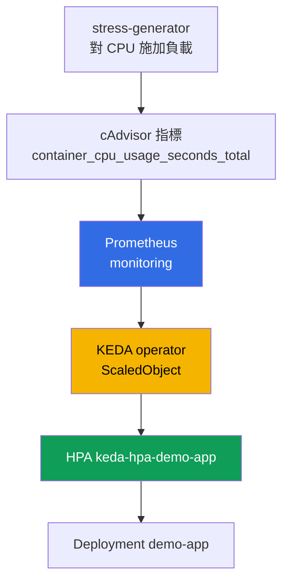
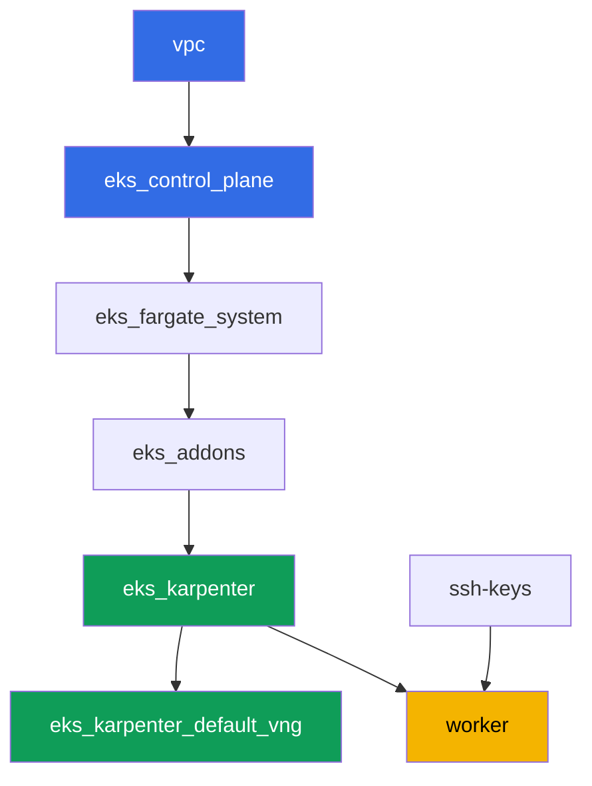

[Русская версия](README_RU.MD) · [Eng version](README.MD) · [Versión en español](README_ES.MD) · [Version française](README_FR.MD) · [Deutsche Version](README_DE.MD) · [ქართული ვერსია](README_GE.MD) · [日本語版](README_JP.MD)

# 實驗 124 - 應用程式自動擴縮:HPA、KEDA、Prometheus

## 說明

集群已經以程式碼形式部署完成。在這個實驗中,你會在它上面架設監控堆疊和事件驅動的自
動擴縮:部署 kube-prometheus-stack、安裝 KEDA、創建目標 Deployment,並用
`prometheus` scaler 配置一個 `ScaledObject`。在底層,KEDA 並不會取代 HPA,而是創建並
管理一個普通的 HPA - 你會透過 `kubectl get hpa` 親眼看到這一點。接下來你會對目標 pod
的 CPU 施加負載,觀察副本數量的成長,再移除負載並確認它回落到最小值。

任務以生產風格編寫:簡短的任務描述加驗收標準。驗證是自動的,透過 `check_result` 命令
完成。

## 目標

鞏固以下課程章節的內容:

- [第 35 章。應用程式自動擴縮:HPA、外部指標、KEDA](../../course/35/ru.md)

## 我們要創建什麼

實驗 101 的集群已經部署完成。在這個實驗中,你會在它上面添加一套監控堆疊和一條自動擴
縮鏈路。

| 對象 | 這是什麼 | 在這個實驗中的作用 |
|--------|---------|-------------------|
| Namespace `eks-124` | 集群中供這個實驗負載使用的區段 | 讓資源與系統資源保持分離 |
| kube-prometheus-stack(`monitoring`) | Prometheus 伺服器 | KEDA scaler 的指標來源 |
| KEDA(`keda`) | operator 和 metrics adapter | 依外部指標創建並管理一個 HPA |
| Deployment `demo-app` | 擴縮的目標對象 | `ScaledObject` 所引用的對象 |
| `ScaledObject` `demo-app` | 帶有 `prometheus` scaler 的 KEDA CRD | 描述擴縮的觸發條件 |
| HPA `keda-hpa-demo-app` | 由 KEDA 創建的普通 HPA | 「KEDA 不會取代 HPA」的可見證明 |
| Deployment `stress-generator` | CPU 負載 | 讓指標成長,以便你能看到擴縮的過程 |

最終的擴縮鏈路:



## 基礎設施

環境透過 Terragrunt 部署在 AWS(`eu-central-1`),與實驗 101 相同。每個實驗目錄都是一
個組件,擁有自己的 `terragrunt.hcl`,它引用 `terraform/modules/` 中的共用模組,並透過
`dependency` 區塊聲明依賴關係。Terragrunt 會建立依賴關係圖,並按正確的順序套用各個組
件。這個實驗沒有專屬的 terraform 組件:KEDA、kube-prometheus-stack 和負載都是在任務執
行過程中,直接從工作機透過 Helm/kubectl 安裝的。

### 模組與依賴關係

| 目錄(組件) | 模組(`terraform/modules/`) | 依賴於 | 創建了什麼 |
|---------------------|-------------------------------|------------|-------------|
| `vpc` | `vpc_v3` | - | VPC `10.10.0.0/16`,兩個 AZ 中的公共與私有子網,NAT |
| `ssh-keys` | `ssh-keys` | - | 供工作機與節點使用的一對 SSH 金鑰 |
| `eks_control_plane` | `eks_v2_control_plane` | `vpc` | EKS control plane `1.36`、OIDC、security groups |
| `eks_fargate_system` | `eks_v2_fargate` | `vpc`、`eks_control_plane` | `kube-system` 與 `karpenter` 的 Fargate 配置檔 |
| `eks_addons` | `eks_v2_addons` | `eks_control_plane`、`eks_fargate_system` | coredns、kube-proxy、vpc-cni、pod-identity 附加元件 |
| `eks_karpenter` | `eks_v2_karpenter` | `vpc`、`eks_control_plane`、`eks_addons`、`eks_fargate_system` | Karpenter 控制器、節點 IAM 角色 |
| `eks_karpenter_default_vng` | `eks_v2_karpenter_vng` | `vpc`、`eks_control_plane`、`eks_karpenter` | 基於 AL2023 的預設 NodePool `default` 與 EC2NodeClass |
| `worker` | `eks_v2_work_pc` | `ssh-keys`、`vpc`、`eks_control_plane`、`eks_karpenter` | 帶有 kubectl、helm、測試腳本和 `check_result` 的工作機 |

依賴關係圖(較早套用的組件位於箭頭下方):



系統 pod 運行在 Fargate 上,工作節點由 Karpenter 拉起。預設 NodePool 的限制是
`limits.cpu = 100`,這足以同時容納 kube-prometheus-stack、KEDA、`demo-app`,以及幾個
`stress-generator` 副本。

這個實驗的 NodePool 與實驗 101 相比有兩處不同,而且都是刻意為之:instance 只從 `m`、
`r`、`c` 這幾個類別中選取,大小從 `large` 起(小型的 burstable 節點撐不住監控堆疊加上
持續的 CPU 負載),而且 `consolidationPolicy` 設為 `WhenEmpty`,這樣整合(consolidation)
就不會在 scale-down 過程中把 Prometheus 搬走。詳細說明在任務區塊之後。

### 哪裡配置了什麼

`env.hcl`(環境的共用參數,由所有組件讀取):

| 參數 | 這個實驗中的值 | 影響的內容 |
|----------|-----------------|---------------|
| `region` | `eu-central-1` | 所有資源的區域 |
| `vpc_default_cidr`、`subnets` | `10.10.0.0/16`,按 AZ 劃分的子網 | VPC 的位址方案與子網標籤 |
| `prefix` | `eks-task124` | 資源名稱與標籤的前綴 |
| `stack_name` | `eks124` | 用來組成 `env_name` - 集群名稱 |
| `k8_version` | `1.36.0` | 工作機上的 kubectl 版本 |
| `instance_type_worker` | `t3.medium` | 工作機的 instance 類型 |
| `ssh_password_enable`、`access_cidrs` | `true`、`0.0.0.0/0` | 對工作機的 SSH 存取 |
| `root_volume` | `gp3`、`10` | 工作機的根磁碟 |

每個組件 `terragrunt.hcl` 中的 `inputs`(特定模組的設定)與實驗 101 相同:`1.36` 對應
的 control plane 與附加元件版本、Karpenter 控制器 `1.8.1`、限制未變的預設 NodePool。
唯一不同的是 `worker/terragrunt.hcl` 中的 `test_url` 和 `task_script_url` - 它們指向
這個實驗的檔案(`labs/124/...`)。

## 部署

```bash
TASK=124 make run_eks_task
```

部署大約需要 15-20 分鐘。在輸出中找到連接工作機的 SSH 那一行並連接上去。那裡的
kubectl 和 helm 已經配置好了。

工作機上的常用命令:

```bash
time_left       # 環境剩餘的時間
check_result    # 檢查解答
```

> Helm 安裝所需的時間。安裝 kube-prometheus-stack 比一般的 Deployment 重得多:
> Prometheus、kube-state-metrics、node-exporter 和 operator 都會一起啟動,直到所有
> pod 都就緒大約需要 2-3 分鐘(這個實驗會關閉 Grafana 和 Alertmanager,見任務 2)。
> KEDA 的安裝明顯快得多。測試台上的實測數據:負載開始後 60-90 秒副本數量開始成長,負
> 載移除後 5 分鐘才回落到最小值 - 這是 HPA 的穩定化視窗,你需要耐心等待。

> 環境安全性。`env.hcl` 中啟用了 `ssh_password_enable = true` 和
> `access_cidrs = ["0.0.0.0/0"]` - 這對於學習環境很方便,但在生產環境中不應該這樣做。
> 依照課程標準(第 0.2、2、19 章),對工作機的存取應透過 AWS SSM Session Manager 進
> 行,不對外暴露公開的 SSH 端口,並將 `access_cidrs` 限制到具體的位址。這裡保留公開
> SSH 只是為了簡化啟動流程。

## 任務

---
|        **1**        | **這個實驗負載用的 Namespace**                             |
| :-----------------: | :---------------------------------------------------------- |
| 我們要做什麼          | 創建一個名為 `eks-124` 的 namespace。這個實驗的所有對象都創建在它內部。 |
| 驗收標準    | - namespace `eks-124` 存在。 |
---
|        **2**        | **供 KEDA 指標使用的 Prometheus 伺服器**                       |
| :-----------------: | :---------------------------------------------------------- |
| 我們要做什麼          | 透過 Helm 把 `kube-prometheus-stack` 安裝到 namespace `monitoring`(倉庫 `prometheus-community`)。這個實驗只需要 Prometheus 伺服器,所以要關閉 Grafana 和 Alertmanager,並為 Prometheus 的 pod 明確設定 `requests`(`cpu: 200m`、`memory: 512Mi`) - 為什麼需要這樣做,在任務表下方有說明。等待 pod 就緒:`kubectl get pods -n monitoring`。 |
| 驗收標準    | - Service `kube-prometheus-stack-prometheus` 存在於 `monitoring` 中;<br/>- Prometheus 的 pod 處於 `Running` 且 `Ready`;<br/>- Prometheus 的 pod 設定了 `requests`,也就是 `qosClass` 不是 `BestEffort`。 |
---
|        **3**        | **安裝 KEDA**                                          |
| :-----------------: | :---------------------------------------------------------- |
| 我們要做什麼          | 透過 Helm 把 KEDA 安裝到 namespace `keda`(倉庫 `kedacore`)。確認 `keda-operator` 和 `keda-operator-metrics-apiserver` 處於 `Running`。 |
| 驗收標準    | - `keda` 中帶有標籤 `app=keda-operator` 和 `app=keda-operator-metrics-apiserver` 的 pod 處於 `Running`。 |
---
|        **4**        | **擴縮目標 Deployment**                  |
| :-----------------: | :---------------------------------------------------------- |
| 我們要做什麼          | 在 namespace `eks-124` 中創建 Deployment `demo-app`,映像 `viktoruj/ping_pong:latest`,`1` 個副本,容器設定 `resources.requests.cpu: "200m"`。這就是 KEDA 將要管理的對象。 |
| 驗收標準    | - Deployment `demo-app` 在 `eks-124` 中,映像 `viktoruj/ping_pong`;<br/>- 設定了 `requests.cpu`;<br/>- `1` 個就緒副本。 |
---
|        **5**        | **帶有 prometheus scaler 的 ScaledObject**                       |
| :-----------------: | :---------------------------------------------------------- |
| 我們要做什麼          | 在 `eks-124` 中創建 `ScaledObject` `demo-app`,`scaleTargetRef.name: demo-app`、`minReplicaCount: 1`、`maxReplicaCount: 5`。觸發器類型為 `prometheus`,`serverAddress` 指向 `monitoring` 中的 Prometheus Service(埠 `9090`),`query` 透過 cAdvisor 指標 `container_cpu_usage_seconds_total` 計算任務 6 中負載產生器 pod 的總 CPU 使用量(`sum(rate(container_cpu_usage_seconds_total{namespace="eks-124",pod=~"stress-generator.*"}[1m]))`),`threshold` 選一個合理的值(例如 `"0.1"`)。注意:`demo-app` 是依據別人的 pod 的負載來擴縮的 - 一般依 CPU 擴縮的 HPA 做不到這一點,這正是外部指標存在的意義。確認 KEDA 創建了 HPA `keda-hpa-demo-app`:`kubectl get hpa -A \| grep keda-hpa`。 |
| 驗收標準    | - `eks-124` 中存在帶有 `prometheus` 觸發器的 `ScaledObject` `demo-app`;<br/>- HPA `keda-hpa-demo-app` 存在。 |
---
|        **6**        | **負載測試:向上擴縮**                 |
| :-----------------: | :---------------------------------------------------------- |
| 我們要做什麼          | 把 `kubectl get hpa keda-hpa-demo-app -n eks-124` 的輸出保存到檔案 `/var/work/tests/artifacts/6/hpa_before.txt`。在 `eks-124` 中創建 Deployment `stress-generator`:映像 `polinux/stress`,命令 `stress --cpu 2`,`2` 個副本,擁有自己的標籤 `app=stress-generator`,`requests.cpu: 200m`,並且務必設定 `limits.cpu: 500m`,再加上針對 `kubernetes.io/arch: amd64` 的 `nodeSelector`。為什麼需要這個 limit 和這個 selector,在任務表下方有說明。等待 1-2 分鐘,讓指標成長並讓 KEDA 增加 `demo-app` 的副本數量,然後把 `kubectl get hpa keda-hpa-demo-app -n eks-124` 的輸出保存到檔案 `/var/work/tests/artifacts/6/hpa_after.txt`,使其中的副本數量大於 `1`。 |
| 驗收標準    | - Deployment `stress-generator` 在 `eks-124` 中,`2` 個副本,設定了 `limits.cpu`;<br/>- 檔案 `6/hpa_before.txt` 不為空;<br/>- 檔案 `6/hpa_after.txt` 不為空,並顯示 `REPLICAS` 大於 `1`。 |
---
|        **7**        | **移除負載:向下擴縮**                   |
| :-----------------: | :---------------------------------------------------------- |
| 我們要做什麼          | 刪除 Deployment `stress-generator`。指標幾乎立刻降為零(生成器的 pod 序列已從 Prometheus 中消失,KEDA 回報 `0`),但副本數量會保持不變:scaleDown 的 `stabilizationWindowSeconds` 預設為 `300` 秒。在測試台上,`TARGETS` 在 30 秒後變為零,副本數量在 5 分鐘後回落到 `1` - 這是正常的行為,不是卡住了。等待 `REPLICAS` 等於 `1`,並把 `kubectl get hpa keda-hpa-demo-app -n eks-124` 的輸出保存到檔案 `/var/work/tests/artifacts/7/hpa_after_cooldown.txt`。 |
| 驗收標準    | - Deployment `stress-generator` 已被刪除;<br/>- 檔案 `7/hpa_after_cooldown.txt` 不為空,並顯示 `REPLICAS` 等於 `1`。 |
---
|        **8**        | **普通 HPA 與 KEDA 創建的 HPA 對比**                 |
| :-----------------: | :---------------------------------------------------------- |
| 我們要做什麼          | 執行 `kubectl get hpa -A`,並將輸出與任務 5-7 中看到的內容進行比較。把 2-3 句話保存到檔案 `/var/work/tests/artifacts/8/hpa_compare.txt`:這份輸出中普通 HPA 和 HPA `keda-hpa-demo-app` 有什麼不同,以及解釋 KEDA 並不會取代 HPA,而是控制它,也就是 `control` 它(要提到 `HPA`、`KEDA`、`keda-hpa` 這幾個詞,以及 `control`)。 |
| 驗收標準    | - 檔案 `8/hpa_compare.txt` 不為空;<br/>- 其中包含 `HPA`、`KEDA`、`keda-hpa` 這幾個詞,以及 `control`。 |
---

### 為什麼任務中出現了 requests、limit 和 nodeSelector

上面這三項要求看起來像是小細節,但缺了它們這個實驗就會垮掉,而且這三者都是典型的生
產環境陷阱,不是測試台的特有問題。

**Prometheus 的 requests,以及關閉 Grafana 和 Alertmanager。** 預設情況下
`kube-prometheus-stack` 的 pod 沒有任何 `requests` 或 `limits`,所以它們的
`qosClass` 是 `BestEffort`。這會帶來兩個後果。Karpenter 是根據 `requests` 的總和來決
定節點大小的(第 12 章),所以它完全不知道監控堆疊的需求,只會把它塞進最便宜的
instance。接下來是 kubelet:在記憶體不足時,它會優先驅逐 `BestEffort` 的 pod(第 14
章)。在測試台上情況是這樣的 - 實際使用量大約是 Grafana 325 MiB、Prometheus 264
MiB、整個堆疊大約 750 MiB,還有一則節點事件:

```
Evicted  prometheus-kube-prometheus-stack-prometheus-0
The node was low on resource: memory. Threshold quantity: 45347Ki, available: 44068Ki
```

Prometheus 被驅逐了,`emptyDir` 中的指標歷史也隨之丟失,HPA 的 `TARGETS` 顯示
`<unknown>/100m`。解決方法正好是兩件事:不要把這個實驗不需要的東西帶進來(Grafana 是
這個 chart 中最重的組件,而這裡沒有人會打開它的儀表板),以及明確聲明 Prometheus 的
需求,讓排程器和 Karpenter 都能看到。

**負載產生器上的 CPU limit。** `stress --cpu 2` 在兩個副本上就是四個 CPU worker,它
們會佔用所能拿到的一切資源。沒有 `limits.cpu` 的話,它們會讓 kubelet 拿不到 CPU,節
點進入 `NotReady`,Karpenter 把它當作不健康的節點替換掉,pod 被重新排程,實驗就垮
了。`limits.cpu: 500m` 讓負載保持可預期:cgroup 對容器進行節流,生成器整體大約產生一
個核心的負載,指標穩穩地維持在門檻之上,節點也能存活下來。

**針對 amd64 的 nodeSelector。** 這個實驗的 NodePool 同時允許 `amd64` 和 `arm64`,而
`polinux/stress` 這個映像只針對 `amd64` 建置(在倉庫中它只有一個單一的 manifest,沒
有平台清單)。如果 Karpenter 拉起了一個 Graviton 節點,pod 就會因為
`exec format error` 而失敗。`viktoruj/ping_pong` 映像是多架構的,所以 `demo-app` 不
需要 selector。這是一個通用規則:在一個混合架構的機群中,單一架構的映像必須帶有
selector(第 12、13 章)。

順便看一下這個實驗 NodePool 中的 `disruption`:這裡的 `consolidationPolicy` 是
`WhenEmpty`,而不是 `WhenEmptyOrUnderutilized`。原因是一樣的 - 在 scale-down 期間,
過於激進的整合會開始把 Prometheus 連同它的歷史資料一起搬走。整合(consolidation)這
個主題本身在實驗 123 中有詳細討論。

## 檢查結果

在工作機上執行自動檢查:

```bash
check_result
```

任務 6 和 7 會在有時間限制的迴圈中等待擴縮結果(最多幾分鐘),所以如果
`check_result` 執行的時間比平常長,不要感到意外。

## 解決方案

參考解決方案:[worker/files/solutions/1_TW.MD](worker/files/solutions/1_TW.MD)

## 刪除集群與資源

> **先移除負載,等 EC2 節點消失之後,再拆除這個環境。**
> 這個實驗不會手動創建任何 AWS 資源,其他一切都是 Kubernetes 對象,所以這裡只有一個
> 危險:如果在負載仍在運行時刪除集群,Karpenter 的 EC2 節點會隨之消失,但 VPC CNI 的
> 次要 ENI 會停留在 `available` 狀態,並繼續佔用節點的 security group。這樣一來,
> `destroy` 就會在
> `module.eks.aws_security_group.node[0]: Still destroying...` 上卡住幾十分鐘。

```bash
# 1. 移除負載和擴縮鏈路(ScaledObject 會隨著 namespace 一起消失,
#    KEDA 會自己刪除 HPA keda-hpa-demo-app)
kubectl delete namespace eks-124 --ignore-not-found

# 2. 移除監控堆疊和 KEDA。Helm release 不會留下 AWS 資源:
#    這個 chart 預設不會創建 PVC(Prometheus 把資料保存在 emptyDir 中),可以這樣檢查
kubectl get pvc -A
helm uninstall kube-prometheus-stack -n monitoring
helm uninstall keda -n keda
kubectl delete namespace monitoring keda --ignore-not-found

# 3. 等待 Karpenter 移除 NodeClaim 和 EC2 節點(應該只剩下 fargate-*)
while kubectl get nodeclaims --no-headers 2>/dev/null | grep -q .; do
  echo "NodeClaim 仍然存活,等待中..."; sleep 15
done
kubectl get nodes | grep -v fargate
```

只有在此之後,才能拆除這個環境:

```bash
TASK=124 make delete_eks_task
```

如果 `destroy` 仍然卡在節點的 security group 上,說明留下了一個孤立的 ENI。找到並刪
除它:

```bash
aws ec2 describe-network-interfaces --filters Name=status,Values=available \
  --query 'NetworkInterfaces[?Tags[?Key==`eks:eni:owner`]].[NetworkInterfaceId,Description]' \
  --output table
aws ec2 delete-network-interface --network-interface-id <eni-id>
```

`kube-prometheus-stack` 和 KEDA 留下的 CRD(`prometheuses`、`servicemonitors`、
`scaledobjects` 等)不需要單獨移除 - 整個集群會被完全刪除。這一點值得記住的場景是另
一種情況:如果 chart 被重新安裝到一個仍在運行的集群中,`helm uninstall` 並不會移除這
些 CRD。
