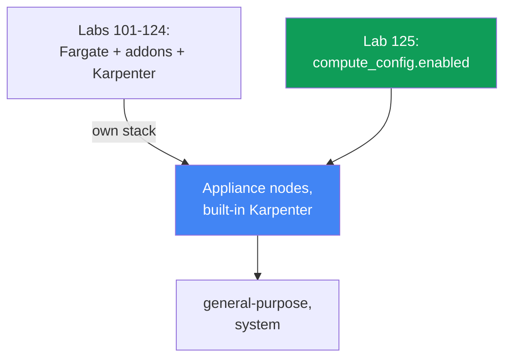
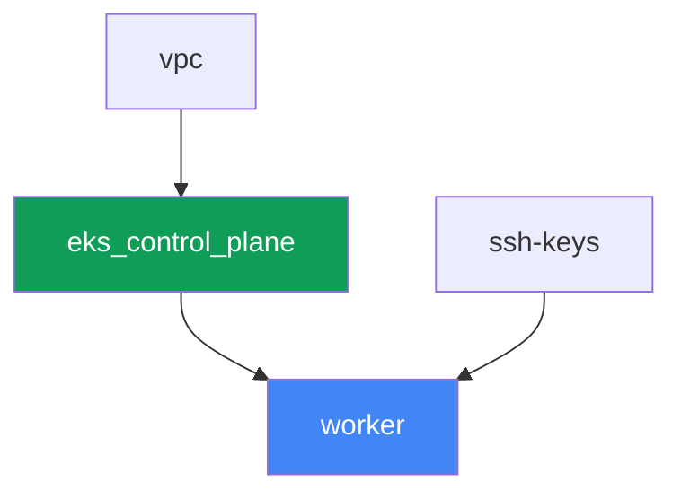

[Русская версия](README_RU.MD) · [Versión en español](README_ES.MD) · [Version française](README_FR.MD) · [Deutsche Version](README_DE.MD) · [ქართული ვერსია](README_GE.MD) · [繁體中文版](README_TW.MD) · [日本語版](README_JP.MD)

# Lab 125 - EKS Auto Mode vs. your own stack

## Description

In labs 101-124 the cluster was assembled from separate parts: control plane, Fargate for
system pods, a separately installed Karpenter and its NodePool. In this lab the cluster is
built fundamentally differently - EKS Auto Mode is enabled, and AWS manages the nodes
itself as an appliance: it picks the AMI, turns on SELinux in enforcing mode and a
read-only root, closes off SSH and SSM, handles scaling through a built-in Karpenter, and
keeps a built-in pod network, DNS, EBS CSI and ELB integration. The managed addons
`vpc-cni`, `kube-proxy`, `coredns` and `aws-ebs-csi-driver` are not installed at all in this
lab - they are redundant, because Auto Mode does the same job itself. You will enable only
the built-in NodePool `general-purpose`, confirm that the second built-in NodePool `system`
does not roll out nodes while disabled, try to edit the built-in NodePool and see it get
accepted anyway, and then create your own NodePool with explicit `limits` - because the
built-in pools don't have any.

Tasks are written in a production style: a short statement plus acceptance criteria.
Checking is automatic, via the `check_result` command.

## Goal

Reinforce the material from this course chapter:

- [Chapter 9. Compute types: managed node groups, self-managed, Fargate, Auto
  Mode](../../course/09/ru.md) - when to turn on EKS Auto Mode and when to build your
  own stack

## What we're creating

The cluster is deployed as code, but without a Fargate profile and without an external
Karpenter - the control plane is created right away with `compute_config.enabled = true`
and only one built-in NodePool enabled.

| Object | What it is | Why it's in this lab |
|--------|---------|-------------------|
| `compute_config.enabled = true` | Auto Mode flag on the control plane | turns on appliance nodes, the built-in Karpenter, networking, DNS, EBS CSI, ELB |
| NodePool `general-purpose` (built-in) | the only enabled built-in NodePool | the target for the workload; C/M/R, on-demand only, generation 5+ |
| NodePool `system` (built-in, disabled) | the second built-in NodePool | stays disabled - without it `CriticalAddonsOnly` pods get no node |
| Namespace `eks-125` | a cluster section for the lab's workload | keeps resources separate from system ones |
| Deployment `web` (2 replicas) | the ping_pong application on `general-purpose` | confirms that Auto Mode really brings up and schedules nodes |
| Artifact `nossh.txt` | an SSH/SSM attempt on an Auto Mode node | records the documented restriction - there is no access |
| Own NodePool `custom-limited` | a NodePool with explicit `limits` | built-in pools have no `limits`, your own pool sets them yourself |

The difference between the base of labs 101-124 and this lab:



## Infrastructure

The environment is deployed in AWS (`eu-central-1`) via Terragrunt. Unlike the base of lab
101, here there are only three infrastructure components before the worker machine: `vpc`,
`ssh-keys` and `eks_control_plane`. The components `eks_fargate_system`, `eks_addons`,
`eks_karpenter`, `eks_karpenter_default_vng` don't exist at all in this lab - Auto Mode
replaces all of that with the service's own functionality.

### Modules and dependencies

| Directory (component) | Module (`terraform/modules/`) | Depends on | What it creates |
|---------------------|-------------------------------|------------|-------------|
| `vpc` | `vpc_v3` | - | VPC `10.10.0.0/16`, subnets in two AZs, NAT |
| `ssh-keys` | `ssh-keys` | - | an SSH key pair for the worker machine (Auto Mode nodes don't need a key) |
| `eks_control_plane` | `eks_v2_control_plane` | `vpc` | EKS control plane `1.36` with `compute_config.enabled = true`, `node_pools = ["general-purpose"]` |
| `worker` | `eks_v2_work_pc` | `ssh-keys`, `vpc`, `eks_control_plane` | worker machine with kubectl, tests, and `check_result` |

Dependency graph (what gets applied earlier is lower down the arrow):



### What changed in the `eks_v2_control_plane` module

The module `terraform/modules/eks_v2_control_plane` got a new **optional** parameter
`compute_config` inside the `eks` object (`null` by default). The change is additive: all
other labs in the course that use this module pass the `eks` object without this field and
keep working unchanged - `compute_config = null` means the upstream module
`terraform-aws-modules/eks/aws` does not create a `compute_config` block at all, exactly as
before this lab. In this lab `eks_control_plane/terragrunt.hcl` passes
`compute_config = { enabled = true, node_pools = ["general-purpose"] }` - this is the only
difference in inputs from lab 101.

The worker machine module `terraform/modules/eks_v2_work_pc` got three additional
permissions, all needed by this lab's tasks: `ssm:GetConnectionStatus` and
`ssm:DescribeInstanceInformation` (task 4 proves that the node isn't connected to SSM) and
`iam:PassRole` on roles `*-eks-auto-*` with the condition
`iam:PassedToService: eks.amazonaws.com` - without it `aws eks update-cluster-config` for
Auto Mode replies `AccessDeniedException`, and the student wouldn't be able to enable the
second built-in pool or restore a deleted one. The change is additive and doesn't affect
the other labs in the course.

There's no separate terraform module for nodes or NodePool in this lab: the built-in
NodePools `general-purpose` and `system` are part of EKS Auto Mode itself, not a resource
created by terraform. They're managed only through `computeConfig.nodePools` on the
control plane (see tasks 1-2) or through `kubectl` for your own NodePool (task 5).

### Where things are configured

`env.hcl` (shared environment parameters):

| Parameter | Value in the lab | What it affects |
|----------|-----------------|---------------|
| `region` | `eu-central-1` | region for all resources |
| `prefix` | `eks-task125` | prefix for resource names and tags |
| `stack_name` | `eks125` | used to build `env_name` - the cluster name |
| `k8_version` | `1.36.0` | kubectl version on the worker machine |

`inputs` in each component's `terragrunt.hcl`:

| File | Key settings |
|------|--------------------|
| `eks_control_plane/terragrunt.hcl` | `eks.compute_config.enabled = true`, `node_pools = ["general-purpose"]` |
| `worker/terragrunt.hcl` | `test_url`, `task_script_url` for the lab 125 files; no dependency on a Karpenter component |

## Deployment

```bash
TASK=125 make run_eks_task
```

Deployment takes roughly 15-20 minutes. In the output, find the line with the SSH
connection to the worker machine and connect to it. kubectl there is already configured
for the right cluster.

Useful commands on the worker machine:

```bash
time_left       # how much environment time is left
check_result    # check the solution
```

> Environment security. `env.hcl` has `ssh_password_enable = true` and
> `access_cidrs = ["0.0.0.0/0"]` enabled - convenient for a training environment, but this
> is not something to do in production. Per the course standards (chapters 0.2, 2, 19),
> access to worker machines should go through AWS SSM Session Manager without exposing
> public SSH ports, and `access_cidrs` should be narrowed down to specific addresses. Here
> public SSH is left in place only to keep the setup simple - it doesn't affect the Auto
> Mode nodes themselves, which have no access at all (task 4).

## Tasks

---
|        **1**        | **Confirming the mode: Auto Mode is enabled**                  |
| :-----------------: | :------------------------------------------------------------ |
| What to do          | Determine the cluster name from kubeconfig (`kubectl config current-context \| awk -F/ '{print $NF}'`) - this is more reliable than `list-clusters[0]`, which in an account with several clusters would point to someone else's. Run `aws eks describe-cluster --name <cluster> --query 'cluster.computeConfig'` and confirm that `enabled: true` and `nodePools` contains `general-purpose`. Run `kubectl get nodepools` and confirm that `general-purpose` is in the list. Save both outputs to `/var/work/tests/artifacts/1/automode.txt`. |
| Acceptance criteria    | - file `1/automode.txt` is not empty, contains `"enabled": true` and `general-purpose`. |
---
|        **2**        | **The second built-in NodePool is disabled**                       |
| :-----------------: | :------------------------------------------------------------ |
| What to do          | Check that `system` is not among the active NodePools: `kubectl get nodepools` should not show `system` (a built-in NodePool appears as a Kubernetes resource only once it's enabled in `computeConfig.nodePools`). Explain in `/var/work/tests/artifacts/2/twopools.txt` why the `system` NodePool matters in production - it carries the `CriticalAddonsOnly` taint, tolerated by system components like CoreDNS, and it lets you keep pods critical for the cluster separate from regular workload. The text must contain the words `system` and `CriticalAddonsOnly`. |
| Acceptance criteria    | - `kubectl get nodepools` doesn't contain `system`;<br/>- file `2/twopools.txt` is not empty and contains `system` and `CriticalAddonsOnly`. |
---
|        **3**        | **Workload on general-purpose and who owns the built-in NodePool** |
| :-----------------: | :------------------------------------------------------------ |
| What to do          | Create namespace `eks-125` and Deployment `web` (image `viktoruj/ping_pong:latest`, `2` replicas). Wait until Auto Mode brings up a node for them and both pods reach `Running`. Then try to edit the built-in NodePool: `kubectl patch nodepool general-purpose --type merge -p '{"spec":{"limits":{"cpu":"100"}}}'`. The edit WILL go through - there's no admission-level ban. Find out who owns the object: check the `app.kubernetes.io/managed-by` label and the list `metadata.managedFields[*].manager`. Put into `/var/work/tests/artifacts/3/builtin.txt` the patch output, both owner checks, and a note on why such an edit is not a supported way to configure it. Afterwards return the pool to its original state: `kubectl patch nodepool general-purpose --type merge -p '{"spec":{"limits":null}}'`. |
| Acceptance criteria    | - Deployment `web` in `eks-125`, `2` ready replicas, not a single pod on Fargate;<br/>- file `3/builtin.txt` is not empty, contains `patched` and the object's owner (`managed-by` or `eks-auto-mode`). |
---
|        **4**        | **No operator access to the node, but the host isn't hidden**         |
| :-----------------: | :------------------------------------------------------------ |
| What to do          | Determine the node that pod `web` runs on (`kubectl get pods -n eks-125 -o wide`) - in Auto Mode the node name is the instance ID itself. Gather three facts and put them into `/var/work/tests/artifacts/4/nossh.txt`: (1) the instance has no key pair - `aws ec2 describe-instances --instance-ids <node> --query 'Reservations[0].Instances[0].KeyName'` returns `null`, meaning SSH by key is impossible in principle; (2) SSM is not connected - `aws ssm get-connection-status --target <node>` returns `notconnected`, and `aws ssm describe-instance-information` doesn't show this node; (3) at the same time the host is NOT isolated from the cluster: run a pod in `eks-125` with `securityContext.privileged: true` and a `hostPath` on `/` mounted at `/host`, and read `/host/etc/os-release` - you'll see `NAME=Bottlerocket`. Add a conclusion: Auto Mode closes the operator's door (SSH, SSM), but not the cluster-admin door - that's covered by Pod Security Admission and policies (chapters 19 and 22). Remove the pod after checking. |
| Acceptance criteria    | - file `4/nossh.txt` is not empty and contains all three pieces of evidence: `KeyName`, `notconnected` and `Bottlerocket`. |
---
|        **5**        | **Your own NodePool with explicit limits**                              |
| :-----------------: | :------------------------------------------------------------ |
| What to do          | Built-in NodePools have no `limits` - with unlimited workload growth this is a risk of uncontrolled costs. Create your own NodePool `custom-limited`, using a `nodeClassRef` pointing at the built-in `NodeClass` `default` (`group: eks.amazonaws.com`, `kind: NodeClass`, `name: default`), with `requirements` on instance categories `c`, `m`, `r` and an explicit `limits` block (`cpu: "10"`, `memory: 10Gi`). Apply the manifest and wait for `kubectl get nodepool custom-limited` to show status `Ready`. |
| Acceptance criteria    | - NodePool `custom-limited` exists, `spec.limits.cpu` equals `"10"`;<br/>- `spec.template.spec.nodeClassRef.name` equals `default`. |
---

### Where exactly the Auto Mode boundary runs

The two tasks above are deliberately set up so you see facts, not slogans. Both spots are
worded imprecisely even in retellings of the documentation, so check them by hand.

**"Built-in pools cannot be edited" is a contract, not an admission-level ban.**
AWS documentation says about built-in NodePools "can be enabled or disabled but not
modified", and it's easy to assume the API will reject an edit. It accepts it:
`kubectl patch` returns `nodepool.karpenter.sh/general-purpose patched`, and the value
stays in the object. The real boundary is elsewhere: the object belongs to the service, it
carries the label `app.kubernetes.io/managed-by: eks` and its fields are owned by
`eks-auto-mode`. As soon as the pool name changes in `computeConfig.nodePools`, the
resource is deleted along with its nodes, and when the name comes back it's created from
scratch, without your edits. Verified on the test bench: after disabling and re-enabling
the pool, `spec.limits` came back empty, even though `cpu: 100` had been set there before.

> **Don't delete a built-in NodePool via kubectl.** `kubectl delete nodepool
> general-purpose` goes through, the pool's nodes drain and terminate, but EKS itself does
> NOT recreate the object - verified, after five minutes the pool didn't come back and the
> cluster was left without compute. Recovery is only through changing `computeConfig`:
> remove and add the pool name back (the call needs to pass `--compute-config`,
> `--storage-config` and `--kubernetes-network-config` together, otherwise EKS answers
> `The type for cluster update was not provided`, and it won't accept an empty `nodePools`
> list together with `nodeRoleArn`).

**"No access to the node" is only true about operator access.** SSH is impossible: the
instance has no key pair (`KeyName` is empty), the image is Bottlerocket, with no shell and
no package manager. SSM is not connected: `get-connection-status` answers `notconnected`,
the node isn't in the `describe-instance-information` inventory. But a privileged pod with
a `hostPath` on `/` calmly reads the host's file system and shows `NAME=Bottlerocket` and
the contents of `/bin` (there you'll find `apiclient`, `aws-network-policy-agent`). The
takeaway for production: Auto Mode takes node maintenance off your hands and removes
interactive access, but it doesn't replace control over who in the cluster can run a
privileged pod - that's still your job (chapters 19 and 22).

One more practical detail: `aws ssm start-session` is deliberately not used as evidence in
this lab. The worker machine has no `ssm:StartSession` permission, so the command returns
`AccessDeniedException` - which tells you about the worker's policy, not about the node.
The read permissions (`ssm:GetConnectionStatus`, `ssm:DescribeInstanceInformation`) were
added to the worker machine module precisely because they answer the task's question.

## Checking the result

On the worker machine, run the automatic check:

```bash
check_result
```

The script will run the tests and show the percentage of completed tasks.

## Solution

Reference solution: [worker/files/solutions/1.MD](worker/files/solutions/1.MD)

## Deleting the cluster and resources

> **First remove the workload and wait for the nodes to go, then tear down the stack.**
> Auto Mode nodes are regular EC2 instances with secondary ENIs from the pod network. If
> you delete the cluster while a workload is still running, the ENI can stay in `available`
> state and hold onto the security group, and `destroy` will hang on removing that SG for
> tens of minutes. This lab doesn't create any AWS resources by hand, everything else is
> Kubernetes objects.

```bash
# 1. Remove the workload and the check pod, if it's still alive
kubectl delete namespace eks-125 --ignore-not-found

# 2. Remove your own NodePool from task 5 (do NOT touch the built-in general-purpose)
kubectl delete nodepool custom-limited --ignore-not-found

# 3. Wait until Auto Mode removes the nodes: the list should become empty
while kubectl get nodes --no-headers 2>/dev/null | grep -q .; do
  echo "nodes still here, waiting..."; sleep 15
done
```

Only after that, tear down the stack:

```bash
TASK=125 make delete_eks_task
```

If `destroy` gets stuck on the security group, find the orphaned ENI and delete it:

```bash
aws ec2 describe-network-interfaces --filters Name=status,Values=available \
  --query 'NetworkInterfaces[].[NetworkInterfaceId,Description]' --output table
aws ec2 delete-network-interface --network-interface-id <eni-id>
```

A separate case - if during experiments the built-in NodePool was deleted via
`kubectl delete nodepool general-purpose`. EKS itself won't bring it back, and the cluster
will stay without compute. Recovery is through `computeConfig`, with two calls: first
change the pool list (for example add `system`), then return only `general-purpose`. The
role name comes from `describe-cluster`:

```bash
CLUSTER=$(kubectl config current-context | awk -F/ '{print $NF}')
ROLE=$(aws eks describe-cluster --name "$CLUSTER" \
  --query 'cluster.computeConfig.nodeRoleArn' --output text)

aws eks update-cluster-config --name "$CLUSTER" \
  --compute-config "{\"enabled\":true,\"nodePools\":[\"system\",\"general-purpose\"],\"nodeRoleArn\":\"$ROLE\"}" \
  --storage-config '{"blockStorage":{"enabled":true}}' \
  --kubernetes-network-config '{"elasticLoadBalancing":{"enabled":true}}'
# wait for cluster.status = ACTIVE, then return only general-purpose
```
