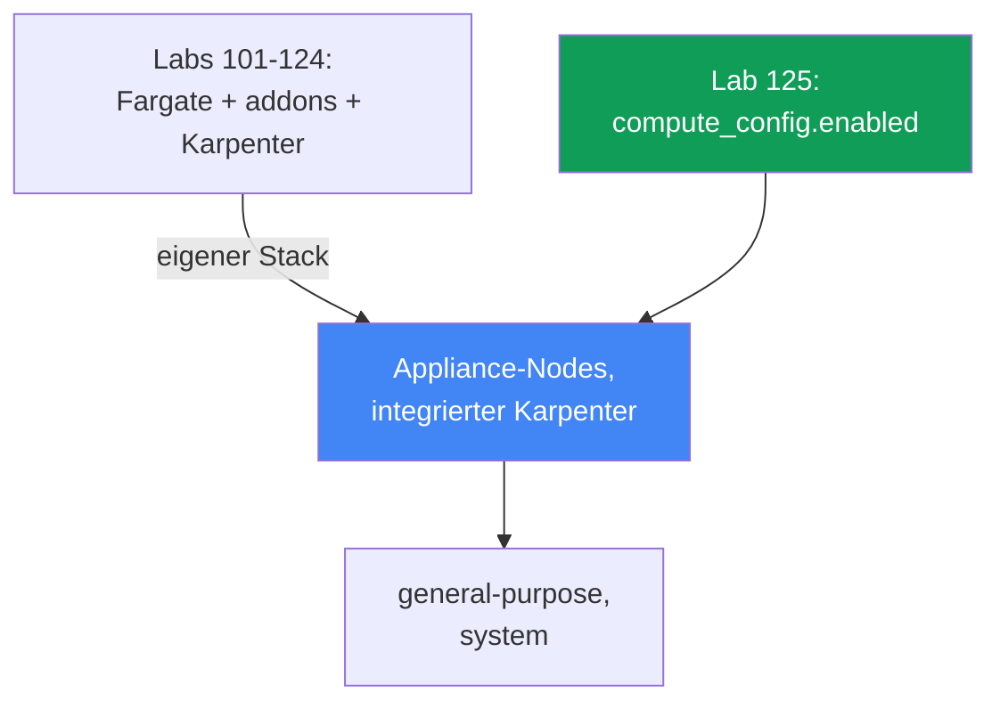
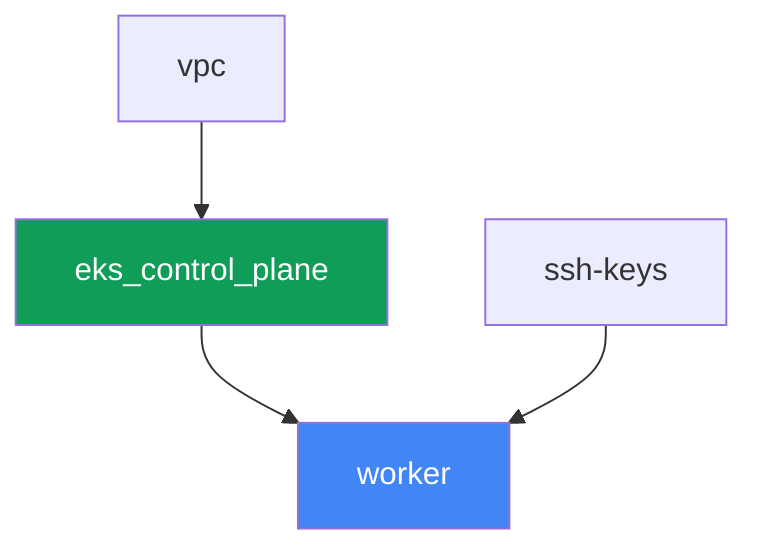

[Русская версия](README_RU.MD) · [Eng version](README.MD) · [Versión en español](README_ES.MD) · [Version française](README_FR.MD) · [ქართული ვერსია](README_GE.MD) · [繁體中文版](README_TW.MD) · [日本語版](README_JP.MD)

# Lab 125 - EKS Auto Mode gegen den eigenen Stack

## Beschreibung

In den Labs 101-124 wurde der Cluster aus einzelnen Teilen zusammengesetzt: Control Plane,
Fargate für System-Pods, ein separat installierter Karpenter und dessen NodePool. In diesem
Lab ist der Cluster grundlegend anders aufgebaut - EKS Auto Mode ist aktiviert, und AWS
verwaltet die Nodes selbst wie ein Appliance: es wählt die AMI, aktiviert SELinux im
Enforcing-Modus und ein Read-Only-Root, sperrt SSH und SSM, kümmert sich über einen
integrierten Karpenter um das Skalieren und stellt ein integriertes Pod-Netzwerk, DNS, EBS
CSI und ELB-Integration bereit. Die managed Addons `vpc-cni`, `kube-proxy`, `coredns` und
`aws-ebs-csi-driver` werden in diesem Lab überhaupt nicht installiert - sie sind
überflüssig, weil Auto Mode dasselbe selbst erledigt. Sie aktivieren nur den integrierten
NodePool `general-purpose`, bestätigen, dass der zweite integrierte NodePool `system` keine
Nodes ausrollt, solange er deaktiviert ist, versuchen den integrierten NodePool zu
bearbeiten und sehen, dass die Änderung trotzdem angenommen wird, und erstellen dann Ihren
eigenen NodePool mit expliziten `limits` - weil die integrierten Pools keine haben.

Die Aufgaben sind im Produktionsstil geschrieben: eine kurze Aufgabenstellung plus
Abnahmekriterien. Die Prüfung erfolgt automatisch über den Befehl `check_result`.

## Ziel

Den Stoff dieses Kurskapitels vertiefen:

- [Kapitel 9. Compute-Typen: managed node groups, self-managed, Fargate, Auto
  Mode](../../course/09/de.md) - wann EKS Auto Mode aktiviert wird und wann man den
  eigenen Stack aufbaut

## Was wir erstellen

Der Cluster wird als Code bereitgestellt, aber ohne Fargate-Profil und ohne externen
Karpenter - die Control Plane wird direkt mit `compute_config.enabled = true` und nur
einem aktivierten integrierten NodePool erstellt.

| Objekt | Was es ist | Warum in diesem Lab |
|--------|---------|-------------------|
| `compute_config.enabled = true` | Auto-Mode-Flag auf der Control Plane | aktiviert Appliance-Nodes, den integrierten Karpenter, Netzwerk, DNS, EBS CSI, ELB |
| NodePool `general-purpose` (integriert) | der einzige aktivierte integrierte NodePool | das Ziel für die Workload; C/M/R, nur on-demand, generation 5+ |
| NodePool `system` (integriert, deaktiviert) | der zweite integrierte NodePool | bleibt deaktiviert - ohne ihn erhalten `CriticalAddonsOnly`-Pods keinen Node |
| Namespace `eks-125` | ein Cluster-Bereich für die Lab-Workload | hält Ressourcen getrennt von den Systemressourcen |
| Deployment `web` (2 Replicas) | die ping_pong-Anwendung auf `general-purpose` | bestätigt, dass Auto Mode tatsächlich Nodes hochfährt und plant |
| Artefakt `nossh.txt` | ein SSH/SSM-Versuch auf einem Auto-Mode-Node | dokumentiert die belegte Einschränkung - es gibt keinen Zugriff |
| Eigener NodePool `custom-limited` | ein NodePool mit expliziten `limits` | integrierte Pools haben keine `limits`, der eigene setzt sie selbst |

Der Unterschied zwischen der Basis der Labs 101-124 und diesem Lab:



## Infrastruktur

Die Umgebung wird in AWS (`eu-central-1`) über Terragrunt bereitgestellt. Anders als bei
der Basis von Lab 101 gibt es hier vor der Worker-Maschine nur drei
Infrastrukturkomponenten: `vpc`, `ssh-keys` und `eks_control_plane`. Die Komponenten
`eks_fargate_system`, `eks_addons`, `eks_karpenter`, `eks_karpenter_default_vng` gibt es in
diesem Lab überhaupt nicht - Auto Mode ersetzt das alles durch die eigene Funktionalität
des Dienstes.

### Module und Abhängigkeiten

| Verzeichnis (Komponente) | Modul (`terraform/modules/`) | Abhängig von | Was es erstellt |
|---------------------|-------------------------------|------------|-------------|
| `vpc` | `vpc_v3` | - | VPC `10.10.0.0/16`, Subnetze in zwei AZs, NAT |
| `ssh-keys` | `ssh-keys` | - | ein SSH-Schlüsselpaar für die Worker-Maschine (Auto-Mode-Nodes brauchen keinen Schlüssel) |
| `eks_control_plane` | `eks_v2_control_plane` | `vpc` | EKS Control Plane `1.36` mit `compute_config.enabled = true`, `node_pools = ["general-purpose"]` |
| `worker` | `eks_v2_work_pc` | `ssh-keys`, `vpc`, `eks_control_plane` | Worker-Maschine mit kubectl, Tests und `check_result` |

Abhängigkeitsgraph (was zuerst angewendet wird, steht weiter unten in Pfeilrichtung):



### Was sich im Modul `eks_v2_control_plane` geändert hat

Das Modul `terraform/modules/eks_v2_control_plane` hat einen neuen **optionalen**
Parameter `compute_config` innerhalb des Objekts `eks` erhalten (standardmäßig `null`). Die
Änderung ist additiv: alle anderen Labs des Kurses, die dieses Modul nutzen, übergeben das
Objekt `eks` ohne dieses Feld und funktionieren unverändert weiter - `compute_config = null`
bedeutet, dass das Upstream-Modul `terraform-aws-modules/eks/aws` überhaupt keinen
`compute_config`-Block erstellt, genau wie vor diesem Lab. In diesem Lab übergibt
`eks_control_plane/terragrunt.hcl`
`compute_config = { enabled = true, node_pools = ["general-purpose"] }` - das ist der
einzige Unterschied bei den Eingaben gegenüber Lab 101.

Das Modul der Worker-Maschine `terraform/modules/eks_v2_work_pc` hat drei zusätzliche
Berechtigungen erhalten, alle für die Aufgaben dieses Labs benötigt:
`ssm:GetConnectionStatus` und `ssm:DescribeInstanceInformation` (Aufgabe 4 belegt, dass der
Node nicht mit SSM verbunden ist) sowie `iam:PassRole` auf Rollen `*-eks-auto-*` mit der
Bedingung `iam:PassedToService: eks.amazonaws.com` - ohne sie antwortet
`aws eks update-cluster-config` für Auto Mode mit `AccessDeniedException`, und der Student
könnte weder den zweiten integrierten Pool aktivieren noch einen gelöschten
wiederherstellen. Die Änderung ist additiv und betrifft die anderen Labs des Kurses nicht.

Ein eigenes Terraform-Modul für Nodes oder NodePool gibt es in diesem Lab nicht: die
integrierten NodePools `general-purpose` und `system` sind Teil von EKS Auto Mode selbst,
keine Ressource, die Terraform erstellt. Sie werden nur über `computeConfig.nodePools` auf
der Control Plane verwaltet (siehe Aufgaben 1-2) oder über `kubectl` für den eigenen
NodePool (Aufgabe 5).

### Wo was konfiguriert wird

`env.hcl` (gemeinsame Umgebungsparameter):

| Parameter | Wert im Lab | Was er beeinflusst |
|----------|-----------------|---------------|
| `region` | `eu-central-1` | Region aller Ressourcen |
| `prefix` | `eks-task125` | Präfix für Ressourcennamen und Tags |
| `stack_name` | `eks125` | daraus wird `env_name` gebildet - der Clustername |
| `k8_version` | `1.36.0` | kubectl-Version auf der Worker-Maschine |

`inputs` in der `terragrunt.hcl` jeder Komponente:

| Datei | Wichtige Einstellungen |
|------|--------------------|
| `eks_control_plane/terragrunt.hcl` | `eks.compute_config.enabled = true`, `node_pools = ["general-purpose"]` |
| `worker/terragrunt.hcl` | `test_url`, `task_script_url` für die Dateien von Lab 125; ohne Abhängigkeit von einer Karpenter-Komponente |

## Bereitstellung

```bash
TASK=125 make run_eks_task
```

Die Bereitstellung dauert etwa 15-20 Minuten. Suchen Sie in der Ausgabe die Zeile mit der
SSH-Verbindung zur Worker-Maschine und verbinden Sie sich damit. kubectl ist dort bereits
für den richtigen Cluster konfiguriert.

Nützliche Befehle auf der Worker-Maschine:

```bash
time_left       # wie viel Zeit der Umgebung noch bleibt
check_result    # die Lösung prüfen
```

> Sicherheit der Testumgebung. In `env.hcl` sind `ssh_password_enable = true` und
> `access_cidrs = ["0.0.0.0/0"]` aktiviert - praktisch für eine Schulungsumgebung, aber
> nichts, was man in Produktion tun sollte. Nach den Standards des Kurses (Kapitel 0.2, 2,
> 19) erfolgt der Zugriff auf Worker-Maschinen über AWS SSM Session Manager ohne
> öffentliche SSH-Ports, und `access_cidrs` wird auf konkrete Adressen eingeschränkt. Hier
> bleibt öffentliches SSH nur, um den Start der Worker-Maschine zu vereinfachen - das
> betrifft die Auto-Mode-Nodes selbst nicht, zu denen es überhaupt keinen Zugriff gibt
> (Aufgabe 4).

## Aufgaben

---
|        **1**        | **Bestätigung des Modus: Auto Mode ist aktiviert**                  |
| :-----------------: | :------------------------------------------------------------ |
| Was zu tun ist          | Ermitteln Sie den Clusternamen aus der kubeconfig (`kubectl config current-context \| awk -F/ '{print $NF}'`) - das ist zuverlässiger als `list-clusters[0]`, das in einem Konto mit mehreren Clustern auf einen fremden verweisen würde. Führen Sie `aws eks describe-cluster --name <cluster> --query 'cluster.computeConfig'` aus und bestätigen Sie, dass `enabled: true` ist und `nodePools` `general-purpose` enthält. Führen Sie `kubectl get nodepools` aus und bestätigen Sie, dass `general-purpose` in der Liste steht. Speichern Sie beide Ausgaben in `/var/work/tests/artifacts/1/automode.txt`. |
| Abnahmekriterien    | - die Datei `1/automode.txt` ist nicht leer, enthält `"enabled": true` und `general-purpose`. |
---
|        **2**        | **Der zweite integrierte NodePool ist deaktiviert**                       |
| :-----------------: | :------------------------------------------------------------ |
| Was zu tun ist          | Prüfen Sie, dass `system` nicht zu den aktiven NodePools gehört: `kubectl get nodepools` darf `system` nicht anzeigen (ein integrierter NodePool erscheint als Kubernetes-Ressource erst, wenn er in `computeConfig.nodePools` aktiviert ist). Erklären Sie in `/var/work/tests/artifacts/2/twopools.txt`, warum der NodePool `system` in der Produktion wichtig ist - er trägt den Taint `CriticalAddonsOnly`, den Systemkomponenten wie CoreDNS tolerieren, und er erlaubt es, für den Cluster kritische Pods von normaler Workload zu trennen. Der Text muss die Wörter `system` und `CriticalAddonsOnly` enthalten. |
| Abnahmekriterien    | - `kubectl get nodepools` enthält kein `system`;<br/>- die Datei `2/twopools.txt` ist nicht leer und enthält `system` und `CriticalAddonsOnly`. |
---
|        **3**        | **Workload auf general-purpose und wem der integrierte NodePool gehört** |
| :-----------------: | :------------------------------------------------------------ |
| Was zu tun ist          | Erstellen Sie den Namespace `eks-125` und das Deployment `web` (Image `viktoruj/ping_pong:latest`, `2` Replicas). Warten Sie, bis Auto Mode dafür einen Node hochfährt und beide Pods `Running` erreichen. Versuchen Sie dann, den integrierten NodePool zu bearbeiten: `kubectl patch nodepool general-purpose --type merge -p '{"spec":{"limits":{"cpu":"100"}}}'`. Die Änderung WIRD durchgehen - es gibt kein Verbot auf Admission-Ebene. Finden Sie heraus, wem das Objekt gehört: prüfen Sie das Label `app.kubernetes.io/managed-by` und die Liste `metadata.managedFields[*].manager`. Legen Sie in `/var/work/tests/artifacts/3/builtin.txt` die Patch-Ausgabe, beide Eigentümerprüfungen und einen Hinweis ab, warum eine solche Änderung keine unterstützte Konfigurationsmethode ist. Setzen Sie den Pool danach in den ursprünglichen Zustand zurück: `kubectl patch nodepool general-purpose --type merge -p '{"spec":{"limits":null}}'`. |
| Abnahmekriterien    | - Deployment `web` in `eks-125`, `2` bereite Replicas, kein Pod auf Fargate;<br/>- die Datei `3/builtin.txt` ist nicht leer, enthält `patched` und den Eigentümer des Objekts (`managed-by` oder `eks-auto-mode`). |
---
|        **4**        | **Kein Operator-Zugriff auf den Node, aber der Host ist nicht verborgen**         |
| :-----------------: | :------------------------------------------------------------ |
| Was zu tun ist          | Ermitteln Sie den Node, auf dem der Pod `web` läuft (`kubectl get pods -n eks-125 -o wide`) - im Auto Mode ist der Node-Name die Instance-ID selbst. Sammeln Sie drei Fakten und legen Sie sie in `/var/work/tests/artifacts/4/nossh.txt` ab: (1) die Instanz hat kein Schlüsselpaar - `aws ec2 describe-instances --instance-ids <node> --query 'Reservations[0].Instances[0].KeyName'` liefert `null`, das heißt SSH per Schlüssel ist prinzipiell unmöglich; (2) SSM ist nicht verbunden - `aws ssm get-connection-status --target <node>` liefert `notconnected`, und `aws ssm describe-instance-information` zeigt diesen Node nicht; (3) gleichzeitig ist der Host NICHT vom Cluster isoliert: starten Sie in `eks-125` einen Pod mit `securityContext.privileged: true` und einem `hostPath` auf `/`, gemountet unter `/host`, und lesen Sie `/host/etc/os-release` - Sie sehen `NAME=Bottlerocket`. Fügen Sie eine Schlussfolgerung hinzu: Auto Mode schließt die Tür des Operators (SSH, SSM), aber nicht die Tür des Cluster-Admins - dafür sind Pod Security Admission und Policies zuständig (Kapitel 19 und 22). Entfernen Sie den Pod nach der Prüfung. |
| Abnahmekriterien    | - die Datei `4/nossh.txt` ist nicht leer und enthält alle drei Belege: `KeyName`, `notconnected` und `Bottlerocket`. |
---
|        **5**        | **Eigener NodePool mit expliziten limits**                              |
| :-----------------: | :------------------------------------------------------------ |
| Was zu tun ist          | Integrierte NodePools haben keine `limits` - bei unbegrenztem Wachstum der Workload ist das ein Risiko für unkontrollierte Kosten. Erstellen Sie Ihren eigenen NodePool `custom-limited`, der über `nodeClassRef` auf die integrierte `NodeClass` `default` verweist (`group: eks.amazonaws.com`, `kind: NodeClass`, `name: default`), mit `requirements` auf die Instanzkategorien `c`, `m`, `r` und einem expliziten `limits`-Block (`cpu: "10"`, `memory: 10Gi`). Wenden Sie das Manifest an und warten Sie, bis `kubectl get nodepool custom-limited` den Status `Ready` zeigt. |
| Abnahmekriterien    | - der NodePool `custom-limited` existiert, `spec.limits.cpu` ist gleich `"10"`;<br/>- `spec.template.spec.nodeClassRef.name` ist gleich `default`. |
---

### Wo genau die Grenze von Auto Mode liegt

Die beiden obigen Aufgaben sind bewusst so gestaltet, dass Sie Fakten sehen, keine
Slogans. Beide Punkte werden selbst in Nacherzählungen der Dokumentation ungenau
formuliert, also prüfen Sie es selbst mit eigenen Händen.

**„Integrierte Pools kann man nicht bearbeiten" ist ein Vertrag, kein Verbot auf
Admission-Ebene.** Die AWS-Dokumentation sagt über integrierte NodePools „can be enabled or
disabled but not modified", und es liegt nahe anzunehmen, die API würde die Änderung
ablehnen. Sie nimmt sie an: `kubectl patch` liefert
`nodepool.karpenter.sh/general-purpose patched`, und der Wert bleibt im Objekt. Die
eigentliche Grenze liegt anderswo: das Objekt gehört dem Dienst, es trägt das Label
`app.kubernetes.io/managed-by: eks` und seine Felder gehören dem Manager `eks-auto-mode`.
Sobald sich der Poolname in `computeConfig.nodePools` ändert, wird die Ressource zusammen
mit ihren Nodes gelöscht, und wenn der Name zurückkehrt, wird sie von Grund auf neu
erstellt - ohne Ihre Änderungen. Auf der Testumgebung überprüft: nach Deaktivieren und
erneutem Aktivieren des Pools war `spec.limits` wieder leer, obwohl vorher `cpu: 100`
gesetzt war.

> **Löschen Sie einen integrierten NodePool nicht über kubectl.** `kubectl delete nodepool
> general-purpose` geht durch, die Nodes des Pools werden gedraint und terminiert, aber EKS
> selbst erstellt das Objekt NICHT neu - überprüft, nach fünf Minuten war der Pool nicht
> zurückgekehrt, und der Cluster blieb ohne Compute. Die Wiederherstellung erfolgt nur über
> die Änderung von `computeConfig`: den Poolnamen entfernen und wieder hinzufügen (der
> Aufruf muss `--compute-config`, `--storage-config` und `--kubernetes-network-config`
> zusammen übergeben, sonst antwortet EKS mit `The type for cluster update was not
> provided`, und eine leere `nodePools`-Liste zusammen mit `nodeRoleArn` akzeptiert es
> nicht).

**„Kein Zugriff auf den Node" gilt nur für den Operator-Zugriff.** SSH ist unmöglich: die
Instanz hat kein Schlüsselpaar (`KeyName` ist leer), das Image ist Bottlerocket, ohne Shell
und ohne Paketmanager. SSM ist nicht verbunden: `get-connection-status` antwortet mit
`notconnected`, der Node ist nicht im Inventar von `describe-instance-information`. Aber
ein privilegierter Pod mit einem `hostPath` auf `/` liest ganz ruhig das Dateisystem des
Hosts und zeigt `NAME=Bottlerocket` und den Inhalt von `/bin` (dort findet sich
`apiclient`, `aws-network-policy-agent`). Die Schlussfolgerung für die Produktion: Auto
Mode nimmt Ihnen die Node-Wartung ab und entfernt den interaktiven Zugriff, ersetzt aber
nicht die Kontrolle darüber, wer im Cluster einen privilegierten Pod starten kann - das
bleibt weiterhin Ihre Aufgabe (Kapitel 19 und 22).

Noch ein praktisches Detail: `aws ssm start-session` wird in diesem Lab bewusst nicht als
Beleg verwendet. Die Worker-Maschine hat keine Berechtigung `ssm:StartSession`, daher
liefert der Befehl `AccessDeniedException` - das sagt etwas über die Policy des Workers
aus, nicht über den Node. Die Leserechte (`ssm:GetConnectionStatus`,
`ssm:DescribeInstanceInformation`) wurden dem Modul der Worker-Maschine hinzugefügt, weil
genau sie die Frage der Aufgabe beantworten.

## Ergebnisprüfung

Führen Sie auf der Worker-Maschine die automatische Prüfung aus:

```bash
check_result
```

Das Skript führt die Tests aus und zeigt den Prozentsatz der erledigten Aufgaben an.

## Lösung

Referenzlösung: [worker/files/solutions/1_DE.MD](worker/files/solutions/1_DE.MD)

## Löschen des Clusters und der Ressourcen

> **Entfernen Sie zuerst die Workload und warten Sie, bis die Nodes verschwinden, erst
> danach die Testumgebung abbauen.** Auto-Mode-Nodes sind gewöhnliche EC2-Instanzen mit
> sekundären ENIs aus dem Pod-Netzwerk. Wenn Sie den Cluster löschen, während noch eine
> Workload läuft, kann die ENI im Zustand `available` verbleiben und die Security Group
> festhalten, und `destroy` bleibt beim Löschen dieser SG für Dutzende Minuten hängen.
> Dieses Lab erstellt keine AWS-Ressourcen händisch, alles andere sind
> Kubernetes-Objekte.

```bash
# 1. Workload und den Prüf-Pod entfernen, falls er noch lebt
kubectl delete namespace eks-125 --ignore-not-found

# 2. Eigenen NodePool aus Aufgabe 5 entfernen (den integrierten general-purpose NICHT anfassen)
kubectl delete nodepool custom-limited --ignore-not-found

# 3. Warten, bis Auto Mode die Nodes entfernt: die Liste muss leer werden
while kubectl get nodes --no-headers 2>/dev/null | grep -q .; do
  echo "Nodes sind noch da, wir warten..."; sleep 15
done
```

Erst danach die Testumgebung abbauen:

```bash
TASK=125 make delete_eks_task
```

Wenn `destroy` bei der Security Group hängen bleibt, suchen Sie die verwaiste ENI und
löschen Sie sie:

```bash
aws ec2 describe-network-interfaces --filters Name=status,Values=available \
  --query 'NetworkInterfaces[].[NetworkInterfaceId,Description]' --output table
aws ec2 delete-network-interface --network-interface-id <eni-id>
```

Ein Sonderfall - wenn während der Experimente der integrierte NodePool über
`kubectl delete nodepool general-purpose` gelöscht wurde. EKS selbst wird ihn nicht
zurückbringen, der Cluster bleibt ohne Compute. Die Wiederherstellung erfolgt über
`computeConfig`, mit zwei Aufrufen: zuerst wird die Poolliste geändert (zum Beispiel
`system` hinzugefügt), dann wird nur `general-purpose` zurückgesetzt. Der Rollenname kommt
aus `describe-cluster`:

```bash
CLUSTER=$(kubectl config current-context | awk -F/ '{print $NF}')
ROLE=$(aws eks describe-cluster --name "$CLUSTER" \
  --query 'cluster.computeConfig.nodeRoleArn' --output text)

aws eks update-cluster-config --name "$CLUSTER" \
  --compute-config "{\"enabled\":true,\"nodePools\":[\"system\",\"general-purpose\"],\"nodeRoleArn\":\"$ROLE\"}" \
  --storage-config '{"blockStorage":{"enabled":true}}' \
  --kubernetes-network-config '{"elasticLoadBalancing":{"enabled":true}}'
# warten, bis cluster.status = ACTIVE, dann nur general-purpose zurücksetzen
```
