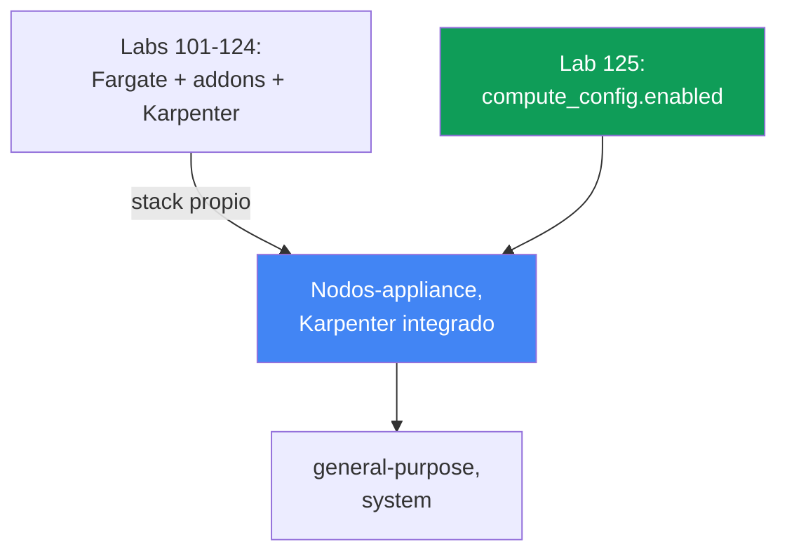
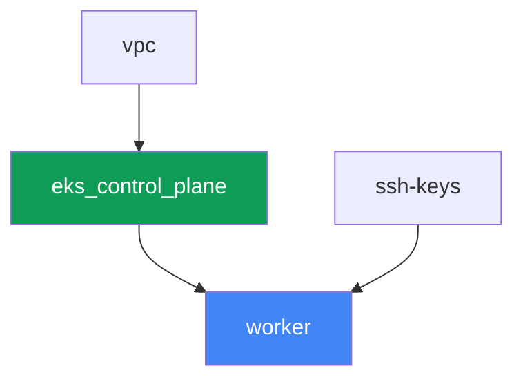

[Русская версия](README_RU.MD) · [Eng version](README.MD) · [Version française](README_FR.MD) · [Deutsche Version](README_DE.MD) · [ქართული ვერსია](README_GE.MD) · [繁體中文版](README_TW.MD) · [日本語版](README_JP.MD)

# Lab 125 - EKS Auto Mode frente a tu propio stack

## Descripción

En los labs 101-124 el clúster se ensamblaba a partir de piezas separadas: control plane,
Fargate para los pods de sistema, un Karpenter instalado por separado y su NodePool. En
este lab el clúster está construido de forma fundamentalmente distinta - se activa EKS Auto
Mode, y AWS gestiona los nodos como un appliance: elige la AMI, activa SELinux en modo
enforcing y una raíz de solo lectura, cierra el acceso por SSH y SSM, gestiona el escalado
mediante un Karpenter integrado, y mantiene una red de pods, DNS, EBS CSI e integración con
ELB integrados. Los addons administrados `vpc-cni`, `kube-proxy`, `coredns` y
`aws-ebs-csi-driver` no se instalan en absoluto en este lab - son redundantes, porque Auto
Mode hace lo mismo por sí solo. Activarás solo el NodePool integrado `general-purpose`,
confirmarás que el segundo NodePool integrado `system` no despliega nodos mientras está
desactivado, intentarás editar el NodePool integrado y verás que la edición se acepta de
todos modos, y luego crearás tu propio NodePool con `limits` explícitos - porque los pools
integrados no los tienen.

Las tareas están escritas en estilo de producción: un enunciado corto más criterios de
aceptación. La verificación es automática, mediante el comando `check_result`.

## Objetivo

Reforzar el material de este capítulo del curso:

- [Capítulo 9. Tipos de cómputo: managed node groups, self-managed, Fargate, Auto
  Mode](../../course/09/es.md) - cuándo activar EKS Auto Mode y cuándo construir tu
  propio stack

## Qué vamos a crear

El clúster se despliega como código, pero sin perfil de Fargate y sin un Karpenter
externo - el control plane se crea directamente con `compute_config.enabled = true` y con
un único NodePool integrado activado.

| Objeto | Qué es | Por qué está en este lab |
|--------|---------|-------------------|
| `compute_config.enabled = true` | flag de Auto Mode en el control plane | activa nodos-appliance, el Karpenter integrado, redes, DNS, EBS CSI, ELB |
| NodePool `general-purpose` (integrado) | el único NodePool integrado activado | el objetivo para la carga de trabajo; C/M/R, solo on-demand, generation 5+ |
| NodePool `system` (integrado, desactivado) | el segundo NodePool integrado | permanece desactivado - sin él los pods `CriticalAddonsOnly` no obtienen nodo |
| Namespace `eks-125` | una sección del clúster para la carga del lab | mantiene los recursos separados de los del sistema |
| Deployment `web` (2 réplicas) | la aplicación ping_pong sobre `general-purpose` | confirma que Auto Mode realmente levanta y planifica nodos |
| Artefacto `nossh.txt` | un intento de SSH/SSM sobre un nodo de Auto Mode | registra la restricción documentada - no hay acceso |
| NodePool propio `custom-limited` | un NodePool con `limits` explícitos | los pools integrados no tienen `limits`, el propio los define |

La diferencia entre la base de los labs 101-124 y este lab:



## Infraestructura

El entorno se despliega en AWS (`eu-central-1`) mediante Terragrunt. A diferencia de la
base del lab 101, aquí solo hay tres componentes de infraestructura antes de la máquina de
trabajo: `vpc`, `ssh-keys` y `eks_control_plane`. Los componentes `eks_fargate_system`,
`eks_addons`, `eks_karpenter`, `eks_karpenter_default_vng` no existen en absoluto en este
lab - Auto Mode reemplaza todo eso con la funcionalidad propia del servicio.

### Módulos y dependencias

| Directorio (componente) | Módulo (`terraform/modules/`) | Depende de | Qué crea |
|---------------------|-------------------------------|------------|-------------|
| `vpc` | `vpc_v3` | - | VPC `10.10.0.0/16`, subredes en dos AZ, NAT |
| `ssh-keys` | `ssh-keys` | - | un par de claves SSH para la máquina de trabajo (los nodos de Auto Mode no necesitan clave) |
| `eks_control_plane` | `eks_v2_control_plane` | `vpc` | control plane EKS `1.36` con `compute_config.enabled = true`, `node_pools = ["general-purpose"]` |
| `worker` | `eks_v2_work_pc` | `ssh-keys`, `vpc`, `eks_control_plane` | máquina de trabajo con kubectl, tests y `check_result` |

Grafo de dependencias (lo que se aplica antes está más abajo en la flecha):



### Qué cambió en el módulo `eks_v2_control_plane`

El módulo `terraform/modules/eks_v2_control_plane` recibió un nuevo parámetro
**opcional** `compute_config` dentro del objeto `eks` (`null` por defecto). El cambio es
aditivo: todos los demás labs del curso que usan este módulo pasan el objeto `eks` sin este
campo y siguen funcionando sin cambios - `compute_config = null` significa que el módulo
upstream `terraform-aws-modules/eks/aws` no crea el bloque `compute_config` en absoluto,
exactamente como antes de este lab. En este lab `eks_control_plane/terragrunt.hcl` pasa
`compute_config = { enabled = true, node_pools = ["general-purpose"] }` - esta es la única
diferencia de entradas respecto al lab 101.

El módulo de la máquina de trabajo `terraform/modules/eks_v2_work_pc` recibió tres permisos
adicionales, todos necesarios para las tareas de este lab: `ssm:GetConnectionStatus` y
`ssm:DescribeInstanceInformation` (la tarea 4 demuestra que el nodo no está conectado a
SSM) e `iam:PassRole` sobre roles `*-eks-auto-*` con la condición
`iam:PassedToService: eks.amazonaws.com` - sin él `aws eks update-cluster-config` para Auto
Mode responde `AccessDeniedException`, y el estudiante no podría activar el segundo pool
integrado ni restaurar uno eliminado. El cambio es aditivo y no afecta a los demás labs del
curso.

No hay un módulo terraform separado para nodos o NodePool en este lab: los NodePool
integrados `general-purpose` y `system` son parte del propio EKS Auto Mode, no un recurso
que crea terraform. Se gestionan solo mediante `computeConfig.nodePools` en el control
plane (ver tareas 1-2) o mediante `kubectl` para tu propio NodePool (tarea 5).

### Dónde se configura cada cosa

`env.hcl` (parámetros compartidos del entorno):

| Parámetro | Valor en el lab | Qué afecta |
|----------|-----------------|---------------|
| `region` | `eu-central-1` | región de todos los recursos |
| `prefix` | `eks-task125` | prefijo de nombres de recursos y tags |
| `stack_name` | `eks125` | se usa para construir `env_name` - el nombre del clúster |
| `k8_version` | `1.36.0` | versión de kubectl en la máquina de trabajo |

`inputs` en el `terragrunt.hcl` de cada componente:

| Archivo | Ajustes clave |
|------|--------------------|
| `eks_control_plane/terragrunt.hcl` | `eks.compute_config.enabled = true`, `node_pools = ["general-purpose"]` |
| `worker/terragrunt.hcl` | `test_url`, `task_script_url` para los archivos del lab 125; sin dependencia de un componente Karpenter |

## Despliegue

```bash
TASK=125 make run_eks_task
```

El despliegue tarda aproximadamente 15-20 minutos. En la salida, busca la línea con la
conexión SSH a la máquina de trabajo y conéctate a ella. kubectl ya está configurado ahí
para el clúster correcto.

Comandos útiles en la máquina de trabajo:

```bash
time_left       # cuánto tiempo queda del entorno
check_result    # verificar la solución
```

> Seguridad del banco de pruebas. En `env.hcl` están activados `ssh_password_enable = true`
> y `access_cidrs = ["0.0.0.0/0"]` - cómodo para un entorno de formación, pero no algo que
> hacer en producción. Según los estándares del curso (capítulos 0.2, 2, 19), el acceso a
> las máquinas de trabajo se realiza mediante AWS SSM Session Manager sin exponer puertos
> SSH públicos, y `access_cidrs` se restringe a direcciones concretas. Aquí el SSH público
> se deja solo para simplificar el arranque de la máquina de trabajo - esto no afecta a los
> propios nodos de Auto Mode, a los que no hay acceso en absoluto (tarea 4).

## Tareas

---
|        **1**        | **Confirmación del modo: Auto Mode está activado**                  |
| :-----------------: | :------------------------------------------------------------ |
| Qué hacer          | Determina el nombre del clúster desde el kubeconfig (`kubectl config current-context \| awk -F/ '{print $NF}'`) - esto es más fiable que `list-clusters[0]`, que en una cuenta con varios clústeres apuntaría a uno ajeno. Ejecuta `aws eks describe-cluster --name <cluster> --query 'cluster.computeConfig'` y confirma que `enabled: true` y que `nodePools` contiene `general-purpose`. Ejecuta `kubectl get nodepools` y confirma que `general-purpose` está en la lista. Guarda ambas salidas en `/var/work/tests/artifacts/1/automode.txt`. |
| Criterios de aceptación    | - el archivo `1/automode.txt` no está vacío, contiene `"enabled": true` y `general-purpose`. |
---
|        **2**        | **El segundo NodePool integrado está desactivado**                       |
| :-----------------: | :------------------------------------------------------------ |
| Qué hacer          | Comprueba que `system` no está entre los NodePool activos: `kubectl get nodepools` no debe mostrar `system` (un NodePool integrado aparece como recurso de Kubernetes solo cuando está activado en `computeConfig.nodePools`). Explica en `/var/work/tests/artifacts/2/twopools.txt` por qué importa el NodePool `system` en producción - lleva el taint `CriticalAddonsOnly`, tolerado por componentes de sistema como CoreDNS, y permite mantener separados de la carga normal los pods críticos para el clúster. El texto debe contener las palabras `system` y `CriticalAddonsOnly`. |
| Criterios de aceptación    | - `kubectl get nodepools` no contiene `system`;<br/>- el archivo `2/twopools.txt` no está vacío y contiene `system` y `CriticalAddonsOnly`. |
---
|        **3**        | **Carga de trabajo en general-purpose y quién es dueño del NodePool integrado** |
| :-----------------: | :------------------------------------------------------------ |
| Qué hacer          | Crea el namespace `eks-125` y el Deployment `web` (imagen `viktoruj/ping_pong:latest`, `2` réplicas). Espera hasta que Auto Mode levante un nodo para ellos y ambos pods lleguen a `Running`. Luego intenta editar el NodePool integrado: `kubectl patch nodepool general-purpose --type merge -p '{"spec":{"limits":{"cpu":"100"}}}'`. La edición SÍ se aplicará - no hay una prohibición a nivel de admission. Averigua quién es dueño del objeto: revisa la etiqueta `app.kubernetes.io/managed-by` y la lista `metadata.managedFields[*].manager`. Pon en `/var/work/tests/artifacts/3/builtin.txt` la salida del patch, ambas comprobaciones de propietario, y una nota sobre por qué esa edición no es una forma soportada de configurarlo. Después devuelve el pool a su estado original: `kubectl patch nodepool general-purpose --type merge -p '{"spec":{"limits":null}}'`. |
| Criterios de aceptación    | - Deployment `web` en `eks-125`, `2` réplicas listas, ningún pod en Fargate;<br/>- el archivo `3/builtin.txt` no está vacío, contiene `patched` y el propietario del objeto (`managed-by` o `eks-auto-mode`). |
---
|        **4**        | **No hay acceso de operador al nodo, pero el host no está oculto**         |
| :-----------------: | :------------------------------------------------------------ |
| Qué hacer          | Determina el nodo en el que corre el pod `web` (`kubectl get pods -n eks-125 -o wide`) - en Auto Mode el nombre del nodo es el propio instance ID. Reúne tres hechos y ponlos en `/var/work/tests/artifacts/4/nossh.txt`: (1) la instancia no tiene par de claves - `aws ec2 describe-instances --instance-ids <node> --query 'Reservations[0].Instances[0].KeyName'` devuelve `null`, es decir, el SSH por clave es imposible en principio; (2) SSM no está conectado - `aws ssm get-connection-status --target <node>` devuelve `notconnected`, y `aws ssm describe-instance-information` no muestra este nodo; (3) al mismo tiempo el host NO está aislado del clúster: ejecuta en `eks-125` un pod con `securityContext.privileged: true` y un `hostPath` sobre `/` montado en `/host`, y lee `/host/etc/os-release` - verás `NAME=Bottlerocket`. Añade una conclusión: Auto Mode cierra la puerta del operador (SSH, SSM), pero no la puerta de cluster-admin - de esa se encargan Pod Security Admission y las políticas (capítulos 19 y 22). Elimina el pod después de la comprobación. |
| Criterios de aceptación    | - el archivo `4/nossh.txt` no está vacío y contiene las tres pruebas: `KeyName`, `notconnected` y `Bottlerocket`. |
---
|        **5**        | **Tu propio NodePool con limits explícitos**                              |
| :-----------------: | :------------------------------------------------------------ |
| Qué hacer          | Los NodePool integrados no tienen `limits` - con un crecimiento ilimitado de la carga esto es un riesgo de costes descontrolados. Crea tu propio NodePool `custom-limited`, usando un `nodeClassRef` que apunte al `NodeClass` integrado `default` (`group: eks.amazonaws.com`, `kind: NodeClass`, `name: default`), con `requirements` sobre las categorías de instancia `c`, `m`, `r` y un bloque `limits` explícito (`cpu: "10"`, `memory: 10Gi`). Aplica el manifiesto y espera a que `kubectl get nodepool custom-limited` muestre el estado `Ready`. |
| Criterios de aceptación    | - el NodePool `custom-limited` existe, `spec.limits.cpu` es igual a `"10"`;<br/>- `spec.template.spec.nodeClassRef.name` es igual a `default`. |
---

### Dónde pasa exactamente la frontera de Auto Mode

Las dos tareas anteriores están hechas deliberadamente para que veas hechos, no eslóganes.
Ambos puntos se formulan de forma imprecisa incluso en resúmenes de la documentación, así
que compruébalo con tus propias manos.

**"Los pools integrados no se pueden editar" es un contrato, no una prohibición en el
admission.** La documentación de AWS dice sobre los NodePool integrados "can be enabled or
disabled but not modified", y es fácil suponer que la API rechazará la edición. La acepta:
`kubectl patch` devuelve `nodepool.karpenter.sh/general-purpose patched`, y el valor
permanece en el objeto. La verdadera frontera está en otro sitio: el objeto pertenece al
servicio, lleva la etiqueta `app.kubernetes.io/managed-by: eks` y sus campos son propiedad
de `eks-auto-mode`. En el momento en que el nombre del pool cambia en
`computeConfig.nodePools`, el recurso se elimina junto con sus nodos, y cuando el nombre
vuelve se crea desde cero, sin tus ediciones. Verificado en el banco de pruebas: tras
desactivar y reactivar el pool, `spec.limits` volvió vacío, aunque antes se había fijado
`cpu: 100`.

> **No elimines un NodePool integrado mediante kubectl.** `kubectl delete nodepool
> general-purpose` se ejecuta, los nodos del pool se drenan y terminan, pero EKS mismo NO
> vuelve a crear el objeto - verificado, tras cinco minutos el pool no regresó y el clúster
> quedó sin cómputo. La recuperación es solo mediante el cambio de `computeConfig`: quitar
> y volver a añadir el nombre del pool (la llamada debe pasar `--compute-config`,
> `--storage-config` y `--kubernetes-network-config` juntos, de lo contrario EKS responde
> `The type for cluster update was not provided`, y no acepta una lista `nodePools` vacía
> junto con `nodeRoleArn`).

**"No hay acceso al nodo" es cierto solo respecto al acceso de operador.** El SSH es
imposible: la instancia no tiene par de claves (`KeyName` está vacío), la imagen es
Bottlerocket, sin shell y sin gestor de paquetes. SSM no está conectado:
`get-connection-status` responde `notconnected`, el nodo no está en el inventario de
`describe-instance-information`. Pero un pod privilegiado con un `hostPath` sobre `/` lee
tranquilamente el sistema de archivos del host y muestra `NAME=Bottlerocket` y el contenido
de `/bin` (ahí encontrarás `apiclient`, `aws-network-policy-agent`). La conclusión para
producción: Auto Mode te quita de encima el mantenimiento del nodo y elimina el acceso
interactivo, pero no reemplaza el control sobre quién en el clúster puede ejecutar un pod
privilegiado - eso sigue siendo tu tarea (capítulos 19 y 22).

Un detalle práctico más: `aws ssm start-session` deliberadamente no se usa como prueba en
este lab. La máquina de trabajo no tiene el permiso `ssm:StartSession`, por lo que el
comando devuelve `AccessDeniedException` - lo cual habla de la política del worker, no del
nodo. Los permisos de lectura (`ssm:GetConnectionStatus`, `ssm:DescribeInstanceInformation`)
se añadieron al módulo de la máquina de trabajo precisamente porque son los que responden a
la pregunta de la tarea.

## Verificación del resultado

En la máquina de trabajo, ejecuta la verificación automática:

```bash
check_result
```

El script ejecutará las pruebas y mostrará el porcentaje de tareas completadas.

## Solución

Solución de referencia: [worker/files/solutions/1_ES.MD](worker/files/solutions/1_ES.MD)

## Eliminación del clúster y los recursos

> **Primero retira la carga de trabajo y espera a que se vayan los nodos, luego destruye
> el banco de pruebas.** Los nodos de Auto Mode son instancias EC2 normales con ENIs
> secundarias de la red de pods. Si eliminas el clúster con la carga aún en ejecución, el
> ENI puede quedarse en estado `available` y retener el security group, y `destroy` se
> quedará colgado eliminando ese SG durante decenas de minutos. Este lab no crea recursos
> de AWS a mano, todo lo demás son objetos de Kubernetes.

```bash
# 1. Retirar la carga y el pod de comprobación, si aún está vivo
kubectl delete namespace eks-125 --ignore-not-found

# 2. Quitar tu propio NodePool de la tarea 5 (NO tocar el general-purpose integrado)
kubectl delete nodepool custom-limited --ignore-not-found

# 3. Esperar hasta que Auto Mode retire los nodos: la lista debe quedar vacía
while kubectl get nodes --no-headers 2>/dev/null | grep -q .; do
  echo "todavía hay nodos, esperando..."; sleep 15
done
```

Solo después de esto destruye el banco de pruebas:

```bash
TASK=125 make delete_eks_task
```

Si `destroy` se queda atascado en el security group, busca el ENI huérfano y elimínalo:

```bash
aws ec2 describe-network-interfaces --filters Name=status,Values=available \
  --query 'NetworkInterfaces[].[NetworkInterfaceId,Description]' --output table
aws ec2 delete-network-interface --network-interface-id <eni-id>
```

Un caso aparte - si durante los experimentos el NodePool integrado se eliminó mediante
`kubectl delete nodepool general-purpose`. El propio EKS no lo devolverá, y el clúster
quedará sin cómputo. La recuperación es mediante `computeConfig`, con dos llamadas: primero
se cambia la lista de pools (por ejemplo añadiendo `system`), luego se devuelve solo
`general-purpose`. El nombre del rol se obtiene de `describe-cluster`:

```bash
CLUSTER=$(kubectl config current-context | awk -F/ '{print $NF}')
ROLE=$(aws eks describe-cluster --name "$CLUSTER" \
  --query 'cluster.computeConfig.nodeRoleArn' --output text)

aws eks update-cluster-config --name "$CLUSTER" \
  --compute-config "{\"enabled\":true,\"nodePools\":[\"system\",\"general-purpose\"],\"nodeRoleArn\":\"$ROLE\"}" \
  --storage-config '{"blockStorage":{"enabled":true}}' \
  --kubernetes-network-config '{"elasticLoadBalancing":{"enabled":true}}'
# esperar a que cluster.status = ACTIVE, luego devolver solo general-purpose
```
