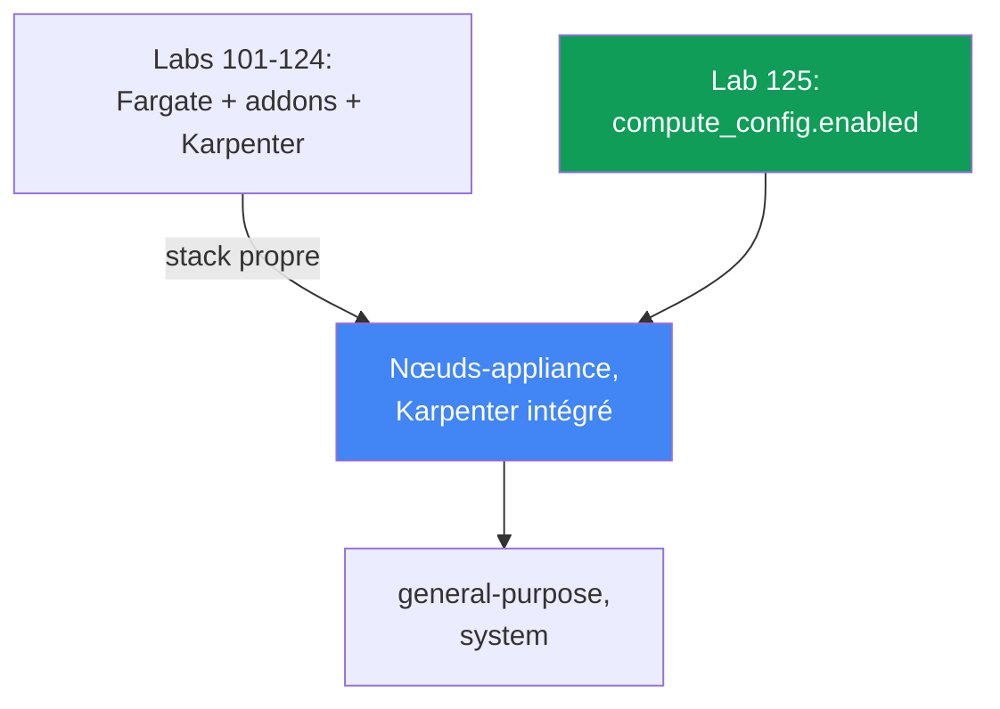
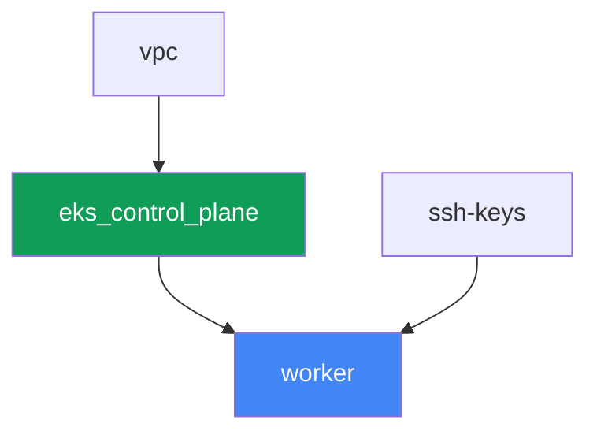

[Русская версия](README_RU.MD) · [Eng version](README.MD) · [Versión en español](README_ES.MD) · [Deutsche Version](README_DE.MD) · [ქართული ვერსია](README_GE.MD) · [繁體中文版](README_TW.MD) · [日本語版](README_JP.MD)

# Lab 125 - EKS Auto Mode contre votre propre stack

## Description

Dans les labs 101-124, le cluster était assemblé à partir de pièces séparées : control
plane, Fargate pour les pods système, un Karpenter installé séparément et son NodePool.
Dans ce lab, le cluster est construit d'une manière fondamentalement différente - EKS Auto
Mode est activé, et AWS gère les nœuds lui-même comme un appliance : il choisit l'AMI,
active SELinux en mode enforcing et une racine en lecture seule, ferme SSH et SSM, gère la
mise à l'échelle via un Karpenter intégré, et maintient un réseau de pods, DNS, EBS CSI et
une intégration ELB intégrés. Les add-ons managés `vpc-cni`, `kube-proxy`, `coredns` et
`aws-ebs-csi-driver` ne sont pas installés du tout dans ce lab - ils sont redondants, car
Auto Mode fait le même travail lui-même. Vous n'activerez que le NodePool intégré
`general-purpose`, vous confirmerez que le second NodePool intégré `system` ne déploie pas
de nœuds tant qu'il est désactivé, vous essaierez d'éditer le NodePool intégré et vous
verrez que la modification est acceptée malgré tout, puis vous créerez votre propre
NodePool avec des `limits` explicites - car les pools intégrés n'en ont pas.

Les tâches sont écrites dans un style de production : un énoncé court plus des critères
d'acceptation. La vérification est automatique, via la commande `check_result`.

## Objectif

Consolider le contenu de ce chapitre du cours :

- [Chapitre 9. Types de compute : managed node groups, self-managed, Fargate, Auto
  Mode](../../course/09/fr.md) - quand activer EKS Auto Mode et quand construire son
  propre stack

## Ce que nous créons

Le cluster est déployé en tant que code, mais sans profil Fargate et sans Karpenter
externe - le control plane est créé directement avec `compute_config.enabled = true` et un
seul NodePool intégré activé.

| Objet | Ce que c'est | Pourquoi dans ce laboratoire |
|--------|---------|-------------------|
| `compute_config.enabled = true` | flag Auto Mode sur le control plane | active les nœuds-appliance, le Karpenter intégré, le réseau, DNS, EBS CSI, ELB |
| NodePool `general-purpose` (intégré) | le seul NodePool intégré activé | la cible pour la charge de travail ; C/M/R, on-demand uniquement, génération 5+ |
| NodePool `system` (intégré, désactivé) | le second NodePool intégré | reste désactivé - sans lui les pods `CriticalAddonsOnly` n'obtiennent pas de nœud |
| Namespace `eks-125` | une section du cluster pour la charge du lab | garde les ressources séparées de celles du système |
| Deployment `web` (2 réplicas) | l'application ping_pong sur `general-purpose` | confirme qu'Auto Mode lève et planifie réellement des nœuds |
| Artefact `nossh.txt` | une tentative de SSH/SSM sur un nœud Auto Mode | consigne la restriction documentée - il n'y a pas d'accès |
| NodePool propre `custom-limited` | un NodePool avec des `limits` explicites | les pools intégrés n'ont pas de `limits`, le vôtre les définit lui-même |

La différence entre la base des labs 101-124 et ce lab :



## Infrastructure

L'environnement est déployé sur AWS (`eu-central-1`) via Terragrunt. Contrairement à la
base du lab 101, il n'y a ici que trois composants d'infrastructure avant la machine de
travail : `vpc`, `ssh-keys` et `eks_control_plane`. Les composants `eks_fargate_system`,
`eks_addons`, `eks_karpenter`, `eks_karpenter_default_vng` n'existent pas du tout dans ce
lab - Auto Mode remplace tout cela par la fonctionnalité propre du service.

### Modules et dépendances

| Dossier (composant) | Module (`terraform/modules/`) | Dépend de | Ce qu'il crée |
|---------------------|-------------------------------|------------|-------------|
| `vpc` | `vpc_v3` | - | VPC `10.10.0.0/16`, sous-réseaux dans deux AZ, NAT |
| `ssh-keys` | `ssh-keys` | - | une paire de clés SSH pour la machine de travail (les nœuds Auto Mode n'ont pas besoin de clé) |
| `eks_control_plane` | `eks_v2_control_plane` | `vpc` | control plane EKS `1.36` avec `compute_config.enabled = true`, `node_pools = ["general-purpose"]` |
| `worker` | `eks_v2_work_pc` | `ssh-keys`, `vpc`, `eks_control_plane` | machine de travail avec kubectl, tests et `check_result` |

Graphe de dépendances (ce qui est appliqué en premier est plus bas dans la flèche) :



### Ce qui a changé dans le module `eks_v2_control_plane`

Le module `terraform/modules/eks_v2_control_plane` a reçu un nouveau paramètre
**optionnel** `compute_config` à l'intérieur de l'objet `eks` (`null` par défaut). Le
changement est additif : tous les autres labs du cours utilisant ce module passent l'objet
`eks` sans ce champ et continuent de fonctionner sans changement - `compute_config = null`
signifie que le module upstream `terraform-aws-modules/eks/aws` ne crée pas du tout de bloc
`compute_config`, exactement comme avant ce lab. Dans ce lab,
`eks_control_plane/terragrunt.hcl` passe
`compute_config = { enabled = true, node_pools = ["general-purpose"] }` - c'est la seule
différence d'entrées par rapport au lab 101.

Le module de la machine de travail `terraform/modules/eks_v2_work_pc` a reçu trois droits
supplémentaires, tous nécessaires aux tâches de ce lab : `ssm:GetConnectionStatus` et
`ssm:DescribeInstanceInformation` (la tâche 4 prouve que le nœud n'est pas connecté à SSM)
et `iam:PassRole` sur les rôles `*-eks-auto-*` avec la condition
`iam:PassedToService: eks.amazonaws.com` - sans lui, `aws eks update-cluster-config` pour
Auto Mode répond `AccessDeniedException`, et l'étudiant ne pourrait ni activer le second
pool intégré ni restaurer un pool supprimé. Le changement est additif et n'affecte pas les
autres labs du cours.

Il n'y a pas de module terraform séparé pour les nœuds ou le NodePool dans ce lab : les
NodePool intégrés `general-purpose` et `system` font partie d'EKS Auto Mode lui-même, pas
d'une ressource créée par terraform. Ils sont gérés uniquement via `computeConfig.nodePools`
sur le control plane (voir tâches 1-2) ou via `kubectl` pour votre propre NodePool
(tâche 5).

### Où chaque chose est configurée

`env.hcl` (paramètres communs de l'environnement) :

| Paramètre | Valeur dans le laboratoire | Ce qu'il affecte |
|----------|-----------------|---------------|
| `region` | `eu-central-1` | région de toutes les ressources |
| `prefix` | `eks-task125` | préfixe des noms de ressources et des tags |
| `stack_name` | `eks125` | permet de construire `env_name` - le nom du cluster |
| `k8_version` | `1.36.0` | version de kubectl sur la machine de travail |

`inputs` dans le `terragrunt.hcl` de chaque composant :

| Fichier | Réglages clés |
|------|--------------------|
| `eks_control_plane/terragrunt.hcl` | `eks.compute_config.enabled = true`, `node_pools = ["general-purpose"]` |
| `worker/terragrunt.hcl` | `test_url`, `task_script_url` pour les fichiers du lab 125 ; sans dépendance à un composant Karpenter |

## Déploiement

```bash
TASK=125 make run_eks_task
```

Le déploiement prend environ 15-20 minutes. Dans la sortie, repérez la ligne avec la
connexion SSH vers la machine de travail et connectez-vous. kubectl y est déjà configuré
pour le bon cluster.

Commandes utiles sur la machine de travail :

```bash
time_left       # temps restant de l'environnement
check_result    # vérifier la solution
```

> Sécurité du banc de test. Dans `env.hcl`, `ssh_password_enable = true` et
> `access_cidrs = ["0.0.0.0/0"]` sont activés - pratique pour un environnement de
> formation, mais à ne pas faire en production. Selon les standards du cours (chapitres
> 0.2, 2, 19), l'accès aux machines de travail passe par AWS SSM Session Manager sans port
> SSH public exposé, et `access_cidrs` est restreint à des adresses précises. Ici, le SSH
> public est laissé uniquement pour simplifier le démarrage de la machine de travail - cela
> ne concerne pas les nœuds Auto Mode eux-mêmes, auxquels il n'y a aucun accès (tâche 4).

## Tâches

---
|        **1**        | **Confirmation du mode : Auto Mode est activé**                  |
| :-----------------: | :------------------------------------------------------------ |
| Ce qu'on fait          | Déterminez le nom du cluster à partir du kubeconfig (`kubectl config current-context \| awk -F/ '{print $NF}'`) - c'est plus fiable que `list-clusters[0]`, qui dans un compte avec plusieurs clusters pointerait vers celui d'un autre. Exécutez `aws eks describe-cluster --name <cluster> --query 'cluster.computeConfig'` et confirmez que `enabled: true` et que `nodePools` contient `general-purpose`. Exécutez `kubectl get nodepools` et confirmez que `general-purpose` est dans la liste. Enregistrez les deux sorties dans `/var/work/tests/artifacts/1/automode.txt`. |
| Critères d'acceptation    | - le fichier `1/automode.txt` n'est pas vide, contient `"enabled": true` et `general-purpose`. |
---
|        **2**        | **Le second NodePool intégré est désactivé**                       |
| :-----------------: | :------------------------------------------------------------ |
| Ce qu'on fait          | Vérifiez que `system` ne fait pas partie des NodePool actifs : `kubectl get nodepools` ne doit pas montrer `system` (un NodePool intégré apparaît comme ressource Kubernetes uniquement lorsqu'il est activé dans `computeConfig.nodePools`). Expliquez dans `/var/work/tests/artifacts/2/twopools.txt` pourquoi le NodePool `system` compte en production - il porte le taint `CriticalAddonsOnly`, toléré par des composants système comme CoreDNS, et il permet de séparer les pods critiques pour le cluster de la charge normale. Le texte doit contenir les mots `system` et `CriticalAddonsOnly`. |
| Critères d'acceptation    | - `kubectl get nodepools` ne contient pas `system` ;<br/>- le fichier `2/twopools.txt` n'est pas vide et contient `system` et `CriticalAddonsOnly`. |
---
|        **3**        | **Charge de travail sur general-purpose et qui possède le NodePool intégré** |
| :-----------------: | :------------------------------------------------------------ |
| Ce qu'on fait          | Créez le namespace `eks-125` et le Deployment `web` (image `viktoruj/ping_pong:latest`, `2` réplicas). Attendez qu'Auto Mode lève un nœud pour eux et que les deux pods atteignent `Running`. Essayez ensuite d'éditer le NodePool intégré : `kubectl patch nodepool general-purpose --type merge -p '{"spec":{"limits":{"cpu":"100"}}}'`. La modification VA passer - il n'y a pas d'interdiction au niveau de l'admission. Découvrez qui possède l'objet : vérifiez le label `app.kubernetes.io/managed-by` et la liste `metadata.managedFields[*].manager`. Mettez dans `/var/work/tests/artifacts/3/builtin.txt` la sortie du patch, les deux vérifications de propriétaire, et une note sur la raison pour laquelle une telle modification n'est pas une méthode de configuration prise en charge. Remettez ensuite le pool dans son état initial : `kubectl patch nodepool general-purpose --type merge -p '{"spec":{"limits":null}}'`. |
| Critères d'acceptation    | - Deployment `web` dans `eks-125`, `2` réplicas prêts, aucun pod sur Fargate ;<br/>- le fichier `3/builtin.txt` n'est pas vide, contient `patched` et le propriétaire de l'objet (`managed-by` ou `eks-auto-mode`). |
---
|        **4**        | **Aucun accès opérateur au nœud, mais l'hôte n'est pas caché**         |
| :-----------------: | :------------------------------------------------------------ |
| Ce qu'on fait          | Déterminez le nœud sur lequel tourne le pod `web` (`kubectl get pods -n eks-125 -o wide`) - en Auto Mode le nom du nœud est l'instance ID lui-même. Réunissez trois faits et placez-les dans `/var/work/tests/artifacts/4/nossh.txt` : (1) l'instance n'a pas de paire de clés - `aws ec2 describe-instances --instance-ids <node> --query 'Reservations[0].Instances[0].KeyName'` renvoie `null`, c'est-à-dire que le SSH par clé est impossible en principe ; (2) SSM n'est pas connecté - `aws ssm get-connection-status --target <node>` renvoie `notconnected`, et `aws ssm describe-instance-information` ne montre pas ce nœud ; (3) en même temps l'hôte n'est PAS isolé du cluster : lancez dans `eks-125` un pod avec `securityContext.privileged: true` et un `hostPath` sur `/` monté sur `/host`, et lisez `/host/etc/os-release` - vous verrez `NAME=Bottlerocket`. Ajoutez une conclusion : Auto Mode ferme la porte de l'opérateur (SSH, SSM), mais pas la porte cluster-admin - c'est Pod Security Admission et les politiques qui s'en occupent (chapitres 19 et 22). Supprimez le pod après la vérification. |
| Critères d'acceptation    | - le fichier `4/nossh.txt` n'est pas vide et contient les trois preuves : `KeyName`, `notconnected` et `Bottlerocket`. |
---
|        **5**        | **Votre propre NodePool avec des limits explicites**                              |
| :-----------------: | :------------------------------------------------------------ |
| Ce qu'on fait          | Les NodePool intégrés n'ont pas de `limits` - avec une croissance illimitée de la charge, c'est un risque de coûts non maîtrisés. Créez votre propre NodePool `custom-limited`, en utilisant un `nodeClassRef` pointant vers le `NodeClass` intégré `default` (`group: eks.amazonaws.com`, `kind: NodeClass`, `name: default`), avec des `requirements` sur les catégories d'instance `c`, `m`, `r` et un bloc `limits` explicite (`cpu: "10"`, `memory: 10Gi`). Appliquez le manifeste et attendez que `kubectl get nodepool custom-limited` affiche le statut `Ready`. |
| Critères d'acceptation    | - le NodePool `custom-limited` existe, `spec.limits.cpu` vaut `"10"` ;<br/>- `spec.template.spec.nodeClassRef.name` vaut `default`. |
---

### Où passe exactement la frontière d'Auto Mode

Les deux tâches ci-dessus sont délibérément conçues pour que vous voyiez des faits, pas des
slogans. Les deux points sont formulés de façon imprécise même dans les résumés de la
documentation, donc vérifiez-les vous-même.

**« Les pools intégrés ne peuvent pas être édités » est un contrat, pas une interdiction
côté admission.** La documentation AWS dit à propos des NodePool intégrés « can be enabled
or disabled but not modified », et il est facile de supposer que l'API rejettera la
modification. Elle l'accepte : `kubectl patch` renvoie
`nodepool.karpenter.sh/general-purpose patched`, et la valeur reste dans l'objet. La
véritable frontière est ailleurs : l'objet appartient au service, il porte le label
`app.kubernetes.io/managed-by: eks` et ses champs appartiennent à `eks-auto-mode`. Dès que
le nom du pool change dans `computeConfig.nodePools`, la ressource est supprimée avec ses
nœuds, et lorsque le nom revient elle est recréée de zéro, sans vos modifications. Vérifié
sur le banc de test : après désactivation puis réactivation du pool, `spec.limits` est
revenu vide, alors que `cpu: 100` y avait été défini auparavant.

> **Ne supprimez pas un NodePool intégré via kubectl.** `kubectl delete nodepool
> general-purpose` passe, les nœuds du pool se drainent et se terminent, mais EKS lui-même
> NE recrée PAS l'objet - vérifié, après cinq minutes le pool n'était pas revenu et le
> cluster est resté sans compute. La récupération passe uniquement par la modification de
> `computeConfig` : retirer puis rajouter le nom du pool (l'appel doit passer
> `--compute-config`, `--storage-config` et `--kubernetes-network-config` ensemble, sinon
> EKS répond `The type for cluster update was not provided`, et il n'accepte pas une liste
> `nodePools` vide avec `nodeRoleArn`).

**« Aucun accès au nœud » n'est vrai que pour l'accès opérateur.** Le SSH est impossible :
l'instance n'a pas de paire de clés (`KeyName` est vide), l'image est Bottlerocket, sans
shell ni gestionnaire de paquets. SSM n'est pas connecté :
`get-connection-status` répond `notconnected`, le nœud n'est pas dans l'inventaire de
`describe-instance-information`. Mais un pod privilégié avec un `hostPath` sur `/` lit
tranquillement le système de fichiers de l'hôte et montre `NAME=Bottlerocket` et le contenu
de `/bin` (on y trouve `apiclient`, `aws-network-policy-agent`). La conclusion pour la
production : Auto Mode vous décharge de la maintenance du nœud et supprime l'accès
interactif, mais ne remplace pas le contrôle sur qui, dans le cluster, peut lancer un pod
privilégié - cela reste votre tâche (chapitres 19 et 22).

Un détail pratique de plus : `aws ssm start-session` n'est délibérément pas utilisé comme
preuve dans ce lab. La machine de travail n'a pas le droit `ssm:StartSession`, donc la
commande renvoie `AccessDeniedException` - ce qui parle de la politique du worker, pas du
nœud. Les droits de lecture (`ssm:GetConnectionStatus`, `ssm:DescribeInstanceInformation`)
ont été ajoutés au module de la machine de travail précisément parce qu'ils répondent à la
question de la tâche.

## Vérification du résultat

Sur la machine de travail, lancez la vérification automatique :

```bash
check_result
```

Le script exécutera les tests et affichera le pourcentage de tâches accomplies.

## Solution

Solution de référence : [worker/files/solutions/1_FR.MD](worker/files/solutions/1_FR.MD)

## Suppression du cluster et des ressources

> **Retirez d'abord la charge de travail et attendez que les nœuds partent, puis détruisez
> le banc de test.** Les nœuds Auto Mode sont des instances EC2 ordinaires avec des ENI
> secondaires issues du réseau des pods. Si vous supprimez le cluster alors qu'une charge
> tourne encore, l'ENI peut rester à l'état `available` et retenir le security group, et
> `destroy` restera bloqué sur la suppression de ce SG pendant des dizaines de minutes. Ce
> lab ne crée aucune ressource AWS à la main, tout le reste sont des objets Kubernetes.

```bash
# 1. Retirer la charge et le pod de vérification, s'il est encore vivant
kubectl delete namespace eks-125 --ignore-not-found

# 2. Retirer votre propre NodePool de la tâche 5 (NE PAS toucher au general-purpose intégré)
kubectl delete nodepool custom-limited --ignore-not-found

# 3. Attendre que Auto Mode retire les nœuds : la liste doit devenir vide
while kubectl get nodes --no-headers 2>/dev/null | grep -q .; do
  echo "des nœuds sont encore là, on attend..."; sleep 15
done
```

Ce n'est qu'ensuite que vous détruisez le banc de test :

```bash
TASK=125 make delete_eks_task
```

Si `destroy` reste bloqué sur le security group, trouvez l'ENI orphelin et supprimez-le :

```bash
aws ec2 describe-network-interfaces --filters Name=status,Values=available \
  --query 'NetworkInterfaces[].[NetworkInterfaceId,Description]' --output table
aws ec2 delete-network-interface --network-interface-id <eni-id>
```

Un cas particulier - si au cours d'expérimentations le NodePool intégré a été supprimé via
`kubectl delete nodepool general-purpose`. EKS lui-même ne le rétablira pas, et le cluster
restera sans compute. La récupération passe par `computeConfig`, avec deux appels : on
change d'abord la liste des pools (par exemple en ajoutant `system`), puis on ne remet que
`general-purpose`. Le nom du rôle vient de `describe-cluster` :

```bash
CLUSTER=$(kubectl config current-context | awk -F/ '{print $NF}')
ROLE=$(aws eks describe-cluster --name "$CLUSTER" \
  --query 'cluster.computeConfig.nodeRoleArn' --output text)

aws eks update-cluster-config --name "$CLUSTER" \
  --compute-config "{\"enabled\":true,\"nodePools\":[\"system\",\"general-purpose\"],\"nodeRoleArn\":\"$ROLE\"}" \
  --storage-config '{"blockStorage":{"enabled":true}}' \
  --kubernetes-network-config '{"elasticLoadBalancing":{"enabled":true}}'
# attendre que cluster.status = ACTIVE, puis ne remettre que general-purpose
```
