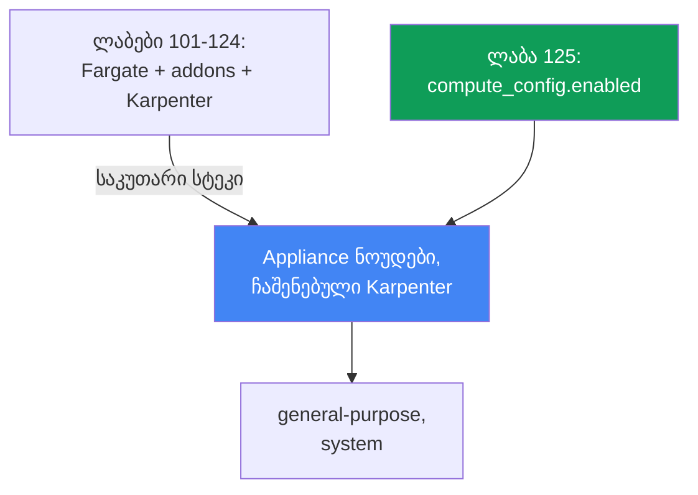
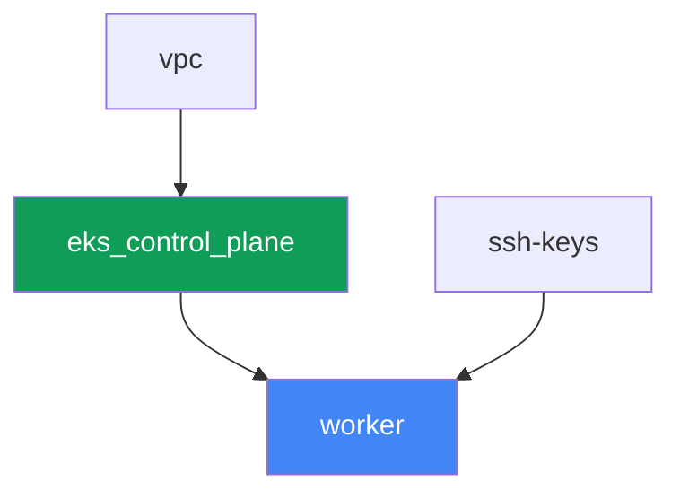

[Русская версия](README_RU.MD) · [Eng version](README.MD) · [Versión en español](README_ES.MD) · [Version française](README_FR.MD) · [Deutsche Version](README_DE.MD) · [繁體中文版](README_TW.MD) · [日本語版](README_JP.MD)

# Lab 125 - EKS Auto Mode საკუთარი სტეკის წინააღმდეგ

## აღწერა

ლაბებში 101-124 კლასტერი შედგებოდა ცალკეული ნაწილებისგან: control plane, Fargate
სისტემური podებისთვის, ცალკე დაყენებული Karpenter და მისი NodePool. ამ ლაბში კლასტერი
აგებულია ფუნდამენტურად სხვაგვარად - ჩართულია EKS Auto Mode და AWS თავად მართავს ნოუდებს,
როგორც appliance-ს: ირჩევს AMI-ს, რთავს SELinux-ს enforcing რეჟიმში და read-only root-ს,
ხურავს SSH-ს და SSM-ს, ზრუნავს მასშტაბირებაზე ჩაშენებული Karpenter-ის მეშვეობით და
უზრუნველყოფს ჩაშენებულ pod ქსელს, DNS-ს, EBS CSI-ს და ELB ინტეგრაციას. Managed addon-ები
`vpc-cni`, `kube-proxy`, `coredns` და `aws-ebs-csi-driver` ამ ლაბში საერთოდ არ
ინსტალირდება - ისინი ზედმეტია, რადგან Auto Mode ამავე საქმეს თავადვე აკეთებს. თქვენ
ჩართავთ მხოლოდ ჩაშენებულ NodePool `general-purpose`-ს, დაადასტურებთ, რომ მეორე ჩაშენებული
NodePool `system` არ ავრცობს ნოუდებს, სანამ გამორთულია, სცდით ჩაშენებული NodePool-ის
რედაქტირებას და ნახავთ, რომ ცვლილება მაინც მიღებულია, შემდეგ შექმნით საკუთარ NodePool-ს
ცხადი `limits`-ით - რადგან ჩაშენებულ pool-ებს ისინი არ აქვთ.

დავალებები დაწერილია production სტილში: მოკლე ფორმულირება პლუს მიღების კრიტერიუმები.
შემოწმება ავტომატურია, ბრძანებით `check_result`.

## მიზანი

გავიმეოროთ კურსის ამ თავის მასალა:

- [თავი 9. გამოთვლის ტიპები: managed node groups, self-managed, Fargate, Auto
  Mode](../../course/09/ru.md) - როდის ჩავრთოთ EKS Auto Mode და როდის ავაწყოთ საკუთარი
  სტეკი

## რას ვქმნით

კლასტერი გაშლილია, როგორც კოდი, მაგრამ Fargate პროფილის და გარეშე Karpenter-ის გარეშე -
control plane იქმნება პირდაპირ `compute_config.enabled = true`-ით და ჩართული მხოლოდ ერთი
ჩაშენებული NodePool-ით.

| ობიექტი | რა არის ეს | რატომ არის ამ ლაბში |
|--------|---------|-------------------|
| `compute_config.enabled = true` | Auto Mode-ის ალამი control plane-ზე | რთავს appliance ნოუდებს, ჩაშენებულ Karpenter-ს, ქსელს, DNS-ს, EBS CSI-ს, ELB-ს |
| NodePool `general-purpose` (ჩაშენებული) | ერთადერთი ჩართული ჩაშენებული NodePool | დატვირთვის სამიზნე; C/M/R, მხოლოდ on-demand, generation 5+ |
| NodePool `system` (ჩაშენებული, გამორთული) | მეორე ჩაშენებული NodePool | რჩება გამორთული - მის გარეშე `CriticalAddonsOnly` podები ნოუდს არ იღებენ |
| Namespace `eks-125` | კლასტერის სექცია ლაბის დატვირთვისთვის | რესურსებს სისტემურისგან განცალკევებით ინახავს |
| Deployment `web` (2 რეპლიკა) | ping_pong აპლიკაცია `general-purpose`-ზე | ადასტურებს, რომ Auto Mode ნამდვილად აწევს და გეგმავს ნოუდებს |
| არტეფაქტი `nossh.txt` | SSH/SSM მცდელობა Auto Mode ნოუდზე | აფიქსირებს დოკუმენტირებულ შეზღუდვას - წვდომა არ არსებობს |
| საკუთარი NodePool `custom-limited` | NodePool ცხადი `limits`-ით | ჩაშენებულ pool-ებს `limits` არ აქვთ, საკუთარი თავად ადგენს მათ |

განსხვავება ლაბების 101-124 ბაზასა და ამ ლაბს შორის:



## ინფრასტრუქტურა

გარემო გაშლილია AWS-ში (`eu-central-1`) Terragrunt-ის მეშვეობით. ლაბ 101-ის ბაზისგან
განსხვავებით, აქ სამუშაო მანქანამდე მხოლოდ სამი ინფრასტრუქტურული კომპონენტია: `vpc`,
`ssh-keys` და `eks_control_plane`. კომპონენტები `eks_fargate_system`, `eks_addons`,
`eks_karpenter`, `eks_karpenter_default_vng` ამ ლაბში საერთოდ არ არსებობს - Auto Mode
ამას ყველაფერს სერვისის საკუთარი ფუნქციონალით ცვლის.

### მოდულები და დამოკიდებულებები

| დირექტორია (კომპონენტი) | მოდული (`terraform/modules/`) | დამოკიდებული | რას ქმნის |
|---------------------|-------------------------------|------------|-------------|
| `vpc` | `vpc_v3` | - | VPC `10.10.0.0/16`, ქვექსელები ორ AZ-ში, NAT |
| `ssh-keys` | `ssh-keys` | - | SSH გასაღების წყვილი სამუშაო მანქანისთვის (Auto Mode ნოუდებს გასაღები არ სჭირდება) |
| `eks_control_plane` | `eks_v2_control_plane` | `vpc` | EKS control plane `1.36` `compute_config.enabled = true`-ით, `node_pools = ["general-purpose"]` |
| `worker` | `eks_v2_work_pc` | `ssh-keys`, `vpc`, `eks_control_plane` | სამუშაო მანქანა kubectl-ით, ტესტებით და `check_result`-ით |

დამოკიდებულებების გრაფი (რაც ჯერ ხდება, ის ისრის მიმართულებით უფრო ქვევითაა):



### რა შეიცვალა მოდულში `eks_v2_control_plane`

მოდულმა `terraform/modules/eks_v2_control_plane` მიიღო ახალი **არასავალდებულო**
პარამეტრი `compute_config` ობიექტ `eks`-ის შიგნით (ნაგულისხმევად `null`). ცვლილება
ადიტიურია: კურსის ყველა სხვა ლაბი, რომელიც ამ მოდულს იყენებს, `eks` ობიექტს ამ ველის
გარეშე გადასცემს და შეუცვლელად მუშაობს - `compute_config = null` ნიშნავს, რომ upstream
მოდული `terraform-aws-modules/eks/aws` `compute_config` ბლოკს საერთოდ არ ქმნის, ზუსტად
ისე, როგორც ამ ლაბის წინ. ამ ლაბში `eks_control_plane/terragrunt.hcl` გადასცემს
`compute_config = { enabled = true, node_pools = ["general-purpose"] }` - ეს არის
შეყვანების ერთადერთი განსხვავება ლაბ 101-თან შედარებით.

სამუშაო მანქანის მოდულმა `terraform/modules/eks_v2_work_pc` მიიღო სამი დამატებითი
უფლება, ყველა საჭირო ამ ლაბის დავალებებისთვის: `ssm:GetConnectionStatus` და
`ssm:DescribeInstanceInformation` (დავალება 4 ადასტურებს, რომ ნოუდი SSM-თან
დაკავშირებული არ არის) და `iam:PassRole` როლებზე `*-eks-auto-*` პირობით
`iam:PassedToService: eks.amazonaws.com` - მის გარეშე `aws eks update-cluster-config`
Auto Mode-სთვის პასუხობს `AccessDeniedException`-ს, და სტუდენტს არ შეეძლება არც მეორე
ჩაშენებული pool-ის ჩართვა, არც წაშლილის აღდგენა. ცვლილება ადიტიურია და კურსის სხვა
ლაბებზე გავლენას არ ახდენს.

ცალკე terraform მოდული ნოუდებისთვის ან NodePool-ისთვის ამ ლაბში არ არსებობს: ჩაშენებული
NodePool-ები `general-purpose` და `system` თავად EKS Auto Mode-ის ნაწილია და არა
terraform-ის მიერ შექმნილი რესურსი. მათი მართვა ხდება მხოლოდ `computeConfig.nodePools`-ის
მეშვეობით control plane-ზე (იხილეთ დავალებები 1-2) ან `kubectl`-ის მეშვეობით საკუთარი
NodePool-ისთვის (დავალება 5).

### სად რა კონფიგურირდება

`env.hcl` (გარემოს საერთო პარამეტრები):

| პარამეტრი | მნიშვნელობა ლაბში | რაზე მოქმედებს |
|----------|-----------------|---------------|
| `region` | `eu-central-1` | ყველა რესურსის რეგიონი |
| `prefix` | `eks-task125` | რესურსების სახელების და თეგების პრეფიქსი |
| `stack_name` | `eks125` | მისგან იქმნება `env_name` - კლასტერის სახელი |
| `k8_version` | `1.36.0` | kubectl-ის ვერსია სამუშაო მანქანაზე |

`inputs` თითოეული კომპონენტის `terragrunt.hcl`-ში:

| ფაილი | ძირითადი პარამეტრები |
|------|--------------------|
| `eks_control_plane/terragrunt.hcl` | `eks.compute_config.enabled = true`, `node_pools = ["general-purpose"]` |
| `worker/terragrunt.hcl` | `test_url`, `task_script_url` ლაბ 125-ის ფაილებისთვის; Karpenter კომპონენტზე დამოკიდებულების გარეშე |

## გაშლა

```bash
TASK=125 make run_eks_task
```

გაშლა გრძელდება დაახლოებით 15-20 წუთი. გამოტანილში მოძებნეთ ხაზი სამუშაო მანქანასთან SSH
კავშირით და დაუკავშირდით მას. kubectl იქ უკვე კონფიგურირებულია სწორ კლასტერზე.

სასარგებლო ბრძანებები სამუშაო მანქანაზე:

```bash
time_left       # რამდენი დრო დარჩა გარემოს
check_result    # გადამოწმეთ გამოსავალი
```

> სტენდის უსაფრთხოება. `env.hcl`-ში ჩართულია `ssh_password_enable = true` და
> `access_cidrs = ["0.0.0.0/0"]` - ეს კომფორტულია სასწავლო გარემოსთვის, მაგრამ
> production-ში ასე არ შეიძლება. კურსის სტანდარტების მიხედვით (თავები 0.2, 2, 19)
> სამუშაო მანქანებზე წვდომა ხდება AWS SSM Session Manager-ის მეშვეობით, საჯარო SSH
> პორტების გარეშე, ხოლო `access_cidrs` მიზანმიმართულ მისამართებზე იზღუდება. აქ საჯარო
> SSH დარჩენილია მხოლოდ სამუშაო მანქანის გაშვების გასამარტივებლად - ეს არ ეხება თავად
> Auto Mode ნოუდებს, რომლებზეც წვდომა საერთოდ არ არსებობს (დავალება 4).

## დავალებები

---
|        **1**        | **რეჟიმის დადასტურება: Auto Mode ჩართულია**                  |
| :-----------------: | :------------------------------------------------------------ |
| რას ვაკეთებთ          | დაადგინეთ კლასტერის სახელი kubeconfig-იდან (`kubectl config current-context \| awk -F/ '{print $NF}'`) - ეს უფრო საიმედოა, ვიდრე `list-clusters[0]`, რომელიც ანგარიშში რამდენიმე კლასტერის არსებობისას სხვისკენ მიგვითითებდა. შეასრულეთ `aws eks describe-cluster --name <cluster> --query 'cluster.computeConfig'` და დაადასტურეთ, რომ `enabled: true` და `nodePools` შეიცავს `general-purpose`-ს. შეასრულეთ `kubectl get nodepools` და დაადასტურეთ, რომ `general-purpose` სიაშია. შედეგები შეინახეთ `/var/work/tests/artifacts/1/automode.txt`-ში. |
| მიღების კრიტერიუმები    | - ფაილი `1/automode.txt` არ არის ცარიელი, შეიცავს `"enabled": true` და `general-purpose`. |
---
|        **2**        | **მეორე ჩაშენებული NodePool გამორთულია**                       |
| :-----------------: | :------------------------------------------------------------ |
| რას ვაკეთებთ          | დამოწმეთ, რომ `system` აქტიურ NodePool-ებში არ ხვდება: `kubectl get nodepools` არ უნდა აჩვენებდეს `system`-ს (ჩაშენებული NodePool Kubernetes რესურსად ხდება ჩნდება მხოლოდ მაშინ, როცა ჩართულია `computeConfig.nodePools`-ში). განმარტეთ `/var/work/tests/artifacts/2/twopools.txt`-ში, რატომ არის მნიშვნელოვანი NodePool `system` production-ში - მას აქვს taint `CriticalAddonsOnly`, რომელს ტოლერირებენ სისტემური კომპონენტები, მაგალითად CoreDNS, და ეს საშუალებას აძლევს კლასტერისთვის კრიტიკულ podებს ჩვეულებრივ დატვირთვისგან დაშორებას. ტექსტში უნდა იყოს სიტყვები `system` და `CriticalAddonsOnly`. |
| მიღების კრიტერიუმები    | - `kubectl get nodepools` არ შეიცავს `system`-ს;<br/>- ფაილი `2/twopools.txt` არ არის ცარიელი და შეიცავს `system` და `CriticalAddonsOnly`. |
---
|        **3**        | **დატვირთვა general-purpose-ზე და ჩაშენებული NodePool-ის მფლობელი** |
| :-----------------: | :------------------------------------------------------------ |
| რას ვაკეთებთ          | შექმენით namespace `eks-125` და Deployment `web` (image `viktoruj/ping_pong:latest`, `2` რეპლიკა). დაიცადეთ, სანამ Auto Mode მათთვის ნოუდს აწევს და ორივე pod `Running` მდგომარეობაში გადავა. შემდეგ სცადეთ ჩაშენებული NodePool-ის რედაქტირება: `kubectl patch nodepool general-purpose --type merge -p '{"spec":{"limits":{"cpu":"100"}}}'`. ცვლილება ჩაივლის - admission დონეზე აკრძალვა არ არსებობს. გაარკვიეთ, ვისია ობიექტი: შეამოწმეთ ლეიბლი `app.kubernetes.io/managed-by` და სია `metadata.managedFields[*].manager`. ჩადეთ `/var/work/tests/artifacts/3/builtin.txt`-ში patch-ის გამოტანილი, ორივე მფლობელობის შემოწმება და შენიშვნა, თუ რატომ არ არის ასეთი ცვლილება მხარდაჭერილი კონფიგურაციის მეთოდი. შემდეგ დააბრუნეთ pool საწყის მდგომარეობაში: `kubectl patch nodepool general-purpose --type merge -p '{"spec":{"limits":null}}'`. |
| მიღების კრიტერიუმები    | - Deployment `web` `eks-125`-ში, `2` მზა რეპლიკა, ერთი pod-იც არ Fargate-ზე;<br/>- ფაილი `3/builtin.txt` არ არის ცარიელი, შეიცავს `patched` და ობიექტის მფლობელს (`managed-by` ან `eks-auto-mode`). |
---
|        **4**        | **ოპერატორს ნოუდზე წვდომა არ აქვს, მაგრამ ჰოსტი დამალული არ არის**         |
| :-----------------: | :------------------------------------------------------------ |
| რას ვაკეთებთ          | დაადგინეთ ნოუდი, რომელზეც მუშაობს pod `web` (`kubectl get pods -n eks-125 -o wide`) - Auto Mode-ში ნოუდის სახელი თავადვე instance ID-ია. შეაგროვეთ სამი ფაქტი და ჩადეთ `/var/work/tests/artifacts/4/nossh.txt`-ში: (1) instance-ს არ აქვს key pair - `aws ec2 describe-instances --instance-ids <node> --query 'Reservations[0].Instances[0].KeyName'` აბრუნებს `null`-ს, ესე იგი SSH გასაღებით პრინციპში შეუძლებელია; (2) SSM დაკავშირებული არ არის - `aws ssm get-connection-status --target <node>` აბრუნებს `notconnected`-ს, ხოლო `aws ssm describe-instance-information` ამ ნოუდს არ აჩვენებს; (3) ამავდროულად ჰოსტი კლასტერისგან იზოლირებული არ არის: გაუშვით `eks-125`-ში pod `securityContext.privileged: true`-ით და `hostPath`-ით `/`-ზე, მიმაგრებული `/host`-ზე, და წაიკითხეთ `/host/etc/os-release` - ნახავთ `NAME=Bottlerocket`-ს. დაამატეთ დასკვნა: Auto Mode ხურავს ოპერატორის კარს (SSH, SSM), მაგრამ არა cluster-admin-ის კარს - ამაზე პასუხისმგებელია Pod Security Admission და პოლიტიკები (თავები 19 და 22). Pod წაშალეთ შემოწმების შემდეგ. |
| მიღების კრიტერიუმები    | - ფაილი `4/nossh.txt` არ არის ცარიელი და შეიცავს სამივე მტკიცებულებას: `KeyName`, `notconnected` და `Bottlerocket`. |
---
|        **5**        | **საკუთარი NodePool ცხადი limits-ით**                              |
| :-----------------: | :------------------------------------------------------------ |
| რას ვაკეთებთ          | ჩაშენებულ NodePool-ებს `limits` არ აქვთ - დატვირთვის უსაზღვრო ზრდისას ეს არაკონტროლირებული ხარჯების რისკია. შექმენით საკუთარი NodePool `custom-limited`, გამოიყენეთ `nodeClassRef`, რომელი ჩაშენებულ `NodeClass` `default`-ზე მიმართავს (`group: eks.amazonaws.com`, `kind: NodeClass`, `name: default`), `requirements`-ით instance კატეგორიებზე `c`, `m`, `r` და ცხადი `limits` ბლოკით (`cpu: "10"`, `memory: 10Gi`). გამოიყენეთ მანიფესტი და დაიცადეთ, სანამ `kubectl get nodepool custom-limited` `Ready` სტატუსს აჩვენებს. |
| მიღების კრიტერიუმები    | - NodePool `custom-limited` არსებობს, `spec.limits.cpu` უტოლდება `"10"`-ს;<br/>- `spec.template.spec.nodeClassRef.name` უტოლდება `default`-ს. |
---

### სად ზუსტად გადის Auto Mode-ის საზღვარი

ზემოთ მოცემული ორი დავალება მიზანმიმართულად არის შედგენილი ისე, რომ ნახოთ ფაქტები და არა
სლოგანები. ორივე წერტილი დოკუმენტაციის გადმოცემაშიც კი ბუნდოვნად ფორმულირდება, ამიტომ
თავად შეამოწმეთ.

**„ჩაშენებული pool-ების რედაქტირება არ შეიძლება" - ეს კონტრაქტია, არა admission
დონეზე აკრძალვა.** AWS-ის დოკუმენტაცია ჩაშენებულ NodePool-ებზე ამბობს „can be enabled or
disabled but not modified", და ადვილია იმის დაშვება, რომ API ცვლილებას უარყოფს. ის
მიღებულია: `kubectl patch` აბრუნებს `nodepool.karpenter.sh/general-purpose patched`-ს, და
მნიშვნელობა ობიექტში რჩება. ნამდვილი საზღვარი სხვაგან არის: ობიექტი სერვისს ეკუთვნის,
მას აქვს ლეიბლი `app.kubernetes.io/managed-by: eks` და მისი ველების მფლობელია
`eks-auto-mode`. როგორც კი pool-ის სახელი შეიცვლება `computeConfig.nodePools`-ში, რესურსი
ნოუდებთან ერთად წაიშლება, ხოლო სახელის დაბრუნებისას თავიდან ეშენება - თქვენი ცვლილებების
გარეშე. სტენდზე დამოწმებულია: pool-ის გამორთვისა და ხელახლა ჩართვის შემდეგ `spec.limits`
ცარიელი აღმოჩნდა, თუმცა მანამდე იქ `cpu: 100` იდგა.

> **ჩაშენებული NodePool kubectl-ით არ წაშალოთ.** `kubectl delete nodepool
> general-purpose` ჩაივლის, pool-ის ნოუდები დრეინირდება და ტერმინირდება, მაგრამ EKS
> თავადვე ობიექტს ხელახლა არ ქმნის - დამოწმებულია, ხუთი წუთის შემდეგ pool არ დაბრუნდა და
> კლასტერი გამოთვლის გარეშე დარჩა. აღდგენა მხოლოდ `computeConfig`-ის ცვლილებით ხდება:
> pool-ის სახელის მოცილება და ხელახლა დამატება (გამოძახებას ერთდროულად უნდა გადავცეთ
> `--compute-config`, `--storage-config` და `--kubernetes-network-config`, სხვაგვარად
> EKS პასუხობს `The type for cluster update was not provided`-ს, და ცარიელ `nodePools`
> სიას `nodeRoleArn`-თან ერთად არ იღებს).

**„ნოუდზე წვდომა არ არსებობს" მართალია მხოლოდ ოპერატორის წვდომასთან
დაკავშირებით.** SSH შეუძლებელია: instance-ს key pair არ აქვს (`KeyName` ცარიელია),
image-ი Bottlerocket-ია, shell-ისა და პაკეტების მენეჯერის გარეშე. SSM დაკავშირებული არ
არის: `get-connection-status` პასუხობს `notconnected`-ს, ნოუდი `describe-instance-information`
ინვენტარში არ არსებობს. მაგრამ პრივილეგირებული pod `hostPath`-ით `/`-ზე მშვიდად კითხულობს
ჰოსტის ფაილურ სისტემას და აჩვენებს `NAME=Bottlerocket`-ს და `/bin`-ის შემცველობას (იქ
გვხვდება `apiclient`, `aws-network-policy-agent`). დასკვნა production-ისთვის: Auto Mode
ხსნის თქვენგან ნოუდის მოვლას და აშორებს ინტერაქტიულ წვდომას, მაგრამ არ ცვლის კონტროლს იმის
თაობაზე, ვისაც კლასტერში პრივილეგირებული pod-ის გაშვება შეუძლია - ეს ისევ თქვენი საქმეა
(თავები 19 და 22).

კიდევ ერთი პრაქტიკული დეტალი: `aws ssm start-session` ამ ლაბში მიზანმიმართულად არ
გამოიყენება მტკიცებულებად. სამუშაო მანქანას `ssm:StartSession` უფლება არ აქვს, ამიტომ
ბრძანება აბრუნებს `AccessDeniedException`-ს - ეს worker-ის პოლიტიკაზე მეტყველებს,
არა ნოუდზე. კითხვის უფლებები (`ssm:GetConnectionStatus`, `ssm:DescribeInstanceInformation`)
სამუშაო მანქანის მოდულს დაემატა ზუსტად იმიტომ, რომ ისინი პასუხობენ დავალების კითხვას.

## შედეგის შემოწმება

სამუშაო მანქანაზე გაუშვით ავტომატური შემოწმება:

```bash
check_result
```

სკრიპტი გაუშვებს ტესტებს და გამოაჩენს დასრულებული დავალებების პროცენტს.

## გამოსავალი

ეტალონური გამოსავალი: [worker/files/solutions/1_GE.MD](worker/files/solutions/1_GE.MD)

## კლასტერისა და რესურსების წაშლა

> **პირველ ჯერზე მოაცილეთ დატვირთვა და დაიცადეთ, სანამ ნოუდები გაქრება, შემდეგ
> დაანგრიეთ სტენდი.** Auto Mode ნოუდები ჩვეულებრივი EC2 instance-ებია pod ქსელის
> მეორადი ENI-ებით. თუ კლასტერს წაშლით, როცა დატვირთვა კიდევ მუშაობს, ENI `available`
> მდგომარეობაში დარჩენა და security group-ის დაკავება შესაძლებელია, ხოლო `destroy`
> ამ SG-ის წაშლაზე ათეულობით წუთის განმავლობაში გაიჭედება. ეს ლაბი AWS რესურსებს ხელით
> არ ქმნის, ყველა დანარჩენი Kubernetes ობიექტია.

```bash
# 1. მოაცილეთ დატვირთვა და შემოწმების pod, თუ ის ჯერ ცოცხალია
kubectl delete namespace eks-125 --ignore-not-found

# 2. მოაცილეთ საკუთარი NodePool დავალება 5-იდან (ჩაშენებულ general-purpose-ს არ შეხოთ)
kubectl delete nodepool custom-limited --ignore-not-found

# 3. დაიცადეთ, სანამ Auto Mode ნოუდებს მოაცილებს: სია ცარიელი უნდა გახდეს
while kubectl get nodes --no-headers 2>/dev/null | grep -q .; do
  echo "ნოუდები ჯერ კიდევ არსებობს, ველოდებით..."; sleep 15
done
```

მხოლოდ ამის შემდეგ დააგდეთ სტენდი:

```bash
TASK=125 make delete_eks_task
```

თუ `destroy` security group-ზე გაჭედა, მოძებნეთ დანარჩენი ENI და წაშალეთ:

```bash
aws ec2 describe-network-interfaces --filters Name=status,Values=available \
  --query 'NetworkInterfaces[].[NetworkInterfaceId,Description]' --output table
aws ec2 delete-network-interface --network-interface-id <eni-id>
```

ცალკე შემთხვევა - თუ ექსპერიმენტების დროს ჩაშენებული NodePool წაშლილია
`kubectl delete nodepool general-purpose`-ის მეშვეობით. თავად EKS მას არ დააბრუნებს,
კლასტერი გამოთვლის გარეშე დარჩება. აღდგენა `computeConfig`-ის მეშვეობით ხდება, ორი
გამოძახებით: ჯერ pool-ების სია იცვლება (მაგალითად `system`-ის დამატებით), შემდეგ
დაბრუნდება მხოლოდ `general-purpose`. როლის სახელი `describe-cluster`-იდან იღება:

```bash
CLUSTER=$(kubectl config current-context | awk -F/ '{print $NF}')
ROLE=$(aws eks describe-cluster --name "$CLUSTER" \
  --query 'cluster.computeConfig.nodeRoleArn' --output text)

aws eks update-cluster-config --name "$CLUSTER" \
  --compute-config "{\"enabled\":true,\"nodePools\":[\"system\",\"general-purpose\"],\"nodeRoleArn\":\"$ROLE\"}" \
  --storage-config '{"blockStorage":{"enabled":true}}' \
  --kubernetes-network-config '{"elasticLoadBalancing":{"enabled":true}}'
# დაიცადეთ cluster.status = ACTIVE, შემდეგ დააბრუნეთ მხოლოდ general-purpose
```
