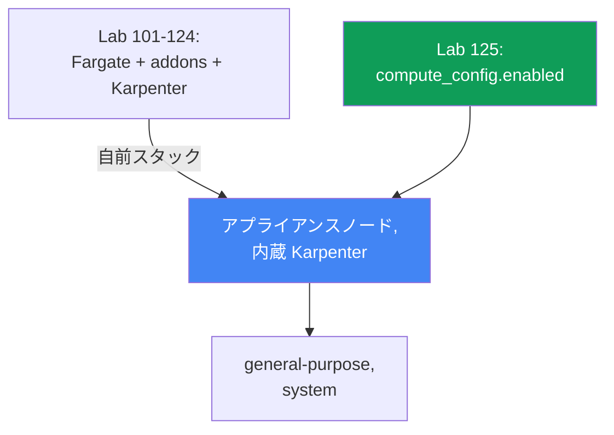
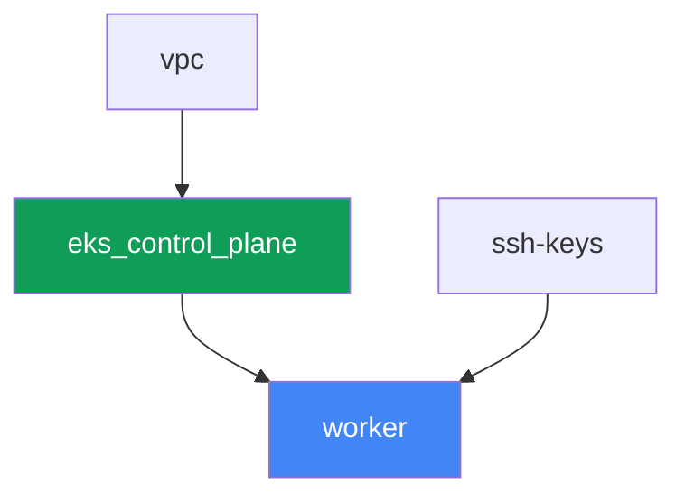

[Русская версия](README_RU.MD) · [Eng version](README.MD) · [Versión en español](README_ES.MD) · [Version française](README_FR.MD) · [Deutsche Version](README_DE.MD) · [ქართული ვერსია](README_GE.MD) · [繁體中文版](README_TW.MD)

# Lab 125 - EKS Auto Mode と自前スタックの比較

## 説明

Lab 101-124 では、クラスターは別々のパーツから組み立てられていました：control plane、
システム pod 用の Fargate、別途インストールされた Karpenter とその NodePool。この lab
ではクラスターの構成が根本的に異なります - EKS Auto Mode が有効化され、AWS 自身がノードを
アプライアンスとして管理します：AMI を選び、SELinux を enforcing モードで有効化し、
read-only root を設定し、SSH と SSM を閉じ、内蔵の Karpenter でスケーリングを担い、内蔵の
pod ネットワーク、DNS、EBS CSI、ELB 統合を維持します。managed addon の `vpc-cni`、
`kube-proxy`、`coredns`、`aws-ebs-csi-driver` はこの lab では一切インストールされません -
Auto Mode が同じことを自分で行うため、これらは冗長です。あなたは内蔵 NodePool
`general-purpose` だけを有効化し、二つ目の内蔵 NodePool `system` が無効な間はノードを
展開しないことを確認し、内蔵 NodePool の編集を試みてもそれが受け入れられてしまうことを
確認し、その後、明示的な `limits` を持つ独自の NodePool を作成します - 内蔵の pool には
`limits` がないためです。

タスクはプロダクションスタイルで書かれています：短い説明と受け入れ基準です。検証は
`check_result` コマンドで自動的に行われます。

## 目標

このコースの章の内容を定着させます：

- [第 9 章。コンピュートの種類：managed node groups、self-managed、Fargate、Auto
  Mode](../../course/09/ru.md) - いつ EKS Auto Mode を有効にし、いつ自前のスタックを
  構築するか

## 作成するもの

クラスターはコードとしてデプロイされますが、Fargate プロファイルも外部の Karpenter も
ありません - control plane は最初から `compute_config.enabled = true` で作成され、内蔵
NodePool は一つだけ有効化されます。

| オブジェクト | それは何か | この lab で必要な理由 |
|--------|---------|-------------------|
| `compute_config.enabled = true` | control plane 上の Auto Mode フラグ | アプライアンスノード、内蔵 Karpenter、ネットワーク、DNS、EBS CSI、ELB を有効化する |
| NodePool `general-purpose`（内蔵） | 有効化されている唯一の内蔵 NodePool | ワークロードのターゲット；C/M/R、on-demand のみ、generation 5+ |
| NodePool `system`（内蔵、無効） | 二つ目の内蔵 NodePool | 無効のまま - これがないと `CriticalAddonsOnly` の pod はノードを得られない |
| Namespace `eks-125` | lab のワークロード用のクラスター区画 | システムのリソースと分離しておく |
| Deployment `web`（2 レプリカ） | `general-purpose` 上の ping_pong アプリケーション | Auto Mode が実際にノードを立ち上げ、スケジューリングすることを確認する |
| アーティファクト `nossh.txt` | Auto Mode ノードへの SSH/SSM の試行 | ドキュメント化された制限を記録する - アクセスは存在しない |
| 独自の NodePool `custom-limited` | 明示的な `limits` を持つ NodePool | 内蔵 pool には `limits` がなく、独自のものは自分で設定する |

Lab 101-124 のベースとこの lab の違い：



## インフラストラクチャ

環境は Terragrunt を使って AWS（`eu-central-1`）にデプロイされます。lab 101 のベースとは
異なり、ここでは worker マシンの前にインフラコンポーネントが 3 つしかありません：`vpc`、
`ssh-keys`、`eks_control_plane`。`eks_fargate_system`、`eks_addons`、`eks_karpenter`、
`eks_karpenter_default_vng` といったコンポーネントはこの lab には一切存在しません -
Auto Mode がそれらすべてをサービス自身の機能で置き換えます。

### モジュールと依存関係

| ディレクトリ（コンポーネント） | モジュール（`terraform/modules/`） | 依存先 | 作成するもの |
|---------------------|-------------------------------|------------|-------------|
| `vpc` | `vpc_v3` | - | VPC `10.10.0.0/16`、二つの AZ にあるサブネット、NAT |
| `ssh-keys` | `ssh-keys` | - | worker マシン用の SSH キーペア（Auto Mode ノードにはキーは不要） |
| `eks_control_plane` | `eks_v2_control_plane` | `vpc` | `compute_config.enabled = true`、`node_pools = ["general-purpose"]` を持つ EKS control plane `1.36` |
| `worker` | `eks_v2_work_pc` | `ssh-keys`、`vpc`、`eks_control_plane` | kubectl、テスト、`check_result` を備えた worker マシン |

依存関係グラフ（先に適用されるものが矢印の下側にある）：



### `eks_v2_control_plane` モジュールで変更された点

モジュール `terraform/modules/eks_v2_control_plane` には、`eks` オブジェクト内に新しい
**オプション**パラメータ `compute_config`（デフォルトは `null`）が追加されました。この
変更は追加的なものです：このモジュールを使うコース内の他の lab はすべて、このフィールド
なしで `eks` オブジェクトを渡し、変更なく動作し続けます - `compute_config = null` は、
upstream モジュール `terraform-aws-modules/eks/aws` がこの lab 以前と同様に
`compute_config` ブロックを一切作成しないことを意味します。この lab では
`eks_control_plane/terragrunt.hcl` が
`compute_config = { enabled = true, node_pools = ["general-purpose"] }` を渡します -
これが lab 101 との入力の唯一の違いです。

worker マシンのモジュール `terraform/modules/eks_v2_work_pc` には、この lab のタスクに
必要な 3 つの追加権限が加えられました：`ssm:GetConnectionStatus` と
`ssm:DescribeInstanceInformation`（タスク 4 でノードが SSM に接続されていないことを
証明する）、そして `iam:PassedToService: eks.amazonaws.com` という条件付きの
`*-eks-auto-*` ロールに対する `iam:PassRole` - これがないと Auto Mode 向けの
`aws eks update-cluster-config` は `AccessDeniedException` を返し、学習者は二つ目の
内蔵 pool を有効化することも、削除された pool を復元することもできません。この変更は
追加的なもので、コース内の他の lab には影響しません。

この lab にはノードや NodePool 専用の terraform モジュールはありません：内蔵 NodePool
`general-purpose` と `system` は EKS Auto Mode 自体の一部であり、terraform が作成する
リソースではありません。これらは control plane 上の `computeConfig.nodePools`
（タスク 1-2 を参照）を通じてのみ、または独自の NodePool については `kubectl`
（タスク 5）を通じてのみ管理されます。

### どこで何が設定されるか

`env.hcl`（環境の共通パラメータ）：

| パラメータ | この lab での値 | 何に影響するか |
|----------|-----------------|---------------|
| `region` | `eu-central-1` | すべてのリソースのリージョン |
| `prefix` | `eks-task125` | リソース名とタグのプレフィックス |
| `stack_name` | `eks125` | ここから `env_name`（クラスター名）が組み立てられる |
| `k8_version` | `1.36.0` | worker マシン上の kubectl のバージョン |

各コンポーネントの `terragrunt.hcl` 内の `inputs`：

| ファイル | 主要な設定 |
|------|--------------------|
| `eks_control_plane/terragrunt.hcl` | `eks.compute_config.enabled = true`、`node_pools = ["general-purpose"]` |
| `worker/terragrunt.hcl` | lab 125 のファイルを指す `test_url`、`task_script_url`；Karpenter コンポーネントへの依存なし |

## デプロイ

```bash
TASK=125 make run_eks_task
```

デプロイには概ね 15-20 分かかります。出力の中から worker マシンへの SSH 接続の行を見つけて
接続してください。そこでは kubectl はすでに正しいクラスターに設定済みです。

worker マシン上で使える便利なコマンド：

```bash
time_left       # 環境に残っている時間
check_result    # 解答を確認する
```

> 環境のセキュリティについて。`env.hcl` では `ssh_password_enable = true` と
> `access_cidrs = ["0.0.0.0/0"]` が有効になっています - トレーニング環境としては便利
> ですが、本番環境ではこうしてはいけません。コースの標準（第 0.2、2、19 章）に従うと、
> worker マシンへのアクセスは公開の SSH ポートを開けずに AWS SSM Session Manager を
> 経由し、`access_cidrs` は特定のアドレスに絞るべきです。ここでは worker マシンの
> 起動を簡単にするためだけに公開 SSH を残しています - これは Auto Mode ノード自体には
> 関係なく、そちらへのアクセスはまったく存在しません（タスク 4）。

## タスク

---
|        **1**        | **モードの確認：Auto Mode が有効になっている**                  |
| :-----------------: | :------------------------------------------------------------ |
| やること          | kubeconfig からクラスター名を特定してください（`kubectl config current-context \| awk -F/ '{print $NF}'`) - これは `list-clusters[0]` より信頼できます。複数のクラスターがあるアカウントでは他人のクラスターを指してしまうためです。`aws eks describe-cluster --name <cluster> --query 'cluster.computeConfig'` を実行し、`enabled: true` であること、`nodePools` に `general-purpose` が含まれていることを確認してください。`kubectl get nodepools` を実行し、一覧に `general-purpose` があることを確認してください。両方の出力を `/var/work/tests/artifacts/1/automode.txt` に保存してください。 |
| 受け入れ基準    | - ファイル `1/automode.txt` が空でなく、`"enabled": true` と `general-purpose` を含む。 |
---
|        **2**        | **二つ目の内蔵 NodePool が無効になっている**                       |
| :-----------------: | :------------------------------------------------------------ |
| やること          | `system` がアクティブな NodePool に含まれていないことを確認してください：`kubectl get nodepools` は `system` を表示しないはずです（内蔵 NodePool は `computeConfig.nodePools` で有効化されたときにのみ Kubernetes リソースとして現れます）。`/var/work/tests/artifacts/2/twopools.txt` に、なぜ `system` NodePool が本番環境で重要なのかを説明してください - CoreDNS のようなシステムコンポーネントが許容する `CriticalAddonsOnly` taint を持ち、クラスターにとって重要な pod を通常のワークロードから分離できるようにします。テキストには `system` と `CriticalAddonsOnly` という語を含めてください。 |
| 受け入れ基準    | - `kubectl get nodepools` に `system` が含まれない；<br/>- ファイル `2/twopools.txt` が空でなく、`system` と `CriticalAddonsOnly` を含む。 |
---
|        **3**        | **general-purpose 上のワークロードと、内蔵 NodePool の所有者** |
| :-----------------: | :------------------------------------------------------------ |
| やること          | namespace `eks-125` と Deployment `web`（image `viktoruj/ping_pong:latest`、`2` レプリカ）を作成してください。Auto Mode がそれらのためにノードを立ち上げ、両方の pod が `Running` になるまで待ってください。その後、内蔵 NodePool を編集してみてください：`kubectl patch nodepool general-purpose --type merge -p '{"spec":{"limits":{"cpu":"100"}}}'`。この変更は通ります - admission レベルの禁止はありません。オブジェクトの所有者を調べてください：ラベル `app.kubernetes.io/managed-by` と一覧 `metadata.managedFields[*].manager` を確認してください。patch の出力、両方の所有者確認、そしてこの編集がサポートされた設定方法ではない理由についてのメモを `/var/work/tests/artifacts/3/builtin.txt` に入れてください。その後、pool を元の状態に戻してください：`kubectl patch nodepool general-purpose --type merge -p '{"spec":{"limits":null}}'`。 |
| 受け入れ基準    | - Deployment `web` が `eks-125` にあり、`2` 個の準備済みレプリカがあり、Fargate 上には一つも pod がない；<br/>- ファイル `3/builtin.txt` が空でなく、`patched` とオブジェクトの所有者（`managed-by` または `eks-auto-mode`）を含む。 |
---
|        **4**        | **オペレーターはノードにアクセスできないが、ホストは隠されていない**         |
| :-----------------: | :------------------------------------------------------------ |
| やること          | pod `web` が動作しているノードを特定してください（`kubectl get pods -n eks-125 -o wide`) - Auto Mode ではノード名自体が instance ID です。3 つの事実を集め、`/var/work/tests/artifacts/4/nossh.txt` に入れてください：（1）このインスタンスには key pair がない - `aws ec2 describe-instances --instance-ids <node> --query 'Reservations[0].Instances[0].KeyName'` は `null` を返す、つまり鍵による SSH は原理的に不可能である；（2）SSM は接続されていない - `aws ssm get-connection-status --target <node>` は `notconnected` を返し、`aws ssm describe-instance-information` にこのノードは表示されない；（3）それにもかかわらずホストはクラスターから隔離されていない：`eks-125` に `securityContext.privileged: true` と、`/` を `/host` にマウントする `hostPath` を持つ pod を起動し、`/host/etc/os-release` を読んでください - `NAME=Bottlerocket` が見えるはずです。結論を追記してください：Auto Mode はオペレーターの入り口（SSH、SSM）を閉じますが、cluster-admin の入り口は閉じません - それは Pod Security Admission とポリシーが担います（第 19 章と 22 章）。確認後に pod を削除してください。 |
| 受け入れ基準    | - ファイル `4/nossh.txt` が空でなく、`KeyName`、`notconnected`、`Bottlerocket` の 3 つの証拠すべてを含む。 |
---
|        **5**        | **明示的な limits を持つ独自の NodePool**                              |
| :-----------------: | :------------------------------------------------------------ |
| やること          | 内蔵 NodePool には `limits` がありません - ワークロードが無制限に増加すると、コストが制御できなくなるリスクがあります。内蔵 `NodeClass` `default` を指す `nodeClassRef`（`group: eks.amazonaws.com`、`kind: NodeClass`、`name: default`）を使い、`c`、`m`、`r` というインスタンスカテゴリに対する `requirements` と、明示的な `limits` ブロック（`cpu: "10"`、`memory: 10Gi`）を持つ独自の NodePool `custom-limited` を作成してください。マニフェストを適用し、`kubectl get nodepool custom-limited` が `Ready` ステータスを表示するまで待ってください。 |
| 受け入れ基準    | - NodePool `custom-limited` が存在し、`spec.limits.cpu` が `"10"` に等しい；<br/>- `spec.template.spec.nodeClassRef.name` が `default` に等しい。 |
---

### Auto Mode の境界線はどこにあるのか

上記の二つのタスクは、あなたがスローガンではなく事実を目にするよう意図的に設計されて
います。どちらのポイントも、ドキュメントの要約においてさえ不正確に語られがちなので、
自分の手で確認してください。

**「内蔵 pool は編集できない」というのは契約であり、admission レベルの禁止では
ありません。** AWS のドキュメントは内蔵 NodePool について「can be enabled or disabled
but not modified」と述べており、API が編集を拒否すると思い込みやすいです。実際には
受け入れられます：`kubectl patch` は `nodepool.karpenter.sh/general-purpose patched`
を返し、値はオブジェクトに残ります。本当の境界線は別のところにあります：このオブジェクト
はサービスに属しており、`app.kubernetes.io/managed-by: eks` というラベルを持ち、その
フィールドの所有者は `eks-auto-mode` です。pool の名前が `computeConfig.nodePools` で
変更されるとすぐに、リソースはノードとともに削除され、名前が戻ってくると最初から
再作成されます - あなたの編集は残りません。テストベンチで確認済みです：pool を無効化して
再度有効化した後、`spec.limits` は空に戻っていました。それ以前は `cpu: 100` が設定
されていたにもかかわらずです。

> **kubectl 経由で内蔵 NodePool を削除しないでください。** `kubectl delete nodepool
> general-purpose` は実行できてしまい、pool のノードは drain されて終了しますが、EKS
> 自体はこのオブジェクトを再作成**しません** - 確認済みで、5 分後も pool は戻らず、
> クラスターは計算リソースを失ったままでした。復旧は `computeConfig` の変更を通じてのみ
> 可能です：pool の名前を取り除いてから再度追加してください（呼び出しには
> `--compute-config`、`--storage-config`、`--kubernetes-network-config` を一緒に渡す
> 必要があります。そうしないと EKS は `The type for cluster update was not provided`
> と応答し、空の `nodePools` リストを `nodeRoleArn` と一緒に渡すことも受け付けません）。

**「ノードへのアクセスがない」というのは、オペレーターのアクセスに関してのみ正しい
です。** SSH は不可能です：このインスタンスには key pair がなく（`KeyName` は空）、
image は Bottlerocket で、シェルもパッケージマネージャーもありません。SSM は接続
されていません：`get-connection-status` は `notconnected` と応答し、このノードは
`describe-instance-information` のインベントリにありません。しかし `/` を `hostPath`
で持つ特権 pod は、ホストのファイルシステムを問題なく読み取り、`NAME=Bottlerocket` と
`/bin` の内容（そこには `apiclient`、`aws-network-policy-agent` があります）を表示
します。本番環境への結論：Auto Mode はノードのメンテナンスをあなたから取り除き、
対話的なアクセスを排除しますが、クラスター内で誰が特権 pod を実行できるかという制御を
置き換えるものではありません - それは依然としてあなたの仕事です（第 19 章と 22 章）。

もう一つ実務的な詳細：`aws ssm start-session` はこの lab では意図的に証拠として使われ
ません。worker マシンには `ssm:StartSession` 権限がないため、このコマンドは
`AccessDeniedException` を返します - これはノードについてではなく、worker のポリシー
について語っています。読み取り権限（`ssm:GetConnectionStatus`、
`ssm:DescribeInstanceInformation`）が worker マシンのモジュールに追加されたのは、まさに
それらがこのタスクの問いに答えるからです。

## 結果の確認

worker マシン上で自動チェックを実行してください：

```bash
check_result
```

スクリプトはテストを実行し、完了したタスクの割合を表示します。

## 解答

参考解答：[worker/files/solutions/1_JP.MD](worker/files/solutions/1_JP.MD)

## クラスターとリソースの削除

> **まずワークロードを取り除き、ノードがなくなるまで待ってから、環境を破棄してください。**
> Auto Mode のノードは、pod ネットワークからのセカンダリ ENI を持つ通常の EC2 インスタンス
> です。ワークロードがまだ動いている状態でクラスターを削除すると、ENI が `available`
> 状態のまま残って security group を保持し続け、`destroy` がその SG の削除で数十分
> ハングすることがあります。この lab は AWS リソースを手動で作成しません、それ以外は
> すべて Kubernetes オブジェクトです。

```bash
# 1. ワークロードと確認用の pod を取り除く（まだ残っていれば）
kubectl delete namespace eks-125 --ignore-not-found

# 2. タスク 5 の独自の NodePool を取り除く（内蔵の general-purpose には触れない）
kubectl delete nodepool custom-limited --ignore-not-found

# 3. Auto Mode がノードを取り除くまで待つ：一覧が空になるはず
while kubectl get nodes --no-headers 2>/dev/null | grep -q .; do
  echo "ノードはまだ残っています、待機中..."; sleep 15
done
```

それが終わってから、初めて環境を破棄してください：

```bash
TASK=125 make delete_eks_task
```

`destroy` が security group で止まってしまった場合は、孤立した ENI を見つけて削除して
ください：

```bash
aws ec2 describe-network-interfaces --filters Name=status,Values=available \
  --query 'NetworkInterfaces[].[NetworkInterfaceId,Description]' --output table
aws ec2 delete-network-interface --network-interface-id <eni-id>
```

もう一つの特殊なケース - 実験の途中で内蔵 NodePool が
`kubectl delete nodepool general-purpose` によって削除された場合です。EKS 自身は
それを元に戻さず、クラスターは計算リソースのないままになります。復旧は
`computeConfig` を通じて、2 回の呼び出しで行います：まずは pool の一覧を変更し
（例えば `system` を追加する）、その後 `general-purpose` だけを戻します。ロール名は
`describe-cluster` から取得します：

```bash
CLUSTER=$(kubectl config current-context | awk -F/ '{print $NF}')
ROLE=$(aws eks describe-cluster --name "$CLUSTER" \
  --query 'cluster.computeConfig.nodeRoleArn' --output text)

aws eks update-cluster-config --name "$CLUSTER" \
  --compute-config "{\"enabled\":true,\"nodePools\":[\"system\",\"general-purpose\"],\"nodeRoleArn\":\"$ROLE\"}" \
  --storage-config '{"blockStorage":{"enabled":true}}' \
  --kubernetes-network-config '{"elasticLoadBalancing":{"enabled":true}}'
# cluster.status = ACTIVE を待ってから、general-purpose だけを戻す
```
