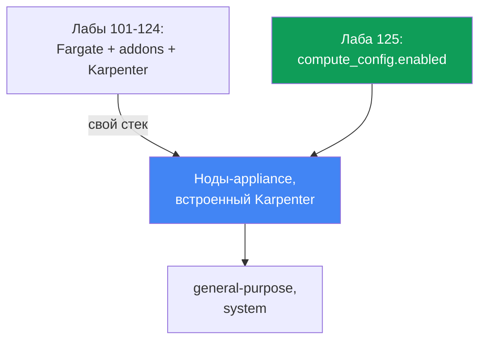
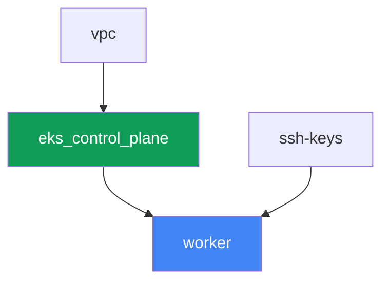

# Лаба 125 - EKS Auto Mode против своего стека

## Описание

В лабах 101-124 кластер собирался из отдельных частей: control plane, Fargate под
системные поды, отдельно поставленный Karpenter и его NodePool. В этой лабе кластер
устроен принципиально иначе - включён EKS Auto Mode, и AWS сам управляет нодами как
appliance: выбирает AMI, включает SELinux в enforcing и read-only root, закрывает SSH и
SSM, следит за масштабированием через встроенный Karpenter и держит встроенные сеть
подов, DNS, EBS CSI и интеграцию с ELB. Managed addon `vpc-cni`, `kube-proxy`, `coredns`
и `aws-ebs-csi-driver` в этой лабе не ставятся вовсе - они избыточны, потому что Auto
Mode делает то же самое сам. Вы включите только встроенный NodePool `general-purpose`,
убедитесь, что второй встроенный NodePool `system` не разворачивает ноды, пока выключен,
попробуете отредактировать встроенный NodePool и получите отказ, затем заведёте свой
NodePool с явными `limits` - потому что у встроенных пулов их нет.

Задания в продакшн-стиле: короткая постановка плюс критерии приёмки. Проверка -
автоматическая, командой `check_result`.

## Цель

Закрепить материал главы курса:

- [Глава 9. Типы вычислений: managed node groups, self-managed, Fargate, Auto
  Mode](../../course/09/ru.md) - когда включать EKS Auto Mode, а когда собирать свой
  стек

## Что мы создаём

Кластер разворачивается как код, но без Fargate-профиля и без внешнего Karpenter -
control plane создаётся сразу с `compute_config.enabled = true` и включённым только
одним встроенным NodePool.

| Объект | Что это | Зачем в этой лабе |
|--------|---------|-------------------|
| `compute_config.enabled = true` | флаг Auto Mode на control plane | включает ноды-appliance, встроенный Karpenter, сеть, DNS, EBS CSI, ELB |
| NodePool `general-purpose` (встроенный) | единственный включённый built-in NodePool | цель для нагрузки; C/M/R, только on-demand, generation 5+ |
| NodePool `system` (встроенный, выключен) | второй built-in NodePool | остаётся не включённым - без него `CriticalAddonsOnly` поды не получат ноду |
| Namespace `eks-125` | раздел кластера под нагрузку лабы | держим ресурсы отдельно от системных |
| Deployment `web` (2 реплики) | приложение ping_pong на `general-purpose` | подтверждаем, что Auto Mode реально поднимает и планирует ноды |
| Артефакт `nossh.txt` | попытка SSH/SSM на ноду Auto Mode | фиксируем документированное ограничение - доступа нет |
| Свой NodePool `custom-limited` | NodePool с явными `limits` | встроенные пулы `limits` не имеют, свои задают их сами |

Разница между базой лаб 101-124 и этой лабой:



## Инфраструктура

Окружение разворачивается в AWS (`eu-central-1`) через Terragrunt. В отличие от базы
лабы 101, здесь всего три инфраструктурных компонента до рабочей машины: `vpc`,
`ssh-keys` и `eks_control_plane`. Компонентов `eks_fargate_system`, `eks_addons`,
`eks_karpenter`, `eks_karpenter_default_vng` в этой лабе нет вовсе - Auto Mode заменяет
всё это функциональностью самого сервиса.

### Модули и зависимости

| Каталог (компонент) | Модуль (`terraform/modules/`) | Зависит от | Что создаёт |
|---------------------|-------------------------------|------------|-------------|
| `vpc` | `vpc_v3` | - | VPC `10.10.0.0/16`, подсети в двух AZ, NAT |
| `ssh-keys` | `ssh-keys` | - | пара SSH-ключей для рабочей машины (нодам Auto Mode ключ не нужен) |
| `eks_control_plane` | `eks_v2_control_plane` | `vpc` | control plane EKS `1.36` с `compute_config.enabled = true`, `node_pools = ["general-purpose"]` |
| `worker` | `eks_v2_work_pc` | `ssh-keys`, `vpc`, `eks_control_plane` | рабочая машина с kubectl, тестами и `check_result` |

Граф зависимостей (что применяется раньше, то ниже по стрелке):



### Что изменилось в модуле `eks_v2_control_plane`

Модуль `terraform/modules/eks_v2_control_plane` получил новый **опциональный** параметр
`compute_config` внутри объекта `eks` (по умолчанию `null`). Изменение аддитивное: все
остальные лабы курса, использующие этот модуль, передают объект `eks` без этого поля и
продолжают работать без изменений - `compute_config = null` означает, что upstream-модуль
`terraform-aws-modules/eks/aws` не создаёт блок `compute_config` вовсе, точно как раньше
этой лабы. В этой лабе `eks_control_plane/terragrunt.hcl` передаёт
`compute_config = { enabled = true, node_pools = ["general-purpose"] }` - это единственное
отличие входных данных от лабы 101.

Отдельного terraform-модуля под ноды или NodePool в этой лабе нет: встроенные NodePool
`general-purpose` и `system` - часть самого EKS Auto Mode, а не ресурс, который создаёт
terraform. Управление ими происходит только через `computeConfig.nodePools` на control
plane (см. задания 1-2) или через `kubectl` для собственных NodePool (задание 5).

### Где что настраивается

`env.hcl` (общие параметры окружения):

| Параметр | Значение в лабе | На что влияет |
|----------|-----------------|---------------|
| `region` | `eu-central-1` | регион всех ресурсов |
| `prefix` | `eks-task125` | префикс имён ресурсов и тегов |
| `stack_name` | `eks125` | из него собирается `env_name` - имя кластера |
| `k8_version` | `1.36.0` | версия kubectl на рабочей машине |

`inputs` в `terragrunt.hcl` каждого компонента:

| Файл | Ключевые настройки |
|------|--------------------|
| `eks_control_plane/terragrunt.hcl` | `eks.compute_config.enabled = true`, `node_pools = ["general-purpose"]` |
| `worker/terragrunt.hcl` | `test_url`, `task_script_url` на файлы лабы 125; без зависимости от Karpenter-компонента |

## Развёртывание

```bash
TASK=125 make run_eks_task
```

Развёртывание занимает примерно 15-20 минут. В выводе найдите строку с SSH-подключением к
рабочей машине и подключитесь к ней. kubectl там уже настроен на нужный кластер.

Полезные команды на рабочей машине:

```bash
time_left       # сколько осталось времени окружения
check_result    # проверить решение
```

> Безопасность стенда. В `env.hcl` включены `ssh_password_enable = true` и
> `access_cidrs = ["0.0.0.0/0"]` - это удобно для учебного окружения, но так делать в
> продакшене нельзя. По стандартам курса (главы 0.2, 2, 19) доступ к рабочим машинам
> открывают через AWS SSM Session Manager без публичных SSH-портов наружу, а
> `access_cidrs` сужают до конкретных адресов. Здесь публичный SSH оставлен только ради
> простоты запуска рабочей машины - самих нод Auto Mode это не касается, к ним доступа
> нет вообще (задание 4).

## Задания

---
|        **1**        | **Подтверждение режима: Auto Mode включён**                  |
| :-----------------: | :------------------------------------------------------------ |
| Что делаем          | Выполните `aws eks describe-cluster --name <cluster> --query 'cluster.computeConfig'` и убедитесь, что `enabled: true`, а `nodePools` содержит `general-purpose`. Выполните `kubectl get nodepools` и убедитесь, что в списке есть `general-purpose`. Сохраните оба вывода в `/var/work/tests/artifacts/1/automode.txt`. |
| Критерии приёмки    | - файл `1/automode.txt` не пуст, содержит `"enabled": true` и `general-purpose`. |
---
|        **2**        | **Второй встроенный NodePool выключен**                       |
| :-----------------: | :------------------------------------------------------------ |
| Что делаем          | Проверьте, что `system` не входит в список активных NodePool: `kubectl get nodepools` не должен показывать `system` (built-in NodePool появляется как Kubernetes-ресурс, только когда включён в `computeConfig.nodePools`). Объясните в `/var/work/tests/artifacts/2/twopools.txt`, зачем нужен `system` NodePool в продакшене - у него таинт `CriticalAddonsOnly`, который толерируют системные компоненты вроде CoreDNS, и он позволяет отделить критичные для кластера поды от обычной нагрузки. В тексте должны быть слова `system` и `CriticalAddonsOnly`. |
| Критерии приёмки    | - `kubectl get nodepools` не содержит `system`;<br/>- файл `2/twopools.txt` не пуст и содержит `system` и `CriticalAddonsOnly`. |
---
|        **3**        | **Нагрузка на general-purpose и попытка починить встроенный NodePool** |
| :-----------------: | :------------------------------------------------------------ |
| Что делаем          | Создайте namespace `eks-125` и Deployment `web` (образ `viktoruj/ping_pong:latest`, `2` реплики). Дождитесь, пока Auto Mode поднимет под них ноду и оба под перейдут в `Running`. Затем попробуйте отредактировать встроенный NodePool: `kubectl patch nodepool general-purpose --type merge -p '{"spec":{"limits":{"cpu":"100"}}}'`. Сохраните код возврата и сообщение об ошибке в `/var/work/tests/artifacts/3/readonly.txt` - встроенные NodePool редактировать нельзя, разрешено только включать и выключать их в `computeConfig.nodePools`. |
| Критерии приёмки    | - Deployment `web` в `eks-125`, `2` готовые реплики, ни один под не на Fargate;<br/>- файл `3/readonly.txt` не пуст и содержит признак отказа (`denied`, `forbidden` или `error`, без учёта регистра). |
---
|        **4**        | **Нет доступа на ноду: SSH и SSM закрыты by design**          |
| :-----------------: | :------------------------------------------------------------ |
| Что делаем          | Определите ноду, на которой работает под `web` (`kubectl get pods -n eks-125 -o wide`), и её `providerID` или instance ID (`kubectl get node <node> -o jsonpath='{.spec.providerID}'`). Попробуйте открыть сессию SSM: `aws ssm start-session --target <instance-id>` - убедитесь, что команда завершается ошибкой (агент SSM на ноде Auto Mode не запущен, доступа нет by design, глава 9). Сохраните вывод в `/var/work/tests/artifacts/4/nossh.txt`. |
| Критерии приёмки    | - файл `4/nossh.txt` не пуст и содержит признак отказа (`TargetNotConnected`, `error` или аналогичное сообщение SSM). |
---
|        **5**        | **Свой NodePool с явными limits**                              |
| :-----------------: | :------------------------------------------------------------ |
| Что делаем          | Встроенные NodePool не имеют `limits` - при неограниченном росте нагрузки это риск неконтролируемых расходов. Создайте свой NodePool `custom-limited`, использующий `nodeClassRef` на встроенный `NodeClass` `default` (`group: eks.amazonaws.com`, `kind: NodeClass`, `name: default`), с `requirements` на категории инстансов `c`, `m`, `r` и явным блоком `limits` (`cpu: "10"`, `memory: 10Gi`). Примените манифест и дождитесь `kubectl get nodepool custom-limited` со статусом `Ready`. |
| Критерии приёмки    | - NodePool `custom-limited` существует, `spec.limits.cpu` равен `"10"`;<br/>- `spec.template.spec.nodeClassRef.name` равен `default`. |
---

## Проверка результата

На рабочей машине запустите автоматическую проверку:

```bash
check_result
```

Скрипт прогонит тесты и покажет процент выполненных заданий.

## Решение

Эталонное решение: [worker/files/solutions/1.MD](worker/files/solutions/1.MD)

## Удаление кластера и ресурсов

```bash
TASK=125 make delete_eks_task
```
