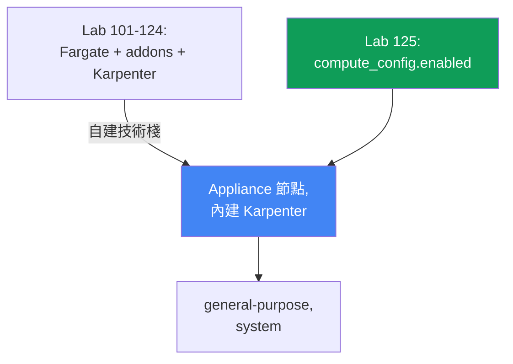
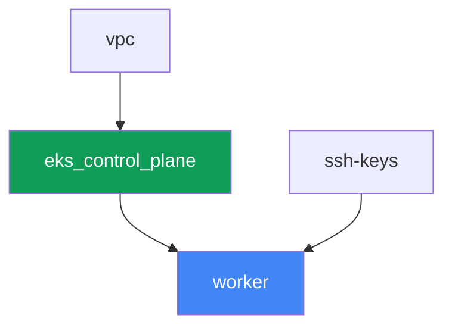

[Русская версия](README_RU.MD) · [Eng version](README.MD) · [Versión en español](README_ES.MD) · [Version française](README_FR.MD) · [Deutsche Version](README_DE.MD) · [ქართული ვერსია](README_GE.MD) · [日本語版](README_JP.MD)

# Lab 125 - EKS Auto Mode 對比自建技術棧

## 說明

在 101-124 這些 lab 中，叢集是由多個獨立部分拼裝而成的：control plane、給系統 pod 用的
Fargate、單獨安裝的 Karpenter 以及它的 NodePool。這個 lab 的叢集構建方式完全不同 - 啟用了
EKS Auto Mode，AWS 自己把節點當作 appliance 來管理：它選擇 AMI，啟用 enforcing 模式的
SELinux 和 read-only root，關閉 SSH 和 SSM，透過內建的 Karpenter 負責擴縮容，並維護內建的
pod 網路、DNS、EBS CSI 和 ELB 整合。這個 lab 完全不安裝 managed addon `vpc-cni`、
`kube-proxy`、`coredns` 和 `aws-ebs-csi-driver` - 它們是多餘的，因為 Auto Mode 自己就做了
同樣的事。你只會啟用內建的 NodePool `general-purpose`，確認第二個內建 NodePool `system`
在停用狀態下不會建立節點，嘗試編輯內建 NodePool 卻發現修改依然被接受，然後建立自己的
NodePool，並設定明確的 `limits` - 因為內建的 pool 沒有這些設定。

任務以生產風格撰寫：簡短描述加上驗收標準。驗證是自動的，透過 `check_result` 指令進行。

## 目標

鞏固本課程這一章的內容：

- [第 9 章。運算類型：managed node groups、self-managed、Fargate、Auto
  Mode](../../course/09/ru.md) - 何時啟用 EKS Auto Mode，何時自建技術棧

## 我們要建立什麼

叢集以程式碼形式部署，但沒有 Fargate profile，也沒有外部 Karpenter - control plane 一開始
就以 `compute_config.enabled = true` 建立，且只啟用一個內建 NodePool。

| 物件 | 是什麼 | 為何在這個 lab 中出現 |
|--------|---------|-------------------|
| `compute_config.enabled = true` | control plane 上的 Auto Mode 旗標 | 啟用 appliance 節點、內建 Karpenter、網路、DNS、EBS CSI、ELB |
| NodePool `general-purpose`（內建） | 唯一啟用的內建 NodePool | 工作負載的目標；C/M/R，僅 on-demand，generation 5+ |
| NodePool `system`（內建，已停用） | 第二個內建 NodePool | 保持停用 - 沒有它 `CriticalAddonsOnly` pod 就無法分配到節點 |
| Namespace `eks-125` | 給 lab 工作負載用的叢集區段 | 讓資源與系統資源分開 |
| Deployment `web`（2 個副本） | 部署在 `general-purpose` 上的 ping_pong 應用 | 確認 Auto Mode 真的會拉起並排程節點 |
| 產物 `nossh.txt` | 對 Auto Mode 節點的 SSH/SSM 嘗試 | 記錄已文件化的限制 - 沒有存取權限 |
| 自建 NodePool `custom-limited` | 帶有明確 `limits` 的 NodePool | 內建 pool 沒有 `limits`，自建的要自己設定 |

lab 101-124 的基礎架構與這個 lab 的差異：



## 基礎架構

環境透過 Terragrunt 部署在 AWS（`eu-central-1`）上。與 lab 101 的基礎架構不同，這裡在
worker 機器之前只有三個基礎架構元件：`vpc`、`ssh-keys` 和 `eks_control_plane`。元件
`eks_fargate_system`、`eks_addons`、`eks_karpenter`、`eks_karpenter_default_vng` 在這個
lab 中完全不存在 - Auto Mode 用服務自身的功能取代了這一切。

### 模組與依賴關係

| 目錄（元件） | 模組（`terraform/modules/`） | 依賴於 | 建立什麼 |
|---------------------|-------------------------------|------------|-------------|
| `vpc` | `vpc_v3` | - | VPC `10.10.0.0/16`，兩個 AZ 中的子網路，NAT |
| `ssh-keys` | `ssh-keys` | - | worker 機器用的 SSH 金鑰對（Auto Mode 節點不需要 keyname） |
| `eks_control_plane` | `eks_v2_control_plane` | `vpc` | EKS control plane `1.36`，`compute_config.enabled = true`，`node_pools = ["general-purpose"]` |
| `worker` | `eks_v2_work_pc` | `ssh-keys`、`vpc`、`eks_control_plane` | 帶有 kubectl、測試和 `check_result` 的 worker 機器 |

依賴關係圖（先套用的在箭頭方向更靠下）：



### `eks_v2_control_plane` 模組的變更

模組 `terraform/modules/eks_v2_control_plane` 在 `eks` 物件內新增了一個 **選填**
參數 `compute_config`（預設為 `null`）。這個變更是增量式的：課程中所有使用這個模組的其他
lab 傳入 `eks` 物件時都不帶這個欄位，並繼續正常運作 - `compute_config = null` 表示 upstream
模組 `terraform-aws-modules/eks/aws` 完全不會建立 `compute_config` 區塊，就跟這個 lab
之前一樣。在這個 lab 中，`eks_control_plane/terragrunt.hcl` 傳入
`compute_config = { enabled = true, node_pools = ["general-purpose"] }` - 這是與 lab 101
輸入的唯一差異。

worker 機器模組 `terraform/modules/eks_v2_work_pc` 新增了三項額外權限，全都是這個 lab
任務所需的：`ssm:GetConnectionStatus` 和 `ssm:DescribeInstanceInformation`（任務 4
要證明節點沒有連接 SSM）以及對 `*-eks-auto-*` 角色的 `iam:PassRole`，附帶條件
`iam:PassedToService: eks.amazonaws.com` - 沒有它，`aws eks update-cluster-config` 對
Auto Mode 的呼叫會回應 `AccessDeniedException`，學員將無法啟用第二個內建 pool，也無法還原
已刪除的 pool。這個變更是增量式的，不影響課程中的其他 lab。

這個 lab 沒有針對節點或 NodePool 的獨立 terraform 模組：內建 NodePool `general-purpose`
和 `system` 是 EKS Auto Mode 本身的一部分，而不是由 terraform 建立的資源。它們只能透過
control plane 上的 `computeConfig.nodePools`（見任務 1-2）或透過 `kubectl` 管理你自己的
NodePool（任務 5）。

### 各項設定在哪裡配置

`env.hcl`（共用環境參數）：

| 參數 | lab 中的值 | 影響什麼 |
|----------|-----------------|---------------|
| `region` | `eu-central-1` | 所有資源的區域 |
| `prefix` | `eks-task125` | 資源名稱和標籤的前綴 |
| `stack_name` | `eks125` | 用來組成 `env_name` - 叢集名稱 |
| `k8_version` | `1.36.0` | worker 機器上的 kubectl 版本 |

各元件 `terragrunt.hcl` 中的 `inputs`：

| 檔案 | 關鍵設定 |
|------|--------------------|
| `eks_control_plane/terragrunt.hcl` | `eks.compute_config.enabled = true`，`node_pools = ["general-purpose"]` |
| `worker/terragrunt.hcl` | 指向 lab 125 檔案的 `test_url`、`task_script_url`；不依賴任何 Karpenter 元件 |

## 部署

```bash
TASK=125 make run_eks_task
```

部署大約需要 15-20 分鐘。在輸出中找到 worker 機器 SSH 連線的那一行並連上去。那裡的
kubectl 已經設定好指向正確的叢集。

worker 機器上的實用指令：

```bash
time_left       # 環境剩餘多少時間
check_result    # 檢查解答
```

> 環境安全性。`env.hcl` 中啟用了 `ssh_password_enable = true` 和
> `access_cidrs = ["0.0.0.0/0"]` - 這對訓練環境很方便，但在生產環境中不能這樣做。依照
> 課程標準（第 0.2、2、19 章），worker 機器的存取應透過 AWS SSM Session Manager，不對外
> 公開 SSH 埠，`access_cidrs` 應限縮到特定位址。這裡保留公開 SSH 只是為了簡化 worker
> 機器的啟動 - 這不影響 Auto Mode 節點本身，它們完全沒有任何存取權限（任務 4）。

## 任務

---
|        **1**        | **確認模式：Auto Mode 已啟用**                  |
| :-----------------: | :------------------------------------------------------------ |
| 要做什麼          | 從 kubeconfig 確定叢集名稱（`kubectl config current-context \| awk -F/ '{print $NF}'`) - 這比 `list-clusters[0]` 更可靠，後者在有多個叢集的帳戶中會指向別人的叢集。執行 `aws eks describe-cluster --name <cluster> --query 'cluster.computeConfig'`，確認 `enabled: true`，且 `nodePools` 包含 `general-purpose`。執行 `kubectl get nodepools`，確認清單中有 `general-purpose`。把兩個輸出都存到 `/var/work/tests/artifacts/1/automode.txt`。 |
| 驗收標準    | - 檔案 `1/automode.txt` 不是空的，包含 `"enabled": true` 和 `general-purpose`。 |
---
|        **2**        | **第二個內建 NodePool 已停用**                       |
| :-----------------: | :------------------------------------------------------------ |
| 要做什麼          | 確認 `system` 不在啟用的 NodePool 之列：`kubectl get nodepools` 不應顯示 `system`（內建 NodePool 只有在 `computeConfig.nodePools` 中啟用時，才會以 Kubernetes 資源的形式出現）。在 `/var/work/tests/artifacts/2/twopools.txt` 中解釋，為什麼 `system` NodePool 在生產環境中很重要 - 它帶有 `CriticalAddonsOnly` taint，被 CoreDNS 這類系統元件容忍，能讓叢集的關鍵 pod 與一般工作負載分開。文字中必須包含 `system` 和 `CriticalAddonsOnly` 這兩個詞。 |
| 驗收標準    | - `kubectl get nodepools` 不包含 `system`；<br/>- 檔案 `2/twopools.txt` 不是空的，包含 `system` 和 `CriticalAddonsOnly`。 |
---
|        **3**        | **general-purpose 上的工作負載，以及內建 NodePool 的所有權** |
| :-----------------: | :------------------------------------------------------------ |
| 要做什麼          | 建立 namespace `eks-125` 和 Deployment `web`（image `viktoruj/ping_pong:latest`，`2` 個副本）。等到 Auto Mode 幫它們拉起節點，兩個 pod 都進入 `Running`。然後嘗試編輯內建 NodePool：`kubectl patch nodepool general-purpose --type merge -p '{"spec":{"limits":{"cpu":"100"}}}'`。這個修改會成功 - admission 層級沒有禁止它。查一下這個物件是誰的：檢查標籤 `app.kubernetes.io/managed-by` 和清單 `metadata.managedFields[*].manager`。把 patch 的輸出、兩項所有權檢查，以及為什麼這種修改不是受支援配置方式的說明，都放進 `/var/work/tests/artifacts/3/builtin.txt`。之後把 pool 還原成原始狀態：`kubectl patch nodepool general-purpose --type merge -p '{"spec":{"limits":null}}'`。 |
| 驗收標準    | - Deployment `web` 在 `eks-125` 中，`2` 個就緒副本，沒有一個 pod 在 Fargate 上；<br/>- 檔案 `3/builtin.txt` 不是空的，包含 `patched` 和物件的所有者（`managed-by` 或 `eks-auto-mode`）。 |
---
|        **4**        | **operator 對節點沒有存取權，但主機並未被隱藏**         |
| :-----------------: | :------------------------------------------------------------ |
| 要做什麼          | 確定 pod `web` 運行在哪個節點上（`kubectl get pods -n eks-125 -o wide`) - 在 Auto Mode 中，節點名稱本身就是 instance ID。收集三項事實並放進 `/var/work/tests/artifacts/4/nossh.txt`：（1）這個 instance 沒有 key pair - `aws ec2 describe-instances --instance-ids <node> --query 'Reservations[0].Instances[0].KeyName'` 會回傳 `null`，也就是說用金鑰進行 SSH 原則上不可能；（2）SSM 沒有連線 - `aws ssm get-connection-status --target <node>` 會回傳 `notconnected`，且 `aws ssm describe-instance-information` 不會顯示這個節點；（3）與此同時主機並沒有跟叢集隔離：在 `eks-125` 中執行一個帶有 `securityContext.privileged: true` 且把 `/` 掛載到 `/host` 的 `hostPath` 的 pod，讀取 `/host/etc/os-release` - 你會看到 `NAME=Bottlerocket`。加上結論：Auto Mode 關閉了 operator 的門（SSH、SSM），但沒有關閉 cluster-admin 的門 - 那由 Pod Security Admission 和政策負責（第 19 和 22 章）。檢查完後把這個 pod 移除。 |
| 驗收標準    | - 檔案 `4/nossh.txt` 不是空的，且包含全部三項證據：`KeyName`、`notconnected` 和 `Bottlerocket`。 |
---
|        **5**        | **帶有明確 limits 的自建 NodePool**                              |
| :-----------------: | :------------------------------------------------------------ |
| 要做什麼          | 內建 NodePool 沒有 `limits` - 在工作負載無限增長的情況下，這是失控成本的風險。建立你自己的
NodePool `custom-limited`，使用指向內建 `NodeClass` `default` 的 `nodeClassRef`
（`group: eks.amazonaws.com`、`kind: NodeClass`、`name: default`），`requirements` 指定
`c`、`m`、`r` 這些 instance 類別，並附上明確的 `limits` 區塊（`cpu: "10"`，
`memory: 10Gi`）。套用這份 manifest，等待 `kubectl get nodepool custom-limited` 顯示
`Ready` 狀態。 |
| 驗收標準    | - NodePool `custom-limited` 存在，`spec.limits.cpu` 等於 `"10"`；<br/>- `spec.template.spec.nodeClassRef.name` 等於 `default`。 |
---

### Auto Mode 的界線究竟在哪裡

上面這兩個任務是特意設計的，讓你看到的是事實而不是口號。即使在文件的轉述中，這兩點也常常
表達得不精確，所以要親自動手驗證。

**「內建 pool 不能編輯」是一種契約，不是 admission 層級的禁令。** AWS 文件對內建
NodePool 的說法是「can be enabled or disabled but not modified」，很容易讓人以為 API
會拒絕修改。實際上它會接受：`kubectl patch` 回傳
`nodepool.karpenter.sh/general-purpose patched`，值也留在物件裡。真正的界線在別處：這個
物件屬於服務，帶有標籤 `app.kubernetes.io/managed-by: eks`，欄位的所有者是
`eks-auto-mode`。一旦 pool 的名稱在 `computeConfig.nodePools` 中發生變化，資源就會連同
節點一起被刪除，等名稱再回來時會從頭重建 - 你的修改都不會保留。已在測試台上驗證過：停用
再重新啟用這個 pool 之後，`spec.limits` 變回空的，儘管之前設定過 `cpu: 100`。

> **不要透過 kubectl 刪除內建 NodePool。** `kubectl delete nodepool
> general-purpose` 會成功，pool 的節點會被 drain 並終止，但 EKS 本身**不會**重新建立
> 這個物件 - 已驗證，五分鐘後 pool 沒有回來，叢集因此沒有任何運算資源。復原只能透過修改
> `computeConfig`：移除再加回 pool 名稱（呼叫時必須同時傳入 `--compute-config`、
> `--storage-config` 和 `--kubernetes-network-config`，否則 EKS 會回應
> `The type for cluster update was not provided`，而它不接受空的 `nodePools` 清單搭配
> `nodeRoleArn`）。

**「節點無法存取」只在 operator 存取這個意義上是對的。** SSH 是不可能的：這個 instance
沒有 key pair（`KeyName` 是空的），image 是 Bottlerocket，沒有 shell 也沒有套件管理器。
SSM 沒有連線：`get-connection-status` 回應 `notconnected`，這個節點不在
`describe-instance-information` 的清單裡。但一個帶有 `hostPath` 掛載 `/` 的特權 pod
可以輕鬆讀取主機的檔案系統，並顯示 `NAME=Bottlerocket` 以及 `/bin` 的內容（裡面有
`apiclient`、`aws-network-policy-agent`）。對生產環境的結論是：Auto Mode 把節點維護的
負擔從你身上拿走，也拿走了互動式存取，但它不會取代對叢集中誰能執行特權 pod 的控制 -
這仍然是你的職責（第 19 和 22 章）。

還有一個實務細節：這個 lab 故意不用 `aws ssm start-session` 作為證據。worker 機器沒有
`ssm:StartSession` 權限，所以這個指令會回傳 `AccessDeniedException` - 這說明的是 worker
的政策，不是節點的狀態。讀取權限（`ssm:GetConnectionStatus`、
`ssm:DescribeInstanceInformation`）之所以被加進 worker 機器模組，正是因為它們能回答這個
任務的問題。

## 檢查結果

在 worker 機器上執行自動檢查：

```bash
check_result
```

腳本會跑一遍測試，並顯示已完成任務的百分比。

## 解答

參考解答：[worker/files/solutions/1_TW.MD](worker/files/solutions/1_TW.MD)

## 刪除叢集與資源

> **先移除工作負載，等節點消失後，再拆除環境。** Auto Mode 節點是普通的 EC2 instance，
> 帶有來自 pod 網路的次要 ENI。如果在工作負載還在運行時就刪除叢集，ENI 可能停留在
> `available` 狀態並卡住 security group，導致 `destroy` 在刪除這個 SG 上卡住幾十分鐘。
> 這個 lab 不會手動建立任何 AWS 資源，其他一切都是 Kubernetes 物件。

```bash
# 1. 移除工作負載和檢查用的 pod（如果它還存在）
kubectl delete namespace eks-125 --ignore-not-found

# 2. 移除任務 5 建立的自建 NodePool（不要動內建的 general-purpose）
kubectl delete nodepool custom-limited --ignore-not-found

# 3. 等到 Auto Mode 移除節點：清單應該變成空的
while kubectl get nodes --no-headers 2>/dev/null | grep -q .; do
  echo "節點還在，等待中..."; sleep 15
done
```

只有做完這些之後，才能拆除環境：

```bash
TASK=125 make delete_eks_task
```

如果 `destroy` 卡在 security group 上，找出孤兒 ENI 並刪除它：

```bash
aws ec2 describe-network-interfaces --filters Name=status,Values=available \
  --query 'NetworkInterfaces[].[NetworkInterfaceId,Description]' --output table
aws ec2 delete-network-interface --network-interface-id <eni-id>
```

還有一種特殊情況 - 如果在實驗過程中，內建 NodePool 是透過
`kubectl delete nodepool general-purpose` 被刪除的。EKS 本身不會把它復原，叢集會一直
沒有運算資源。復原的方式是透過 `computeConfig`，用兩次呼叫：先改變 pool 清單（例如加入
`system`），然後只保留 `general-purpose`。角色名稱來自 `describe-cluster`：

```bash
CLUSTER=$(kubectl config current-context | awk -F/ '{print $NF}')
ROLE=$(aws eks describe-cluster --name "$CLUSTER" \
  --query 'cluster.computeConfig.nodeRoleArn' --output text)

aws eks update-cluster-config --name "$CLUSTER" \
  --compute-config "{\"enabled\":true,\"nodePools\":[\"system\",\"general-purpose\"],\"nodeRoleArn\":\"$ROLE\"}" \
  --storage-config '{"blockStorage":{"enabled":true}}' \
  --kubernetes-network-config '{"elasticLoadBalancing":{"enabled":true}}'
# 等待 cluster.status = ACTIVE，然後只保留 general-purpose
```
