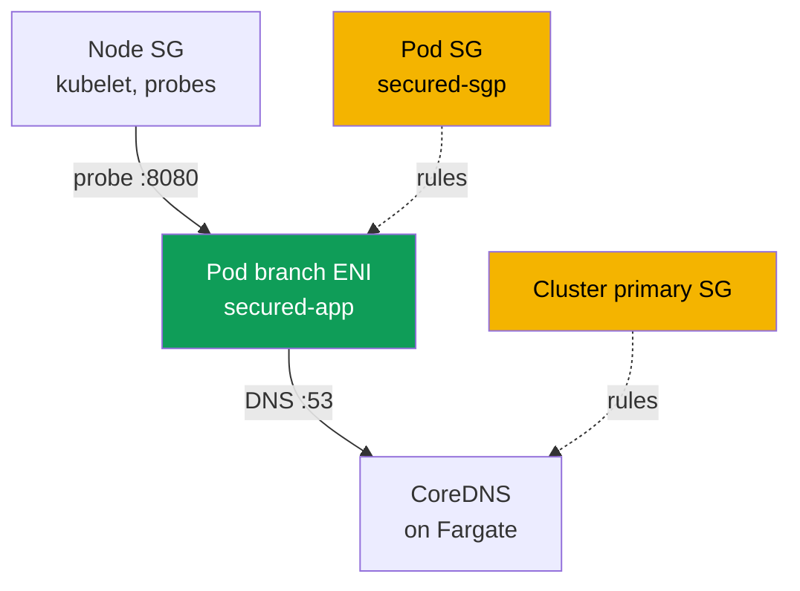
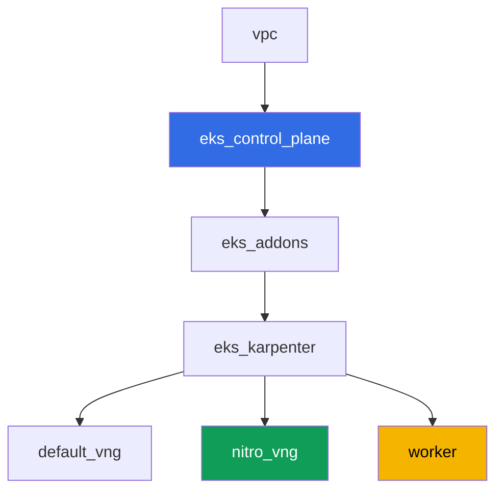

[Русская версия](README_RU.MD) · [Versión en español](README_ES.MD) · [Version française](README_FR.MD) · [Deutsche Version](README_DE.MD) · [ქართული ვერსია](README_GE.MD) · [繁體中文版](README_TW.MD) · [日本語版](README_JP.MD)

# Lab 126 - Security groups for pods: branch ENI, pod Running but not Ready

## Description

Normally a pod on an EC2 node inherits the node's security group rules. Security groups
for pods change this model: the pod gets its own branch ENI and its own set of security
groups, and the node's rules no longer apply to it. In this lab you enable this feature,
catch its typical symptom - a pod `Running` but never `Ready`, with DNS not resolving -
and find exactly the rules that are missing: an inbound rule for kubelet probes and
outbound/inbound DNS on port 53. Separately, you nail down a trap where this symptom
flickers depending on where CoreDNS physically ended up.

Tasks are written in a production style: a short statement plus acceptance criteria.
Checking is automatic, via the `check_result` command, and part of the steps with AWS CLI
are run from your local machine (with the same account you used to deploy the lab) -
details are in the "Infrastructure" section.

## Goal

Reinforce the material from this course chapter:

- [Chapter 46. Network failures](../../course/46/en.md) - security group as a layer of
  network failure

## What we're creating

The cluster is deployed as code (the base, same as in lab 101), with an additional
NodePool restricted to Nitro instances and security groups for pods enabled on the VPC
CNI. You add a namespace, your own security group for pods, and an application that runs
into it.

| Object | What it is | Why it's in this lab |
|--------|---------|-------------------|
| NodePool `nitro` | Karpenter NodePool without the `t` family | security groups for pods only work on Nitro instances |
| Addon `vpc-cni` with `ENABLE_POD_ENI=true` | managed addon configuration | turns on the trunk interface on nodes |
| Namespace `eks-126` | a cluster section for the lab's workload | keeps resources separate from system ones |
| Security group for pods | created manually, initially incomplete | source of the `Running` but not `Ready` symptom |
| `SecurityGroupPolicy` `secured-sgp` | binds the SG to pods with `app: secured` | the branch ENI mechanism itself |
| Deployment `secured-app` | an application with a readiness probe | demonstrates the symptom and its fix |
| Artifacts in `/var/work/tests/artifacts/` | `describe` snapshots, DNS checks, explanations | records each diagnostic step |



## Infrastructure

The environment is deployed in AWS (`eu-central-1`) via Terragrunt. Each lab directory is
one component with its own `terragrunt.hcl`, which references a shared module in
`terraform/modules/` and declares dependencies through `dependency` blocks.

### Modules and dependencies

| Directory (component) | Module (`terraform/modules/`) | Depends on | What it creates |
|---------------------|-------------------------------|------------|-------------|
| `vpc` | `vpc_v3` | - | VPC `10.10.0.0/16`, public and private subnets in two AZs, NAT |
| `ssh-keys` | `ssh-keys` | - | an SSH key pair for the worker machine and nodes |
| `eks_control_plane` | `eks_v2_control_plane` | `vpc` | EKS control plane `1.36`, OIDC, security groups |
| `eks_fargate_system` | `eks_v2_fargate` | `vpc`, `eks_control_plane` | Fargate profile for `kube-system` and `karpenter` (CoreDNS runs here) |
| `eks_addons` | `eks_v2_addons` | `eks_control_plane`, `eks_fargate_system` | coredns, kube-proxy, pod-identity, `vpc-cni` with `ENABLE_POD_ENI=true` |
| `eks_karpenter` | `eks_v2_karpenter` | `vpc`, `eks_control_plane`, `eks_addons`, `eks_fargate_system` | Karpenter controller, node IAM role |
| `eks_karpenter_default_vng` | `eks_v2_karpenter_vng` | `vpc`, `eks_control_plane`, `eks_karpenter` | the default NodePool `default` (with the `t` family) |
| `eks_karpenter_nitro_vng` | `eks_v2_karpenter_vng` | `vpc`, `eks_control_plane`, `eks_karpenter` | NodePool `nitro`, categories `c`/`m`/`r`, generation `>4`, no taint |
| `worker` | `eks_v2_work_pc` | `ssh-keys`, `vpc`, `eks_control_plane`, `eks_karpenter` | worker machine with kubectl, tests, and `check_result` |

Dependency graph (what gets applied earlier is lower down the arrow):



### Why a separate NodePool is needed

Security groups for pods only work on Nitro instances - the `t` family isn't supported
(verified against AWS documentation). The lab's default NodePool allows the `t` family
(same as in lab 101), so a second NodePool `nitro` was added for this lab:
`karpenter.k8s.aws/instance-category In ["c","m","r"]` (this already excludes `t`, since
the category is separate) plus `instance-generation Gt "4"` as an extra guarantee.
`nitro` has no taint - the Deployment `secured-app` lands there without a toleration,
via `nodeSelector: work_type: nitro`.

### What's already included in the infrastructure, and what needs to be done by hand

The lab's Terraform already covers part of the prerequisites from AWS documentation:

- `ENABLE_POD_ENI=true` in the `configuration` of the `vpc-cni` addon
  (`eks_addons/terragrunt.hcl`) - this creates a trunk interface on nodes, described as
  `aws-k8s-trunk-eni`.
- `POD_SECURITY_GROUP_ENFORCING_MODE=strict` (the default value) plus
  `init.env.DISABLE_TCP_EARLY_DEMUX=true`. This pair was chosen deliberately - the
  reasoning is below.
- NodePool `nitro` without the `t` family is created by a separate component.

The mode deserves a separate word, because whether the lab's symptom reproduces at all
depends on it. The feature has two modes, and the documentation describes the difference
this way: in `standard` mode, the pod's security group rules **do not apply** to traffic
between the pod and services on the same node, including `kubelet`. That means the
readiness probe would pass even through a security group with not a single inbound rule,
and the "`Running`, but not `Ready`" symptom can't be obtained (verified on the test
bench: the pod immediately became `1/1`). That's why the lab runs in `strict` mode, where
the probe goes through the pod's branch ENI and is subject to the pod SG's rules. The cost
of this is a mandatory `DISABLE_TCP_EARLY_DEMUX=true` on the `aws-node` init container:
without it, `kubelet` can't open a TCP connection to a pod on a branch ENI at all, and
adding the rule from task 5 wouldn't fix anything. In `standard` mode this flag isn't
needed - but the whole point of the lab goes away with it.

The managed policy `AmazonEKSVPCResourceController` on the IAM role of the **control
plane** (not the node role - see task 2) is, by default, **not attached** by the module
`terraform-aws-modules/eks/aws` v21 (it only attaches `AmazonEKSClusterPolicy`). This
version of the `eks_v2_control_plane` module has no input for additional cluster
policies, and it's not the kind of input that can be safely added just for one lab - so
attaching the policy is done by hand, with `aws iam attach-role-policy`, as part of
task 2, rather than through terraform.

All tasks are performed on the worker machine over SSH, same as in the rest of the
course's labs. For this, permissions that weren't there before were added to the
`eks_v2_work_pc` module: `ec2:CreateSecurityGroup`, `ec2:DeleteSecurityGroup`,
`ec2:AuthorizeSecurityGroupEgress`, `ec2:RevokeSecurityGroupEgress` (the module already
had inbound rule permissions), `iam:ListAttachedRolePolicies` and a narrowly scoped
`iam:AttachRolePolicy` - only for roles `*-cluster-*` and only with the policy
`AmazonEKSVPCResourceController` in the `iam:PolicyARN` condition. Without the last item,
task 2 would be impossible, and its automated check would fail regardless of the
student's actions: the test reads `aws iam list-attached-role-policies` from the worker
machine, and it didn't have permission for that call.

## Deployment

```bash
TASK=126 make run_eks_task
```

Deployment takes roughly 15-20 minutes. In the output, find the line with the SSH
connection to the worker machine and connect to it. kubectl there is already configured
for the right cluster.

Useful commands on the worker machine:

```bash
time_left       # how much environment time is left
check_result    # check the solution
```

> Environment security. `env.hcl` has `ssh_password_enable = true` and
> `access_cidrs = ["0.0.0.0/0"]` enabled - convenient for a training environment, but this
> is not something to do in production. Per the course standards, access to worker
> machines should go through AWS SSM Session Manager without exposing public SSH ports,
> and `access_cidrs` should be narrowed down to specific addresses. Here public SSH is
> left in place only to keep the setup simple.

## Tasks

---
|        **1**        | **Namespace for the lab's workload**                              |
| :-----------------: | :---------------------------------------------------------- |
| What to do          | Create the namespace `eks-126`. All objects in the lab are created inside it. |
| Acceptance criteria    | - namespace `eks-126` exists. |
---
|        **2**        | **Checking the prerequisites for security groups for pods**           |
| :-----------------: | :---------------------------------------------------------- |
| What to do          | Check both prerequisites from AWS documentation. First, find the name of the control plane IAM role (`aws eks describe-cluster --name <cluster> --query cluster.roleArn`) and use `aws iam list-attached-role-policies --role-name <role>` to see whether `AmazonEKSVPCResourceController` is attached to it; by default it isn't there - attach it with `aws iam attach-role-policy`. The policy goes on the control plane role, not the node role: branch ENIs are created and deleted by a controller on the EKS side. Second, run `kubectl describe daemonset aws-node -n kube-system \| grep -E 'ENABLE_POD_ENI\|POD_SECURITY_GROUP_ENFORCING_MODE\|DISABLE_TCP_EARLY_DEMUX'` - these three values are already set by the lab's terraform configuration, figure out why each one is needed (see the "Infrastructure" section). Get the cluster name from kubeconfig: `kubectl config current-context \| awk -F/ '{print $NF}'`. Save both confirmations to the file `/var/work/tests/artifacts/2/prereqs.txt`. |
| Acceptance criteria    | - the file is not empty, contains `AmazonEKSVPCResourceController` and `ENABLE_POD_ENI`;<br/>- the policy is actually attached to the control plane role (verified by the autotest via `aws iam list-attached-role-policies`). |
---
|        **3**        | **An incomplete security group and SecurityGroupPolicy**            |
| :-----------------: | :---------------------------------------------------------- |
| What to do          | Create a security group in the lab's VPC (`aws ec2 create-security-group`) and do NOT add a single rule to it: a fresh SG only has the AWS-default allow-all egress and zero inbound rules - that's exactly the state that produces the symptom. Do NOT tag it with `karpenter.sh/discovery=<cluster name>` (otherwise it would end up selected by the EC2NodeClass as a node SG - for this lab you need a separate SG just for pods). In `eks-126`, create a `SecurityGroupPolicy` `secured-sgp` with `podSelector.matchLabels.app: secured`, referencing this SG. Save its ID to the file `/var/work/tests/artifacts/3/sg_id.txt`. |
| Acceptance criteria    | - `SecurityGroupPolicy` `secured-sgp` in `eks-126` exists and references the SG from the file;<br/>- the file `3/sg_id.txt` is not empty and contains `sg-`. |
---
|        **4**        | **The symptom: Running, but never Ready**                    |
| :-----------------: | :---------------------------------------------------------- |
| What to do          | In `eks-126`, create a Deployment `secured-app` (image `viktoruj/ping_pong:latest`, `1` replica, `containerPort` and `readinessProbe.httpGet` on port `8080`), with the label `app: secured` and `nodeSelector` `work_type: nitro` (no toleration needed - the `nitro` NodePool has no taint). The pod will start and land on a branch ENI with your SG, but `kubelet` probes never reach it - the pod hangs at `0/1 Ready` with an event like `Readiness probe failed: Get "http://<pod ip>:8080/": context deadline exceeded`. Along the way, confirm that the pod really is on a branch ENI: it has the annotation `vpc.amazonaws.com/pod-eni` and the limit `vpc.amazonaws.com/pod-eni: 1`, and `aws ec2 describe-network-interfaces --filters Name=group-id,Values=<your SG>` shows an interface with `InterfaceType: branch`. Save `kubectl describe pod` (the full output, including `Events`) to the file `/var/work/tests/artifacts/4/pod_not_ready.txt`. |
| Acceptance criteria    | - Deployment `secured-app` exists, image `viktoruj/ping_pong`, label `app: secured`;<br/>- the file `4/pod_not_ready.txt` is not empty and contains `Readiness probe failed` or `Unhealthy` (the symptom is fixed in task 5, so by the time `check_result` runs the pod may already be `Ready`). |
---
|        **5**        | **Fixing the probes: an inbound rule from the node SG**                 |
| :-----------------: | :---------------------------------------------------------- |
| What to do          | Find the Karpenter node security group: take the `providerID` of the node where `secured-app` is running, and look up `aws ec2 describe-instances --instance-ids <id> --query 'Reservations[0].Instances[0].SecurityGroups'`. Add an inbound rule to the pod's SG for TCP `8080` with `--source-group <node SG>`. The probe passes on the very next cycle, and the pod becomes `1/1 Ready` within a few seconds. Save the resulting `kubectl get pod -n eks-126 -l app=secured` to the file `/var/work/tests/artifacts/5/pod_ready.txt`. |
| Acceptance criteria    | - `readyReplicas` of the Deployment `secured-app` equals `1`;<br/>- the file `5/pod_ready.txt` is not empty and contains `1/1`. |
---
|        **6**        | **Diagnosing and fixing DNS: egress and the reverse ingress**    |
| :-----------------: | :---------------------------------------------------------- |
| What to do          | The `viktoruj/ping_pong` image has neither a shell nor `wget` (`kubectl exec` returns `executable file not found`), so to check DNS run a separate `busybox` pod in `eks-126` with the label `app: secured` and `nodeSelector: work_type: nitro` - the label matters, otherwise `secured-sgp` won't apply to it and the check would be pointless. Run `nslookup kubernetes.default.svc.cluster.local` in it and get `connection timed out; no servers could be reached`. Now find exactly where the packet is lost: your SG has a default allow-all egress, so the request leaves fine, but the security group on the receiving side has no rule for it at all. CoreDNS in this lab runs on Fargate and sits behind the **cluster primary security group** (`aws eks describe-cluster --query cluster.resourcesVpcConfig.clusterSecurityGroupId`). Add an inbound `53` TCP and `53` UDP to it with `--source-group <pod SG>` and repeat `nslookup` - resolution will work. Then take a second step, following least privilege: remove the default allow-all egress from the pod's SG and add an explicit egress `53` TCP and UDP to the cluster primary SG instead - DNS keeps working. Save both states and an explanation of which side needs which rule to the file `/var/work/tests/artifacts/6/dns_fix.txt`. |
| Acceptance criteria    | - the file `6/dns_fix.txt` is not empty, contains `53` and an explanation that the rule is needed on the inbound side of the receiving party (`inbound` or `ingress`);<br/>- a pod with the label `app: secured` resolves `kubernetes.default.svc.cluster.local` (confirmed by the artifact). |
---
|        **7**        | **One node, different security groups: what actually happens** |
| :-----------------: | :---------------------------------------------------------- |
| What to do          | Test in practice whether SG rules work between two pods with DIFFERENT security groups on the same node. Create a second security group (for example `eks-task126-other-pod-sg`), a second `SecurityGroupPolicy` `other-sgp` for the label `app: other`, and run a `busybox` pod with that label, pinning it via `nodeName` to the SAME node where `secured-app` runs. From it, reach the IP of the `secured-app` pod on port `8080` (`wget -T 10 -qO- http://<ip>:8080/`). Do this twice: first without an allowing rule - you'll get `download timed out`, then add an inbound `8080` to the SG of `secured-app` with `--source-group <second SG>` and repeat - the request will succeed. The conclusion to record in the artifact: in `strict` mode the pod's SG rules apply even within a single node, so this is fixed with a rule. And separately, note the contrast with `standard` mode: there, per AWS documentation, SG rules do NOT apply to traffic between pods and services on the same node, and pods with different SGs on the same node don't communicate at all - and a rule can't fix that. Save both runs, the `kubectl get pod -o wide` output for both pods, and the explanation to the file `/var/work/tests/artifacts/7/same_node_trap.txt`. |
| Acceptance criteria    | - the file `7/same_node_trap.txt` is not empty;<br/>- contains the node name of `secured-app`, the state before the fix (`timed out`), and an explanation of the difference between the `strict` and `standard` modes. |
---

### Three takeaways worth keeping

Everything below has been verified on a live test bench and contradicts common retellings
of this topic.

**The symptom depends on the mode, not on how careful the rules are.** In `strict`, the
`kubelet` probe goes through the branch ENI and is subject to the pod's SG rules - hence
`Readiness probe failed: context deadline exceeded` and a fix with a single inbound rule.
In `standard`, the same pod with the same empty security group becomes `Ready`
immediately: rules don't apply to traffic within the node. Before looking for a mistake
in the rules, check `POD_SECURITY_GROUP_ENFORCING_MODE` on `aws-node`.

**The pod's egress is almost never at fault.** A fresh security group has a default
allow-all egress, so the request leaves fine. DNS breaks on the other side: the cluster
primary security group, behind which CoreDNS lives, has no inbound rule for the pod's SG.
The rule is needed exactly there, and one is enough - a security group is stateful, the
reply to an allowed request goes back without a separate rule. Allowing the pod all
outbound traffic isn't required for this: after narrowing egress down to `53`, DNS keeps
working (task 6, second step).

**A shared node doesn't get in the way, as long as the mode is `strict`.** The documented
restriction about pods with different security groups on the same node applies to
`standard` mode. In `strict`, two such pods first fail to connect and then connect after
the rule is added - meaning the rule decides the outcome, not the topology. It's still
worth knowing about the restriction: in `standard`, the same situation can't be fixed with
a rule, and that changes the diagnostic plan.

## Checking the result

On the worker machine, run the automatic check:

```bash
check_result
```

The script will run the tests and show the percentage of completed tasks. Part of the
checks look at the AWS API, not just Kubernetes objects: whether the policy is attached
to the cluster role, whether the security group from the `SecurityGroupPolicy` exists. A
separate check spins up its own pod with the label `app: secured` and requires DNS to
actually resolve in it - the artifact alone isn't enough for that.

## Solution

Reference solution: [worker/files/solutions/1.MD](worker/files/solutions/1.MD)

## Deleting the cluster and resources

> **Cleanup order matters here, otherwise `destroy` won't finish.** In this lab you
> manually created the security group `eks-task126-secured-pod-sg` directly in the
> stand's VPC (it's not in terraform state), added rules to the **cluster primary
> security group**, which terraform owns, and enabled security groups for pods - meaning
> **branch ENIs** were created for the pods. Each of these three points on its own blocks
> deletion: an outside security group won't let the VPC be deleted, a reference from one
> SG to another won't let the target one be deleted, and a live branch ENI holds onto
> both the SG and the subnet. The symptom is `Still destroying...` on a security group,
> the VPC, or the Internet Gateway.

```bash
# 1. Remove the workload from the SecurityGroupPolicy, so branch ENIs get released
kubectl delete namespace eks-126 --ignore-not-found

# 2. Wait until the branch ENIs disappear and Karpenter removes its EC2 nodes
SG_ID=$(aws ec2 describe-security-groups \
  --filters "Name=group-name,Values=eks-task126-secured-pod-sg" \
  --query 'SecurityGroups[0].GroupId' --output text)
while [ "$(aws ec2 describe-network-interfaces --filters "Name=group-id,Values=${SG_ID}" \
    --query 'length(NetworkInterfaces)' --output text)" != "0" ]; do
  echo "branch ENIs still alive, waiting..."; sleep 15
done
while kubectl get nodes --no-headers 2>/dev/null | grep -qv fargate; do
  echo "Karpenter EC2 node still alive, waiting..."; sleep 15
done

# 3. Remove the rules you added to the cluster primary SG that reference your SG
CLUSTER=$(kubectl config current-context | awk -F/ '{print $NF}')
CLUSTER_PRIMARY_SG=$(aws eks describe-cluster --name "$CLUSTER" \
  --query 'cluster.resourcesVpcConfig.clusterSecurityGroupId' --output text)
aws ec2 revoke-security-group-ingress --group-id "$CLUSTER_PRIMARY_SG" \
  --protocol tcp --port 53 --source-group "$SG_ID"
aws ec2 revoke-security-group-ingress --group-id "$CLUSTER_PRIMARY_SG" \
  --protocol udp --port 53 --source-group "$SG_ID"

# 4. Delete both of your own security groups. Order matters: first drop the reference
#    from the first SG to the second, otherwise the second one won't delete
SG2_ID=$(aws ec2 describe-security-groups \
  --filters "Name=group-name,Values=eks-task126-other-pod-sg" \
  --query 'SecurityGroups[0].GroupId' --output text)
aws ec2 revoke-security-group-ingress --group-id "$SG_ID" \
  --protocol tcp --port 8080 --source-group "$SG2_ID"
aws ec2 delete-security-group --group-id "$SG2_ID"
aws ec2 delete-security-group --group-id "$SG_ID"
```

You don't need to manually detach the `AmazonEKSVPCResourceController` policy that you
attached to the control plane role in task 2: the upstream module creates this role with
`force_detach_policies = true` (verified in the module's source), so terraform will
detach it itself and role deletion won't run into a `DeleteConflict`.

```bash
TASK=126 make delete_eks_task
```

If `destroy` still gets stuck somewhere, look for the holder using the same approach: who
is using the SG, which SGs reference it in their rules, and whether there are any orphaned
ENIs (including `branch` ones from security groups for pods and secondary ones from VPC
CNI):

```bash
aws ec2 describe-network-interfaces --filters "Name=group-id,Values=<sg-id>" \
  --query 'NetworkInterfaces[].[NetworkInterfaceId,Status,InterfaceType,Description]' --output table
aws ec2 describe-security-groups --filters "Name=ip-permission.group-id,Values=<sg-id>" \
  --query 'SecurityGroups[].[GroupId,GroupName]' --output table
aws ec2 describe-network-interfaces --filters Name=status,Values=available \
  --query 'NetworkInterfaces[].[NetworkInterfaceId,Description,Groups[0].GroupName]' --output table
```
