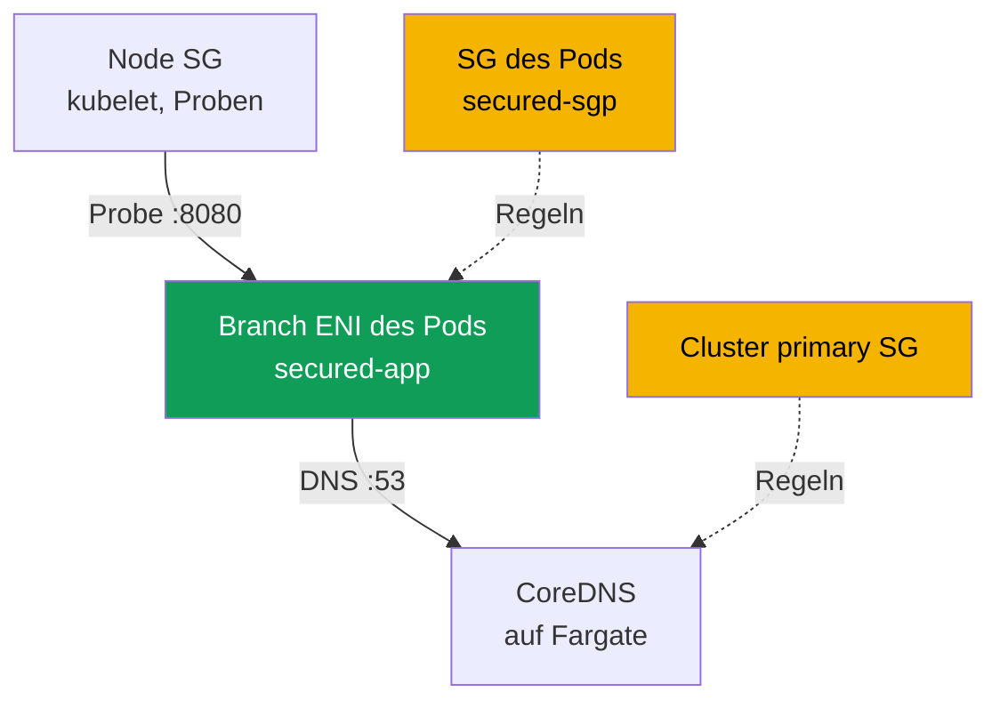
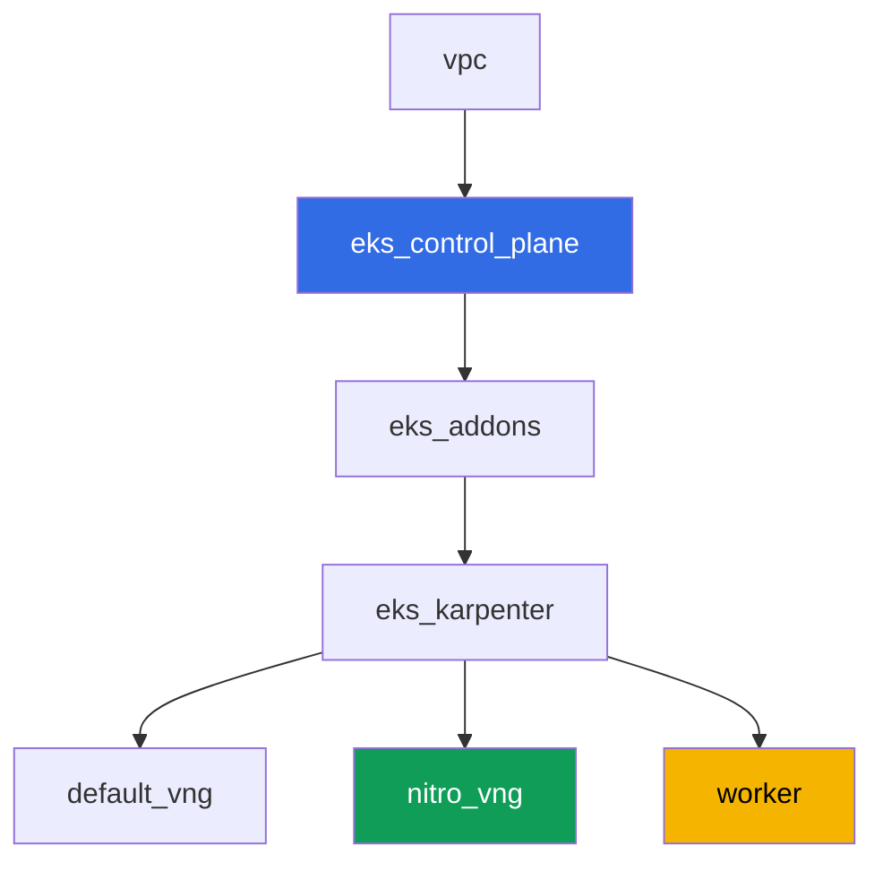

[Русская версия](README_RU.MD) · [Eng version](README.MD) · [Versión en español](README_ES.MD) · [Version française](README_FR.MD) · [ქართული ვერსია](README_GE.MD) · [繁體中文版](README_TW.MD) · [日本語版](README_JP.MD)

# Lab 126 - Security groups for pods: branch ENI, Pod Running, aber nicht Ready

## Beschreibung

Normalerweise erbt ein Pod auf einer EC2-Node die security group Regeln der Node. Security groups
for pods ändern dieses Modell: der Pod bekommt seine eigene branch ENI und seinen eigenen Satz an
security group, und die Regeln der Node gelten für ihn nicht mehr. In dieser Lab aktivieren Sie
diese Funktion, fangen ihr typisches Symptom ein - ein Pod `Running`, aber niemals `Ready` - und
DNS löst nicht auf - und finden genau die Regeln, die fehlen: ein inbound für die kubelet-Proben
und ausgehendes/eingehendes DNS auf Port 53. Separat halten Sie eine Falle fest, wegen der dieses
Symptom je nachdem, wo CoreDNS physisch gelandet ist, flackert.

Die Aufgaben sind im Produktionsstil geschrieben: eine kurze Aufgabenstellung plus
Abnahmekriterien. Die Kontrolle erfolgt automatisch über den Befehl `check_result`, und ein Teil
der Schritte mit AWS CLI wird von Ihrer lokalen Maschine ausgeführt (mit demselben Account, mit
dem Sie die Lab bereitgestellt haben) - Details dazu im Abschnitt "Infrastruktur".

## Ziel

Den Stoff des Kurskapitels festigen:

- [Kapitel 46. Netzwerkausfälle](../../course/46/ru.md) - security group als Schicht eines
  Netzwerkausfalls

## Was wir erstellen

Der Cluster ist als Code bereitgestellt (Basis wie in Lab 101), mit einem zusätzlichen NodePool
nur auf Nitro-Instanzen und aktivierter Unterstützung für security groups for pods im VPC CNI. Sie
fügen einen Namespace, eine eigene security group für Pods und eine Anwendung hinzu, die daran
stößt.

| Objekt | Was das ist | Warum in dieser Lab |
|--------|---------|-------------------|
| NodePool `nitro` | Karpenter NodePool ohne die Familie `t` | security groups for pods funktionieren nur auf Nitro-Instanzen |
| Addon `vpc-cni` mit `ENABLE_POD_ENI=true` | Konfiguration des managed addon | aktiviert das trunk interface auf den Nodes |
| Namespace `eks-126` | Bereich des Clusters für die Last der Lab | hält Ressourcen von Systemressourcen getrennt |
| Security group für Pods | manuell erstellt, anfangs unvollständig | Quelle des Symptoms `Running`, aber nicht `Ready` |
| `SecurityGroupPolicy` `secured-sgp` | bindet die SG an Pods mit `app: secured` | der branch ENI Mechanismus selbst |
| Deployment `secured-app` | Anwendung mit einer readiness-Probe | zeigt das Symptom und dessen Behebung |
| Artefakte in `/var/work/tests/artifacts/` | Snapshots von `describe`, DNS-Checks, Erklärungen | halten jeden Diagnoseschritt fest |



## Infrastruktur

Die Umgebung wird in AWS (`eu-central-1`) über Terragrunt bereitgestellt. Jedes Lab-Verzeichnis
ist eine Komponente mit eigener `terragrunt.hcl`, die auf ein gemeinsames Modul in
`terraform/modules/` verweist und Abhängigkeiten über `dependency`-Blöcke deklariert.

### Module und Abhängigkeiten

| Verzeichnis (Komponente) | Modul (`terraform/modules/`) | Abhängig von | Was es erstellt |
|---------------------|-------------------------------|------------|-------------|
| `vpc` | `vpc_v3` | - | VPC `10.10.0.0/16`, öffentliche und private Subnetze in zwei AZs, NAT |
| `ssh-keys` | `ssh-keys` | - | ein SSH-Schlüsselpaar für die Arbeitsmaschine und die Nodes |
| `eks_control_plane` | `eks_v2_control_plane` | `vpc` | EKS control plane `1.36`, OIDC, security groups |
| `eks_fargate_system` | `eks_v2_fargate` | `vpc`, `eks_control_plane` | Fargate-Profil für `kube-system` und `karpenter` (hier läuft CoreDNS) |
| `eks_addons` | `eks_v2_addons` | `eks_control_plane`, `eks_fargate_system` | coredns, kube-proxy, pod-identity, `vpc-cni` mit `ENABLE_POD_ENI=true` |
| `eks_karpenter` | `eks_v2_karpenter` | `vpc`, `eks_control_plane`, `eks_addons`, `eks_fargate_system` | Karpenter-Controller, IAM-Rolle der Nodes |
| `eks_karpenter_default_vng` | `eks_v2_karpenter_vng` | `vpc`, `eks_control_plane`, `eks_karpenter` | der Standard-NodePool `default` (mit der Familie `t`) |
| `eks_karpenter_nitro_vng` | `eks_v2_karpenter_vng` | `vpc`, `eks_control_plane`, `eks_karpenter` | NodePool `nitro`, Kategorien `c`/`m`/`r`, Generation `>4`, ohne taint |
| `worker` | `eks_v2_work_pc` | `ssh-keys`, `vpc`, `eks_control_plane`, `eks_karpenter` | Arbeitsmaschine mit kubectl, Tests und `check_result` |

Abhängigkeitsgraph (was früher angewendet wird, steht weiter unten am Pfeil):



### Warum ein separater NodePool nötig ist

Security groups for pods funktionieren nur auf Nitro-Instanzen - die Familie `t` wird nicht
unterstützt (anhand der AWS-Dokumentation überprüft). Der Standard-NodePool der Lab erlaubt die
Familie `t` (wie in Lab 101), deshalb wurde für diese Lab ein zweiter NodePool `nitro`
hinzugefügt: `karpenter.k8s.aws/instance-category In ["c","m","r"]` (das schließt `t` bereits aus,
da die Kategorie separat ist) plus `instance-generation Gt "4"` als zusätzliche Garantie. `nitro`
hat kein taint - das Deployment `secured-app` landet dort ohne toleration, über
`nodeSelector: work_type: nitro`.

### Was in der Infrastruktur bereits enthalten ist, und was von Hand nachgeholt werden muss

Das Terraform der Lab deckt bereits einen Teil der Voraussetzungen aus der AWS-Dokumentation ab:

- `ENABLE_POD_ENI=true` in der `configuration` des Addons `vpc-cni`
  (`eks_addons/terragrunt.hcl`) - das erstellt auf den Nodes ein trunk interface mit der
  Beschreibung `aws-k8s-trunk-eni`.
- `POD_SECURITY_GROUP_ENFORCING_MODE=strict` (der Standardwert) plus
  `init.env.DISABLE_TCP_EARLY_DEMUX=true`. Dieses Paar wurde bewusst gewählt - die Begründung
  folgt unten.
- NodePool `nitro` ohne die Familie `t` wird von einer separaten Komponente erstellt.

Über den Modus muss man extra sprechen, denn davon hängt ab, ob sich das Symptom der Lab
überhaupt reproduzieren lässt. Die Funktion hat zwei Modi, und die Dokumentation beschreibt den
Unterschied so: im Modus `standard` gelten die Regeln der security group des Pods **nicht** für
den Verkehr zwischen dem Pod und Diensten auf derselben Node, einschließlich `kubelet`. Das
bedeutet, die readiness-Probe würde selbst durch eine security group ohne ein einziges
inbound-Regel hindurchkommen, und das Symptom "`Running`, aber nicht `Ready`" lässt sich nicht
erzeugen (auf dem Testaufbau überprüft: der Pod wurde sofort `1/1`). Deshalb läuft die Lab im
Modus `strict`, in dem die Probe über die branch ENI läuft und den Regeln der SG des Pods
unterliegt. Der Preis dafür ist das obligatorische `DISABLE_TCP_EARLY_DEMUX=true` am
init-Container `aws-node`: ohne es kann `kubelet` grundsätzlich keine TCP-Verbindung zu einem
Pod auf einer branch ENI öffnen, und das Hinzufügen der Regel aus Aufgabe 5 würde nichts
beheben. Im Modus `standard` wird dieses Flag nicht benötigt - aber damit verschwindet auch das
Thema der Lab.

Die managed policy `AmazonEKSVPCResourceController` an der IAM-Rolle der **control plane** (nicht
der Rolle der Node - siehe Aufgabe 2) wird vom Modul `terraform-aws-modules/eks/aws` v21
standardmäßig **nicht** angehängt (es hängt nur `AmazonEKSClusterPolicy` an). Für zusätzliche
Cluster-Policies gibt es in dieser Version des Moduls `eks_v2_control_plane` keinen Eingang, und
das ist auch nicht der Eingang, den man sicher nur für eine Lab hinzufügen könnte - deshalb wird
das Anhängen der Policy von Hand ausgeführt, mit dem Befehl `aws iam attach-role-policy`, als Teil
von Aufgabe 2, und nicht über terraform.

Alle Aufgaben werden auf der Arbeitsmaschine per SSH ausgeführt, wie auch in den anderen Labs des
Kurses. Dafür wurden dem Modul `eks_v2_work_pc` Rechte hinzugefügt, die es dort vorher nicht gab:
`ec2:CreateSecurityGroup`, `ec2:DeleteSecurityGroup`, `ec2:AuthorizeSecurityGroupEgress`,
`ec2:RevokeSecurityGroupEgress` (inbound-Regeln konnte das Modul schon vorher),
`iam:ListAttachedRolePolicies` und ein eng begrenztes `iam:AttachRolePolicy` - nur für Rollen
`*-cluster-*` und nur mit der Policy `AmazonEKSVPCResourceController` in der Bedingung
`iam:PolicyARN`. Ohne den letzten Punkt wäre Aufgabe 2 unlösbar gewesen, und ihre automatische
Kontrolle wäre unabhängig vom Handeln der Studierenden gescheitert: der Test liest
`aws iam list-attached-role-policies` von der Arbeitsmaschine aus, und diese hatte dafür keine
Berechtigung.

## Bereitstellung

```bash
TASK=126 make run_eks_task
```

Die Bereitstellung dauert etwa 15-20 Minuten. In der Ausgabe finden Sie die Zeile mit der
SSH-Verbindung zur Arbeitsmaschine und verbinden sich damit. kubectl ist dort bereits auf den
richtigen Cluster konfiguriert.

Nützliche Befehle auf der Arbeitsmaschine:

```bash
time_left       # wie viel Zeit der Umgebung noch übrig ist
check_result    # Lösung prüfen
```

> Sicherheit des Stands. In `env.hcl` sind `ssh_password_enable = true` und
> `access_cidrs = ["0.0.0.0/0"]` aktiviert - das ist praktisch für eine Lernumgebung, aber so
> sollte man es in der Produktion nicht machen. Nach den Standards des Kurses erfolgt der Zugriff
> auf Arbeitsmaschinen über den AWS SSM Session Manager ohne öffentliche SSH-Ports nach außen,
> und `access_cidrs` werden auf konkrete Adressen eingeschränkt. Hier bleibt öffentliches SSH nur
> zur Vereinfachung des Starts erhalten.

## Aufgaben

---
|        **1**        | **Namespace für die Last der Lab**                              |
| :-----------------: | :---------------------------------------------------------- |
| Was zu tun ist          | Erstellen Sie den Namespace `eks-126`. Alle Objekte der Lab werden innerhalb davon erstellt. |
| Abnahmekriterien    | - der Namespace `eks-126` existiert. |
---
|        **2**        | **Kontrolle der Voraussetzungen für security groups for pods**           |
| :-----------------: | :---------------------------------------------------------- |
| Was zu tun ist          | Prüfen Sie beide Voraussetzungen aus der AWS-Dokumentation. Ermitteln Sie erstens den Namen der IAM-Rolle der control plane (`aws eks describe-cluster --name <cluster> --query cluster.roleArn`) und prüfen Sie über `aws iam list-attached-role-policies --role-name <Rolle>`, ob `AmazonEKSVPCResourceController` daran angehängt ist; standardmäßig ist sie das nicht - hängen Sie sie mit dem Befehl `aws iam attach-role-policy` an. Die Policy geht genau an die Rolle der control plane, nicht an die Rolle der Node: branch ENI erstellt und löscht ein Controller auf der Seite von EKS. Führen Sie zweitens `kubectl describe daemonset aws-node -n kube-system \| grep -E 'ENABLE_POD_ENI\|POD_SECURITY_GROUP_ENFORCING_MODE\|DISABLE_TCP_EARLY_DEMUX'` aus - diese drei Werte sind bereits durch die terraform-Konfiguration der Lab gesetzt, verstehen Sie, wozu jeder davon gebraucht wird (siehe Abschnitt "Infrastruktur"). Den Namen des Clusters entnehmen Sie der kubeconfig: `kubectl config current-context \| awk -F/ '{print $NF}'`. Speichern Sie beide Bestätigungen in die Datei `/var/work/tests/artifacts/2/prereqs.txt`. |
| Abnahmekriterien    | - die Datei ist nicht leer, enthält `AmazonEKSVPCResourceController` und `ENABLE_POD_ENI`;<br/>- die Policy ist tatsächlich an die Rolle der control plane angehängt (wird vom Autotest über `aws iam list-attached-role-policies` geprüft). |
---
|        **3**        | **Unvollständige security group und SecurityGroupPolicy**            |
| :-----------------: | :---------------------------------------------------------- |
| Was zu tun ist          | Erstellen Sie eine security group in der VPC der Lab (`aws ec2 create-security-group`) und fügen Sie ihr KEINE einzige Regel hinzu: eine frische SG hat nur das AWS-Standard allow-all egress und null inbound-Regeln - genau das ist der Zustand, der das Symptom erzeugt. Setzen Sie darauf NICHT das Tag `karpenter.sh/discovery=<Name des Clusters>` (sonst würde sie in die Auswahl der EC2NodeClass als SG der Nodes geraten - für diese Lab brauchen Sie eine separate SG nur für Pods). Erstellen Sie in `eks-126` eine `SecurityGroupPolicy` `secured-sgp` mit `podSelector.matchLabels.app: secured`, die auf diese SG verweist. Speichern Sie ihre ID in die Datei `/var/work/tests/artifacts/3/sg_id.txt`. |
| Abnahmekriterien    | - die `SecurityGroupPolicy` `secured-sgp` in `eks-126` existiert und verweist auf die SG aus der Datei;<br/>- die Datei `3/sg_id.txt` ist nicht leer und enthält `sg-`. |
---
|        **4**        | **Symptom: Running, aber niemals Ready**                    |
| :-----------------: | :---------------------------------------------------------- |
| Was zu tun ist          | Erstellen Sie in `eks-126` ein Deployment `secured-app` (Image `viktoruj/ping_pong:latest`, `1` Replica, `containerPort` und `readinessProbe.httpGet` auf Port `8080`), mit dem Label `app: secured` und `nodeSelector` `work_type: nitro` (keine toleration nötig - der NodePool `nitro` hat kein taint). Der Pod startet und landet auf einer branch ENI mit Ihrer SG, aber die Proben von `kubelet` erreichen ihn nicht - der Pod hängt bei `0/1 Ready` mit einem Event wie `Readiness probe failed: Get "http://<IP des Pods>:8080/": context deadline exceeded`. Vergewissern Sie sich nebenbei, dass der Pod tatsächlich auf einer branch ENI läuft: er hat die Annotation `vpc.amazonaws.com/pod-eni` und das Limit `vpc.amazonaws.com/pod-eni: 1` bekommen, und `aws ec2 describe-network-interfaces --filters Name=group-id,Values=<Ihre SG>` zeigt ein Interface mit `InterfaceType: branch`. Speichern Sie `kubectl describe pod` (die komplette Ausgabe, einschließlich `Events`) in die Datei `/var/work/tests/artifacts/4/pod_not_ready.txt`. |
| Abnahmekriterien    | - das Deployment `secured-app` existiert, Image `viktoruj/ping_pong`, Label `app: secured`;<br/>- die Datei `4/pod_not_ready.txt` ist nicht leer und enthält `Readiness probe failed` oder `Unhealthy` (das Symptom wird in Aufgabe 5 behoben, zum Zeitpunkt von `check_result` kann der Pod bereits `Ready` sein). |
---
|        **5**        | **Behebung der Proben: inbound-Regel von der SG der Nodes**                 |
| :-----------------: | :---------------------------------------------------------- |
| Was zu tun ist          | Finden Sie die security group der Karpenter-Nodes: nehmen Sie die `providerID` der Node, auf der `secured-app` läuft, und schauen Sie sich `aws ec2 describe-instances --instance-ids <id> --query 'Reservations[0].Instances[0].SecurityGroups'` an. Fügen Sie in die SG des Pods eine inbound-Regel TCP `8080` mit `--source-group <SG der Nodes>` hinzu. Die Probe geht schon im nächsten Zyklus durch, der Pod wird innerhalb einiger Sekunden `1/1 Ready`. Speichern Sie das abschließende `kubectl get pod -n eks-126 -l app=secured` in die Datei `/var/work/tests/artifacts/5/pod_ready.txt`. |
| Abnahmekriterien    | - `readyReplicas` des Deployments `secured-app` ist gleich `1`;<br/>- die Datei `5/pod_ready.txt` ist nicht leer und enthält `1/1`. |
---
|        **6**        | **Diagnose und Behebung von DNS: egress und der umgekehrte ingress**    |
| :-----------------: | :---------------------------------------------------------- |
| Was zu tun ist          | Das Image `viktoruj/ping_pong` hat weder eine Shell noch `wget` (`kubectl exec` liefert `executable file not found`), deshalb starten Sie zur Kontrolle von DNS einen separaten Pod `busybox` in `eks-126` mit dem Label `app: secured` und `nodeSelector: work_type: nitro` - das Label ist wichtig, sonst wirkt `secured-sgp` nicht auf ihn und die Kontrolle geht an der Sache vorbei. Führen Sie darin `nslookup kubernetes.default.svc.cluster.local` aus und erhalten Sie `connection timed out; no servers could be reached`. Finden Sie nun genau heraus, wo das Paket verloren geht: Ihre SG hat ein Standard allow-all egress, das heißt die Anfrage geht hinaus, aber bei der security group der empfangenden Seite gibt es dafür überhaupt keine Regel. CoreDNS läuft in dieser Lab auf Fargate und liegt hinter der **cluster primary security group** (`aws eks describe-cluster --query cluster.resourcesVpcConfig.clusterSecurityGroupId`). Fügen Sie ihr inbound `53` TCP und `53` UDP mit `--source-group <SG des Pods>` hinzu und wiederholen Sie `nslookup` - die Auflösung wird funktionieren. Machen Sie dann einen zweiten Schritt, nach dem Prinzip der minimalen Rechte: entfernen Sie von der SG des Pods das Standard allow-all egress und fügen Sie statt dessen ein explizites egress `53` TCP und UDP zur cluster primary SG hinzu - DNS funktioniert weiterhin. Speichern Sie beide Zustände und die Erklärung, auf welcher Seite welche Regel gebraucht wird, in die Datei `/var/work/tests/artifacts/6/dns_fix.txt`. |
| Abnahmekriterien    | - die Datei `6/dns_fix.txt` ist nicht leer, enthält `53` und die Erläuterung, dass die Regel auf der inbound-Seite (bzw. ingress) der empfangenden Partei gebraucht wird (`inbound` oder `ingress`);<br/>- der Pod mit dem Label `app: secured` löst `kubernetes.default.svc.cluster.local` auf (durch das Artefakt bestätigt). |
---
|        **7**        | **Eine Node, unterschiedliche security group: was tatsächlich passiert** |
| :-----------------: | :---------------------------------------------------------- |
| Was zu tun ist          | Prüfen Sie experimentell, ob SG-Regeln zwischen zwei Pods mit UNTERSCHIEDLICHEN security group auf derselben Node funktionieren. Erstellen Sie eine zweite security group (zum Beispiel `eks-task126-other-pod-sg`), eine zweite `SecurityGroupPolicy` `other-sgp` für das Label `app: other`, und starten Sie einen Pod `busybox` mit diesem Label, indem Sie ihn über `nodeName` auf DIESELBE Node setzen, auf der `secured-app` läuft. Greifen Sie von dort auf die IP des Pods von `secured-app` auf Port `8080` zu (`wget -T 10 -qO- http://<ip>:8080/`). Machen Sie das zweimal: zuerst ohne erlaubende Regel - Sie erhalten `download timed out`, dann fügen Sie in die SG von `secured-app` inbound `8080` mit `--source-group <zweite SG>` hinzu und wiederholen Sie - die Anfrage geht durch. Die Schlussfolgerung, die im Artefakt festzuhalten ist: im Modus `strict` gelten die Regeln der SG des Pods auch innerhalb derselben Node, deshalb lässt sich das mit einer Regel beheben. Und halten Sie separat den Kontrast zum Modus `standard` fest: dort gelten laut AWS-Dokumentation die Regeln der SG NICHT für den Verkehr zwischen Pods und Diensten auf derselben Node, und Pods mit unterschiedlichen SG auf derselben Node kommunizieren überhaupt nicht - und das lässt sich mit einer Regel nicht beheben. Speichern Sie beide Durchläufe, die Ausgabe von `kubectl get pod -o wide` für beide Pods und die Erklärung in die Datei `/var/work/tests/artifacts/7/same_node_trap.txt`. |
| Abnahmekriterien    | - die Datei `7/same_node_trap.txt` ist nicht leer;<br/>- enthält den Namen der Node von `secured-app`, den Zustand vor der Behebung (`timed out`) und die Erläuterung des Unterschieds zwischen den Modi (`strict` und `standard`). |
---

### Drei Erkenntnisse, die man mitnehmen sollte

Alles Folgende wurde auf einem lebenden Testaufbau überprüft und widerspricht verbreiteten
Nacherzählungen dieses Themas.

**Das Symptom hängt vom Modus ab, nicht von der Sorgfalt der Regeln.** In `strict` läuft die
Probe von `kubelet` über die branch ENI und unterliegt den Regeln der SG des Pods - daher
`Readiness probe failed: context deadline exceeded` und die Behebung mit einer einzigen
inbound-Regel. In `standard` wird derselbe Pod mit derselben leeren security group sofort
`Ready`: Regeln gelten nicht für Verkehr innerhalb der Node. Bevor Sie einen Fehler in den
Regeln suchen, schauen Sie sich `POD_SECURITY_GROUP_ENFORCING_MODE` an `aws-node` an.

**Das egress des Pods ist fast nie schuld.** Eine frische security group hat ein Standard
allow-all egress, deshalb geht die Anfrage hinaus. DNS bricht auf der anderen Seite: die cluster
primary security group, hinter der CoreDNS lebt, hat keine inbound-Regel für die SG des Pods. Die
Regel wird genau dort benötigt, und eine reicht - eine security group ist stateful, die Antwort
auf eine erlaubte Anfrage geht ohne separate Regel zurück. Dem Pod dafür den gesamten
ausgehenden Verkehr zu erlauben ist nicht erforderlich: nach der Einschränkung von egress auf
`53` funktioniert DNS weiterhin (Aufgabe 6, zweiter Schritt).

**Eine gemeinsame Node stört nicht, solange der Modus `strict` ist.** Die dokumentierte
Einschränkung zu Pods mit unterschiedlichen security group auf derselben Node bezieht sich auf
den Modus `standard`. In `strict` verbinden sich zwei solche Pods zunächst nicht, und nach dem
Hinzufügen der Regel verbinden sie sich - das heißt, die Regel entscheidet, nicht die Topologie.
Über die Einschränkung sollte man trotzdem Bescheid wissen: in `standard` lässt sich dieselbe
Situation nicht mit einer Regel beheben, und das ändert den Diagnoseplan.

## Kontrolle des Ergebnisses

Führen Sie auf der Arbeitsmaschine die automatische Kontrolle aus:

```bash
check_result
```

Das Skript führt die Tests aus und zeigt den Prozentsatz der abgeschlossenen Aufgaben. Ein Teil
der Kontrollen schaut auf die AWS API, nicht nur auf Kubernetes-Objekte: ob die Policy an die
Rolle des Clusters angehängt ist, ob die security group aus der `SecurityGroupPolicy` existiert.
Eine separate Kontrolle startet ihren eigenen Pod mit dem Label `app: secured` und verlangt, dass
DNS darin tatsächlich aufgelöst wird - das Artefakt allein reicht dafür nicht aus.

## Lösung

Referenzlösung: [worker/files/solutions/1_DE.MD](worker/files/solutions/1_DE.MD)

## Löschen des Clusters und der Ressourcen

> **Hier ist die Reihenfolge der Aufräumarbeiten entscheidend, sonst schließt `destroy` nicht
> ab.** In dieser Lab haben Sie von Hand die security group `eks-task126-secured-pod-sg` direkt
> in der VPC des Stands erstellt (sie ist nicht im state von terraform), Regeln an die **cluster
> primary security group** hinzugefügt, die terraform gehört, und security groups for pods
> aktiviert - das heißt, für die Pods wurden **branch ENI** erstellt. Jeder dieser drei Punkte
> blockiert für sich allein die Löschung: eine fremde security group verhindert das Löschen der
> VPC, ein Verweis von einer SG auf eine andere verhindert das Löschen der Ziel-SG, und eine
> lebende branch ENI hält sowohl die SG als auch das Subnetz. Das Symptom ist `Still
> destroying...` an einer security group, der VPC oder dem Internet Gateway.

```bash
# 1. Die Last von der SecurityGroupPolicy nehmen, damit die branch ENI frei werden
kubectl delete namespace eks-126 --ignore-not-found

# 2. Warten, bis die branch ENI verschwinden und Karpenter seine EC2-Nodes entfernt
SG_ID=$(aws ec2 describe-security-groups \
  --filters "Name=group-name,Values=eks-task126-secured-pod-sg" \
  --query 'SecurityGroups[0].GroupId' --output text)
while [ "$(aws ec2 describe-network-interfaces --filters "Name=group-id,Values=${SG_ID}" \
    --query 'length(NetworkInterfaces)' --output text)" != "0" ]; do
  echo "branch ENI leben noch, warten..."; sleep 15
done
while kubectl get nodes --no-headers 2>/dev/null | grep -qv fargate; do
  echo "EC2-Node von Karpenter lebt noch, warten..."; sleep 15
done

# 3. Die Regeln entfernen, die Sie an der cluster primary SG mit Verweis auf Ihre SG hinzugefügt haben
CLUSTER=$(kubectl config current-context | awk -F/ '{print $NF}')
CLUSTER_PRIMARY_SG=$(aws eks describe-cluster --name "$CLUSTER" \
  --query 'cluster.resourcesVpcConfig.clusterSecurityGroupId' --output text)
aws ec2 revoke-security-group-ingress --group-id "$CLUSTER_PRIMARY_SG" \
  --protocol tcp --port 53 --source-group "$SG_ID"
aws ec2 revoke-security-group-ingress --group-id "$CLUSTER_PRIMARY_SG" \
  --protocol udp --port 53 --source-group "$SG_ID"

# 4. Beide eigenen security group löschen. Die Reihenfolge ist wichtig: zuerst den Verweis
#    von der ersten SG auf die zweite entfernen, sonst lässt sich die zweite nicht löschen
SG2_ID=$(aws ec2 describe-security-groups \
  --filters "Name=group-name,Values=eks-task126-other-pod-sg" \
  --query 'SecurityGroups[0].GroupId' --output text)
aws ec2 revoke-security-group-ingress --group-id "$SG_ID" \
  --protocol tcp --port 8080 --source-group "$SG2_ID"
aws ec2 delete-security-group --group-id "$SG2_ID"
aws ec2 delete-security-group --group-id "$SG_ID"
```

Die Policy `AmazonEKSVPCResourceController`, die Sie in Aufgabe 2 an die Rolle der control plane
angehängt haben, müssen Sie nicht von Hand aushängen: das upstream-Modul erstellt diese Rolle mit
`force_detach_policies = true` (im Quellcode des Moduls überprüft), deshalb hängt terraform sie
selbst aus, und das Löschen der Rolle läuft nicht in einen `DeleteConflict`.

```bash
TASK=126 make delete_eks_task
```

Wenn `destroy` trotzdem irgendwo hängen bleibt, suchen Sie den Halter nach demselben Prinzip: wer
die SG verwendet, welche SG mit ihren Regeln auf sie verweisen, und ob es verwaiste ENI gibt
(einschließlich `branch` von security groups for pods und sekundären von VPC CNI):

```bash
aws ec2 describe-network-interfaces --filters "Name=group-id,Values=<sg-id>" \
  --query 'NetworkInterfaces[].[NetworkInterfaceId,Status,InterfaceType,Description]' --output table
aws ec2 describe-security-groups --filters "Name=ip-permission.group-id,Values=<sg-id>" \
  --query 'SecurityGroups[].[GroupId,GroupName]' --output table
aws ec2 describe-network-interfaces --filters Name=status,Values=available \
  --query 'NetworkInterfaces[].[NetworkInterfaceId,Description,Groups[0].GroupName]' --output table
```
