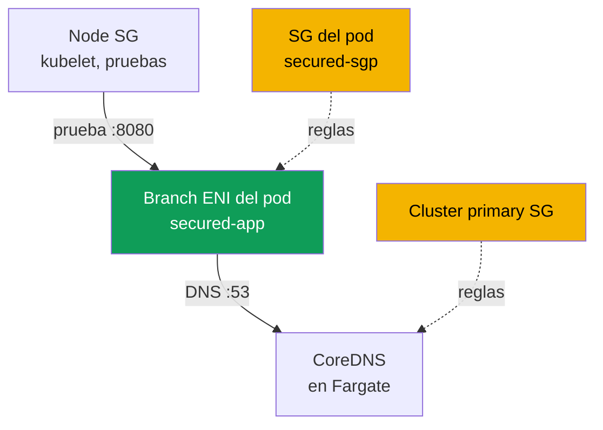
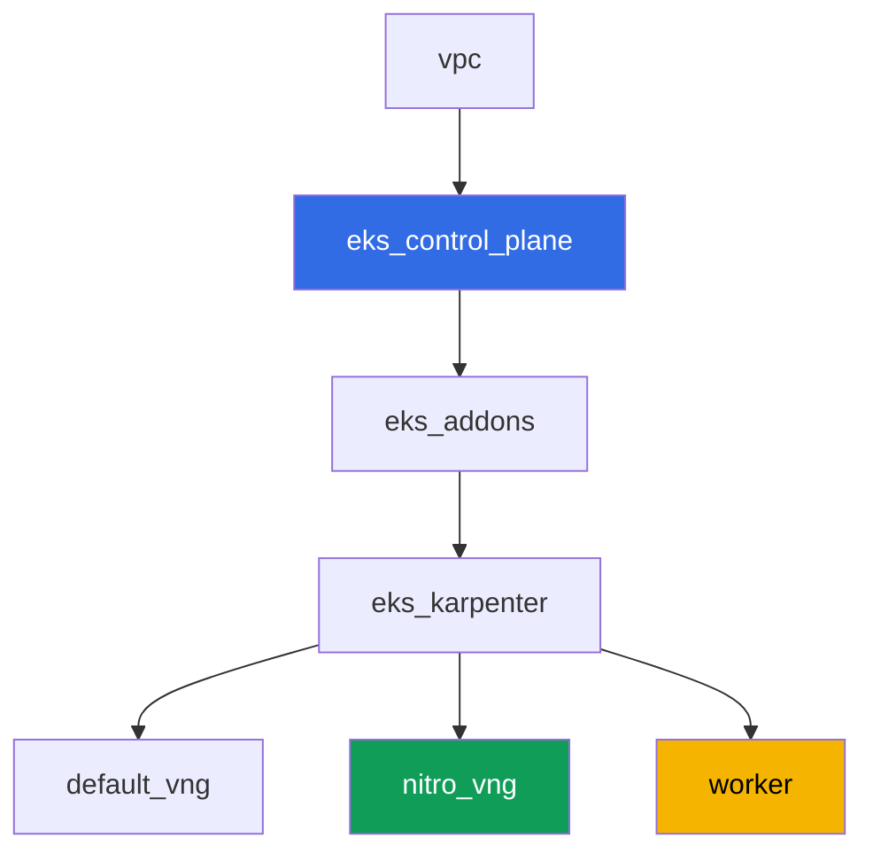

[Русская версия](README_RU.MD) · [Eng version](README.MD) · [Version française](README_FR.MD) · [Deutsche Version](README_DE.MD) · [ქართული ვერსია](README_GE.MD) · [繁體中文版](README_TW.MD) · [日本語版](README_JP.MD)

# Lab 126 - Security groups for pods: branch ENI, pod Running pero no Ready

## Descripción

Normalmente un pod en un nodo EC2 hereda las reglas de la security group del nodo.
Security groups for pods cambia este modelo: el pod recibe su propia branch ENI y su
propio conjunto de security groups, y las reglas del nodo ya no se le aplican. En esta
lab activas esta función, capturas su síntoma típico - un pod `Running`, pero nunca
`Ready`, con DNS que no resuelve - y encuentras exactamente las reglas que faltan: una
regla inbound para las pruebas de kubelet y DNS outbound/inbound en el puerto 53. Por
separado, identificas una trampa en la que este síntoma parpadea según dónde terminó
físicamente CoreDNS.

Las tareas están escritas en estilo producción: un enunciado corto más criterios de
aceptación. La verificación es automática, mediante el comando `check_result`, y parte
de los pasos con AWS CLI se ejecutan desde tu máquina local (con la misma cuenta con la
que desplegaste la lab) - los detalles están en la sección "Infraestructura".

## Objetivo

Reforzar el material de este capítulo del curso:

- [Capítulo 46. Fallos de red](../../course/46/ru.md) - security group como una capa
  de fallo de red

## Qué creamos

El clúster se despliega como código (la base, igual que en la lab 101), con un NodePool
adicional restringido a instancias Nitro y security groups for pods habilitado en el
VPC CNI. Añades un namespace, tu propia security group para pods y una aplicación que
choca contra ella.

| Objeto | Qué es | Por qué está en esta lab |
|--------|---------|-------------------|
| NodePool `nitro` | NodePool de Karpenter sin la familia `t` | security groups for pods solo funciona en instancias Nitro |
| Addon `vpc-cni` con `ENABLE_POD_ENI=true` | configuración del addon administrado | activa la trunk interface en los nodos |
| Namespace `eks-126` | una sección del clúster para la carga de la lab | mantiene los recursos separados de los del sistema |
| Security group para pods | creada manualmente, inicialmente incompleta | origen del síntoma `Running` pero no `Ready` |
| `SecurityGroupPolicy` `secured-sgp` | vincula la SG a los pods con `app: secured` | el propio mecanismo de branch ENI |
| Deployment `secured-app` | una aplicación con una readiness probe | demuestra el síntoma y su corrección |
| Artefactos en `/var/work/tests/artifacts/` | capturas de `describe`, verificaciones de DNS, explicaciones | registra cada paso del diagnóstico |



## Infraestructura

El entorno se despliega en AWS (`eu-central-1`) mediante Terragrunt. Cada directorio de
lab es un componente con su propio `terragrunt.hcl`, que hace referencia a un módulo
compartido en `terraform/modules/` y declara dependencias mediante bloques `dependency`.

### Módulos y dependencias

| Directorio (componente) | Módulo (`terraform/modules/`) | Depende de | Qué crea |
|---------------------|-------------------------------|------------|-------------|
| `vpc` | `vpc_v3` | - | VPC `10.10.0.0/16`, subredes públicas y privadas en dos AZ, NAT |
| `ssh-keys` | `ssh-keys` | - | un par de claves SSH para la máquina de trabajo y los nodos |
| `eks_control_plane` | `eks_v2_control_plane` | `vpc` | control plane de EKS `1.36`, OIDC, security groups |
| `eks_fargate_system` | `eks_v2_fargate` | `vpc`, `eks_control_plane` | perfil de Fargate para `kube-system` y `karpenter` (aquí corre CoreDNS) |
| `eks_addons` | `eks_v2_addons` | `eks_control_plane`, `eks_fargate_system` | coredns, kube-proxy, pod-identity, `vpc-cni` con `ENABLE_POD_ENI=true` |
| `eks_karpenter` | `eks_v2_karpenter` | `vpc`, `eks_control_plane`, `eks_addons`, `eks_fargate_system` | controlador de Karpenter, rol IAM de los nodos |
| `eks_karpenter_default_vng` | `eks_v2_karpenter_vng` | `vpc`, `eks_control_plane`, `eks_karpenter` | el NodePool por defecto `default` (con la familia `t`) |
| `eks_karpenter_nitro_vng` | `eks_v2_karpenter_vng` | `vpc`, `eks_control_plane`, `eks_karpenter` | NodePool `nitro`, categorías `c`/`m`/`r`, generación `>4`, sin taint |
| `worker` | `eks_v2_work_pc` | `ssh-keys`, `vpc`, `eks_control_plane`, `eks_karpenter` | máquina de trabajo con kubectl, tests y `check_result` |

Grafo de dependencias (lo que se aplica antes está más abajo en la flecha):



### Por qué se necesita un NodePool separado

Security groups for pods solo funciona en instancias Nitro - la familia `t` no está
soportada (verificado contra la documentación de AWS). El NodePool por defecto de la lab
permite la familia `t` (igual que en la lab 101), así que para esta lab se añadió un
segundo NodePool `nitro`: `karpenter.k8s.aws/instance-category In ["c","m","r"]` (esto ya
excluye `t`, ya que la categoría es independiente) más `instance-generation Gt "4"` como
garantía adicional. `nitro` no tiene taint - el Deployment `secured-app` cae ahí sin
toleration, mediante `nodeSelector: work_type: nitro`.

### Qué ya está incluido en la infraestructura, y qué hay que hacer a mano

El Terraform de la lab ya cubre parte de los prerrequisitos de la documentación de AWS:

- `ENABLE_POD_ENI=true` en la `configuration` del addon `vpc-cni`
  (`eks_addons/terragrunt.hcl`) - esto crea en los nodos una trunk interface, descrita
  como `aws-k8s-trunk-eni`.
- `POD_SECURITY_GROUP_ENFORCING_MODE=strict` (el valor por defecto) más
  `init.env.DISABLE_TCP_EARLY_DEMUX=true`. Este par se eligió deliberadamente - el
  razonamiento está más abajo.
- El NodePool `nitro` sin la familia `t` lo crea un componente separado.

El modo merece una palabra aparte, porque de él depende si el síntoma de la lab se
reproduce siquiera. La función tiene dos modos, y la documentación describe la diferencia
así: en modo `standard`, las reglas de la security group del pod **no se aplican** al
tráfico entre el pod y los servicios en el mismo nodo, incluyendo `kubelet`. Eso significa
que la readiness probe pasaría incluso a través de una security group sin una sola regla
inbound, y el síntoma "`Running`, pero no `Ready`" no se puede obtener (verificado en el
banco de pruebas: el pod se volvió `1/1` de inmediato). Por eso la lab corre en modo
`strict`, donde la probe pasa por la branch ENI del pod y está sujeta a las reglas de la
SG del pod. El costo de esto es un `DISABLE_TCP_EARLY_DEMUX=true` obligatorio en el
contenedor init `aws-node`: sin él, `kubelet` no puede abrir una conexión TCP a un pod en
una branch ENI en absoluto, y añadir la regla de la tarea 5 no arreglaría nada. En modo
`standard` esta bandera no es necesaria - pero con ella se va también todo el sentido de la
lab.

La política administrada `AmazonEKSVPCResourceController` en el rol IAM del **control
plane** (no el rol del nodo - ver tarea 2) no está, por defecto, **adjunta** por el módulo
`terraform-aws-modules/eks/aws` v21 (solo adjunta `AmazonEKSClusterPolicy`). Esta versión
del módulo `eks_v2_control_plane` no tiene una entrada para políticas adicionales del
clúster, y no es el tipo de entrada que se pueda añadir de forma segura solo para una lab
- por eso adjuntar la política se hace a mano, con `aws iam attach-role-policy`, como
parte de la tarea 2, en lugar de mediante terraform.

Todas las tareas se realizan en la máquina de trabajo por SSH, igual que en el resto de
labs del curso. Para esto, se añadieron permisos que antes no estaban al módulo
`eks_v2_work_pc`: `ec2:CreateSecurityGroup`, `ec2:DeleteSecurityGroup`,
`ec2:AuthorizeSecurityGroupEgress`, `ec2:RevokeSecurityGroupEgress` (el módulo ya tenía
permisos de reglas inbound), `iam:ListAttachedRolePolicies` y un `iam:AttachRolePolicy`
acotado de forma estrecha - solo para roles `*-cluster-*` y solo con la política
`AmazonEKSVPCResourceController` en la condición `iam:PolicyARN`. Sin este último punto,
la tarea 2 sería imposible, y su verificación automática fallaría independientemente de
las acciones del estudiante: el test lee `aws iam list-attached-role-policies` desde la
máquina de trabajo, y esta no tenía permiso para esa llamada.

## Despliegue

```bash
TASK=126 make run_eks_task
```

El despliegue toma aproximadamente 15-20 minutos. En la salida, busca la línea con la
conexión SSH a la máquina de trabajo y conéctate a ella. kubectl ahí ya está configurado
para el clúster correcto.

Comandos útiles en la máquina de trabajo:

```bash
time_left       # cuánto tiempo le queda al entorno
check_result    # verificar la solución
```

> Seguridad del entorno. `env.hcl` tiene habilitados `ssh_password_enable = true` y
> `access_cidrs = ["0.0.0.0/0"]` - conveniente para un entorno de entrenamiento, pero esto
> no es algo que se deba hacer en producción. Según los estándares del curso, el acceso a
> las máquinas de trabajo debería pasar por AWS SSM Session Manager sin exponer puertos
> SSH públicos, y `access_cidrs` debería reducirse a direcciones específicas. Aquí se deja
> el SSH público solo para mantener la configuración simple.

## Tareas

---
|        **1**        | **Namespace para la carga de la lab**                              |
| :-----------------: | :---------------------------------------------------------- |
| Qué hacer          | Crea el namespace `eks-126`. Todos los objetos de la lab se crean dentro de él. |
| Criterios de aceptación    | - el namespace `eks-126` existe. |
---
|        **2**        | **Verificación de los prerrequisitos para security groups for pods**           |
| :-----------------: | :---------------------------------------------------------- |
| Qué hacer          | Verifica ambos prerrequisitos de la documentación de AWS. Primero, encuentra el nombre del rol IAM del control plane (`aws eks describe-cluster --name <cluster> --query cluster.roleArn`) y usa `aws iam list-attached-role-policies --role-name <rol>` para ver si `AmazonEKSVPCResourceController` está adjunta a él; por defecto no lo está - adjúntala con `aws iam attach-role-policy`. La política va en el rol del control plane, no en el rol del nodo: las branch ENI las crea y elimina un controlador del lado de EKS. Segundo, ejecuta `kubectl describe daemonset aws-node -n kube-system \| grep -E 'ENABLE_POD_ENI\|POD_SECURITY_GROUP_ENFORCING_MODE\|DISABLE_TCP_EARLY_DEMUX'` - estos tres valores ya están configurados por el terraform de la lab, averigua por qué se necesita cada uno (ver sección "Infraestructura"). Obtén el nombre del clúster desde kubeconfig: `kubectl config current-context \| awk -F/ '{print $NF}'`. Guarda ambas confirmaciones en el archivo `/var/work/tests/artifacts/2/prereqs.txt`. |
| Criterios de aceptación    | - el archivo no está vacío, contiene `AmazonEKSVPCResourceController` y `ENABLE_POD_ENI`;<br/>- la política está realmente adjunta al rol del control plane (verificado por el autotest mediante `aws iam list-attached-role-policies`). |
---
|        **3**        | **Una security group incompleta y SecurityGroupPolicy**            |
| :-----------------: | :---------------------------------------------------------- |
| Qué hacer          | Crea una security group en la VPC de la lab (`aws ec2 create-security-group`) y NO le añadas ni una sola regla: una SG recién creada solo tiene el allow-all egress por defecto de AWS y cero reglas inbound - exactamente ese es el estado que produce el síntoma. NO le pongas la etiqueta `karpenter.sh/discovery=<nombre del clúster>` (de lo contrario terminaría seleccionada por el EC2NodeClass como SG de nodo - para esta lab se necesita una SG separada solo para pods). En `eks-126`, crea un `SecurityGroupPolicy` `secured-sgp` con `podSelector.matchLabels.app: secured`, que referencie esta SG. Guarda su ID en el archivo `/var/work/tests/artifacts/3/sg_id.txt`. |
| Criterios de aceptación    | - `SecurityGroupPolicy` `secured-sgp` en `eks-126` existe y referencia la SG del archivo;<br/>- el archivo `3/sg_id.txt` no está vacío y contiene `sg-`. |
---
|        **4**        | **El síntoma: Running, pero nunca Ready**                    |
| :-----------------: | :---------------------------------------------------------- |
| Qué hacer          | En `eks-126`, crea un Deployment `secured-app` (imagen `viktoruj/ping_pong:latest`, `1` réplica, `containerPort` y `readinessProbe.httpGet` en el puerto `8080`), con la etiqueta `app: secured` y `nodeSelector` `work_type: nitro` (no se necesita toleration - el NodePool `nitro` no tiene taint). El pod arrancará y caerá en una branch ENI con tu SG, pero las probes de `kubelet` nunca la alcanzan - el pod se queda en `0/1 Ready` con un evento como `Readiness probe failed: Get "http://<ip del pod>:8080/": context deadline exceeded`. De paso, confirma que el pod realmente está en una branch ENI: tiene la anotación `vpc.amazonaws.com/pod-eni` y el límite `vpc.amazonaws.com/pod-eni: 1`, y `aws ec2 describe-network-interfaces --filters Name=group-id,Values=<tu SG>` muestra una interfaz con `InterfaceType: branch`. Guarda `kubectl describe pod` (la salida completa, incluyendo `Events`) en el archivo `/var/work/tests/artifacts/4/pod_not_ready.txt`. |
| Criterios de aceptación    | - el Deployment `secured-app` existe, imagen `viktoruj/ping_pong`, etiqueta `app: secured`;<br/>- el archivo `4/pod_not_ready.txt` no está vacío y contiene `Readiness probe failed` o `Unhealthy` (el síntoma se arregla en la tarea 5, así que para cuando corra `check_result` el pod puede ya estar `Ready`). |
---
|        **5**        | **Arreglando las probes: una regla inbound desde la SG del nodo**                 |
| :-----------------: | :---------------------------------------------------------- |
| Qué hacer          | Encuentra la security group del nodo de Karpenter: toma el `providerID` del nodo donde corre `secured-app`, y busca `aws ec2 describe-instances --instance-ids <id> --query 'Reservations[0].Instances[0].SecurityGroups'`. Añade una regla inbound a la SG del pod para TCP `8080` con `--source-group <SG del nodo>`. La probe pasa en el siguiente ciclo, y el pod se vuelve `1/1 Ready` en unos segundos. Guarda el `kubectl get pod -n eks-126 -l app=secured` resultante en el archivo `/var/work/tests/artifacts/5/pod_ready.txt`. |
| Criterios de aceptación    | - `readyReplicas` del Deployment `secured-app` es igual a `1`;<br/>- el archivo `5/pod_ready.txt` no está vacío y contiene `1/1`. |
---
|        **6**        | **Diagnosticando y arreglando DNS: egress y el ingress inverso**    |
| :-----------------: | :---------------------------------------------------------- |
| Qué hacer          | La imagen `viktoruj/ping_pong` no tiene ni shell ni `wget` (`kubectl exec` devuelve `executable file not found`), así que para verificar DNS ejecuta un pod `busybox` separado en `eks-126` con la etiqueta `app: secured` y `nodeSelector: work_type: nitro` - la etiqueta importa, de lo contrario `secured-sgp` no se le aplicaría y la verificación no tendría sentido. Ejecuta `nslookup kubernetes.default.svc.cluster.local` en él y obtén `connection timed out; no servers could be reached`. Ahora encuentra exactamente dónde se pierde el paquete: tu SG tiene un allow-all egress por defecto, así que la solicitud sale bien, pero la security group del lado receptor no tiene ninguna regla para ella. CoreDNS en esta lab corre en Fargate y está detrás de la **cluster primary security group** (`aws eks describe-cluster --query cluster.resourcesVpcConfig.clusterSecurityGroupId`). Añádele un inbound `53` TCP y `53` UDP con `--source-group <SG del pod>` y repite `nslookup` - la resolución funcionará. Luego da un segundo paso, siguiendo el mínimo privilegio: quita el allow-all egress por defecto de la SG del pod y añade en su lugar un egress explícito `53` TCP y UDP hacia la cluster primary SG - el DNS sigue funcionando. Guarda ambos estados y una explicación de qué lado necesita qué regla en el archivo `/var/work/tests/artifacts/6/dns_fix.txt`. |
| Criterios de aceptación    | - el archivo `6/dns_fix.txt` no está vacío, contiene `53` y una explicación de que la regla se necesita del lado de entrada (inbound) de la parte receptora (`inbound` o `ingress`);<br/>- un pod con la etiqueta `app: secured` resuelve `kubernetes.default.svc.cluster.local` (confirmado por el artefacto). |
---
|        **7**        | **Un solo nodo, distintas security groups: qué pasa realmente** |
| :-----------------: | :---------------------------------------------------------- |
| Qué hacer          | Comprueba en la práctica si las reglas de SG funcionan entre dos pods con security groups DIFERENTES en el mismo nodo. Crea una segunda security group (por ejemplo `eks-task126-other-pod-sg`), un segundo `SecurityGroupPolicy` `other-sgp` para la etiqueta `app: other`, y ejecuta un pod `busybox` con esa etiqueta, fijándolo mediante `nodeName` al MISMO nodo donde corre `secured-app`. Desde él, accede a la IP del pod `secured-app` en el puerto `8080` (`wget -T 10 -qO- http://<ip>:8080/`). Hazlo dos veces: primero sin una regla que lo permita - obtendrás `download timed out`, luego añade un inbound `8080` a la SG de `secured-app` con `--source-group <segunda SG>` y repite - la solicitud tendrá éxito. La conclusión a registrar en el artefacto: en modo `strict` las reglas de la SG del pod se aplican incluso dentro de un solo nodo, así que esto se arregla con una regla. Y por separado, anota el contraste con el modo `standard`: ahí, según la documentación de AWS, las reglas de SG NO se aplican al tráfico entre pods y servicios en el mismo nodo, y los pods con SG diferentes en el mismo nodo no se comunican en absoluto - y una regla no puede arreglar eso. Guarda ambas ejecuciones, la salida de `kubectl get pod -o wide` para ambos pods, y la explicación en el archivo `/var/work/tests/artifacts/7/same_node_trap.txt`. |
| Criterios de aceptación    | - el archivo `7/same_node_trap.txt` no está vacío;<br/>- contiene el nombre del nodo de `secured-app`, el estado antes de la corrección (`timed out`), y una explicación de la diferencia entre los modos `strict` y `standard`. |
---

### Tres conclusiones que vale la pena llevarse

Todo lo siguiente ha sido verificado en un banco de pruebas real y contradice
reformulaciones habituales de este tema.

**El síntoma depende del modo, no de lo cuidadosas que sean las reglas.** En `strict`, la
probe de `kubelet` pasa por la branch ENI y está sujeta a las reglas de la SG del pod - de
ahí `Readiness probe failed: context deadline exceeded` y una corrección con una sola
regla inbound. En `standard`, el mismo pod con la misma security group vacía se vuelve
`Ready` de inmediato: las reglas no se aplican al tráfico dentro del nodo. Antes de buscar
un error en las reglas, verifica `POD_SECURITY_GROUP_ENFORCING_MODE` en `aws-node`.

**El egress del pod casi nunca es el culpable.** Una security group recién creada tiene
un allow-all egress por defecto, así que la solicitud sale bien. El DNS se rompe del otro
lado: la cluster primary security group, detrás de la cual vive CoreDNS, no tiene una
regla inbound para la SG del pod. La regla se necesita justo ahí, y una es suficiente -
una security group es stateful, la respuesta a una solicitud permitida vuelve sin una
regla separada. Permitir al pod todo el tráfico saliente no es necesario para esto:
después de reducir el egress a `53`, el DNS sigue funcionando (tarea 6, segundo paso).

**Un nodo compartido no molesta, siempre que el modo sea `strict`.** La restricción
documentada sobre pods con security groups diferentes en el mismo nodo se aplica al modo
`standard`. En `strict`, dos de esos pods primero fallan al conectarse y luego se conectan
tras añadir la regla - es decir, decide la regla, no la topología. Igual vale la pena
conocer la restricción: en `standard`, la misma situación no se arregla con una regla, y
eso cambia el plan de diagnóstico.

## Verificación del resultado

En la máquina de trabajo, ejecuta la verificación automática:

```bash
check_result
```

El script ejecutará los tests y mostrará el porcentaje de tareas completadas. Parte de las
verificaciones miran la API de AWS, no solo los objetos de Kubernetes: si la política está
adjunta al rol del clúster, si la security group del `SecurityGroupPolicy` existe. Una
verificación separada levanta su propio pod con la etiqueta `app: secured` y exige que el
DNS realmente resuelva en él - el artefacto solo no es suficiente para eso.

## Solución

Solución de referencia: [worker/files/solutions/1_ES.MD](worker/files/solutions/1_ES.MD)

## Eliminación del clúster y los recursos

> **Aquí el orden de limpieza importa, de lo contrario `destroy` no terminará.** En esta
> lab creaste manualmente la security group `eks-task126-secured-pod-sg` directamente en
> la VPC del entorno (no está en el state de terraform), añadiste reglas a la **cluster
> primary security group**, que pertenece a terraform, y habilitaste security groups for
> pods - lo que significa que se crearon **branch ENI** para los pods. Cada uno de estos
> tres puntos por sí solo bloquea la eliminación: una security group externa no permite
> eliminar la VPC, una referencia de una SG a otra no permite eliminar la de destino, y
> una branch ENI viva retiene tanto la SG como la subred. El síntoma es
> `Still destroying...` en una security group, la VPC o el Internet Gateway.

```bash
# 1. Quitar la carga de trabajo del SecurityGroupPolicy, para que se liberen las branch ENI
kubectl delete namespace eks-126 --ignore-not-found

# 2. Esperar hasta que las branch ENI desaparezcan y Karpenter elimine sus nodos EC2
SG_ID=$(aws ec2 describe-security-groups \
  --filters "Name=group-name,Values=eks-task126-secured-pod-sg" \
  --query 'SecurityGroups[0].GroupId' --output text)
while [ "$(aws ec2 describe-network-interfaces --filters "Name=group-id,Values=${SG_ID}" \
    --query 'length(NetworkInterfaces)' --output text)" != "0" ]; do
  echo "las branch ENI aún están activas, esperando..."; sleep 15
done
while kubectl get nodes --no-headers 2>/dev/null | grep -qv fargate; do
  echo "el nodo EC2 de Karpenter aún está activo, esperando..."; sleep 15
done

# 3. Quitar las reglas que añadiste a la cluster primary SG que referencian tu SG
CLUSTER=$(kubectl config current-context | awk -F/ '{print $NF}')
CLUSTER_PRIMARY_SG=$(aws eks describe-cluster --name "$CLUSTER" \
  --query 'cluster.resourcesVpcConfig.clusterSecurityGroupId' --output text)
aws ec2 revoke-security-group-ingress --group-id "$CLUSTER_PRIMARY_SG" \
  --protocol tcp --port 53 --source-group "$SG_ID"
aws ec2 revoke-security-group-ingress --group-id "$CLUSTER_PRIMARY_SG" \
  --protocol udp --port 53 --source-group "$SG_ID"

# 4. Eliminar ambas security groups propias. El orden importa: primero quita la referencia
#    de la primera SG a la segunda, de lo contrario la segunda no se eliminará
SG2_ID=$(aws ec2 describe-security-groups \
  --filters "Name=group-name,Values=eks-task126-other-pod-sg" \
  --query 'SecurityGroups[0].GroupId' --output text)
aws ec2 revoke-security-group-ingress --group-id "$SG_ID" \
  --protocol tcp --port 8080 --source-group "$SG2_ID"
aws ec2 delete-security-group --group-id "$SG2_ID"
aws ec2 delete-security-group --group-id "$SG_ID"
```

No necesitas desadjuntar manualmente la política `AmazonEKSVPCResourceController` que
adjuntaste al rol del control plane en la tarea 2: el módulo upstream crea este rol con
`force_detach_policies = true` (verificado en el código fuente del módulo), así que
terraform la desadjuntará por sí mismo y la eliminación del rol no se topará con un
`DeleteConflict`.

```bash
TASK=126 make delete_eks_task
```

Si `destroy` de todas formas se queda atascado en algún punto, busca al que retiene el
recurso con el mismo enfoque: quién está usando la SG, qué SG la referencian en sus
reglas, y si hay ENI huérfanas (incluyendo las `branch` de security groups for pods y las
secundarias de VPC CNI):

```bash
aws ec2 describe-network-interfaces --filters "Name=group-id,Values=<sg-id>" \
  --query 'NetworkInterfaces[].[NetworkInterfaceId,Status,InterfaceType,Description]' --output table
aws ec2 describe-security-groups --filters "Name=ip-permission.group-id,Values=<sg-id>" \
  --query 'SecurityGroups[].[GroupId,GroupName]' --output table
aws ec2 describe-network-interfaces --filters Name=status,Values=available \
  --query 'NetworkInterfaces[].[NetworkInterfaceId,Description,Groups[0].GroupName]' --output table
```
