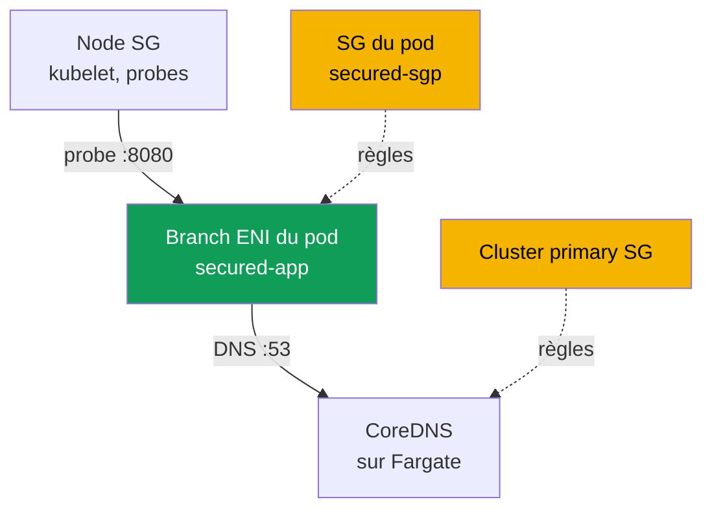
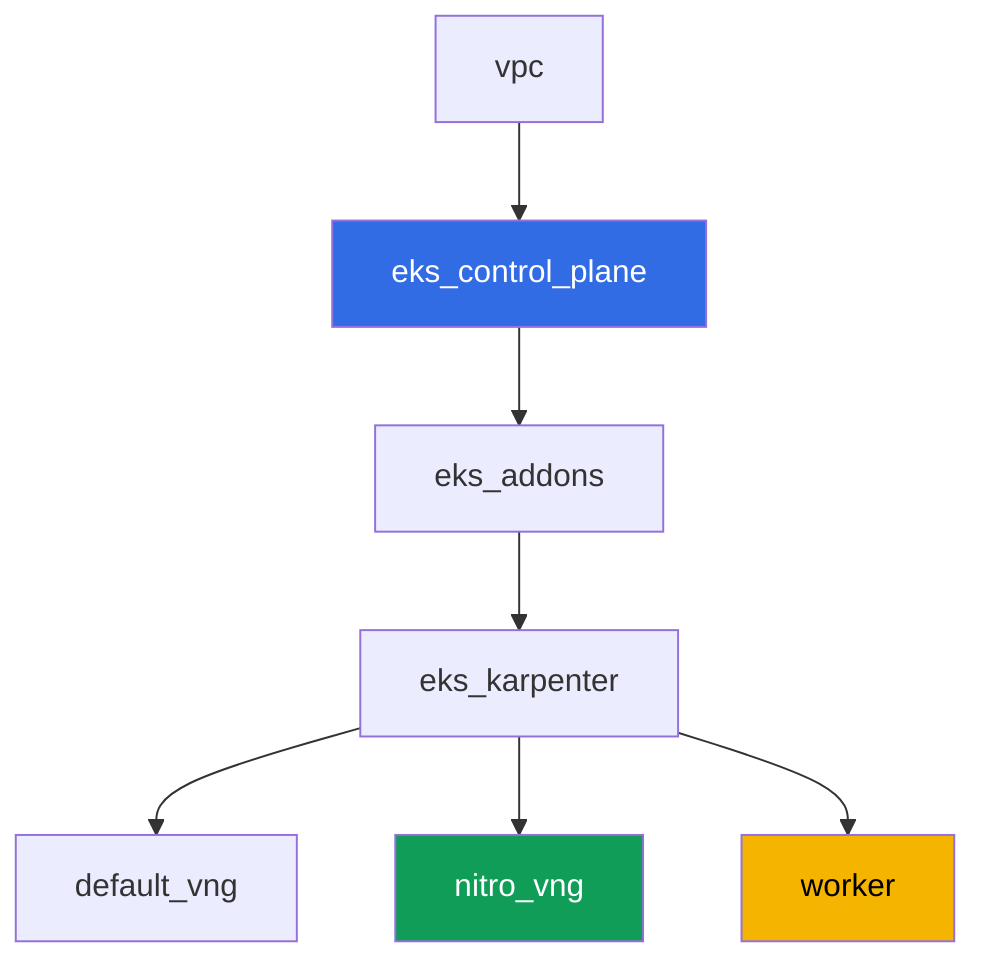

[Русская версия](README_RU.MD) · [Eng version](README.MD) · [Versión en español](README_ES.MD) · [Deutsche Version](README_DE.MD) · [ქართული ვერსია](README_GE.MD) · [繁體中文版](README_TW.MD) · [日本語版](README_JP.MD)

# Lab 126 - Security groups for pods : branch ENI, pod Running mais pas Ready

## Description

Normalement, un pod sur une node EC2 hérite des règles de la security group de la node.
Security groups for pods change ce modèle : le pod reçoit sa propre branch ENI et son
propre ensemble de security group, et les règles de la node ne s'appliquent plus à lui.
Dans cette lab, vous activez cette fonctionnalité, vous capturez son symptôme typique -
un pod `Running`, mais jamais `Ready`, avec le DNS qui ne se résout pas - et vous
trouvez exactement les règles qui manquent : une règle inbound pour les probes de
kubelet et un DNS sortant/entrant sur le port 53. Séparément, vous fixez un piège à
cause duquel ce symptôme scintille selon l'endroit où CoreDNS a physiquement atterri.

Les tâches sont écrites dans un style production : un énoncé court plus des critères
d'acceptation. La vérification est automatique, via la commande `check_result`, et une
partie des étapes avec AWS CLI s'exécute depuis votre machine locale (avec le même
compte que celui utilisé pour déployer la lab) - les détails sont dans la section
« Infrastructure ».

## Objectif

Consolider la matière du chapitre du cours :

- [Chapitre 46. Pannes réseau](../../course/46/ru.md) - la security group comme couche
  de panne réseau

## Ce que nous créons

Le cluster est déployé comme du code (la base, comme dans la lab 101), avec un NodePool
supplémentaire limité aux instances Nitro et le support de security groups for pods
activé sur le VPC CNI. Vous ajoutez un namespace, votre propre security group pour les
pods, et une application qui se heurte à elle.

| Objet | Ce que c'est | Pourquoi dans cette lab |
|--------|---------|-------------------|
| NodePool `nitro` | Karpenter NodePool sans la famille `t` | security groups for pods ne fonctionnent que sur les instances Nitro |
| Addon `vpc-cni` avec `ENABLE_POD_ENI=true` | configuration du managed addon | active le trunk interface sur les nodes |
| Namespace `eks-126` | une section du cluster pour la charge de la lab | garde les ressources séparées des ressources système |
| Security group pour les pods | créée manuellement, incomplète au départ | source du symptôme `Running`, mais pas `Ready` |
| `SecurityGroupPolicy` `secured-sgp` | lie la SG aux pods avec `app: secured` | le mécanisme de branch ENI lui-même |
| Deployment `secured-app` | application avec une readiness probe | démontre le symptôme et sa correction |
| Artefacts dans `/var/work/tests/artifacts/` | extraits de `describe`, vérifications DNS, explications | fixe chaque étape du diagnostic |



## Infrastructure

L'environnement est déployé sur AWS (`eu-central-1`) via Terragrunt. Chaque répertoire
de lab est un composant avec son propre `terragrunt.hcl`, qui référence un module
partagé dans `terraform/modules/` et déclare des dépendances via des blocs
`dependency`.

### Modules et dépendances

| Répertoire (composant) | Module (`terraform/modules/`) | Dépend de | Ce qu'il crée |
|---------------------|-------------------------------|------------|-------------|
| `vpc` | `vpc_v3` | - | VPC `10.10.0.0/16`, subnets publics et privés dans deux AZ, NAT |
| `ssh-keys` | `ssh-keys` | - | une paire de clés SSH pour la machine de travail et les nodes |
| `eks_control_plane` | `eks_v2_control_plane` | `vpc` | control plane EKS `1.36`, OIDC, security groups |
| `eks_fargate_system` | `eks_v2_fargate` | `vpc`, `eks_control_plane` | profil Fargate pour `kube-system` et `karpenter` (CoreDNS s'exécute ici) |
| `eks_addons` | `eks_v2_addons` | `eks_control_plane`, `eks_fargate_system` | coredns, kube-proxy, pod-identity, `vpc-cni` avec `ENABLE_POD_ENI=true` |
| `eks_karpenter` | `eks_v2_karpenter` | `vpc`, `eks_control_plane`, `eks_addons`, `eks_fargate_system` | contrôleur Karpenter, rôle IAM des nodes |
| `eks_karpenter_default_vng` | `eks_v2_karpenter_vng` | `vpc`, `eks_control_plane`, `eks_karpenter` | NodePool `default` par défaut (avec la famille `t`) |
| `eks_karpenter_nitro_vng` | `eks_v2_karpenter_vng` | `vpc`, `eks_control_plane`, `eks_karpenter` | NodePool `nitro`, catégories `c`/`m`/`r`, génération `>4`, sans taint |
| `worker` | `eks_v2_work_pc` | `ssh-keys`, `vpc`, `eks_control_plane`, `eks_karpenter` | machine de travail avec kubectl, les tests et `check_result` |

Graphe de dépendances (ce qui est appliqué en premier est plus bas sur la flèche) :



### Pourquoi un NodePool séparé est nécessaire

Security groups for pods ne fonctionnent que sur les instances Nitro - la famille `t`
n'est pas supportée (vérifié dans la documentation AWS). Le NodePool par défaut de la
lab autorise la famille `t` (comme dans la lab 101), donc un second NodePool `nitro` a
été ajouté pour cette lab : `karpenter.k8s.aws/instance-category In ["c","m","r"]` (cela
exclut déjà `t`, puisque la catégorie est séparée) plus `instance-generation Gt "4"`
comme garantie supplémentaire. `nitro` n'a pas de taint - le Deployment `secured-app` y
arrive sans toleration, via `nodeSelector: work_type: nitro`.

### Ce qui est déjà inclus dans l'infrastructure, et ce qu'il faut faire à la main

Le Terraform de la lab couvre déjà une partie des prérequis de la documentation AWS :

- `ENABLE_POD_ENI=true` dans la `configuration` de l'addon `vpc-cni`
  (`eks_addons/terragrunt.hcl`) - cela crée sur les nodes un trunk interface décrit
  comme `aws-k8s-trunk-eni`.
- `POD_SECURITY_GROUP_ENFORCING_MODE=strict` (valeur par défaut) plus
  `init.env.DISABLE_TCP_EARLY_DEMUX=true`. Cette paire est choisie délibérément,
  l'explication est ci-dessous.
- Le NodePool `nitro` sans la famille `t` est créé par un composant séparé.

Il vaut la peine de s'arrêter sur le mode, car c'est de lui que dépend le fait que le
symptôme de la lab se reproduise ou non. La fonctionnalité a deux modes, et la
documentation décrit la différence ainsi : en mode `standard`, les règles de la security
group du pod **ne s'appliquent pas** au trafic entre le pod et les services sur la même
node, y compris `kubelet`. Cela signifie que la readiness probe passerait même avec une
security group sans une seule règle inbound, et le symptôme « `Running`, mais pas
`Ready` » ne peut pas être obtenu (vérifié sur le banc de test : le pod devenait
immédiatement `1/1`). C'est pourquoi la lab fonctionne en mode `strict`, où la probe
passe par la branch ENI du pod et est soumise aux règles de la SG du pod. Le prix à
payer est un `DISABLE_TCP_EARLY_DEMUX=true` obligatoire sur le conteneur init
`aws-node` : sans lui, `kubelet` ne peut pas du tout ouvrir une connexion TCP vers un pod
sur une branch ENI, et l'ajout de la règle de la tâche 5 n'aurait rien corrigé. En mode
`standard`, ce flag n'est pas nécessaire - mais l'objet même de la lab disparaît avec
lui.

La politique gérée `AmazonEKSVPCResourceController` sur le rôle IAM du **control
plane** (pas le rôle de la node - voir la tâche 2) n'est, par défaut, **pas attachée**
par le module `terraform-aws-modules/eks/aws` v21 (il n'attache que
`AmazonEKSClusterPolicy`). Cette version du module `eks_v2_control_plane` n'a pas
d'entrée pour des politiques de cluster supplémentaires, et ce n'est pas le genre
d'entrée qu'on peut ajouter en toute sécurité juste pour une lab - donc l'attachement
de la politique se fait à la main, avec `aws iam attach-role-policy`, dans le cadre de
la tâche 2, plutôt que via terraform.

Toutes les tâches s'exécutent sur la machine de travail par SSH, comme dans le reste des
labs du cours. Pour cela, des permissions qui n'existaient pas auparavant ont été
ajoutées au module `eks_v2_work_pc` : `ec2:CreateSecurityGroup`,
`ec2:DeleteSecurityGroup`, `ec2:AuthorizeSecurityGroupEgress`,
`ec2:RevokeSecurityGroupEgress` (le module savait déjà gérer les règles inbound),
`iam:ListAttachedRolePolicies` et un `iam:AttachRolePolicy` étroitement restreint -
uniquement sur les rôles `*-cluster-*` et uniquement avec la politique
`AmazonEKSVPCResourceController` dans la condition `iam:PolicyARN`. Sans ce dernier
point, la tâche 2 était infaisable, et sa vérification automatique échouait
indépendamment des actions de l'étudiant : le test lit
`aws iam list-attached-role-policies` depuis la machine de travail, et elle n'avait pas
la permission pour cet appel.

## Déploiement

```bash
TASK=126 make run_eks_task
```

Le déploiement prend environ 15-20 minutes. Dans la sortie, trouvez la ligne avec la
connexion SSH à la machine de travail et connectez-vous. kubectl y est déjà configuré
sur le cluster voulu.

Commandes utiles sur la machine de travail :

```bash
time_left       # combien de temps il reste à l'environnement
check_result    # vérifier la solution
```

> Sécurité du banc de test. Dans `env.hcl` sont activés `ssh_password_enable = true` et
> `access_cidrs = ["0.0.0.0/0"]` - c'est pratique pour un environnement d'apprentissage,
> mais il ne faut pas faire ainsi en production. Selon les standards du cours, l'accès
> aux machines de travail se fait via AWS SSM Session Manager sans ports SSH publics
> exposés, et `access_cidrs` se restreint à des adresses précises. Ici, le SSH public
> est laissé uniquement pour simplifier le lancement.

## Tâches

---
|        **1**        | **Namespace pour la charge de la lab**                              |
| :-----------------: | :---------------------------------------------------------- |
| Ce qu'il faut faire | Créez le namespace `eks-126`. Tous les objets de la lab sont créés à l'intérieur. |
| Critères d'acceptation | - le namespace `eks-126` existe. |
---
|        **2**        | **Vérification des prérequis de security groups for pods**           |
| :-----------------: | :---------------------------------------------------------- |
| Ce qu'il faut faire | Vérifiez les deux prérequis de la documentation AWS. D'abord, trouvez le nom du rôle IAM du control plane (`aws eks describe-cluster --name <cluster> --query cluster.roleArn`) et via `aws iam list-attached-role-policies --role-name <rôle>` regardez si `AmazonEKSVPCResourceController` y est attachée ; par défaut elle ne l'est pas - attachez-la avec `aws iam attach-role-policy`. La politique va bien sur le rôle du control plane, pas sur le rôle de la node : les branch ENI sont créées et supprimées par un contrôleur côté EKS. Ensuite, exécutez `kubectl describe daemonset aws-node -n kube-system \| grep -E 'ENABLE_POD_ENI\|POD_SECURITY_GROUP_ENFORCING_MODE\|DISABLE_TCP_EARLY_DEMUX'` - ces trois valeurs sont déjà définies par la configuration terraform de la lab, comprenez pourquoi chacune est nécessaire (voir la section « Infrastructure »). Récupérez le nom du cluster depuis kubeconfig : `kubectl config current-context \| awk -F/ '{print $NF}'`. Enregistrez les deux confirmations dans le fichier `/var/work/tests/artifacts/2/prereqs.txt`. |
| Critères d'acceptation | - le fichier n'est pas vide, contient `AmazonEKSVPCResourceController` et `ENABLE_POD_ENI`;<br/>- la politique est réellement attachée au rôle du control plane (vérifié par l'autotest via `aws iam list-attached-role-policies`). |
---
|        **3**        | **Security group incomplète et SecurityGroupPolicy**            |
| :-----------------: | :---------------------------------------------------------- |
| Ce qu'il faut faire | Créez une security group dans le VPC de la lab (`aws ec2 create-security-group`) et n'y ajoutez AUCUNE règle : une SG fraîche n'a que l'allow-all egress par défaut d'AWS et zéro règle inbound - c'est exactement cet état qui donne le symptôme. NE lui mettez PAS le tag `karpenter.sh/discovery=<nom du cluster>` (sinon elle serait sélectionnée par l'EC2NodeClass comme SG de node - pour cette lab il faut une SG séparée réservée aux pods). Dans `eks-126`, créez une `SecurityGroupPolicy` `secured-sgp` avec `podSelector.matchLabels.app: secured`, référençant cette SG. Enregistrez son ID dans le fichier `/var/work/tests/artifacts/3/sg_id.txt`. |
| Critères d'acceptation | - la `SecurityGroupPolicy` `secured-sgp` dans `eks-126` existe et référence la SG du fichier;<br/>- le fichier `3/sg_id.txt` n'est pas vide et contient `sg-`. |
---
|        **4**        | **Le symptôme : Running, mais jamais Ready**                    |
| :-----------------: | :---------------------------------------------------------- |
| Ce qu'il faut faire | Dans `eks-126`, créez un Deployment `secured-app` (image `viktoruj/ping_pong:latest`, `1` réplique, `containerPort` et `readinessProbe.httpGet` sur le port `8080`), avec le label `app: secured` et `nodeSelector` `work_type: nitro` (pas besoin de toleration - le NodePool `nitro` n'a pas de taint). Le pod démarre et atterrit sur une branch ENI avec votre SG, mais les probes de `kubelet` ne l'atteignent pas - le pod reste bloqué `0/1 Ready` avec un événement du type `Readiness probe failed: Get "http://<ip du pod>:8080/": context deadline exceeded`. Vérifiez au passage que le pod est bien sur une branch ENI : il a l'annotation `vpc.amazonaws.com/pod-eni` et la limite `vpc.amazonaws.com/pod-eni: 1`, et `aws ec2 describe-network-interfaces --filters Name=group-id,Values=<votre SG>` montre une interface avec `InterfaceType: branch`. Enregistrez `kubectl describe pod` (toute la sortie, y compris `Events`) dans le fichier `/var/work/tests/artifacts/4/pod_not_ready.txt`. |
| Critères d'acceptation | - le Deployment `secured-app` existe, image `viktoruj/ping_pong`, label `app: secured`;<br/>- le fichier `4/pod_not_ready.txt` n'est pas vide et contient `Readiness probe failed` ou `Unhealthy` (le symptôme est corrigé dans la tâche 5, donc au moment de `check_result` le pod peut déjà être `Ready`). |
---
|        **5**        | **Correction des probes : une règle inbound depuis la SG des nodes** |
| :-----------------: | :---------------------------------------------------------- |
| Ce qu'il faut faire | Trouvez la security group des nodes Karpenter : prenez le `providerID` de la node sur laquelle tourne `secured-app`, et regardez `aws ec2 describe-instances --instance-ids <id> --query 'Reservations[0].Instances[0].SecurityGroups'`. Ajoutez à la SG du pod une règle inbound TCP `8080` avec `--source-group <SG des nodes>`. La probe passe au cycle suivant, le pod devient `1/1 Ready` en quelques secondes. Enregistrez le résultat de `kubectl get pod -n eks-126 -l app=secured` dans le fichier `/var/work/tests/artifacts/5/pod_ready.txt`. |
| Critères d'acceptation | - `readyReplicas` du Deployment `secured-app` égale `1`;<br/>- le fichier `5/pod_ready.txt` n'est pas vide et contient `1/1`. |
---
|        **6**        | **Diagnostic et correction du DNS : egress et ingress en retour**    |
| :-----------------: | :---------------------------------------------------------- |
| Ce qu'il faut faire | L'image `viktoruj/ping_pong` n'a ni shell ni `wget` (`kubectl exec` renverra `executable file not found`), donc pour vérifier le DNS lancez un pod `busybox` séparé dans `eks-126` avec le label `app: secured` et `nodeSelector: work_type: nitro` - le label est important, sinon `secured-sgp` ne s'appliquera pas à lui et la vérification n'aura pas de sens. Exécutez-y `nslookup kubernetes.default.svc.cluster.local` et obtenez `connection timed out; no servers could be reached`. Maintenant trouvez exactement où le paquet se perd : votre SG a un allow-all egress par défaut, donc la requête part bien, mais la security group du côté récepteur n'a aucune règle pour elle. CoreDNS dans cette lab tourne sur Fargate et vit derrière la **cluster primary security group** (`aws eks describe-cluster --query cluster.resourcesVpcConfig.clusterSecurityGroupId`). Ajoutez-y un inbound `53` TCP et `53` UDP avec `--source-group <SG du pod>` et répétez `nslookup` - la résolution fonctionnera. Ensuite, faites une deuxième étape, selon le principe du moindre privilège : retirez de la SG du pod l'allow-all egress par défaut et ajoutez à la place un egress explicite `53` TCP et UDP vers la cluster primary SG - le DNS continue de fonctionner. Enregistrez les deux états et une explication de quel côté quelle règle est nécessaire dans le fichier `/var/work/tests/artifacts/6/dns_fix.txt`. |
| Critères d'acceptation | - le fichier `6/dns_fix.txt` n'est pas vide, contient `53` et une analyse indiquant que la règle est nécessaire côté inbound du destinataire (`inbound` ou `ingress`);<br/>- le pod avec le label `app: secured` résout `kubernetes.default.svc.cluster.local` (confirmé par l'artefact). |
---
|        **7**        | **Une seule node, des security group différentes : ce qui se passe réellement** |
| :-----------------: | :---------------------------------------------------------- |
| Ce qu'il faut faire | Vérifiez sur le terrain si les règles de SG fonctionnent entre deux pods avec des security group DIFFÉRENTES sur la même node. Créez une deuxième security group (par exemple `eks-task126-other-pod-sg`), une deuxième `SecurityGroupPolicy` `other-sgp` sur le label `app: other`, et lancez un pod `busybox` avec ce label, en le plaçant via `nodeName` sur LA MÊME node que `secured-app`. Depuis lui, contactez l'IP du pod `secured-app` sur le port `8080` (`wget -T 10 -qO- http://<ip>:8080/`). Faites-le deux fois : d'abord sans règle autorisant - obtenez `download timed out`, puis ajoutez à la SG de `secured-app` un inbound `8080` avec `--source-group <deuxième SG>` et répétez - la requête passera. La conclusion à noter dans l'artefact : en mode `strict`, les règles de SG du pod s'appliquent aussi à l'intérieur d'une même node, donc cela se corrige avec une règle. Et notez séparément le contraste avec le mode `standard` : là, selon la documentation AWS, les règles de SG ne s'appliquent PAS au trafic entre pods et services sur une même node, et des pods avec des SG différentes sur une même node ne communiquent pas du tout - et cela ne peut pas être corrigé par une règle. Enregistrez les deux essais, la sortie `kubectl get pod -o wide` pour les deux pods et l'explication dans le fichier `/var/work/tests/artifacts/7/same_node_trap.txt`. |
| Critères d'acceptation | - le fichier `7/same_node_trap.txt` n'est pas vide;<br/>- contient le nom de la node de `secured-app`, l'état avant correction (`timed out`) et une analyse de la différence entre les modes `strict` et `standard`. |
---

### Trois enseignements à retenir

Tout ce qui suit a été vérifié sur un banc de test réel et contredit les récits
courants sur ce sujet.

**Le symptôme dépend du mode, pas de la minutie des règles.** En `strict`, la probe de
`kubelet` passe par la branch ENI et est soumise aux règles de la SG du pod - d'où
`Readiness probe failed: context deadline exceeded` et une correction par une seule
règle inbound. En `standard`, le même pod avec la même security group vide devient
`Ready` immédiatement : les règles ne s'appliquent pas au trafic à l'intérieur de la
node. Avant de chercher une erreur dans les règles, regardez
`POD_SECURITY_GROUP_ENFORCING_MODE` sur `aws-node`.

**L'egress du pod n'est presque jamais fautif.** Une security group fraîche a un
allow-all egress par défaut, donc la requête part bien. Le DNS casse de l'autre côté :
la cluster primary security group, derrière laquelle vit CoreDNS, n'a pas de règle
inbound pour la SG du pod. La règle est nécessaire exactement là, et une seule suffit -
une security group est stateful, la réponse à une requête autorisée revient sans règle
séparée. Il n'est pas nécessaire d'autoriser tout le trafic sortant du pod pour cela :
après avoir réduit l'egress à `53`, le DNS continue de fonctionner (tâche 6, deuxième
étape).

**Une node partagée ne gêne pas, tant que le mode est `strict`.** La restriction
documentée à propos des pods avec des security group différentes sur une même node
concerne le mode `standard`. En `strict`, deux tels pods d'abord ne se connectent pas,
puis se connectent après l'ajout d'une règle - c'est donc la règle qui décide, pas la
topologie. Il faut malgré tout connaître cette restriction : en `standard`, la même
situation ne se corrige pas par une règle, et cela change le plan de diagnostic.

## Vérification du résultat

Sur la machine de travail, lancez la vérification automatique :

```bash
check_result
```

Le script exécute les tests et affiche le pourcentage de tâches complétées. Une partie
des vérifications regarde l'API AWS, pas seulement les objets Kubernetes : si la
politique est attachée au rôle du cluster, si la security group de la
`SecurityGroupPolicy` existe. Une vérification séparée lance son propre pod avec le
label `app: secured` et exige que le DNS s'y résolve réellement - l'artefact seul ne
suffit pas pour elle.

## Solution

Solution de référence : [worker/files/solutions/1_FR.MD](worker/files/solutions/1_FR.MD)

## Suppression du cluster et des ressources

> **Ici l'ordre du nettoyage est critique, sinon `destroy` ne se terminera pas.** Dans
> cette lab, vous avez créé à la main la security group `eks-task126-secured-pod-sg`
> directement dans le VPC du banc de test (elle n'est pas dans le state terraform), vous
> avez ajouté des règles sur la **cluster primary security group**, que possède
> terraform, et vous avez activé security groups for pods - ce qui signifie que des
> **branch ENI** ont été créées pour les pods. Chacun de ces trois points bloque à lui
> seul la suppression : une security group étrangère empêche de supprimer le VPC, une
> référence d'une SG vers une autre empêche de supprimer la SG cible, et une branch ENI
> vivante retient à la fois la SG et le subnet. Le symptôme est `Still destroying...`
> sur une security group, le VPC ou l'Internet Gateway.

```bash
# 1. Retirer la charge de la SecurityGroupPolicy, pour que les branch ENI se libèrent
kubectl delete namespace eks-126 --ignore-not-found

# 2. Attendre que les branch ENI disparaissent et que Karpenter retire ses nodes EC2
SG_ID=$(aws ec2 describe-security-groups \
  --filters "Name=group-name,Values=eks-task126-secured-pod-sg" \
  --query 'SecurityGroups[0].GroupId' --output text)
while [ "$(aws ec2 describe-network-interfaces --filters "Name=group-id,Values=${SG_ID}" \
    --query 'length(NetworkInterfaces)' --output text)" != "0" ]; do
  echo "branch ENI encore vivantes, on attend..."; sleep 15
done
while kubectl get nodes --no-headers 2>/dev/null | grep -qv fargate; do
  echo "node EC2 Karpenter encore vivante, on attend..."; sleep 15
done

# 3. Retirer les règles que vous avez ajoutées sur la cluster primary SG référençant votre SG
CLUSTER=$(kubectl config current-context | awk -F/ '{print $NF}')
CLUSTER_PRIMARY_SG=$(aws eks describe-cluster --name "$CLUSTER" \
  --query 'cluster.resourcesVpcConfig.clusterSecurityGroupId' --output text)
aws ec2 revoke-security-group-ingress --group-id "$CLUSTER_PRIMARY_SG" \
  --protocol tcp --port 53 --source-group "$SG_ID"
aws ec2 revoke-security-group-ingress --group-id "$CLUSTER_PRIMARY_SG" \
  --protocol udp --port 53 --source-group "$SG_ID"

# 4. Supprimer vos deux security group. L'ordre compte : retirer d'abord la référence
#    de la première SG vers la seconde, sinon la seconde ne se supprimera pas
SG2_ID=$(aws ec2 describe-security-groups \
  --filters "Name=group-name,Values=eks-task126-other-pod-sg" \
  --query 'SecurityGroups[0].GroupId' --output text)
aws ec2 revoke-security-group-ingress --group-id "$SG_ID" \
  --protocol tcp --port 8080 --source-group "$SG2_ID"
aws ec2 delete-security-group --group-id "$SG2_ID"
aws ec2 delete-security-group --group-id "$SG_ID"
```

Il n'est pas nécessaire de détacher manuellement la politique
`AmazonEKSVPCResourceController` que vous avez attachée au rôle du control plane dans la
tâche 2 : le module upstream crée ce rôle avec `force_detach_policies = true` (vérifié
dans les sources du module), donc terraform la détachera lui-même et la suppression du
rôle ne se heurtera pas à un `DeleteConflict`.

```bash
TASK=126 make delete_eks_task
```

Si `destroy` reste malgré tout bloqué quelque part, cherchez ce qui retient la ressource
avec le même principe : qui utilise la SG, quelles SG la référencent dans leurs règles,
et s'il n'y a pas d'ENI orphelines (y compris les `branch` de security groups for pods
et les secondaires du VPC CNI) :

```bash
aws ec2 describe-network-interfaces --filters "Name=group-id,Values=<sg-id>" \
  --query 'NetworkInterfaces[].[NetworkInterfaceId,Status,InterfaceType,Description]' --output table
aws ec2 describe-security-groups --filters "Name=ip-permission.group-id,Values=<sg-id>" \
  --query 'SecurityGroups[].[GroupId,GroupName]' --output table
aws ec2 describe-network-interfaces --filters Name=status,Values=available \
  --query 'NetworkInterfaces[].[NetworkInterfaceId,Description,Groups[0].GroupName]' --output table
```
