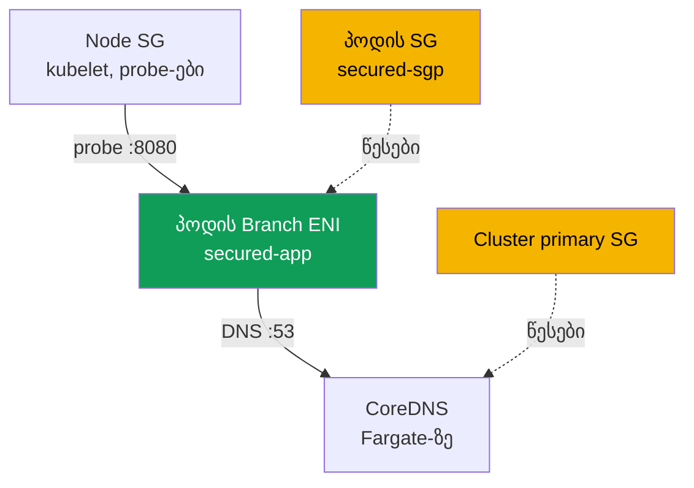
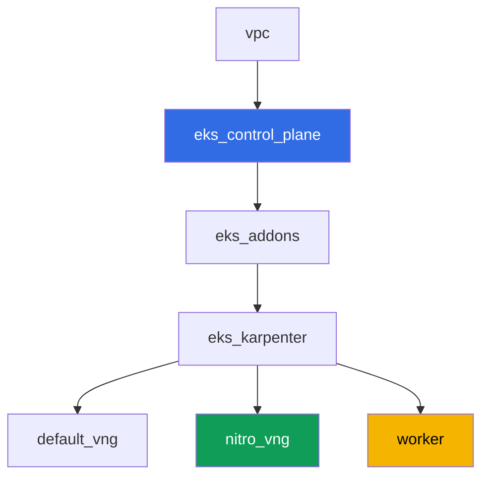

[Русская версия](README_RU.MD) · [Eng version](README.MD) · [Versión en español](README_ES.MD) · [Version française](README_FR.MD) · [Deutsche Version](README_DE.MD) · [繁體中文版](README_TW.MD) · [日本語版](README_JP.MD)

# ლაბა 126 - Security groups for pods: branch ENI, პოდი Running, მაგრამ არა Ready

## აღწერა

ჩვეულებრივ, EC2-ნოუდზე მდებარე პოდი მემკვიდრეობით იღებს ნოუდის security group-ის
წესებს. Security groups for pods ამ მოდელს ცვლის: პოდი იღებს საკუთარ branch ENI-ს და
საკუთარ security group-ების ნაკრებს, ხოლო ნოუდის წესები მასზე უკვე არ მოქმედებს. ამ
ლაბში თქვენ ჩართავთ ამ ფუნქციას, აფიქსირებთ მის ტიპურ სიმპტომს - პოდი `Running`-ია,
მაგრამ არასდროს ხდება `Ready`, და DNS არ რეზოლვდება - და პოულობთ ზუსტად იმ წესებს, რაც
აკლია: inbound kubelet-ის probe-ებისთვის და გამავალი/შემავალი DNS პორტ 53-ზე. ცალკე
თქვენ ფიქსირებთ ხაფანგს, რომლის გამოც ეს სიმპტომი ციმციმებს იმაზე დამოკიდებულებით, სად
ფაქტობრივად აღმოჩნდა CoreDNS.

დავალებები დაწერილია production სტილში: მოკლე ფორმულირება პლუს მიღების კრიტერიუმები.
შემოწმება ავტომატურია, ბრძანებით `check_result`, ხოლო ნაწილი ნაბიჯების AWS CLI-ით
სრულდება თქვენი ლოკალური მანქანიდან (იმავე ანგარიშით, რომლითაც ლაბი გაშალეთ) -
დეტალები „ინფრასტრუქტურის" განყოფილებაშია.

## მიზანი

გავიმეოროთ კურსის ამ თავის მასალა:

- [თავი 46. ქსელური ხარვეზები](../../course/46/ge.md) - security group როგორც
  ქსელური ხარვეზის ფენა

## რას ვქმნით

კლასტერი გაშლილია, როგორც კოდი (ბაზა, როგორც ლაბ 101-ში), დამატებითი NodePool-ით
მხოლოდ Nitro-ინსტანსებზე და ჩართული security groups for pods მხარდაჭერით VPC CNI-ზე.
თქვენ ამატებთ namespace-ს, საკუთარ security group-ს პოდებისთვის და აპლიკაციას, რომელიც
მასზე ეხეთქება.

| ობიექტი | რა არის ეს | რატომ არის ამ ლაბში |
|--------|---------|-------------------|
| NodePool `nitro` | Karpenter NodePool `t` ოჯახის გარეშე | security groups for pods მუშაობს მხოლოდ Nitro-ინსტანსებზე |
| Addon `vpc-cni` `ENABLE_POD_ENI=true`-ით | managed addon-ის კონფიგურაცია | ჩართავს trunk interface-ს ნოუდებზე |
| Namespace `eks-126` | კლასტერის სექცია ლაბის დატვირთვისთვის | რესურსებს სისტემურისგან განცალკევებით ინახავს |
| Security group პოდებისთვის | იქმნება ხელით, თავიდან არასრული | `Running`, მაგრამ არა `Ready` სიმპტომის წყარო |
| `SecurityGroupPolicy` `secured-sgp` | აკავშირებს SG-ს პოდებთან ლეიბლით `app: secured` | branch ENI-ის მექანიზმი თავად |
| Deployment `secured-app` | აპლიკაცია readiness-probe-ით | აჩვენებს სიმპტომს და მის გამოსწორებას |
| არტეფაქტები `/var/work/tests/artifacts/`-ში | `describe`-ის ჭრილები, DNS-შემოწმებები, განმარტებები | ვფიქსირებთ დიაგნოსტიკის ყველა ნაბიჯს |



## ინფრასტრუქტურა

გარემო გაშლილია AWS-ში (`eu-central-1`) Terragrunt-ის მეშვეობით. ლაბის თითოეული
დირექტორია არის ერთი კომპონენტი საკუთარი `terragrunt.hcl`-ით, რომელიც მიუთითებს საერთო
მოდულზე `terraform/modules/`-ში და დამოკიდებულებებს აცხადებს `dependency` ბლოკებით.

### მოდულები და დამოკიდებულებები

| დირექტორია (კომპონენტი) | მოდული (`terraform/modules/`) | დამოკიდებული | რას ქმნის |
|---------------------|-------------------------------|------------|-------------|
| `vpc` | `vpc_v3` | - | VPC `10.10.0.0/16`, საჯარო და პრივატული ქვექსელები ორ AZ-ში, NAT |
| `ssh-keys` | `ssh-keys` | - | SSH გასაღებების წყვილი სამუშაო მანქანისა და ნოუდებისთვის |
| `eks_control_plane` | `eks_v2_control_plane` | `vpc` | EKS control plane `1.36`, OIDC, security groups |
| `eks_fargate_system` | `eks_v2_fargate` | `vpc`, `eks_control_plane` | Fargate-პროფილი `kube-system`-ისთვის და `karpenter`-ისთვის (აქ მუშაობს CoreDNS) |
| `eks_addons` | `eks_v2_addons` | `eks_control_plane`, `eks_fargate_system` | coredns, kube-proxy, pod-identity, `vpc-cni` `ENABLE_POD_ENI=true`-ით |
| `eks_karpenter` | `eks_v2_karpenter` | `vpc`, `eks_control_plane`, `eks_addons`, `eks_fargate_system` | Karpenter-ის კონტროლერი, ნოუდების IAM-როლი |
| `eks_karpenter_default_vng` | `eks_v2_karpenter_vng` | `vpc`, `eks_control_plane`, `eks_karpenter` | ნაგულისხმევი NodePool `default` (`t` ოჯახით) |
| `eks_karpenter_nitro_vng` | `eks_v2_karpenter_vng` | `vpc`, `eks_control_plane`, `eks_karpenter` | NodePool `nitro`, კატეგორიები `c`/`m`/`r`, თაობა `>4`, taint-ის გარეშე |
| `worker` | `eks_v2_work_pc` | `ssh-keys`, `vpc`, `eks_control_plane`, `eks_karpenter` | სამუშაო მანქანა kubectl-ით, ტესტებით და `check_result`-ით |

დამოკიდებულებების გრაფი (რაც ჯერ ხდება, ის ისრის მიმართულებით უფრო ქვევითაა):



### რატომ არის საჭირო ცალკე NodePool

Security groups for pods მუშაობს მხოლოდ Nitro-ინსტანსებზე - `t` ოჯახი მხარდაჭერილი არ
არის (გადამოწმებული AWS-ის დოკუმენტაციით). ლაბის ნაგულისხმევი NodePool უშვებს `t`
ოჯახს (როგორც ლაბ 101-ში), ამიტომ ამ ლაბისთვის დამატებულია მეორე NodePool `nitro`:
`karpenter.k8s.aws/instance-category In ["c","m","r"]` (ეს უკვე გამორიცხავს `t`-ს,
რადგან კატეგორია ცალკეა) პლუს `instance-generation Gt "4"` როგორც დამატებითი
გარანტია. `nitro`-ს taint არ აქვს - Deployment `secured-app` მასზე ხვდება
toleration-ის გარეშე `nodeSelector: work_type: nitro`-ის მეშვეობით.

### რა არის უკვე ჩართული ინფრასტრუქტურაში და რა უნდა გაკეთდეს ხელით

ლაბის Terraform უკვე მოიცავს AWS-ის დოკუმენტაციის წინაპირობების ნაწილს:

- `ENABLE_POD_ENI=true` addon `vpc-cni`-ის `configuration`-ში
  (`eks_addons/terragrunt.hcl`) - ეს ქმნის ნოუდებზე trunk interface-ს, აღწერით
  `aws-k8s-trunk-eni`.
- `POD_SECURITY_GROUP_ENFORCING_MODE=strict` (ნაგულისხმევი მნიშვნელობა) პლუს
  `init.env.DISABLE_TCP_EARLY_DEMUX=true`. ეს წყვილი შერჩეულია გააზრებულად, განხილვა -
  ქვემოთ.
- NodePool `nitro` `t` ოჯახის გარეშე შექმნილია ცალკე კომპონენტით.

რეჟიმის შესახებ ღირს ცალკე ითქვას, რადგან მასზეა დამოკიდებული, გამრავლდება თუ არა
ლაბის სიმპტომი საერთოდ. ფუნქციას ორი რეჟიმი აქვს, და დოკუმენტაცია განსხვავებას ასე
აღწერს: `standard` რეჟიმში პოდის security group-ის წესები **არ გამოიყენება** ტრაფიკზე
პოდსა და იმავე ნოუდზე მდებარე სერვისებს შორის, `kubelet`-ის ჩათვლით. ეს ნიშნავს, რომ
readiness-probe გაივლის security group-ის მეშვეობითაც, სადაც ერთი inbound-წესიც არ
არსებობს, და სიმპტომის „`Running`, მაგრამ არა `Ready`" მიღება შეუძლებელია
(გადამოწმებული სტენდზე: პოდი მაშინვე ხდებოდა `1/1`). ამიტომ ლაბი მუშაობს `strict`
რეჟიმში, სადაც probe branch ENI-ის მეშვეობით გადის და ემორჩილება პოდის SG-ის წესებს.
ამის ფასია სავალდებულო `DISABLE_TCP_EARLY_DEMUX=true` `aws-node`-ის init-კონტეინერზე:
მის გარეშე `kubelet`-ს პრინციპში არ შეუძლია TCP-კავშირის გახსნა branch ENI-ზე მდებარე
პოდთან, და დავალება 5-ის წესის დამატება არაფერს გამოასწორებდა. `standard` რეჟიმში ეს
ალამი საჭირო არ არის - მაგრამ მასთან ერთად ქრება ლაბის თემაც.

Managed policy `AmazonEKSVPCResourceController` **control plane**-ის IAM-როლზე (არა
ნოუდის როლზე - იხილეთ დავალება 2) მოდულის `terraform-aws-modules/eks/aws` v21-ის
ნაგულისხმევი კონფიგურაციით **არ არის მიმაგრებული** (ის მხოლოდ
`AmazonEKSClusterPolicy`-ს დებს). დამატებითი კლასტერის პოლიტიკებისთვის შესასვლელი
მოდულ `eks_v2_control_plane`-ის ამ ვერსიაში არ არსებობს, და ეს არც ისეთი შესასვლელია,
რომლის დამატება მხოლოდ ერთი ლაბისთვის უსაფრთხოდ იქნებოდა - ამიტომ პოლიტიკის მიმაგრება
ხდება ხელით, ბრძანებით `aws iam attach-role-policy`, დავალება 2-ის ნაწილად, და არა
terraform-ის მეშვეობით.

ყველა დავალება სრულდება სამუშაო მანქანაზე SSH-ის მეშვეობით, როგორც კურსის დანარჩენ
ლაბებში. ამისთვის მოდულ `eks_v2_work_pc`-ს დაემატა უფლებები, რომლებიც მანამდე არ
ჰქონდა: `ec2:CreateSecurityGroup`, `ec2:DeleteSecurityGroup`,
`ec2:AuthorizeSecurityGroupEgress`, `ec2:RevokeSecurityGroupEgress` (inbound წესები
მოდულს უკვე ჰქონდა), `iam:ListAttachedRolePolicies` და ვიწროდ შეზღუდული
`iam:AttachRolePolicy` - მხოლოდ როლებზე `*-cluster-*` და მხოლოდ პოლიტიკით
`AmazonEKSVPCResourceController` `iam:PolicyARN` პირობაში. ბოლო პუნქტის გარეშე
დავალება 2 შეუსრულებელი იქნებოდა, და მისი ავტოშემოწმება ჩავარდებოდა სტუდენტის
ქმედებების მიუხედავად: ტესტი კითხულობს `aws iam list-attached-role-policies`-ს
სამუშაო მანქანიდან, ხოლო მას ამ გამოძახებაზე უფლება არ ჰქონდა.

## გაშლა

```bash
TASK=126 make run_eks_task
```

გაშლა გრძელდება დაახლოებით 15-20 წუთი. გამოტანილში მოძებნეთ ხაზი სამუშაო მანქანასთან
SSH კავშირით და დაუკავშირდით მას. kubectl იქ უკვე კონფიგურირებულია სწორ კლასტერზე.

სასარგებლო ბრძანებები სამუშაო მანქანაზე:

```bash
time_left       # რამდენი დრო დარჩა გარემოს
check_result    # გადამოწმეთ გამოსავალი
```

> სტენდის უსაფრთხოება. `env.hcl`-ში ჩართულია `ssh_password_enable = true` და
> `access_cidrs = ["0.0.0.0/0"]` - ეს კომფორტულია სასწავლო გარემოსთვის, მაგრამ
> production-ში ასე არ შეიძლება. კურსის სტანდარტების მიხედვით სამუშაო მანქანებზე
> წვდომა ხდება AWS SSM Session Manager-ის მეშვეობით, საჯარო SSH პორტების გარეშე,
> ხოლო `access_cidrs` კონკრეტულ მისამართებზე იზღუდება. აქ საჯარო SSH დარჩენილია
> მხოლოდ გაშვების გასამარტივებლად.

## დავალებები

---
|        **1**        | **Namespace ლაბის დატვირთვისთვის**                              |
| :-----------------: | :---------------------------------------------------------- |
| რას ვაკეთებთ          | შექმენით namespace `eks-126`. ლაბის ყველა ობიექტი მასში იქმნება. |
| მიღების კრიტერიუმები    | - namespace `eks-126` არსებობს. |
---
|        **2**        | **Security groups for pods-ის წინაპირობების შემოწმება**           |
| :-----------------: | :---------------------------------------------------------- |
| რას ვაკეთებთ          | გადამოწმეთ AWS-ის დოკუმენტაციის ორივე წინაპირობა. პირველ რიგში, გაარკვიეთ control plane-ის IAM-როლის სახელი (`aws eks describe-cluster --name <cluster> --query cluster.roleArn`) და `aws iam list-attached-role-policies --role-name <role>`-ის მეშვეობით ნახეთ, მიმაგრებულია თუ არა მასზე `AmazonEKSVPCResourceController`; ნაგულისხმევად ის იქ არ არის - მიმაგრეთ ბრძანებით `aws iam attach-role-policy`. პოლიტიკა მიმაგრდება ზუსტად control plane-ის როლზე, არა ნოუდის როლზე: branch ENI-ს ქმნის და შლის კონტროლერი EKS-ის მხარეს. მეორე რიგში, შეასრულეთ `kubectl describe daemonset aws-node -n kube-system \| grep -E 'ENABLE_POD_ENI\|POD_SECURITY_GROUP_ENFORCING_MODE\|DISABLE_TCP_EARLY_DEMUX'` - ეს სამი მნიშვნელობა ლაბის terraform-კონფიგურაციით უკვე დაყენებულია, გაარკვიეთ, რატომ არის საჭირო თითოეული (იხილეთ „ინფრასტრუქტურის" განყოფილება). კლასტერის სახელი აიღეთ kubeconfig-იდან: `kubectl config current-context \| awk -F/ '{print $NF}'`. შეინახეთ ორივე დამადასტურებელი ჩანაწერი ფაილში `/var/work/tests/artifacts/2/prereqs.txt`. |
| მიღების კრიტერიუმები    | - ფაილი არ არის ცარიელი, შეიცავს `AmazonEKSVPCResourceController` და `ENABLE_POD_ENI`-ს;<br/>- პოლიტიკა რეალურად მიმაგრებულია control plane-ის როლზე (გადამოწმებულია ავტოტესტით `aws iam list-attached-role-policies`-ის მეშვეობით). |
---
|        **3**        | **არასრული security group და SecurityGroupPolicy**            |
| :-----------------: | :---------------------------------------------------------- |
| რას ვაკეთებთ          | შექმენით security group ლაბის VPC-ში (`aws ec2 create-security-group`) და არ დაამატოთ მას ერთი წესიც: ახალ SG-ს აქვს მხოლოდ AWS-ის ნაგულისხმევი allow-all egress და ნული inbound-წესი - ეს ზუსტად ის მდგომარეობაა, რომელიც სიმპტომს გამოიწვევს. ტეგი `karpenter.sh/discovery=<კლასტერის სახელი>` მასზე არ დაწეროთ (თუ არა, ის EC2NodeClass-ის მიერ ნოუდის SG-დ იქნება არჩეული - ამ ლაბისთვის საჭირო არ არის ცალკე SG მხოლოდ პოდებისთვის). `eks-126`-ში შექმენით `SecurityGroupPolicy` `secured-sgp` `podSelector.matchLabels.app: secured`-ით, რომელიც ამ SG-ზე მიუთითებს. შეინახეთ მისი ID ფაილში `/var/work/tests/artifacts/3/sg_id.txt`. |
| მიღების კრიტერიუმები    | - `SecurityGroupPolicy` `secured-sgp` `eks-126`-ში არსებობს და მიუთითებს ფაილში მითხოვილ SG-ზე;<br/>- ფაილი `3/sg_id.txt` არ არის ცარიელი და შეიცავს `sg-`-ს. |
---
|        **4**        | **სიმპტომი: Running, მაგრამ არასდროს Ready**                    |
| :-----------------: | :---------------------------------------------------------- |
| რას ვაკეთებთ          | `eks-126`-ში შექმენით Deployment `secured-app` (image `viktoruj/ping_pong:latest`, `1` რეპლიკა, `containerPort` და `readinessProbe.httpGet` პორტ `8080`-ზე), ლეიბლით `app: secured` და `nodeSelector`-ით `work_type: nitro` (toleration საჭირო არ არის - NodePool `nitro`-ს taint არ აქვს). პოდი გაეშვება და მოხვდება branch ENI-ზე თქვენი SG-ით, მაგრამ `kubelet`-ის probe-ები მასთან არ მიდის - პოდი ჩერდება `0/1 Ready`-ზე ისეთი event-ით, როგორიც არის `Readiness probe failed: Get "http://<პოდის ip>:8080/": context deadline exceeded`. გზადაგზა დარწმუნდით, რომ პოდი ნამდვილად branch ENI-ზეა: მას გამოეჩინა ანოტაცია `vpc.amazonaws.com/pod-eni` და ლიმიტი `vpc.amazonaws.com/pod-eni: 1`, ხოლო `aws ec2 describe-network-interfaces --filters Name=group-id,Values=<თქვენი SG>` აჩვენებს ინტერფეისს `InterfaceType: branch`-ით. შეინახეთ `kubectl describe pod` (მთლიანი გამოტანილი, `Events`-ის ჩათვლით) ფაილში `/var/work/tests/artifacts/4/pod_not_ready.txt`. |
| მიღების კრიტერიუმები    | - Deployment `secured-app` არსებობს, image `viktoruj/ping_pong`, ლეიბლი `app: secured`;<br/>- ფაილი `4/pod_not_ready.txt` არ არის ცარიელი და შეიცავს `Readiness probe failed` ან `Unhealthy`-ს (სიმპტომი გამოსწორდება დავალება 5-ში, `check_result`-ის მომენტისთვის პოდი შეიძლება უკვე `Ready` იყოს). |
---
|        **5**        | **Probe-ების გამოსწორება: inbound წესი ნოუდის SG-დან**                 |
| :-----------------: | :---------------------------------------------------------- |
| რას ვაკეთებთ          | მოძებნეთ Karpenter ნოუდის security group: აიღეთ `providerID` ნოუდისა, რომელზეც `secured-app` მუშაობს, და დაათვალიერეთ `aws ec2 describe-instances --instance-ids <id> --query 'Reservations[0].Instances[0].SecurityGroups'`. დაამატეთ პოდის SG-ში inbound-წესი TCP `8080`-ისთვის `--source-group <ნოუდის SG>`-ით. Probe შემდეგივ ციკლში გაივლის, პოდი `1/1 Ready` ხდება რამდენიმე წამში. შეინახეთ საბოლოო `kubectl get pod -n eks-126 -l app=secured` ფაილში `/var/work/tests/artifacts/5/pod_ready.txt`. |
| მიღების კრიტერიუმები    | - Deployment `secured-app`-ის `readyReplicas` უტოლდება `1`-ს;<br/>- ფაილი `5/pod_ready.txt` არ არის ცარიელი და შეიცავს `1/1`-ს. |
---
|        **6**        | **DNS-ის დიაგნოსტიკა და გამოსწორება: egress და საპასუხო ingress**    |
| :-----------------: | :---------------------------------------------------------- |
| რას ვაკეთებთ          | image `viktoruj/ping_pong`-ს არც შელი აქვს, არც `wget` (`kubectl exec` დააბრუნებს `executable file not found`-ს), ამიტომ DNS-ის შესამოწმებლად აწიეთ ცალკე პოდი `busybox` `eks-126`-ში ლეიბლით `app: secured` და `nodeSelector: work_type: nitro`-ით - ლეიბლი მნიშვნელოვანია, თუ არა `secured-sgp` მასზე არ მოქმედებს და შემოწმება სხვა რამეზე გამოვიდის. გაუშვით მასში `nslookup kubernetes.default.svc.cluster.local` და მიღებთ `connection timed out; no servers could be reached`-ს. ახლა მოძებნეთ, ზუსტად სად ეკარგება პაკეტი: თქვენ SG-ს აქვს ნაგულისხმევი allow-all egress, ესე იგი მოთხოვნა გადის, სამაგიეროდ მიმღები მხარის security group-ს მისთვის არავითარი წესი არ აქვს. CoreDNS ამ ლაბში Fargate-ზეა და ცხოვრობს **cluster primary security group**-ის მიღმა (`aws eks describe-cluster --query cluster.resourcesVpcConfig.clusterSecurityGroupId`). დაამატეთ მასზე inbound `53` TCP და `53` UDP `--source-group <პოდის SG>`-ით და გაიმეორეთ `nslookup` - რეზოლვინგი გაივლის. შემდეგ გააკეთეთ მეორე ნაბიჯი, მინიმალური უფლებების პრინციპით: მოაცილეთ პოდის SG-ს ნაგულისხმევი allow-all egress და მის ნაცვლად დაამატეთ ცხადი egress `53` TCP და UDP cluster primary SG-ისკენ - DNS მუშაობას გააგრძელებს. შეინახეთ ორივე მდგომარეობა და განმარტება, თუ რომელ მხარეს რომელი წესია საჭირო (გამოიყენეთ სიტყვა `inbound` ან `ingress`), ფაილში `/var/work/tests/artifacts/6/dns_fix.txt`. |
| მიღების კრიტერიუმები    | - ფაილი `6/dns_fix.txt` არ არის ცარიელი, შეიცავს `53`-ს და განხილვას იმისა, რომ წესი საჭიროა მიმღები მხარის inbound-ზე (`inbound` ან `ingress`);<br/>- ლეიბლის `app: secured`-ის მქონე პოდი რეზოლვს `kubernetes.default.svc.cluster.local`-ს (დასტურდება არტეფაქტით). |
---
|        **7**        | **ერთი ნოუდი, სხვადასხვა security group: რა ხდება რეალურად** |
| :-----------------: | :---------------------------------------------------------- |
| რას ვაკეთებთ          | გამოცდით პრაქტიკულად, მუშაობს თუ არა SG-ის წესები ორ პოდს შორის, რომლებსაც ერთსა და იმავე ნოუდზე განსხვავებული security group აქვთ. შექმენით მეორე security group (მაგალითად `eks-task126-other-pod-sg`), მეორე `SecurityGroupPolicy` `other-sgp` ლეიბლისთვის `app: other`, და გაუშვით პოდი `busybox` ამ ლეიბლით, დაუსხოთ `nodeName`-ის მეშვეობით ზუსტად იმ ნოუდზე, სადაც `secured-app` მუშაობს. მისგან მიმართეთ `secured-app`-ის პოდის IP-ს პორტ `8080`-ზე (`wget -T 10 -qO- http://<ip>:8080/`). გააკეთეთ ეს ორჯერ: ჯერ დაშვების წესის გარეშე - მიღებთ `download timed out`-ს, შემდეგ დაამატეთ `secured-app`-ის SG-ში inbound `8080` `--source-group <მეორე SG>`-ით და გაიმეორეთ - მოთხოვნა გაივლის. დასკვნა, რომელიც არტეფაქტში უნდა ჩაწეროთ: `strict` რეჟიმში პოდის SG-ის წესები ერთი ნოუდის შიგნითაც გამოიყენება, ამიტომ ეს წესით ლაგდება. და ცალკე ჩაიწერეთ კონტრასტი `standard` რეჟიმთან: იქ, AWS-ის დოკუმენტაციის მიხედვით, SG-ის წესები არ გამოიყენება ერთ ნოუდზე მდებარე პოდებსა და სერვისებს შორის ტრაფიკზე, ხოლო სხვადასხვა SG-ის მქონე პოდები ერთ ნოუდზე საერთოდ არ ურთიერთობენ - და ეს წესით არ ლაგდება. შეინახეთ ორივე გაშვება, `kubectl get pod -o wide`-ის გამოტანილი ორივე პოდისთვის და განმარტება ფაილში `/var/work/tests/artifacts/7/same_node_trap.txt`. |
| მიღების კრიტერიუმები    | - ფაილი `7/same_node_trap.txt` არ არის ცარიელი;<br/>- შეიცავს `secured-app`-ის ნოუდის სახელს, გამოსწორებამდე მდგომარეობას (`timed out`) და განხილვას რეჟიმებს `strict` და `standard` შორის განსხვავებისა. |
---

### სამი დასკვნა, ღირს, თან წაიღოთ

ყველაფერი ქვემოთ გადამოწმებულია ცოცხალ სტენდზე და ეწინააღმდეგება ამ თემის
გავრცელებულ გადმოცემებს.

**სიმპტომი დამოკიდებულია რეჟიმზე, არა წესების სიზუსტეზე.** `strict`-ში `kubelet`-ის
probe branch ENI-ის მეშვეობით გადის და ემორჩილება პოდის SG-ის წესებს - აქედან
`Readiness probe failed: context deadline exceeded` და გამოსწორება ერთი
inbound-წესით. `standard`-ში იმავე პოდი იმავე ცარიელი security group-ით მაშინვე
ხდება `Ready`: წესები ნოუდის შიგნით ტრაფიკზე არ გამოიყენება. სანამ წესებში შეცდომას
ეძებთ, ნახეთ `POD_SECURITY_GROUP_ENFORCING_MODE` `aws-node`-ზე.

**პოდის egress თითქმის არასდროს არის დამნაშავე.** ახალ security group-ს აქვს
ნაგულისხმევი allow-all egress, ამიტომ მოთხოვნა გადის. DNS ტყდება მეორე მხარეს:
cluster primary security group-ს, რომლის მიღმაც ცხოვრობს CoreDNS, არ აქვს inbound
წესი პოდის SG-სთვის. წესი ზუსტად იქ არის საჭირო, და ერთი კმარა - security group
stateful-ია, პასუხი დაშვებულ მოთხოვნაზე ცალკე წესის გარეშე ბრუნდება. პოდისთვის
მთლიანი გამავალი ტრაფიკის დაშვება ამისთვის საჭირო არ არის: egress-ის `53`-მდე
შევიწროების შემდეგ DNS მუშაობას აგრძელებს (დავალება 6, მეორე ნაბიჯი).

**საერთო ნოუდი ხელს არ უშლის, სანამ რეჟიმი `strict`-ია.** დოკუმენტირებული
შეზღუდვა სხვადასხვა security group-ის მქონე პოდების შესახებ ერთ ნოუდზე ეხება
`standard` რეჟიმს. `strict`-ში ორი ასეთი პოდი ჯერ არ ერთვება, ხოლო წესის დამატების
შემდეგ ერთვება - ესე იგი გადაწყვეტს წესი, არა ტოპოლოგია. შეზღუდვის შესახებ ცოდნა
მაინც საჭიროა: `standard`-ში ეს იგივე სიტუაცია წესით არ ლაგდება, და ეს ცვლის
დიაგნოსტიკის გეგმას.

## შედეგის შემოწმება

სამუშაო მანქანაზე გაუშვით ავტომატური შემოწმება:

```bash
check_result
```

სკრიპტი გაუშვებს ტესტებს და გამოაჩენს დასრულებული დავალებების პროცენტს. ნაწილი
შემოწმებები ხედავენ AWS API-ს, არა მხოლოდ Kubernetes-ის ობიექტებს: მიმაგრებულია
თუ არა პოლიტიკა კლასტერის როლზე, არსებობს თუ არა security group `SecurityGroupPolicy`-დან.
ცალკე შემოწმება აწევს საკუთარ პოდს ლეიბლით `app: secured` და მოითხოვს, DNS მასში
რეალურად რეზოლვდებოდეს - მისთვის არტეფაქტი საკმარისი არ არის.

## გამოსავალი

ეტალონური გამოსავალი: [worker/files/solutions/1_GE.MD](worker/files/solutions/1_GE.MD)

## კლასტერისა და რესურსების წაშლა

> **აქ დამტანის რიგი კრიტიკულია, სხვაგვარად `destroy` არ დასრულდება.** ამ ლაბში
> თქვენ ხელით შექმენით security group `eks-task126-secured-pod-sg` პირდაპირ სტენდის
> VPC-ში (ის არ არსებობს terraform-ის state-ში), დაამატეთ წესები **cluster primary
> security group**-ზე, რომელსაც terraform ფლობს, და ჩართეთ security groups for pods -
> ესე იგი პოდებისთვის იქმნებოდა **branch ENI**. ეს სამი პუნქტი თითოეული ცალკე
> ბლოკავს წაშლას: გარეშე security group არ აძლევს VPC-ს წაშლის უფლებას, ერთი SG-ის
> მიმართვა მეორეზე არ აძლევს სამიზნეს წაშლის უფლებას, ხოლო ცოცხალი branch ENI ფლობს
> ორივეს - SG-საც და ქვექსელსაც. სიმპტომია `Still destroying...` security group-ზე,
> VPC-ზე ან Internet Gateway-ზე.

```bash
# 1. მოაცილეთ დატვირთვა SecurityGroupPolicy-იდან, რომ branch ENI-ები გათავისუფლდეს
kubectl delete namespace eks-126 --ignore-not-found

# 2. დაიცადეთ, სანამ branch ENI-ები გაქრება, და Karpenter მოაცილებს თავის EC2-ნოუდებს
SG_ID=$(aws ec2 describe-security-groups \
  --filters "Name=group-name,Values=eks-task126-secured-pod-sg" \
  --query 'SecurityGroups[0].GroupId' --output text)
while [ "$(aws ec2 describe-network-interfaces --filters "Name=group-id,Values=${SG_ID}" \
    --query 'length(NetworkInterfaces)' --output text)" != "0" ]; do
  echo "branch ENI-ები ჯერ კიდევ ცოცხალია, ველოდებით..."; sleep 15
done
while kubectl get nodes --no-headers 2>/dev/null | grep -qv fargate; do
  echo "Karpenter-ის EC2-ნოუდი ჯერ კიდევ ცოცხალია, ველოდებით..."; sleep 15
done

# 3. მოაცილეთ წესები, რომლებიც დაამატეთ cluster primary SG-ში საკუთარ SG-ზე მითხოვით
CLUSTER=$(kubectl config current-context | awk -F/ '{print $NF}')
CLUSTER_PRIMARY_SG=$(aws eks describe-cluster --name "$CLUSTER" \
  --query 'cluster.resourcesVpcConfig.clusterSecurityGroupId' --output text)
aws ec2 revoke-security-group-ingress --group-id "$CLUSTER_PRIMARY_SG" \
  --protocol tcp --port 53 --source-group "$SG_ID"
aws ec2 revoke-security-group-ingress --group-id "$CLUSTER_PRIMARY_SG" \
  --protocol udp --port 53 --source-group "$SG_ID"

# 4. წაშალეთ ორივე საკუთარი security group. რიგი მნიშვნელოვანია: ჯერ მოაცილეთ
#    პირველი SG-ის მითხოვა მეორეზე, სხვაგვარად მეორე არ წაიშლება
SG2_ID=$(aws ec2 describe-security-groups \
  --filters "Name=group-name,Values=eks-task126-other-pod-sg" \
  --query 'SecurityGroups[0].GroupId' --output text)
aws ec2 revoke-security-group-ingress --group-id "$SG_ID" \
  --protocol tcp --port 8080 --source-group "$SG2_ID"
aws ec2 delete-security-group --group-id "$SG2_ID"
aws ec2 delete-security-group --group-id "$SG_ID"
```

პოლიტიკის `AmazonEKSVPCResourceController`, რომელიც დავალება 2-ში მიამაგრეთ control
plane-ის როლზე, ხელით მოცილება საჭირო არ არის: upstream-მოდული ამ როლს ქმნის
`force_detach_policies = true`-ით (გადამოწმებულია მოდულის კოდში), ამიტომ terraform
თავად მოაცილებს მას და როლის წაშლა `DeleteConflict`-ში არ დაეჯახება.

```bash
TASK=126 make delete_eks_task
```

თუ `destroy` მაინც სადმე გაჭედა, მოძებნეთ დამტანი იმავე პრინციპით: ვინ იყენებს SG-ს,
რომელი SG-ები მიუთხოვენ მას წესებში, და არ არსებობს თუ არა მიშვებული ENI (მათ შორის
`branch` security groups for pods-იდან და მეორადი VPC CNI-დან):

```bash
aws ec2 describe-network-interfaces --filters "Name=group-id,Values=<sg-id>" \
  --query 'NetworkInterfaces[].[NetworkInterfaceId,Status,InterfaceType,Description]' --output table
aws ec2 describe-security-groups --filters "Name=ip-permission.group-id,Values=<sg-id>" \
  --query 'SecurityGroups[].[GroupId,GroupName]' --output table
aws ec2 describe-network-interfaces --filters Name=status,Values=available \
  --query 'NetworkInterfaces[].[NetworkInterfaceId,Description,Groups[0].GroupName]' --output table
```
