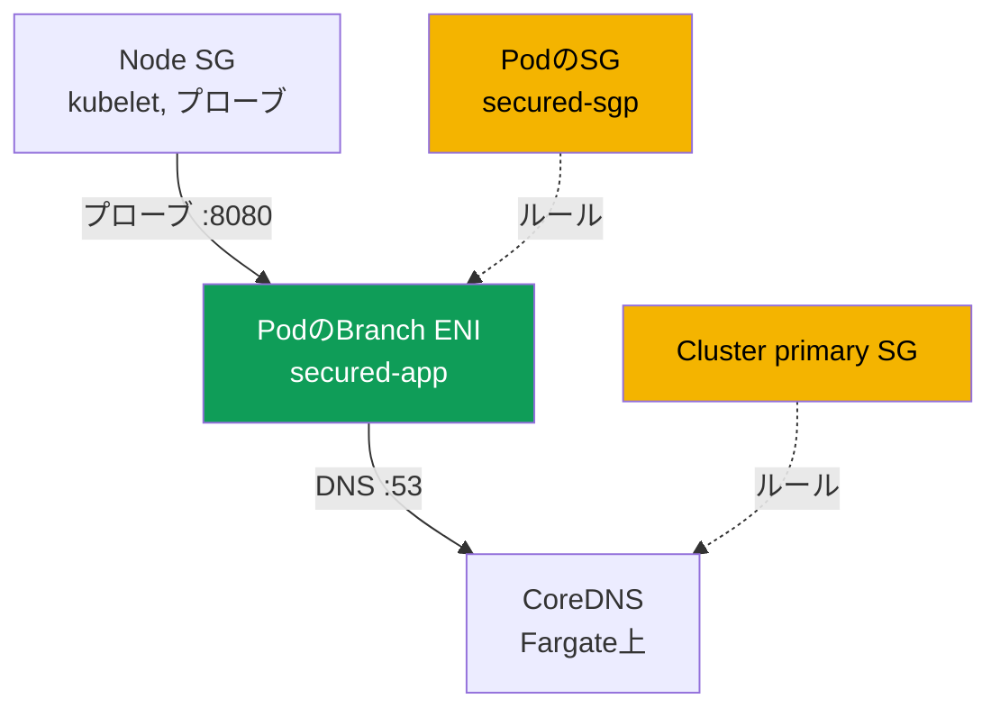
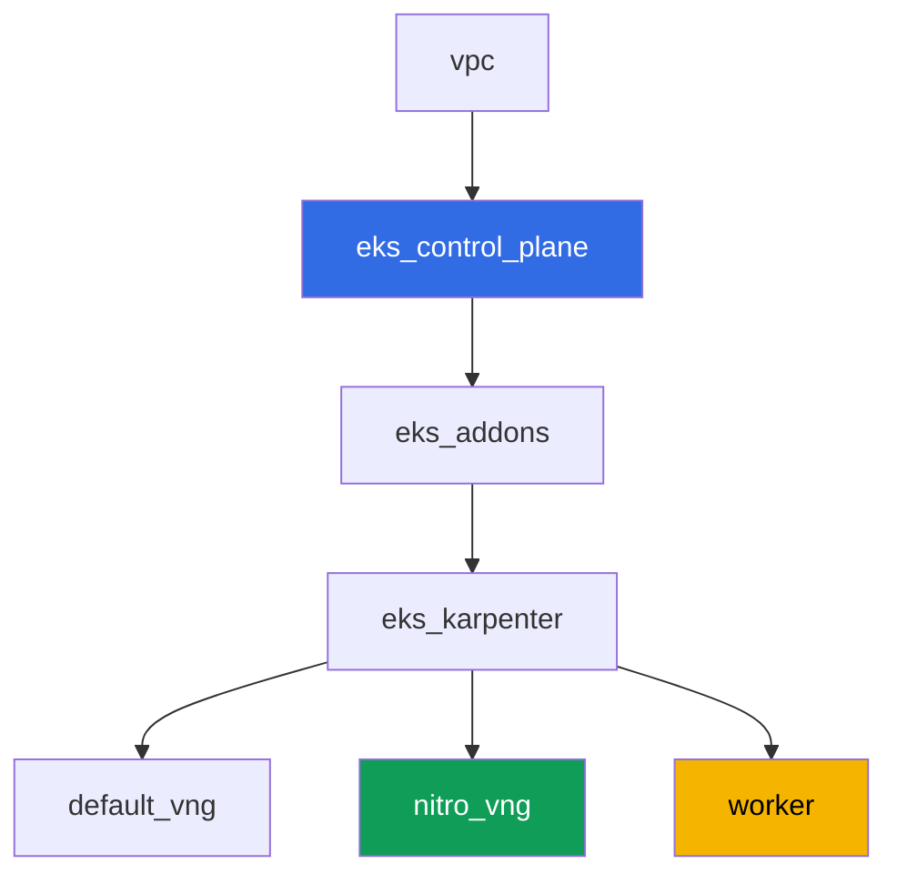

[Русская версия](README_RU.MD) · [Eng version](README.MD) · [Versión en español](README_ES.MD) · [Version française](README_FR.MD) · [Deutsche Version](README_DE.MD) · [ქართული ვერსია](README_GE.MD) · [繁體中文版](README_TW.MD)

# ラボ126 - Security groups for pods: branch ENI、PodはRunningだがReadyにならない

## 説明

通常、EC2ノード上のPodはノードのsecurity groupのルールを継承します。Security groups for
podsはこのモデルを変えます。Podは自分専用のbranch ENIと専用のsecurity groupのセットを受け
取り、ノードのルールはもはやPodには適用されません。このラボではこの機能を有効にし、その典
型的な症状 - Podが`Running`なのに決して`Ready`にならず、DNSも解決できない - を捕まえ、不足
しているルールをちょうど見つけ出します。kubeletのプローブ用のinbound、そして53番ポートの
DNSのegress/ingressです。さらに、CoreDNSが物理的にどこに配置されるかによってこの症状が現
れたり消えたりする、というトラップも記録します。

課題はプロダクションスタイルです。短い問題設定と受け入れ基準がセットになっています。チェッ
クは`check_result`コマンドによる自動チェックで、AWS CLIを使うステップの一部はローカルマシ
ンから(ラボをデプロイしたのと同じアカウントで)実行します。詳細は「インフラストラクチャ」セ
クションを参照してください。

## 目的

コースの章の内容を定着させます:

- [第46章。ネットワーク障害](../../course/46/ru.md) - ネットワーク障害の一層としてのsecurity
  group

## 作成するもの

クラスタはコードとしてデプロイされます(ラボ101と同じベース)。Nitroインスタンスのみを対象と
する追加のNodePoolがあり、VPC CNIでsecurity groups for podsのサポートが有効になっていま
す。あなたはnamespace、Pod用の独自のsecurity group、そしてそれに突き当たるアプリケーショ
ンを追加します。

| オブジェクト | それは何か | このラボでの役割 |
|--------|---------|-------------------|
| NodePool `nitro` | `t`ファミリーを含まないKarpenter NodePool | security groups for podsはNitroインスタンスでのみ動作する |
| `ENABLE_POD_ENI=true`を設定したアドオン`vpc-cni` | managed addonの設定 | ノード上でtrunk interfaceを有効にする |
| Namespace `eks-126` | ラボの負荷用のクラスタの区画 | システムリソースと分離して管理する |
| Pod用security group | 手動で作成し、最初は不完全な状態 | `Running`だが`Ready`にならない症状の原因 |
| `SecurityGroupPolicy` `secured-sgp` | `app: secured`のPodにSGを結びつける | branch ENIの仕組み自体 |
| Deployment `secured-app` | readinessプローブを持つアプリケーション | 症状とその修正を実演する |
| `/var/work/tests/artifacts/`内のアーティファクト | `describe`のスナップショット、DNSチェック、説明 | 診断の各ステップを記録する |



## インフラストラクチャ

環境はTerragruntを通じてAWS(`eu-central-1`)にデプロイされます。ラボの各ディレクトリは1つの
コンポーネントで、それぞれ独自の`terragrunt.hcl`を持ち、`terraform/modules/`内の共通モジュ
ールを参照し、`dependency`ブロックで依存関係を宣言します。

### モジュールと依存関係

| ディレクトリ(コンポーネント) | モジュール(`terraform/modules/`) | 依存先 | 作成するもの |
|---------------------|-------------------------------|------------|-------------|
| `vpc` | `vpc_v3` | - | VPC `10.10.0.0/16`、2つのAZにおけるパブリック/プライベートサブネット、NAT |
| `ssh-keys` | `ssh-keys` | - | worker機とノード用のSSH鍵ペア |
| `eks_control_plane` | `eks_v2_control_plane` | `vpc` | EKS control plane `1.36`、OIDC、security groups |
| `eks_fargate_system` | `eks_v2_fargate` | `vpc`, `eks_control_plane` | `kube-system`と`karpenter`用のFargateプロファイル(ここでCoreDNSが動作する) |
| `eks_addons` | `eks_v2_addons` | `eks_control_plane`, `eks_fargate_system` | coredns、kube-proxy、pod-identity、`ENABLE_POD_ENI=true`の`vpc-cni` |
| `eks_karpenter` | `eks_v2_karpenter` | `vpc`, `eks_control_plane`, `eks_addons`, `eks_fargate_system` | Karpenterコントローラ、ノードのIAMロール |
| `eks_karpenter_default_vng` | `eks_v2_karpenter_vng` | `vpc`, `eks_control_plane`, `eks_karpenter` | デフォルトのNodePool `default`(`t`ファミリーを含む) |
| `eks_karpenter_nitro_vng` | `eks_v2_karpenter_vng` | `vpc`, `eks_control_plane`, `eks_karpenter` | NodePool `nitro`、カテゴリ`c`/`m`/`r`、世代`>4`、taintなし |
| `worker` | `eks_v2_work_pc` | `ssh-keys`, `vpc`, `eks_control_plane`, `eks_karpenter` | kubectl、テスト、`check_result`を備えたworker機 |

依存関係グラフ(矢印の下にあるものほど先に適用されます):



### なぜ別のNodePoolが必要なのか

Security groups for podsはNitroインスタンスでのみ動作します - `t`ファミリーはサポートされ
ません(AWSドキュメントで確認済み)。ラボのデフォルトNodePoolは`t`ファミリーを許可していま
す(ラボ101と同様)。そのため、このラボでは2つ目のNodePool `nitro`を追加しました:
`karpenter.k8s.aws/instance-category In ["c","m","r"]`(カテゴリが別なのでこれだけで`t`は
除外されます)に加えて、追加の保証として`instance-generation Gt "4"`を設定しています。
`nitro`にはtaintがないため、Deployment `secured-app`は`nodeSelector: work_type: nitro`だ
けでtolerationなしにそこへスケジュールされます。

### インフラにすでに含まれているものと、手動で行う必要があるもの

ラボのTerraformはすでにAWSドキュメントの前提条件の一部を含んでいます:

- アドオン`vpc-cni`の`configuration`内の`ENABLE_POD_ENI=true`(`eks_addons/terragrunt.hcl`)
  - これによりノード上に`aws-k8s-trunk-eni`という説明のtrunk interfaceが作成されます。
- `POD_SECURITY_GROUP_ENFORCING_MODE=strict`(デフォルト値)に加えて
  `init.env.DISABLE_TCP_EARLY_DEMUX=true`。このペアは意図的に選ばれています。詳細は以下で
  説明します。
- `t`ファミリーを含まないNodePool `nitro`が別コンポーネントとして作成されています。

モードについては別途説明する価値があります。ラボの症状がそもそも再現するかどうかはこのモー
ドに依存するからです。この機能には2つのモードがあり、ドキュメントでは次のように違いが説明
されています。`standard`モードでは、Podのsecurity groupのルールは同じノード上のPodとサー
ビス間のトラフィック(`kubelet`を含む)には**適用されません**。つまりreadinessプローブは
inboundルールが1つもないsecurity groupでも通ってしまい、「`Running`だが`Ready`にならない」
症状は発生しません(実機で確認済み: Podは即座に`1/1`になりました)。そのため、このラボは
`strict`モードで動作します。ここではプローブはbranch ENIを経由し、PodのSGのルールに従いま
す。その代償として、initコンテナ`aws-node`での`DISABLE_TCP_EARLY_DEMUX=true`が必須になり
ます。これがないと`kubelet`はそもそもbranch ENI上のPodへTCP接続を開けず、課題5で追加する
ingressルールは何も修正しないことになります。`standard`モードではこのフラグは不要ですが、
それと一緒にラボのテーマそのものも失われます。

**control plane**のIAMロール(ノードのロールではありません - 課題2参照)に対するマネージド
ポリシー`AmazonEKSVPCResourceController`は、モジュール`terraform-aws-modules/eks/aws` v21
ではデフォルトでは**アタッチされません**(このモジュールがアタッチするのは
`AmazonEKSClusterPolicy`だけです)。このバージョンの`eks_v2_control_plane`モジュールには追
加のクラスタポリシー用の入力がなく、また1つのラボのためだけに安全に追加できる入力でもあり
ません。そのため、このポリシーのアタッチはterraformではなく、課題2の一部として
`aws iam attach-role-policy`コマンドで手動で行います。

コースの他のラボと同様、すべての課題はSSH経由でworker機上で実行します。そのために、モジュ
ール`eks_v2_work_pc`にはこれまでなかった権限が追加されました: `ec2:CreateSecurityGroup`、
`ec2:DeleteSecurityGroup`、`ec2:AuthorizeSecurityGroupEgress`、
`ec2:RevokeSecurityGroupEgress`(inboundルールについてはこのモジュールは以前から対応してい
ました)、`iam:ListAttachedRolePolicies`、そして狭く制限された`iam:AttachRolePolicy`
(`*-cluster-*`ロールに対してのみ、かつ`iam:PolicyARN`条件で
`AmazonEKSVPCResourceController`ポリシーに限定)です。最後の項目がなければ課題2は実行不可
能で、その自動チェックは学生の行動とは無関係に失敗していました。テストはworker機から
`aws iam list-attached-role-policies`を実行しますが、この呼び出しに対する権限がなかったた
めです。

## デプロイ

```bash
TASK=126 make run_eks_task
```

デプロイには約15〜20分かかります。出力の中からworker機へのSSH接続の行を見つけて接続してく
ださい。そこでは`kubectl`がすでに対象のクラスタに設定済みです。

worker機上で使える便利なコマンド:

```bash
time_left       # 環境の残り時間
check_result    # 解答をチェックする
```

> 検証環境のセキュリティについて。`env.hcl`では`ssh_password_enable = true`と
> `access_cidrs = ["0.0.0.0/0"]`が有効になっています - これは学習環境としては便利ですが、
> 本番環境でこれを行ってはいけません。コースの標準では、worker機へのアクセスは外部への公開
> SSHポートを使わずAWS SSM Session Manager経由で開き、`access_cidrs`は特定のアドレスに絞り
> 込みます。ここでは起動を簡単にするためだけに公開SSHを残しています。

## 課題

---
|        **1**        | **ラボの負荷用のNamespace**                              |
| :-----------------: | :---------------------------------------------------------- |
| やること          | namespace `eks-126`を作成してください。ラボのすべてのオブジェクトはこの中に作成します。 |
| 受け入れ基準    | - namespace `eks-126`が存在する。 |
---
|        **2**        | **security groups for podsの前提条件の確認**           |
| :-----------------: | :---------------------------------------------------------- |
| やること          | AWSドキュメントにある2つの前提条件を確認してください。まず、control planeのIAMロール名を調べ(`aws eks describe-cluster --name <cluster> --query cluster.roleArn`)、`aws iam list-attached-role-policies --role-name <ロール>`で`AmazonEKSVPCResourceController`がアタッチされているか確認してください。デフォルトではアタッチされていないので、`aws iam attach-role-policy`コマンドでアタッチしてください。このポリシーはノードのロールではなく、control planeのロールに付けます: branch ENIはEKS側のコントローラーが作成・削除します。次に、`kubectl describe daemonset aws-node -n kube-system \| grep -E 'ENABLE_POD_ENI\|POD_SECURITY_GROUP_ENFORCING_MODE\|DISABLE_TCP_EARLY_DEMUX'`を実行してください - この3つの値はラボのterraform構成ですでに設定されていますが、それぞれが何のために必要か理解してください(「インフラストラクチャ」セクション参照)。クラスタ名はkubeconfigから取得します: `kubectl config current-context \| awk -F/ '{print $NF}'`。両方の確認結果をファイル`/var/work/tests/artifacts/2/prereqs.txt`に保存してください。 |
| 受け入れ基準    | - ファイルが空でなく、`AmazonEKSVPCResourceController`と`ENABLE_POD_ENI`を含む;<br/>- ポリシーが実際にcontrol planeのロールにアタッチされている(`aws iam list-attached-role-policies`を使った自動テストで確認)。 |
---
|        **3**        | **不完全なsecurity groupとSecurityGroupPolicy**            |
| :-----------------: | :---------------------------------------------------------- |
| やること          | ラボのVPC内にsecurity groupを作成してください(`aws ec2 create-security-group`)。ただしルールは一つも追加しないでください: 新規作成したSGにはAWSデフォルトのallow-all egressのみがあり、inboundルールはゼロです - まさにこの状態が症状を引き起こします。タグ`karpenter.sh/discovery=<クラスタ名>`は付けないでください(付けるとEC2NodeClassがノード用のSGとして選択してしまいます - このラボにはPod専用の別のSGが必要です)。`eks-126`内に、このSGを参照する`podSelector.matchLabels.app: secured`を持つ`SecurityGroupPolicy` `secured-sgp`を作成してください。そのIDをファイル`/var/work/tests/artifacts/3/sg_id.txt`に保存してください。 |
| 受け入れ基準    | - `eks-126`内に`SecurityGroupPolicy` `secured-sgp`が存在し、ファイル内のSGを参照している;<br/>- ファイル`3/sg_id.txt`が空でなく`sg-`を含む。 |
---
|        **4**        | **症状: RunningだがReadyには絶対にならない**                    |
| :-----------------: | :---------------------------------------------------------- |
| やること          | `eks-126`にDeployment `secured-app`を作成してください(イメージ`viktoruj/ping_pong:latest`、レプリカ`1`、ポート`8080`に対する`containerPort`と`readinessProbe.httpGet`)、ラベル`app: secured`、`nodeSelector` `work_type: nitro`を付けてください(NodePool `nitro`にはtaintがないのでtolerationは不要です)。Podは起動し、あなたのSGを持つbranch ENIに乗りますが、`kubelet`のプローブがそこに届きません - Podは`0/1 Ready`のまま止まり、`Readiness probe failed: Get "http://<Podのip>:8080/": context deadline exceeded`というイベントが出ます。ついでに、Podが実際にbranch ENI上にあることを確認してください: `vpc.amazonaws.com/pod-eni`というアノテーションと`vpc.amazonaws.com/pod-eni: 1`というlimitが付いており、`aws ec2 describe-network-interfaces --filters Name=group-id,Values=<あなたのSG>`は`InterfaceType: branch`のインターフェースを表示します。`kubectl describe pod`の出力全体(`Events`を含む)をファイル`/var/work/tests/artifacts/4/pod_not_ready.txt`に保存してください。 |
| 受け入れ基準    | - Deployment `secured-app`が存在し、イメージが`viktoruj/ping_pong`、ラベルが`app: secured`;<br/>- ファイル`4/pod_not_ready.txt`が空でなく`Readiness probe failed`または`Unhealthy`を含む(これは課題5で修正する前の症状で、`check_result`実行時にはPodはすでに`Ready`になっている可能性があります)。 |
---
|        **5**        | **プローブの修正: ノードSGからのinboundルール**                 |
| :-----------------: | :---------------------------------------------------------- |
| やること          | Karpenterのノードのsecurity groupを見つけてください: `secured-app`が乗っているノードの`providerID`を取得し、`aws ec2 describe-instances --instance-ids <id> --query 'Reservations[0].Instances[0].SecurityGroups'`を確認します。PodのSGに、`--source-group <ノードのSG>`を指定したTCP `8080`のinboundルールを追加してください。次のサイクルでプローブが通り、Podは数秒で`1/1 Ready`になります。最終的な`kubectl get pod -n eks-126 -l app=secured`の出力をファイル`/var/work/tests/artifacts/5/pod_ready.txt`に保存してください。 |
| 受け入れ基準    | - Deployment `secured-app`の`readyReplicas`が`1`である;<br/>- ファイル`5/pod_ready.txt`が空でなく`1/1`を含む。 |
---
|        **6**        | **DNSの診断と修正: egressと戻りのingress**    |
| :-----------------: | :---------------------------------------------------------- |
| やること          | イメージ`viktoruj/ping_pong`にはシェルも`wget`もありません(`kubectl exec`は`executable file not found`を返します)。そのためDNSを確認するには、`eks-126`にラベル`app: secured`と`nodeSelector: work_type: nitro`を持つ別の`busybox`のPodを立ててください - このラベルは重要です。付けないと`secured-sgp`が効かず、確認したいことと違う話になってしまいます。その中で`nslookup kubernetes.default.svc.cluster.local`を実行すると`connection timed out; no servers could be reached`となります。次に、パケットがどこで失われているかを特定してください: あなたのSGにはデフォルトのallow-all egressがあるのでリクエストは出ていきますが、受け側のsecurity groupにはそれに対応するinboundルールがありません。このラボのCoreDNSはFargate上で動き、**cluster primary security group**の内側にあります(`aws eks describe-cluster --query cluster.resourcesVpcConfig.clusterSecurityGroupId`)。そこに`--source-group <PodのSG>`を指定したTCP `53`とUDP `53`のinboundルールを追加し、`nslookup`をやり直してください - 名前解決が動くようになります。その後、最小権限の原則に従って2段目の作業を行ってください: PodのSGからデフォルトのallow-all egressを外し、代わりにcluster primary SGへの明示的なegress `53`(TCPとUDP)を追加します - DNSは動き続けます。両方の状態と、どちら側にどのルールが必要かの説明をファイル`/var/work/tests/artifacts/6/dns_fix.txt`に保存してください。 |
| 受け入れ基準    | - ファイル`6/dns_fix.txt`が空でなく、`53`を含み、受け側の入り口(inbound)にルールが必要であるという分析(`inbound`または「入力」)を含む;<br/>- ラベル`app: secured`のPodが`kubernetes.default.svc.cluster.local`を解決できる(アーティファクトで確認)。 |
---
|        **7**        | **同一ノード、異なるsecurity group: 実際に起きること** |
| :-----------------: | :---------------------------------------------------------- |
| やること          | 同一ノード上の、異なるsecurity groupを持つ2つのPod間でSGのルールが機能するかを実際に確認してください。2つ目のsecurity group(例: `eks-task126-other-pod-sg`)と、ラベル`app: other`用の2つ目の`SecurityGroupPolicy` `other-sgp`を作成し、このラベルを持つ`busybox`のPodを、`nodeName`で`secured-app`が動いている同じノードに配置して起動してください。そこから`secured-app`のPodのIPに対してポート`8080`にアクセスします(`wget -T 10 -qO- http://<ip>:8080/`)。これを2回行ってください: 最初は許可ルールなしで実行し`download timed out`となることを確認し、次に`secured-app`のSGに`--source-group <2つ目のSG>`を指定したinbound `8080`を追加してから再度実行し、今度はリクエストが通ることを確認します。アーティファクトに記録すべき結論: `strict`モードではPodのSGのルールは同一ノード内でも適用されるため、この問題はルールで解決できます。そして`standard`モードとの対比も別に記録してください: AWSドキュメントによれば、そちらでは同一ノード上のPodとサービス間のトラフィックにSGのルールが適用されず、異なるSGを持つPod同士は同一ノード上でも全く通信できません - これはルールでは修正できません。両方の実行結果、両方のPodに対する`kubectl get pod -o wide`の出力、そして説明をファイル`/var/work/tests/artifacts/7/same_node_trap.txt`に保存してください。 |
| 受け入れ基準    | - ファイル`7/same_node_trap.txt`が空でない;<br/>- `secured-app`のノード名、修正前の状態(`timed out`)、そして`strict`と`standard`のモードの違いの分析を含む。 |
---

### 持ち帰るべき3つの結論

以下はすべて実機で確認済みで、このトピックについてよく見られる説明とは異なります。

**症状はルールの正確さではなくモードに依存する。** `strict`では`kubelet`のプローブは
branch ENIを経由し、PodのSGのルールに従います - これが`Readiness probe failed:
context deadline exceeded`の原因であり、1つのinboundルールで修正できます。`standard`で
は同じPodが同じ空のsecurity groupのままでも即座に`Ready`になります: ノード内のトラフィッ
クにはルールが適用されないためです。ルールの誤りを探す前に、`aws-node`の
`POD_SECURITY_GROUP_ENFORCING_MODE`を確認してください。

**Podのegressが原因であることはほとんどない。** 新規のsecurity groupにはデフォルトの
allow-all egressがあるため、リクエストは出ていきます。DNSが壊れるのは別の側です:
CoreDNSが動いているcluster primary security groupに、PodのSGに対するinboundルールがあり
ません。ルールが必要なのはまさにそこであり、それ一つで十分です - security groupはstateful
なので、許可された入力リクエストへの応答は個別のルールなしで戻っていきます。そのために
Podに全てのアウトバウンドトラフィックを許可する必要はありません: egressを`53`だけに絞って
もDNSは動き続けます(課題6、2段目)。

**モードが`strict`である限り、ノードの共有は問題にならない。** 異なるsecurity groupを持つ
Podに関するドキュメント化された制約は`standard`モードに関するものです。`strict`ではその
ような2つのPodは最初は接続できず、ルールを追加した後に接続できるようになります - つまり決
めるのはルールであり、トポロジーではありません。それでもこの制約は知っておく必要があります:
`standard`では同じ状況をルールで解決できず、これによって診断の進め方が変わります。

## 結果の確認

worker機上で自動チェックを実行してください:

```bash
check_result
```

このスクリプトはテストを実行し、完了した課題の割合を表示します。チェックの一部はKubernetes
のオブジェクトだけでなくAWS APIも見ます: ポリシーがクラスタのロールにアタッチされているか、
`SecurityGroupPolicy`のsecurity groupが実在するか、などです。別のチェックは独自にラベル
`app: secured`のPodを立て、そこで実際にDNSが解決できることを要求します - アーティファクト
だけでは不十分です。

## 解答

参考解答: [worker/files/solutions/1_JP.MD](worker/files/solutions/1_JP.MD)

## クラスタとリソースの削除

> **ここではクリーンアップの順序が重要です。そうしないと`destroy`が完了しません。** この
> ラボでは、検証環境のVPC内に手動でsecurity group `eks-task126-secured-pod-sg`を作成し
> (terraformのstateには存在しません)、terraformが管理する**cluster primary security
> group**にルールを追加し、さらにsecurity groups for podsを有効化しました - つまりPod用に
> **branch ENI**が作成されています。この3つはそれぞれ単独で削除をブロックします: 管理外の
> security groupはVPCの削除を妨げ、あるSGから別のSGへの参照は対象の削除を妨げ、生きている
> branch ENIはSGとサブネットの両方を保持し続けます。症状は`Still destroying...`が
> security group、VPC、またはInternet Gatewayで発生することです。

```bash
# 1. branch ENIを解放するためSecurityGroupPolicyから負荷を取り除く
kubectl delete namespace eks-126 --ignore-not-found

# 2. branch ENIが消え、KarpenterがEC2ノードを削除するまで待つ
SG_ID=$(aws ec2 describe-security-groups \
  --filters "Name=group-name,Values=eks-task126-secured-pod-sg" \
  --query 'SecurityGroups[0].GroupId' --output text)
while [ "$(aws ec2 describe-network-interfaces --filters "Name=group-id,Values=${SG_ID}" \
    --query 'length(NetworkInterfaces)' --output text)" != "0" ]; do
  echo "branch ENIがまだ残っています。待機中..."; sleep 15
done
while kubectl get nodes --no-headers 2>/dev/null | grep -qv fargate; do
  echo "KarpenterのEC2ノードがまだ残っています。待機中..."; sleep 15
done

# 3. cluster primary SGに追加した、自分のSGを参照するルールを削除する
CLUSTER=$(kubectl config current-context | awk -F/ '{print $NF}')
CLUSTER_PRIMARY_SG=$(aws eks describe-cluster --name "$CLUSTER" \
  --query 'cluster.resourcesVpcConfig.clusterSecurityGroupId' --output text)
aws ec2 revoke-security-group-ingress --group-id "$CLUSTER_PRIMARY_SG" \
  --protocol tcp --port 53 --source-group "$SG_ID"
aws ec2 revoke-security-group-ingress --group-id "$CLUSTER_PRIMARY_SG" \
  --protocol udp --port 53 --source-group "$SG_ID"

# 4. 自分で作成した両方のsecurity groupを削除する。順序が重要:
#    まず1つ目のSGから2つ目への参照ルールを外す。そうしないと2つ目が削除できない
SG2_ID=$(aws ec2 describe-security-groups \
  --filters "Name=group-name,Values=eks-task126-other-pod-sg" \
  --query 'SecurityGroups[0].GroupId' --output text)
aws ec2 revoke-security-group-ingress --group-id "$SG_ID" \
  --protocol tcp --port 8080 --source-group "$SG2_ID"
aws ec2 delete-security-group --group-id "$SG2_ID"
aws ec2 delete-security-group --group-id "$SG_ID"
```

課題2でcontrol planeのロールにアタッチしたポリシー`AmazonEKSVPCResourceController`は、手
動でデタッチする必要はありません: upstreamモジュールはこのロールを
`force_detach_policies = true`で作成しているため(モジュールのソースで確認済み)、terraform
が自分でこれを外し、ロールの削除が`DeleteConflict`で止まることはありません。

```bash
TASK=126 make delete_eks_task
```

それでも`destroy`がどこかで止まった場合は、同じ考え方で保持者を探してください: どのSGが
そのSGを使用しているか、どのSGがルールでそれを参照しているか、そして孤立したENI
(security groups for podsによる`branch`タイプやVPC CNIによるセカンダリENIを含む)がないか
を確認します:

```bash
aws ec2 describe-network-interfaces --filters "Name=group-id,Values=<sg-id>" \
  --query 'NetworkInterfaces[].[NetworkInterfaceId,Status,InterfaceType,Description]' --output table
aws ec2 describe-security-groups --filters "Name=ip-permission.group-id,Values=<sg-id>" \
  --query 'SecurityGroups[].[GroupId,GroupName]' --output table
aws ec2 describe-network-interfaces --filters Name=status,Values=available \
  --query 'NetworkInterfaces[].[NetworkInterfaceId,Description,Groups[0].GroupName]' --output table
```
