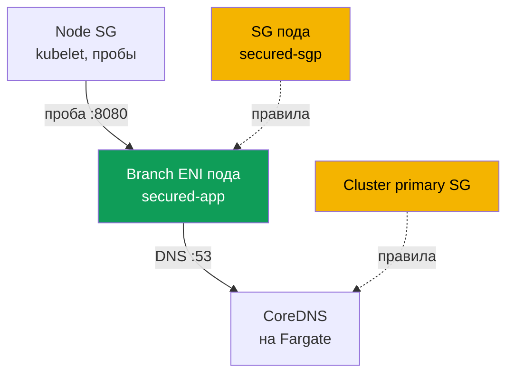
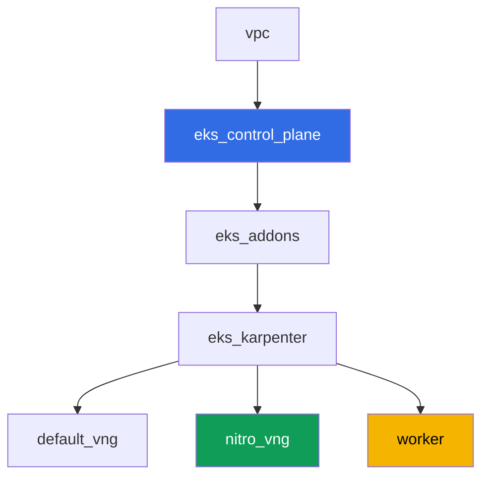

[Eng version](README.MD) · [Versión en español](README_ES.MD) · [Version française](README_FR.MD) · [Deutsche Version](README_DE.MD) · [ქართული ვერსია](README_GE.MD) · [繁體中文版](README_TW.MD) · [日本語版](README_JP.MD)

# Лаба 126 - Security groups for pods: branch ENI, под Running, но не Ready

## Описание

Обычно под на EC2-ноде наследует правила security group ноды. Security groups for
pods меняют эту модель: под получает собственную branch ENI и собственный набор
security group, а правила ноды на него больше не действуют. В этой лабе вы включаете
эту функцию, ловите её типичный симптом - под `Running`, но никогда не `Ready`, и DNS
не резолвится - и находите ровно те правила, которых не хватает: вход для проб
kubelet и исходящий/входящий DNS на порту 53. Отдельно вы фиксируете ловушку, из-за
которой этот симптом мерцает в зависимости от того, где физически оказался CoreDNS.

Задания в продакшн-стиле: короткая постановка плюс критерии приёмки. Проверка -
автоматическая, командой `check_result`, а часть шагов с AWS CLI выполняется с вашей
локальной машины (с тем же аккаунтом, которым вы разворачивали лабу), подробности - в
разделе «Инфраструктура».

## Цель

Закрепить материал главы курса:

- [Глава 46. Сетевые сбои](../../course/46/ru.md) - security group как слой сетевого
  сбоя

## Что мы создаём

Кластер развёрнут как код (база, как в лабе 101), с дополнительным NodePool только на
Nitro-инстансах и включённой поддержкой security groups for pods на VPC CNI. Вы
добавляете namespace, свою security group для подов и приложение, которое на неё
натыкается.

| Объект | Что это | Зачем в этой лабе |
|--------|---------|-------------------|
| NodePool `nitro` | Karpenter NodePool без семейства `t` | security groups for pods работают только на Nitro-инстансах |
| Аддон `vpc-cni` с `ENABLE_POD_ENI=true` | конфигурация managed addon | включает trunk interface на нодах |
| Namespace `eks-126` | раздел кластера под нагрузку лабы | держим ресурсы отдельно от системных |
| Security group для подов | создаётся вручную, изначально неполная | источник симптома `Running`, но не `Ready` |
| `SecurityGroupPolicy` `secured-sgp` | привязывает SG к подам с `app: secured` | сам механизм branch ENI |
| Deployment `secured-app` | приложение с readiness-пробой | демонстрирует симптом и его починку |
| Артефакты в `/var/work/tests/artifacts/` | срезы `describe`, DNS-проверки, объяснения | фиксируем каждый шаг диагностики |



## Инфраструктура

Окружение разворачивается в AWS (`eu-central-1`) через Terragrunt. Каждый каталог
лабы - это один компонент со своим `terragrunt.hcl`, который ссылается на общий модуль
в `terraform/modules/` и объявляет зависимости через блоки `dependency`.

### Модули и зависимости

| Каталог (компонент) | Модуль (`terraform/modules/`) | Зависит от | Что создаёт |
|---------------------|-------------------------------|------------|-------------|
| `vpc` | `vpc_v3` | - | VPC `10.10.0.0/16`, публичные и приватные подсети в двух AZ, NAT |
| `ssh-keys` | `ssh-keys` | - | пара SSH-ключей для рабочей машины и нод |
| `eks_control_plane` | `eks_v2_control_plane` | `vpc` | control plane EKS `1.36`, OIDC, security groups |
| `eks_fargate_system` | `eks_v2_fargate` | `vpc`, `eks_control_plane` | Fargate-профиль для `kube-system` и `karpenter` (здесь работает CoreDNS) |
| `eks_addons` | `eks_v2_addons` | `eks_control_plane`, `eks_fargate_system` | coredns, kube-proxy, pod-identity, `vpc-cni` с `ENABLE_POD_ENI=true` |
| `eks_karpenter` | `eks_v2_karpenter` | `vpc`, `eks_control_plane`, `eks_addons`, `eks_fargate_system` | контроллер Karpenter, IAM-роль нод |
| `eks_karpenter_default_vng` | `eks_v2_karpenter_vng` | `vpc`, `eks_control_plane`, `eks_karpenter` | дефолтный NodePool `default` (со семейством `t`) |
| `eks_karpenter_nitro_vng` | `eks_v2_karpenter_vng` | `vpc`, `eks_control_plane`, `eks_karpenter` | NodePool `nitro`, категории `c`/`m`/`r`, поколение `>4`, без taint |
| `worker` | `eks_v2_work_pc` | `ssh-keys`, `vpc`, `eks_control_plane`, `eks_karpenter` | рабочая машина с kubectl, тестами и `check_result` |

Граф зависимостей (что применяется раньше, то ниже по стрелке):



### Почему нужен отдельный NodePool

Security groups for pods работают только на Nitro-инстансах - семейство `t` не
поддерживается (проверено по документации AWS). Дефолтный NodePool лабы допускает
семейство `t` (как в лабе 101), поэтому для этой лабы добавлен второй NodePool
`nitro`: `karpenter.k8s.aws/instance-category In ["c","m","r"]` (это уже исключает
`t`, так как категория отдельная) плюс `instance-generation Gt "4"` как дополнительная
гарантия. У `nitro` нет taint - Deployment `secured-app` попадает туда без
toleration через `nodeSelector: work_type: nitro`.

### Что уже включено в инфраструктуре, а что нужно доделать руками

Terraform лабы уже включает часть предпосылок из документации AWS:

- `ENABLE_POD_ENI=true` в `configuration` аддона `vpc-cni`
  (`eks_addons/terragrunt.hcl`) - это создаёт на нодах trunk interface с описанием
  `aws-k8s-trunk-eni`.
- `POD_SECURITY_GROUP_ENFORCING_MODE=strict` (значение по умолчанию) плюс
  `init.env.DISABLE_TCP_EARLY_DEMUX=true`. Эта пара выбрана осознанно, разбор - ниже.
- NodePool `nitro` без семейства `t` создан отдельным компонентом.

Про режим стоит сказать отдельно, потому что от него зависит, воспроизведётся ли симптом
лабы вообще. У функции два режима, и документация описывает разницу так: в режиме
`standard` правила security group пода **не применяются** к трафику между подом и
сервисами на той же ноде, включая `kubelet`. Значит readiness-проба пройдёт даже через
security group без единого inbound-правила, и симптом «`Running`, но не `Ready`» получить
нельзя (проверено на стенде: под сразу становился `1/1`). Поэтому лаба работает в режиме
`strict`, где проба идёт через branch ENI и подчиняется правилам SG пода. Плата за это -
обязательный `DISABLE_TCP_EARLY_DEMUX=true` на init-контейнере `aws-node`: без него
`kubelet` не может открыть TCP-соединение к поду на branch ENI в принципе, и добавление
правила из задания 5 ничего не починило бы. В режиме `standard` этот флаг не нужен - но
вместе с ним уходит и тема лабы.

Управляемая политика `AmazonEKSVPCResourceController` на IAM-роли **control plane**
(не роли ноды - см. задание 2) модулем `terraform-aws-modules/eks/aws` v21 по
умолчанию **не присоединяется** (он вешает только `AmazonEKSClusterPolicy`). Входа
для дополнительных политик кластера в модуле `eks_v2_control_plane` этой версии нет,
и это не тот вход, который можно безопасно добавить только для одной лабы - поэтому
присоединение политики выполняется вручную, командой `aws iam attach-role-policy`, как
часть задания 2, а не через terraform.

Все задания выполняются на рабочей машине по SSH, как и в остальных лабах курса. Для
этого в модуль `eks_v2_work_pc` добавлены права, которых там раньше не было:
`ec2:CreateSecurityGroup`, `ec2:DeleteSecurityGroup`, `ec2:AuthorizeSecurityGroupEgress`,
`ec2:RevokeSecurityGroupEgress` (правила inbound модуль умел и до этого),
`iam:ListAttachedRolePolicies` и узко ограниченный `iam:AttachRolePolicy` -
только на роли `*-cluster-*` и только с политикой `AmazonEKSVPCResourceController`
в условии `iam:PolicyARN`. Без последнего пункта задание 2 было невыполнимо, а его
автопроверка падала независимо от действий студента: тест читает
`aws iam list-attached-role-policies` с рабочей машины, а права на этот вызов у неё
не было.

## Развёртывание

```bash
TASK=126 make run_eks_task
```

Развёртывание занимает примерно 15-20 минут. В выводе найдите строку с
SSH-подключением к рабочей машине и подключитесь к ней. kubectl там уже настроен на
нужный кластер.

Полезные команды на рабочей машине:

```bash
time_left       # сколько осталось времени окружения
check_result    # проверить решение
```

> Безопасность стенда. В `env.hcl` включены `ssh_password_enable = true` и
> `access_cidrs = ["0.0.0.0/0"]` - это удобно для учебного окружения, но так делать в
> продакшене нельзя. По стандартам курса доступ к рабочим машинам открывают через AWS
> SSM Session Manager без публичных SSH-портов наружу, а `access_cidrs` сужают до
> конкретных адресов. Здесь публичный SSH оставлен только ради простоты запуска.

## Задания

---
|        **1**        | **Namespace для нагрузки лабы**                              |
| :-----------------: | :---------------------------------------------------------- |
| Что делаем          | Создайте namespace `eks-126`. Все объекты лабы создаются внутри него. |
| Критерии приёмки    | - namespace `eks-126` существует. |
---
|        **2**        | **Проверка предпосылок security groups for pods**           |
| :-----------------: | :---------------------------------------------------------- |
| Что делаем          | Проверьте обе предпосылки из документации AWS. Во-первых, узнайте имя IAM-роли control plane (`aws eks describe-cluster --name <cluster> --query cluster.roleArn`) и через `aws iam list-attached-role-policies --role-name <роль>` посмотрите, присоединена ли к ней `AmazonEKSVPCResourceController`; по умолчанию её там нет - присоедините командой `aws iam attach-role-policy`. Политика идёт именно на роль control plane, а не на роль ноды: branch ENI создаёт и удаляет контроллер на стороне EKS. Во-вторых, выполните `kubectl describe daemonset aws-node -n kube-system \| grep -E 'ENABLE_POD_ENI\|POD_SECURITY_GROUP_ENFORCING_MODE\|DISABLE_TCP_EARLY_DEMUX'` - эти три значения уже заданы terraform-конфигурацией лабы, разберитесь, зачем нужно каждое (см. раздел «Инфраструктура»). Имя кластера берите из kubeconfig: `kubectl config current-context \| awk -F/ '{print $NF}'`. Сохраните оба подтверждения в файл `/var/work/tests/artifacts/2/prereqs.txt`. |
| Критерии приёмки    | - файл не пуст, содержит `AmazonEKSVPCResourceController` и `ENABLE_POD_ENI`;<br/>- политика реально присоединена к роли control plane (проверяется автотестом через `aws iam list-attached-role-policies`). |
---
|        **3**        | **Неполная security group и SecurityGroupPolicy**            |
| :-----------------: | :---------------------------------------------------------- |
| Что делаем          | Создайте security group в VPC лабы (`aws ec2 create-security-group`) и НЕ добавляйте к ней ни одного правила: у свежей SG есть только AWS-дефолтный allow-all egress и ноль inbound-правил - именно это состояние даст симптом. Тег `karpenter.sh/discovery=<имя кластера>` на неё НЕ ставьте (иначе она попадёт в выбор EC2NodeClass как SG нод - для лабы нужна отдельная SG только для подов). В `eks-126` создайте `SecurityGroupPolicy` `secured-sgp` с `podSelector.matchLabels.app: secured`, ссылающийся на эту SG. Сохраните её ID в файл `/var/work/tests/artifacts/3/sg_id.txt`. |
| Критерии приёмки    | - `SecurityGroupPolicy` `secured-sgp` в `eks-126` существует и ссылается на SG из файла;<br/>- файл `3/sg_id.txt` не пуст и содержит `sg-`. |
---
|        **4**        | **Симптом: Running, но никогда не Ready**                    |
| :-----------------: | :---------------------------------------------------------- |
| Что делаем          | В `eks-126` создайте Deployment `secured-app` (образ `viktoruj/ping_pong:latest`, `1` реплика, `containerPort` и `readinessProbe.httpGet` на порт `8080`), с меткой `app: secured` и `nodeSelector` `work_type: nitro` (toleration не нужен - у NodePool `nitro` нет taint). Под запустится и попадёт на branch ENI с вашей SG, но пробы `kubelet` до него не доходят - под виснет `0/1 Ready` с событием вида `Readiness probe failed: Get "http://<ip пода>:8080/": context deadline exceeded`. Убедитесь попутно, что под действительно на branch ENI: у него появилась аннотация `vpc.amazonaws.com/pod-eni` и лимит `vpc.amazonaws.com/pod-eni: 1`, а `aws ec2 describe-network-interfaces --filters Name=group-id,Values=<ваша SG>` показывает интерфейс с `InterfaceType: branch`. Сохраните `kubectl describe pod` (весь вывод, включая `Events`) в файл `/var/work/tests/artifacts/4/pod_not_ready.txt`. |
| Критерии приёмки    | - Deployment `secured-app` существует, образ `viktoruj/ping_pong`, метка `app: secured`;<br/>- файл `4/pod_not_ready.txt` не пуст и содержит `Readiness probe failed` или `Unhealthy` (симптом до починки в задании 5, к моменту `check_result` под уже может быть `Ready`). |
---
|        **5**        | **Починка проб: правило inbound от SG нод**                 |
| :-----------------: | :---------------------------------------------------------- |
| Что делаем          | Найдите security group нод Karpenter: возьмите `providerID` ноды, на которой сидит `secured-app`, и посмотрите `aws ec2 describe-instances --instance-ids <id> --query 'Reservations[0].Instances[0].SecurityGroups'`. Добавьте в SG пода inbound-правило TCP `8080` с `--source-group <SG нод>`. Проба проходит на следующем же цикле, под становится `1/1 Ready` за несколько секунд. Сохраните итоговый `kubectl get pod -n eks-126 -l app=secured` в файл `/var/work/tests/artifacts/5/pod_ready.txt`. |
| Критерии приёмки    | - `readyReplicas` Deployment `secured-app` равно `1`;<br/>- файл `5/pod_ready.txt` не пуст и содержит `1/1`. |
---
|        **6**        | **Диагностика и починка DNS: egress и обратный ingress**    |
| :-----------------: | :---------------------------------------------------------- |
| Что делаем          | У образа `viktoruj/ping_pong` нет ни оболочки, ни `wget` (`kubectl exec` вернёт `executable file not found`), поэтому для проверки DNS поднимите отдельный под `busybox` в `eks-126` с меткой `app: secured` и `nodeSelector: work_type: nitro` - метка важна, иначе `secured-sgp` на него не подействует и проверка будет не о том. Запустите в нём `nslookup kubernetes.default.svc.cluster.local` и получите `connection timed out; no servers could be reached`. Теперь найдите, где именно теряется пакет: у вашей SG есть дефолтный allow-all egress, значит запрос уходит, а вот у security group принимающей стороны никакого правила для него нет. CoreDNS в этой лабе на Fargate и живёт за **cluster primary security group** (`aws eks describe-cluster --query cluster.resourcesVpcConfig.clusterSecurityGroupId`). Добавьте на неё inbound `53` TCP и `53` UDP с `--source-group <SG пода>` и повторите `nslookup` - резолвинг заработает. Затем сделайте второй шаг, по принципу минимальных прав: снимите с SG пода дефолтный allow-all egress и добавьте вместо него явный egress `53` TCP и UDP к cluster primary SG - DNS продолжит работать. Сохраните оба состояния и объяснение, на какой стороне какое правило нужно, в файл `/var/work/tests/artifacts/6/dns_fix.txt`. |
| Критерии приёмки    | - файл `6/dns_fix.txt` не пуст, содержит `53` и разбор того, что правило нужно на входе принимающей стороны (`inbound` или `входящ`);<br/>- под с меткой `app: secured` резолвит `kubernetes.default.svc.cluster.local` (подтверждается артефактом). |
---
|        **7**        | **Одна нода, разные security group: что реально происходит** |
| :-----------------: | :---------------------------------------------------------- |
| Что делаем          | Проверьте на опыте, работают ли правила SG между двумя подами с РАЗНЫМИ security group на одной ноде. Создайте вторую security group (например `eks-task126-other-pod-sg`), второй `SecurityGroupPolicy` `other-sgp` на метку `app: other`, и запустите под `busybox` с этой меткой, посадив его через `nodeName` на ТУ ЖЕ ноду, где работает `secured-app`. Из него обратитесь к IP пода `secured-app` на порт `8080` (`wget -T 10 -qO- http://<ip>:8080/`). Сделайте это дважды: сначала без разрешающего правила - получите `download timed out`, затем добавьте в SG `secured-app` inbound `8080` с `--source-group <вторая SG>` и повторите - запрос пройдёт. Вывод, который надо зафиксировать в артефакте: в режиме `strict` правила SG пода применяются и внутри одной ноды, поэтому лечится это правилом. И отдельно запишите контраст с режимом `standard`: там, по документации AWS, правила SG к трафику между подами и сервисами на одной ноде НЕ применяются, а поды с разными SG на одной ноде не общаются вовсе - и починить это правилом нельзя. Сохраните оба прогона, вывод `kubectl get pod -o wide` для обоих подов и объяснение в файл `/var/work/tests/artifacts/7/same_node_trap.txt`. |
| Критерии приёмки    | - файл `7/same_node_trap.txt` не пуст;<br/>- содержит имя ноды `secured-app`, состояние до починки (`timed out`) и разбор разницы между режимами (`strict` и `standard`). |
---

### Три вывода, которые стоит забрать с собой

Всё ниже проверено на живом стенде и противоречит распространённым пересказам этой темы.

**Симптом зависит от режима, а не от аккуратности правил.** В `strict` проба `kubelet`
идёт через branch ENI и подчиняется правилам SG пода - отсюда `Readiness probe failed:
context deadline exceeded` и починка одним inbound-правилом. В `standard` тот же под с
той же пустой security group становится `Ready` сразу: правила к трафику внутри ноды не
применяются. Прежде чем искать ошибку в правилах, посмотрите
`POD_SECURITY_GROUP_ENFORCING_MODE` на `aws-node`.

**Egress пода почти никогда не виноват.** У свежей security group есть дефолтный allow-all
egress, поэтому запрос уходит. DNS ломается на другой стороне: у cluster primary security
group, за которой живёт CoreDNS, нет inbound-правила для SG пода. Правило нужно ровно там,
и одного достаточно - security group stateful, ответ на разрешённый запрос уходит обратно
без отдельного правила. Разрешать поду весь исходящий трафик для этого не требуется:
после сужения egress до `53` DNS продолжает работать (задание 6, второй шаг).

**Общая нода не мешает, пока режим `strict`.** Документированное ограничение про поды с
разными security group на одной ноде относится к режиму `standard`. В `strict` два таких
пода сначала не соединяются, а после добавления правила соединяются - то есть решает
правило, а не топология. Знать про ограничение всё равно нужно: в `standard` та же
ситуация правилом не лечится, и это меняет план диагностики.

## Проверка результата

На рабочей машине запустите автоматическую проверку:

```bash
check_result
```

Скрипт прогонит тесты и покажет процент выполненных заданий. Часть проверок смотрит на
AWS API, а не только на объекты Kubernetes: присоединена ли политика к роли кластера,
существует ли security group из `SecurityGroupPolicy`. Отдельная проверка поднимает свой
под с меткой `app: secured` и требует, чтобы DNS в нём реально резолвился - артефакта для
неё недостаточно.

## Решение

Эталонное решение: [worker/files/solutions/1_RU.MD](worker/files/solutions/1_RU.MD)

## Удаление кластера и ресурсов

> **Здесь порядок уборки критичен, иначе `destroy` не завершится.** В этой лабе вы создали
> руками security group `eks-task126-secured-pod-sg` прямо в VPC стенда (её нет в state
> terraform), добавили правила на **cluster primary security group**, которой владеет
> terraform, и включили security groups for pods - а значит для подов создавались **branch
> ENI**. Каждый из этих трёх пунктов по отдельности блокирует удаление: посторонняя security
> group не даёт удалить VPC, ссылка из одной SG на другую не даёт удалить целевую, а живой
> branch ENI держит и SG, и подсеть. Симптом - `Still destroying...` на security group, VPC
> или Internet Gateway.

```bash
# 1. Снять нагрузку с SecurityGroupPolicy, чтобы освободились branch ENI
kubectl delete namespace eks-126 --ignore-not-found

# 2. Дождаться, пока branch ENI исчезнут, а Karpenter уберёт свои EC2-ноды
SG_ID=$(aws ec2 describe-security-groups \
  --filters "Name=group-name,Values=eks-task126-secured-pod-sg" \
  --query 'SecurityGroups[0].GroupId' --output text)
while [ "$(aws ec2 describe-network-interfaces --filters "Name=group-id,Values=${SG_ID}" \
    --query 'length(NetworkInterfaces)' --output text)" != "0" ]; do
  echo "branch ENI ещё живы, ждём..."; sleep 15
done
while kubectl get nodes --no-headers 2>/dev/null | grep -qv fargate; do
  echo "EC2-нода Karpenter ещё жива, ждём..."; sleep 15
done

# 3. Снять правила, которые вы добавили в cluster primary SG со ссылкой на свою SG
CLUSTER=$(kubectl config current-context | awk -F/ '{print $NF}')
CLUSTER_PRIMARY_SG=$(aws eks describe-cluster --name "$CLUSTER" \
  --query 'cluster.resourcesVpcConfig.clusterSecurityGroupId' --output text)
aws ec2 revoke-security-group-ingress --group-id "$CLUSTER_PRIMARY_SG" \
  --protocol tcp --port 53 --source-group "$SG_ID"
aws ec2 revoke-security-group-ingress --group-id "$CLUSTER_PRIMARY_SG" \
  --protocol udp --port 53 --source-group "$SG_ID"

# 4. Удалить обе свои security group. Порядок важен: сначала снимаем ссылку из правила
#    первой SG на вторую, иначе вторая не удалится
SG2_ID=$(aws ec2 describe-security-groups \
  --filters "Name=group-name,Values=eks-task126-other-pod-sg" \
  --query 'SecurityGroups[0].GroupId' --output text)
aws ec2 revoke-security-group-ingress --group-id "$SG_ID" \
  --protocol tcp --port 8080 --source-group "$SG2_ID"
aws ec2 delete-security-group --group-id "$SG2_ID"
aws ec2 delete-security-group --group-id "$SG_ID"
```

Политику `AmazonEKSVPCResourceController`, которую вы присоединили к роли control plane в
задании 2, отсоединять вручную не нужно: upstream-модуль создаёт эту роль с
`force_detach_policies = true` (проверено в исходниках модуля), поэтому terraform снимет
её сам и удаление роли не упрётся в `DeleteConflict`.

```bash
TASK=126 make delete_eks_task
```

Если `destroy` всё же где-то встал, ищите держателя по тому же принципу: кто использует SG,
какие SG ссылаются на неё правилами, и нет ли осиротевших ENI (в том числе `branch` от
security groups for pods и вторичных от VPC CNI):

```bash
aws ec2 describe-network-interfaces --filters "Name=group-id,Values=<sg-id>" \
  --query 'NetworkInterfaces[].[NetworkInterfaceId,Status,InterfaceType,Description]' --output table
aws ec2 describe-security-groups --filters "Name=ip-permission.group-id,Values=<sg-id>" \
  --query 'SecurityGroups[].[GroupId,GroupName]' --output table
aws ec2 describe-network-interfaces --filters Name=status,Values=available \
  --query 'NetworkInterfaces[].[NetworkInterfaceId,Description,Groups[0].GroupName]' --output table
```
