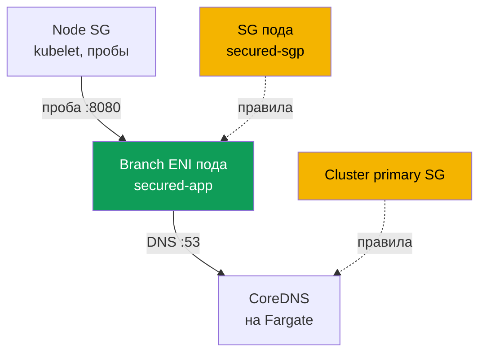
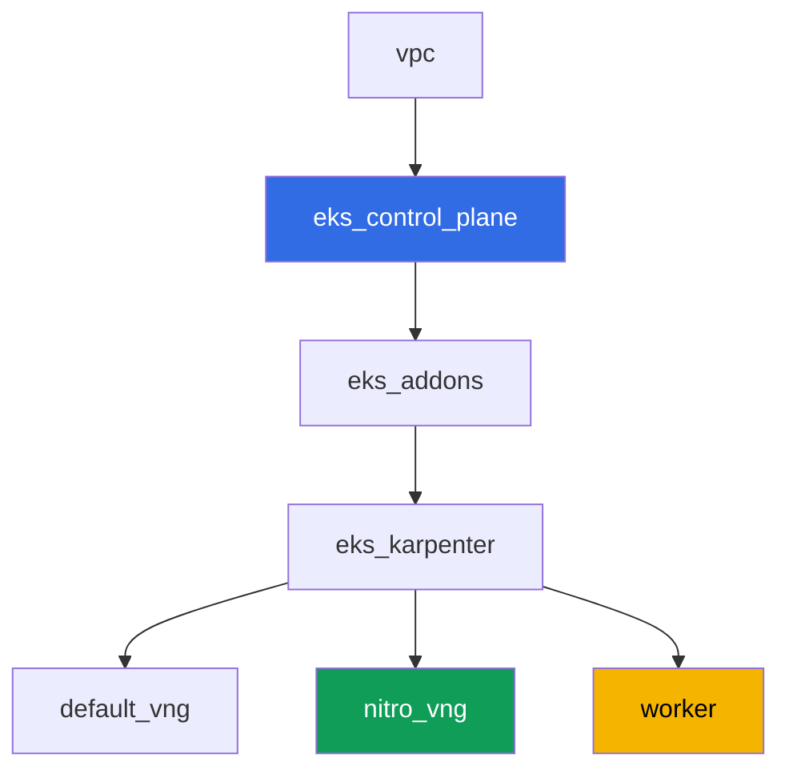

# Лаба 126 - Security groups for pods: branch ENI, под Running, но не Ready

## Описание

Обычно под на EC2-ноде наследует правила security group ноды. Security groups for
pods меняют эту модель: под получает собственную branch ENI и собственный набор
security group, а правила ноды на него больше не действуют. В этой лабе вы включаете
эту функцию, ловите её типичный симптом - под `Running`, но никогда не `Ready`, и DNS
не резолвится - и находите ровно те правила, которых не хватает: вход для проб
kubelet и исходящий/входящий DNS на порту 53. Отдельно вы фиксируете ловушку, из-за
которой этот симптом мерцает в зависимости от того, где физически оказался CoreDNS.

Задания в продакшн-стиле: короткая постановка плюс критерии приёмки. Проверка -
автоматическая, командой `check_result`, а часть шагов с AWS CLI выполняется с вашей
локальной машины (с тем же аккаунтом, которым вы разворачивали лабу), подробности - в
разделе «Инфраструктура».

## Цель

Закрепить материал главы курса:

- [Глава 46. Сетевые сбои](../../course/46/ru.md) - security group как слой сетевого
  сбоя

## Что мы создаём

Кластер развёрнут как код (база, как в лабе 101), с дополнительным NodePool только на
Nitro-инстансах и включённой поддержкой security groups for pods на VPC CNI. Вы
добавляете namespace, свою security group для подов и приложение, которое на неё
натыкается.

| Объект | Что это | Зачем в этой лабе |
|--------|---------|-------------------|
| NodePool `nitro` | Karpenter NodePool без семейства `t` | security groups for pods работают только на Nitro-инстансах |
| Аддон `vpc-cni` с `ENABLE_POD_ENI=true` | конфигурация managed addon | включает trunk interface на нодах |
| Namespace `eks-126` | раздел кластера под нагрузку лабы | держим ресурсы отдельно от системных |
| Security group для подов | создаётся вручную, изначально неполная | источник симптома `Running`, но не `Ready` |
| `SecurityGroupPolicy` `secured-sgp` | привязывает SG к подам с `app: secured` | сам механизм branch ENI |
| Deployment `secured-app` | приложение с readiness-пробой | демонстрирует симптом и его починку |
| Артефакты в `/var/work/tests/artifacts/` | срезы `describe`, DNS-проверки, объяснения | фиксируем каждый шаг диагностики |



## Инфраструктура

Окружение разворачивается в AWS (`eu-central-1`) через Terragrunt. Каждый каталог
лабы - это один компонент со своим `terragrunt.hcl`, который ссылается на общий модуль
в `terraform/modules/` и объявляет зависимости через блоки `dependency`.

### Модули и зависимости

| Каталог (компонент) | Модуль (`terraform/modules/`) | Зависит от | Что создаёт |
|---------------------|-------------------------------|------------|-------------|
| `vpc` | `vpc_v3` | - | VPC `10.10.0.0/16`, публичные и приватные подсети в двух AZ, NAT |
| `ssh-keys` | `ssh-keys` | - | пара SSH-ключей для рабочей машины и нод |
| `eks_control_plane` | `eks_v2_control_plane` | `vpc` | control plane EKS `1.36`, OIDC, security groups |
| `eks_fargate_system` | `eks_v2_fargate` | `vpc`, `eks_control_plane` | Fargate-профиль для `kube-system` и `karpenter` (здесь работает CoreDNS) |
| `eks_addons` | `eks_v2_addons` | `eks_control_plane`, `eks_fargate_system` | coredns, kube-proxy, pod-identity, `vpc-cni` с `ENABLE_POD_ENI=true` |
| `eks_karpenter` | `eks_v2_karpenter` | `vpc`, `eks_control_plane`, `eks_addons`, `eks_fargate_system` | контроллер Karpenter, IAM-роль нод |
| `eks_karpenter_default_vng` | `eks_v2_karpenter_vng` | `vpc`, `eks_control_plane`, `eks_karpenter` | дефолтный NodePool `default` (со семейством `t`) |
| `eks_karpenter_nitro_vng` | `eks_v2_karpenter_vng` | `vpc`, `eks_control_plane`, `eks_karpenter` | NodePool `nitro`, категории `c`/`m`/`r`, поколение `>4`, без taint |
| `worker` | `eks_v2_work_pc` | `ssh-keys`, `vpc`, `eks_control_plane`, `eks_karpenter` | рабочая машина с kubectl, тестами и `check_result` |

Граф зависимостей (что применяется раньше, то ниже по стрелке):



### Почему нужен отдельный NodePool

Security groups for pods работают только на Nitro-инстансах - семейство `t` не
поддерживается (проверено по документации AWS). Дефолтный NodePool лабы допускает
семейство `t` (как в лабе 101), поэтому для этой лабы добавлен второй NodePool
`nitro`: `karpenter.k8s.aws/instance-category In ["c","m","r"]` (это уже исключает
`t`, так как категория отдельная) плюс `instance-generation Gt "4"` как дополнительная
гарантия. У `nitro` нет taint - Deployment `secured-app` попадает туда без
toleration через `nodeSelector: work_type: nitro`.

### Что уже включено в инфраструктуре, а что нужно доделать руками

Terraform лабы уже включает часть предпосылок из документации AWS:

- `ENABLE_POD_ENI=true` и `POD_SECURITY_GROUP_ENFORCING_MODE=standard` заданы в
  `configuration` аддона `vpc-cni` (`eks_addons/terragrunt.hcl`). Режим `standard`
  на VPC CNI `1.11.0+` снимает требование `DISABLE_TCP_EARLY_DEMUX` - отдельно
  патчить `aws-node` не нужно.
- NodePool `nitro` без семейства `t` создан отдельным компонентом.

Управляемая политика `AmazonEKSVPCResourceController` на IAM-роли **control plane**
(не роли ноды - см. задание 2) модулем `terraform-aws-modules/eks/aws` v21 по
умолчанию **не присоединяется** (он вешает только `AmazonEKSClusterPolicy`). Входа
для дополнительных политик кластера в модуле `eks_v2_control_plane` этой версии нет,
и это не тот вход, который можно безопасно добавить только для одной лабы - поэтому
присоединение политики выполняется вручную, командой `aws iam attach-role-policy`, как
часть задания 2, а не через terraform.

IAM-роль рабочей машины в этой лабе намеренно ограничена: у неё есть `ec2:Describe*`
(в том числе `DescribeSecurityGroups`) и `eks:*`, но нет прав на создание/изменение
security group и на управление IAM-политиками произвольных ролей (только на роли с
`-test-` в имени, для других лаб). Поэтому создание security group, правил к ней и
присоединение `AmazonEKSVPCResourceController` в заданиях 2, 3, 5, 6 выполняются с
**вашей локальной машины** - тем же профилем AWS CLI, которым вы разворачивали лабу
через `TASK=126 make run_eks_task`. Все команды `kubectl` и проверочные `aws ec2
describe-security-groups`/`aws eks describe-cluster` (только чтение) выполняются
как обычно на worker по SSH.

## Развёртывание

```bash
TASK=126 make run_eks_task
```

Развёртывание занимает примерно 15-20 минут. В выводе найдите строку с
SSH-подключением к рабочей машине и подключитесь к ней. kubectl там уже настроен на
нужный кластер.

Полезные команды на рабочей машине:

```bash
time_left       # сколько осталось времени окружения
check_result    # проверить решение
```

> Безопасность стенда. В `env.hcl` включены `ssh_password_enable = true` и
> `access_cidrs = ["0.0.0.0/0"]` - это удобно для учебного окружения, но так делать в
> продакшене нельзя. По стандартам курса доступ к рабочим машинам открывают через AWS
> SSM Session Manager без публичных SSH-портов наружу, а `access_cidrs` сужают до
> конкретных адресов. Здесь публичный SSH оставлен только ради простоты запуска.

## Задания

---
|        **1**        | **Namespace для нагрузки лабы**                              |
| :-----------------: | :---------------------------------------------------------- |
| Что делаем          | Создайте namespace `eks-126`. Все объекты лабы создаются внутри него. |
| Критерии приёмки    | - namespace `eks-126` существует. |
---
|        **2**        | **Проверка предпосылок security groups for pods**           |
| :-----------------: | :---------------------------------------------------------- |
| Что делаем          | Проверьте оба предпосылки из документации AWS. Во-первых, узнайте имя IAM-роли control plane (`aws eks describe-cluster --name <cluster> --query cluster.roleArn`) и через `aws iam list-attached-role-policies --role-name <роль>` подтвердите, что к ней присоединена `AmazonEKSVPCResourceController`; если нет - присоединить её командой `aws iam attach-role-policy` (эти команды выполняются с вашей локальной машины, см. раздел «Инфраструктура»). Во-вторых, на worker выполните `kubectl describe daemonset aws-node -n kube-system \| grep ENABLE_POD_ENI`, чтобы подтвердить `ENABLE_POD_ENI=true` (эта часть уже включена terraform-конфигурацией лабы). Сохраните оба подтверждения в файл `/var/work/tests/artifacts/2/prereqs.txt`. |
| Критерии приёмки    | - файл не пуст, содержит `AmazonEKSVPCResourceController` и `ENABLE_POD_ENI`;<br/>- политика реально присоединена к роли control plane (проверяется автотестом через `aws iam list-attached-role-policies`). |
---
|        **3**        | **Неполная security group и SecurityGroupPolicy**            |
| :-----------------: | :---------------------------------------------------------- |
| Что делаем          | С локальной машины создайте security group в VPC лабы (`aws ec2 create-security-group`), без единого inbound-правила и без egress на порт `53` - только AWS-дефолтное allow-all egress можно оставить, ничего сверх него не добавляйте. Тег `karpenter.sh/discovery=<имя кластера>` на неё НЕ ставьте (иначе она попадёт в подсеть выбора EC2NodeClass как SG нод - для этой лабы нужна отдельная SG только для подов). В `eks-126` создайте `SecurityGroupPolicy` `secured-sgp` с `podSelector.matchLabels.app: secured`, ссылающийся на эту SG. Сохраните её ID в файл `/var/work/tests/artifacts/3/sg_id.txt`. |
| Критерии приёмки    | - `SecurityGroupPolicy` `secured-sgp` в `eks-126` существует и ссылается на SG из файла;<br/>- файл `3/sg_id.txt` не пуст и содержит `sg-`. |
---
|        **4**        | **Симптом: Running, но никогда не Ready**                    |
| :-----------------: | :---------------------------------------------------------- |
| Что делаем          | В `eks-126` создайте Deployment `secured-app` (образ `viktoruj/ping_pong:latest`, `1` реплика, `containerPort` и `readinessProbe.httpGet` на порт `8080`), с меткой `app: secured` и `nodeSelector` `work_type: nitro` (toleration не нужен - у NodePool `nitro` нет taint). Под должен запуститься и попасть на branch ENI c вашей SG, но пробы `kubelet` до него не доходят - под виснет `0/1 Ready`. Сохраните `kubectl describe pod` (весь вывод, включая `Events`) в файл `/var/work/tests/artifacts/4/pod_not_ready.txt`. |
| Критерии приёмки    | - Deployment `secured-app` существует, образ `viktoruj/ping_pong`, метка `app: secured`;<br/>- файл `4/pod_not_ready.txt` не пуст и содержит `Readiness probe failed` или `Unhealthy` (симптом до починки в задании 5, к моменту `check_result` под уже может быть `Ready`). |
---
|        **5**        | **Починка проб: правило inbound от SG нод**                 |
| :-----------------: | :---------------------------------------------------------- |
| Что делаем          | Найдите security group нод Karpenter (у ноды, на которой сидит `secured-app`, есть тег/через `aws ec2 describe-instances` по `providerID` пода). С локальной машины добавьте в SG пода inbound-правило TCP `8080` с `--source-group <SG нод>`. Дождитесь, пока `kubelet` пройдёт пробу и под станет `1/1 Ready`. Сохраните итоговый `kubectl get pod secured-app -n eks-126` в файл `/var/work/tests/artifacts/5/pod_ready.txt`. |
| Критерии приёмки    | - `readyReplicas` Deployment `secured-app` равно `1`;<br/>- файл `5/pod_ready.txt` не пуст и содержит `1/1`. |
---
|        **6**        | **Диагностика и починка DNS: egress и обратный ingress**    |
| :-----------------: | :---------------------------------------------------------- |
| Что делаем          | Из-под `secured-app` (`kubectl exec ... -- wget -T 3 -O- kubernetes.default.svc.cluster.local:443`, образ без shell-утилит для DNS, поэтому используйте `wget` с таймаутом или готовый диагностический под `busybox` с `nodeSelector: work_type: nitro` и той же меткой `app: secured`) подтвердите, что резолвинг падает по таймауту - egress `53` в SG пода отсутствует. Добавьте в SG пода outbound-правило `53` TCP и `53` UDP к SG нод (там, на Fargate-CoreDNS, трафик идёт через cluster primary security group - см. раздел «Инфраструктура» лабы 101 про DNS для Fargate). Затем добавьте ОБРАТНОЕ inbound-правило `53` TCP и `53` UDP в ту сторону, куда идёт запрос (cluster primary security group или SG нод, в зависимости от того, куда вы направили egress) - egress без обратного ingress работать не будет. Подтвердите, что резолвинг заработал, и сохраните оба шага (падение и починку) с объяснением обязательности обратного правила в файл `/var/work/tests/artifacts/6/dns_fix.txt`. |
| Критерии приёмки    | - файл `6/dns_fix.txt` не пуст, содержит `53` и слово `обратн` (обратное правило);<br/>- под `secured-app` умеет резолвить `kubernetes.default` (подтверждается артефактом). |
---
|        **7**        | **Ловушка: одна нода, разные security group**               |
| :-----------------: | :---------------------------------------------------------- |
| Что делаем          | Правила SG пода не применяются к трафику между подами на ОДНОЙ ноде - при разных SG у пода и, например, у `kubelet`/`nodeLocalDNS` на той же ноде связь не работает вовсе (разные подсети внутри ноды, маршрутизация отключена), независимо от правил из задания 6. Сравните ноду `secured-app` и ноду CoreDNS: `kubectl get pod secured-app -n eks-126 -o wide` и `kubectl get pods -n kube-system -l k8s-app=kube-dns -o wide`. CoreDNS в этой лабе работает на Fargate, поэтому в обычном случае ноды физически разные, но опишите в артефакте, что если бы CoreDNS оказался на EC2-ноде `secured-app` (например, при переносе CoreDNS с Fargate), починка из задания 6 не сработала бы, потому что дело не в правилах SG, а в отключённой маршрутизации между подсетями подов на одной ноде. Сохраните вывод обеих команд и объяснение в файл `/var/work/tests/artifacts/7/same_node_trap.txt`. |
| Критерии приёмки    | - файл `7/same_node_trap.txt` не пуст;<br/>- содержит имена нод из обеих команд `-o wide` и слово `одной ноде` или `same node`. |
---

## Проверка результата

На рабочей машине запустите автоматическую проверку:

```bash
check_result
```

Скрипт прогонит тесты и покажет процент выполненных заданий. Задание 2 частично, а
задания 3, 5 и 6 частично зависят от команд `aws ec2 create-security-group` и
`aws ec2 authorize-security-group-*`, выполненных с вашей локальной машины (см.
раздел «Инфраструктура») - без них `check_result` не увидит нужных объектов.

## Решение

Эталонное решение: [worker/files/solutions/1.MD](worker/files/solutions/1.MD)

## Удаление кластера и ресурсов

```bash
TASK=126 make delete_eks_task
```
