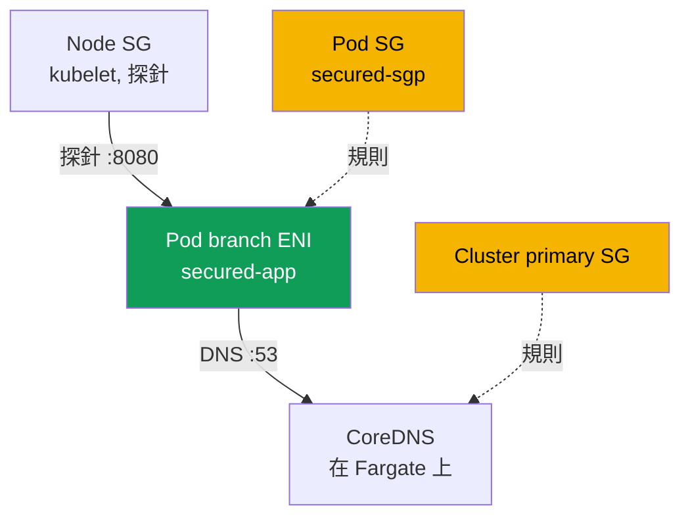
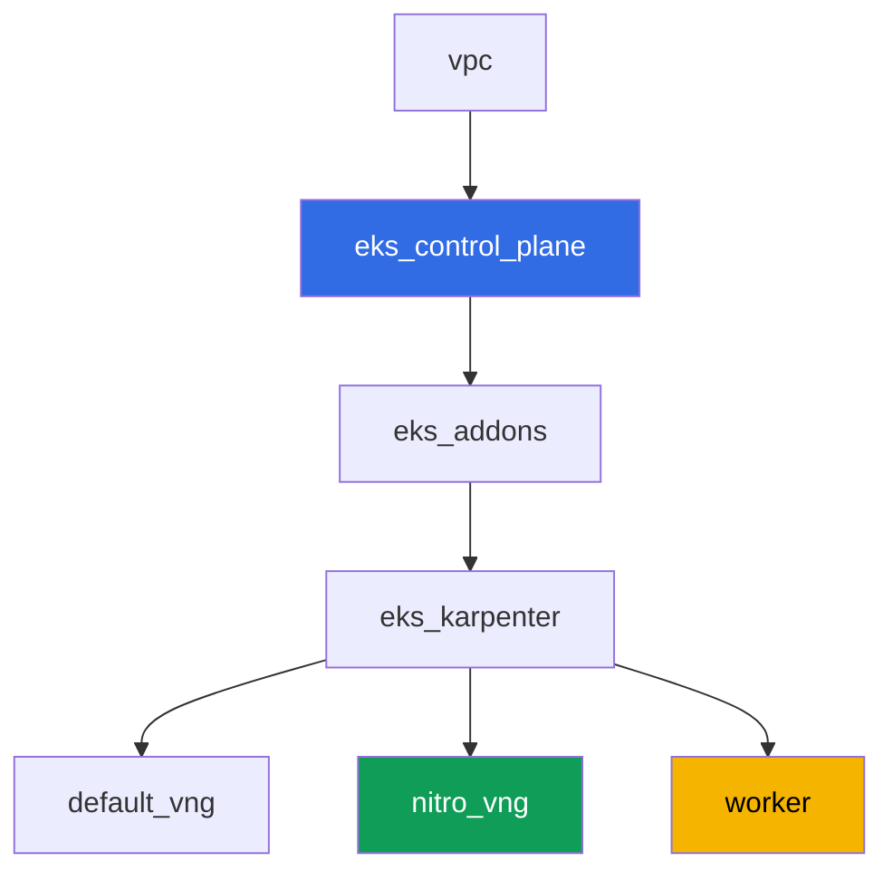

[Русская версия](README_RU.MD) · [Eng version](README.MD) · [Versión en español](README_ES.MD) · [Version française](README_FR.MD) · [Deutsche Version](README_DE.MD) · [ქართული ვერსია](README_GE.MD) · [日本語版](README_JP.MD)

# Lab 126 - Security groups for pods: branch ENI，pod Running 但不 Ready

## 說明

通常 EC2 節點上的 pod 會繼承節點的 security group 規則。Security groups for pods
改變了這個模型：pod 會取得自己的 branch ENI 和自己的一組 security group，節點的規則對它
不再生效。在這個 lab 中，你會啟用這項功能，捕捉它的典型症狀 - pod 處於 `Running`，但永遠
不會 `Ready`，DNS 也無法解析 - 並找出究竟缺少哪些規則：給 kubelet 探針用的 inbound 規則，
以及埠 53 上的 outbound/inbound DNS 規則。另外，你還會弄清楚一個陷阱，這個症狀會因為
CoreDNS 實際落在哪裡而時隱時現。

任務以生產風格撰寫：簡短描述加上驗收標準。驗證是自動的，透過 `check_result` 指令進行，
其中一部分使用 AWS CLI 的步驟要在你的本機執行（用你部署這個 lab 時的同一個帳號） - 詳情見
「基礎架構」一節。

## 目標

鞏固本課程這一章的內容：

- [第 46 章。網路故障](../../course/46/tw.md) - security group 作為網路故障的一層

## 我們要建立什麼

叢集以程式碼形式部署（基礎與 lab 101 相同），額外加上一個只限 Nitro 執行個體的
NodePool，並在 VPC CNI 上啟用了 security groups for pods 支援。你會新增一個 namespace、
自己的 pod security group，以及一個會撞上它的應用程式。

| 物件 | 是什麼 | 為何在這個 lab 中出現 |
|--------|---------|-------------------|
| NodePool `nitro` | 不含 `t` 家族的 Karpenter NodePool | security groups for pods 只在 Nitro 執行個體上運作 |
| 帶有 `ENABLE_POD_ENI=true` 的 `vpc-cni` 附加元件 | managed addon 的設定 | 在節點上啟用 trunk interface |
| Namespace `eks-126` | 供這個 lab 工作負載使用的叢集區段 | 讓資源與系統資源分開 |
| Pod 用的 security group | 手動建立，初始狀態不完整 | `Running` 但不 `Ready` 這個症狀的來源 |
| `SecurityGroupPolicy` `secured-sgp` | 把 SG 綁定到帶有 `app: secured` 標籤的 pod | branch ENI 機制本身 |
| Deployment `secured-app` | 帶有 readiness 探針的應用程式 | 展示症狀及其修復方式 |
| `/var/work/tests/artifacts/` 中的產物 | `describe` 快照、DNS 檢查、說明文字 | 記錄每一步診斷 |



## 基礎架構

環境透過 Terragrunt 部署在 AWS（`eu-central-1`）上。每個 lab 目錄都是一個元件，帶有自己的
`terragrunt.hcl`，它會引用 `terraform/modules/` 中的共用模組，並透過 `dependency` 區塊
宣告依賴關係。

### 模組與依賴關係

| 目錄（元件） | 模組（`terraform/modules/`） | 依賴於 | 建立什麼 |
|---------------------|-------------------------------|------------|-------------|
| `vpc` | `vpc_v3` | - | VPC `10.10.0.0/16`，兩個 AZ 中的公有與私有子網路，NAT |
| `ssh-keys` | `ssh-keys` | - | worker 機器與節點用的 SSH 金鑰對 |
| `eks_control_plane` | `eks_v2_control_plane` | `vpc` | EKS control plane `1.36`，OIDC，security groups |
| `eks_fargate_system` | `eks_v2_fargate` | `vpc`, `eks_control_plane` | 給 `kube-system` 和 `karpenter` 用的 Fargate profile（CoreDNS 在這裡運行） |
| `eks_addons` | `eks_v2_addons` | `eks_control_plane`, `eks_fargate_system` | coredns、kube-proxy、pod-identity、帶有 `ENABLE_POD_ENI=true` 的 `vpc-cni` |
| `eks_karpenter` | `eks_v2_karpenter` | `vpc`, `eks_control_plane`, `eks_addons`, `eks_fargate_system` | Karpenter 控制器、節點 IAM 角色 |
| `eks_karpenter_default_vng` | `eks_v2_karpenter_vng` | `vpc`, `eks_control_plane`, `eks_karpenter` | 預設 NodePool `default`（含 `t` 家族） |
| `eks_karpenter_nitro_vng` | `eks_v2_karpenter_vng` | `vpc`, `eks_control_plane`, `eks_karpenter` | NodePool `nitro`，類別 `c`/`m`/`r`，代數 `>4`，沒有 taint |
| `worker` | `eks_v2_work_pc` | `ssh-keys`, `vpc`, `eks_control_plane`, `eks_karpenter` | 帶有 kubectl、測試和 `check_result` 的 worker 機器 |

依賴關係圖（先套用的在箭頭方向更靠下）：



### 為什麼需要一個獨立的 NodePool

Security groups for pods 只在 Nitro 執行個體上運作 - `t` 家族不受支援（已對照 AWS
文件確認）。這個 lab 預設的 NodePool 允許 `t` 家族（與 lab 101 相同），所以為這個 lab
額外加了第二個 NodePool `nitro`：`karpenter.k8s.aws/instance-category In
["c","m","r"]`（因為類別是獨立的，這已經排除了 `t`），再加上 `instance-generation Gt
"4"` 作為額外保障。`nitro` 沒有 taint - Deployment `secured-app` 不需要 toleration
就能透過 `nodeSelector: work_type: nitro` 落在那裡。

### 基礎架構裡已經包含了什麼，還有什麼需要手動完成

這個 lab 的 Terraform 已經涵蓋了 AWS 文件中部分的先決條件：

- `vpc-cni` 附加元件的 `configuration` 中的 `ENABLE_POD_ENI=true`
  （`eks_addons/terragrunt.hcl`） - 這會在節點上建立一個 trunk interface，描述為
  `aws-k8s-trunk-eni`。
- `POD_SECURITY_GROUP_ENFORCING_MODE=strict`（預設值），再加上
  `init.env.DISABLE_TCP_EARLY_DEMUX=true`。這個組合是刻意選擇的 - 理由在下面。
- 不含 `t` 家族的 NodePool `nitro` 由一個獨立的元件建立。

這個模式值得單獨說明，因為這個 lab 的症狀能否重現全都取決於它。這項功能有兩種模式，
文件是這樣描述其差異的：在 `standard` 模式下，pod 的 security group 規則**不會套用**到
pod 與同一節點上服務（包括 `kubelet`）之間的流量。也就是說，即使 security group 裡連一條
inbound 規則都沒有，readiness 探針也會通過，「`Running`，但不 `Ready`」這個症狀就無法得到
（已在測試台上驗證：pod 立刻變成 `1/1`）。因此這個 lab 運作在 `strict` 模式下，探針會經過
pod 的 branch ENI，並受 pod SG 規則約束。代價是 `aws-node` init container 上必須有
`DISABLE_TCP_EARLY_DEMUX=true`：沒有它，`kubelet` 根本無法對 branch ENI 上的 pod 開啟
TCP 連線，任務 5 中加入的規則也不會修好任何東西。在 `standard` 模式下不需要這個旗標 -
但整個 lab 的重點也隨之消失。

Managed policy `AmazonEKSVPCResourceController` 掛在 **control plane** 的 IAM 角色上
（不是節點角色 - 見任務 2），模組 `terraform-aws-modules/eks/aws` v21 預設**不會**掛載
它（它只掛 `AmazonEKSClusterPolicy`）。這個版本的 `eks_v2_control_plane` 模組沒有額外
叢集政策的輸入，而這也不是那種可以只為一個 lab 就安全加進去的輸入 - 所以掛載這個政策是
手動用 `aws iam attach-role-policy` 完成的，作為任務 2 的一部分，而不是透過 terraform。

所有任務都是在 worker 機器上透過 SSH 執行的，跟課程其他 lab 一樣。為此，
`eks_v2_work_pc` 模組加入了以前沒有的權限：`ec2:CreateSecurityGroup`、
`ec2:DeleteSecurityGroup`、`ec2:AuthorizeSecurityGroupEgress`、
`ec2:RevokeSecurityGroupEgress`（模組原本就有 inbound 規則的權限）、
`iam:ListAttachedRolePolicies`，以及一個範圍很窄的 `iam:AttachRolePolicy` - 只能用在
`*-cluster-*` 角色上，且只在 `iam:PolicyARN` 條件為
`AmazonEKSVPCResourceController` 政策時才允許。沒有最後這一項，任務 2 就無法完成，其
自動化檢查也會無論學員做什麼都失敗：測試會從 worker 機器讀取
`aws iam list-attached-role-policies`，而它原本沒有這個呼叫的權限。

## 部署

```bash
TASK=126 make run_eks_task
```

部署大約需要 15-20 分鐘。在輸出中找到 worker 機器 SSH 連線的那一行並連上去。那裡的
kubectl 已經設定好指向正確的叢集。

worker 機器上的實用指令：

```bash
time_left       # 環境剩餘多少時間
check_result    # 檢查解答
```

> 環境安全性。`env.hcl` 中啟用了 `ssh_password_enable = true` 和
> `access_cidrs = ["0.0.0.0/0"]` - 這對訓練環境很方便，但在生產環境中不能這樣做。依照
> 課程標準，worker 機器的存取應透過 AWS SSM Session Manager，不對外公開 SSH 埠，
> `access_cidrs` 應限縮到特定位址。這裡保留公開 SSH 只是為了簡化啟動流程。

## 任務

---
|        **1**        | **這個 lab 工作負載用的 namespace**                              |
| :-----------------: | :---------------------------------------------------------- |
| 要做什麼          | 建立 namespace `eks-126`。這個 lab 的所有物件都建立在裡面。 |
| 驗收標準    | - namespace `eks-126` 存在。 |
---
|        **2**        | **檢查 security groups for pods 的先決條件**           |
| :-----------------: | :---------------------------------------------------------- |
| 要做什麼          | 檢查 AWS 文件中的兩個先決條件。首先，找出 control plane IAM 角色的名稱（`aws eks describe-cluster --name <cluster> --query cluster.roleArn`），並用 `aws iam list-attached-role-policies --role-name <角色>` 查看 `AmazonEKSVPCResourceController` 是否已掛載到它上面；預設情況下沒有 - 用 `aws iam attach-role-policy` 掛載它。這個政策要掛在 control plane 的角色上，不是節點角色：branch ENI 是由 EKS 那一側的控制器建立和刪除的。其次，執行 `kubectl describe daemonset aws-node -n kube-system \| grep -E 'ENABLE_POD_ENI\|POD_SECURITY_GROUP_ENFORCING_MODE\|DISABLE_TCP_EARLY_DEMUX'` - 這三個值已經由這個 lab 的 terraform 設定好了，弄清楚為什麼每一個都是必要的（見「基礎架構」一節）。叢集名稱從 kubeconfig 取得：`kubectl config current-context \| awk -F/ '{print $NF}'`。把兩項確認結果都存到檔案 `/var/work/tests/artifacts/2/prereqs.txt`。 |
| 驗收標準    | - 檔案不是空的，包含 `AmazonEKSVPCResourceController` 和 `ENABLE_POD_ENI`；<br/>- 政策確實掛在 control plane 的角色上（由自動測試透過 `aws iam list-attached-role-policies` 驗證）。 |
---
|        **3**        | **不完整的 security group 與 SecurityGroupPolicy**            |
| :-----------------: | :---------------------------------------------------------- |
| 要做什麼          | 在這個 lab 的 VPC 中建立一個 security group（`aws ec2 create-security-group`），並且不要為它加入任何一條規則：一個全新的 SG 只有 AWS 預設的 allow-all egress 和零條 inbound 規則 - 這正是會產生症狀的狀態。不要給它加上 `karpenter.sh/discovery=<叢集名稱>` 標籤（否則它會被 EC2NodeClass 選中當作節點 SG - 這個 lab 需要一個只給 pod 用的獨立 SG）。在 `eks-126` 中建立一個 `SecurityGroupPolicy` `secured-sgp`，帶有 `podSelector.matchLabels.app: secured`，引用這個 SG。把它的 ID 存到檔案 `/var/work/tests/artifacts/3/sg_id.txt`。 |
| 驗收標準    | - `eks-126` 中的 `SecurityGroupPolicy` `secured-sgp` 存在，並引用檔案中的 SG；<br/>- 檔案 `3/sg_id.txt` 不是空的，包含 `sg-`。 |
---
|        **4**        | **症狀：Running，但永遠不 Ready**                    |
| :-----------------: | :---------------------------------------------------------- |
| 要做什麼          | 在 `eks-126` 中建立 Deployment `secured-app`（image `viktoruj/ping_pong:latest`，`1` 個副本，`containerPort` 和 `readinessProbe.httpGet` 都在埠 `8080`），帶有標籤 `app: secured` 和 `nodeSelector` `work_type: nitro`（不需要 toleration - `nitro` NodePool 沒有 taint）。pod 會啟動並落到帶有你的 SG 的 branch ENI 上，但 `kubelet` 探針無法到達它 - pod 卡在 `0/1 Ready`，並出現類似 `Readiness probe failed: Get "http://<pod ip>:8080/": context deadline exceeded` 的事件。順便確認這個 pod 確實在 branch ENI 上：它帶有 `vpc.amazonaws.com/pod-eni` 註解和 `vpc.amazonaws.com/pod-eni: 1` 限制，且 `aws ec2 describe-network-interfaces --filters Name=group-id,Values=<你的 SG>` 顯示一個 `InterfaceType: branch` 的介面。把 `kubectl describe pod` 的完整輸出（包括 `Events`）存到檔案 `/var/work/tests/artifacts/4/pod_not_ready.txt`。 |
| 驗收標準    | - Deployment `secured-app` 存在，image 為 `viktoruj/ping_pong`，標籤 `app: secured`；<br/>- 檔案 `4/pod_not_ready.txt` 不是空的，包含 `Readiness probe failed` 或 `Unhealthy`（症狀在任務 5 中被修復，所以到 `check_result` 執行時 pod 可能已經是 `Ready`）。 |
---
|        **5**        | **修復探針：來自節點 SG 的 inbound 規則**                 |
| :-----------------: | :---------------------------------------------------------- |
| 要做什麼          | 找出 Karpenter 節點的 security group：取得 `secured-app` 所在節點的 `providerID`，然後查詢 `aws ec2 describe-instances --instance-ids <id> --query 'Reservations[0].Instances[0].SecurityGroups'`。在 pod 的 SG 中加入一條 TCP `8080` 的 inbound 規則，`--source-group <節點 SG>`。探針會在下一個週期就通過，pod 會在幾秒內變成 `1/1 Ready`。把最終的 `kubectl get pod -n eks-126 -l app=secured` 存到檔案 `/var/work/tests/artifacts/5/pod_ready.txt`。 |
| 驗收標準    | - Deployment `secured-app` 的 `readyReplicas` 等於 `1`；<br/>- 檔案 `5/pod_ready.txt` 不是空的，包含 `1/1`。 |
---
|        **6**        | **診斷並修復 DNS：egress 和反向的 ingress**    |
| :-----------------: | :---------------------------------------------------------- |
| 要做什麼          | `viktoruj/ping_pong` 這個 image 既沒有 shell 也沒有 `wget`（`kubectl exec` 會回傳 `executable file not found`），所以要檢查 DNS，請在 `eks-126` 中另外跑一個帶有 `app: secured` 標籤和 `nodeSelector: work_type: nitro` 的 `busybox` pod - 這個標籤很重要，否則 `secured-sgp` 不會套用到它，檢查就毫無意義。在裡面執行 `nslookup kubernetes.default.svc.cluster.local`，會得到 `connection timed out; no servers could be reached`。現在找出封包究竟在哪裡被丟掉：你的 SG 有預設的 allow-all egress，所以請求可以順利離開，但接收方的 security group 完全沒有對應的規則。這個 lab 中的 CoreDNS 運行在 Fargate 上，位於 **cluster primary security group** 之後（`aws eks describe-cluster --query cluster.resourcesVpcConfig.clusterSecurityGroupId`）。為它加上一條 inbound `53` TCP 和 `53` UDP，`--source-group <pod SG>`，然後重複 `nslookup` - 解析就會成功。接著再做第二步，遵循最小權限原則：從 pod 的 SG 中移除預設的 allow-all egress，改為加上一條明確的 egress `53` TCP 和 UDP 指向 cluster primary SG - DNS 仍然可以運作。把兩種狀態以及哪一側需要哪一條規則的說明，都存到檔案 `/var/work/tests/artifacts/6/dns_fix.txt`。規則需要在接收方的入站 (inbound) 一側，這一點務必在檔案中寫清楚。 |
| 驗收標準    | - 檔案 `6/dns_fix.txt` 不是空的，包含 `53` 以及規則需要在接收方入站 (`inbound` 或 `ingress`) 一側的說明；<br/>- 帶有 `app: secured` 標籤的 pod 能解析 `kubernetes.default.svc.cluster.local`（由產物確認）。 |
---
|        **7**        | **同一個節點，不同的 security group：實際會發生什麼** |
| :-----------------: | :---------------------------------------------------------- |
| 要做什麼          | 實際驗證一下，同一個節點上帶有不同 security group 的兩個 pod 之間，SG 規則是否有效。建立第二個 security group（例如 `eks-task126-other-pod-sg`），第二個 `SecurityGroupPolicy` `other-sgp` 對應標籤 `app: other`，並跑一個帶有這個標籤的 `busybox` pod，透過 `nodeName` 把它固定在 `secured-app` 所在的**同一個**節點上。從它去存取 `secured-app` pod 的 IP，埠 `8080`（`wget -T 10 -qO- http://<ip>:8080/`）。做兩次：第一次沒有允許的規則 - 你會得到 `download timed out`，然後在 `secured-app` 的 SG 中加入一條 inbound `8080`，`--source-group <第二個 SG>`，再重複一次 - 請求會成功。要記錄在產物中的結論：在 `strict` 模式下，pod 的 SG 規則即使在同一個節點內也會套用，所以這個問題可以用一條規則解決。另外，也要記下與 `standard` 模式的對比：在那裡，依照 AWS 文件，同一節點上 pod 與服務之間的流量**不會**套用 SG 規則，同一節點上帶有不同 SG 的 pod 完全無法互通 - 而這無法用規則修復。把兩次執行結果、兩個 pod 的 `kubectl get pod -o wide` 輸出，以及說明，都存到檔案 `/var/work/tests/artifacts/7/same_node_trap.txt`。 |
| 驗收標準    | - 檔案 `7/same_node_trap.txt` 不是空的；<br/>- 包含 `secured-app` 所在的節點名稱、修復前的狀態（`timed out`），以及 `strict` 和 `standard` 兩種模式之間差異的說明。 |
---

### 值得帶走的三個結論

以下內容都已在實際測試台上驗證過，並且與這個主題常見的轉述說法相矛盾。

**症狀取決於模式，而不是取決於規則寫得有多仔細。** 在 `strict` 模式下，`kubelet` 探針
會經過 branch ENI，並受 pod SG 規則約束 - 因此才會出現 `Readiness probe failed:
context deadline exceeded`，並且只需一條 inbound 規則就能修復。在 `standard` 模式下，
同一個 pod 用同一個空的 security group 會立刻變成 `Ready`：規則不會套用到節點內部的
流量。在到規則裡找錯誤之前，先檢查 `aws-node` 上的 `POD_SECURITY_GROUP_ENFORCING_MODE`。

**Pod 的 egress 幾乎從來不是問題所在。** 一個全新的 security group 有預設的 allow-all
egress，所以請求可以順利離開。DNS 是在另一側出問題的：CoreDNS 所在的 cluster primary
security group 沒有對 pod SG 的 inbound 規則。規則正好需要加在那裡，而且一條就夠 -
security group 是 stateful 的，對已允許請求的回應會自動返回，不需要另外的規則。為此並不
需要允許 pod 所有的 outbound 流量：把 egress 收窄到 `53` 之後，DNS 仍然可以運作（任務 6
的第二步）。

**只要模式是 `strict`，共用同一個節點就不會造成阻礙。** 關於同一節點上帶有不同 security
group 的 pod 的那個文件化限制，適用於 `standard` 模式。在 `strict` 模式下，這樣的兩個
pod 一開始無法連線，加入規則之後就能連線 - 這說明是規則決定結果，而不是拓撲結構。這個限制
仍然值得了解：在 `standard` 模式下，同樣的情況無法用規則修復，這會改變診斷的思路。

## 檢查結果

在 worker 機器上執行自動檢查：

```bash
check_result
```

腳本會跑一遍測試，並顯示已完成任務的百分比。部分檢查會查看 AWS API，不只是 Kubernetes
物件：政策是否掛在叢集角色上，`SecurityGroupPolicy` 中的 security group 是否存在。還有
一項獨立的檢查會自己起一個帶有 `app: secured` 標籤的 pod，並要求 DNS 在裡面真的能解析 -
單靠產物是不夠的。

## 解答

參考解答：[worker/files/solutions/1_TW.MD](worker/files/solutions/1_TW.MD)

## 刪除叢集與資源

> **這裡的清理順序很關鍵，否則 `destroy` 不會完成。** 在這個 lab 中，你直接在測試環境
> 的 VPC 裡手動建立了 security group `eks-task126-secured-pod-sg`（它不在 terraform 的
> state 裡），在 terraform 所擁有的 **cluster primary security group** 上加入了規則，
> 並啟用了 security groups for pods - 也就是說 pod 建立了 **branch ENI**。這三點中的
> 每一項都會單獨阻止刪除：外部的 security group 不會讓 VPC 被刪除，一個 SG 對另一個
> SG 的引用不會讓目標 SG 被刪除，而存活的 branch ENI 會同時佔用 SG 和子網路。症狀是
> security group、VPC 或 Internet Gateway 上出現 `Still destroying...`。

```bash
# 1. 從 SecurityGroupPolicy 移除工作負載，讓 branch ENI 得以釋放
kubectl delete namespace eks-126 --ignore-not-found

# 2. 等到 branch ENI 消失，Karpenter 移除它的 EC2 節點
SG_ID=$(aws ec2 describe-security-groups \
  --filters "Name=group-name,Values=eks-task126-secured-pod-sg" \
  --query 'SecurityGroups[0].GroupId' --output text)
while [ "$(aws ec2 describe-network-interfaces --filters "Name=group-id,Values=${SG_ID}" \
    --query 'length(NetworkInterfaces)' --output text)" != "0" ]; do
  echo "branch ENI 仍然存在，等待中..."; sleep 15
done
while kubectl get nodes --no-headers 2>/dev/null | grep -qv fargate; do
  echo "Karpenter 的 EC2 節點仍然存在，等待中..."; sleep 15
done

# 3. 移除你加到 cluster primary SG 上、引用你自己 SG 的規則
CLUSTER=$(kubectl config current-context | awk -F/ '{print $NF}')
CLUSTER_PRIMARY_SG=$(aws eks describe-cluster --name "$CLUSTER" \
  --query 'cluster.resourcesVpcConfig.clusterSecurityGroupId' --output text)
aws ec2 revoke-security-group-ingress --group-id "$CLUSTER_PRIMARY_SG" \
  --protocol tcp --port 53 --source-group "$SG_ID"
aws ec2 revoke-security-group-ingress --group-id "$CLUSTER_PRIMARY_SG" \
  --protocol udp --port 53 --source-group "$SG_ID"

# 4. 刪除你自己的兩個 security group。順序很重要：先移除第一個 SG
#    對第二個的引用，否則第二個無法刪除
SG2_ID=$(aws ec2 describe-security-groups \
  --filters "Name=group-name,Values=eks-task126-other-pod-sg" \
  --query 'SecurityGroups[0].GroupId' --output text)
aws ec2 revoke-security-group-ingress --group-id "$SG_ID" \
  --protocol tcp --port 8080 --source-group "$SG2_ID"
aws ec2 delete-security-group --group-id "$SG2_ID"
aws ec2 delete-security-group --group-id "$SG_ID"
```

你不需要手動移除任務 2 中掛到 control plane 角色上的 `AmazonEKSVPCResourceController`
政策：upstream 模組建立這個角色時帶有 `force_detach_policies = true`（已在模組原始碼中
確認），所以 terraform 會自己移除它，角色的刪除不會碰到 `DeleteConflict`。

```bash
TASK=126 make delete_eks_task
```

如果 `destroy` 仍然卡在某處，用同樣的思路找出佔用者：誰在使用這個 SG，哪些 SG 在規則中
引用了它，以及是否有孤兒 ENI（包括 security groups for pods 的 `branch` 類型和 VPC CNI
的次要類型）：

```bash
aws ec2 describe-network-interfaces --filters "Name=group-id,Values=<sg-id>" \
  --query 'NetworkInterfaces[].[NetworkInterfaceId,Status,InterfaceType,Description]' --output table
aws ec2 describe-security-groups --filters "Name=ip-permission.group-id,Values=<sg-id>" \
  --query 'SecurityGroups[].[GroupId,GroupName]' --output table
aws ec2 describe-network-interfaces --filters Name=status,Values=available \
  --query 'NetworkInterfaces[].[NetworkInterfaceId,Description,Groups[0].GroupName]' --output table
```
